<p align="center">
  
</p>

<h1 align="left">Praxist: meet your personal R&amp;D team</h1>

<p align="center">
  <a href="../../actions/workflows/ci.yml"></a>
  <a href="https://praxist.sapient.inc/en/docs"></a>
  <a href="https://arxiv.org/abs/2608.25955"></a>
  <a href="https://discord.gg/sapient"></a>
  
</p>

Praxist is an autonomous research system for measurable, computer-executable
research. It coordinates parallel research peers, task-owned evaluation,
durable evidence, and generation-to-generation synthesis.

Praxist treats research as a persistent process rather than a sequence of
disconnected prompts. Use it when a project already runs and its objective is
measurable, but the best path forward is still unknown.

<p align="center">
  
</p>

## Install Praxist

Install the complete runtime integrations and finish first-use setup with one
command:

```bash
python3 -m pip install --index-url https://pypi.org/simple "praxist[agents,codex]" && praxist setup --interactive --install-skills codex
```

The local wizard covers the Fair Source License, User Agreement, privacy,
runtime profile, masked credentials, Codex skills, writable examples,
and readiness checks. It does not select a research project or launch a run.
For Claude Code, use the
[host-specific one-line command](docs/getting-started/installation.md#install-and-configure).

For an agent-managed installation, open Codex:

```bash
codex --yolo
```

Then ask it to install and configure Praxist using the packaged OOBE runbook,
and to stop after readiness checks.

Before starting research, read the [Quickstart](docs/getting-started/quickstart.md)
and [Your First Task](docs/getting-started/first-task.md). They describe the
separate takeover step and the project contract it creates.

Choose **Codex-native mode** to use an existing Codex subscription without an
API key. For sustained research, Praxist generally favors
[open-source model APIs](docs/guides/open-source-model-apis.md) with a high
observed cache-hit rate. The setup wizard also supports other API-backed
profiles.

## Use Praxist Through Codex

We recommend Codex as the interface for operating Praxist. Praxist is not a
replacement for Codex: Codex remains the interactive agent that understands
your project, communicates with you, and uses development tools. Praxist adds
the persistent research loop, parallel peers, evidence protocols, scheduling,
and lifecycle control.

After installation, open Codex in the root of an already runnable research
project and invoke `$praxist-takeover`. The takeover skill inspects readiness,
creates or repairs the task harness, validates its evaluator and evidence
contract, and launches the run after the required gates pass. A precise brief
produces a better research plan; include the objective, metrics, constraints,
resources, exploration choices, and whether launch is authorized.

<details>
<summary>Example takeover brief</summary>

```text
$praxist-takeover

Treat the current directory as the existing runnable research project. Verify
the baseline and its evaluation path before changing anything.

Optimize <primary metric and direction> while preserving <key constraints>.
Use <peer count> peers for up to <generation count> generations within
<time or cost budget>. Use the runtime and model provider selected during
setup. <Allow or disable> literature search, <enable or disable> QD, and
<enable or disable> generation-zero DIG.

Do not download new datasets or replace required project assets. Build a
separate task harness with explicit metric directions, baseline provenance,
protocol-integrity checks, evidence maturity rules, and justified retention
lanes. After readiness checks pass, <launch immediately in detached mode / ask
for confirmation>. Report the task path, run ID, evidence contract, generation
close policy, and monitor command.
```

</details>

Other bundled skills:

| Skill | Purpose |
|---|---|
| `praxist-takeover-codex` | No-key takeover using the saved Codex login |
| `praxist-onboarding` | Explain Praxist and inspect local readiness |
| `praxist-task-initialization` | Build or repair a task harness without launching |
| `praxist-interactive-task-init` | Design a task through confirmation-first setup |
| `praxist-control` | Start, stop, resume, monitor, and inspect runs |
| `praxist-diagnostic` | Diagnose run health and produce reports |
| `praxist-scientific-research` | Gather sourced literature and benchmark context |
| `praxist-runtime-install` | Install or repair runtime dependencies and credentials |
| `terminal-line-plot` | Draw metric trends in the terminal |

See [Agent Skills](docs/user-guide/skills.md) for invocation syntax and the
generated [Skills Reference](docs/reference/skills.md) for the complete
contracts.

## What Praxist Provides

| Capability | Purpose |
|---|---|
| Parallel research peers | Explore competing hypotheses and implementations concurrently |
| Multi-generation synthesis | Carry useful evidence and strategy into later generations |
| Durable evidence lanes | Preserve candidates through incubator, frontier, and Gems state |
| Multi-metric evaluation | Rank task-defined evidence, including Pareto-optimal tradeoffs |
| [Quality-Diversity (QD)](docs/guides/qdig-cohort-allocator.md) and optional [Deep Innovation Gate (DIG)](docs/guides/deep-innovation-gate.md) | Maintain diversity without forcing one exploration policy |
| Central resource scheduling | Adapt experiment admission to observed resource pressure |
| Resume, replay, and monitoring | Keep long-running research inspectable and recoverable |
| Plugin boundaries | Support multiple runtimes, providers, tools, budgets, and workflows |

## Praxist And The Task Project

| Praxist owns | The task project owns |
|---|---|
| Research orchestration, lifecycle, evidence protocols, replay, scheduling, and extension interfaces | Research objective, executable code, evaluator, metrics, baselines, prompts, roles, and domain constraints |

Praxist contains no task-specific scientific assumptions. A task remains the
single source of truth for what should be tested and what counts as valid evidence.

## Operate A Run

```bash
praxist status --json
praxist --monitor --latest
praxist stop <run_id>
praxist resume <run_dir>
```

`Ctrl-C` closes only the monitor; it does not stop the research run.

## Examples And Templates

```bash
praxist examples list
praxist examples install rocket_booster_recovery
praxist examples install rocket_booster_recovery_rust
```

Complete examples are writable reference projects. `templates/tasks/` contains
replaceable scaffolding for building new task harnesses. The two Rocket Booster
Recovery examples demonstrate the same research problem through Python/JAX and
native Rust implementations.

## Requirements

| Status | Requirement |
|---|---|
| Required | CPython 3.11+ |
| Required to launch research | A runnable project with measurable evaluation |
| Required for skill-driven operation | Codex or Claude Code; direct CLI operation remains available without either |
| Authentication: choose one | A saved Codex login for Codex-native mode, or a supported provider API key |
| Continuously release-tested | Linux on CPython 3.11 and 3.12 |
| Compatibility target | macOS and other CPython 3.11+ environments; run `praxist doctor` before research |

Task-specific datasets and compute dependencies remain owned by the task project.

See the [platform support matrix](docs/operations/platform-support.md) for the
difference between release-qualified hosts and compatibility targets.

## Documentation

Read the **[Praxist documentation](https://praxist.sapient.inc/en/docs)**
or open it with:

```bash
praxist docs
```

No local documentation server is required.

## Contributing To Praxist

Read the [contribution guide](.github/CONTRIBUTING.md) together with the
[Code of Conduct](.github/CODE_OF_CONDUCT.md) before participating. Source
maintainers should also follow the architecture and maintenance contract in
[AGENTS.md](AGENTS.md). See the [Privacy Notice](docs/legal/PRIVACY.md) for
Praxist's data-handling terms.

Contact: praxist@sapient.inc

## FAQ

<details>
<summary>Show questions and answers</summary>

### Q1. What is Praxist?

Praxist is an autonomous research system for measurable research problems that
can be executed on a computer. It turns an already runnable project into a
continuous, evidence-driven research run.

Across successive generations, parallel research agents develop candidate
solutions; evaluators convert results into structured evidence; and a planning
panel synthesizes that evidence into the research agenda for the next
generation. The cycle continues until the search converges or the budget is
exhausted.

You provide a runnable project and a measurable objective. Praxist orchestrates
the research process that searches for the best-performing solution.

### Q2. How is Praxist different from manual tuning or AutoML?

AutoML tunes parameters within a predefined search space. Praxist runs the full
research loop.

Parallel research agents can change methods, architectures, and strategies.
Evidence from evaluation shapes the agenda for the next generation, while the
[Deep Innovation Gate (DIG)](docs/guides/deep-innovation-gate.md) and
[Quality-Diversity (QD)](docs/guides/qdig-cohort-allocator.md) allocation help
the system escape local optima.

Praxist is closer to a self-directing research team than a search tool. If your
researchers are already iterating on a problem manually, Praxist takes over the
iteration loop itself.

### Q3. Is my project a good fit for Praxist?

Praxist delivers the most value when three conditions are met:

- **The objective is measurable:** there is at least one metric that
  meaningfully distinguishes better from worse, with a clear optimization
  direction.
- **The project already runs:** the baseline code, environment, and required
  data or simulator are in place and work without Praxist.
- **The best path forward is unknown.**

If a prerequisite is missing, Praxist stops and tells you exactly what is
needed. It will not silently download unspecified datasets, invent a simulator,
or fabricate baseline performance. That is a deliberate design principle.

### Q4. Do I need an API key, and what will it cost?

No API key is required in Codex-native mode; Praxist uses your authenticated
Codex session. We also recommend using your own API key to access supported
model APIs.

API costs are set by the provider and vary by model and usage. Total cost also
depends on parallelism, the number of generations, and evaluation runtime. For
cost-sensitive runs, start with a small representative workload before scaling
up.

### Q5. How does Praxist protect my code and data?

Praxist provides three layers of protection:

- **Project isolation:** Praxist does not modify your original project. Run
  artifacts are stored separately.
- **Credentials:** API keys are entered through a masked local prompt and are
  not exposed in commands, shell history, or conversations.
- **Data collection:** Praxist does not collect data used in your experiments.
  It collects only limited system-level operational information, which you can
  disable at any time.

### Q6. How can I trust that a reported improvement is real?

Praxist uses three safeguards:

- **Preregistration:** Metrics, evaluation protocols, baselines, and acceptance
  thresholds are defined before the run.
- **Consistent evaluation:** Every candidate is measured through the same
  evaluator, and invalid or suspicious results are excluded.
- **End-to-end provenance:** Every reported improvement includes the evidence
  and lineage needed to inspect and reproduce it.

We recommend reviewing what the selected solution changed and testing it again
in your own environment. Praxist's results are designed to be verifiable, and
your own validation should be the final test.

### Q7. What if Praxist does not improve the result?

Praxist does not guarantee a specific metric improvement. It provides a
rigorous research process and auditable evidence.

If a run does not meet its target, you still receive a negative-result evidence
package, an audit report, and recommendations on whether to stop or redirect
the research.

A negative result can still be valuable: it rules out tested approaches with
evidence and helps prevent further investment in an unproductive direction.

### Q8. Is Praxist open source, and what terms apply to its outputs?

Praxist is licensed under the Fair Source License Agreement 1.0. The precise
description is source-available: the complete source code is publicly
available and may be viewed, downloaded, and modified. Subject to the license
terms, Praxist may be used for internal business purposes and deployed within
your own organization.

Organizations with aggregate annual revenue, including revenue from
affiliates, below US$1 million may use Praxist commercially at no charge. Once
annual revenue reaches or exceeds that threshold, the organization must
contact the Licensor, Sapient Intelligence Pte Ltd, to negotiate a Commercial
License.

The revenue threshold does not apply to qualifying teaching and academic
research conducted by institutions of higher education, public research
institutions, and nonprofit academic research organizations.

**Generated outputs:** no attribution is required for internal use. If an
output is published externally or otherwise made available to third parties,
the product-name attribution "Praxist by Sapient Intelligence" must be
retained.

This FAQ is a summary only. If it conflicts with the Fair Source License
Agreement 1.0, the terms of the license agreement control.

</details>

## Citation

If you use Praxist in your research, please cite:

```bibtex
@misc{li2026praxistexperimentalartifactssolution,
      title={Praxist: From Experimental Artifacts to Solution Lineages},
      author={Jin Li and Ahmed Murtadha and Zhiyu Wang and Qiwen Chen and William Chen and Yifei Wu and Guan Wang and Andy L. Siy and Jiayi Yang and Mengsha Huang and Wenhao Li and Yixuan Liu and Shuailin Pan and Mingli Yuan and Sen Song and Yuhao Sun},
      year={2026},
      eprint={2608.25955},
      archivePrefix={arXiv},
      primaryClass={cs.MA},
      url={https://arxiv.org/abs/2608.25955},
}
```
