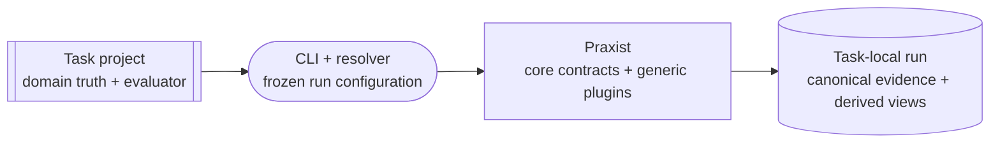

# Architecture

Praxist is a task-agnostic autonomous-research control plane:

```text
stable core contracts + generic plugins + explicit external task projects
```

<div class="praxist-diagram" markdown>



</div>

## Ownership Boundary

| Owner | Responsibilities | Must not own |
|---|---|---|
| Praxist core | Stable protocols, resolution, canonical storage, replay, credentials, budgets, and extension interfaces | Task facts, provider wire objects, or workflow implementation details |
| Generic plugins | Replaceable runtimes, API providers, workflow stages, tools, graph maintenance, topology, and budget policy | Facts or prompts usable only by one task |
| Task project | Objective, baseline, evaluator, metrics, evidence policy, roles, prompts, assets, and scientific constraints | Praxist source or another task's state |
| Run directory | Frozen configuration, artifacts, evidence, lifecycle state, and replay records for one run | Mutable task configuration as current truth |

The only system package is `praxist`. A component is generic only when two
unrelated task projects can use it without importing one task's private facts.
The complete task contract is defined in [Task Projects](../guides/task-projects.md);
templates and complete examples are classified in
[Examples And Templates](../guides/examples-and-templates.md).

Run artifacts never belong in the Praxist checkout. [Task Projects](../guides/task-projects.md#experiments-directory)
owns output-path selection and the task-local run boundary.

## Core and Plugin Boundary

`praxist.core` supplies protocols and interfaces for task resolution, runtime
requests and events, model profiles, tools, artifacts, findings, trajectory,
budget, credentials, workflow stages, topology, and replay. Selectable behavior
belongs behind one of those interfaces.

Executable generic plugins live under `praxist/plugins/**` or an explicitly
selected plugin root. Their manifests identify compatibility, entrypoints, and
source-hashed code or assets. Task-local generic plugins can live under
`<task>/.praxist/plugins/` and are visible only when that task is selected.

[Generic Plugins](../guides/plugins.md) owns manifest and testing rules.
[Configuration Discipline](config_discipline.md) owns configuration ingress and
precedence. [Panel Topology Prompts](panel_topology_prompts.md) owns the
prompt-asset loader contract.

## Runtime and Workflow Boundaries

Agent runtimes consume normalized requests and return normalized events/results.
API provider plugins describe API shape, models, credentials, and route
capabilities; core calls neither a concrete SDK nor provider directly.
[Agent Runtimes](../guides/agent-runtimes.md) and
[API Providers](../guides/model-providers.md) own those contracts.

`workflow_stage:research_loop` owns the executable research loop. Its topology
sidecar records each generation's cohort, while the module API exposes read
views and records structured external requests. The bundled executor does not
apply queued topology mutations. The detailed boundaries live in
[Workflow Stages](../guides/workflow-stages.md) and
[Research Topology Audit API](../guides/research-topology-and-module-api.md).

[Central Experiment Scheduler](../guides/central-resource-scheduler.md) owns
experiment admission and resource allocation inside the research-loop plugin.

## State and Replay

Run artifacts have one of five roles:

- **`canonical_state`** is current machine-trusted state, including measured
  result/finding evidence, committed frontier and Gems state, and generation
  boundaries.
- **`validation_signal`** is useful non-durable evidence retained for repair,
  diagnosis, or follow-up. Task policy decides whether later canonical evidence
  may promote it.
- **`derived_view`** is a regenerable bounded view, such as a leaderboard or
  run report.
- **`audit_snapshot`** records what a stage or agent saw, including rendered
  prompts and evidence packs.
- **`partial_output`** is interrupted or rejected output and is ignored by
  normal runtime readers.

The rule is fewer fact owners, not fewer signals. Planning, promotion, reset,
resume, and close read canonical state plus explicitly eligible signals.
Derived views and audit snapshots explain decisions but never override their
sources.

`gen_N/generation_boundary.json` is the commit acknowledgement for a
generation. Results without a contiguous boundary remain pending work. A final
evidence cutoff prevents late files from rewriting a closed generation; they
remain visible as follow-up signals. Auto-materialized findings are idempotent,
rebuildable projections of result summaries rather than a second result owner.

The [Research Loop](../guides/research-loop-variant-generation-flow.md) owns the
write order and inheritance sequence.

## Finding Graph

The finding graph is advisory research context. Graph maintainers write edges,
health, and compact guidance; query tools expose those views to peers and
panels. The graph cannot rewrite raw findings, frontier membership, or task
ranking. Alternative graph implementations belong behind the graph-maintainer
plugin contract.

## Result Preservation

Praxist favors survivable long-running research:

```text
capture first, label uncertainty, continue when safe
```

Useful output is retained unless continuation would corrupt the fact chain,
expose secrets, damage existing results, or exceed an approved resource
envelope. Weak provenance is labeled; missing usage is `usage_unknown`, never
silently zero.

## Verification Boundary

`AGENTS.md` is the contributor contract and the generated reference is the
enumerated API surface. Default tests remain offline: they do not require real
model keys, network, GPUs, external task repositories, or long research runs.
