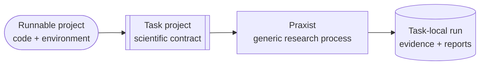
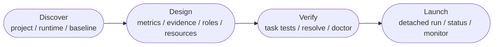

# Your First Task

Praxist adapts an **existing runnable research project** into a task project.
The original project supplies the executable baseline; the task project tells
the generic framework what may change, how evidence is measured, and what
counts as credible progress.

<div class="praxist-diagram" markdown>



</div>

## What Must Exist Before Takeover

| Required input | Ready means |
|---|---|
| Research code | The baseline implementation and normal entrypoint are present. |
| Runtime | An existing interpreter, environment, container, or remote path can import the required dependencies. |
| Data or simulator | Every required asset is locally reachable through the project's normal interface. |
| Baseline path | Training, optimization, simulation, inference, or evaluation runs without Praxist. |
| Measurable objective | At least one metric distinguishes candidates and its direction is known. |
| Scientific constraints | Forbidden changes, validity conditions, and important tradeoffs can be stated. |

Prior results and technical documents improve initialization but are not always
required. Takeover reports missing prerequisites instead of downloading an
unknown dataset, inventing a simulator, or fabricating baseline performance.

## Write the Research Brief

The brief is the operator's main scientific input. It should settle:

1. **Objective:** what should improve and which tradeoffs matter?
2. **Evidence:** which metrics, protocol, and maturity level make a result
   credible?
3. **Execution:** which environment and local assets are allowed, and what is
   the realistic compute budget?
4. **Exploration:** should literature lookup, the
   [Deep Innovation Gate (DIG)](../guides/deep-innovation-gate.md),
   [Quality-Diversity (QD)](../guides/qdig-cohort-allocator.md), and
   constructive-peer guidance be active?
5. **Operation:** how many peers and generations are appropriate, and may a
   validated run launch unattended?

One or two bounded calibration runs often reveal where a long-run brief needs
revision. Readiness and scientific-integrity gates still apply; a brief cannot
authorize Praxist to bypass an unresolved contract.

??? example "Detailed takeover brief"
    Adapt the intent to the project rather than copying the numbers.

    ```text
    Invoke `praxist-takeover` in Codex or Claude Code.

    Use the Praxist checkout at "/path/to/Praxist" on branch "main". Treat the
    current directory as the existing research project. Verify that its current
    environment can run the unchanged accelerator-backed training and evaluation
    path. If no compatible environment exists but every required dependency is
    locally available, create an isolated task environment without changing the
    system Python.

    Create a separate Praxist task project. Configure 12 peers, 30 generations,
    and a generation duration justified by measured baseline runtime. Disable
    public literature lookup. Enable QD, enable DIG only for absolute generation
    zero, and use the constructive-peer ratio as a soft target.

    If baseline performance is missing and the project already contains everything
    required to measure it, run a bounded baseline benchmark and record metrics
    with their provenance. Use the Praxist agent runtime, API provider, and model
    selected during setup.

    Define every metric direction, evidence maturity requirement, and
    protocol-integrity check. Configure durable parent lanes to retain credible
    Pareto-optimal solutions across genuinely different metric dimensions. Keep
    partial, diagnostic, suspect, and protocol-failed evidence visible as
    follow-up signals without treating it as clean parent evidence.

    Do not download a new dataset or replace the project's existing simulator or
    runtime. After mandatory evaluator, lane-routing, readiness, and runtime gates
    pass, launch in detached mode without optional follow-up questions. Report the
    task path, evidence contract, lane rules, generation-close policy, run ID, and
    monitor command.
    ```

## Start Takeover

From the shell:

```bash
praxist --takeover --task-path /absolute/path/to/research-project
```

Codex is the default operator interface; add `--operator claude` for Claude
Code. In an existing agent conversation, invoke `$praxist-takeover` in Codex or
`/praxist-takeover` in Claude Code. Use `praxist-takeover-codex` only for the
explicit no-key Codex-native profile.

Use `praxist-task-initialization` to create or repair the harness without
launching, or `praxist-interactive-task-init` for confirmation-first design.
[Agent Skills](../user-guide/skills.md) owns the complete goal-to-skill map.

## What Praxist Adds

Initialization adds the smallest practical harness around existing assets:

| Harness area | Purpose |
|---|---|
| Task contract | Objective, scope, permitted changes, metrics, evidence policy, roles, and run settings |
| Evaluator and baseline record | One reproducible path from a candidate to structured metrics with provenance |
| Retention and close policy | Reachable durable, Pareto, diagnostic, parent, maturity, and generation-boundary decisions |
| Resource observation | Unchanged-baseline timing and bottleneck evidence used to plan concurrency |
| Task tests | Evaluator output, lane reachability, maturity, resource handoff, and launch readiness |
| `experiments/` | Run artifacts outside Praxist source and stable project code |

The exact schema and precedence rules live only in
[Task Projects](../guides/task-projects.md).

## Validate Without Starting

Takeover performs validation automatically. For direct inspection:

```bash
praxist resolve /absolute/path/to/task
praxist doctor --task-path /absolute/path/to/task
```

When the task requires ratios, validate a real evaluator summary through the
same serializer used in production:

```bash
praxist resolve /absolute/path/to/task \
  --result-summary /absolute/path/to/evaluation_summary.json
```

## What Happens During Takeover

<div class="praxist-diagram" markdown>



</div>

The operator agent:

1. identifies the active Praxist installation, project, execution environment,
   local assets, technical context, and prior evidence;
2. reuses measured baseline evidence or offers a bounded measurement when every
   prerequisite is available;
3. turns the brief into task-owned metrics, ranking, protocol integrity,
   maturity, retention, close, role, prompt, and exploration contracts;
4. observes the unchanged baseline execution path to estimate runtime and the
   actual resource bottleneck without changing its backend;
5. creates the harness by referencing existing assets instead of cloning the
   project into Praxist;
6. runs task, evaluator, lane-routing, resource, resolve, and runtime checks;
7. launches only after mandatory gates pass, then reports the task path, run ID,
   lifecycle state, and monitor command.

If a prerequisite or scientific decision is genuinely unresolved, takeover
stops at that point and names the missing input. It does not weaken evaluation
to make launch succeed.
