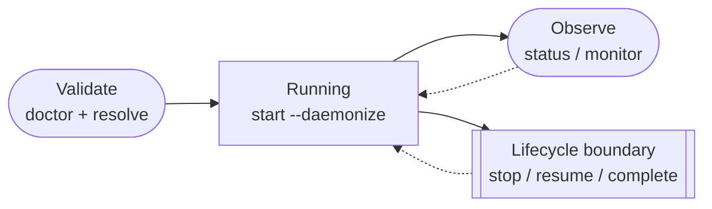

# Direct CLI Operations

This guide is for operators who want to control Praxist directly from a shell,
without asking an agent to perform the lifecycle action. For guided operation,
describe the desired action in Codex or Claude Code; it will use the
`praxist-control` skill when appropriate.

The `praxist` CLI is the canonical shell interface. The Python module entrypoint
is a low-level compatibility surface.

<div class="praxist-diagram" markdown>



</div>

## Command Map

| Goal | Direct command |
|---|---|
| Reopen first-use runtime setup | `praxist setup --interactive` |
| Hand a project to guided takeover | `praxist --takeover --task-path <project>` |
| Check host and runtime readiness | `praxist doctor --task-path <task>` |
| Validate a task without starting | `praxist resolve <task>` |
| Start a detached run | `praxist start --task-path <task> --daemonize --json` |
| List or inspect runs | `praxist status --json` |
| Inspect one run | `praxist status --run-id <run-id> --json` |
| Open the read-only TUI | `praxist --monitor --run-id <run-id>` |
| Stop one run | `praxist stop <run-id> --grace 300 --json` |
| Resume a clean interrupted run | `praxist resume <run-id-or-run-dir> --daemonize --json` |

Use `praxist <command> --help` for the live argument contract. The generated
[CLI Reference](../reference/cli.md) is derived from that parser.

The first command reopens setup. The second is a separate, post-manual project
handoff described in the [Quickstart](../getting-started/quickstart.md). Neither
replaces the task validation or lifecycle commands below.

## Select the Task and Configuration

An explicit `--task-path` wins over `TASK_PATH`, which wins over the invocation
directory. Prefer the explicit form in scripts:

```bash
praxist resolve /absolute/path/to/task
praxist start --task-path /absolute/path/to/task --daemonize --json
```

Lifecycle commands load `${XDG_CONFIG_HOME:-$HOME/.config}/praxist/env` by
default. When using another configuration file, pass it to every
gate and lifecycle action:

```bash
praxist doctor --task-path /absolute/path/to/task --config-file /path/to/env
praxist resolve /absolute/path/to/task --config-file /path/to/env
praxist start \
  --task-path /absolute/path/to/task \
  --config-file /path/to/env \
  --daemonize \
  --json
```

Use the same configuration for validation and startup. Explicit
process environment values have the highest credential precedence. See
[Credentials](credentials.md) for secret handling and
[Agent Runtimes](agent-runtimes.md) for runtime selection.

For a source checkout, run the same CLI from the repository environment:

```bash
cd /path/to/Praxist
uv run praxist start \
  --task-path /absolute/path/to/task \
  --daemonize \
  --json
```

??? note "Shared state and host identity"

    Registry actions record a best-effort host identity so a shared state
    directory cannot make one machine stop another machine's run. A minimal or
    rebuilt container without a stable machine ID should set one persistent,
    host-local `PRAXIST_HOST_ID`. Never reuse that value across distinct hosts.

## Validate and Start

### Configured API Provider

Run the inexpensive gates before launching:

```bash
praxist doctor --task-path /absolute/path/to/task
praxist resolve /absolute/path/to/task
praxist start \
  --task-path /absolute/path/to/task \
  --daemonize \
  --json
```

Preserve explicit `--runtime`, `--model-provider`, `--model`, `--cohort`,
`--generations`, and `--strategy` choices when required. `--daemonize` lets the
run survive the launching shell or Codex session. `--json` makes run ID, PID,
run directory, log path, and monitor handoff machine-readable.

### Codex-native Mode

Use the route-aware doctor and pass the same mode to start:

```bash
praxist doctor --codex-native --task-path /absolute/path/to/task
praxist resolve \
  /absolute/path/to/task \
  --codex-native \
  --runtime agent_runtime:codex_sdk \
  --model-provider model_provider:openai_compatible \
  --model gpt-5.6-luna
praxist start \
  --codex-native \
  --task-path /absolute/path/to/task \
  --agent-system codex_sdk \
  --runtime agent_runtime:codex_sdk \
  --model-provider model_provider:openai_compatible \
  --model gpt-5.6-luna \
  --daemonize \
  --json
```

The saved-login route is isolated from configured relay API providers and API-key
endpoints. Use `praxist-takeover-codex` for the guided equivalent.

## Observe a Run

### Status

```bash
praxist status --json
praxist status --run-id <run-id> --json
```

The targeted form is preferable in automation. It avoids mixing unrelated runs
when multiple task projects share a host.

### Foreground Monitor

```bash
praxist --monitor --run-id <run-id>
```

The fullscreen TUI is read-only and independent of the research process. It
shows run state, peer health/activity, recent log context, and hardware
warnings. Visual redraw is decoupled from bounded artifact and hardware
sampling, so display responsiveness does not multiply research-side probes.
`Ctrl-C` exits only the monitor; the detached run continues. Use
`praxist --monitor --plain` for a non-interactive terminal or append-friendly
transcript.

For peer rows, the live monitor reads each peer's bounded
`recent_result_artifacts` summary instead of recursively reconciling the complete
result tree in the long-running display. Use `praxist --monitor --once`,
`praxist status`, or the diagnostic workflow when you need a complete artifact
reconciliation view.

`--interval` controls the display interval. Exact defaults and limits are owned
by the generated [CLI Reference](../reference/cli.md).

### Interpret Operational State

| View | Authority |
|---|---|
| Result and finding summaries | Measured task evidence |
| `frontier/frontier_manifest.json` | Canonical lane and promotion state |
| Committed `gems/gems_state.json` | Canonical Gems state |
| `gen_N/generation_boundary.json` | Canonical generation boundary |
| Leaderboards, Principal Investigator (PI) evidence packs, rendered prompts, reports | Derived views or audit snapshots |
| TUI and scheduler status | Live operational telemetry, not scientific evidence |

Count completed generations from the contiguous committed boundary markers.
If live status or `run_summary.json` reports a larger value than those markers,
report the mismatch and classify the extra generation as pending boundary work;
do not treat frontier entries or `generation_results.json` alone as a commit.

When central scheduling is enabled,
`<run>/resource_scheduler/status.json` distinguishes queued, running, blocked,
completed, failed, and rejected work. Read lifecycle `running` separately from
`running_activity.by_resource_phase`; a live wrapper is not proof of active
accelerator compute, and an observation marked `unknown` is not proof of a
stall. Resource telemetry helps explain throughput but cannot promote a result.

## Stop a Run

Target one verified run whenever possible:

```bash
praxist status --run-id <run-id> --json
praxist stop <run-id> --grace 300 --json
```

After stop returns, poll status until the selected process disappears. Use
`praxist stop --all` only when every registered run owned by the environment is
intentionally being stopped. Do not use broad `pkill` patterns.

The foreground monitor is independent, so stopping a run does not need to find
or kill a monitor process.

## Resume a Run

For a run stopped at a clean, recognized boundary:

```bash
praxist status --run-id <run-id> --json
praxist resume <run-id-or-run-dir> --daemonize --json
```

Never resume a verified live controller. Praxist preserves the original API
provider, agent runtime, model, frontier strategy, and task identity; resume
rejects changes to these canonical values. An unchanged task checkout may move
to a new absolute path; Praxist validates its persisted manifest and effective
descriptor. Task identity comes from the persisted task contract.

Interrupted final boundaries require more care. Common cases include:

- an unfinished final generation after a complete PI agenda;
- a finished cohort whose PI/Chair boundary did not finish;
- a committed Gems reset followed by a partial next generation;
- a pending or incomplete Gems reset transaction.

The operator agent should prepare the run directory before calling the resume command for
these irregular cases. It should inspect the Praxist resume plan, back up the
run before any manual crop, preserve complete generation evidence and committed
Gems state, and prefer Praxist's internally recoverable boundary path. When a
partial boundary is not recognized, do not hand the partial state directly to `praxist resume`;
use a documented repair path or crop to a named clean boundary only with
operator approval.

Use `praxist-control` with the request "resume the latest run" for this preparation workflow. The
skill understands interrupted PI and Gems boundaries and avoids destructive
guessing.

## Agent-Assisted Operation

Codex or Claude Code is the recommended interface when an action requires path selection,
artifact interpretation, irregular resume preparation, or a concise progress
report. Ask in natural language, for example:

```text
Report current research progress and list the strongest variant in every
completed generation with its task-defined performance metrics.
```

The agent will use `praxist-control` as needed. If invoked without an operation,
the control skill asks for `start`, `stop`, `resume`, `status`, `monitor`, or
`detect-active-runs` instead of guessing.

For launch, the agent must know the exact task project before launching. It should
confirm the exact path. It should not infer a task from a broad filesystem scan.
During a status request it reports generation progress, incubator or leaderboard
performance, CPU/memory/process/accelerator load, generated report paths, and at
most two score curves through `terminal-line-plot`. It must not stop, resume,
crop, rerender, or edit files during a status request. Canonical state remains
authoritative; derived reports remain audit snapshots.

### Guided Diagnostics and Reports

Use `praxist-diagnostic` when the question is why a run is unhealthy or weak,
not merely what state it is in. The default diagnostic is analysis-only and may
write a report under task `docs/`; it must not edit task code or active run
artifacts. It can audit diversity HHI (Herfindahl-Hirschman Index), artifact
consistency, resource/runtime
friction, a performance ceiling, and the strongest variants. For persistent
weakness it can build a chronological agent behavior analysis report. Manual
A/B/C run reports put strongest results first, strong-variant lineage second,
and run health third. These reports are derived views: canonical state remains
authoritative and report snapshots remain audit snapshots.

## Output Locations

`praxist start --json` returns the selected run and launcher-log paths;
`praxist status --json` resolves registered runs without relying on the current
directory. [Task Projects](task-projects.md#experiments-directory) owns output
placement, run contents, and task-runtime path rules.
