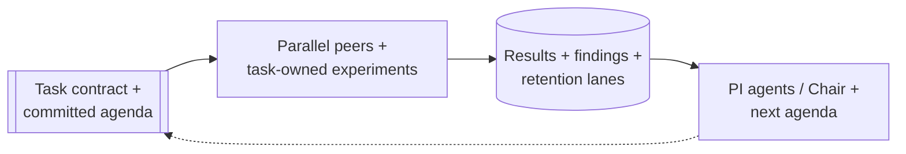

# Research Loop

Praxist turns one external task project into successive generations of
candidate implementations and measured evidence. Core does not compile a task
prompt into code: peers inspect the baseline, implement hypotheses, run the
task-owned evaluator, and publish evidence. Praxist coordinates that work and
commits what later generations may inherit.

Principal Investigator (PI) agents propose next-generation work; multi-PI
topologies add a Chair that consolidates those proposals. The
[Glossary](../about/glossary.md) gives compact definitions, while
[Panel Topology Prompts](../concepts/panel_topology_prompts.md) owns the panel
contract.

Local experimentation becomes global evidence and a committed plan for the next
generation.

## 1. Resolve and Freeze the Run

Startup resolves the selected task, plugins, prompts, baseline references, API
provider, agent runtime, and initial durable state. It writes a run-local frozen
configuration before cohort execution. The task schema and precedence rules are
defined in [Task Projects](task-projects.md); the research loop consumes that
contract without adding domain meaning.

## 2. Build the Generation Context

`GenerationLoop` combines:

- the task prompt, peer role, and allowed work surface;
- the committed agenda and optional Deep Innovation Gate (DIG) or
  Quality-Diversity (QD) allocation;
- compact frontier, incubator, Gems, graph, and negative-evidence views;
- peer-local research memory; and
- the task-owned evaluator and protocol contract.

Generation zero starts from the baseline and initial task context. DIG may run
once before its cohort when enabled; QD is independently selectable. Later
generations use the preceding committed PI/Chair agenda. DIG is normally off,
while QD can allocate candidate contracts through the existing synthesis path.
[Deep Innovation Gate](deep-innovation-gate.md) and
[Quality-Diversity Allocation](qdig-cohort-allocator.md) own those mechanisms.

The workflow records `gen_N/research_topology.json` so worker identities,
declared inputs/outputs, and visibility policy remain auditable without changing
peer semantics.

## 3. Execute Peer Work

Each peer receives a rendered prompt and a normalized runtime request. A typical
peer:

1. reads its task, role, agenda, and inherited evidence;
2. states a mechanism hypothesis and intended evidence stage;
3. creates an independent variant under `variants/`;
4. changes only permitted files;
5. submits evaluation through the task's public evaluator path;
6. writes structured output under `results/`; and
7. publishes a finding with caveats and follow-up.

The selected resource policy controls experiment admission. It does not choose
the hypothesis or change scientific validity. See
[Central Experiment Scheduler](central-resource-scheduler.md).

## 4. Materialize Evidence

A **result summary** answers what the evaluator measured. A **finding** records
how later research may interpret and use that result. Praxist recursively
discovers recognized summaries and idempotently materializes their usable
metadata into canonical findings.

Findings preserve actual evidence stage, maturity ratios, metrics, mechanism,
caveats, lane intent, parent eligibility, and follow-up. A repeated finding ID
can refresh changed non-empty fields without erasing useful older fields omitted
from the update.

Committed lane membership lives in
`frontier/frontier_manifest.json`. A leaderboard is only a derived view.
Task-owned lane, maturity, and Gems policy is defined in
[Task Projects](task-projects.md#frontier-lanes-and-incubator-evidence).
Immature scout or partial output
remains a validation signal, not incubator content.

Artifact-role definitions are owned by
[Architecture](../concepts/architecture.md#state-and-replay). The loop plans
from canonical state, keeps useful validation signals visible, and never treats
old prompts, reports, or evidence packs as current truth.

## 5. Close and Commit the Generation

After admitted work drains, the boundary performs one ordered commit:

1. ingest peer findings and result summaries;
2. run a final idempotent evidence refresh;
3. update canonical finding, graph, frontier, incubator, and optional Gems state;
4. refresh peer memory and negative-evidence summaries;
5. build the PI evidence view and synthesize the next agenda; and
6. write `gen_N/generation_boundary.json`.

The marker is the completion fact. Results or frontier files without a
contiguous marker are pending boundary work for resume to finish.

A recorded evidence cutoff makes retries deterministic. Results published after
that cutoff remain visible as late validation signals, but cannot enter the
closed generation through retry timing. Atomic files visible before the cutoff
remain eligible even if ingestion observes them during reconciliation.

[Research-Loop Flexibility Controls](research-loop-flexibility-controls.md)
owns close eligibility, mature quorum, drain, and bounded-liveness behavior.

## 6. Synthesize and Inherit

PI/Chair synthesis reads committed evidence, prior agenda, task constraints,
memory, and diversity diagnostics. It writes the next agenda under
`agendas/research_agenda_gen<N+1>.yaml`.

An agenda assigns planned work; it is not measured evidence. Evaluator results
and committed retention state continue to own scores, maturity, protocol status,
and parent eligibility. A failed or uncommitted agenda cannot drive another
cohort.

A later peer may restart from the baseline, inherit a durable candidate, repair
a credible signal, ablate a strong result, combine compatible mechanisms, or
investigate an anti-mainline direction. Praxist supplies evidence and
constraints, not a fixed code-generation template.

## 7. Audit the Flow

| Question | Canonical location |
|---|---|
| What was implemented? | `variants/<variant>/` |
| What was measured? | `results/<variant>/` |
| What evidence was published? | `findings/`, `shared_findings/`, or the canonical finding store |
| What was durably retained? | `frontier/` and `gems/` |
| What did the panel plan next? | `agendas/` |
| Did the generation commit? | `gen_N/generation_boundary.json` |

A variant present only under `variants/` or `results/` may not influence
later planning if no usable finding can be published or materialized.
