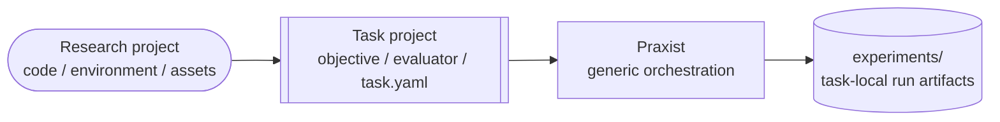

# Task Projects

Task projects are research problems that Praxist runs. They are explicit inputs, not
bundled system plugins.

<div class="praxist-diagram" markdown>



</div>

This page is the sole detailed owner of the task-project contract. Tutorials
summarize the workflow and link here rather than defining a second schema.
Planning uses Principal Investigator (PI) agents; multi-PI topologies add a
Chair that consolidates their proposals. [Panel Topology
Prompts](../concepts/panel_topology_prompts.md) owns those roles.

## Location

For local dogfood, put task projects under the ignored repository-root
`tasks/` directory:

```bash
tasks/my_research_task/
```

For real collaboration, keep the task in its own Git repository and pass its path:

```bash
cd /path/to/task-project
praxist start --daemonize --json
# or pass --task-path explicitly from another directory
```

## Required Shape

A task project normally contains:

- `task.yaml` for task identity, workflow selection, metric, plugin refs, and
  execution defaults;
- `description.md` for stable task context;
- `roles/` for task-local role skills. Praxist resolves the declared peer
  RoleSkills before the research loop, injects each peer's agenda-assigned
  Markdown contract into that peer's prompt, and records the effective role
  reference plus content hash on the runtime request;
- `audit_rules/` for task-local proposal, result, or agenda criteria; these
  should be declarative YAML or Markdown by default, not Python framework hooks;
- `evaluations/` for task-local evaluation logic. Expensive executable tasks
  should expose one public evaluator command, normally
  `evaluations/<name>/run.py`, so agents do not call internal harness scripts
  directly;
- `assets/` for harness code, optional reference implementations, fixtures,
  data metadata, and literature packs;
- task-local tests for the harness and any optional reference implementations.

Hardware planning observes the unchanged baseline and records its actual
backend. A task declares only profiles that its public evaluator can use; it
does not infer accelerator requirements from host inventory. Process handoff,
NVIDIA/CUDA UUID rules, natural-unit parallelism, and supply feedback are owned
by [Central Experiment Scheduler](central-resource-scheduler.md).

Use `templates/tasks/template` as replaceable scaffolding. Complete examples
serve a different purpose and must run from their installed writable copies.
[Examples And Templates](examples-and-templates.md) owns that distinction and
the available starting points.

## `task.yaml` Contract

The task descriptor is the only machine-readable source Praxist needs from a task
project at startup. A typical descriptor includes:

- task identity: stable id, name, version, and description path;
- workflow defaults: enabled stages, generation count, cohort size, and run
  defaults;
- metric contract: primary metric name, direction, optional secondary metrics,
  mature-evidence ratios, constructive target, and cooperative launch guard;
- plugin refs: generic workflow stage, agent runtime, API provider, tool, budget, panel,
  and graph refs;
- task-local refs: roles, audit rules, evaluations, and budget profiles;
- assets: harness paths, baseline files, literature packs, dataset metadata, and
  optional reference implementations;
- task entrypoints: the public evaluation command and any optional internal
  harness runners;
- output policy: default experiments directory and artifact retention notes.
- optional runtime environment: task execution cwd, venv/python path, PATH
  additions, and non-secret task env vars.
- agent reasoning policy: `agent.reasoning_effort` applies one `auto`, `off`,
  `low`, `high`, or `max` choice across API providers to peers and planning
  calls;
  omitted values default to `max`. Runtime-specific mappings are defined once in
  [Agent Runtimes](agent-runtimes.md#reasoning-policy).
- generation-scoped Deep Innovation Gate (DIG) and Quality-Diversity (QD)
  policy: independent enable switches, generation scope, candidate-pool
  requirements, diversity-cell fields, allocation caps, and task-owned
  allowed/disallowed file rules.
- Gems policy: `gems.enabled`, optional reset cadence, compact Gem caps when
  reset is enabled, relevant lanes, metric keys, and task-owned maturity
  thresholds for staged or full-coverage evaluation protocols.
- Frontier lanes: optional `evaluation.frontier_lanes` entries that keep
  mature candidates, promising validation candidates, and diagnostics in
  separate task-owned evidence streams. Without frontier lanes, Praxist keeps the
  legacy primary-metric frontier but does not materialize an incubator-style
  lane for preliminary, aligned, or partial signals. Every lane should declare
  `parent_eligible`: true only for mature durable parent lanes, false for
  lower-stage and diagnostic lanes.
- Research-loop tools: declare the selected `tool_server:*` refs so resolve and
  runtime agree. [Tool Servers](tool-servers.md) owns the catalog,
  [Scientific Literature Lookup](scientific-literature-lookup.md) owns source
  policy, and [Run Reports](user-facing-reports-and-init.md) owns report
  behavior.
- Metric directions: every metric used for frontier ordering, baseline-beat
  detection, dimension winners, or charts must resolve to an explicit task-owned
  `maximize` or `minimize` declaration. Result aliases inherit the direction of
  their configured source metric. Unknown direction remains unknown; reports do
  not guess that it should be maximized.
- QD plan versus evidence: `planned_dimensions` describes allocation intent;
  `design_dimensions` describes the implementation that actually ran. Praxist
  never fills missing evidence from the plan. The complete behavior is defined
  in [Quality-Diversity Allocation](qdig-cohort-allocator.md).

The descriptor may use the `praxist_plugins` block to bind generic plugin
refs and task-local component refs. Do not use task descriptors to smuggle
system code into core.

## Baseline Records

Serious task projects should keep compact baseline evidence under
`assets/baselines/`. Prefer:

- `results.jsonl` for machine-readable metric rows;
- `curated_baseline_summary.md` for human-readable interpretation and
  provenance;
- `baseline_performance_status.md` for measurement status, command, data
  source, environment, and any missing requirements.

If task initialization can measure the baseline on the current machine but no
baseline record exists, Codex should ask the operator whether to write explicit
zero placeholders or run a task-local baseline benchmark first. A benchmark run
belongs under `experiments/baseline_bench_<timestamp>/`, should use the public
task evaluator or documented baseline command, and may use bounded parallelism
only when the task and hardware make that safe. Zero placeholders must be marked
as placeholders, not measured performance facts.

Files under `assets/baselines/` preserve evidence and provenance; they do not
implicitly configure runtime comparisons. Verified values must also be declared
under `task.yaml:baselines` with their metric direction. `praxist resolve` and
`praxist start` warn when a conventional parseable result asset is present but
that declaration is empty. The warning is advisory and never auto-imports or
trusts task files.

## Evaluator Launch Readiness

Task initialization proves an evaluator before expensive fan-out. It first
exercises the task-appropriate build/load/startup boundary in the actual runtime,
validates the evaluator's public CLI, function, RPC, simulator, container,
notebook, or service contract as applicable, and then runs a **one-unit canary**
through the public evaluator, the central scheduler when Praxist owns launch,
and the canonical summary writer. "One
unit" is deliberately task-defined: it is the smallest valid case for that
task, not a framework-wide seed, epoch, split, iteration, or hardware rule.
The resulting summary must validate and project into a finding before wider
execution begins. Any implementation or command change requires a new canary.

The canary distinguishes broken execution from a valid weak or negative
scientific result; it does not establish performance or mature evidence. A task
that explicitly claims independently trusted evaluation must additionally
provide a task-owned verifier and demonstrate that peers cannot replace the
authoritative result and that altered or unattested evidence is rejected.
Peer-authored evaluators retain the normal path and do not inherit an external
attestation requirement.

## Override Rules

Operators can override run settings from CLI or config. Overrides should change
runtime choices, model profiles, budget envelopes, generation count, or local
paths. They should not mutate the task source.

The intended priority is:

```text
CLI args > explicit env vars > override spec > task.yaml defaults
```

Credentials are the exception: raw secrets are resolved by Python credential
resolution and are never copied into `task.yaml`.

## Experiments Directory

Task run outputs belong under a task-local ignored directory, normally:

```text
<task-project>/experiments/
```

Do not write long-run task outputs into `templates/`, `examples/`, or `praxist/`.

Selection order is explicit `--run-dir`, then `$RUN_DIR`, then a timestamped run
under `<task-project>/experiments/`. Praxist rejects destinations inside its own
source checkout. Pass `--run-dir` explicitly for an external output root.
The detached launcher log is `<run_dir>/logs/launcher.nohup.log`.

Task harnesses publish structured result summaries and findings. They do not
write frontier, Gems, prompt, report, or memory state directly. Every ranked
metric declares its own direction, and negative evidence uses structured
valence/failure metadata rather than prose alone. The canonical, validation,
derived, audit, and partial artifact roles are defined once in
[Architecture](../concepts/architecture.md#state-and-replay).

## Runtime Environment

Tasks that need a specific virtual environment or executable can declare it in
`task.yaml`:

```yaml
runtime_environment:
  cwd: task_project          # task_project, run_dir, or a task-relative path
  venv: .venv                # task-relative or absolute path
  # python: .venv/bin/python # optional override; inferred from venv otherwise
  path_prepend:
    - bin
  env:
    TASK_MODE: dogfood       # non-secret task vars only
```

At startup Praxist validates the configured paths by default, injects
`PRAXIST_TASK_VENV`, `VIRTUAL_ENV`, `PRAXIST_TASK_PYTHON`, `PRAXIST_TASK_SHELL_PREFIX`,
and prepends the venv/python directories to `PATH` for agent runtime sessions.
Task prompts and harness commands should prefer `$PRAXIST_TASK_PYTHON` when present
and otherwise fall back to `python`.

When a task interpreter is declared, experiment children do not inherit the
Praxist runner's `PYTHONPATH` or `PYTHONHOME`. A task that genuinely requires
either variable must declare it in `runtime_environment.env`; Praxist then
treats that value as task-owned. This boundary prevents an older task Python
from importing packages out of the runner environment while retaining explicit
task-specific import layouts.

Do not put raw API keys in `runtime_environment.env`; model and tool secrets
belong to credential resolution.

Keep dependency installation as a separate task setup step. Task-specific
non-secret variables, interpreter selection, and import paths belong in
`runtime_environment`; start and resume remain owned by the Praxist CLI.

## Protocol Intent Belongs To The Task Owner

Praxist does not impose a universal full-protocol-only policy. Task
initialization should resolve one protocol-intent table from the current user
instruction first, then compatible project evidence, then a proposed default.
For every evaluator mode, the table states whether that mode may launch, rank,
count as mature, supply a durable parent, and satisfy close.

An explicitly requested partial, scout, reduced-coverage, or otherwise
incomplete protocol is valid. Its summaries must still report the actual stage,
effort, coverage, and integrity facts, and the task's maturity, lanes, Gems, and
close settings must all encode the same choice. Praxist should preserve useful
signals from other modes without presenting undeclared deviations as mature
evidence. Launch validation must inspect structured evaluator modes and output
metadata, never reject commands because their text happens to contain words
such as `smoke`, `scout`, or `partial`.

The configurations below are recommended defaults when the user and project do
not specify different semantics. They are not global restrictions.

## Deep Innovation Gate, Quality-Diversity, And Gems Defaults

For newly initialized real research tasks, the current recommended default is
continuous evolution with DIG limited to absolute gen0, independent QD enabled
for both the gen0 DIG pool and later PI synthesis, and periodic Gems reset
disabled:

```yaml
generation_policy:
  max_generations: 8        # or another value suitable for a real research run
  cohort_size: 5
  per_generation_hours: 5

evaluation:
  maturity_policy:
    min_effort_ratio: 0.75
    min_coverage_ratio: 0.80
    require_ratio_gate: true
    complete_stage_labels: [complete]
    preliminary_stage_labels: [preliminary, aligned]
  constructive_peer_mix_enabled: true
  constructive_target_ratio: 0.75
  launch_guard:
    enabled: true
    # Observed p90 runtimes of ordinary heavy work and the evaluator whose
    # evidence is authorized for normal close.
    estimated_heavy_eval_minutes: 0
    estimated_close_grade_eval_minutes: 0
    safety_factor: 1.25

synthesis_trigger:
  mature_quorum_fraction: 0.25

quality_diversity:
  enabled: true
  initial_generation_enabled: true
  later_generations_enabled: true
  max_same_diversity_cell_peers: 1
  max_same_mechanism_family_fraction: 0.34
  max_same_intervention_surface_fraction: 0.50

gems:
  enabled: false
  selection_policy: mature_evidence_top_k
  # Smoke placeholder; real tasks use their complete-protocol unit count.
  min_mature_eval_units: 1
  evidence_stage_min_units:
    complete: 1
  max_resets: 3
  max_gems_per_reset: 4
  max_gems_total: 4
  max_gems_per_family: 2
  prompt_max_gems: 4
  archive_ordinary_findings: true
```

The excerpt keeps operator-facing evaluation, QD, and Gems controls visible.
Task initialization manages DIG's internal planner settings from the requested
enablement, generation scope, and runtime budget.

For tasks with task-defined mature/complete evidence, use a positive mature
quorum so raw progress or diagnostic findings cannot become normal completion.
`mature_supply_fraction` only prioritizes evidence production; it is not a
close gate. Use `0.0` only when the task intentionally has no separate
close-grade evidence contract and the operator explicitly accepts
information-density closing.

When mature/complete evidence is required for normal close, the finalized task
must satisfy:

```text
estimated_close_grade_eval_minutes * safety_factor
  < effective_generation_close_horizon_minutes - drain_margin_minutes
```

Use the close-authorized evaluator's observed p90 runtime and at least a
30-minute drain margin unless measured publication/shutdown latency requires
more. `estimated_heavy_eval_minutes` may separately describe a longer optional
protocol; older tasks that omit the close-grade field use the heavy estimate as
a compatibility fallback. The effective horizon is the earliest enabled
generation or synthesis hard bound, including an enabled adaptive ceiling.
Praxist rejects a declared required-evidence contract that cannot finish by
construction. A user-authorized reduced or late-signal protocol remains valid
when its maturity, lane, launch, and close settings consistently describe that
intent.

Smoke fixtures may keep `max_generations: 1` while still declaring these blocks
so startup and config parsing stay visible; they may set later-generation QD
and next-generation constructive feedback to `false` because neither can take
effect in a one-generation run. Enable periodic Gems reset only
after an operator request or a diagnostic pass identifies a performance ceiling
and recommends a reset cadence. `reset_interval_generations` is meaningful only
when `gems.enabled: true`.

When the user-approved maturity contract uses ratios, each canonical evaluator
summary must emit `effort_ratio` and `coverage_ratio` in a supported scalar fact container such
as the summary root, `metrics`, `extra`, or `current_aggregate`. `effort_ratio`
is actual training/search/optimization effort divided by the task-defined
mature reference effort. `coverage_ratio` is completed required evaluation
units divided by total required units. Praxist uses one maturity extractor for the
source summary and its auto-materialized finding, so task code must not rewrite
the same facts into a second artifact. A standalone manually authored result
finding with no canonical summary reference must carry the ratios itself.
Task-specific stage labels remain audit context. Use `require_ratio_gate: true`
only when the declared contract uses these ratios. An explicit user choice may
instead use task-owned labels/flags or information-density closing; without any
declared maturity facts, maturity remains unknown.

Before launch, validate an actual file from the evaluator's canonical summary
writer with:

```bash
praxist resolve /path/to/task --result-summary /path/to/evaluation_summary.json
```

The check uses the runtime extractor and requires finite effort and coverage
ratios only when the task enables the ratio gate. Passing stage labels are not
required and cannot make missing ratio telemetry computable.

Canonical summaries must resolve to one completion decision under the
task-owned policy. Status vocabulary alone is not decisive: a fixed-budget
task may define reaching its configured cap as mature completion. The summary
must distinguish that case from an early stop through its achieved protocol,
effort/coverage, and completion fields. Task initialization tests both outcomes
through the real summary writer so the task policy, Frontier, Gems, and
prompt-facing views interpret the same result consistently.

Tasks with staged or full-coverage evaluation should define task-owned Gems
maturity through `selection_policy: mature_evidence_top_k` and
`min_mature_eval_units`. They may map task-owned stage labels to cumulative
evaluation-unit thresholds with `evidence_stage_min_units`; Praxist configuration
always calls these counts units, regardless of any task-local evaluator term.
Do not copy one task's threshold or stage labels into another task; derive both
from the complete protocol.

## Frontier Lanes And Incubator Evidence

`frontier/frontier_manifest.json` is the canonical machine-readable state for
the run's Frontier lanes and validation candidates. The manifest may contain
`lane_frontiers` when the task configures `evaluation.frontier_lanes`.
Operator-facing leaderboards are usually computed
from the SQLite finding store or from findings JSON fallback; a missing
standalone leaderboard file is not by itself evidence corruption.

Use frontier lanes when the task has staged validation or expensive full
evaluation:

```yaml
evaluation:
  primary_metric: score
  direction: maximize
  frontier_lanes:
    - name: confirmed
      description: "Fully scored, promotable candidates."
      k: 3
      cumulative_cap: 10
      axes:
        - {name: score, direction: maximize}
      include_lanes: [confirmed, performance]
      require_metrics: [score]
      parent_eligible: true
    - name: incubator
      description: "Lower-admission durable long-term library for task-authorized, protocol-passed, non-suspect Pareto/new-high candidates needing follow-up."
      k: 8
      cumulative_cap: 48
      admit_new_high: true
      axes:
        - {name: score, direction: maximize}
        # Put additional distinct metrics here when they should define
        # Pareto/new-high retention and are emitted by every result mode the
        # user-owned protocol authorizes for this lane.
      optional_axes:
        # Optional axes are secondary sort/display signals only; they do not
        # by themselves define Pareto dominance.
        - {name: secondary_tiebreak_metric, direction: maximize}
        - {name: diagnostic_display_metric, direction: minimize}
      include_lanes: [incubator, performance]
      require_metrics: [score]
      # This default excludes reduced modes. Adapt the structured filters when
      # the user's protocol intent authorizes one of those modes as a parent.
      require_falsey_metrics: [is_smoke_eval, partial, scout_only, validation_only, validation_only_result, late_after_generation_boundary, suspect_protocol, suspect_leakage]
      parent_eligible: true
      allow_non_promotable: true
      allow_missing_tier: true
      allow_risk_violating: true
    - name: task_candidate
      description: "Promising preliminary, aligned, or partial evidence retained for validation."
      k: 5
      cumulative_cap: 20
      axes:
        - {name: score, direction: maximize}
      include_lanes: [task_candidate, candidate]
      require_metrics: [score]
      parent_eligible: false
      allow_lower_tier: true
      allow_non_promotable: true
      allow_missing_tier: true
    - name: diagnostic
      description: "Controls, falsifiers, negative evidence, and process diagnostics."
      k: 2
      cumulative_cap: 10
      axes:
        - {name: score, direction: maximize}
      include_lanes: [diagnostic, control, process, reference, negative_control]
      parent_eligible: false
      allow_lower_tier: true
      allow_non_promotable: true
      allow_missing_tier: true
```

Rename these lanes and metric requirements for the domain. The important
contract is not the specific names; it is that a lower-admission incubator
keeps task-authorized, protocol-passed Pareto/new-high variants available as
long-term parents, while modes marked non-parentable but still useful have a
declared candidate lane instead of being forced through the same gate as fully
promotable results.
`allow_lower_tier: true` retains lower-stage signals for revalidation; it does
not make that lane a durable parent source.

The lane name in an evaluator summary is a **source label**; each configured
lane is a durable target selected by Praxist. When confirmed and incubator should
both consider ordinary clean parent-authorized results, the evaluator should normally
emit one shared task-owned source label such as `performance`, and both targets
should list it in `include_lanes`. Do not map every such result directly to
`confirmed`: candidates outside confirmed top-k then cannot reach an incubator
that only accepts `incubator`/`performance`. At evaluator ingestion,
`frontier_lane`, `promotion_lane`, and `lane` are accepted source-label fields
in that precedence order; the first non-empty value is used. Committed entries
store the selected target in `frontier_lane` and `promoted_for_lane`, and
preserve a different submitted source label in `source_frontier_lane`.
Validation-candidate records use `submitted_frontier_lane`.

Task initialization must run a task-local reachability regression against real
summary construction. For each parent-eligible target, at least one
protocol-passed fixture from a parent-authorized mode must satisfy its source
and metric filters. With both confirmed and incubator present, test more than
`confirmed.k` parent-authorized candidates. When the task has a justified distinct incubator axis, include a
candidate that is outside primary top-k but non-dominated on that axis; it must remain incubator-eligible.
Do not invent a secondary metric for a genuinely single-metric task,
while fixtures from modes the task marks non-parentable, plus protocol-failed,
validation-only, late, and suspect fixtures, remain non-parentable. A temporarily empty incubator is valid when no
new Pareto point exists; an unreachable incubator is a harness defect.

Durable capacity is evidence-based rather than alias-based. Multiple finding or
variant names that reference the same exact immutable result artifact
(`source_result_path` and SHA-256) consume one durable lane slot. A different
path or hash is a different artifact, so independent replications remain
eligible. Semantic variant identity and lineage remain separate from this
capacity rule.

When non-code launch settings can alter a treatment, the evaluator summary
should additionally own a secret-free top-level `effective_config` object and
`effective_config_complete`. Include every task-owned argument, environment
override, protocol choice, and config-file value needed to reproduce the
treatment **after** the evaluator has applied defaults, aliases, parsing, and
type conversion. The resolved treatment is authoritative: omitting a setting
and explicitly supplying its resolved default must produce the same object and
digest. A genuinely different resolved value must produce a different digest.
Do not use an unfiltered process-environment snapshot as the contract. Praxist
carries a deterministic digest and the existing summary path into findings,
frontier, Gems, PI context, and reports; it does not copy the full object into
those derived views.

For derived work, a task-owned evaluator or existing launch helper should read
the selected parent summary and compare the child using this same resolved
schema before expensive execution. It may inherit allowlisted scientific values
when the task defines that behavior, but must not replay a complete parent
process environment or expose credentials.

For an exact replication, publish
`replication_of_effective_config_sha256` from the selected parent. Only a
completed result whose current complete digest matches that value supports the
exact-replication label. A result without these optional fields remains fully
compatible and follows the task's existing maturity and promotion rules.

## Evaluation Entrypoint

Task-owned evaluation may use any internal harness layout, but Praxist-facing
instructions should name a single public command. Prefer the structured
`task_entrypoints.evaluation.command` field; Praxist normalizes it into the
legacy-compatible `toolchain.eval_entrypoint` only in memory when needed:

```yaml
task_entrypoints:
  evaluation:
    command: evaluations/pareto_tiered/run.py
    output_policy: compact stdout plus raw evidence under the run directory
```

Agents should call the evaluation entrypoint. Internal benchmark files under
`assets/harness/` are task implementation details and may change without
changing the Praxist task contract.

Keep task-owned evaluator, trainer, config, and harness paths relative to the
task root. The scheduler resolves a statically identifiable task-owned command
entrypoint against that root while preserving the task's configured working
directory, even when the operator starts or resumes Praxist elsewhere.
Absolute paths remain valid for external datasets, simulators, environments,
or services, but task
initialization must verify each one before launch. A new task is launch-ready
only after the declared interpreter runs the public evaluator successfully
from both the task root and a run-like working directory and resolves the same
task-owned paths in both cases.

Compact result summaries may be nested under `results/**/` and use
`summary.json`, `evaluation_summary.json`, `eval_summary.json`,
`tiered_eval_summary.json`, or `custom_*_tiered_eval_summary.json`;
`result_summary.json` is retained for compatibility. Put task-owned lane,
maturity, effort/coverage ratio, protocol, parent-use, and diagnostic metadata
in structured summary fields so materialization can preserve it in canonical
findings. Publish a stable top-level `variant_id` for each candidate (or an
explicit child-result ID when one evaluator emits several candidates) and reuse
that identity across evaluation stages; directory names remain fallback
provenance rather than candidate identity.

Praxist normalizes `task_entrypoints.evaluation.command` into the legacy-compatible
`toolchain.eval_entrypoint` when the latter is absent, then forwards that single
public evaluator to the default Claude SDK runtime. A direct Bash invocation is
registered through the existing protected-PID process-group launcher, so
generation drain and `active_evals` observe the same job. Keep the explicit
`protected_pids launch` form in task prompts whenever task-owned code launches
child work.

New tasks using central admission declare resource profiles and submit with a
stable semantic tag, profile, and work class. Profiles come from a timestamped
trace of the unchanged baseline rather than a synthetic CPU-versus-accelerator
comparison or a single teardown sample. Supply defaults, pressure rules,
process ownership, retries, and backend-specific handoff checks are defined in
[Central Experiment Scheduler](central-resource-scheduler.md).

## Boundary Rules

- Praxist core discovers a task only after the CLI passes an explicit resolved
  task-project path. The operator CLI resolves
  `--task-path` > `TASK_PATH` > invocation directory.
- Task-local refs such as `task_role:*`, `task_audit:*`, and
  `task_evaluation:*` are resolved inside the task project, not through the
  global plugin catalog.
- The Praxist repo should not gain task-specific roles, audits, evaluations, or
  harness code in `praxist/plugins/**`.
- A task project may ship its own generic plugins (e.g. a task-specific
  `panel_topology`) under `<task_path>/.praxist/plugins/<kind_dir>/<name>/`.
  These are discovered with `source="task_project"` and take priority over a
  same-named bundled plugin. They are only scanned when `--task-path` selects
  the task; no implicit scan of arbitrary task directories happens.

## Task Tests

Task projects should include their own tests for the harness, fixtures,
evaluation profiles, and optional reference implementations. The Praxist repository
tests the task-project boundary and templates; it should not become the permanent
test suite for a private external task.
