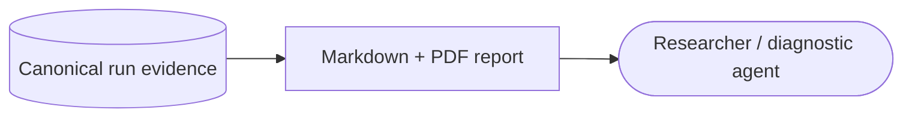

# Run Reports

Run reports are human-readable, derived views of canonical Praxist evidence.
They explain progress without becoming another result, frontier, or baseline
owner.

## Automatic Reports

Praxist writes reports under `<task>/docs/praxist_reports/` when:

- the first credible frontier result beats a known baseline on the same metric;
- the completed-generation count reaches a multiple of three (3, 6, 9, and so
  on); or
- the run reaches a terminal state.

The generated subtree is excluded from task identity, so report refreshes do
not change the task manifest or block a compatible resume.

## Report Structure

Every report follows the same order:

1. **Strongest variants or Pareto front** presents task-declared metrics,
   credibility, and concise mechanism summaries. With no clean frontier entry,
   dimension winners from lower-authority evidence may appear only as clearly
   labeled signals.
2. **Strong-variant lineage** follows only those variants through parents,
   generations, source results, and inherited ideas.
3. **Run health** summarizes artifact consistency, operational friction,
   diagnostic coverage, and caveats.

The PDF companion uses the same facts and adds charts only when task-declared
numeric directions support them. A metric with unknown direction may be shown
as context, but it cannot select a winner, trigger a baseline claim, or drive a
directional chart.

## Generate a Report

`tool_server:run_report` exposes `generate_run_report` inside an agent session.
The `praxist-diagnostic` skill can generate the same report during an explicit
run-health analysis.

Canonical truth remains in result and finding summaries,
`frontier/frontier_manifest.json`, committed `gems/gems_state.json`, and
`gen_N/generation_boundary.json`. Reports never feed promotion or generation
close decisions.
