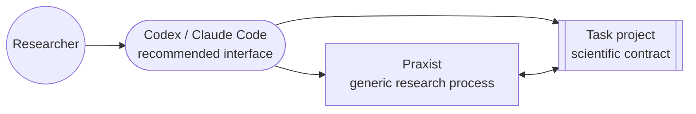

# Praxist

Praxist coordinates parallel research agents, experiments, evidence retention,
and synthesis across generations. It supplies the reusable research process;
your task project supplies the science.

Read the technical paper,
[*Praxist: From Experimental Artifacts to Solution Lineages*](https://arxiv.org/abs/2608.25955),
for the system design and evaluation.

<div class="praxist-figure" markdown>


<p class="praxist-figure-caption">
Parallel work becomes measured evidence, durable research state, and a focused
agenda for the next generation.
</p>

</div>

## Research Infrastructure, Explicit Science

A coding agent is the recommended interface between the researcher and two
deliberately separate systems.

<div class="praxist-diagram" markdown>



</div>

| Praxist owns | The task project owns |
|---|---|
| Peers, generations, orchestration, resource scheduling, and lifecycle | Objective, constraints, baseline, environment, and permitted changes |
| Agent runtimes, evidence transport, durable state, replay, and synthesis | Evaluator, metrics, protocol, evidence maturity, prompts, and roles |

The boundary keeps Praxist reusable across fields and makes the task project
the sole source of domain meaning. [Architecture](concepts/architecture.md)
defines the software boundary; [Task Projects](guides/task-projects.md) defines
the scientific contract.

## Install Praxist

Install and configure Praxist with one command:

```bash
python3 -m pip install --index-url https://pypi.org/simple "praxist[agents,codex]" && praxist setup --interactive --install-skills codex
```

Or let an agent install from PyPI and follow the packaged setup runbook:

```text
codex --yolo
# or: claude --dangerously-skip-permissions
Install and configure Praxist using its packaged OOBE runbook. Stop after readiness checks.
```

Installation never selects a project or starts research. Before the separate
takeover step, read the [Quickstart](getting-started/quickstart.md) and
[Your First Task](getting-started/first-task.md). The selected project must
already contain the code and local resources needed to run its baseline;
Praxist does not invent missing data, simulators, credentials, or measurements.

## Choose A Runtime Profile

<div class="grid cards" markdown>

-   :material-rocket-launch: **Start without an API key**

    ---

    Use an existing Codex login through Codex-native mode.

    [Codex-native profile](getting-started/quickstart.md#codex-native-mode-no-api-key)

-   :material-cash-multiple: **Run cost-efficient long research**

    ---

    Prefer a high-cache-hit-rate [open-source model API](guides/open-source-model-apis.md)
    after a representative quality and cache check.

    [Model API selection](guides/open-source-model-apis.md)

</div>

## Continue After Setup

<div class="grid cards" markdown>

-   :material-flask-outline: **Prepare a research task**

    ---

    Define the research brief, prerequisites, and launch gates.

    [Your first task](getting-started/first-task.md)

-   :material-console: **Operate from the shell**

    ---

    Use the direct CLI for lifecycle and monitoring operations.

    [Direct CLI operations](guides/operators.md)

</div>

## The Research Brief Is the Control Surface

Takeover can inspect code and measure an existing baseline, but it cannot infer
the researcher's priorities. The brief should identify the objective,
credibility standard, allowed resources, exploration policy, and practical run
budget. Those decisions shape research direction, experiment throughput, and
retention from the first generation onward.

[Your First Task](getting-started/first-task.md#write-the-research-brief) provides
a complete example and explains how takeover turns that brief into a validated
task project.

## Find a Specific Answer

| You want to... | Start here |
|---|---|
| Install and configure Praxist | [Installation](getting-started/installation.md) |
| Complete setup and hand off a project | [Quickstart](getting-started/quickstart.md) |
| Understand project prerequisites | [Your First Task](getting-started/first-task.md) |
| Use agent workflows | [Agent Skills](user-guide/skills.md) |
| Diagnose a failure or stall | [Troubleshooting](operations/troubleshooting.md) |
| Understand the research loop | [Research Loop](guides/research-loop-variant-generation-flow.md) |
| Configure a task harness | [Task Projects](guides/task-projects.md) |
| Choose a scaffold or complete reference | [Examples And Templates](guides/examples-and-templates.md) |
| Inspect a complete Python/JAX project | [Rocket Booster Recovery](examples/rocket-booster-recovery.md) |
| Inspect a complete native Rust project | [Rocket Booster Recovery (Rust)](examples/rocket-booster-recovery-rust.md) |
| Extend Praxist | [Developer Guide](guides/contributing.md) |
| Look up an exact command | [CLI Reference](reference/cli.md) |

The [Documentation Policy](about/documentation.md) identifies the sole owner of
each contract.
