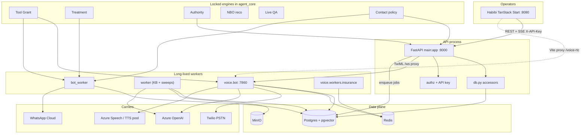

# Repository X-Ray

**Repo:** [susanthp18/Habibi](https://github.com/susanthp18/Habibi) at `D:\Hackathon`
**Product names in code:** Habibi (frontend package / git), BigBound AI (UI chrome), Collections Agent (API title)
**Domain:** regulated collections. Autonomous agents speak to borrowers by voice and WhatsApp; policy engines — not the language model — own money, contact, and consent. Glossary: `CONTEXT.md`.
**Date:** 2026-09-01
**Scope:** read-only structural map. No code was changed except this file.

This workspace is **one git repository** containing one product, plus a **guest tree** (`PRAXIST-main/`) that has no runtime coupling to the product, plus several **scratch trees** that are not applications.

---

## 1. What this repository actually is

A BFSI collections workspace:

- Operators work in a TanStack Start CRM (`Habibi/`).
- Borrowers are spoken to by a Pipecat voice runtime and a WhatsApp bot.
- Postgres is the system of record. Redis is a mesh/session bus. MinIO holds KB originals.
- `agent_core/` is the decision spine (cards, grants, treatment, authority, QA). The LLM proposes; locked engines dispose.

It is **not** a monorepo of peer products. `PRAXIST-main/` is a complete unrelated research platform (Sapient / praxist.sapient.inc) sitting in the same working directory. Habibi does not import it. Backend does not import it except a scratch analyzer (`backend/_tmp_import_graph.py`).

---

## 2. Inventory

### Languages

| Language | Where | Role |
|---|---|---|
| TypeScript / TSX | `Habibi/src` | CRM UI |
| CSS (Tailwind 4) | `Habibi/src/styles.css` | design system |
| Python 3.12 | `backend/` | API, workers, voice, MCP, tests, scripts |
| SQL | `backend/sql/`, Alembic | schema |
| YAML | voice evals, Praxist plugins | scenarios / manifests |
| Jinja2 | Praxist only | research prompts |
| PowerShell | `backend/run_stack.ps1`, `backend/scripts/dev-up.ps1` | local process orchestration |
| Markdown | `docs/`, `CONTEXT.md`, skill packs | domain + ops |
| Rust | `PRAXIST-main/examples/rocket_booster_recovery_rust/` | Praxist example only |
| JSON | seeds, provider catalogs, mesh roles | fixtures |

### Frameworks

| Layer | Stack |
|---|---|
| Frontend | React 19, TanStack Start, TanStack Router (file routes), TanStack Query, Vite 8, Nitro 3 (build), Tailwind 4, Radix/shadcn, XYFlow, Pipecat client, Zod |
| Backend API | FastAPI 0.139 + Uvicorn, SQLAlchemy 2 **engine + raw SQL** (no ORM), Alembic (`target_metadata = None`), Pydantic v2 in `schemas.py` (not `BaseSettings`) |
| Voice | Pipecat 1.6 (Azure, WebRTC, Silero, Deepgram extras), Flows inside pipecat |
| Jobs | **No Celery/ARQ in production.** Postgres `SKIP LOCKED` queues drained by long-lived Python processes. `BOT_QUEUE_BACKEND=postgres\|arq` is a comment, not a second implementation. |
| Workflows | Postgres adapter in `work_runtime/adapter_pg.py`. Temporal adapter exists and **fails closed** (`temporal_adapter_not_promoted`). |

### Package managers

| App | Manager | Manifest | Lockfile |
|---|---|---|---|
| Habibi | **npm is what CI uses** (`npm ci` on `package-lock.json`, Node 22) | `Habibi/package.json` | `package-lock.json` is authoritative. `bun.lock` is **committed and stale** (missing `@pipecat-ai/*`, `@xyflow/react`, `liveline`, `vitest`, `sharp`) |
| backend | pip | `requirements.txt` + `requirements-voice.txt` + `requirements-mcp.txt` | none. `pydantic` is not declared — FastAPI transitive. `pytest`/`ruff` ship in the API image |
| backend tooling | `backend/pyproject.toml` is **Vulture config only**, not a package |
| Praxist | uv / hatchling | `PRAXIST-main/pyproject.toml` | `uv.lock` is **gitignored**. Orphan `PRAXIST-main/requirements.txt` is an unpinned pre-migration ML stack (`transformers`, `wandb`) not used by `uv sync` |

### Applications (runnable processes)

Product:

| Process | Command | Port | Responsibility |
|---|---|---|---|
| CRM API | `uvicorn main:app` | 8000 | HTTP/WS surface for Habibi, Twilio webhooks, WhatsApp verify, pay links |
| KB worker | `python -m worker` | none | `kb_index_jobs` + nightly sweeps (TTS catalog, lead revalidate, follow-ups, compliance, QA autoscore, gardener, purges) |
| Bot worker | `python -m bot_worker` | none | WhatsApp outbound, bot turns, PTP settle, treatment enact, cadence/campaigns, webhook deliveries, call closer |
| Voice runner | `python -m voice.bot` | 7860 | Pipecat SmallWebRTC + Twilio Media Streams |
| Insurance sidecar | `python -m voice.workers.insurance` | none | Redis mesh consumer for insurance handoff |
| MCP server | `python -m mcp_server` | 8081 if HTTP | **separate process**, not mounted on FastAPI |
| Frontend | `npm run dev` in `Habibi/` | 8080 (stack script) | operator UI |

Guest (not part of the product runtime):

| Process | Command | Notes |
|---|---|---|
| Praxist | `praxist start --task-path …` | autonomous research; own Docker for product-usage service |

### Libraries (product-owned packages)

There is **no** installable Python package named `habibi` or `collections`. Backend is a flat directory imported as top-level modules (`import db`, `import main`). The only named package-ish trees are `agent_core/`, `voice/`, `llm_gateway/`, `work_runtime/`.

Frontend package name is leftover Lovable template: `"name": "tanstack_start_ts"`.

### Services (compose)

From `backend/docker-compose.yml`:

- `redis` (7-alpine) — mesh + optional session
- `db` (`pgvector/pgvector:pg16`) — system of record
- `minio` (pinned digest) — KB originals `minio://{bucket}/kb/{doc_id}/{filename}`
- `api`, `worker`, `bot_worker`, `voice`, `voice_insurance` — same image family, different commands

Loopback-bound ports by default (`127.0.0.1:8000` etc.). Production ingress must set `API_BIND`.

### Workers / background / scheduled jobs

**Queue drainers (always-on processes):**

- `worker`: `kb_ingest.drain_queue`
- `bot_worker`: `whatsapp_outbound_jobs`, `bot_turn_jobs` (gated by `BOT_RUNTIME_ENABLED`), treatment plans, webhook_deliveries, bounce voice

**In-process timers on `worker` (not cron, not Celery beat):**

| When (UTC) | What |
|---|---|
| 02:30 daily | Azure TTS catalog sync |
| 01:15 daily | revalidate open leads vs consent |
| ~10 min | escalate overdue follow-ups (does not contact) |
| ~5 min | compliance sweep over completed interactions |
| ~5 min | purge rate-limit counters, stale voice sandbox sessions, customer_memory, stale KB gaps |
| ~2 min | live QA scorecards + optional QA autoscore |
| 03:10 daily | skill gardener drafts unsigned packs from repeated KB gaps |

**On `bot_worker`:** promise settle every 20 iterations; stale outbound attempt reap; treatment follow-through; optional `TREATMENT_SWEEP`.

**Campaign / cadence:** `CAMPAIGN_RUNTIME_ENABLED` (env) **and** `platform_switches.outbound.enabled` (Postgres, default off). Both required to dial.

### Scripts / CLI

`backend/scripts/` is an operator toolbox, not a product CLI:

- `seed_demo.py` — demo graph; refuses `APP_ENV=production`
- `ingest_source_db.py` — load `../source_db` into KB
- `eval_retrieval.py`, `run_voice_evals.py` — retrieval / voice evals
- `train_propensity.py`, `train_treatment_models.py`, `promote_model.py` — ML ops
- `solve_capacity.py`, `power_control_arm.py`, `evaluate_policy.py` — treatment research
- `bench_recommender.py`, `replay_offers.py`, `simulate_offer_decisions.py`, `simulate_treatment_corpus.py`
- `set_twilio_voice_webhook.py`, `dial_test.py`, `repair_voice_ids.py`
- `backfill_kb_minio.py`, `kb_corpus_manifest.py`, `sync_tts_voices.py`
- `rls.py`, `prune_probe_cards.py`, `seed_policy_rules.py`
- `dev-up.ps1` — legacy data-plane up

Root: `backend/run_stack.ps1` is the **canonical native launcher** (stops by command line, not by port).

Praxist CLI (`praxist`, `praxist-uninstall`, …) is unrelated.

### API layers

**One FastAPI app. Zero `APIRouter` modules.** Every HTTP route is declared on `app` in `backend/main.py` (~5,450 lines, **~314** `@app` decorators). Voice signalling is optionally registered via `voice.host.register_routes(app)` when `VOICE_EMBEDDED_HOST=true`. A2A advertises `/.well-known/agent-card.json`.

Auth stack (outer → inner): CORS → RequestId → Metrics → ApiKey → GZip → route. Permission check is a FastAPI dependency (`authz.check` on method + path template). Actor from `API_KEY_MAP` or `X-Actor-User-Id` (spoofable only when allowed).

WhatsApp / Twilio / `/health` / `/ready` / `/ws` are auth-exempt by design.

### Database layers

| Layer | Path | Actual job |
|---|---|---|
| DDL snapshot | `backend/sql/00_*.sql` … `95_views.sql` (25 files) | **authoritative current schema** for empty DBs |
| Migrations | `backend/alembic/versions/` (~102 revisions, `20260721_0001` … `20260901_0103`) | deltas since baseline; CI **stamps** after applying `sql/` |
| Accessors | `backend/db.py` (~18,088 lines) | almost every SELECT/INSERT/UPDATE the API uses |
| Engine | SQLAlchemy `create_engine` in `db.py` | pool sized per `DB_PROCESS_ROLE` |
| Vectors | pgvector on `kb_chunks.embedding` (1536, Azure embedding pin) | RAG |
| RLS | scripts + `tests/test_rls.py` | tenant isolation |

`DATA_MODEL.md` is the map; `sql/` + Alembic are the truth. They have drifted before (`test_schema_parity.py`, migration `0061_close_sql_migration_drift`).

### Frontend applications

Exactly one: `Habibi/`. Lovable-connected TanStack Start app (`@lovable.dev/vite-tanstack-config`, `.lovable/project.json`). Brand: BigBound AI. PWA manifest + icons exist.

Default **dev data plane is mock** (`VITE_USE_MOCK` defaults true). Production build **throws** if mock is on or `VITE_API_BASE_URL` is missing.

### Generated code / build artifacts

| Path | Kind |
|---|---|
| `Habibi/src/routeTree.gen.ts` | TanStack Router generated tree — do not edit |
| `Habibi/.output/`, `.nitro/`, `.tanstack/`, `dist/` | Vite/Nitro build (gitignored) |
| `Habibi/public/icon-*.png` | generated by `npm run icons` |
| `.vite/` at repo root | Vite optimize-deps cache (not an app) |
| `artifacts/` | static-analysis dumps (knip, tsc, oxlint, retrieval JSON) |
| `backend/_tmp_import_graph.py` | forensics scratch, not product |

### Migrations

Alembic chain from `20260721_0001_baseline_current_schema` (intentional no-op baseline of `sql/`) through outbound eval fixtures (`0103`). Seed INSERTs in migrations are gated by `ALEMBIC_SEED_DEMO` (off by default). Demo rows: `scripts/seed_demo.py` → `seed_postgres.py` + `seed/*.json` + `seed_susanth.py`.

### Configuration sources

| Source | Who reads it |
|---|---|
| `backend/.env` (from `.env.example`) | API, workers, voice, compose `env_file` |
| process env / compose `environment:` | remaps `DATABASE_URL` to `@db`, MinIO to `minio:9000` |
| `Habibi/.env.local` (`VITE_*`) | inlined into the **browser bundle** |
| Postgres `platform_switches` | outbound master switch (not an env var) |
| Postgres `provider_configs`, `bot_deployments`, `prompt_versions` | runtime bindings |
| `agent_core/platform_flags.py` | named feature flags, all default **off** |
| `voice/mesh_roles.json` | multi-agent mesh |
| `alembic.ini` | migration URL (overridden by `DATABASE_URL`) |

Secrets must not go in `VITE_*`. Vault envelope: `VAULT_MASTER_KEY` or Azure Key Vault. Skill signatures: `SKILL_PLATFORM_KEY` (different key; must not be reused as vault master).

### Environment-specific code

- `APP_ENV=production\|prod` → API key required at boot, OpenAPI disabled, actor header off by default, vault master required, docs off
- `USE_MOCK` production hard-fail in `Habibi/src/api/config.ts`
- `BILLING_ENV`, `BOT_ENVIRONMENT`, provider `environment` (`sandbox`/`production`)
- Shadow vs live: `RECO_MODE`, `TREATMENT_MODE`, `AUTHORITY_MODE`, `LIVE_QA_BARGE_MODE` — unrecognized values degrade to **shadow**, never off, never live
- Compose vs native: localhost vs Docker DNS names

---

## 3. Logical map

```text
Repository (git: susanthp18/Habibi)
│
├─ PRODUCT ─────────────────────────────────────────────────────────
│  │
│  ├─ applications
│  │    Habibi (operator CRM, TanStack Start)
│  │    Collections API (FastAPI :8000)
│  │    bot_worker, kb worker, voice.bot, voice.workers.insurance
│  │    mcp_server (optional sibling process)
│  │
│  ├─ features (operator screens ↔ API prefixes ↔ engines)
│  │    Live ops     → /  /inbox /handoff /floor
│  │    CRM          → /customers /promises /disputes /documents
│  │                   /callbacks /upsell /dashboard
│  │    Compliance   → /audit /compliance /consent /redaction /qa
│  │    Agent factory→ /agent-studio /sandbox /knowledge-base /routing
│  │    Control plane→ /integrations /webhooks /billing /roles
│  │    Decision     → /treatment /authority /outbound
│  │    Channels     → WhatsApp bot, Twilio voice, hosted pay links
│  │
│  ├─ modules
│  │    Habibi/src/{routes,api,components,data,lib}
│  │    backend/{main,db,schemas}          ← accidental monolith
│  │    backend/agent_core/*               ← intended domain core
│  │    backend/voice/*                    ← channel runtime
│  │    backend/{bot_*,whatsapp*,outbound,campaigns,cadence,mission}
│  │    backend/{kb_*,storage,azure_*}
│  │    backend/llm_gateway, work_runtime  ← flagged, mostly off
│  │
│  ├─ services (data plane)
│  │    PostgreSQL 16 + pgvector
│  │    Redis 7
│  │    MinIO
│  │
│  └─ external systems
│       Azure OpenAI (chat, embeddings, analysis, voice profiles)
│       Azure Speech (TTS catalog + STT)
│       Twilio Voice + SMS
│       Meta WhatsApp Cloud API
│       Cartesia / Deepgram / Groq / ElevenLabs / Fish / OpenRouter (TTS/STT pool)
│       LiteLLM/APIM (optional mouth path)
│       Razorpay (stub)
│       Sentry (inert unless DSN)
│       Lovable (frontend host / error reporting)
│       Azure Key Vault (optional secret seal)
│
├─ CORPUS ── source_db/{FAQ,policy,benefits}  (insurance+collections docs for RAG)
│
├─ DOMAIN DOCS ── CONTEXT.md, docs/adr, docs/ops, docs/agents
│
├─ GUEST ── PRAXIST-main/  (autonomous ML research platform; no product import)
│
└─ SCRATCH ── artifacts/, .loop/, .vite/, _tmp_import_graph.py, pptx
```



---

## 4. Directory responsibilities (from code, not names)

### Root (`D:\Hackathon`)

| Path | Folder name suggests | Code actually does |
|---|---|---|
| `Habibi/` | product name | **Frontend only.** Backend is sibling. |
| `backend/` | API | API **plus** workers, voice runtime, MCP, SQL, seeds, tests, scripts. The whole server-side product. |
| `source_db/` | database | **Static corpus** (FAQ/policy/benefits text). Ingested into KB; not a running DB. |
| `docs/` | product docs | Agent operating docs + 2 ADRs + MCP/vault ops. Not a user manual site. |
| `CONTEXT.md` | — | Canonical glossary (Mouth, Agent Card, Skill Pack, Tool Grant, Mission, …) |
| `CLAUDE.md` | — | Points agents at issue tracker `susanthp18/Habibi` |
| `IDEA.md` | — | Product/on-prem intent (bank interior). Not executable. |
| `demo/` | — | Voice demo script only (`SUSANTH_VOICE_DEMO_SCRIPT.md`). |
| `PRAXIST-main/` | — | Guest research platform. Accidental workspace roommate. |
| `artifacts/` | — | Frozen knip/tsc/oxlint/retrieval reports. Not runtime. |
| `.loop/` | — | Autonomous-dev cycle prompts and diffs. Not runtime. |
| Root `*.md` plans | — | `agent_transformation_*.md`, `outbound-agent-engine.md`, `decision-intelligence-engine.md`, `roadmap-features.md`, `multilingual-architecture.md`, `AGENT_STUDIO_BUG_HUNT.md` — design notes, not apps. |
| `ngrok.exe`, `_make_submission_zip.py`, `_conv_trace/` | — | Local tooling / scratch. |
| `.github/workflows/` | — | Product CI: backend pytest + frontend typecheck/vitest/lint. Praxist has its **own** workflows inside its tree. |
| `.vite/` | — | Local Vite cache. |
| `BigBound_AI_Hackathon.pptx` | — | Pitch deck. |

### `Habibi/`

| Path | Actual responsibility |
|---|---|
| `src/routes/` | File-based screens. `__root.tsx` is the only shell. `prompt-studio.tsx` is a **redirect** to `/agent-studio`. |
| `src/routeTree.gen.ts` | Generated router. |
| `src/router.tsx` | QueryClient + `createRouter`. |
| `src/server.ts` | SSR entry wrapping TanStack Start; rewrites h3-swallowed 500s to HTML. |
| `src/api/` | Live HTTP client (`config.ts` is the mock/live switch) + one module per domain. React Query hooks live here, not in a store. |
| `src/data/*-seed.ts` | **Offline mock CRM.** Parallel universe of the same screens. Still the default in `vite dev`. |
| `src/components/<feature>/` | Screen-specific UI. Mostly 1:1 with routes. |
| `src/components/prompt-studio/` | Agent Studio editors (legacy folder name). |
| `src/components/ui/` | shadcn/Radix kit. Knip reports most of it unused. |
| `src/components/shell/` | Sidebar nav (the real IA), command palette, top bar. |
| `src/components/flow/` | XYFlow canvas for authored conversation graphs. |
| `src/components/sandbox/voice/` | Pipecat SmallWebRTC live-call hook. |
| `src/lib/` | Brand, theme, error reporting to Lovable, offer/authority policy copies, workspace deep links. |
| `src/hooks/` | Tiny. `use-mobile.tsx` flagged unused by knip. |
| `vite.config.ts` | Lovable defineConfig + `/voice-rtc` proxy to `:7860` (or API if embedded host). |
| `scripts/` | icon gen + design-scale linters (spacing/type). |
| `.lovable/` | Hosted-frontend project metadata. |

**Nav groups** (from `Sidebar.tsx`, the real product IA):

1. Live operations — workspace, inbox, handoff, floor
2. CRM & resolution — dashboard, customer 360, PTP, disputes, documents, callbacks, upsell, decision intelligence
3. Compliance & QA — audit, compliance, consent, redaction, QA, bot analytics
4. Bot configuration — KB, agent studio, sandbox, routing, integrations, webhooks, billing, roles

### `backend/` top-level

| Path | Actual responsibility |
|---|---|
| `main.py` | God HTTP module: app factory, middleware, **all routes**. |
| `db.py` | God data module: engine, tenant, ~every query, serializers. |
| `schemas.py` | Pydantic response/request contracts (~3,450 lines). |
| `authz.py` | Permission catalog + path→permission map. |
| `actor_context.py` / `tenant_context.py` / `request_context.py` | request identity |
| `env_loader.py` / `env_utils.py` | `.env` load without leaking into `db` import |
| `worker.py` | KB worker + many unrelated nightly jobs |
| `bot_worker.py` | outbound/text/treatment drain loop |
| `bot_runtime.py` / `bot_jobs.py` / `bot_tools.py` | WhatsApp **mouth** turn loop |
| `whatsapp.py` / `whatsapp_outbound.py` | Meta Graph send + job table |
| `twilio_sms.py` | SMS fallback |
| `voice/` | PSTN/WebRTC runtime |
| `voice_sandbox.py` / `sandbox_runtime.py` | Call sandbox (text + live) |
| `kb_ingest.py` / `kb_retrieve.py` / `kb_rate_limit.py` | RAG pipeline |
| `storage.py` | MinIO |
| `azure_openai.py` / `azure_speech.py` | provider SDKs (mouth path unless gateway on) |
| `llm_gateway/` | optional LiteLLM/APIM client + canary |
| `mission.py` | outbound Mission object (why this call exists) |
| `outbound.py` / `campaigns.py` / `cadence.py` / `call_closer.py` | dialer bookkeeping |
| `contact_policy.py` / `contact_window.py` | statutory/preference caps |
| `flow_graph.py` | authored graph validate/catalog |
| `prompt_render.py` / `prompt_lint.py` | system prompt assembly + lint |
| `payment_events.py` / `promise_fulfillment.py` | money events + PTP settle |
| `webhooks_dispatch.py` | outbound webhook queue |
| `qa_autoscore.py` | post-call rubric drafts |
| `pii_redact.py` | redaction helpers |
| `circuit_breaker.py` / `observability.py` | Azure/Meta/MinIO breaker + Prometheus `/metrics` |
| `platform_switches.py` | DB-backed kill switches |
| `mcp_server.py` / `mcp_tools.py` | MCP process |
| `work_runtime/` | durable jobs (Postgres now, Temporal stub) |
| `ops_screens.py` | integrations catalog served to UI |
| `seed_postgres.py` / `seed_susanth.py` / `seed/` | demo graph |
| `sql/` vs `alembic/` | dual schema ownership |
| `_tmp_import_graph.py` | not product |

### `backend/agent_core/` (intended architectural core)

| Package | Actual job |
|---|---|
| `cards/` | Agent Card schema, compile **gates**, clone, routing, handoff policy |
| `tools/grant.py` | **the** Tool Grant / Offer owner (ADR-0001) |
| `tools/catalog.py` | tool registry + MCP channel allowlist |
| `tools/domain.py` | CRM tool handlers |
| `tools/kb*.py` | retrieve, plan, rerank |
| `skills/` | Skill Pack load/sign/lint/gardener + 11 first-party packs |
| `authority/` | rupee caps; model does not choose the number |
| `treatment/` | next-best-treatment EV engine + enact + follow-through |
| `reco/` | next-best-offer; default `shadow` |
| `live_qa/` | in-call detectors; barge gated `LIVE_QA_BARGE_MODE` |
| `compliance/` | post-call rule scan |
| `eval/` | suites, graders, critiques, twin corpus, graduate |
| `providers/` | STT/TTS pool (Cartesia, Deepgram, Groq, ElevenLabs, Fish, OpenRouter) |
| `connectors/` | first-party + tenant connector governance |
| `vault/` | envelope for connector secrets |
| `mcp_http/` | HTTP MCP app (used by `mcp_server`, not FastAPI) |
| `platform_flags.py` | factory flags, all off |
| `understanding.py` / `intent.py` / `sentiment.py` / `lexicon.py` | turn understanding (LLM primary, keywords fallback) |
| `a2a.py` / `twin.py` / `vision.py` / `policy_export.py` / `canary.py` | flagged or young surfaces |

First-party skill packs on disk:

`verify-and-disclose`, `ptp-negotiate`, `broken-ptp-chase`, `dispute-capture`, `hardship-intake`, `doc-fulfil`, `upsell-pitch`, `insurance-lapse`, `floor-coach`, `supervisor-brief`, `qa-examiner`.

### `PRAXIST-main/`

A **second product** (Python package `praxist`, CLI `praxist start`). Plugin architecture, research loop, own tests/CI/docs, vendored Rust example. Treat as **out of scope for Habibi refactors** unless the goal is to delete or relocate it.

---

## 5. Frontend topology

**Entry**

- Browser: Vite dev (`Habibi/vite.config.ts`) or Nitro/Cloudflare build from `src/server.ts`
- Start middleware: `src/start.ts`
- Router: `src/router.tsx` → `routeTree.gen.ts`
- Shell: `src/routes/__root.tsx` (document). **`AppShell` is not a route layout** — almost every page wraps it by hand. No login `beforeLoad`.

**Routes (URLs)**

| URL | File | Notes |
|---|---|---|
| `/` | `index.tsx` | My workspace |
| `/inbox` | `inbox.tsx` | WhatsApp/SMS threads |
| `/handoff` | `handoff.tsx` + lazy | live takeover |
| `/floor` | `floor.tsx` | supervisor floor |
| `/dashboard` | `dashboard.tsx` | KPIs |
| `/customers`, `/customers/$customerId` | + lazy | Customer 360 |
| `/promises` `/disputes` `/documents` `/callbacks` `/upsell` | matching files | CRM queues |
| `/treatment` | + lazy | Decision intelligence |
| `/audit` `/compliance` `/consent` `/redaction` `/qa` `/bot-analytics` | matching | compliance |
| `/knowledge-base` | + lazy | RAG console |
| `/agent-studio`, `/$botId`, `/skills` | agent-studio.* | Mouth authoring |
| `/prompt-studio` | redirect | legacy URL |
| `/sandbox` | + lazy | text + live WebRTC |
| `/routing` `/integrations` `/webhooks` `/billing` `/roles` | matching | control plane |

**State:** TanStack Query only. No Redux/Zustand. Mock vs live is a compile-time-ish env switch in `api/config.ts`.

**API client:** `fetch` to `VITE_API_BASE_URL`, headers `X-API-Key` / `X-Actor-User-Id`, credentials include. SSE via `apiEventStream`. Voice: Pipecat client through `/voice-rtc` proxy.

**Auth:** there is **no** Clerk/Auth0/Supabase. Shared API key in the browser for demo; production intends `API_KEY_MAP` server-side. CORS cookie mode if `CORS_ORIGINS` set.

**Tests:** 11 vitest files in Node (no jsdom, no Testing Library). Pure functions only. No Playwright. CI: `tsc`, `vitest run`, `eslint` (warnings allowed). Voice YAML evals (`voice/evals/`, 15 scenarios) and retrieval/policy scripts are **operator tools, not CI**. Backend pytest is ~186 files against live Postgres; schema-parity and RLS use scratch DBs.

**Knip (artifacts):** 33 unused files (mostly `components/ui/*` shadcn leftovers), 27 unused npm deps (Radix pieces, recharts, vaul, embla, react-hook-form, date-fns, …). `liveline` is declared; charts also have custom `components/charts`.

---

## 6. Backend topology

**Entry:** `uvicorn main:app` (`FastAPI` constructed mid-file after middleware helpers). Lifespan loads env, optionally starts embedded voice host.

**There is no router package.** Prefixes in `main.py`:

| Prefix | Domain |
|---|---|
| `/health` `/ready` `/metrics` | probes |
| `/customers` `/dashboard` `/calls` `/interactions` | CRM spine |
| `/promises` `/payment-plans` `/disputes` `/callbacks` `/leads` `/document-requests` `/consent` `/violations` | collections workflow |
| `/handoff` `/floor` `/supervisor-actions` | live ops |
| `/conversations` | inbox |
| `/kb/*` | RAG |
| `/prompt-versions` `/flow/*` `/agent-studio/*` `/persona-presets` `/tts-voices` | Mouth authoring |
| `/sandbox/*` `/voice/sandbox/*` `/twins` `/eval/*` | sandbox + eval |
| `/connectors` `/vault` `/mcp` `/a2a` `/providers` | factory / integrations |
| `/roles` `/platform/switches` `/demo/outbound-call` | access + kill switches |
| `/webhooks/whatsapp` (+ singular alias) | Meta inbound |
| `/twilio/voice/*` `/twilio/sms/status` `/ws` | telephony |
| `/pay/{token}` `/webhooks/payments` `/webhooks/collections/payment-events` | PTP fulfillment |
| `/treatment/*` `/authority/*` `/outbound/*` | decision + dialer |
| `/billing` `/webhook-endpoints` `/event-types` | admin |
| `/stt/transcribe` `/tts/preview` | studio speech |

**Voice hosting modes**

1. Standalone (default): API `:8000` + `voice.bot` `:7860`; API proxies `/ws`; Vite proxies `/voice-rtc`.
2. Embedded: `VOICE_EMBEDDED_HOST=true` — Pipecat runner inside uvicorn. Same `voice.bot.bot` entry.

**WhatsApp path:** Meta → `POST /webhooks/whatsapp` → enqueue `bot_turn_jobs` (if `BOT_RUNTIME_ENABLED`) and always enqueue agent outbound via `whatsapp_outbound_jobs`. **API 200 does not mean the message left.** Missing `bot_worker` is the classic silent failure.

**Outbound path:** treatment/campaign → `call_attempts` → `voice.twilio_ops.start_outbound_call` **only after** `platform_switches.outbound.enabled`. Mission assembled in `mission.py`, not in the prompt.

---

## 7. Infrastructure / deployment topology

**Local production-shaped stack:** `backend/docker-compose.yml` (+ optional `docker-compose.dev.yml` bind-mount).

**Images:** one Dockerfile, two targets (`base` API/workers, `voice` + Pipecat native deps). Python 3.12-slim.

**CI (Habibi repo):**

- `.github/workflows/backend-pytest.yml` — Postgres service, apply `sql/*`, Alembic stamp, seed, `ruff`, `pytest`. Installs `requirements-voice.txt` so voice tests collect.
- `.github/workflows/frontend-typecheck.yml` — Node 22, `npm ci`, tsc, vitest, lint.

**No** Kubernetes, Terraform, Fly, Railway, Render, Vercel, Caddy, or systemd units in the product tree. Habibi has **no Dockerfile**. `mcp_server` is **not** a compose service.

**Frontend deploy:** Lovable-connected git. Vite/Nitro default target is **Cloudflare Workers**. Repo CI typechecks only — **no publish job**. `VITE_API_BASE_URL` must be set for production builds. There is **no login route**; `AppShell` is wrapped per page, not a `_layout` route.

**Backend deploy:** Docker Compose or `run_stack.ps1` on a single node (IDEA.md: inside the bank network). Repo CI is pytest only — **no image publish**.

**Praxist** has the **only remote deploy automation** in the tree: GHCR `praxist-collector` → SSH bastion → Nginx on loopback `:8110`. That workflow deploys **development**, not production. It does not gate Habibi.

**Native entry:** `backend/run_stack.ps1` starts API, bot_worker, kb worker, voice, insurance sidecar, then `npm run dev` in `Habibi/`.

---

## 8. Dependency topology

**Habibi production highlights:** React 19, TanStack Start/Router/Query, Radix suite, XYFlow, Pipecat client + small-webrtc-transport, Zod, CVA, liveline.

**Backend `requirements.txt` (API image):** FastAPI, uvicorn, SQLAlchemy, psycopg, Alembic, openai, tiktoken, httpx, minio, twilio, redis, websockets, prometheus-client, sentry-sdk, pytest, ruff. **No Pipecat here.**

**`requirements-voice.txt`:** `pipecat-ai[azure,webrtc,runner,silero,deepgram]==1.6.0`, numpy, fastembed. Speechmatics deliberately omitted (~1GB). Cartesia/ElevenLabs/Groq/Gladia use HTTP inside Pipecat with no extra SDK.

**`requirements-mcp.txt`:** `mcp>=1.2.0` only.

**Duplicate Azure/OpenAI clients:** `openai` SDK in API image; Pipecat Azure services in voice image; optional LiteLLM HTTP in `llm_gateway`.

**No lockfile** for Python → CI uses the pins in requirements files. Comments say they were taken from a known-good venv.

---

## 9. Testing topology

| Suite | Entry | What it is |
|---|---|---|
| Backend pytest | `cd backend && pytest -q` | ~186 test modules. Mix of unit, API, schema parity, RLS, voice (needs pipecat), grant characterization. Uses live Postgres (CI service or local). Voice Pipecat YAML evals are **not** in this job. |
| Voice eval YAML | `scripts/run_voice_evals.py` + `voice/evals/suite.yaml` | 15 scenario files (PTP, DND, upsell suppression, handoff honesty, …) |
| Retrieval eval | `scripts/eval_retrieval.py` + `artifacts/retrieval_*.json` | offline-ish RAG measurement |
| Frontend vitest | `npm test` / CI | 11 files, decision helpers + seeds |
| Frontend tsc/eslint | CI | typecheck + design-scale scripts |
| Praxist unittest/coverage | inside `PRAXIST-main/` | huge, **orthogonal** |

**Missing:** browser e2e, contract tests that drive Habibi against the API with mock off, load tests (except ad-hoc scripts).

`backend/tests/conftest.py` forces `KB_PLANNER_ENABLED=false` so CI does not call Azure.

---

## 10. Configuration topology

**Single operator file:** `backend/.env.example` is a long, commented contract (Meta, Azure×several profiles, MinIO, pools, contact caps, treatment/authority/QA modes, factory flags, Twilio, Cartesia/Deepgram/Groq/ElevenLabs/Fish/OpenRouter).

**Runtime config that is not env:**

- `platform_switches` table — `outbound.enabled` and `outbound.demo_ignores_window`
- published Agent Card + `bot_deployments` — which Mouth is live
- `provider_configs` per environment
- `CONTACT_*` env still exists alongside DB contact events

**Duplication:** TENANT_ID in `.env` vs `db.py` reading `.env` itself (comment documents a past split-brain). Voice Azure profile vs chat profile vs analysis profile — four Azure client configurations.

**Frontend:** `VITE_USE_MOCK`, `VITE_API_BASE_URL`, optional `VITE_API_KEY` / `VITE_ACTOR_USER_ID`, plus `VITE_AUTHORITY_*` for mock-mode policy parity. Everything else is server state. No Pydantic `BaseSettings` on the backend — plain `os.getenv` + `env_loader`.

---

## 11. Integration / provider topology

| System | Direction | Owner | Production vs other |
|---|---|---|---|
| Azure OpenAI chat/tools | outbound | `azure_openai.py`, voice `llm_pool.py` | **primary mouth** unless `LLM_GATEWAY_ENABLED` |
| Azure embeddings | outbound | KB worker | required for ingest; dim pinned 1536 |
| Azure Speech TTS/STT | outbound | `azure_speech.py`, catalog sync | default studio voices |
| Twilio Voice | in+out | `main.py` TwiML + `voice/twilio_ops.py` | PSTN; master switch in DB |
| Twilio SMS | outbound | `twilio_sms.py` | fallback when WA opted out |
| Meta WhatsApp | in+out | `whatsapp.py`, webhook in `main.py` | Cloud API; templates outside 24h window |
| Redis | internal | voice mesh, optional queues | required for insurance sidecar |
| MinIO/S3 API | internal | `storage.py` | KB binaries |
| Postgres | internal | `db.py` | SoR |
| Cartesia/Deepgram/Groq/ElevenLabs/Fish/OpenRouter | outbound | `agent_core/providers/` | pooled TTS/STT; studio-bindable |
| LiteLLM / APIM | outbound | `llm_gateway/` | **off** until flag |
| Razorpay | inbound stub | `/webhooks/payments/{provider}` | `PAYMENT_PROVIDER=hosted` default |
| Hosted pay page | inbound | `GET/POST /pay/{token}` | PTP sandbox HTML |
| Sentry | outbound | SDK import | inert without `SENTRY_DSN` |
| Lovable | outbound (errors) + host | `lovable-error-reporting.ts` | frontend hosting |
| MCP clients (Cursor etc.) | inbound | `mcp_server` | read-only catalog; mutating tools 403 |
| CBS core banking | UI catalog only | integrations seed `cbs` | **not** in `LIVE_PROVIDER_IDS` |
| OpenAI (non-Azure) | UI catalog | seed `openai` | live filter drops it |
| Temporal | none | `adapter_temporal.py` | raises if flag on |
| Email | — | consent/documents schema | **no SMTP/SendGrid/SES sender** |
| Internal Clerk agent | `agent_core/clerk.py` | HITL chase jobs on `bot_worker` | **not** Clerk the auth SaaS |
| First-party LMS/paylink | `agent_core/connectors/first_party.py` | same Postgres | production-shaped; not a remote CBS |
| Gladia STT | provider registry | outbound | optional |
| Speechmatics STT | provider registry | outbound | seeded; **not** in `requirements-voice.txt` |
| Praxist | none | guest tree | no product calls |

`LIVE_PROVIDER_IDS` in the frontend: `azure_openai`, `azure_speech_stt`, `azure_speech_tts`, `twilio`, `whatsapp`. Everything else on the Integrations screen is mock-catalog theatre unless the API provider registry grew past that filter.

---

## 12. Entry points (cheat sheet)

| Kind | Path |
|---|---|
| Frontend entry | `Habibi/src/server.ts` (SSR), `Habibi/src/router.tsx` (client router), `Habibi/src/routes/__root.tsx` (shell), `npm run dev` |
| Backend HTTP | `backend/main.py` → `app`; `uvicorn main:app --port 8000` |
| API docs (non-prod) | `http://127.0.0.1:8000/docs` |
| Worker | `python -m worker` |
| Bot/outbound worker | `python -m bot_worker` |
| Voice | `python -m voice.bot --host 127.0.0.1 --port 7860` |
| Insurance mesh | `python -m voice.workers.insurance` |
| MCP CLI | `python -m mcp_server` |
| Voice spike/bench | `python -m voice.spike` |
| Stack | `backend/run_stack.ps1` |
| Tests | `backend`: `pytest`; `Habibi`: `vitest run` / `tsc --noEmit` |
| Deploy (local) | `docker compose up -d --build` from `backend/` |
| Deploy (frontend) | Lovable sync of `Habibi/` on the connected branch |
| Schema | `sql/*.sql` then `alembic stamp head`, or `alembic upgrade head` on already-stamped DBs |
| Demo data | `python scripts/seed_demo.py` |
| Corpus | `python scripts/ingest_source_db.py` (needs `SOURCE_DB_ROOT`) |

---

## 13. Boundaries

### Obvious (real, worth preserving)

- **Policy vs mouth.** Tool Grant (`agent_core/tools/grant.py`), treatment, authority, contact policy, live QA. ADR-0001/0002. Cardless agent → no tools.
- **Process isolation.** API does not send WhatsApp or index KB; workers do. Voice is a separate image because of Pipecat’s native stack.
- **MCP not on FastAPI.** Documented three independent reasons; tests pin mutating tools off the MCP channel.
- **sql/ as current schema + Alembic as history** — awkward but explicit in CI.
- **Shadow/live knobs** that fail toward shadow.
- **Outbound master switch in Postgres**, not env, so an operator can stop dialling without four restarts.
- **Frontend mock vs live** as a single module (`api/config.ts`).
- **Skill packs as signed artifacts**, gardener cannot sign.

### Accidental

- **`main.py` + `db.py` as the entire application layer.** Features have folders under `agent_core/` and `Habibi/src/components/`, then punch through two god files.
- **`worker.py` is not a KB worker.** It is a cron-in-a-loop for TTS, leads, follow-ups, compliance, QA, gardener, purges.
- **`bot_worker.py` is not a bot worker.** It is the outbound/treatment/webhook/closer bus.
- **`Habibi/` vs product name vs `backend/`.** Git repo, UI folder, and API folder disagree.
- **`prompt-studio` directory / API `/prompt-versions` vs UI “Agent studio” / `/agent-studio`.**
- **`bot` identifiers vs glossary Mouth.** Tables and `BOT_ID=kaia-v2-4` still say bot.
- **Dual frontend lockfiles** (npm CI vs bun local).
- **Dual Python packaging** (pip requirements, pyproject is Vulture).
- **PRAXIST-main inside the Habibi working copy.**
- **Compose service `worker` vs module `worker` vs “KB worker” vs `bot_worker`.**

### Mixed-responsibility directories

| Directory | Mix |
|---|---|
| `backend/` root | HTTP, SQL, WhatsApp, Twilio, seeds, observability, money, contact policy — dozens of domains as sibling modules |
| `backend/worker.py` | indexing + 8 unrelated schedules |
| `backend/bot_worker.py` | chat replies + carrier sends + treatment + webhooks + closer |
| `Habibi/src/components/ui/` | design system + unused shadcn dump |
| `Habibi/src/data/` | mock CRM that still encodes business rules (SLA, contactability) also present on the server |
| `backend/scripts/` | seed, eval, ML training, Twilio admin, capacity research |
| `docs/` | agent skills + ADRs + ops; no user docs site |

### Catch-alls / dumping grounds

- `backend/db.py` (~18k lines) — **the** dumping ground
- `backend/main.py` (~5.4k) — HTTP dumping ground
- `Habibi/src/components/ui/` — Radix catalog
- `artifacts/` — analysis residue
- `.loop/` — agent-loop residue
- `backend/_tmp_import_graph.py`

### Modules with excessive responsibility

1. `db.py` — identity, CRM, KB, billing, sandbox, cards, routing, redaction, QA, campaigns…
2. `main.py` — every HTTP concern including TwiML, pay HTML, SSE copilot, demo dialer
3. `voice/bot.py` (~2.6k) — pipeline construction, Flows, tools, persistence hooks
4. `seed_postgres.py` — entire demo universe
5. `worker.py` — see above
6. `ops_screens.py` (~1.8k), `capture.py` (~1.8k), `followups_db.py` (~1.6k), `outbound.py` (~1.4k), `bot_runtime.py` (~1.3k) — partial extractions that did not shrink `db.py`

### Duplicated ownership

| Concern | Copies |
|---|---|
| Schema | `sql/*.sql` **and** Alembic **and** `DATA_MODEL.md` |
| Screen data | `Habibi/src/data/*-seed.ts` **and** Postgres |
| Tool lists | historically many; ADR-0001 says grant.py is now the one (tests: `test_tool_grant*.py`) |
| Flow graph | hardcoded `voice/flows.py` **and** authored DB graph **and** `voice/flow_export.py` mirror |
| Provider catalog | `ops_screens.py` / API `/providers` **and** `integrations-seed.ts` (live filter is a third list) |
| Understanding | keyword lexicon **and** LLM understanding |
| Offer policy | `Habibi/src/lib/offer-policy.ts` **and** `agent_core/reco` |
| Package lock | npm + bun |

### Suspicious legacy / abandoned

| Item | Evidence |
|---|---|
| `PRAXIST-main/` | full unrelated product; no Habibi import |
| `voice/spike.py` + `SPIKE_NOTES.md` | latency probe, still runnable, not compose |
| `work_runtime/adapter_temporal.py` | explicit “not promoted” |
| Factory flags in `platform_flags.py` | cards/MCP/A2A/eval/redteam/gateway/vision/temporal/policy_export all default off — **code exists, runtime mostly dark** |
| `PAYMENT_PROVIDER=razorpay` | stub |
| Integrations seed `cbs`, `openai`, `pipecat` as providers | filtered out live |
| `BOT_QUEUE_BACKEND=arq` comment | no ARQ implementation found |
| `/prompt-studio` route | redirect only |
| `screens.md` mentions in `DATA_MODEL.md` | Notifications Center, Org Settings, User Management **not** routes |
| Knip unused UI kit + `use-mobile.tsx`, `offer-health.ts`, `AlertLane`, `CallTile`, `ScenarioList`, `records/index.ts` |
| `backend/pyproject.toml` | Vulture, not packaging |
| Default `VITE_USE_MOCK=true` | UI can look complete while API/workers are down |

### Abandoned-looking but actually load-bearing

- `sql/` looks “legacy vs Alembic” — CI still applies it first.
- `seed/*.json` looks frontend-era — `seed_postgres.py` still consumes it.
- `components/prompt-studio/` name is stale; the files are Agent Studio.

---

## 14. Topology diagram (processes)

```text
                    ┌──────────────┐
                    │   Browser    │
                    │ Habibi :8080 │
                    └──────┬───────┘
           REST/SSE        │         /voice-rtc (Vite proxy)
                           │                    │
                           v                    v
                    ┌────────────┐      ┌──────────────┐
            ┌───────│ API :8000  │──────│ voice.bot    │
            │       │ main:app   │ /ws  │ Pipecat :7860│
            │       └─────┬──────┘      └──────┬───────┘
            │             │                    │
            │             │ SKIP LOCKED        │ mesh
            │             v                    v
            │       ┌──────────┐         ┌─────────┐
            │       │ Postgres │         │  Redis  │
            │       │ pgvector │         └────┬────┘
            │       └────┬─────┘              │
            │            │                    v
            │            │             voice.workers.insurance
            │            v
            │       ┌─────────┐
            │       │  MinIO  │
            │       └─────────┘
            │
     ┌──────┴──────┐
     │             │
     v             v
 bot_worker     worker (KB+)
     │             │
     ├─ Meta WA    ├─ Azure embed
     ├─ Twilio SMS ├─ TTS catalog
     └─ treatment  └─ QA/compliance sweeps
```

---

## 15. Implications for any later refactor (map only, no plan)

The **real** modules already exist under `agent_core/`, `voice/`, `Habibi/src/api|components|routes`. The **false** center of gravity is `main.py` + `db.py` + mock seeds.

A structural cut that follows the code rather than the folders would be:

- keep `agent_core` as the grant/policy/card boundary
- keep `voice` as the channel runtime
- keep workers as process boundaries (but rename them to match what they drain)
- split HTTP by prefix
- split `db.py` along the same prefixes / `DATA_MODEL.md` domains
- treat `PRAXIST-main/`, `.loop/`, `artifacts/` as non-product
- treat `src/data/*-seed.ts` as a disposable facade, not a second backend

Nothing in this document is a recommendation to execute those cuts. It is the map to use before anyone does.

---

## 16. Probe method

Seven parallel read-only surveys (frontend, backend, infra, dependencies, tests, configuration, integrations) plus a first-pass walk of compose, CI, `main.py`, `db.py`, workers, `.env.example`, and `Sidebar.tsx`. There is no Habibi↔Praxist import edge. Root listing also showed plan markdown, `demo/`, `ngrok.exe`, and CodeRabbit scratch at the workspace root — not applications.
)
