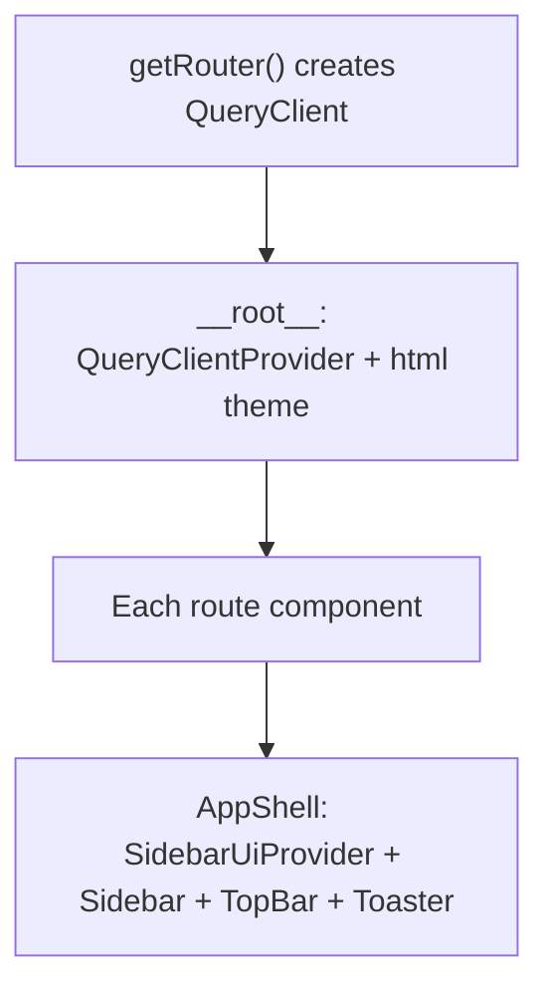

# Frontend Architecture Audit

Habibi collections workspace (`Habibi/`). TanStack Start + React 19 + TanStack Query + TanStack Router.

**Date:** 2026-09-01
**Mode:** read-only forensics. No code was changed.
**Companion reports:** `01-repository-xray.md`, `02-domain-capability-map.md` (same audit series).

## 1. Executive Summary

The frontend is a **page-centric CRM shell** that grew by cloning feature pages. There is a real data client (`src/api/config.ts`), a real design token system (`src/styles.css`), and several well-aimed primitives (`QueryState`, `confirm-gate`, `RecordsTable`, `charts/`). Those primitives are **not the architecture**. The architecture is: one `AppShell` wrapper copied into ~30 route files, feature UI under `src/components/<name>/`, types and formatters living in `src/data/*-seed.ts`, and TanStack Query keys as ad-hoc string arrays.

The damage from incremental AI-assisted development is not a missing Redux store and not “too many routes.” It is:

1. **God pages** that own data, mutation, form state, and layout (Mouth editor ≈1600 lines; treatment scoreboard ≈1430 lines with no `components/treatment/` folder).
2. **Seed files as the domain model.** UI, API, and tests import types and `fmtMoney` from mock fixtures.
3. **Three mutation homes** for the same job: `useMutation` in `src/api/*`, the same hook inlined in the route, and again inside a leaf component.
4. **A loading/error primitive that names the product’s #1 lie** (`query.data ?? []`) and is then used in two call sites while the rest of the app keeps doing the lie.
5. **Cross-feature leakage** of layout primitives, policy mutations, and seed types, with no feature public API.

There is **no god context**. Global client state is small (theme, sidebar collapse, notification-read set). That is a strength. The debt is **god routes, leaked infrastructure, and duplicated kits**, not missing global state.

**Overall:** the app is shippable as a dense operator console; it is not a feature-oriented frontend. Refactor should be **incremental extraction**, not a rewrite.

| Lens | Verdict |
|------|---------|
| Routing / layouts | No pathless layout. `AppShell` remounts per page. Lazy loading is inconsistent. Mouth editor lives in a redirected route file. |
| Components | Feature folders exist, but pages still orchestrate. Treatment has no folder. Several 500–1300 line files. |
| State | Query + URL + local is the right model. Duplicate **mirrors** of server state are the problem. |
| Data fetching | Solid `apiGet`/`ApiError` core. Query keys and mutation ownership are not a system. |
| Shared UI | `records/` and `charts/` are real. shadcn kit is half-dead. KPI strips and filter bars are copy-pasted. |
| Styling | Token system + scale linters are real. Dual spacing scales and leftover shadcn colors still mix. |

## 2. Scope

**In scope**

- `Habibi/src/routes/`
- `Habibi/src/components/`
- `Habibi/src/api/`
- `Habibi/src/data/`
- `Habibi/src/lib/`
- `Habibi/src/hooks/`
- `Habibi/src/styles.css`, `Habibi/scripts/check-spacing-scale.mjs`, `Habibi/scripts/check-type-scale.mjs`
- `Habibi/src/router.tsx`, `Habibi/src/routes/__root.tsx`, `Habibi/package.json`

**Out of scope**

- `backend/` (except where the UI reimplements or bypasses it)
- Praxist and other workspace trees
- Generated `routeTree.gen.ts` internals
- Implementing the target structure

**Not claimed**

- Runtime bundle sizes, Chrome performance traces, or visual regression.
- That a static unused-import is safe to delete (see §8).

## 3. Methodology

Six analysis lenses were run in parallel (route/page, component hierarchy, state, API/data, shared UI, styling), then synthesized against a full-tree inspection:

- Inventory of 44 route modules, 48 API modules, ~331 component files, 28 seed modules.
- Line counts via PowerShell `Measure-Object -Line` (content lines, not raw line count).
- Import graph: `@/components/*`, `@/data/*`, `@/api/*`, `useQuery` / `useMutation` / `queryKey`, `USE_MOCK`, `createContext`.
- Pattern counts: `AppShell`, `QueryState`, `LoadingState`, `parseDeepLinkSearch`, `fmtMoney`, MetricsStrip/FiltersBar clones, dead `ui/` primitives.
- Distinction recorded per finding: **observed fact** vs **strong inference** vs **recommendation**.

Domain vocabulary follows `CONTEXT.md` (Mouth, Agent Card, Skill Pack, Mission, Cadence, Outcome, Handoff, Flow, Gate, Tool Grant, Offer). Identifier leftovers such as `botId` are called out as naming debt, not as product language.

## 4. Repository / System Context

### 4.1 What is actually there

```text
Habibi/src/
  routes/            file-based TanStack Router pages (eager + some *.lazy.tsx)
  components/        feature folders + ui/ + charts/ + records/ + shell/
  api/               fetch helpers + React Query hooks + mock branches (USE_MOCK)
  data/              seed fixtures; also the de facto TypeScript domain model
  lib/               theme, brand, workspace deep-links, offer/authority copy, insights
  hooks/             two files (use-min-width used; use-mobile unused)
  router.tsx         QueryClient + createRouter
  styles.css         Atlassian-port tokens (spacing-100, heading-*, dark class)
```

No `src/features/`, no `src/contexts/`, no store library (Redux/Zustand/Jotai). React Query is the server-state cache. That is appropriate.

### 4.2 Runtime skeleton (observed)



**Fact:** `AppShell` is not a router layout. It is imported and wrapped by essentially every page (`Habibi/src/components/shell/AppShell.tsx`, used from `index.tsx`, `inbox.tsx`, `prompt-studio.lazy.tsx`, …). Nested `agent-studio` and `customers` layouts only render `<Outlet />` (`Habibi/src/routes/agent-studio.tsx`, `Habibi/src/routes/customers.tsx`).

**Fact:** Root error/not-found UI exists (`Habibi/src/routes/__root.tsx`). No child route declares `errorComponent` or `pendingComponent`.

### 4.3 Feature map (UI folders vs routes)

| Capability (product) | Route(s) | Component folder | API module | Seed types |
|---|---|---|---|---|
| My workspace | `/` | `workspace/` | `workspace.ts`, `me.ts` | `workspace-seed.ts` |
| Conversation inbox | `/inbox` | `inbox/` | `inbox.ts` | `inbox-seed.ts` |
| Handoff | `/handoff` | `handoff/` | `handoff.ts` | `handoff-seed.ts` |
| Floor command | `/floor` | `floor/` | `floor.ts` | `floor-seed.ts` |
| Executive dashboard | `/dashboard` | `dashboard/` | `dashboard.ts` | `dashboard-seed.ts` |
| Customer 360 | `/customers`, `/customers/$customerId` | `customer360/` | `customers.ts`, `contact-policy.ts`, `authority.ts` | `customer360-seed.ts` |
| Promise to pay | `/promises` | `promises/` | `promises.ts` | `promises-seed.ts` |
| Disputes | `/disputes` | `disputes/` | `disputes.ts` | `disputes-seed.ts` |
| Document desk | `/documents` | `documents/` | `documents.ts` | `documents-seed.ts` |
| Callbacks | `/callbacks` | `callbacks/` | `callbacks.ts` | `callbacks-seed.ts` |
| Upsell / leads | `/upsell` | `upsell/` | `upsell.ts` | `upsell-seed.ts` |
| Decision intelligence (treatment) | `/treatment` | **none** | `treatment.ts` (1142 lines) | inline mocks in API |
| Audit trail | `/audit` | `audit/` | `audit.ts`, `call-cost.ts`, `trace.ts` | `audit-seed.ts` |
| Compliance | `/compliance` | `compliance/` | `compliance.ts` | `compliance-seed.ts` |
| Consent / DND | `/consent` | `consent/` | `consent.ts` | `consent-seed.ts` |
| Redaction | `/redaction` | `redaction/` | `redaction.ts` | `redaction-seed.ts` |
| QA | `/qa` | `qa/` | `qa.ts` | `qa-seed.ts` |
| Mouth analytics | `/bot-analytics` | `bot-analytics/` | `bot-analytics.ts` | `bot-analytics-seed.ts` |
| Knowledge base | `/knowledge-base` | `kb/` | `kb.ts` | `kb-seed.ts` |
| Agent studio (cards, skills, Mouth editor) | `/agent-studio`, `/agent-studio/$botId`, `/prompt-studio` redirect | `prompt-studio/` + `flow/` | `agent-studio.ts`, `prompt-studio.ts`, `flow.ts`, `agent-card.ts` | `prompt-studio-seed.ts` |
| Sandbox | `/sandbox` | `sandbox/` | `sandbox.ts`, `voice-sandbox.ts` | `sandbox-seed.ts` |
| Routing | `/routing` | `routing/` | `routing.ts` | `routing-seed.ts` |
| Integrations | `/integrations` | `integrations/` | `integrations.ts`, `providers.ts` | `integrations-seed.ts` |
| Webhooks | `/webhooks` | `webhooks/` | `webhooks.ts` | `webhooks-seed.ts` |
| Billing | `/billing` | `billing/` | `billing.ts` | `billing-seed.ts` |
| Roles | `/roles` | `platform/` (partial) | `agent-studio.ts` (`useRolesCatalog`) | — |

**Fact:** `/prompt-studio` always redirects to `/agent-studio` (`Habibi/src/routes/prompt-studio.tsx` lines 13–21). The Mouth editor implementation still lives in `prompt-studio.lazy.tsx` and is imported by `agent-studio.$botId.lazy.tsx`.

### 4.4 Data flow (canonical vs actual)

**Intended seam (documented in `api/config.ts`):** `USE_MOCK` switches mock vs `fetch(API_BASE_URL)` with `X-API-Key` / `X-Actor-User-Id`. Production forbids mock and requires `VITE_API_BASE_URL`.

**Actual additional paths:**

- Route files call `useMutation` + `invalidateQueries` with string keys.
- Leaf components call `apiGet` / `apiPost` / `USE_MOCK` directly (`TwinTab`).
- Sandbox export uses raw `fetch(API_BASE_URL + …)` **without** `apiGetBlob` / auth headers.
- Customer 360 copies loader data into `useState` and refreshes by imperative `fetchCustomer`.

### 4.5 State map (per layer)

| Layer | What lives there | Assessment |
|---|---|---|
| URL search | Deep-link `id`/`new` on several CRM pages; customer tab; inbox `conversationId`; KB tab/q/gapId | Right place. Adoption of `parseDeepLinkSearch` is partial. |
| React Query | Lists, cards, floor snapshot, conversations | Right place. Keys are not a factory. |
| Route `useState` | Filters, selected row, sheet open, Mouth editor draft (prompt/persona/voice/flow/card) | Filters/sheets: fine. Mouth editor: too much in one component. |
| Mirrored server state | Floor `calls`/`alerts` copies; customer `useState(initial)`; `history` in Mouth editor | Debt. |
| localStorage | `theme`, `bigbound.sidebar.collapsed`, `habibi.workspaceNotifRead`, SplitPanes widths | Fine, small. |
| Context | Sidebar collapse; shadcn Form/Chart/Carousel (mostly unused) | No god context. |

## 5. Key Findings

| ID | Severity | Confidence | Finding | Location | Impact |
|----|----------|------------|---------|----------|--------|
| FE-01 | P1 | HIGH | Mouth editor is a 1600-line god page in a redirected route file | `routes/prompt-studio.lazy.tsx`, `routes/agent-studio.$botId.lazy.tsx` | Uneditable, hides the real Agent studio surface |
| FE-02 | P1 | HIGH | Treatment feature has no UI module; 1430-line route owns everything | `routes/treatment.lazy.tsx` | Highest-risk page for AI regression |
| FE-03 | P1 | HIGH | Seed fixtures are the TypeScript domain model | `src/data/*-seed.ts` imported from routes, components, api | Mock shapes leak into production types |
| FE-04 | P1 | HIGH | Query keys are ad-hoc strings; invalidation is scattered | `src/api/*`, many routes, several components | Stale UI, over-invalidation, collisions |
| FE-04a | P1 | HIGH | Dead cache key: goodwill apply invalidates `["customer", id]` which no query uses | `OverviewTab.tsx` 73 | Customer detail may not refresh after authority apply |
| FE-05 | P1 | HIGH | Customer 360 duplicates loader data in `useState` and falls back to client-derived insights | `routes/customers.$customerId.lazy.tsx` | Divergent customer vs engine truth |
| FE-05a | P1 | HIGH | Mouth editor mirrors `versionsQuery.data` into `history` `useState` | `prompt-studio.lazy.tsx` ~197, 352–384 | Published/draft resolution can desync from cache |
| FE-06 | P1 | HIGH | `QueryState` exists to stop empty-vs-error lies; almost unused | `components/ui/query-state.tsx` vs `data ?? []` across studio | Operators see “empty catalog” on outage |
| FE-07 | P1 | HIGH | Three mutation patterns for the same tasks | `api/*.ts` vs routes vs leaf components | Hidden coupling, inconsistent toasts/invalidation |
| FE-08 | P1 | HIGH | Feature leakage: inbox layout, policy mutations, seed imports | SplitPanes, OverviewTab, CustomerContextPanel, `api/kb.ts` | Changes in one product surface break another |
| FE-09 | P1 | HIGH | Forms are uncontrolled `useState`; RHF/zod unused except one search schema | `package.json` vs `ui/form.tsx` vs sheets | No shared validation; duplicate sheets |
| FE-10 | P1 | HIGH | Sandbox export `fetch` bypasses API client (no auth headers) | `routes/sandbox.lazy.tsx` ~432–434 | Export can fail in keyed environments; infra in UI |
| FE-11 | P2 | HIGH | No pathless layout; `AppShell`+`Toaster` remount per navigation | every page vs `__root.tsx` | Lost toast/state; duplicated chrome |
| FE-12 | P2 | HIGH | Lazy vs eager is opportunistic, not a rule | 9 `*.lazy.tsx` vs 30+ eager pages | Inconsistent code-splitting |
| FE-13 | P2 | HIGH | Structural clones: MetricsStrip ×5, 10+ StatsStrips, FiltersBar ×7, status chips | feature folders | Drift in operator chrome |
| FE-13a | P1 | HIGH | CRM queue “sheets” are raw `fixed inset-0` overlays, not Radix Sheet | DisputeSheet, CallbackSheet, LeadSheet, RequestSheet, … | No focus trap / escape / scroll lock |
| FE-14 | P2 | HIGH | `USE_MOCK` leaks into presentation | floor, webhooks, TwinTab, skills index, … | UI branches on infrastructure |
| FE-15 | P2 | HIGH | Floor mirrors Query cache into local arrays + mock ticker | `routes/floor.tsx` | Two sources of live-call truth |
| FE-16 | P2 | HIGH | Default Mouth id `kaia-v2-4` hardcoded across UI/API | many files | Fleet of cards still behaves as one demo Mouth |
| FE-17 | P2 | HIGH | Giant API modules mix types, mocks, and hooks | `api/agent-studio.ts`, `prompt-studio.ts`, `treatment.ts` | Untestable, high fan-out |
| FE-18 | P2 | HIGH | Knowledge-base and QA pages are route-level orchestrators | `knowledge-base.lazy.tsx`, `qa.tsx` | Same god-page pattern as treatment |
| FE-19 | P2 | MEDIUM | Dead shadcn kit + unused form/chart/carousel/drawer stacks | `components/ui/*`, `package.json` | Weight and false “we use RHF” signal |
| FE-20 | P2 | HIGH | Dual dark-mode subscriptions | `lib/theme.ts` vs `charts/use-dark-mode.ts` | Charts can lag theme |
| FE-20a | P2 | HIGH | Chart series use light-theme hex, not CSS vars | `HeroStrip.tsx`, `liveline-trend.tsx`, `CallVolumeChart.tsx` | Dark mode can paint the wrong palette |
| FE-20b | P3 | HIGH | Product name Habibi vs chrome “BigBound AI” | `CONTEXT.md` vs `lib/brand.ts`, route titles, localStorage | Identity drift; storage keys mixed `habibi.*` / `bigbound.*` |
| FE-21 | P3 | HIGH | Duplicate breakpoint hooks | `hooks/use-mobile.tsx` unused; `useIsLg` inlined | Copy-paste instead of `useMinWidth` |
| FE-22 | P3 | HIGH | Sidebar active state is exact pathname only | `shell/Sidebar.tsx` 127–134, 194 | Nested Agent studio / customer routes look unselected |
| FE-23 | P3 | HIGH | Webhooks “sheet” and “drawer” are both `Sheet` | `EndpointSheet.tsx`, `EndpointDrawer.tsx` | Naming lies; two editors |
| FE-24 | P3 | HIGH | Notification inbox is derived SLA rows + localStorage | `NotificationsPopover.tsx` | Fine as a badge; not a notification system |

## 6. Detailed Findings

### FE-01 — Mouth editor is a god page owned by a dead route path

**Severity:** P1
**Confidence:** HIGH
**Location:** `Habibi/src/routes/prompt-studio.lazy.tsx` (`PromptStudioPage`, ~1600 content lines, 29 `useState` hits); `Habibi/src/routes/prompt-studio.tsx` lines 13–21; `Habibi/src/routes/agent-studio.$botId.lazy.tsx` lines 1–21
**Evidence:**

- `/prompt-studio` `beforeLoad` always `redirect`s to `/agent-studio` (or `/agent-studio/$botId` with a hardcoded `kaia-v2-4`).
- `/agent-studio/$botId` lazy route’s entire body is `import { PromptStudioPage } from "./prompt-studio.lazy"`.
- `PromptStudioPage` owns draft fingerprinting, autosave, compile, publish, lint, flow canvas, 15 tabs (`prompt` … `changelog`), and `AppShell`.

**Observed behavior:** The product’s Agent studio editor is not under `components/prompt-studio/` as a composed page. It is a route module that other routes import. Tab panels (`VoicePanel` 939 lines, `OutboundCardEditor` 1075, `AgentCardPanels` 1020, `FlowCanvas` 1295) are themselves giant.

**Why this matters:** This is the highest-churn authoring surface (Agent Card, Flow, Skill Packs, publish Gates). A 1600-line file with 29 state cells is where AI-assisted edits collide. The redirect preserves an old URL while leaving the implementation on the old filename — classic incremental rename without moving code.

**Dependencies / blast radius:** `api/prompt-studio.ts`, `api/agent-studio.ts`, `api/flow.ts`, `components/prompt-studio/*`, `components/flow/*`, sandbox promote, unanswered-question deep links.

**Recommended action:** Extract `PromptStudioPage` to `features/agent-studio/editor/` (or `components/agent-studio/EditorPage.tsx`). Keep `/prompt-studio` as redirect only. Split tabs into route children or lazy tab modules. Do **not** rewrite the editor.

**Verification required:** Publish, discard, compile, flow save, voice preview, unansweredId deep link, card switch remount (`key={botId}`).

**Debt vs complexity:** Flow canvas size and voice catalog size are partly legitimate. The **page** owning all of them plus publish/lint/card compile is debt.

---

### FE-02 — Treatment has no feature UI boundary

**Severity:** P1
**Confidence:** HIGH
**Location:** `Habibi/src/routes/treatment.lazy.tsx` (~1430 content lines, 15 `useState` hits); `Habibi/src/api/treatment.ts` (~1142 content lines). No `src/components/treatment/`.
**Evidence:** The lazy route imports `AppShell`, table/tabs/dialog primitives, and treatment hooks, then defines local `ErrorPanel` / `EmptyPanel` and the entire scoreboard (coverage, models, holds, cases, next-best probe) inline.

**Observed behavior:** Decision intelligence — a locked-engine adjacent product surface — is a single file. Sibling domains (disputes, promises) have folders.

**Why this matters:** Treatment is exactly the kind of surface where empty-vs-error lies are dangerous (shadow-mode numbers that look real). The file even comments that (`lines 79–84`) and then reimplements QueryState locally instead of using it.

**Dependencies / blast radius:** Customer 360 NBA (`lib/customerInsights.ts`, `OverviewTab`), offer/authority talk tracks, holds that veto outreach.

**Recommended action:** Create `components/treatment/` (or `features/treatment/`) and move sections out. Keep the route as composition + search params. Reuse `QueryState` rather than `ErrorPanel`.

**Verification required:** Holds create/release, cases list, model health, mock vs live (`USE_MOCK` inside `api/treatment.ts` only).

**Debt vs complexity:** Many widgets is legitimate. Zero folder + duplicated error chrome is debt.

---

### FE-03 — Seed files are the domain model

**Severity:** P1
**Confidence:** HIGH
**Location:** `Habibi/src/data/*-seed.ts` (28 files). Largest: `customer360-seed.ts` 1156, `upsell-seed.ts` 1005, `callbacks-seed.ts` 950. Imported from routes, `src/api/*`, and components (dozens of files).
**Evidence:**

- `import type { Thread } from "@/data/inbox-seed"` in `routes/inbox.tsx` and `api/inbox.ts`.
- `fmtMoney` defined in `customer360-seed.ts`, `upsell-seed.ts`, re-exported from `promises-seed.ts`, plus local copies in dashboard charts.
- `api/kb.ts` imports `unansweredQuestions` from `bot-analytics-seed.ts` (cross-feature seed).
- `api/contact-policy.ts` and `api/authority.ts` import `getCustomer` from `customer360-seed.ts` for mock.

**Observed behavior:** Production TypeScript types are the mock catalog. Helpers (`fmtRel`, `successRate`, `rotateSecret`) live beside fixture rows.

**Why this matters:** Changing a seed to make a demo look good is a type change for the live UI. Mock-only fields become “the API.” This is the strongest signature of AI page generation: each feature shipped with a `*-seed.ts` that never got a `types.ts`.

**Duplication class:** **A/C** for `fmtMoney`; **E** if seed mutators still implement business rules the backend already owns.

**Recommended action:** Per feature, split `types.ts` + `formatters.ts` + `seed.ts` (seed only imported from `api/*` mock branches). Stop importing `@/data` from components except type-only during migration.

**Verification required:** `USE_MOCK=true` demo pages still render; live `VITE_USE_MOCK=false` types still match API.

**Debt vs complexity:** Large seeds as **fixtures** are legitimate. Large seeds as **the type home** is debt.

---

### FE-04 — Query keys are not a system

**Severity:** P1
**Confidence:** HIGH
**Location:** Query keys across `src/api/*.ts` and route `invalidateQueries` calls. Partial factories exist only inside `prompt-studio.ts` (`VERSIONS_KEY`, `PUBLISHED_KEY`, `DEPLOYMENTS_KEY`).
**Evidence (observed prefixes):** `["conversations"]`, `["customers"]`, `["customer-insights", id]`, `["handoff"]` vs `["handoff","queue"]`, `["agent-studio"]` (broad), `["floor"]`, `["leads"]`, `["twin-corpus"]`, `["kb","documents"]`, `["billing", period, tenantId, env]`, …

Invalidation examples:

- Routes: `qa.tsx` 135–139, `promises.tsx` 110–111, `knowledge-base.lazy.tsx` 202–207, `inbox.tsx` 170.
- Components: `OverviewTab.tsx` 52–73, `VoiceCatalogBrowser.tsx` 266–271, `HandoffQueue.tsx` 12, `TwinTab.tsx` 29.
- API helpers: `invalidatePromptStudio` also invalidates `["agent-studio"]` (`prompt-studio.ts` 128–138) — Mouth publish coupled to fleet keys by string.

**Observed behavior:** Prefix invalidation (`["handoff"]`, `["agent-studio"]`, `["billing"]`) is used as a club. There is no `queryKeys.customers.detail(id)` module.

**Why this matters:** Two features capturing a lead (`OverviewTab` vs `CustomerContextPanel`) invalidate different sets. Studio publish comments already record a stale-chip bug caused by missing keys.

**Recommended action:** One `queryKeys` factory per feature in that feature’s `api.ts`. Mutations live next to keys. UI does not pass raw key arrays.

**Verification required:** After each mutation, list + detail + sibling widgets (fleet chips, change log, leads board) refresh; no accidental full-cache wipe.

---

### FE-04a — Dead invalidation key `["customer", id]`

**Severity:** P1
**Confidence:** HIGH
**Location:** `Habibi/src/components/customer360/OverviewTab.tsx` line 73
**Evidence:** `invalidateQueries({ queryKey: ["customer", insights.customerId] })` after goodwill apply. Grep of `src` shows **no** `useQuery` with `queryKey: ["customer", …]`. Customer 360 holds the record in loader + `useState`, not under that key.
**Observed behavior:** Authority apply toasts success and invalidates insights + a phantom key. The header/ledger copy of the customer is refreshed only if some other path calls `refreshCustomer`.
**Why this matters:** Operators can see a posted waiver in the policy chip and an unchanged outstanding in the header.
**Recommended action:** Put customer detail in Query as `["customer", id]` (or stop invalidating a key that does not exist and call the same `refreshCustomer` the sheets use).
**Verification required:** Apply goodwill; header outstanding and insights both update without a full reload.

---

### FE-05 — Duplicate customer state (loader + useState + client insights fallback)

**Severity:** P1
**Confidence:** HIGH
**Location:** `Habibi/src/routes/customers.$customerId.tsx` (loader + zod search); `Habibi/src/routes/customers.$customerId.lazy.tsx` 91–121, 114; `Habibi/src/lib/customerInsights.ts` (~463 lines)
**Evidence:**

```91:121:Habibi/src/routes/customers.$customerId.lazy.tsx
function CustomerDetail() {
  const { customer: initial } = Route.useLoaderData();
  // ...
  const [customer, setCustomer] = useState<Customer>(initial);
  // ...
  const insightsQuery = useQuery({
    queryKey: ["customer-insights", customer.id],
    queryFn: () => fetchCustomerInsights(customer.id, customer),
    staleTime: 30_000,
  });
  const insights = insightsQuery.data ?? deriveCustomerInsights(customer);
  const refreshCustomer = async () => {
    await queryClient.invalidateQueries({ queryKey: ["customers"] });
    await queryClient.invalidateQueries({ queryKey: ["customer-insights", customer.id] });
    const fresh = await fetchCustomer(customer.id);
    if (fresh) setCustomer(fresh);
  };
```

This is the **only** route loader in the app (`useLoaderData` has a single hit).

**Observed behavior:** Server customer is copied into React state. Insights fall back to `deriveCustomerInsights` when the query has no data (pending **or** error — same shape). Mutations live in the page (`ptpMutation`, `disputeMutation`, …). `OverviewTab` then runs more mutations for Offer capture and authority apply.

**Why this matters:** Comments in `OverviewTab` and `ContactabilityPill` already record that client-side reimplementation of engines was a production defect. The insights fallback reopens that door on fetch failure.

**Duplication class:** **G** (duplicate state) + **E** (client NBA vs treatment engine).

**Recommended action:** Hold customer in Query (`["customer", id]`), use loader only for notFound/title, never `data ?? derive…` on error. Keep `deriveCustomerInsights` as mock-only or delete once the API is canonical.

**Verification required:** Kill the insights endpoint and confirm the page shows failure, not a plausible NBA. Create PTP and confirm list + 360 + promises page agree.

**Debt vs complexity:** Customer 360 as a composition of ledger/promises/disputes is **legitimate**. Mirroring the aggregate into `useState` is debt.

---

### FE-05a — Mouth editor `history` duplicates the versions query

**Severity:** P1
**Confidence:** HIGH
**Location:** `Habibi/src/routes/prompt-studio.lazy.tsx` (~197 `useState<PromptVersion[]>`; sync effect ~352–384)
**Evidence:** `usePromptVersions(botId)` is the cache. A parallel `history` array is filled from `versionsQuery.data` and then used to resolve published vs draft.
**Observed behavior:** Two copies of the version list in one page. A refetch can update Query while `history` lags, or vice versa after local `setHistory`.
**Why this matters:** Publish/discard chips and restore-as-draft read the wrong list.
**Recommended action:** Read `versionsQuery.data` directly. Keep local state only for the unsaved draft fingerprint (prompt/persona/voice/guardrails/flow/card).
**Verification required:** Save, publish, discard, switch cards (`key={botId}`); version rail matches network.

---

### FE-06 — Loading/error/empty: the named lie is still the default

**Severity:** P1
**Confidence:** HIGH
**Location:** `Habibi/src/components/ui/query-state.tsx` (only imported from `AgentCardPanels.tsx`); `data ?? []` in `agent-studio.index.tsx`, `sandbox.lazy.tsx`, `prompt-studio.lazy.tsx`, `OutboundTab.tsx`, `AgentCardPanels.tsx`, `McpConsole.tsx`, `knowledge-base.lazy.tsx` (`data: docs = []`), `webhooks.tsx` (`data: endpoints = []`), …
**Evidence:** `QueryState`’s own docstring lists Connectors and Skills telling authors the catalog is empty when the API failed. Skills tab now wraps `QueryState` (`AgentCardPanels.tsx` ~819) — two call sites. Connectors still has a `QueryState` (~955) while other panels in the same file use `toolsQuery.data ?? []`.

Treatment reinvented the same three-way split as `ErrorPanel`/`EmptyPanel` (`treatment.lazy.tsx` 86–114) instead of importing `QueryState`.

`LoadingState` is widely used (good). `QueryState` is not. `handoff.lazy.tsx` uses `Skeleton` for a third loading language.

CRM queue routes (`disputes`, `callbacks`, `consent`, `promises`, `documents`, `compliance`, `upsell`) typically destructure `data = []` and never render `isError`. Studio screens at least have `LoadingState`; those queues look “empty” while loading **and** on failure.

**Observed behavior:** Three loading languages (pixel-grid `LoadingState`, `Skeleton`, inline “Failed to load”). Empty defaults on `useQuery` erase `isError`.

**Why this matters:** The codebase already decided this is the #1 UX failure mode. Architecture did not enforce it.

**Recommended action:** Ban `data ?? []` at list boundaries. `QueryState` (or treatment’s retrying `ErrorPanel`, pick **one**) is the only list gate. Default `useQuery` results must not destructure with `= []`.

**Verification required:** Airplane-mode each list page; none may show an empty-state lecture.

---

### FE-07 — Mutation ownership is three different conventions

**Severity:** P1
**Confidence:** HIGH
**Location:** Mixed.
**Evidence:**

| Pattern | Examples |
|---|---|
| Hooks in `api/*` | `useWebhookMutations`, `useCompileCard`, `useCreateTreatmentHold`, `useSupervisorAction` |
| `useMutation` in the route | `promises.tsx`, `qa.tsx`, `consent.tsx`, `disputes.tsx`, `customers.$customerId.lazy.tsx`, `callbacks.tsx` |
| `useMutation` in a leaf | `OverviewTab`, `CustomerContextPanel`, `LeadSheet`, `NewLeadSheet`, `VoiceCatalogBrowser`, `TwinTab`, `HandoffQueue` |

Lead capture from Offer policy is copy-pasted between `OverviewTab.tsx` 36–56 and `CustomerContextPanel.tsx` 32–52 (same `captureLeadFromPolicy`, same toast, different invalidation keys). Authority apply is the same pair.

**Observed behavior:** Webhooks are the cleanest (API mutation bag + page toasts). CRM queues (promises/disputes/docs) keep mutations in the page and pass callbacks into sheets. Studio mixed both.

**Why this matters:** Invalidation and error toasts drift. Two Offer-capture implementations will diverge (they already invalidate different keys).

**Duplication class:** **J** (API client behavior) + **C** (structural copy of mutation blocks).

**Recommended action:** One hook per command, in the feature `api.ts`. Components call `mutateAsync`. No `useQueryClient` in presentational panels.

**Verification required:** Capture lead from 360 and from Handoff; both land on `/upsell?id=` and refresh both boards.

---

### FE-08 — Cross-feature imports and hidden coupling

**Severity:** P1
**Confidence:** HIGH
**Location:** Multiple.
**Evidence (fact):**

- `SplitPanes` lives in `components/inbox/SplitPanes.tsx` and is imported by inbox, customer 360, sandbox, and `FlowCanvas` (`components/flow/FlowCanvas.tsx` line 34). Comment: it exists to avoid `react-resizable-panels` layout throws — while `VoicePanel.tsx` still imports `ui/resizable`.
- **Only component-folder cycle:** `AgentCardPanels.tsx` line 31 imports `EvalCockpit` from sandbox; `TuningStudio.tsx` lines 9–11 import `VoiceCatalogBrowser` / `VoicePanel` from prompt-studio.
- Sandbox `ConversationPanel.tsx` line 23 imports `Waveform` from `floor/`.
- Handoff page imports `postSupervisorAction` from `api/floor`, `useCannedResponses` from `api/inbox`, and `usePatchPresence` (`handoff.lazy.tsx` 16–18).
- `api/kb.ts` line 18: `unansweredQuestions` from `bot-analytics-seed`.
- `audit/CallCostPanel.tsx` imports `inrCompact` from `billing-seed`.
- `qa/ScoringCanvas.tsx` imports `formatDateTime` from `audit-seed`.
- Customers index imports `RiskBadge` from `customer360` (reasonable) but customer 360 imports `SplitPanes` from inbox (not a 360 concept).

**Observed behavior:** Layout and formatters have no shared kernel, so they squat in the first feature that needed them.

**Why this matters:** “Inbox” is not a design-system package. Changing split-pane storage keys or min widths to fix inbox can change Agent studio Flow and Customer 360.

**Legitimate composition (not leakage):** Customer 360 showing promises/disputes/documents; Handoff showing customer context; workspace deep-linking into domain pages (`lib/workspace-nav.ts`).

**Recommended action:** Move `SplitPanes` to `shared/layout` and `Waveform` to `shared/media`. Mount `EvalCockpit` from a sandbox slot, not a prompt-studio import. Move money/date formatters to `shared/format`. Keep Handoff → floor action as an explicit `features/floor` API if supervisors must barge from Handoff.

**Verification required:** Resize panes on inbox, 360, sandbox, flow; confirm storage keys stay distinct.

---

### FE-09 — Forms and validation never became a system

**Severity:** P1
**Confidence:** HIGH
**Location:** `Habibi/package.json` (`react-hook-form`, `@hookform/resolvers`, `zod`); `Habibi/src/components/ui/form.tsx` (RHF wrapper, **no feature imports**); zod used for customer tab search only (`customers.$customerId.tsx` 16–21). Sheets (`PromiseSheet`, `DisputeSheet`, `CallbackSheet`, `NewLeadSheet`, `EndpointSheet`, `FaqEditorSheet`, …) are `useState` drafts with ad-hoc `isValid` booleans (e.g. `EndpointSheet.tsx` line 80: `draft.url.startsWith("https://")`).
**Evidence:** Grep for `useForm(` / `zodResolver` in `src` yields no feature usage. `ui/form.tsx` is the only RHF consumer.

**Observed behavior:** Every CRM “new record” sheet reimplements draft state, reset-on-open `useEffect`, and a save handler passed from the parent route. Endpoint create vs inspect is two large sheets (`EndpointSheet` + `EndpointDrawer`).

**Why this matters:** Dependencies claim a form stack the product does not use. Validation (HTTPS URL, required events, rupee amounts) is unshared and untested.

**Duplication class:** **H** (validation) + **C** (sheet machinery).

**Recommended action:** Either delete unused RHF/form kit **after** confirming no dynamic import, or actually use it on the next three sheets you touch. Do not migrate all sheets at once.

**Verification required:** If deleting RHF, `npm ls` / production build and command palette still work (`cmdk` is separate and used).

---

### FE-10 — Infrastructure leak: raw `fetch` in sandbox export

**Severity:** P1
**Confidence:** HIGH
**Location:** `Habibi/src/routes/sandbox.lazy.tsx` 432–434
**Evidence:**

```432:434:Habibi/src/routes/sandbox.lazy.tsx
        const res = await fetch(
          `${API_BASE_URL}/interactions/${encodeURIComponent(id)}/export?format=${format}`,
        );
```

`apiGetBlob` in `config.ts` (230–241) already does binary GET **with** `authHeaders` and timeout. This call does not send `X-API-Key`, `credentials: "include"`, or the timeout wrapper.

`TwinTab.tsx` 5, 20–26 similarly calls `apiGet`/`apiPost`/`USE_MOCK` inside a sandbox inspector tab.

**Observed behavior:** Export is UI-owned networking. Twin corpus is a component-owned endpoint.

**Why this matters:** In environments where the API key is required, export fails while the rest of the app works. Auth policy is no longer centralized.

**Recommended action:** `exportInteraction(id, format)` in `api/sandbox.ts` using `apiGetBlob`. Twin corpus hooks in `api/sandbox.ts` or `api/eval.ts`.

**Verification required:** Live sandbox export with `VITE_API_KEY` set; mock mode still toasts a clear “not available” if the route is mock-only.

---

### FE-11 — Shell is a component, not a layout

**Severity:** P2
**Confidence:** HIGH
**Location:** `AppShell.tsx`; every route’s `return <AppShell>`.
**Evidence:** `Toaster` is inside `AppShell` (`AppShell.tsx` 16). Navigating between routes unmounts and remounts the toaster and `SidebarUiProvider`. `__root.tsx` only provides QueryClient + HTML shell.

**Why this matters:** Toasts can vanish on navigation. Sidebar provider remounts (collapsed state is in localStorage so it mostly survives). Every new page copy-pastes the wrapper — AI will forget it, or wrap it twice (sandbox/handoff already have multiple `AppShell` branches for loading/error).

**Recommended action:** Pathless `_app` layout route: `AppShell` + `<Outlet />`. Pages return only `main` content. Keep root error UI.

**Verification required:** All 30 nav targets still fill the viewport; mobile sheet nav; error boundary still clears sidebar collapse (`clearSidebarCollapsedPreference` in `__root.tsx`).

---

### FE-12 — Lazy loading is not a policy

**Severity:** P2
**Confidence:** HIGH
**Location:** Lazy: `prompt-studio`, `treatment`, `knowledge-base`, `sandbox`, `handoff`, `audit`, `bot-analytics`, `customers.$customerId`, `agent-studio.$botId`. Eager: inbox, floor, billing, qa, promises, … including 728-line `agent-studio.index.tsx`.
**Evidence:** Pair pattern is `foo.tsx` (head + search) + `foo.lazy.tsx` (page) for some heavy screens; other heavy screens (`inbox.tsx` 422 lines, `qa.tsx` 385, `webhooks.tsx` 376) are eager.

**Why this matters:** Not a correctness bug. It is how AI adds a page: copy the nearest neighbor. Agent studio index (fleet) is eager and large; the editor is lazy via a side-door import.

**Recommended action:** Rule: any route pulling Flow/XYFlow, Pipecat, or voice catalog is lazy. CRM tables may stay eager. Delete the `/prompt-studio` lazy component export once the editor is moved.

**Verification required:** Network tab: first paint of `/` does not download XYFlow or Pipecat.

---

### FE-13 — Shared chrome was cloned per feature

**Severity:** P2
**Confidence:** HIGH
**Location:** `MetricsStrip` in `disputes`, `documents`, `upsell`, `promises`, `callbacks` (same name, different Tile tones). `FiltersBar` in upsell, promises, dashboard, callbacks, disputes, documents; `FilterBar` on floor. Status: `StatusChip` (360), `StatusPill` (documents + inline in redaction), `SlaChip` (disputes), `SlaPill` (`ui/SlaPill`), `ContactabilityPill` vs `ContactablePill`, `RiskBadge` vs `RiskLozenge` (defined in `HandoffQueue.tsx`).
**Evidence:** Disputes vs documents MetricsStrip are structural clones with different tile layout (stacked vs icon-box). Not byte-identical — **structural duplication (C)**, not exact (A).

`records/RecordsTable` **is** adopted (customers, KB, billing, webhooks, consent, floor, workspace, audit, …) — a positive. Many tables still bypass it.

**Why this matters:** KPI density and filter control behavior drift. Operators do not get one muscle memory.

**Recommended action:** Do **not** create a mega `<MetricsStrip tiles={...} />` unless three strips share the same visual spec. Prefer extracting `KpiTile` once. Unify chips onto `Lozenge`/`StatusChip` with feature-specific label maps.

**Verification required:** Visual review of disputes vs documents vs promises headers; no requirement they look identical if density differs on purpose (see §8).

---

### FE-13a — Queue “sheets” bypass the overlay system

**Severity:** P1
**Confidence:** HIGH
**Location:** `DisputeSheet.tsx` ~138, `CallbackSheet.tsx` ~141, `RequestSheet.tsx` ~75, `LeadSheet.tsx` ~225, `NewDisputeSheet.tsx` ~68, `NewCallbackSheet.tsx` ~115, `NewRequestSheet.tsx` ~69, `NewLeadSheet.tsx` ~101, `RubricBuilderSheet.tsx` ~66, `NewCoachingSheet.tsx` ~32
**Evidence:** These use `<div className="fixed inset-0 z-40|z-50">` plus a backdrop button. They do not use `Sheet` or `Dialog`. Radix primitives exist and are used elsewhere (PromiseSheet, EndpointSheet, ActionSheets). z-index is 40 vs 50. No focus trap, no documented Escape contract.
**Observed behavior:** CRM record inspectors look like sheets but are custom overlays. `*Drawer` components are also Sheets (`EndpointDrawer`, `ConsentDrawer`, …); `ui/drawer.tsx` (vaul) is unused.
**Why this matters:** Keyboard and screen-reader behavior diverges by queue. Incremental AI copied the first overlay it found.
**Recommended action:** One `DetailSheet` (Radix Sheet + header/tabs). Do not migrate kanban boards. Keep Dialog for centered wizards.
**Verification required:** Open/close with Escape, Tab cycle, overlay click on disputes and promises (promises already on Sheet — they must stay equivalent).

---

### FE-14 — `USE_MOCK` in presentation

**Severity:** P2
**Confidence:** HIGH
**Location:** `routes/floor.tsx` 65–88, 166, 203, 211; `routes/webhooks.tsx` 301; `routes/handoff.lazy.tsx` 48, 64; `components/sandbox/inspector/TwinTab.tsx`; `components/floor/ApprovalsQueue.tsx`; `agent-studio.skills.index.tsx` 177–183; `CallCostPanel.tsx` 25; `UnansweredTable.tsx`; `EvalCockpit.tsx`; `HandoffCopilot.tsx`; `NewLeadSheet.tsx` owner lists; …
**Evidence:** Floor runs a 1s sentiment ticker only when `USE_MOCK`. Approvals queue returns `null` if mock. Skills import buttons `disabled={USE_MOCK}`. Twin grow disabled on mock.

**Why this matters:** Mock vs live is an API concern (`config.ts`). UI that branches on it will ship mock-only widgets or hide live widgets incorrectly. Staff-name options in disputes/upsell/callbacks switch on `USE_MOCK` instead of “did `/staff` return rows?”

**Recommended action:** API hooks return `{ mock: true }` only if truly needed; prefer empty live data + `isError`. Disable actions because the **endpoint is missing**, not because the env flag is set.

**Verification required:** `VITE_USE_MOCK=false` floor has no client ticker; mock floor still demos motion.

**Debt vs complexity:** Mock branches inside `api/*.ts` are **legitimate**. Mock branches in JSX are debt.

---

### FE-15 — Floor: Query snapshot mirrored into `useState`

**Severity:** P2
**Confidence:** HIGH
**Location:** `Habibi/src/routes/floor.tsx` 50–69
**Evidence:** `useFloor()` feeds `FloorLive`. Local `calls`/`alerts` initialized from snapshot; synced from query only when `!USE_MOCK`; mock mutates arrays on a timer. Supervisor actions then update local arrays and/or call `useSupervisorAction`.

**Why this matters:** Live ops is the one place stale local copies are operationally dangerous. Polling Query + local mutation is two truths.

**Recommended action:** Live: render `data` from Query, optimistic updates via Query cache. Mock: mock in `api/floor.ts` (interval there or a dedicated mock server), not in the page.

**Verification required:** Ack alert, barge, send to inbox; row disappears once and stays gone after refetch.

---

### FE-16 — Hardcoded default Mouth `kaia-v2-4`

**Severity:** P2
**Confidence:** HIGH
**Location:** `prompt-studio.tsx` 17, `prompt-studio.lazy.tsx` 104, `sandbox.lazy.tsx` 49, `CommandPalette.tsx` 75, `UnansweredTable.tsx` 72, `agent-studio.skills.$skillId.tsx` 202, plus mock rows in `api/agent-studio.ts` / `prompt-studio.ts` / `outbound.ts`.
**Evidence:** Redirect from unanswered gaps sends authors to `botId: "kaia-v2-4"`. Sandbox state defaults to the same id. Skill sandbox open falls back to it.

**Why this matters:** Agent studio is supposed to be a fleet of Agent Cards. The UI still has a demo primary Mouth baked in. Glossary: this is a Mouth identity, still named `botId` in routes.

**Recommended action:** Default = entry Mouth from roster API / `lib/agent-roster.ts`. Search param required for sandbox. Mocks may keep the id.

**Verification required:** Tenant with a different entry card: unanswered gap, command palette, sandbox land on that card.

---

### FE-17 — Giant API modules

**Severity:** P2
**Confidence:** HIGH
**Location:** `api/treatment.ts` 1142, `api/prompt-studio.ts` 1069, `api/agent-studio.ts` 1039, `api/kb.ts` 592, `api/outbound.ts` 488, `api/integrations.ts` 456
**Evidence:** These files combine DTO types, `USE_MOCK` fixtures, `fetch*` functions, and `useQuery`/`useMutation` hooks. Tests exist for **4** API modules (`inbox`, `outbound`, `contact-policy`, `sandbox`) of ~48.

`prompt-studio.ts` and `agent-studio.ts` cross-invalidate each other’s keys (FE-04).

**Why this matters:** High fan-out hubs. AI adds another hook at the bottom. Circular conceptual dependency between Mouth editor and fleet.

**Recommended action:** Split per resource (`cards.ts`, `skills.ts`, `deployments.ts`) with a shared `keys.ts`. Keep one public hook file per resource. Not a new “service layer” framework.

**Verification required:** Existing API tests + studio publish still invalidates fleet chips.

---

### FE-18 — Other god pages (KB, QA, inbox, webhooks)

**Severity:** P2
**Confidence:** HIGH
**Location:** `knowledge-base.lazy.tsx` ~871 lines, 24 `useState`; `inbox.tsx` 422 lines (takeover/send/RAG error mapping + layout); `qa.tsx` 385 lines with five mutations; `webhooks.tsx` 376 lines with sheet+drawer+catalog+bulk; `handoff.lazy.tsx` 540 lines; `sandbox.lazy.tsx` 634 lines; `agent-studio.index.tsx` 728 lines.
**Evidence:** KB page imports the entire `api/kb` command surface and wires upload/reindex/purge/gap-link in one function. Inbox maps WhatsApp transport errors to operator copy (`inbox.tsx` 42–70) — that mapping is **legitimate complexity** sitting inside a layout file.

**Recommended action:** Same extraction as treatment: route composes; hooks in `api`; error maps in `inbox/errors.ts`. Inbox error copy should stay near inbox, not in a generic toast helper.

**Verification required:** WhatsApp window-closed path; KB gap deep link `?gapId=&tab=`.

---

### FE-19 — Unused design-system kit (static)

**Severity:** P2
**Confidence:** MEDIUM (static graph only; see §8)
**Location:** `components/ui/carousel.tsx`, `menubar.tsx`, `input-otp.tsx`, `hover-card.tsx`, `context-menu.tsx`, `navigation-menu.tsx`, `aspect-ratio.tsx`, `breadcrumb.tsx`, `pagination.tsx`, `calendar.tsx`, `form.tsx`, `chart.tsx`, `drawer.tsx`. Packages: `embla-carousel-react`, `input-otp`, `vaul`, `react-hook-form`, `@hookform/resolvers`, `recharts` (only imported by unused `ui/chart.tsx`).
**Evidence:** No `from "@/components/ui/<those>"` outside the files themselves. Charts actually used live in `components/charts/` (liveline). `cmdk` **is** used (`CommandPalette`). `vaul` only via unused `drawer.tsx`; real overlays are `Sheet`/`Dialog`.

**Why this matters:** shadcn init dump. Signals a form/chart stack that is not the architecture. Bundle and maintenance cost.

**Recommended action:** After a bundler unused-export pass (not grep alone), remove kit **and** dependencies. Do not remove `command.tsx`.

**Verification required:** Production build, command palette, every Sheet/Dialog, billing/bot-analytics charts still render.

---

### FE-20 — Two theme readers

**Severity:** P2
**Confidence:** HIGH
**Location:** `lib/theme.ts` (`useSyncExternalStore` + `localStorage` `theme` + `__root.tsx`); `components/charts/use-dark-mode.ts` (`MutationObserver` on `html.dark`). Used by `sonner.tsx`, `FlowCanvas.tsx`.
**Evidence:** Root already subscribes via `useSyncExternalStore(subscribeTheme, getTheme, getServerTheme)`. Charts re-implement class watching. `ui/sonner.tsx` imports `useDarkMode` from `charts/` — UI kernel depending on the chart package. Series colors in `HeroStrip.tsx`, `CallVolumeChart.tsx`, `liveline-trend.tsx` default (`color = "#1868db"`) are light-theme hex, not `var(--chart-*)`.

**Why this matters:** Two clocks. Toaster/flow can flash light on first paint (`useDarkMode` starts `false`). Charts do not track `html.dark` remaps. Layer inversion: shell toast theming should not import `components/charts`.

**Recommended action:** Charts and Sonner call `useTheme()` from `lib/theme.ts`. Chart strokes use CSS variables. Delete `use-dark-mode.ts`.

**Verification required:** Toggle theme on dashboard, flow canvas, toaster; dark mode series must change with tokens.

---

### FE-21 — Breakpoint hooks duplicated and unused

**Severity:** P3
**Confidence:** HIGH
**Location:** `hooks/use-mobile.tsx` (`useIsMobile`, **no importers**); `hooks/use-min-width.ts` (used by sandbox); `customers.$customerId.lazy.tsx` 77–89 (`useIsLg` copy).
**Evidence:** `useIsMobile` never imported. Customer 360 inlined the same `matchMedia` pattern instead of `useMinWidth(1024)`.

**Recommended action:** Delete `use-mobile.tsx` after confirming no string-based import. Use `useMinWidth` in 360.

---

### FE-22 — Sidebar highlight ignores nested routes

**Severity:** P3
**Confidence:** HIGH
**Location:** `Habibi/src/components/shell/Sidebar.tsx` 127–134, 194
**Evidence:** `pathname === item.to` only. `/agent-studio/kaia-v2-4` does not match `/agent-studio`. `/customers/:id` does not match `/customers`.

**Why this matters:** Operators lose wayfinding on the two nested trees the app actually has.

**Recommended action:** `pathname === to || pathname.startsWith(to + "/")`, with `/` special-cased.

**Verification required:** Deep customer, deep card, skills `$skillId`.

---

### FE-23 — Webhooks dual editors, both Sheets

**Severity:** P3
**Confidence:** HIGH
**Location:** `webhooks.tsx` 8–9, 123–136; `EndpointSheet.tsx`; `EndpointDrawer.tsx` (also `SheetContent`)
**Evidence:** Create/edit opens `EndpointSheet`. Row inspect opens `EndpointDrawer`. `ui/drawer.tsx` (vaul) is unused. Seed module `simulateDelivery` / `rotateSecret` still used from the “drawer.”

**Recommended action:** One endpoint editor + one inspect panel. Name them for the job, not the primitive.

---

### FE-24 — Notifications are a derived popover, not a subsystem

**Severity:** P3
**Confidence:** HIGH
**Location:** `components/shell/NotificationsPopover.tsx`; toasts via `sonner` in AppShell
**Evidence:** Bell menu builds rows from `useWorkspaceSummary` SLA countdowns + next callback + outside-window count. Read state is `localStorage` key `habibi.workspaceNotifRead` (product folder name Habibi vs brand BigBound vs sidebar key `bigbound.sidebar.collapsed`).

**Why this matters:** Fine for a badge. It is not durable notifications, routing, or unread sync. Toasts are a second channel with no shared language.

**Recommended action:** Keep. If a real notification feed appears, do not grow this popover into it. Naming: one brand prefix for localStorage.

**Debt vs complexity:** Deriving “needs attention” from workspace summary is **legitimate**. Calling it a notification system in architecture docs would be a lie.

## 7. Positive Findings

These are already the right shape. Preserve them.

1. **`api/config.ts`** — single HTTP seam, `ApiError` + `isNotFound`, timeout+caller `AbortSignal.any`, production mock forbidden, `retryUnlessClientError`. This is a real client.
2. **No god context / no Redux.** Theme and sidebar are appropriately small. Adding Zustand “because architecture” would be a mistake.
3. **`QueryState` and `confirm-gate`** — the team has written down the failure modes (empty-vs-error; unanswered dialog ≠ consent) and tested the confirm gate without jsdom.
4. **Contactability and authority** — `ContactabilityPill` and `OverviewTab` comments record that client-side policy clones were removed in favor of `contact_policy` / `GET /authority/next`. That direction is correct (`lib/authority-policy.ts` is labels, not the matrix).
5. **`RecordsTable` / `FilterTable`** — actually reused; not a dead abstraction.
6. **`components/charts/`** — liveline-based, snapshot pills, shared `ChartCard`. Better than the unused shadcn `ui/chart.tsx`.
7. **Design tokens + `check-spacing-scale.mjs` / `check-type-scale.mjs`** — the 500px `px-125` incident is documented and gated. That is mature design-system engineering.
8. **Workspace deep links** — `parseDeepLinkSearch` + `workItemDestination` is the right CRM pattern (`lib/workspace-nav.ts`).
9. **Customer 360 as a hub** composing promises/disputes/documents is legitimate domain complexity, not accidental coupling.
10. **Agent studio nested routes** (`/agent-studio`, index, `$botId`, `skills/`) are the only real nested tree and match the product (fleet vs one Agent Card vs Skill Packs).
11. **Inbox error mapping** for WhatsApp windows/tokens is operator-facing domain language, correctly local to inbox even if the file is large.

## 8. False Positives / Ambiguous Findings

Do not “fix” these without product review.

| Suspicion | Why not to jump |
|---|---|
| `FlowCanvas.tsx` ~1295 lines | XYFlow editors are inherently large. Split nodes/inspector (already `FlowInspector.tsx` 964) rather than inventing a new graph framework. |
| `VoiceCatalogBrowser` / `VoicePanel` size | TTS catalog + preview + provider sync is real surface area. |
| `customer360-seed.ts` 1156 lines | Fixture richness for a 360 view. Split types vs seed; do not shrink the demo customer into uselessness. |
| MetricsStrip visual differences | Documents uses compact icon tiles; disputes uses large numeric tiles. May be intentional density. Unify **Tile**, not necessarily the strip. |
| `USE_MOCK` inside `api/*.ts` | Required for offline UI. Do not remove. |
| Dual spacing scale (`px-200` vs `px-3`) | `check-spacing-scale.mjs` explicitly allows 1–2 digit Tailwind. Mixing on one control is messy (FE styling) but not a linter violation. |
| Handoff importing customer Offer/authority blocks | Handoff **is** the human continuation of the Mouth; showing the same policy chips is product, not leakage. Duplicated **mutations** are the debt (FE-07). |
| `lib/customerInsights.ts` still exists | Comments show engine takeover in progress. Delete only when `fetchCustomerInsights` is complete for mock and live. |
| Unused shadcn files | Grep is not a bundler. Dynamic import / future Lovable regeneration could reference them. Verify with build analyzer. |
| `prompt-studio` name vs Agent studio | Redirect is working. Renaming folders is cosmetic until FE-01 moves the editor. |
| No React Hook Form | Uncontrolled sheets are not automatically wrong for 6-field CRM dialogs. The debt is unused **dependencies** and duplicated validation, not the absence of RHF. |
| Kanban / card feeds not using RecordsTable | Disputes board, lead board, promise pipeline, inbox list are not tables. Treatment using `ui/table` is the odd one. |
| `ContactabilityPill` vs `ContactablePill` | Different backends (live contact policy vs consent record). Unify chrome, not data. |
| `Design.md` absent from the repo | `styles.css` claims to port it. Tokens in CSS are the live spec; restoring Design.md is docs hygiene, not a runtime P0. |

## 9. Prioritized Recommendations

### Immediate (no folder move; correctness)

1. Route sandbox export through `apiGetBlob` (FE-10).
2. Stop `insightsQuery.data ?? deriveCustomerInsights(...)` on error; use `QueryState` or explicit error (FE-05/FE-06).
3. Stop defaulting list queries to `[]` in KB, webhooks, CRM queues, and studio panels (FE-06).
4. Fix dead `["customer", id]` invalidation after goodwill apply (FE-04a).
5. Read Mouth versions from Query; drop `history` mirror (FE-05a).
6. Sidebar prefix match for nested routes (FE-22).
7. Extract Offer capture + authority apply into two hooks used by 360 and Handoff (FE-07).

### Near-term (extraction, still one app)

1. Pathless `AppShell` layout (FE-11).
2. Move `PromptStudioPage` out of `routes/prompt-studio.lazy.tsx` (FE-01).
3. Create `components/treatment/` from the lazy route (FE-02).
4. Introduce per-feature `queryKeys` starting with `agent-studio`, `handoff`, `customers` (FE-04).
5. Move `SplitPanes` + `Waveform` + formatters to shared; break prompt-studio ↔ sandbox imports (FE-08).
6. Collapse theme readers; chart colors via CSS vars (FE-20).
7. Replace `USE_MOCK` in JSX with capability checks (FE-14), floor included (FE-15).
8. Replace `fixed inset-0` queue sheets with Radix Sheet (FE-13a).

### Long-term (target feature-oriented structure — **do not implement in this audit**)

Keep TanStack Start file routing. Do **not** introduce microfrontends or a global store.

Target:

```text
Habibi/src/
  app/
    router.tsx
    routes/                 # thin: search schemas, loaders, head, <FeaturePage />
    providers.tsx           # QueryClient, theme already on documentElement
  shared/
    api/config.ts           # HTTP only
    ui/                     # used primitives only (button, sheet, QueryState, …)
    charts/
    records/
    layout/SplitPanes.tsx
    shell/                  # AppShell, Sidebar, TopBar
    format/                 # money, IST dates
    lib/                    # theme, brand, workspace-nav
  features/
    workspace/
    inbox/
    handoff/
    floor/
    customers/              # 360 + list
    promises/
    disputes/
    documents/
    callbacks/
    upsell/                 # leads + Offer presentation
    treatment/              # decision intelligence
    audit/
    compliance/
    consent/
    redaction/
    qa/
    bot-analytics/
    knowledge-base/
    agent-studio/           # cards, skills, Mouth editor, flow, voice, ship
      editor/
      skills/
      fleet/
    sandbox/
    routing/
    integrations/
    webhooks/
    billing/
    access/                 # roles + outbound gate
```

Each feature’s public surface:

```text
features/promises/
  api.ts          # fetch + queryKeys + mutations
  types.ts        # not from seed
  seed.ts         # mock only, imported by api.ts
  pages/          # composed by app/routes
  components/
```

**Rules of the target:**

- Routes do not import other features’ `components/*` except `shared/` and declared composition (360 → promises types via API, not via `components/promises`).
- UI components do not import `api/config.ts` or `USE_MOCK`.
- `useMutation` / `useQueryClient` do not appear in presentational components.
- One list-state primitive (`QueryState`).
- Seed files never export UI formatters as the canonical `fmtMoney`.

**Migration tactic:** strangler. Move one feature (treatment is the easiest win; Mouth editor is the highest value). Do not big-bang `src/components` → `src/features`.

## 10. Metrics / Baseline

Counts are for `Habibi/src` unless noted. Line counts are PowerShell `Measure-Object -Line` (content lines).

| Metric | Value |
|---|---|
| TS/TSX files under `src` (excl. `routeTree.gen`) | ~474 |
| Route modules | 44 |
| Lazy route modules | 9 |
| Routes wrapping `AppShell` | 30+ files |
| Child `errorComponent` / `pendingComponent` | 0 |
| Route loaders | 1 (`customers/$customerId`) |
| `src/api/*.ts` modules | 48 |
| API modules with tests | 4 |
| `src/data/*` seed modules | 28 |
| `createContext` (app) | Sidebar + unused shadcn (form/chart/carousel/toggle-group) |
| `src/hooks` files | 2 (`use-min-width` used, `use-mobile` unused) |
| `useForm` / `zodResolver` in features | 0 |
| `QueryState` importers | 1 (`AgentCardPanels.tsx`) |
| `LoadingState` importers | ~25 |
| `fmtMoney` definitions | ≥3 seed files + dashboard locals |
| MetricsStrip components | 5 |
| FiltersBar / FilterBar | 7 |
| Hardcoded `kaia-v2-4` references | 20+ files |
| Component folders | 33 (`ui` 55 files; `prompt-studio` 22; `customer360` 19; `sandbox` 17; **treatment 0**) |
| Largest files (content lines) | `prompt-studio.lazy.tsx` 1600; `treatment.lazy.tsx` 1430; `FlowCanvas.tsx` 1295; `customer360-seed.ts` 1156; `treatment.ts` 1142; `OutboundCardEditor.tsx` 1075; `prompt-studio.ts` 1069; `agent-studio.ts` 1039 |

### God-page `useState` density (route files)

| File | `useState` hits |
|---|---|
| `prompt-studio.lazy.tsx` | 29 |
| `knowledge-base.lazy.tsx` | 24 |
| `sandbox.lazy.tsx` | 19 |
| `treatment.lazy.tsx` | 15 |
| `handoff.lazy.tsx` | 13 |
| `inbox.tsx` | 10 |

## 11. Final Assessment

Habibi’s frontend is a **coherent operator console built as thirty miniature apps** that share a sidebar, a token CSS file, and a fetch wrapper. Incremental AI development shows up as: cloned MetricsStrips, seed-as-types, god `*.lazy.tsx` files, `USE_MOCK` in JSX, and a Mouth editor that was “moved” to Agent studio by redirect + re-export rather than by relocating the module.

The architecture that is already correct should be doubled down on:

- React Query for server state
- URL for selected entity / tab
- HTTP only in `api/config.ts`
- Policy engines on the server, labels in `lib/authority-policy.ts` / `lib/offer-policy.ts`
- Design tokens with scale linters

The architecture that accumulated is **page-owned orchestration** with **no feature public API**. That is maintainable at 10 screens and painful at 30.

This is **not** a rewrite. It is a strangler extraction toward feature folders, starting with (1) API-client leaks and empty-vs-error, (2) treatment and Mouth editor module boundaries, (3) query-key factories. Until those exist, further AI-assisted feature pages will keep cloning `promises.tsx`.

**Readiness for feature-oriented migration:** high, because folders already almost match capabilities. **Readiness as-is for more AI velocity:** low on Agent studio, treatment, and KB — those files will keep absorbing unrelated edits.

---

*End of report. No source changes were made.*
