# Collections Agent — Enterprise Data Model

Authoritative design for the CRM database behind the **24 implemented frontend screens**. Column-level detail should be generated into [`schema.sql`](schema.sql) from this document; this document is the map: domains, relationships, the ERD, enum catalog, and the normalization decisions that reconcile the screens' inconsistent seed shapes.

Scope note: future-only screens from `screens.md` that are not currently implemented as routes (full Notifications Center, Org & Workspace Settings, and User Management UI) are intentionally not expanded here beyond the shared enterprise foundations they need (`tenants`, `users`, RBAC, and audit logging).

## Design principles

1. **One canonical entity per concept.** The frontend seeds redefined Customer 4×, Promise 3×, Dispute 2×, Document 2×, and `Channel` 4× with drifting fields. Here each is a single table; every screen becomes a *view/query* over it.
2. **Agents & bots are first-class.** Everywhere the seeds used a display-name string (`assignedTo`, `owner`, `handler`, `reviewer`). We introduce `users` (humans) and `bots` (AI agents), and reference them by id. A "handler" is a polymorphic (`kind`, `user_id`, `bot_id`).
3. **Multi-tenant from day one.** `tenants` scopes the top-level entities (`tenant_id` FK) — the app already leaks `X-Tenant: hdfc.retail` and per-tenant billing.
4. **The Interaction is the spine.** A call or chat session (`interactions`) is the central fact; promises, disputes, documents, callbacks, leads, violations, QA scores, and redactions all hang off it and/or the customer.
5. **Unified activity log.** The seeds re-implemented per-entity event timelines 8× (`promise_events`, `dispute_events`, …). Consolidated into one `activity_events` table (polymorphic `entity_type`/`entity_id`) that powers every timeline UI and the Customer 360 feed.
6. **Postgres-first SQL.** The current prototype used SQLite, but the target DDL is PostgreSQL 16: enums as `TEXT` + `CHECK`, `timestamptz`, explicit `FOREIGN KEY`, `created_at`/`updated_at` on mutable tables, `jsonb` for genuinely schemaless config (prompt persona/voice/guardrails, provider credentials, event payloads), and pgvector for embeddings when RAG lands.

## Domain map

| Domain | Tables |
|---|---|
| **Identity & Tenancy** | `tenants`, `teams`, `users`, `bots`, `agent_presence`, `roles`, `permissions`, `role_permissions`, `user_roles` |
| **Customer & Account** | `customers`, `customer_notes`, `products`, `product_eligibility_rules`, `accounts`, `ledger_entries`, `emi_installments` |
| **Consent** | `consent_records`, `channel_consents`, `optout_events` |
| **Interactions** | `interactions`, `interaction_participants`, `interaction_handoffs`, `interaction_transcript`, `interaction_sentiment`, `interaction_flags`, `interaction_disclosures`, `interaction_media`, `identity_verifications`, `conversations`, `messages`, `canned_responses`, `ai_response_suggestions`, `live_alerts`, `supervisor_actions` |
| **Collections workflow** | `work_items` *(view)*, `promises`, `promise_reminders`, `promise_installments`, `payment_plans`, `followups`, `disputes`, `dispute_evidence`, `document_requests`, `document_templates`, `document_files`, `document_delivery_attempts`, `callbacks`, `callback_reminders` |
| **Sales / Upsell** | `leads`, `lead_eligibility` |
| **Compliance & QA** | `compliance_rules`, `violations`, `qa_rubrics`, `qa_rubric_sections`, `qa_rubric_criteria`, `qa_scorecards`, `qa_scorecard_entries`, `coaching_actions`, `calibration_sessions`, `calibration_reviewer_scores` |
| **Redaction & Export** | `redaction_rule_configs`, `redaction_records`, `pii_findings`, `redaction_audio_segments`, `export_jobs`, `export_job_records` |
| **Bot configuration** | `kb_documents`, `kb_source_files`, `kb_chunks`, `kb_index_jobs`, `kb_snapshots`, `faq_pairs`, `retrieval_logs`, `prompt_versions`, `tts_voices`, `persona_presets`, `bot_deployments`, `routing_rules`, `routing_rule_executions`, `sandbox_scenarios`, `sandbox_runs`, `sandbox_run_turns` |
| **Admin: Integrations/Webhooks/Billing** | `providers`, `provider_fields`, `provider_configs`, `provider_config_versions`, `integration_test_logs`, `webhook_endpoints`, `webhook_endpoint_headers`, `webhook_retry_policies`, `event_types`, `webhook_subscriptions`, `webhook_deliveries`, `billing_services`, `billing_usage_daily`, `invoices`, `invoice_line_items`, `budgets`, `budget_rules`, `budget_alert_events` |
| **Analytics (materialized)** | `analytics_daily`, `intent_aggregates`, `escalation_reasons`, `unanswered_questions`, `analytics_kb_gap_links` |
| **Cross-cutting** | `activity_events`, `audit_log` |

## Core relational spine (ERD)

```mermaid
erDiagram
    TENANTS ||--o{ USERS : employs
    TENANTS ||--o{ CUSTOMERS : owns
    TEAMS ||--o{ USERS : groups
    USERS ||--o{ AGENT_PRESENCE : reports
    USERS ||--o{ INTERACTIONS : handles
    BOTS  ||--o{ INTERACTIONS : handles
    CUSTOMERS ||--o{ ACCOUNTS : holds
    PRODUCTS ||--o{ ACCOUNTS : typed_as
    PRODUCTS ||--o{ PRODUCT_ELIGIBILITY_RULES : gates
    ACCOUNTS ||--o{ LEDGER_ENTRIES : posts
    ACCOUNTS ||--o{ EMI_INSTALLMENTS : schedules
    CUSTOMERS ||--o{ CUSTOMER_NOTES : has
    CUSTOMERS ||--|| CONSENT_RECORDS : has
    CONSENT_RECORDS ||--o{ CHANNEL_CONSENTS : per_channel
    CONSENT_RECORDS ||--o{ OPTOUT_EVENTS : logs
    CUSTOMERS ||--o{ INTERACTIONS : party_to
    ACCOUNTS  ||--o{ INTERACTIONS : about
    INTERACTIONS ||--o{ INTERACTION_PARTICIPANTS : includes
    INTERACTIONS ||--o{ INTERACTION_HANDOFFS : transfers
    INTERACTIONS ||--o{ INTERACTION_TRANSCRIPT : turns
    INTERACTIONS ||--o{ INTERACTION_DISCLOSURES : evidences
    INTERACTIONS ||--o{ INTERACTION_MEDIA : records
    INTERACTIONS ||--o{ IDENTITY_VERIFICATIONS : verifies
    INTERACTIONS ||--o{ VIOLATIONS : may_breach
    INTERACTIONS ||--o| QA_SCORECARDS : scored_by
    INTERACTIONS ||--o| REDACTION_RECORDS : redacted_as
    INTERACTIONS ||--o{ CONVERSATIONS : archives
    CONVERSATIONS ||--o{ MESSAGES : contains
    CONVERSATIONS ||--o{ AI_RESPONSE_SUGGESTIONS : suggests
    CUSTOMERS ||--o{ PROMISES : commits
    ACCOUNTS  ||--o{ PROMISES : against
    PAYMENT_PLANS ||--o{ PROMISES : installment_of
    PROMISES ||--o{ PROMISE_REMINDERS : reminds
    PROMISES ||--o{ FOLLOWUPS : may_spawn
    CUSTOMERS ||--o{ DISPUTES : raises
    DISPUTES ||--o{ DISPUTE_EVIDENCE : supported_by
    CUSTOMERS ||--o{ DOCUMENT_REQUESTS : requests
    DOCUMENT_TEMPLATES ||--o{ DOCUMENT_REQUESTS : rendered_from
    DOCUMENT_REQUESTS ||--o{ DOCUMENT_FILES : generates
    DOCUMENT_REQUESTS ||--o{ DOCUMENT_DELIVERY_ATTEMPTS : sends
    CUSTOMERS ||--o{ CALLBACKS : scheduled_for
    CUSTOMERS ||--o{ LEADS : prospected
    PRODUCTS  ||--o{ LEADS : offers
    COMPLIANCE_RULES ||--o{ VIOLATIONS : defines
    COMPLIANCE_RULES ||--o{ INTERACTION_DISCLOSURES : checks
    QA_RUBRICS ||--o{ QA_SCORECARDS : grades_with
    QA_SCORECARDS ||--o{ QA_SCORECARD_ENTRIES : contains
    CALIBRATION_SESSIONS ||--o{ CALIBRATION_REVIEWER_SCORES : compares
    REDACTION_RECORDS ||--o{ PII_FINDINGS : detects
    REDACTION_RECORDS ||--o{ REDACTION_AUDIO_SEGMENTS : mutes
    KB_DOCUMENTS ||--o{ KB_CHUNKS : chunks
    KB_DOCUMENTS ||--o{ KB_INDEX_JOBS : indexes
    KB_SNAPSHOTS ||--o{ BOT_DEPLOYMENTS : freezes
    PROMPT_VERSIONS ||--o{ BOT_DEPLOYMENTS : releases
    ROUTING_RULES ||--o{ ROUTING_RULE_EXECUTIONS : fires
    SANDBOX_SCENARIOS ||--o{ SANDBOX_RUNS : tests
    SANDBOX_RUNS ||--o{ SANDBOX_RUN_TURNS : records
    WEBHOOK_ENDPOINTS ||--o{ WEBHOOK_DELIVERIES : delivers
    INVOICES ||--o{ INVOICE_LINE_ITEMS : itemizes
    ANY ||--o{ ACTIVITY_EVENTS : timeline
```

## Table catalog (purpose + key foreign keys)

Full column-level DDL belongs in `schema.sql` once implementation starts. Key links and required persistence surfaces are noted here.

**Identity & Tenancy**
- `tenants` — client orgs / business units (HDFC Retail, HDFC Cards, Kotak PL…). Unifies the sidebar brand, billing `Tenant`, and `X-Tenant` header. Carries billing rollup fields (`resolved_calls`, `aht_sec`, `budget_inr`, `spend_share`).
- `teams` — collections teams (Card Collections, Retail…). `tenant_id`, `supervisor_user_id`.
- `users` — human staff. `tenant_id`, `team_id`; `status`; used by every `*_user_id` FK (owner/assignee/reviewer/author).
- `bots` — AI agents (Kaia v2.4, CollectionsBot v2.4, WebChatBot) with `version`.
- `agent_presence` - availability state for My Workspace and live operations. `user_id`, `status` (available/on_break/wrap_up/offline), `since_at`, optional `interaction_id`.
- `roles`, `permissions`, `role_permissions`, `user_roles` — RBAC (Agent, Team Lead, Supervisor, Compliance Officer, DPO, Admin). Absent in the app today; required for "Roles & Access".
- `permissions` - granular module/action permissions.
- `role_permissions` - M:N role-to-permission grants.
- `user_roles` - M:N user-to-role grants.

**Customer & Account**
- `customers` — the debtor (canonical). Contact fields folded in (phone/email/address/timezone/language/preferred window/dnd). `tenant_id`, `assigned_user_id`, `segment`, `risk`, `risk_score`.
- `customer_notes` - free-form notes from Customer 360. `customer_id`, `author_user_id`, optional `interaction_id`, `text`, `created_at`.
- `products` — catalog shared by accounts **and** upsell offers (Loan/Card/Insurance, ticket range, ROI).
- `product_eligibility_rules` - reusable upsell/product eligibility logic. `product_id`, JSON/DSL conditions, effective dates, enabled flag. `lead_eligibility` stores per-lead evaluation results against these rules.
- `accounts` — a loan/card the customer holds. `customer_id`, `product_id`; `apr`, `sanctioned_amount`, `outstanding`, `minimum_due`, `dpd`, `bucket`, `status`. (Promoted from the embedded `AccountFacts`; **Customer 1—N Account**.)
- `ledger_entries` — per-account transactions. `account_id`; `type` (charge/payment/fee/adjustment/waiver), signed `amount`, running `balance`, `invoice_id`.
- `emi_installments` — per-account repayment schedule. `account_id`; `status` (paid/upcoming/overdue/partial).

**Consent**
- `consent_records` — 1:1 with customer: DND registry flag, expiry, allowed contact window (days + hours).
- `channel_consents` — per-channel status (opted_in/opted_out/dnd/expired) + weekly frequency cap. `consent_id`.
- `optout_events` — auditable opt-out log. `consent_id`, `channel`, `source`, actor as `actor_kind` plus optional `actor_user_id` so customer/system/regulator events are representable.

**Interactions (the spine)**
- `interactions` — every call **and** chat session, live or completed. `tenant_id`, `customer_id`, `account_id`, handler (`handler_kind` + `handler_user_id`/`handler_bot_id`), `transferred_from_bot_id`; `channel`, `direction`, `status` (active/completed), `disposition`, `primary_intent`, intent booleans (`query_resolved`, `upsell_presented`, `ptp_captured`), `avg_sentiment`, `summary`, `hash`, `latency_ms`, `rag_hits`, `redaction_applied`, optional `deployment_id`. Audit Trail, Handoff, Floor, and Inbox are all queries over this.
- `interaction_participants` - customer, bot, human agent, and supervisor involvement over time. `interaction_id`, participant kind, `user_id?`, `bot_id?`, `role` (primary/monitor/whisper/barge), `joined_at`, `left_at`.
- `interaction_handoffs` - bot-to-human and human-to-human transfers. `interaction_id`, from/to handler refs, `to_team_id?`, reason, queue, requested/accepted/completed timestamps.
- `interaction_transcript` — ordered turns (`speaker`, `at_sec`, `text`, `sentiment_delta`).
- `interaction_sentiment` — sentiment time-series points.
- `interaction_flags` — flags (compliance-miss, sentiment-drop, escalation, silence, abuse-detected, high-value).
- `interaction_disclosures` — which mandatory disclosures were read + when. `interaction_id`, `rule_id → compliance_rules`, `read_at_sec`, read-by actor refs. This is the compliance evidence Violations derive from.
- `interaction_media` - recordings and media assets. `interaction_id`, `kind` (audio/voicemail/transcript_export), `storage_ref`, `duration_sec`, `mime_type`, `hash`, optional `waveform_ref`.
- `identity_verifications` - caller verification attempts before account details are disclosed. `interaction_id`, `customer_id`, method (phone_match/dob/otp/account_tail/manual), status, attempt count, verified timestamp, failure reason.
- `conversations` — the text-transport layer (WhatsApp/SMS/email) for the Inbox. Carries a **NOT NULL `interaction_id` set at creation** — the underlying `interactions` row is created the moment a chat session starts (`status='active'`), so live chats are on the spine immediately, not only once archived. `customer_id`, `assigned_user_id`, `status` (bot/needs_human/escalated/mine).
- `messages` — thread messages. `conversation_id`, `sender`, `body`, `delivery_status`, provider refs.
- `canned_responses` - tenant/team-level saved replies for Inbox and Handoff. `tenant_id`, `team_id?`, `label`, `body`, `channel`, `enabled`, `created_by_user_id`.
- `ai_response_suggestions` - RAG/prompt suggestions surfaced in Inbox and Handoff. `conversation_id?`, `interaction_id?`, `transcript_turn_id?`, `suggestion_text`, source, acceptance fields.
- `live_alerts` - Floor Command/Handoff alerts such as sentiment drop, compliance warning, long hold, and escalation. `interaction_id`, `kind`, `severity`, `reason`, `created_at`, `acknowledged_by_user_id?`.
- `supervisor_actions` - listen-in, whisper, barge, and force-handoff audit. `interaction_id`, `supervisor_user_id`, action, target refs, note, created timestamp.

**Collections workflow**
- `work_items` — **a read-only VIEW, not a base table.** Projects the open queue across disputes, callbacks, document requests, broken PTPs, leads, and followups into one shape (`entity_type`, `entity_id`, `assignee_user_id`, `status`, `priority`, `sla_due_at`, `source`) by `UNION`-ing the domain tables. The domain tables stay the single source of truth; the view holds no independent state, so there is nothing to sync and no status can drift. (If per-queue-item state ever appears that has no home on the parent — e.g. a workspace-only snooze — promote it to a thin `work_item_overrides` table keyed by `(entity_type, entity_id)` rather than duplicating status.)
- `promises` — Promise-to-Pay (canonical, superset). `customer_id`, `account_id`, `interaction_id` (capture origin), `owner_kind`/`owner_user_id`/`owner_bot_id` (uniform handler triplet — a promise may be captured by a human agent or by a bot), `plan_id`; `status` (upcoming/due_today/kept/broken/partial), `reminder_status`, `paid_amount`.
- `promise_reminders` - scheduled reminders for a promise. `promise_id`, channel, scheduled/sent timestamps, status, provider delivery id.
- `payment_plans` + `promise_installments` — installment plans; a plan auto-creates its first promise.
- `promise_installments` - normalized installment rows under a payment plan. `plan_id`, installment index, due date, amount, paid status, paid timestamp.
- `followups` — scheduled follow-up tasks (from broken promises or leads). `promise_id?`, `lead_id?`, `customer_id`.
- `disputes` — bot-captured disputes (canonical, enterprise shape). `customer_id`, `account_id`, `interaction_id` (origin), `assignee_user_id`; `type`, `disputed_amount`, `source`, `status`, `priority`, `resolution_code`, `sla_due_at`.
- `dispute_evidence` — attachments. `dispute_id`.
- `document_requests` — statement/certificate fulfilment. `customer_id`, `account_id`, `template_id`, `assignee_user_id`; `doc_type`, `delivery_channel`, `delivery_target`, `status`, `attempts`.
- `document_templates` — reference templates with placeholder preview lines.
- `document_files` - generated PDFs/files. `request_id`, `storage_ref`, filename, MIME type, size, hash, generated timestamp.
- `document_delivery_attempts` - every WhatsApp/email/SMS delivery try. `request_id`, `file_id?`, channel, target, provider, provider message id, attempt number, status, error, sent timestamp.
- `callbacks` — scheduled callbacks (richest CRUD). `customer_id`, `account_id`, `interaction_id` (origin), `assignee_user_id`, `team_id`; `reason`, `scheduled_at`, `window_mins`, `dnd_active`, `status`, `disposition`.
- `callback_reminders` — queued reminders. `callback_id`.

**Sales / Upsell**
- `leads` — eligibility-gated upsell leads. `customer_id`, `account_id`, `interaction_id` (source call), `product_id`, `owner_user_id`, `team_id`; `stage`, `source`, `sentiment_at_capture`, `estimated_value`, `won_amount`, `loss_reason`. Offer fields inline (`offer_amount`, `offer_roi`).
- `lead_eligibility` — per-lead eligibility flags (KYC/bureau/DPD-clean…). `lead_id`, optional `rule_id → product_eligibility_rules`, pass/fail result, reason.

**Compliance & QA**
- `compliance_rules` — canonical regulatory rule catalog (RBI-DISC-01…). The single source for both `interaction_disclosures` and `violations`.
- `violations` — graded findings. `interaction_id`, `customer_id`, `rule_id`, actor, `status`, `assignee_user_id`.
- `qa_rubrics` / `qa_rubric_sections` / `qa_rubric_criteria` — weighted scoring template (critical-fail cap).
- `qa_rubric_sections` - sections within a rubric, with section weights.
- `qa_rubric_criteria` - scoreable criteria within sections, with criterion weights and critical-fail flags.
- `qa_scorecards` — one graded interaction. `interaction_id`, `rubric_id`, subject (`user_id`/`bot_id`), `reviewer_user_id`, `status`, `total_score`, `band`.
- `qa_scorecard_entries` — per-criterion scores (`ai_suggested` vs final). `scorecard_id`, `criterion_id`.
- `coaching_actions` — coaching tasks. subject, `scorecard_id?`, `interaction_id?`.
- `calibration_sessions` — inter-rater exercises. `interaction_id`.
- `calibration_reviewer_scores` - reviewer-specific calibration scores. `session_id`, `reviewer_user_id`, criterion scores/notes, variance from target.

**Redaction & Export**
- `redaction_rule_configs` - tenant-level PII replacement rules and enabled flags for card/PAN/phone/email/address/DOB/account/IFSC/Aadhaar/custom.
- `redaction_records` — PII-review wrapper for an interaction. `interaction_id`, `customer_id`, `reviewed`.
- `pii_findings` — detected PII spans. `redaction_id`; `type` (card/pan/phone/email/address/dob/account/ifsc/aadhaar), `masked`, `confidence`, `accepted`.
- `redaction_audio_segments` - audio mute segments generated from PII findings. `redaction_id`, `media_id → interaction_media`, `finding_id`, `at_sec`, `duration_sec`, `muted`.
- `export_jobs` — regulator export bundles. `actor_user_id`, `format`, `scope`, `watermark`, `status`.
- `export_job_records` — M:N export↔redaction records.

**Bot configuration**
- `kb_documents` — RAG source docs. `updated_by_user_id`; `type`, `version`, `status`, `enabled`, chunking params.
- `kb_source_files` - uploaded files behind KB docs. `document_id`, `storage_ref`, filename, MIME type, size, hash.
- `kb_chunks` — chunks. `document_id`; `heading`, `tokens`, `text`, `hits`.
- `kb_index_jobs` - indexing/re-indexing jobs. `document_id`, status, chunk size/overlap, embedding model, started/completed timestamps, error.
- `kb_snapshots` - immutable sets of document/chunk/FAQ versions for sandbox and production deployments.
- `faq_pairs` — Q/A pairs. `linked_document_id?`, `intent`, `enabled`.
- `retrieval_logs` - per-query RAG diagnostics. `interaction_id?`, `sandbox_run_id?`, query, top chunk ids/scores, latency, selected answer source.
- `prompt_versions` — versioned bot system prompt (one `published`). `author_user_id`; `prompt`, and JSON `persona`/`voice`/`guardrails`.
- `tts_voices`, `persona_presets` — reference config.
- `persona_presets` - reusable tone/personality presets for Prompt Studio.
- `bot_deployments` - release records combining prompt version, KB snapshot, routing ruleset, TTS voice/config, environment, published-by user, published timestamp, rollback link.
- `routing_rules` — handoff/routing rules. `priority`, `enabled`, JSON `conditions`, `action_key`, JSON `action_params`.
- `routing_rule_executions` - every rule evaluation that fired or was tested. `rule_id`, `interaction_id?`, `sandbox_run_id?`, context JSON, result, action taken, evaluated timestamp.
- `sandbox_scenarios` — test scenarios (JSON `sim_persona`/`turns`).
- `sandbox_runs` - executed sandbox sessions. `scenario_id`, `deployment_id?`, `prompt_version_id?`, `kb_snapshot_id?`, started by user, status, aggregate latency/tokens.
- `sandbox_run_turns` - turn-level sandbox transcript with detected intent, sentiment, retrieved chunks, guardrail flags, latency, token counts.

**Admin**
- `providers` / `provider_fields` / `provider_configs` — external API connectors per environment (health, latency, cost, credential *references*). `integration_test_logs` — health-check results.
- `provider_fields` - provider-specific configuration field definitions and secret flags.
- `provider_configs` - per-provider/per-environment values, health, latency, enabled state, and credential vault refs.
- `provider_config_versions` - immutable change history for connector config edits and secret rotations.
- `integration_test_logs` - test-connection results and payload summaries.
- `webhook_endpoints` — downstream receivers with target system, status, signing algorithm, and secret ref.
- `webhook_endpoint_headers` - endpoint-specific headers such as `X-Tenant`.
- `webhook_retry_policies` - retry attempts, backoff strategy, and max event age per endpoint.
- `event_types` (15-event catalog) — the integration contract.
- `webhook_subscriptions` (M:N) — endpoint↔event.
- `webhook_deliveries` — delivery log with payload JSON, response body, HTTP status, attempt number, latency, and next retry timestamp.
- `billing_services` — billable cost lines.
- `billing_usage_daily` — normalized daily usage/cost facts (`service_id`, `tenant_id`, `env`, `units`, `cost_inr`).
- `invoices` - invoice headers by tenant/month/environment.
- `invoice_line_items` - service-level invoice breakdown. `invoice_id`, `service_id`, units, unit cost, amount.
- `budgets`, `budget_rules`, `budget_alert_events` - monthly caps, alert thresholds, notification/action channels, and triggered alert history.
- `budget_rules` - threshold/action rules for budget alerts.
- `budget_alert_events` - triggered budget alert history.

**Analytics (materialized rollups for the Bot Analytics screen)**
- `analytics_daily`, `intent_aggregates`, `escalation_reasons`, `unanswered_questions` (the last feeds KB gap→FAQ).
- `intent_aggregates` - intent-level sessions, containment, escalation, abandonment, turns, latency, and sentiment rollups.
- `escalation_reasons` - reason-level escalation counts and trends.
- `unanswered_questions` - KB/prompt gap records with hit counts, last seen timestamp, suggested fix type.
- `analytics_kb_gap_links` - links unanswered questions to `kb_documents`, `faq_pairs`, prompt fixes, or routing fixes so Bot Analytics can drive KB and Prompt Studio work.

**Cross-cutting**
- `activity_events` — unified polymorphic timeline (`entity_type`, `entity_id`, `at`, `actor`, `kind`, `label`, `note`, `tone`). Replaces the 8 per-entity event tables; powers every timeline + Customer 360 feed.
- `audit_log` — admin-action log (secret rotations, budget edits, rule changes, exports). `actor_user_id`.

## Enum catalog (reconciled)

Unified where the seeds diverged:
- **channel**: `voice | whatsapp | sms | email | chat` (superset of the 4 conflicting defs; `voice` not `call`).
- **sentiment_label**: `positive | neutral | negative`; sentiment also stored as numeric `score` (−1..+1) where the UI needs a meter.
- **risk**: `critical | high | medium | low`.
- **handler_kind / actor_kind**: `bot | human` (+ `handoff` on interactions).
- **agent_presence_status**: `available | on_break | wrap_up | offline`.
- **interaction_status**: `active | completed | abandoned | failed`; **participant_role**: `primary | customer | monitor | whisper | barge`.
- **handoff_reason**: `sentiment_drop | verification_failed | compliance | customer_requested | hardship | dispute | high_value | routing_rule`.
- **verification_status**: `pending | verified | failed`; **verification_method**: `phone_match | dob | otp | account_tail | manual`.
- **live_alert_kind**: `sentiment_drop | compliance | long_hold | escalation | silence | loop_detected`.
- **supervisor_action**: `listen_in | whisper | barge | force_handoff`.
- **promise_status**: `upcoming | due_today | kept | broken | partial`.
- **reminder_status**: `off | queued | scheduled | sent | acknowledged | failed`.
- **dispute_status**: `new | under_review | awaiting_customer | resolved | rejected`; **dispute_type**: `paid_already | wrong_amount | not_my_account | fee_waiver | duplicate_charge | fraud`.
- **doc_status**: `requested | generating | sent | failed`; **doc_channel**: `whatsapp | email | sms`; **doc_delivery_status**: `queued | sent | delivered | failed | bounced`.
- **callback_status**: `scheduled | reminded | in_progress | completed | missed | rescheduled | cancelled`.
- **lead_stage**: `interested | contacted | qualified | won | lost`.
- **consent_status**: `opted_in | opted_out | dnd | expired`.
- **work_item_status**: `open | in_progress | snoozed | done | cancelled`; **work_item_priority**: `low | normal | high | urgent`.
- **kb_status / job_status**: `draft | indexing | indexed | stale | failed` / `queued | running | succeeded | failed`.
- **prompt_status**: `draft | published | archived`; **deployment_status**: `active | rolled_back | retired`.
- **sandbox_run_status**: `running | completed | failed`.
- **webhook_endpoint_status**: `active | paused | broken`; **webhook_delivery_status**: `success | client_err | server_err | pending`.
- **environment**: `sandbox | production`.
- Full per-column `CHECK` lists should be captured in `schema.sql`.

## ID conventions

Human-readable prefixed keys (kept from the seeds, standardized): customer slug (`vikram-rao`), `AC-#####` account, `CL-######` interaction/call, `CV-####` conversation, `MSG-####` message, `PTP-####` promise, `PLAN-####` plan, `DSP-####` dispute, `DOC-####` document request, `FILE-####` generated file, `CB-####` callback, `WI-####` work item, `LD-####` lead, `V-#####` violation, `qa-CL-...` scorecard, `RX-####` redaction, `EX-####` export, `SBX-####` sandbox run, `DEP-####` bot deployment, `INV-YYYY-MM` invoice. Config/admin objects use lowercase slugs (`kb`, provider ids, `wh_*`, `dlv_*`).

## Key normalization decisions (resolving seed conflicts)

1. **Promise / Dispute / Document collapsed to one table each.** The Customer-360 embedded stubs and the standalone rich seeds are merged into the enterprise shape; Customer 360 tabs become `WHERE customer_id = ?` queries.
2. **Agents/bots are entities, not strings.** All `assignedTo`/`owner`/`handler`/`reviewer`/`author` names resolve to `users.id`/`bots.id`. Bots modeled separately with versions. **Any column that can point at either a human or a bot uses the same triplet everywhere** — `*_kind` (`bot|human`) + `*_user_id` + `*_bot_id` — applied to interaction handler, `interaction_participants`, `promise` owner, and `violation` actor. Human-only roles (dispute/callback/document assignee, QA reviewer, note author) stay a plain `*_user_id`.
3. **Account promoted out of Customer.** `AccountFacts` → `accounts`; ledger, EMI, promises, disputes, documents, leads carry `account_id`.
4. **Channel/sentiment enums unified** (see catalog); numeric + label sentiment both retained.
5. **One `compliance_rules` catalog** feeds disclosures, violations, and QA compliance criteria (the app had 3 parallel taxonomies).
6. **Every contact is an `interactions` row from creation** (voice call or chat session), `status` moving `active → completed`. `conversations`+`messages` are the chat text-transport layer and carry a NOT NULL `interaction_id` from the start — a live chat is visible on the spine (Audit, Analytics, Floor) immediately, never only after it ends.
7. **Per-entity event timelines → one `activity_events` table.** Immutable append-only, polymorphic.
8. **Secrets are references, not plaintext.** `provider_configs.values`/`webhook_endpoints.secret_ref` store vault refs; `provider_fields.secret` marks masked fields.
9. **Tenants unify** billing business-units, the brand block, and the `X-Tenant` header.
10. **Live operations are persisted, not ephemeral.** Presence, participants, handoffs, alerts, media, and supervisor actions are stored so Handoff Hub and Floor Command can be audited after a live call ends.
11. **Workspace queue is a projection, not a second source of truth.** `work_items` is a read-only VIEW (`UNION` over disputes, callbacks, document requests, broken promises, leads, followups). My Workspace gets one query surface; the domain tables stay authoritative — no status duplicated, no sync writes, no drift.
12. **Bot behavior is release-versioned.** `bot_deployments` records the exact prompt, KB snapshot, routing configuration, and voice config used for sandbox or production interactions.
13. **RAG and routing are explainable.** Retrieval logs and routing rule executions link back to interactions and sandbox runs, making Bot Analytics, KB gaps, and compliance investigations traceable.
14. **Files are storage references.** Audio recordings, generated documents, uploaded evidence, KB source files, and export bundles are metadata rows with `storage_ref` and hashes, not raw blobs in relational columns.

## Implementation notes

**Target stack (locked):** FastAPI · **PostgreSQL 16 + pgvector** (Docker Compose, on-prem, no cloud) · **SQLAlchemy 2.0 + Pydantic v2** (not SQLModel — keep DB models and API schemas separate) · **Alembic** with *authored* migrations (autogenerate drafts tables; constraints, the `work_items` view, and triggers are hand-written) · **MinIO** (S3-compatible, self-hosted) for media referenced by `storage_ref` (local FS acceptable interim).

**Scope of this build pass = data layer only.** Schema + coherent seed + read/query API. The following are deliberately deferred to a later hardening pass, but the schema is built to accept them with minimal change:
- **RLS multi-tenancy** — `tenant_id` is present on every top-level table now; Row-Level Security policies + a per-request tenant GUC get added later.
- **AuthN/Z (OIDC/Keycloak)** — RBAC tables (`roles`/`permissions`/`user_roles`) exist now; enforcement is added later.
- **PII encryption + Vault** — PII columns and `vault://` secret refs are modeled now; column encryption / secrets integration added later.

**Postgres conventions:**
- Enums as `TEXT` + `CHECK` (not native `ENUM` — easier to extend). Timestamps `timestamptz` (ISO-8601). JSON columns → `jsonb`. Money → `numeric(14,2)`. Embeddings → `vector` (pgvector, HNSW index) when RAG lands.
- Every mutable table has `created_at` / `updated_at`; audit/evidence tables (`audit_log`, `optout_events`, `interaction_disclosures`, `activity_events`) are append-only by design (enforce via revoked grants/triggers in the hardening pass).
- High-volume tables (`webhook_deliveries`, `billing_usage_daily`, `retrieval_logs`, `routing_rule_executions`, `interaction_sentiment`) are candidates for monthly range partitioning.
- `work_items` is a **VIEW**, not a table.

**Seed:** a small, fully cross-linked dataset (~12 customers → accounts/EMIs/ledgers → ~40 interactions with transcripts → promises, disputes, documents, callbacks, leads, consent, violations, QA scores) so every FK resolves and every screen looks populated; config/admin/analytics tables seeded with representative rows. Foreign-key validation must pass after seeding.
