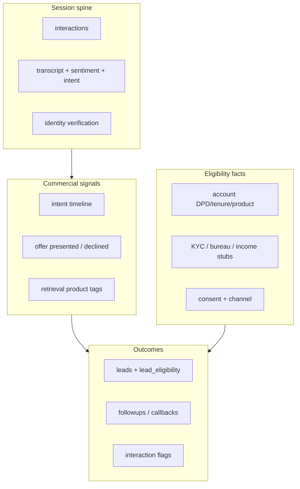

# Collections → Upsell data-capture plan

**Goal:** Strengthen data capturing from live calls, profiles, and chats **before** building a real upsell / cross-sell engine.

**Principle:** A real upsell/cross-sell engine is only as good as the signals it can trust. The **schema was ahead of the capture pipeline** — tables existed, but live calls/chats did not fill the fields an engine would score on.

**Sequencing:** Capture first → then engine. Do **not** build ranking/offer logic until `primary_intent`, `upsell_presented`, product interest, and eligibility facts are written from live traffic.

---

## Optimization constraints (must follow while implementing)

The app is **demo-optimized with a strong voice island**, not uniformly latency-hardened. Capture work must not make that worse.

| Constraint | How we implement capture |
|---|---|
| **Don’t block speech path** | Voice CRM writes stay on `CrmSink` `asyncio.Queue` → `to_thread` |
| **Don’t block WhatsApp webhook** | Capture / lead tools run inside `bot_worker` job handling, not the webhook request |
| **No sync Azure in request fan-out** | Capture Phase 0/2 uses DB + existing bot tools only; no new Azure calls on hot paths |
| **Shared / pooled clients later** | Full httpx/AsyncOpenAI reuse is a hardening pass — not required for Phase 0 if we stay off Azure |
| **Batch DB where listing** | Prefer set-based reads; avoid N+1 when enriching eligibility on create |
| **Cap concurrency** | Lead capture is per-turn tool call; no bulk “enrich all interactions” jobs yet |

**Safe parallel capture:** voice sink + bot worker.  
**Unsafe:** sync FastAPI handlers doing multi-second Azure + multi-row writes under concurrent users.

---

## Verdict

Close the gap between:

1. What the bot/voice stack already *computes in memory*, and
2. What actually lands in Postgres on the interaction + customer spine.

Until those fields are filled from live traffic, the Upsell page stays a CRM board over seeded/manual leads.

---

## What we already capture (usable)

| Surface | What’s written | Source |
|---|---|---|
| **Voice session start** | `interactions` (active), `voice_sessions`, customer/account link (or `UNKNOWN-CALLER`) | `voice/persist.py` |
| **Per turn** | `interaction_transcript`, `interaction_sentiment`, guardrail `interaction_flags`, some `live_alerts` | `voice/crm_sink.py` |
| **Call end** | status, duration, optional summary/disposition, avg sentiment, rag_hits | `complete_voice_call` |
| **WhatsApp bot** | messages, bot state (`last_intent` in JSON), CRM tool side-effects (PTP / dispute / callback) | `bot_runtime.py` / `bot_tools.py` |
| **KB** | `retrieval_logs` (query + chunks) when RAG runs | `kb_retrieve.py` |
| **Profile (read)** | outstanding, DPD, bucket, EMI, ledger, consent/DND, risk | `get_customer_context` |
| **Leads** | Manual UI create + seed rows; eligibility flags mostly seed | `POST /leads` |

The spine is real for **collections**. For **sales**, almost nothing was produced live (pre–Phase 0).

---

## Critical gaps (pre–Phase 0)

1. Interaction outcome flags (`primary_intent`, `query_resolved`, `upsell_presented`, `ptp_captured`) were seed-only.
2. No `capture_lead` / `check_eligibility` bot tools.
3. Eligibility UI invented bureau/KYC; rules not evaluated at create.
4. Intent keyword classifier was ephemeral (bot_state / memory only).
5. Voice can start as `UNKNOWN-CALLER` (identify/rebind still Phase 3).
6. Post-call summary/disposition often empty.

---

## Signal layers (target)

---

## Phases

### Phase 0 — Instrument what we already compute — **DONE**

1. Persist turn intents on `interaction_transcript.intent` (+ score).
2. On session end (voice) / after bot turns (WhatsApp): roll up flags + template summary/disposition.
3. Flip `ptp_captured` when PTP tool succeeds; flip `upsell_presented` when product KB returns results or lead is captured.

**Paths:** `capture.py`, `voice/crm_sink.py`, `voice/persist.py`, `bot_runtime.py`, `bot_tools.py`.

### Phase 1 — Structured commercial events — **DONE**

Emitted to `activity_events` with jsonb `payload` (bot/system actor):

| Event | When |
|---|---|
| `product_interest` | Customer intent ∈ {upsell_opportunity, product_faq} (voice sink + WA bot turn) |
| `offer_presented` | Product KB returns hits, or `capture_lead` succeeds |
| `eligibility_checked` | `check_product_eligibility` / pre-`capture_lead` |
| `lead_captured` | Lead created from bot tool |
| `identity_verified` / `identity_failed` | `identify_customer` / rebind |

**Gap fixed:** WhatsApp now writes customer+bot turns to `interaction_transcript` on successful bot_worker turns (was completely missing — rollup could never see WA).

### Phase 2 lite — Bot sales tools — **DONE**

- `check_product_eligibility(productId)` — DPD / consent / product rules; bureau/KYC → `unknown`/`skipped` (not fake pass).
- `capture_lead(...)` — `create_lead` + `lead_eligibility` rows + `interaction_id`.
- `identify_customer(phone|accountTail)` — rebind interaction + `identity_verifications`.

### Phase 3 — Profile enrichment + identify caller — **PARTIAL**

| Item | Status |
|---|---|
| `rebind_interaction_customer` + `identity_verifications` write | Done |
| WhatsApp `identify_customer` tool | Done |
| `voice.persist.rebind_customer` ready for voice V3 tools | Done |
| Voice runtime CRM tools (voice still has **no** tool loop — see `voice/bot.py`) | Not yet |
| Bureau/KYC/income profile columns | Not yet |

### Phase 4 — Upsell engine — only after capture is trustworthy

---

## Implementation status

| Item | Status |
|---|---|
| Optimization constraints documented | Done |
| Migration: transcript `intent` columns (`20260722_0027`) | Done |
| `capture.py` rollup + eligibility | Done |
| Voice sink: persist intent + complete rollup | Done |
| WhatsApp: flag flips + primary_intent touch | Done |
| Bot tools: eligibility + capture_lead | Done |
| `create_lead` writes real eligibility rows | Done |
| Commercial `activity_events` (Phase 1) | Done |
| WhatsApp → `interaction_transcript` | Done |
| Identify/rebind (Phase 3 lite) | Done |
| Voice CRM tool loop (needed for mid-call identify/lead) | Pending (V3) |

**Restart** the API and `bot_worker` so they load the new code. Voice capture lands via CrmSink without blocking speech.

---

## What not to do yet

- Rebuild Upsell kanban / metrics
- ML propensity scoring
- Fake bureau scores on production paths
- Auto-pitch every call
- Full async httpx rewrite (separate hardening)

---

## Related code pointers

| Area | Paths |
|---|---|
| Capture module | `backend/capture.py` |
| Upsell UI | `Habibi/src/routes/upsell.tsx`, `Habibi/src/api/upsell.ts` |
| Intent | `backend/agent_core/intent.py` |
| Voice | `backend/voice/persist.py`, `backend/voice/crm_sink.py` |
| WhatsApp bot | `backend/bot_runtime.py`, `backend/bot_tools.py`, `backend/bot_worker.py` |
| Leads | `backend/db.py` (`create_lead`, `list_leads`), `backend/sql/06_sales.sql` |
