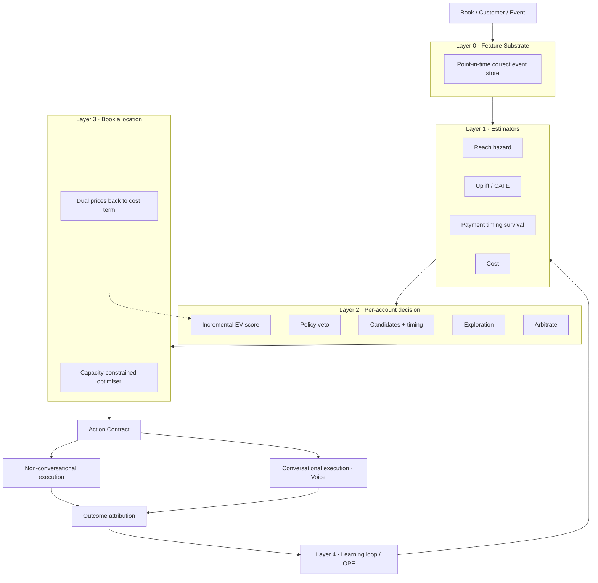
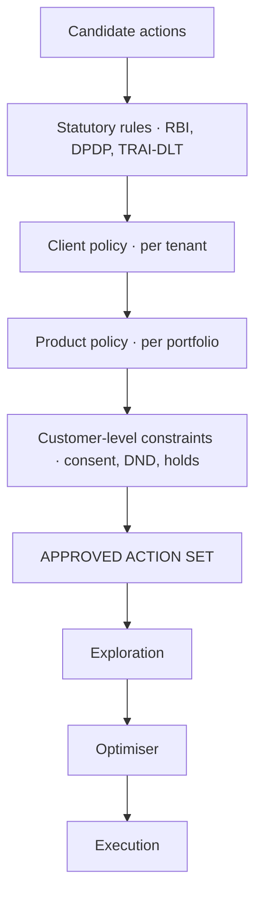
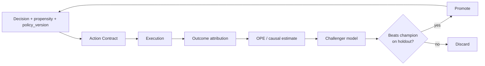

# Decision Intelligence Engine

**Status:** Design — not yet built
**Supersedes:** the per-account `agent_core/treatment` engine as the top-level decision authority (it becomes Layer 2 of this design)
**Audience:** engineering, risk, and whoever has to defend this to a bank's compliance committee

---

## 1. What this is

A system that decides **what should happen to a delinquent borrower, when, through which action — and whether doing it changes the outcome at all.**

It is not a voice product. Voice is one execution channel among several, and a working decision engine will use it *less* than the current system does. That is the intended effect, not a regression.

### The one-sentence thesis

> Don't predict who will repay. Predict who will repay **because of** our intervention.

Everything else in this document follows from that sentence.

---

## 2. The reframing, stated precisely

The current engine scores `p_resolve = P(cure | we contacted them)`. The decision actually requires the **incremental** effect:

```
τ(action, x) = P(cure | action) − P(cure | no action)
```

These diverge sharply in early buckets, because a large share of 0–30 DPD borrowers cure on their own — they forgot, the salary landed late, the mandate presented on the wrong day.

A response model ranks those self-curers **highest**, because they have the best absolute repayment probability. So the engine spends its most expensive capacity on people who needed nothing, and books their payment as its own success.

|              | Cures without contact | Cures with contact | Uplift τ | Response model ranks | Uplift model ranks |
| ------------ | --------------------: | -----------------: | -------: | -------------------: | -----------------: |
| Borrower A   |                   90% |                92% |    **+2%** |                **1st** |                3rd |
| Borrower B   |                   35% |                75% |   **+40%** |                  2nd |            **1st** |
| Borrower C   |                   10% |                40% |   **+30%** |                  3rd |                2nd |

The response model contacts A. The uplift model contacts B. Only one of those is a business.

**This is a reframing, not a bigger model.** The existing EV formula changes by one term:

```diff
- EV = exposure × recovery_fraction × p(reach) × p(resolve|reach) × decay − cost − fatigue
+ EV = exposure × recovery_fraction × p(reach) × τ(action, x)       × decay − cost − fatigue
```

`wait` still scores exactly 0 — and now that zero *means* something. An action must actually change the outcome to beat silence.

### On sizing the self-cure population

**Do not quote an external self-cure figure.** Published numbers about "early-stage recovery" describe recovery achieved *through* first-party collections effort, which is intervention — the opposite of self-cure. Vendor case studies use bespoke definitions on captive books.

The self-cure rate is measured by **our own randomised control arm**, on our own book, with our own product mix. This is not a limitation; it is the strongest form of the claim, and it is defensible precisely because it is ours.

---

## 3. Honest current state

Measured against the live database and working tree, not inferred.

| Fact | Value |
| --- | --- |
| `treatment_decisions` rows, all time | **4** |
| ...enacted | **0** |
| ...with an outcome label | **0** |
| ...distinct trigger kinds observed | **1** (`broken_ptp`) |
| Trigger kinds the schema permits | 8 |
| Trigger kinds wired in production code | 2 (`bounce`, `broken_ptp`) |
| `TREATMENT_MODE` in `backend/.env` | **unset** → defaults to `shadow` |
| Scorers registered in `build_scorer()` | 1 (`EVScorer`; unknown names fall back to it) |
| Actions in the action space | 7 — **all of them contact-or-silence** |
| Frontend consumers of `/treatment/*` | **0** |
| Treatment engine tests | 135 |

### What is genuinely good and must be preserved

The plumbing is largely built, and it is better than most production collections systems:

- **Timing precedes veto.** Asking "may we dial?" at 02:00 answers no for every borrower alive. Asking "may we dial at the first moment we actually would?" is the real question, and it is what lets *WhatsApp now* beat *agent call at 08:00 tomorrow* without a special case.
- **The score is in rupees.** A collections head can argue with "an agent call is worth ₹68 here". Nobody can meaningfully argue with "0.62".
- **`wait` is a first-class action** with a logged reason, not the absence of a decision.
- **Vetoes are delegated, never duplicated.** `contact_policy.evaluate()` is one definition shared by the dialler, the WhatsApp drain and the document desk.
- **Holds are rows, not routing rules.** A bot at 02:00 is bound by a hardship hold exactly as a supervisor is.
- **Counterfactual logging exists in the schema.** `treatment_decisions` stores the full ranked `candidates` with feature vectors, per-action `excluded` reasons, and outcomes — for suppressed and shadow decisions too.
- **Shadow decisions are never labelled `no_answer`.** Nothing was sent, so nothing can be called unanswered. Most teams get this wrong and manufacture a training signal out of a decision nobody acted on.
- **The LLM is fenced.** `rerank.py` rejects any rationale containing a number absent from the payload it was given.

### What is actually missing

**Not the plumbing — the statistics.** And the statistics are gated entirely on a data-generating process that does not exist yet.

There is also a duplication hazard worth fixing separately: the Customer 360 "Next best action" card is served by `customer_insights.build_nba()`, a hand-ported Python copy of the TypeScript `buildNba()` in `Habibi/src/lib/customerInsights.ts`. Two implementations of the same hardcoded ladder, kept in sync by hand, where the TS copy is a silent `catch` fallback — so any divergence surfaces only when the API is already down. Neither copy consults the treatment engine.

Notably, that card already receives two **real** policy snapshots (`reco.policy.snapshot()` and `authority.policy.snapshot()`). The socket exists. The treatment engine is the one policy nobody plugged into it.

---

## 4. Architecture



Four estimators, one policy gate, one optimiser. **Not thirteen engines.** Propensity, uplift and treatment-effect are the same model; self-cure is that model's control arm and has no independent existence; contactability is the reach estimator; fatigue is already a subtraction term in the score. Naming them separately buys thirteen deployment pipelines and ships none.

---

## 5. Layer 0 — Feature substrate

### Non-negotiable: point-in-time correctness

Every feature must be stamped **as-of decision time**. A feature computed with data that did not exist when the decision was made inflates offline metrics by double-digit points and then dies in production. In BFSI this is also an audit problem: "what did you know when you decided to dial?" must have an answer.

### Data available in a bank/NBFC environment

| Domain | Signals | Why it matters |
| --- | --- | --- |
| **Core lending** | EMI schedule, outstanding, minimum due, DPD, bucket, product category, secured/unsecured, LTV | Exposure and curability |
| **Payment rails** | **NACH/eNACH mandate state (UMRN), presentment calendar, return codes**, UPI Autopay status, payment-link events | See below — the most underused asset |
| **Cash-flow behaviour** | Salary-credit timing and amount, balance velocity, historical payment day-of-month | Timing is the highest-yield early-bucket lever |
| **Contact history** | Telephony CDRs (true connect vs ring-out vs busy), DLT/SMS delivery receipts, WhatsApp delivered **and read**, email opens | Reach hazard, and the difference between "we sent it" and "they saw it" |
| **Digital engagement** | App/portal login, statement view, payment page abandonment | A borrower who opened the app and did not pay is a different person from one who never opened it |
| **Interaction** | Transcripts, sentiment trajectory, intent, hardship/dispute signals, third-party pickup | Structured by the LLM at perception time, not decision time |
| **Bureau** | Score refresh, other-lender delinquency, enquiry velocity | Distress vs forgetfulness — subject to permissible-use constraints |
| **Field** | Geo, agency capacity, visit outcomes, address quality | Field feasibility and cost |
| **Constraints** | Consent by channel, DND registry, opt-outs, holds, disputes, legal matters | Feeds the policy gate, never the score |

### The asset we are not using at all

**NACH/UPI-Autopay presentment.** In Indian retail lending the highest-yield early-bucket action is frequently *not a contact* — it is a **re-presentation of the mandate, timed to the salary credit**. It costs approximately nothing, annoys nobody, and is invisible to the contact-frequency cap.

Return codes are diagnostic, and the current system treats a bounce as one undifferentiated event:

| Return reason | What it actually is | Right action |
| --- | --- | --- |
| Insufficient funds | A **timing** problem | Re-present against the salary-credit pattern |
| Mandate cancelled / revoked | A **mandate** problem | Re-registration flow — calling will not fix it |
| Account closed / frozen | A **data** problem | Alternate instrument, skip-trace |
| Technical / bank-side | Not the borrower's problem at all | Retry; contacting is actively harmful |

Industry guidance is explicit that retries should be scheduled against the borrower's salary-credit pattern rather than a calendar rule. The existing `SALARY_TIMING_LIFT = 1.25` already gestures at this — but only as a multiplier on a *contact*, never as an action in its own right.

---

## 6. The action space is wrong, and that is a dict entry

Seven actions, every one of them contact-or-silence. The question the system can currently ask is *"who should we call?"* The question it should ask is *"what intervention should we make, if any?"*

### Proposed additions

| Action | Channel | Intrusiveness | Cost | Note |
| --- | --- | --- | --- | --- |
| `represent_mandate` | `None` | 0.0 | ~₹0 | **Highest expected ROI in the system.** Invisible to contact caps |
| `payment_link` | existing digital | low | ~₹0 | Friction removal, not persuasion |
| `emi_date_change` | self-service | 0.0 | ~₹0 | Fixes the *cause* for salary-timing mismatches |
| `part_payment_offer` | any | low | ₹ | Structured concession |
| `restructure_offer` | any | medium | ₹₹ | Requires authority-matrix approval |
| `self_service_plan` | digital | 0.0 | ~₹0 | Borrower-initiated resolution path |

`actions.SPECS` is a dict. Adding `represent_mandate` with `channel=None, intrusiveness=0.0, cost≈0` is likely the single highest-ROI change in the entire system, and it is a few lines.

**Design rule:** an action with `channel=None` does not consume the contact-frequency budget and is not subject to calling-hour vetoes — but it *is* subject to mandate-specific rules (presentation limits, UMRN suspension policy). The policy engine must express both kinds.

---

## 7. Policy engine — rules as versioned data

Regulatory rules must be **rows, not code**, with an **effective date** and a **version**.

The immediate reason: **DOR.MCS.REC.No.199/01-01-039/2026-27 (RBI/2026-27/230), dated 6 August 2026, effective 1 January 2027**, amending the RBI (NBFC – Responsible Business Conduct) Directions, 2025, with a parallel HFC circular (RBI/2026-27/231). It carries an 08:00–19:00 calling window with no general-recovery exception, six-month recording retention, prior-visit intimation, and agent authorisation requirements.

Two rule sets are therefore in force at different times. A regulator asking *"why did you dial at 19:15 last March?"* needs the answer **"under the rule set in force then"** — not "our current code says we wouldn't have."



**Every decision records the `policy_version` that approved it** — the same discipline as the `RULES_VERSION` stamp on compliance scans. A rule change then becomes a *backfill* rather than a fresh start.

This also makes the product portable across banks, NBFCs, HFCs, credit cards, BNPL, microfinance and agencies without a code change, and lets a client update policy without a model deploy.

### The ordering is the architectural boundary

Exploration happens **strictly after** the veto stack, over the approved set only.

```
✗  ML → random exploration → compliance check
✓  candidates → statutory → client → customer → APPROVED SET → explore → optimise → execute
```

Randomising between two *already-compliant* actions costs almost nothing and is the only way to learn the ladder. This ordering is what makes exploration defensible to a regulator, and it is a property of the existing pipeline worth not breaking.

---

## 8. Exploration and propensity logging

**You cannot retro-randomise a log.** You can retrain a model on old data forever; you can never go back and add a control group. This is the only component in this document that cannot be retrofitted, which is why it is first.

Three requirements:

1. **Volume** — a `dpd_tick` sweep across the whole delinquent book. Today the engine only wakes on `bounce` or `broken_ptp`, so an account rolling silently 30 → 60 → 90 never gets a decision at all.
2. **Propensity** — record `π(a|x)`, the probability the logging policy assigned to the action it took. Deterministic argmax gives every action propensity 1.0 and makes the log **unusable** for off-policy estimation. One `numeric` column.
3. **A real control arm** — sized for statistical power, not vibes. This is what measures self-cure.

Use a greediness-parameterised logging policy (softmax / top-k / power-normalised) that interpolates smoothly between deterministic-greedy and uniform, so the exploration/reward trade-off is a single tunable dial rather than a rewrite.

### Ethics and safety of exploring in collections

Exploration here means choosing between **compliant, approved, already-vetoed** actions — for example WhatsApp-now versus bot-call-tomorrow-morning. It never means violating a constraint to see what happens. The control arm receives the statutory minimum communication, not silence where a notice is legally required.

---

## 9. Layer 1 — Estimators

Four. All small, boring, calibrated, and individually replaceable behind the existing `build_scorer()` registry.

| Estimator | Predicts | Family | Label source |
| --- | --- | --- | --- |
| **Reach** | P(attempt reaches a human) by channel × hour × borrower | Gradient-boosted / hazard | CDRs, delivery + read receipts |
| **Uplift / CATE** | τ(action, x) — incremental cure probability | Two-model, X-learner, or uplift trees | Randomised arm vs treated arm |
| **Payment timing** | Hazard of payment over the next *t* days | Survival (Cox / discrete-time hazard) | Payment events |
| **Cost** | Fully-loaded ₹ per attempt | Accounting + dual prices (Layer 3) | Finance |

The payment-timing model replaces the fixed `urgency_halflife_hours` decay with a real hazard curve — *when* to act, derived rather than configured.

### The granularity ladder — the part most teams get wrong

CATE is the **difference of two noisy quantities**, so it needs far more data than propensity — often an order of magnitude more.

A client with a 50k book at 5% delinquency generates ~2,500 delinquent accounts a month. Split across 7+ actions and stratified, **that will never support individual treatment effects.** Jumping straight to per-account CATE on a small book produces confident noise, which is strictly worse than the current priors because it *looks* learned.

So promote granularity only when the holdout says the finer model beats the coarser one:

```
population-level uplift
        ↓  (only if holdout shows lift)
segment-level  (bucket × channel × contactability × cash-flow pattern)
        ↓  (only if holdout shows lift)
individual CATE
```

**Every promotion is a measured decision, not a milestone.**

---

## 10. Layer 2 — Per-account decision

Largely the existing pipeline, which is sound:

```
features → candidates (timing) → veto → score → explore → arbitrate → log → [enact]
```

Changes:

- `p_resolve()` → `τ()` from the uplift estimator
- static `costs.for_action()` → dual price from Layer 3 (see below)
- fixed decay → payment-timing hazard
- new exploration step after arbitration's approved set
- `propensity` and `policy_version` recorded on every decision

Preserved guarantees, all of which already hold and are worth restating because they are easy to break:

- `recommend()` never raises, and never opens its own connection when given one
- a scorer never sees a vetoed action, cannot add an action, and cannot reach the database
- `wait` is always in the candidate set — there is no state with no legal action
- unknown facts are **absent, not zero**
- every invocation is logged, including suppressed and shadow ones
- the contact gate runs **again** at send time
- the ladder runs out

---

## 11. Layer 3 — Book-level allocation

Per-account argmax is a *local* decision. The real problem is: given 2M delinquent accounts, 400 agent-hours, 60 field slots, an SMS budget and a per-borrower regulatory cap — **what is the optimal plan for tomorrow?**

That is a constrained assignment problem, not 2M independent decisions.

### Dual prices are the elegant part

Solve the allocation and you get **shadow prices**: the marginal value of one more agent-hour, one more field slot. Feed those back as the cost term, and every local decision becomes globally optimal:

```
Agent capacity abundant   →  contact cost stays low
Agent capacity scarce     →  contact becomes expensive
Field capacity exhausted  →  field actions fall below the floor automatically
```

Nobody has to write *"don't make field visits below ₹X expected value."* The optimiser discovers the threshold, daily.

In code this is a one-line seam: `costs.for_action()` stops returning a static constant and returns today's dual price. A ₹1,150 field visit costs ₹1,150 on a quiet Tuesday and ₹4,000 when capacity is scarce, and the ladder self-throttles.

### Why this is P2 and not P1

**An LP does not correct estimator error — it amplifies it.** A global optimiser over bad uplift estimates makes the same mistake two million times, efficiently, with a confident dual price attached.

Estimators must demonstrate lift on a holdout **before** an optimiser is allowed to act on them. Until then, simple daily quotas per channel are sufficient and safe.

---

## 12. The Action Contract

The interface between Decision Intelligence and every execution channel. This is what makes voice, WhatsApp, SMS and field interchangeable.

```json
{
  "decision_id": "TD-01J8X...",
  "policy_version": 7,
  "propensity": 0.62,
  "action": "voice_call",
  "channel": "voice",
  "scheduled_at": "2026-08-21T10:30:00+05:30",
  "expected_value_inr": 68.40,
  "objective": "payment_commitment",
  "strategy": "soft_reminder",
  "max_duration_sec": 180,
  "allowed_offers": ["payment_link", "part_payment"],
  "prohibited": ["third_party_disclosure", "pressure_language"],
  "variant": "control"
}
```

Two fields carry the whole learning loop and are the ones most easily forgotten:

- **`decision_id`** — without it the conversation outcome cannot be attributed back to the decision that caused it, and the feedback loop is an open arc, not a flywheel.
- **`propensity`** — without it no off-policy estimate is valid.

And the score is `expected_value_inr`, **not** a dimensionless `priority: 0.87`. A rupee figure is something a collections head can argue with; 0.87 is not.

The executing agent never decides *whether* to contact. It receives: **"you are authorised to perform this intervention."**

---

## 13. Where the LLM belongs — and does not

Prompt-based decisioning does not scale here, and the reason is not cost or latency. It is that a prompt output is **uncalibrated, unauditable, cannot be off-policy evaluated, and cannot enter a constrained optimiser.** A model that says "call them" produces no number you can put in an LP.

Three places it is genuinely the right tool:

| Where | What | Frequency |
| --- | --- | --- |
| **Perception** | Transcript → structured features: hardship, dispute intent, third-party pickup, commitment strength | Once per interaction |
| **Language** | Narration, the one-line rationale, conversational execution | Once per contact |
| **Offline labelling** | Weak supervision to bootstrap training labels | Batch |

**Never in the ranking path.** The existing fence in `rerank.py` — reject any rationale containing a number absent from its payload — is the correct pattern and should be preserved verbatim.

---

## 14. Cold start and multi-tenancy

**This is the question that decides whether this is a product or a consulting engagement.**

A new BFSI client has zero logged decisions and zero outcomes. If every deployment requires its own six-month shadow period before the engine does anything intelligent, it does not scale as a platform.

The answer is **hierarchical priors**: pool across tenants where contracts and DPDP permit, shrink each tenant's estimate toward the pooled one, and let local data take over as it accumulates.

```
new tenant       →  pooled prior (or documented planning figures)
accumulating     →  shrinkage toward pooled, weight ∝ local volume
mature           →  local estimates dominate
```

**Whether we can legally pool must be settled now**, because it determines the data model — tenant isolation boundaries, contractual data-use clauses, DPDP purpose limitation — not later as an ML detail.

Fallback if pooling is prohibited: ship the EV scorer with documented planning priors (which is what exists today), and be explicit with the client that the first eight weeks are calibration.

---

## 15. Learning loop



Outcome attribution already exists in `followthrough.py` and already gets the subtle parts right: a payment beats a promise beats a connection beats silence; an attempt is only called unanswered after a channel-sized grace period; shadow decisions are attributed only as `paid`/`ptp`/`superseded`.

Add:

- **IPS / doubly-robust estimation** for candidate policies against the logged corpus
- **champion/challenger** with promotion gated on holdout lift, never on offline metrics alone
- **drift monitors** on feature distributions and on realised-vs-predicted reach
- **calibration checks** — a model whose 0.7 does not mean 70% cannot be used in an EV formula

---

## 16. Rollout

| Phase | Build | Exit criterion |
| --- | --- | --- |
| **P0** | `dpd_tick` sweep; propensity column; randomised control arm; `represent_mandate` action; policy versioning | Corpus growing daily; control arm balanced; ≥N labelled outcomes |
| **P1** | Reach + payment-timing estimators; population-level uplift; swap `τ` into the score | Uplift model beats current priors on the holdout |
| **P1.5** | Segment-level uplift; expanded action space; NBA surfaced in the UI | Segment model beats population model on the holdout |
| **P2** | Book-level optimiser; dual prices into the cost term | Same recovery at lower cost, or more recovery at equal cost |
| **P2** | Individual CATE — **only if** P1.5 data volume justifies it | Beats segment model on the holdout |
| **P3** | Cross-tenant hierarchical priors | New tenant reaches useful decisions in < 2 weeks |

Modes stay as designed: `off` → `shadow` → `live` (digital only) → `live` (full ladder), with an unrecognised value degrading to `shadow`, never `off` — a typo must not silently stop collecting the data the rollout decision depends on.

---

## 17. Metrics

**Primary:** incremental recovery per rupee spent, measured against the control arm.

Not "collections rate" — a response model looks excellent on collections rate precisely because it targets self-curers and books their payments as its own.

| Category | Metric |
| --- | --- |
| Causal | Incremental cure rate vs control; incremental ₹ recovered per ₹ spent |
| Efficiency | Cost per resolution; contacts per resolution; **voice minutes per ₹ recovered** |
| Model health | Uplift calibration; realised vs predicted reach; feature drift |
| Compliance | Contact-policy denial rate; complaint rate; window/cap breach count (target: 0) |
| Borrower experience | Contacts per borrower per case; fatigue-driven opt-out rate |
| Capacity | Agent-hour utilisation; dual price stability |

---

## 18. Commercial consequence — decide this before signing contracts

A working decision engine's **first observable effect is a drop in call volume.** It will discover that a large share of early-bucket dialling is worth less than silence.

- Priced **per voice minute** → the intelligence layer directly cannibalises the revenue line.
- Priced on **recovered rupees** or **cost-per-resolution** → the same behaviour is the value proposition.

This is not a positioning preference. It is a pricing constraint that follows from the architecture, and it is far easier to choose now than after a contract is shaped the other way.

The same logic argues against positioning this as an AI-voice product. Voice AI is commoditising. The defensible product is:

> **AI decisioning and autonomous customer engagement for BFSI** — with voice as one execution channel among many.

Adding branch, field, email, push, UPI/NACH, human agent or agency then requires no change to the intelligence layer.

---

## 19. Open questions requiring a human decision

1. **Can we pool data across tenants for hierarchical priors?** Contractual and DPDP purpose-limitation question. Blocks the cold-start design and the data model. **Needed before P0 schema is finalised.**
2. **Control-arm size.** A power calculation against the smallest book we intend to serve. If the answer is "we cannot power a control arm on a 50k book", the product strategy changes.
3. **Is `represent_mandate` ours to take?** Operationally, does the platform hold mandate-presentation authority, or does it recommend to the LMS?
4. **Bureau permissible use** for collections decisioning in each client contract.
5. **Who owns the capacity numbers** (agent hours, field slots) that Layer 3 optimises against, and are they available daily?
6. **Voice pricing model** — see §18.

---

## 20. Risks

| Risk | Mitigation |
| --- | --- |
| Uplift model trained on insufficient data ships confident noise | Granularity ladder; promotion gated on holdout lift |
| Exploration perceived as experimenting on borrowers | Exploration strictly post-veto over compliant actions only; documented; control arm receives statutory minimum |
| Optimiser amplifies estimator error | Estimators must prove lift before the optimiser acts on them |
| Label leakage inflates offline metrics | Point-in-time correct feature store, enforced in the pipeline |
| Rule change invalidates historical decisions | `policy_version` on every decision; rule change becomes a backfill |
| Engine stays in shadow forever | `TREATMENT_MODE` set explicitly; phase exit criteria are measurable |
| Two copies of the NBA ladder drift | Delete the duplicate; serve the engine's decision to the 360 card |

---

## Appendix — where to start, in one paragraph

Build **one worker**, and make it the corpus generator: a resumable `dpd_tick` sweep over the delinquent book (`SKIP LOCKED`, the pattern already in use), writing a propensity with every decision, exploring with a softmax policy over the post-veto approved set, with a real randomised control arm and `represent_mandate` in the action space from day one. Close the outcome loop through the existing `followthrough.py`. Run it in shadow for a fortnight.

**Then** there is a corpus to fit uplift models against, and propensities to prove they are better before shipping them. Everything else in this document is gated on that, and it is the only piece that cannot be added later.
