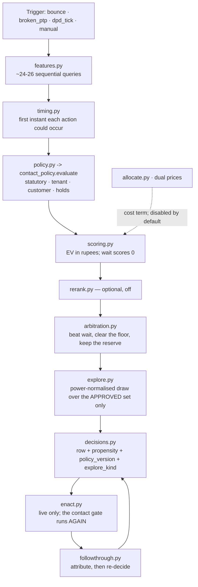
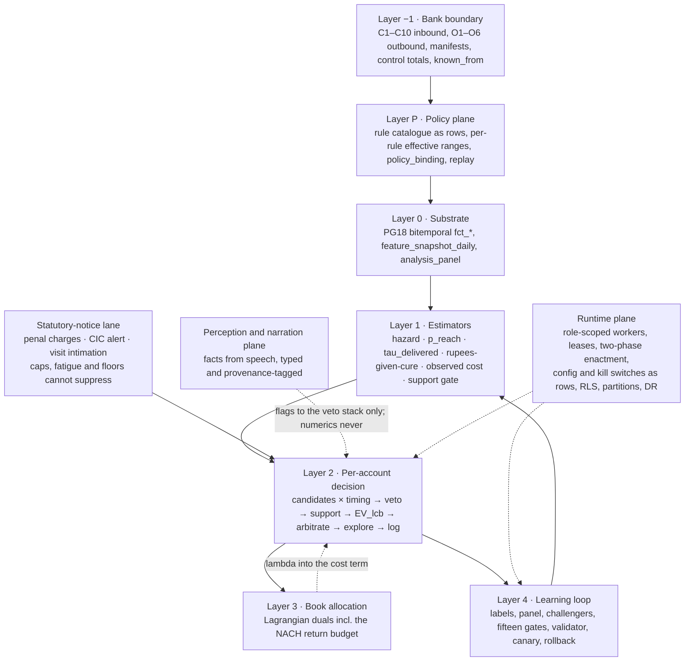
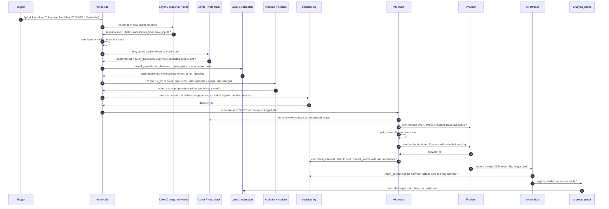
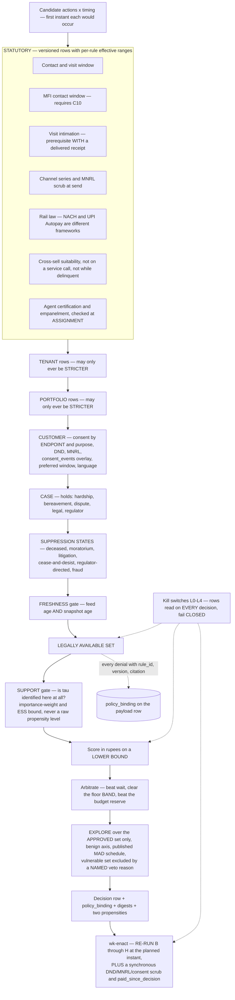
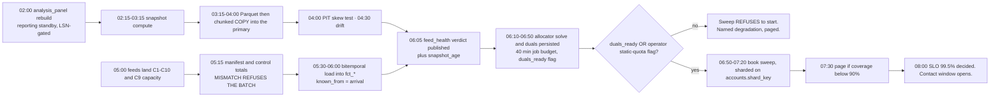
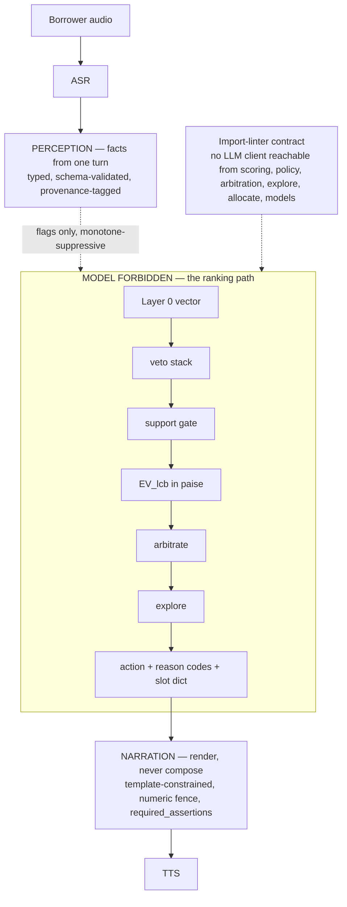
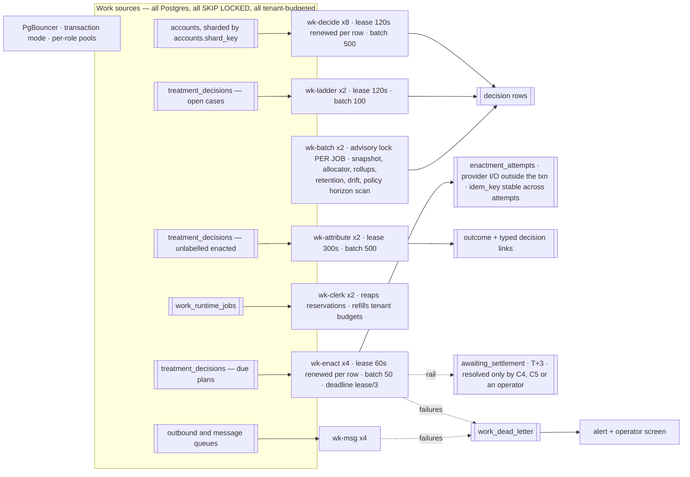
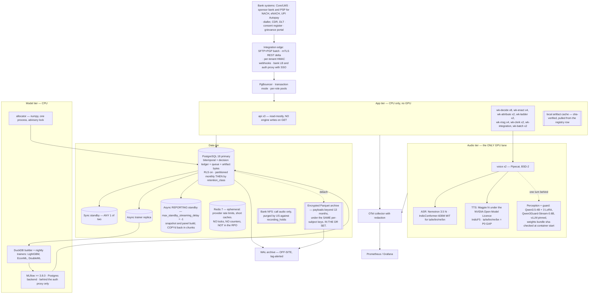

# Decision Engines — Production Design

**Status:** Design of record. Complete — §1–§18 and Appendices A–E.
**Date:** 2026-09-06
**Supersedes:** `decision-intelligence-engine.md` (status "Design — not yet built"). Its reframing survives intact; its current-state table is sixteen weeks and two hundred and twenty-one decisions out of date, and several of its architectural claims are now known to be false in the code that was built from it.
**Audience:** the CTO, the head of collections and the model-risk officer of an Indian bank or NBFC — and the engineers who will build against this.
**Evidence base:** 34 adversarially-verified module reads over `backend/agent_core/treatment` (24 modules, 11,208 LOC) and `backend/agent_core/reco` (13 modules, 4,299 LOC), plus their callers, migrations, scripts, tests and console. **1,287 findings survived** verification of 1,294 raised (7 refuted; 30 of the findings cited here are verifier-raised and single-read — marked ‡): **124 blocker, 509 high**, 474 medium, 180 low. Current-state numbers are measured, not inferred — `FACTS.md`, live Postgres, 2026-09-05. The complete finding catalogue is `doc/APPENDIX-A.md`; every `[key]` in this document resolves there.

---

## 1. Verdict and executive summary

*Terms in `code font`, and every statistical term, are defined in Appendix D.*

The thesis of the note this supersedes is correct and is not revisited:

> Don't predict who will repay. Predict who will repay **because of** our intervention.

Everything below is about whether the system built from that sentence can support the claim. It cannot yet, for reasons that are specific, located, and mostly not statistical.

**One engine is real; the other is a rule scorer with an unlearnable log.**

The **treatment engine** is real infrastructure. It is live (`TREATMENT_MODE=live`, `TREATMENT_SWEEP=1`), it has decided 225 times, and it logs a per-candidate propensity, a policy version and an explore kind, holds a randomised arm, and logs the actions it did **not** take — four properties §3 enumerates and most collections systems do not have. The **reco engine** is also live, and its 16 logged decisions carry no propensity, no policy version and no explore kind, against a table that has never recorded a single response `[reco-log-has-no-propensity-so-it-can-never-be-off-policy-evaluated]`. Migration `0085` added those three columns to `treatment_decisions` and not to `offer_decisions`, and that migration's own docstring explains why the omission is terminal: you can retrain a model on old data forever, but you can never go back and record what the odds were. Every day the reco engine runs in this state adds rows that can never answer whether a different offer policy would have done better.

**The treatment engine's problem is not that its statistics are immature. They are wrong in identified, reproducible ways — and the executor beneath them is failing.**

Three facts, each independently verified against the code and the live database, each fatal to the current numbers:

1. **The two highest-volume contacting channels do not work, and report that they do.** Every `voice_bot` enactment blocks on its own claim lock — `claim_due` takes `FOR UPDATE`, and the `call_attempts.decision_id` foreign key makes the insert take `FOR KEY SHARE` on the same row from a second connection — so it times out at 60 s and is recorded `cancelled` `[enact-dial-fk-keyshare-vs-claim-for-update]`. Every treatment WhatsApp passes `contact_policy.admit` twice with different session and related keys, so the second admission is denied by the cooling-off window the first one opened; all five retries land inside ~30 seconds, the job dies, and the decision row reads `enacted = true` with a `whatsapp:` reference `[enact-whatsapp-double-gated-cooling-off]`. **84 of 225 decisions carry outcome `cancelled` — 78% of the 108 labelled *live* rows, 71% of all 119 labelled rows including shadow —** and `cancelled` is written by our own executor when nothing was sent. Worker availability is currently the dominant term in the training-label distribution.
2. **The control arm cannot produce a negative.** `attribute_outcomes` does not select `variant`, so `_withheld_on_purpose` always evaluates `config.variants().get("")` → `None` → `False`, and the `unresolved` branch is unreachable `[control-arm-never-acquires-negatives]` `[attr-select-omits-variant]`. The live corpus confirms it exactly: **97 rows in `null_treatment`, zero `unresolved` outcomes, ever.** Every causal number downstream — `metrics.causal`, `ope.treatment_effect`, the uplift promotion gate — is differenced against a control arm containing only positives. On an alembic-built database the label could not have been written in any case: three constraint widenings drop a constraint name Postgres never generated, so `outcome='unresolved'`, `chosen_action='represent_mandate'` and `mode='simulated'` all still violate the original 0069 CHECKs `[treatment-check-constraints-widened-under-the-wrong-name]`.
3. **Nothing fitted is serving, and nothing fitted was fitted on this book.** `TREATMENT_SCORER=ev` — the hand-tuned `EVScorer` decides every one of the 225. All three treatment artifacts declare `corpus: simulated`. The reco artifact was fitted on 1,335 rows drawn from a hand-written logistic in a dev script `[train-no-simulated-mode-filter]` against a live table holding 16 rows and no responses. Their reported AUCs (.73 / .81 / .72) come from a holdout produced by a uniform random shuffle of a time-ordered, borrower-clustered log `[random-split-leaks-across-time-and-account]` `[train-holdout-split-is-by-row-not-by-borrower]`. They are not estimates of production performance, and an independent validation function will say so in one line.

**And the action this design argues is the highest-ROI item in the ladder — a prior, not a measurement (§16.2) — has never once been a candidate.** `represent_mandate` was excluded on every one of the 225 decisions, and on the 221 that recorded a reason it was `no_mandate_on_file` 124 times and `control_arm` 97 times (4 rows carry a NULL variant). The mechanical cause is not in the engine: **nothing in this repository can load a bank's book.** The only non-test writer of `mandates` or `emi_installments` is the corpus simulator, and the one production `INSERT INTO accounts` creates a stub from an inbound message with `outstanding 0, dpd 0` [CRITIC G2]. The action the superseded note calls "likely the single highest-ROI change in the entire system, and it is a few lines" is a few lines *and* a data contract that does not exist.

**And the console in front of all of it is asserting what the backend cannot support.** §13.8 is the shortest route to understanding this system's gap between claim and evidence: today's screens make affirmative assurance claims — a compliance tick, a causal lift, a model-health badge — that nothing beneath them computes.

### What it will take

The five rows below are the **phases** of the argument, `P0–P4`. They are not the fourteen delivery **waves** of §15.2, which are numbered `W0–W13`; §15.2 maps one onto the other.

| Phase | What it fixes | Exit criterion |
|---|---|---|
| **P0 — repair** (~3 weeks, no estimator work) | The alembic constraint chain; `FOR NO KEY UPDATE SKIP LOCKED` claiming; one WhatsApp gate instead of two; `cancelled` split into censoring kinds and excluded from every label; one observation window across both arms; a per-decision nonce in the exploration seed; two propensity columns instead of one product; every standard error clustered on the customer | The executor tells the truth, and the first honest corpus this system has starts accumulating from the day W0–W3 land. The existing 225 rows are re-labelled where the label was manufactured by our own executor, and are excluded from every propensity-weighted estimate permanently — because the seed and the fused propensity behind them cannot be recovered |
| **P1 — the boundary** (gated on the bank, not on us) | The data contract: instalments, mandates, verbatim return codes, an account-level credit feed, consent with expiry, agency and legal activity, CDRs and delivery receipts, protected attributes. The PostgreSQL 18 upgrade the point-in-time substrate requires. RLS on a non-superuser role | A book arrives, is reconciled, and goes stale **visibly** rather than silently |
| **P2 — the log** | Propensity recorded at the level it was randomised; exploration after the veto stack with a support gate in front of the score; delivery receipts wired into the labeller; reads that never write | Eight weeks of panel from which `m` and ICC are *measured*, not assumed |
| **P3 — the estimators** | Reach; a payment-timing hazard; τ as a delivered-attempt effect calibrated per head; cost from `usage_events` rather than a constant; fifteen promotion gates; canary and rollback | A challenger beats the champion **out-of-time, clustered, on a lower confidence bound** |
| **P4 — the optimiser** | `allocate.py`'s duals into the cost term | Same recovery at lower cost, or more recovery at equal cost |

Two orderings are not negotiable, and they are the only two: the executor is repaired before the log is trusted, and the log is written correctly before any model is fitted on it. The bank-boundary phase P1 is gated on the bank rather than on us and runs in parallel from week 6; only its *completion*, not its start, precedes the estimator phase. What survives compression to one sentence is this: **fix the executor before the log, and the log before the model — because the log is the only thing that cannot be backfilled.**

### The three decisions leadership must make now

**1. Is this a product or an integration project? Decide the data contract and the platform prerequisite.**
Nine feeds must be signed and delivered by the bank before any estimator can be honest: instalment schedule; mandate register with UMRN and presentment calendar; NACH/NPCI return codes kept verbatim; an account-level credit feed covering branch cash, NEFT, UPI and successful re-presentment; consent and DND with expiry; agency and field activity; statutory communications; telephony CDRs and delivery receipts; and the protected attributes without which no fair-lending test can be run at all [CRITIC G2, G4]. Two are load-bearing on day one. With no credit feed, the engine dials borrowers who have already paid — `_resolved_since` has no `dpd_tick` branch and `payments._close_treatment_cases` closes only `bounce` and `broken_ptp` cases, while `dpd_tick` is the dominant trigger on any swept book `[dpd-tick-plans-survive-the-borrower-paying]` `[payments-only-closes-bounce-and-ptp-cases]`. With no mandate register, the cheapest action in the book stays impossible. Separately, the bitemporal substrate needs `PRIMARY KEY (…, valid_at WITHOUT OVERLAPS)`, which does not exist before **PostgreSQL 18**; we ship `pgvector/pgvector:pg16`. A major-version upgrade is a **prerequisite** of Layer 0, not an assumption inside it. If the answer is "the bank will not sign these", then this is a rules engine with a scoreboard and should be sold as one.

**2. Do we get a randomised control arm, and how large?**
The causal claim requires withholding discretionary outreach from a slice of the book. Today 20% of ~20 customers — about four people — are withheld for a measurement this book cannot produce, and the control arm withholds the NACH presentment and the two self-service remedies as well, which is not a control group but a randomised set of borrowers whose signed standing instruction the lender chose not to present `[engine-control-arm-withholds-the-mandate]`. Two owners are needed: the **ethics** (who signs that a borrower receives less contact so a model can be measured, and what the statutory minimum inside that arm is) and the **arithmetic** (`m` — cases per borrower — and ICC — how alike one borrower's cases are — must be measured over ≥8 weeks of panel before any power figure or go-live date is quoted. The design effect `1 + (m−1)·ICC` is how many independent observations a given number of decisions is actually worth; its plausible range here spans 1.0 to 12.8, **a factor of three on the minimum detectable effect — a factor of nine on the sample size — in an unknown direction** on the number that gates the product). `power_control_arm.py` already computes this correctly and **nothing on the serving or evaluation path uses it** `[clustered-decisions-treated-as-independent-observations]`. If the smallest book we intend to serve cannot power the arm, the product strategy changes — not the statistics.

**3. How is this priced?**
A working decision engine's first observable effect is a fall in call volume; it will discover that a large share of early-bucket dialling is worth less than silence. Priced **per voice minute**, the intelligence layer cannibalises the revenue line. Priced on **recovered rupees** or **cost per resolution**, the same behaviour is the value proposition. This is a pricing constraint that follows from the architecture and is far cheaper to choose now than after a contract is shaped the other way. It carries a hard dependency the audit surfaced: the engine's cost model is nine hand-set constants (`config.py:141-149`), the platform's real per-unit INR costs sit in `usage_events` one join away and are never read, and the engine's own LLM and compute spend appears in **no** cost model at all — so `incrementalRecoveryPerRupee`, the metric the design calls the headline, excludes the cost of the engine [CRITIC G1].

Two further questions must be settled before the P0 schema is frozen — "P0" here and in §18.1 is the schema of migration `0085_decision_intelligence_p0`, not phase P0 above — and are carried forward from the superseded note unchanged: **may we pool across tenants** for hierarchical priors (a contractual and DPDP purpose-limitation question, not an ML detail), and **who owns the daily capacity numbers** the allocator prices against. Both are carried forward into §18 with their owners and the fallback each has if the answer is no — the pooling question as a legal blocker in **§18.1**, the capacity-ownership question as a commercial one in **§18.2** — and §18 is where they are decided.

---

## 2. What exists today

Everything in this section is measured. Nothing is taken from a docstring, a README, or the superseded note.

### 2.1 Inventory

| Engine | Path | Modules | LOC | Test functions |
|---|---|---:|---:|---|
| Treatment / Decision Intelligence | `backend/agent_core/treatment/` | 24 | 11,208 | 273 across `test_decision_intelligence_p0..p3`, `test_treatment_engine`, `test_treatment_followthrough`, `test_treatment_wiring` |
| Reco / upsell | `backend/agent_core/reco/` | 13 | 4,299 | ~78 across `test_reco_engine`, `test_reco_models`, `test_reco_contracts`, `test_offer_policy` |

Treatment modules: `actions allocate arbitration config contract decisions enact engine explore features followthrough metrics models monitor narrate ope policy registry rerank scoring segments sweep timing`.
Reco modules: `arbitration candidates config decisions engine features models observability policy scoring talk vectorize`.

The counts in the table include each package's `__init__.py`, which the module lists above omit: 23 named treatment modules plus `__init__.py` = 24, and 12 named reco modules plus `__init__.py` = 13. §6.3's "thirty-five logic modules" is these 37 less the two `__init__.py`.

Supporting code the engines cannot run without: `contact_policy.py` (1,088), `promise_fulfillment.py` (1,095), `payment_events.py` (1,056), `db_treatment_holds.py` (548), `customer_insights.py` (571), `agent_core/clerk.py` (265), `contact_window.py` (119), `bot_worker.py` (237), and four offline scripts — `train_treatment_models.py` (1,075), `simulate_treatment_corpus.py` (990), `train_propensity.py` (397), `replay_offers.py` (269).

Migrations: `0051_upsell_nbo_engine`, `0052_offer_decision_simulated_mode`, `0053_offer_decision_variant`, `0069_treatment_engine`, `0070_authority_decisions`, `0085_decision_intelligence_p0`, `0089_model_registry`.

Production entry points. `recommend_treatment` is called from `payment_events.py:441` (bounce), `promise_fulfillment.py:832` (broken PTP), `db.py:999` (customer card), `db_treatment_holds.py:306` (hold release) and `sweep.py` via `bot_worker.py:138` (`dpd_tick`). `reco.recommend` is called from `bot_tools.py:458`, `voice/tools.py:1977` and `:2177`, and `voice/workers/insurance.py:123`. `reco/engine.py:318` reaches into `agent_core.treatment.policy` for hold suppression (`suppresses_upsell`), and `reco/arbitration.py:20` imports the `BLOCKING_CONSENT` constant from `contact_policy` — so the two engines already reach one policy *module*, though the reco engine does **not** call `contact_policy.evaluate()` itself (§3 property 5; converging it is §9.7's work).

Eleven API routes serve them: `GET /offers/tuner-suggestions`, `GET /offers/health`, `GET /treatment/next`, `/insights`, `/metrics`, `/model-health`, `/models`, `/holds`, `/cases`, plus `POST /treatment/holds` and `POST /treatment/holds/{id}/release`. **Two of the eleven write.**

### 2.2 The pipeline, as built



The reco pipeline is the same shape, one stage shorter — `features → candidates → eligibility veto → score → arbitrate → log`. It has no exploration stage, and no analogue of `explore.choose` exists anywhere under `agent_core/reco`.

### 2.3 Runtime configuration (`backend/.env`)

```
TREATMENT_MODE=live
TREATMENT_SWEEP=1
TREATMENT_GREEDINESS=0.7
TREATMENT_AB_SPLIT=control:80,null_treatment:20
TREATMENT_MANDATE_EXECUTOR=lms
TREATMENT_SCORER=ev            # the hand-tuned EVScorer serves; the fitted models do NOT
RECO_MODE=live
# RECO_SCORER unset   -> RuleScorer
# RECO_AB_SPLIT unset -> no holdout arm; everyone in the default arm
```

Defaults in code: `TREATMENT_MODE`→shadow (an unrecognised value also →shadow), `TREATMENT_GREEDINESS`→1.0 (pure argmax), `TREATMENT_SCORER`→ev, `allocate.enabled()`→false, both `*_MODEL_MAX_AGE_DAYS`→90, `RECO_HYBRID_RULE_WEIGHT`→0.5, both `*_LLM_RERANK`→false.

The LLM is Azure OpenAI (api-version 2025-04-01-preview) with an optional OpenAI-compatible gateway (`LLM_GATEWAY_ENABLED=false`). **No on-prem model is configured today.**

### 2.4 The live corpus

`treatment_decisions` columns: `id tenant_id customer_id account_id interaction_id trigger_kind trigger_ref mode variant recommender recommender_version feature_schema_version features candidates excluded chosen_action chosen_channel scheduled_at expected_value suppression_reason rationale latency_ms enacted enacted_at enacted_ref outcome outcome_at created_at enacted_by propensity policy_version explore_kind outcome_checked_at`.

`offer_decisions` columns: `id tenant_id customer_id interaction_id channel mode variant recommender recommender_version feature_schema_version features candidates excluded chosen_product_id suggested_amount score presented presented_at response responded_at lead_id suppression_reason latency_ms created_at`. **No `propensity`, no `policy_version`, no `explore_kind`.**

| Measure | Value |
|---|---|
| `treatment_decisions` rows | **225** — live 201, shadow 24; no `simulated` rows (the simulator corpus was purged after training) |
| …enacted | **15** |
| …carrying an outcome | **119** (108 live + 11 shadow) |
| …carrying a propensity | **221** of 225 — every one of the 201 live rows, plus 20 of the 24 shadow rows. The 4 rows with no propensity match the 4 with a NULL variant by count; that they are the same 4 rows has not been separately re-queried. Values non-degenerate: 0.61, 0.63, 0.67, 0.60, 0.12, 0.13, 0.047 with `explore_kind=ranked`; 0.2 on the 97 control-arm rows; 0.8 greedy |
| `policy_version` | **1 on every row** |
| variants | control 124, `null_treatment` 97, NULL 4 |
| trigger kinds observed | 3 |
| `chosen_action` | wait 110, `self_service_plan` 45, whatsapp 31, `voice_bot` 19, `human_call` 15, sms 5 — **`represent_mandate` 0** |
| `represent_mandate` exclusion reasons | `no_mandate_on_file` 124, `control_arm` 97 — **never once a candidate** |
| `suppression_reason` | none 101, `no_eligible_action` 91 live + 10 shadow, `shadow_mode` 14, `all_actions_held` 7, `below_value_floor` 2 |
| outcome | NULL 106, **`cancelled` 84**, `no_answer` 14, `ptp` 10, `paid` 7, `superseded` 4 |
| rows/day, recent | 19–42 (2026-08-27 → 2026-09-04) |
| `offer_decisions` rows | **16** (shadow 7, live 9); **responses recorded: 0** |
| The book | **~20 customers** |

**The 124/97 variant split is not a broken randomiser, and the arithmetic that makes it look like one is the clearest evidence in the corpus for §8.7.** §2.3's `TREATMENT_AB_SPLIT=control:80,null_treatment:20` splits on the **customer**. At the decision grain it reads 124/97 — 43% of rows in a 20% arm — because a withheld borrower is never resolved and is therefore re-decided more often. That gap is not a randomisation defect; it is the sharpest available demonstration of §8.7's argument that the randomisation unit and the unit of analysis are neither of them the decision.

`cancelled` is written by `enact.py:89,93,103,108,141,147,152` when enactment aborts. `followthrough.RESOLVING = {paid, ptp, superseded, cancelled}` treats it as case-ending; `ope.CURED = {paid, ptp}` correctly excludes it from reward, and every other consumer — both label functions, `metrics.causal`, the treated denominator — does not.

### 2.5 What serves, and what is merely fitted

| Artifact | Target | n | Holdout | Corpus | Serving? |
|---|---|---:|---|---|---|
| `treatment_reach.json` | reach | 5,256 | AUC 0.731, Brier 0.209, n=1,314 | **simulated** | No |
| `treatment_timing.json` | timing | 3,668 | AUC 0.813, Brier 0.164, n=917 | **simulated** | No |
| `treatment_uplift.json` | uplift, two-model | 14,331 (control 3,668) | AUC 0.719, n=3,583; ATE 0.179, controlRate 0.341, shrinkageK 750, `controlArm=null_treatment` | **simulated** | No |
| `propensity.json` (reco) | offer accept | 1,335 | AUC 0.758, Brier 0.126 vs baseline 0.146, n=333 | simulated, via `simulate_offer_decisions.py`, trained 2026-07-31 | No — `RECO_SCORER` unset |

All three treatment artifacts are refused for serving unless `TREATMENT_ALLOW_SIMULATED_MODELS` is set, and `TREATMENT_SCORER=ev` means none would serve regardless. **The reco loader has no such gate, and the reco artifact carries no corpus field to check** `[reco-artifact-no-simulated-provenance-gate]` — one environment variable, `RECO_SCORER=propensity`, puts a model of an invented book on the audio path of live borrower calls. Its recorded means are visibly synthetic: `affordability` 0.9998, `fatigue` 0.982, `offers_last_30d` 0.9718 — 4.86 offers per 30 days against a hard cap of 3.

The hyperparameters that decide when a segment model is trusted over the pooled one — `DEFAULT_SHRINKAGE_K = 750`, `MIN_SEGMENT_CONTROL_N = 200`, the segment ladder itself — were all selected on the simulated corpus.

**So: every decision this system has made was made by hand-tuned priors, and every model that was fitted was fitted on a book that does not exist.** That is not a criticism of the sequencing. It is the state of the evidence, and it is what §4 is about.

### 2.6 Dependencies and deployment

No numpy, scipy, scikit-learn, pandas or torch anywhere in the dependency set — both trainers are pure-Python logistic regression running 2,000–3,000 fixed epochs of interpreted full-batch gradient descent. Compose services: `redis:7`, `db` (pgvector/pg16), `minio`, `api`, `worker`, `bot_worker`, `voice`, `voice_insurance`. **A single `bot_worker` process runs every loop stage** — nine messaging queues, the executor, follow-through, the clerk and the book sweep, in a first-match-wins chain where the sweep is last (`bot_worker.py:133-138`). No GPU services. No Kubernetes manifests. Python 3.12 in the image; the local `.venv` is 3.14, so `pip freeze` is not what ships. 216 tests pass in 71 s in the voice container (216 collected in that container's default selection; §2.1's 273 and ~78 count test *functions* across the engines' own suites — different populations, not a shortfall).

Regulatory anchors already named in the code — **cited from the code, primary source not yet read (Appendix E)**: RBI DOR.MCS.REC.No.199/01-01-039/2026-27 (RBI/2026-27/230), dated 2026-08-06, effective **2027-01-01** — an 08:00–19:00 calling window, six-month recording retention, prior-visit intimation and agent authorisation, with a parallel HFC circular RBI/2026-27/231; the DPDP Act 2023; TRAI DLT for SMS templates.

Two citation corrections that must travel with this document. **RBI/2022-23/111 is repealed** — expressly, on 2025-05-08, by Annex III of the RBI (Digital Lending) Directions, 2025 (RBI/2025-26/36, DOR.STR.REC.19/21.07.001/2025-26) — and those Directions carry **no** calling-hours restriction, so **RBI/2022-23/108** remains the authority for the 08:00–19:00 window, alongside the 2008 Recovery Agents circular (DBOD.No.Leg.BC.75/09.07.005/2007-08) and its prohibition on "persistently bothering the borrowers at odd hours". And **SR 11-7 is superseded**, replaced on 2026-04-17 by **SR 26-2, "Revised Guidance on Model Risk Management"**, issued jointly by the Federal Reserve, OCC and FDIC, which explicitly supersedes SR 11-7 and SR 21-8. Any model-validation argument written against SR 11-7 must be rewritten. Also relevant to how this will be read: the **RBI FREE-AI Committee report of 13 August 2025** (seven Sutras, six pillars, 26 recommendations, an AI Innovation Sandbox) is not a directive, but it is the RBI's stated direction of travel on exactly this system's governance surface, and the bank's model-risk function will have read it.

---

## 3. What is good, and must not be regressed

The audit found 1,287 things wrong. It is worth being precise about what it found right, because a rewrite that discards these would be a worse system with better statistics, and because several of them are unusual enough that a reviewer will not expect them.

**These are architectural properties, not code that happens to work. The target design keeps every one.**

| # | Property | Where | Why it is not obvious |
|---|---|---|---|
| 1 | **Timing precedes the veto.** Candidates are generated with the first instant each action would actually occur, and the veto is asked about *that* instant | `timing.py` before `policy.py` in `engine.py` | Asking "may we dial?" at 02:00 answers no for every borrower alive. Asking "may we dial at the first moment we actually would?" is the real question, and it is what lets *WhatsApp now* beat *agent call at 08:00 tomorrow* without a special case |
| 2 | **The score is in rupees, and `wait` scores exactly 0** | `scoring.py` — `EV = exposure × recovery_fraction × p(reach) × p(resolve\|reach) × decay − cost − fatigue` | A collections head can argue with "an agent call is worth ₹68 here". Nobody can meaningfully argue with "0.62". And a dimensionless score cannot express "must beat silence" without an arbitrary threshold pretending to be one |
| 3 | **`wait` is a first-class action** with a logged reason, always in the candidate set | `actions.py`, `arbitration.py` | There is no state with no legal action, and "we decided to do nothing" is a row rather than the absence of one |
| 4 | **Scoring answers *which*; arbitration answers *whether*.** They are separate modules | `scoring.py` vs `arbitration.py` | The moment a compliance rule becomes a score penalty, somebody tunes it away while chasing conversion. This is roadmap constraint §2 and §10, and it holds today |
| 5 | **A single module owns the definition of a contact veto.** One `contact_policy.evaluate()` is shared by the dialler, the WhatsApp drain, the PTP confirm and the document desk. The *other engine* reaches the same policy module for hold suppression and imports `BLOCKING_CONSENT` as a constant, but **does not call `contact_policy.evaluate()`** — converging it is target work (§9.7), not a property already held | `contact_policy.py`; `reco/engine.py:318` → `treatment.policy.suppresses_upsell`; `reco/arbitration.py:20` | Two definitions of a regulatory rule is two answers to a regulator's question. What is preserved is that one module owns the definition and both engines already reach for it. (§4 records where this discipline has already been broken by second copies — including `[upsell-bucket-guard-dead]`, where the reco engine's own path never applies `UPSELL_BLOCKING_BUCKETS` at all — the point is that the shared definition exists to converge on) |
| 6 | **Holds are rows, not routing rules** | `treatment_holds`, `db_treatment_holds.py`, `policy.py:109` | A bot at 02:00 is bound by a hardship hold exactly as a supervisor is |
| 7 | **`NON_CONTACTING` is *derived* from `channel=None`, not listed** — and each such action carries limits of its own | `actions.py`; the twelve mandate-family veto reasons at `policy.py:53-64` | A new channel-less action cannot be added without inheriting the contact-budget exemption *and* the requirement to be capped by something. An action nothing caps is an action taken until it stops working |
| 8 | **Counterfactual logging is in the schema.** The full ranked `candidates` array with per-action feature vectors, the per-action `excluded` reasons, and the outcome — on suppressed and shadow rows too | `decisions.py`, `engine.py:597` | Most systems log the action taken. This logs the actions not taken and why, which is the only thing an off-policy estimator can read |
| 9 | **A shadow decision is never labelled `no_answer`** | `followthrough.py:19-20` | Nothing was sent, so nothing can be called unanswered. Most teams get this wrong and manufacture a training signal out of a decision nobody acted on |
| 10 | **Exploration happens strictly after the veto stack**, over the approved set only | `explore.py`, last before the log | Randomising and *then* checking compliance is experimenting on borrowers. Randomising after the veto stack is choosing which permitted thing happens. This ordering is what makes exploration defensible to a regulator |
| 11 | **Unknown facts are absent, not zero** | `features.py`, `models.py` imputation | A borrower we have never dialled gets the channel prior and a decision log that says so — not a zero that reads as a bad history |
| 12 | **An unrecognised `TREATMENT_MODE`/`RECO_MODE` degrades to shadow, never to off** | `config.py` | A typo must not silently stop collecting the data the rollout decision depends on |
| 13 | **Two horizons and two decay rates** — contacting actions get a 72-hour horizon and a short half-life; channel-less actions get a long one | `config.py`, `scoring.py` | Nobody has to be persuaded of a direct debit. Applying the persuasion-decay curve to a presentment excluded the correctly-timed one nine days in ten |
| 14 | **The gate runs *again* at send time** | `enact.py:122` | A plan made at 09:00 for 19:30 was made against a budget since spent and a consent that may have been withdrawn |
| 15 | **The ladder runs out** — `attempts_exhausted`, `retry_backoff`, `REPEAT_ACTION_DECAY`, case resolution | `followthrough.py`, `arbitration.py` | A loop that never stops is not a collections ladder; it is persistent calling with extra steps, and RBI reads it that way |
| 16 | **`recommend()` never raises and never opens its own connection when given one** | `engine.py`, both engines | It is called from inside bounce ingest while that transaction holds `FOR UPDATE` on the account row. (§4 records that the *savepoint* half of this promise is missing — the contract is right; the implementation is not) |
| 17 | **A scorer cannot see a vetoed action, cannot add an action, and cannot reach the database** | `scoring.build_scorer` protocol, both engines | This is what makes swapping a ranker safe, and it is why a learned scorer is a drop-in rather than a rewrite |
| 18 | **The simulated-corpus refusal exists at all** — `corpus: str = "live"` on the artifact and a load-time refusal behind `TREATMENT_ALLOW_SIMULATED_MODELS` | `treatment/models.py:200, 549` | This is the single best provenance control in the build. §4's complaint is that it fails open on a missing field and that the reco loader has no equivalent — not that the idea is wrong. **The target makes it mandatory and closed** |
| 19 | **`power_control_arm.py` already computes the design effect correctly**, `1 + (m−1)·ICC`, and states in its own docstring that *n* is cases, not decisions | `scripts/power_control_arm.py:26-34, 275-284` | The correct statistics are already written down in this repository. They are simply not wired into anything that serves or evaluates |
| 20 | **The Lagrangian decomposition is the right method, and a reference implementation of it is fast enough** — 39.4 s at 2M × 9 on one CPU process, with the 0.003% duality gap and the ±0.03 agreement against exact HiGHS duals both measured at **N = 50,000**; the 2M run is primal-**infeasible** by a margin (§10.1, defect 2). The benchmark is a `numpy` + `highspy` prototype, **not `allocate.py`** — the shipped solve is 504 pure-Python passes and has never been benchmarked `[allocate-solve-is-504-passes-not-one]`. What is preserved is the *decomposition*, not the current implementation of it | `allocate.py` (method) · `research/allocation-benchmarks/` (measurement) | The optimiser is not the hard part and does not need replacing. It needs estimators worth optimising over, a solve that is scheduled, and an implementation that matches the method that was measured |
| 21 | **`models.load_*` is a pure local-disk file read on the audio path** | `models.py:602-645` | Availability beats freshness on a live call. Keep the local file as the read path; the target makes it a *cache* of a shared source of truth rather than the source of truth |
| 22 | **Registry promotion is refused by default** and the ledger is per-tenant | `registry.py` | The instinct — a gate between "fitted" and "serving" — is right. §4 is about the gate's contents, not its existence |
| 23 | **`understanding.py` is keyword-baseline-first**, with `abuse` and `legal` merged as `keyword OR llm` | `understanding.py` | A model can never *suppress* a compliance escalation. This is the right shape for every LLM-in-the-loop decision in the system |
| 24 | **Poison-row isolation in the worker, and the removal of the engines' `conn` fallback** | commits `c80ed91`, `62af01a` | The decision row and its caller now share one transaction, which is the precondition for making the savepoint fix in §4 correct rather than cosmetic |

**One preserved property needs a correction, stated here so nobody carries the old claim forward.** The superseded note says of `rerank.py`'s numeric fence — reject any LLM rationale containing a number absent from its payload — that it "is the correct pattern and should be preserved verbatim". The *principle* is correct and is kept and strengthened. The *module* is not: the fence is digit-set membership, so a number present anywhere in the payload may be attached to any noun and "a fifty percent waiver" passes unexamined `[rerank-number-fence-is-digits-only]` `[invented-figure-guard-is-set-membership]`; the fenced sentence is written to a field nothing persists or displays `[rerank-llm-sentence-is-discarded]`; the reranker silently rewrites the exploration propensity and the draw seed with nothing recorded `[rerank-mutates-propensity-without-record]`; and it runs through `PROFILE_CHAT`, sharing the circuit breaker and six-slot semaphore that `azure_openai.py:154-157` says analysis traffic must not share `[rerank-no-timeout-shares-live-circuit]`. Fifteen findings on two hundred lines. **The target deletes the module and keeps the rule.**

---

## 4. Weaknesses of the current architecture

### 4.1 How to read this section

Every finding below survived adversarial verification by an independent reviewer applying three lenses: does it reproduce in the code, is it already mitigated elsewhere, and does it matter in a real bank — **with one stated exception. Thirty of the findings cited in this document were raised by the verifier itself and carry no independent second read. They are marked ‡ here and in Appendix A, and none of them alone carries a wave in §15.** 7 of 1,294 raised were refuted. **Blockers and highs are listed individually here; mediums and lows are not.** The complete 1,287-finding catalogue, with reproduction steps and proposed fixes, is `doc/APPENDIX-A.md`.

| Layer | blocker | high | medium | low |
| --- | ---: | ---: | ---: | ---: |
| Feature substrate | 7 | 22 | 36 | 8 |
| Estimators and scoring | 20 | 101 | 101 | 36 |
| Exploration, propensity and OPE | 14 | 32 | 15 | 6 |
| Policy, veto and action space | 4 | 52 | 51 | 20 |
| Enactment and outcome labels | 4 | 25 | 24 | 11 |
| Allocation and configuration | 0 | 14 | 15 | 7 |
| Learning loop, metrics and monitoring | 3 | 40 | 31 | 11 |
| Orchestration and wiring | 30 | 75 | 67 | 29 |
| LLM and perception | 0 | 18 | 15 | 10 |
| Data model, API and scale | 21 | 27 | 20 | 3 |
| Multi-tenancy | 2 | 9 | 13 | 2 |
| Time and timezones | 3 | 13 | 11 | 4 |
| Reliability and failure modes | 5 | 11 | 10 | 4 |
| Security and privacy | 2 | 11 | 4 | 3 |
| Operator console | 4 | 33 | 37 | 14 |
| Tests as specification | 5 | 26 | 24 | 12 |
| **Total** | **124** | **509** | **474** | **180** |

Three shapes in that table are worth naming before the detail.

**Orchestration and wiring carries 30 blockers — a quarter of all of them — and is not a modelling layer.** The largest single category of fatal defect in a decision-intelligence system is the plumbing between the decision and the world: read-shaped routes that write enactable plans, a clerk that completes work items nothing performed, a payments path with no core-banking ingress, a single un-replicated worker whose liveness check asks whether PID 1 exists.

**Estimators and scoring carries 20 blockers and 101 highs, and almost none of them are about the choice of model family.** They are about labels, arms, splits, calibration and provenance. Every one of them would still be there after replacing the logistic regression with a gradient-boosted tree.

**Allocation and LLM/perception carry zero blockers each.** The optimiser and the language layer are the two parts of this system that are not the problem.

Paths below are relative to `backend/` unless prefixed `Habibi/`. `T/` abbreviates `agent_core/treatment/`, `R/` abbreviates `agent_core/reco/`.

---

### 4.2 Feature substrate — 7 blocker, 22 high

**Blockers**

| key | where | what it is | why it matters |
|---|---|---|---|
| `features-zero-outstanding-becomes-unknown` | `R/features.py:275` | `sum(...) or None` maps a true total of 0.0 to unknown, and the inner `or 0.0` invents a zero for a NULL sanctioned amount | The best cross-sell prospect on the book reads as "outstanding unknown" and is imputed to the training mean forever; one unmapped `sanctioned_amount` makes a customer look maxed out (utilisation clamped to 1.0, headroom 0.0) and they are offered nothing. Sparse `sanctioned_amount` is the norm in a real core-banking extract |
| `features-activity-events-unindexed-on-audio-path` | `R/features.py:448` | Offer-history read is an OR across a join over `activity_events` with no index on `kind` or `at` | The system-wide event stream, filtered-scanned over 180 days, synchronously on the audio path of a live call with a stated 150 ms budget. The bot goes silent mid-conversation and `engine.recommend`'s blanket except turns it into "no offer" with no alert |
| `vectorize-rule-subscores-are-the-assignment-mechanism` | `R/vectorize.py:56` | The first seven features are the rule scorer's own sub-scores, verbatim; the trainer labels only the candidate that scorer ranked first | Textbook confounding by the assignment mechanism. The fitted coefficients recover the RuleScorer's weights, not the causal effect on conversion. Model risk asks "what is the propensity of assignment" and the honest answer is "unrecorded and degenerate" |
| `mandate-cycle-admits-a-not-yet-due-instalment` | `T/features.py:598` | `status IN ('overdue','partial','upcoming')` with no `due_date <= now` bound, and `_mandate_veto` rejects only a NULL cycle | An unauthorised early debit. Presenting a mandate before the instalment falls due is outside its terms, is a chargeback the bank loses, and is the fastest way to make a borrower revoke a standing instruction permanently. Latent only because no mandate exists on this book |
| `txn-poisoning-behind-swallowed-db-errors` | `T/features.py:1111` | Three bare `except Exception` around SQL on the engine's *shared* transaction, with no SAVEPOINT | A single server-side error leaves the transaction aborted; the next query fails with `InFailedSqlTransaction` while the real cause was logged at DEBUG. One bad row silently takes the whole book sweep down and the runbook points at the wrong statement |
| `field-visits-and-legal-notices-only-from-own-log` | `T/features.py:1206` | `field_visits_90d` and `legal_notice_at` count only what this engine itself enacted | Every Indian NBFC outsources field collection and issues s.138/SARFAESI notices from a legal team; neither writes here. On day one the engine believes both are zero for the whole book, then recommends a visit to a borrower an agency visited yesterday — the exact pattern the prior-visit-intimation rule exists to stop |
| `trainer-no-mode-or-tenant-predicate` | `scripts/train_propensity.py:82` | `fetch_rows` has no `mode` and no `tenant_id` predicate | The shipped `propensity.json` was fitted on 1,335 synthetic rows against a live table of 16 rows with zero responses ever. The one predicate the whole simulated-mode design rests on is missing in the one place it decides what a model learns |

**High**

| key | where | what it is |
|---|---|---|
| `offer-decisions-has-no-vector-version-column` | `R/decisions.py:58` | The log records `feature_schema_version` but not `vector_version`, so a corpus spanning a bump silently mixes two different quantities |
| `features-relationship-months-live-accounts-only` | `R/features.py:284` | Tenure is measured from live accounts only — a 15-year customer with one new loan reads as new |
| `features-inconsistent-failure-degradation` | `R/features.py:350` | Three reads degrade gracefully and five take the whole recommendation down; an unmigrated disputes table is routine in a phased onboarding |
| `features-offers-30d-double-counted` | `R/features.py:464` | Every offer that produced a lead counts twice toward fatigue, so a cap of 3 fires at 1.5 — on the warmest customers |
| `features-ontime-ratio-is-not-punctuality` | `R/features.py:515` | `on_time_payment_ratio` is `1 − fees/payments`, i.e. fee incidence; the real due-date data sits unused |
| `features-product-mention-substring-no-negation` | `R/features.py:652` | "I don't want a gold loan" sets `product_mentioned=1.0` and `intent_match=1.0` — a refusal scored as the strongest buying signal |
| `reco-artifact-no-simulated-corpus-gate` | `R/models.py:186` | No corpus provenance and no simulated-model gate, where the treatment engine has both |
| `vectorize-version-cannot-see-scoring-changes` | `R/vectorize.py:31` | `VECTOR_VERSION` guards a contract defined in another module and is enforced by no test |
| `features-trainer-labels-chosen-only` | `R/vectorize.py:45` | Vectors are logged for every ranked candidate and only the chosen one is labelled — the counterfactual half is collected and discarded |
| `mandate-never-presented-conflated-with-technical-return` | `T/features.py:202` | `mandate_last_return_reason=None` is indistinguishable downstream from a technical return, so a healthy mandate takes the most aggressive scheduling branch |
| `exposure-falls-back-to-full-outstanding` | `T/features.py:293` | With no unpaid instalment row, exposure becomes the whole outstanding — exactly what the docstring one line above says would make every early-bucket action look infinitely worthwhile |
| `to-log-is-not-a-sufficient-statistic` | `T/features.py:330` | `to_log` omits inputs the scorer, the timing planner and a hard veto actually used, so a decision cannot be reconstructed from its own row |
| `n-plus-1-26-round-trips-per-decision` | `T/features.py:439` | ~26 sequential round trips per decision with no batch path, against a design whose premise is a nightly book sweep |
| `consent-expiry-never-read` | `T/features.py:456` | `consent_records.expires_at` is not selected, so an expired DPDP window is planned against as current |
| `tenant-not-a-parameter-of-the-seam` | `T/features.py:459` | No query is tenant-scoped and `tenant_id` is not a parameter of `FeatureProvider.build` |
| `dnd-registry-null-reads-as-not-on-registry` | `T/features.py:518` | A missing consent record makes `dnd_registry` NULL, which the OR renders as False |
| `salary-day-derived-from-a-bounce-webhook-field` | `T/features.py:651` | `salary_credit_day` exists only when an open bounce carries an optional webhook hint, so the timing lever the design leans on is None for most of the book |
| `daily-cap-ignores-published-rule-set` | `T/features.py:884` | `features.daily_cap` reads the env dial, not the tenant's published rule set, so `budget_left` overstates the real budget |
| `no-shrinkage-hard-sample-floor` | `T/features.py:1005` | Connect rates switch from prior to raw empirical at exactly 3 attempts — a 90% swing in `p_reach` on one extra dial |
| `responsive-hours-channel-blind` | `T/features.py:1030` | Call-answer hours and message-read hours are unioned into one channel-less set, so every WhatsApp read hour becomes a 40% reach bonus for a *dial* |
| `last-connect-ignores-the-attempt-ledger` | `T/features.py:1046` | `last_connect_at` and the digital-exhaustion floor come from `interactions`, though the file's own comment says the attempt ledger is strictly the better source |
| `account-status-vocabulary-is-hardcoded-against-an-unconstrained-column`‡ | `T/policy.py:161` | A hardcoded three-value status vocabulary is the only guard against dunning a closed, settled, written-off, foreclosed or NPA account, matched against a free-text LMS column |

**What the pattern means.** The feature layer is written as if the schema were the source of truth and the bank's systems were an implementation detail. Six of the seven blockers are the same mistake in different clothes: *an absent fact is silently rendered as a definite one*. Zero outstanding becomes unknown, a NULL sanctioned amount becomes zero, a missing consent record becomes "not on the DND registry", an unpresented mandate becomes a technical return, a missing instalment row becomes full exposure, and field visits by anyone other than this engine become no field visits at all. Each individually is a small default. Together they are a systematic bias toward *acting*, because in every case the fabricated value is the permissive one. On the 20-customer dev book with clean seed data none of them fires. On a real core-banking extract — where 5–15% of primary phones are missing, `sanctioned_amount` is sparse, and consent rows are created lazily — all of them fire on the first day, in the same direction, invisibly. The remaining shape is scale: ~26 sequential round trips per decision against a design whose whole premise is a nightly sweep of the delinquent book.

---

### 4.3 Estimators and scoring — 20 blocker, 101 high

**Blockers**

| key | where | what it is | why it matters |
|---|---|---|---|
| `deploy-models-baked-into-image-promotion-reverts`‡ | `Dockerfile:27` | `models/` ships inside every image and no volume backs it; promotion is `shutil.copyfile` into that path | A promotion writes to one container's ephemeral layer. Every redeploy, host reboot or OOM restart silently reverts the book to the image's coefficients while the ledger still asserts the promoted champion |
| `reco-artifact-no-simulated-provenance-gate` | `R/models.py:186` | `ModelArtifact` has no `corpus` field and `load_artifact` has no provenance check | `RECO_SCORER=propensity` — one env var, no code change, no approval — serves a model fitted on a dev script's synthetic outcomes on the audio path of live calls. The asymmetry with the treatment loader in the same repo is what makes it indefensible in an audit |
| `reco-headroom-is-not-available-credit` | `R/scoring.py:173` | `sanctioned − outstanding` is treated as available credit; for a term loan that is the amount already **repaid** | Ranking is inverted for the majority of a real book: a borrower who repaid 90% of a personal loan shows the largest headroom and is quoted 60% of their repaid principal. The artifact corroborates it — `affordability` mean 0.9998, coefficient 0.031: no variance, so no signal, and it will not stay that way |
| `reco-rule-weights-unversioned-and-unlogged` | `R/scoring.py:240` | `RuleScorer.version` is the constant `"1.0.0"`; the eight weights that produce every score are env vars read per call and never persisted | Every offer ever made is attributed to "rule 1.0.0". No record of the scorecard on the day of the decision, no reproduction after a weight change, and every A/B comparison spanning a weight edit is silently invalid |
| `control-arm-never-acquires-negatives` | `T/followthrough.py:101` | `attribute_outcomes` never selects `variant`, so the `unresolved` branch is unreachable | The causal denominator is empty. Control cure rate → 1.0, ATE large and negative, `registry.check` refuses every uplift promotion forever. Confirmed exactly: 97 control rows, zero `unresolved`, in 225 decisions |
| `registry-file-copy-does-not-reach-replicas` | `T/registry.py:362` | Promotion installs the model on exactly one container's local filesystem | Half the book gets model A and half model B, both logged under the same recommender string, so the A/B analysis that would catch it is impossible |
| `promotion-lift-is-in-sample` | `scripts/evaluate_policy.py:81` | "Holdout lift" is computed on the rows the challenger was trained on | The gate's headline number is optimistic by construction. A model that memorised a 20-customer book promotes. "We validated on the training set" is the first thing an independent validation function checks |
| `evaluation-not-bound-to-artifact` | `scripts/promote_model.py:62` | Any JSON with a `lift` key promotes any artifact; nothing compares evaluation to file | The one control an auditor will test — "show me the evidence for this specific promotion" — has no integrity, and it fails accidentally the first time somebody forgets to regenerate the report |
| `sim-live-sweep-decides-on-simulated-accounts` | `scripts/simulate_treatment_corpus.py:371` | Simulated accounts are `status='active'` with `dpd >= 1`; the live sweep's predicate excludes nothing | With `TREATMENT_MODE=live` and `TREATMENT_SWEEP=1`, the live engine issues real decisions against thousands of fabricated borrowers and the executor tries to deliver them — an outbound-contact incident with no borrower behind it |
| `sim-pseudo-replication-inflates-n` | `scripts/simulate_treatment_corpus.py:569` | The book never changes state, so one borrower contributes ~N near-identical rows with independent labels | Reported n is ~30× the effective sample size; standard errors understated ~5.5×. `shrinkageK=750` and `MIN_SEGMENT_CONTROL_N=200` — the two constants deciding when a segment is trusted — were chosen against a row count an order of magnitude above its own information content |
| `sim-no-contact-events-kills-the-whole-restraint-half`‡ | `scripts/simulate_treatment_corpus.py:689` | The simulator writes no `contact_events`, so every fatigue, cap, exhaustion and ladder input is identically zero | The entire restraint half of the engine — the fatigue price, the daily cap, the reserved slot, digital exhaustion, and the top two rungs of the ladder — has zero coverage in the only corpus that exists. Those are precisely the mechanisms a fair-practices reviewer will ask about |
| `sim-ptp-coinflip-manufactures-the-ate` | `scripts/simulate_treatment_corpus.py:694` | `ptp` is a uniform coin flip on treated rows only, counted as a cure by both the metric and the trainer | The treated arm beats control by ≈0.13 with **zero true uplift**. The artifact's recorded ATE is 0.179. Most of the headline causal effect this corpus "measured" is an artefact of a three-way `rng.choice` |
| `train-no-simulated-mode-filter` | `scripts/train_propensity.py:83` | No `mode` predicate anywhere in the script | Three separate places in the repo assert the opposite. The shipped artifact encodes a hand-written toy acceptance function, is loadable today, and one `RECO_SCORER=propensity` puts it in front of borrowers |
| `no-outcome-maturity-window` | `scripts/train_treatment_models.py:120` | Nothing requires an outcome to be mature; `_rows` has no time predicate | A decision made yesterday that will produce a payment next week enters the fit as a negative. The immature tail is always the most recent slice, so the model learns "recent = does not work" — the classic vintage error that makes a collections model look worse the harder it works |
| `cancelled-is-suppression-not-a-negative` | `scripts/train_treatment_models.py:192` | `cancelled` is in the negative set of both `_label_timing` and `_label_cure`, though the reach labeller deliberately excludes it and the module docstring explains why | Cancellation is caused by consent state, DND windows, caps and rail failures — all correlated with features the model has. The engine learns to concentrate contact on the borrowers policy is *not* protecting: a fair-practice risk, not only a modelling one |
| `timing-negative-class-is-only-cancelled` | `scripts/train_treatment_models.py:192` | On live data the timing model's reachable negative class is exactly `cancelled` | It is a suppression classifier with the sign flipped: it learns P(the contact gate will let us through) and calls it P(will not self-cure). Invisible in every offline metric, because the only corpus it has ever been fitted on is the simulated one, where `unresolved` exists |
| `labels-count-enactment-aborts-as-treated-failures` | `scripts/train_treatment_models.py:206` | `cancelled` → 0 in `_label_cure` and reward 0.0 in `ope.observations` | ~78% of the labelled live corpus (84 of 108) is an operational abort scored as "we treated this borrower and they did not cure", biased asymmetrically against the control arm, landing directly on the promotion gate |
| `random-split-leaks-across-time-and-account` | `scripts/train_treatment_models.py:436` | A uniform random shuffle of a time-ordered log with no customer grouping | Two leaks, both inflating the AUC a risk committee will read: the model memorises borrowers and is graded on borrowers it has seen, and March's decisions predict February's. Not deployment conditions |
| `train-holdout-split-is-by-row-not-by-borrower`‡ | `scripts/train_treatment_models.py:436` | Same `_split`, stated as the grouping defect: `customer_id` is selected and never used | .73/.81/.72 are all measured on a holdout containing the same borrowers with almost the same vectors as the training half. Every promotion decision reading them compares optimistic estimates |
| `trainer-overwrites-serving-models` | `scripts/train_treatment_models.py:1066` | `--out-dir` defaults to `models`, i.e. exactly `registry.SERVING_PATHS` | The single most likely command anyone types installs an untested challenger as champion with no ledger row, no evaluation, no objections and no approval. A retrain at 2 a.m. silently changes who gets called tomorrow |

**High**

| key | where | what it is |
|---|---|---|
| `label-loop-never-closes` | `R/decisions.py:126` | Nothing closes an unanswered offer, so the corpus can never acquire enough labels to train on |
| `features-offer-history-ignores-mode-and-tenant` | `R/features.py:419` | Simulated and cross-tenant rows drive real borrowers' fatigue and cooldowns |
| `reco-no-feature-stats-no-drift-detection` | `R/models.py:77` | The artifact carries means but no variance, so a constant-in-training feature serves with a large coefficient and no drift alarm is possible |
| `reco-comparable-score-makes-min-score-non-binding` | `R/models.py:118` | Under the model, `RECO_MIN_SCORE` stops filtering: half the base rate still clears 0.35 |
| `reco-no-quality-floor-at-load` | `R/models.py:198` | `n_samples`, `holdoutN`, AUC and Brier are parsed or ignored, never gated at load time |
| `reco-no-uplift-framing-response-model-only` | `R/models.py:335` | A pure response model — it ranks customers who would have said yes anyway |
| `reco-expected-value-is-not-money` | `R/models.py:335` | A unitless 0–1 preference multiplied by a principal and rendered as rupees |
| `reco-model-rank-has-no-explanation` | `R/models.py:339` | A model-ranked offer carries the *rule* scorer's reason codes and no per-feature contribution |
| `reco-propensity-discards-the-exit-intent-and-fatigue-penalties` | `R/models.py:345` | Promoting the model silently deletes the deterministic exit-intent and fatigue penalties from the served score |
| `reco-hybrid-w0-is-not-propensity` | `R/models.py:386` | The rollout ladder has a discontinuity at its last step — hybrid(0.0) discards the expected-value sort |
| `reco-llm-rerank-no-timeout-on-audio-path` | `R/models.py:469` | Synchronous LLM call with no timeout, on the live-conversation semaphore, holding a pooled DB connection |
| `reco-artifact-loaded-from-disk-every-call` | `R/models.py:506` | The JSON artifact is re-read and re-parsed on every recommendation, with no caching and no version pinning |
| `reco-topic-match-bidirectional-substring` | `R/scoring.py:104` | A 4-character bidirectional substring hit means "loan foreclosure policy" scores as buying intent for every loan product |
| `reco-zero-headroom-quotes-the-floor` | `R/scoring.py:141` | A fully drawn customer with zero headroom is quoted the product's minimum ticket rather than nothing |
| `reco-null-headroom-quotes-the-catalog-floor-to-the-whole-book` | `R/scoring.py:143` | With sanctioned/outstanding absent, every customer is quoted every product's `ticket_min` — a customer-specific-looking figure carrying no customer information |
| `reco-round-amount-escapes-ticket-band` | `R/scoring.py:151` | Rounding after clamping lets the spoken amount exceed `ticket_max` or fall below `ticket_min` |
| `rule-version-constant-hides-weight-changes` | `R/scoring.py:241` | The logged version is hard-coded while the weights are env-tunable, so replay cannot identify the logging policy |
| `reco-missing-signals-inflate-score-past-threshold` | `R/scoring.py:309` | Drop-from-both-sides normalisation means a customer we know nothing about scores 0.42 and clears the floor |
| `reco-replay-scores-old-decisions-with-todays-weights` | `R/scoring.py:357` | Replay passes today's env weights against historical vectors, so the "counterfactual" is meaningless |
| `di-t03-a2`‡ | `T/decisions.py:105` | No snapshot of the economic policy or cost table on the decision row, so the arithmetic behind a decision cannot be reconstructed |
| `metrics-and-trainer-read-across-tenants` | `T/metrics.py:226` | The recovery sum and the trainer both read every tenant's rows with no tenant predicate |
| `models-warn-once-is-the-only-failure-signal` | `T/models.py:93` | Every model failure is one un-repeatable log line with no metric; "scoring on priors for six weeks" and "everything is fine" produce identical telemetry |
| `models-segment-shrinkage-weight-uses-treated-n` | `T/models.py:160` | The shrinkage weight is driven by treated n while τ's variance is driven by the control arm |
| `models-single-platt-across-both-heads-and-segments` | `T/models.py:300` | One Platt calibration applied to the treated head, the control head and every segment model |
| `models-no-value-validation-on-coefficients` | `T/models.py:476` | Validation is strict on shape and absent on values — no coefficient bound, no calibration sign check, no AUC floor, no smoke score |
| `artifact-corpus-defaults-to-live`‡ | `T/models.py:483` | An artifact with no `corpus` field is treated as live, so the one provenance control fails open |
| `models-simulated-corpus-defaults-to-live` | `T/models.py:483` | The same default defeats the simulated-model gate by omission — the most carefully argued safety property in the module |
| `models-silent-staleness-cliff` | `T/models.py:569` | At 90 days every model silently stops serving and the health check stays green |
| `models-no-quality-gate-on-the-serving-path` | `T/models.py:606` | Any file at the serving path scores borrowers; the registry gate is advisory |
| `models-uplift-control-arm-not-validated` | `T/models.py:648` | `load_uplift` accepts any non-empty `controlArm` string, including the name of the treated arm — τ fitted treated-vs-treated is noise with a plausible AUC |
| `models-artifact-version-not-logged` | `T/models.py:740` | The decision log records which estimator targets were live, never which artifact versions |
| `models-clamps-are-silent` | `T/models.py:795` | Saturating clamps on reach, τ and timing leave no trace, so a drifted model is indistinguishable from a healthy one |
| `evaluation-pools-every-policy-vintage` | `T/ope.py:468` | The gate's lift and ATE are computed over the entire history with no time window and no scorer-version filter, so a policy change can never show up |
| `registry-no-canary-or-ramp` | `T/registry.py:42` | Promotion is a binary 0%-to-100% cutover; there is no shadow or canary status |
| `registry-serving-paths-global-not-per-tenant` | `T/registry.py:50` | The ledger is per-tenant; the serving filesystem is not |
| `registry-serving-paths-ignore-env-override` | `T/registry.py:50` | `SERVING_PATHS` hardcodes what `models._path` resolves from the environment, so promotion installs somewhere the loader does not read |
| `registry-no-artifact-retention` | `T/registry.py:113` | The ledger stores a path and a sha and never the artifact bytes |
| `registry-evaluation-is-unverified-operator-json` | `T/registry.py:226` | The gate trusts an unsigned, unbound JSON blob the operator supplies |
| `no-significance-test-in-the-promotion-gate` | `T/registry.py:236` | Promotion turns on a point estimate crossing 0.005 with the standard error sitting unread beside it |
| `registry-no-significance-test-on-lift` | `T/registry.py:236` | `lift=+0.006` with `stderr=0.40` promotes |
| `registry-promoted-by-unauthenticated` | `T/registry.py:284` | `promoted_by` is free text from a CLI flag; no authentication, no role check, no maker-checker |
| `registry-no-rollback-path` | `T/registry.py:376` | There is no demote or rollback, and the staleness gate can make the previous champion unrestorable |
| `registry-no-auto-verify-or-auto-demote` | `T/registry.py:399` | Nothing runs `verify()` on a schedule and nothing demotes a champion that goes bad |
| `registry-verify-inspects-the-wrong-machine` | `T/registry.py:410` | `verify()` reports on the filesystem of whichever process answered the HTTP request |
| `registry-verify-does-not-verify-serving` | `T/registry.py:430` | `verify()` reports "ok" for a champion the loader currently refuses |
| `scoring-priors-never-recalibrated` | `T/scoring.py:17` | No closed loop ever updates the priors; the self-improving claim is a docstring |
| `scoring-priors-not-tenant-configurable` | `T/scoring.py:44` | All behavioural priors are module constants shared by every tenant, product and bucket |
| `scoring-salary-lift-fires-on-stale-credit` | `T/scoring.py:408` | `SALARY_TIMING_LIFT` triggers whenever `candidate.at >= next_credit_at`, including when the credit date is already in the past — a permanent 1.25× from day 3 |
| `scoring-vector-missing-scorer-inputs` | `T/scoring.py:511` | The logged vector is not the scorer's input set and bakes a prior constant in as a feature under an unchanged `VECTOR_VERSION` |
| `scoring-vector-no-action-identity-for-non-contacting` | `T/scoring.py:512` | `represent_mandate`, `emi_date_change` and `self_service_plan` are indistinguishable in the vector, so a learned τ cannot tell them apart |
| `di-t03-a1` | `T/sweep.py:180` | The daily sweep scopes case history to one calendar day, so attempt decay, repeat-action decay, the max-attempts cap and the retry backoff are all inert on the highest-volume path |
| `reach-artifact-is-an-action-lookup-not-a-borrower-model`‡ | `models/treatment_reach.json:1` | The shipped reach model is a near-deterministic function of the action; the 0.95 clamp binds on every voice and field decision |
| `evaluate-policy-cannot-score-a-challenger` | `scripts/evaluate_policy.py:96` | The evaluation the gate requires can only ever describe the model already serving |
| `evaluation-selects-the-max-lift-challenger-with-no-correction` | `scripts/evaluate_policy.py:147` | The promotion block is the argmax over candidate policies, handed to a gate that tests a point estimate |
| `ate-fabricated-when-no-control-arm` | `scripts/evaluate_policy.py:153` | With no control arm the reported ATE equals the raw treated cure rate, and the uplift gate passes on it |
| `promoted-by-is-unauthenticated-free-text` | `scripts/promote_model.py:87` | Model promotion has no authenticated identity and no second approver |
| `no-rollback-and-champion-bytes-are-lost` | `scripts/promote_model.py:164` | No rollback command, and promotion overwrites the previous champion's file irrecoverably |
| `no-exploration-no-propensity-in-reco` | `scripts/replay_offers.py:22` | The reco loop logs no propensity and does no exploration, so no offline estimator it produces has valid support |
| `replay-ranks-by-p-not-ev` | `scripts/replay_offers.py:124` | Replay evaluates a propensity ranking production never produces |
| `replay-baseline-denominator-mismatch` | `scripts/replay_offers.py:213` | `replayConversion` and `baselineConversion` have incompatible denominators, so "lift" is systematically inflated |
| `simulator-truth-is-the-fitted-model-class` | `scripts/simulate_offer_decisions.py:55` | The latent truth is a logistic-linear function of exactly the logged vector — the trainer is guaranteed to recover it |
| `sim-no-tenant-scoping-anywhere` | `scripts/simulate_treatment_corpus.py:313` | Synthetic ids are global and no query carries a tenant predicate; a second tenant's run silently produces nothing |
| `sim-thin-support-for-field-and-legal` | `scripts/simulate_treatment_corpus.py:326` | Ticket sizes are too small for the expensive actions to be chosen, so the corpus has almost no support for the two the latent truth says work best |
| `sim-no-consent-dnd-or-hold-rows` | `scripts/simulate_treatment_corpus.py:344` | DND hardcoded false and no consent, hold, dispute or preferred-window row is ever written — the compliance vetoes are never exercised |
| `sim-risk-score-encodes-the-latent-reach` | `scripts/simulate_treatment_corpus.py:366` | `risk_score` is a near-deterministic encoding of latent reachability and is in the model vector — the reach AUC of .73 is largely self-fulfilling |
| `sim-days-overdue-uses-wall-clock-not-simulated-now` | `scripts/simulate_treatment_corpus.py:602` | A logged point-in-time feature is anchored to the run time, and disagrees with `dpd` |
| `sim-no-harm-outcomes-at-all` | `scripts/simulate_treatment_corpus.py:637` | No complaint, dispute, opt-out, consent withdrawal or goodwill cost — every model fitted here concludes that contact is free |
| `sim-latent-truth-ignores-every-context-feature` | `scripts/simulate_treatment_corpus.py:663` | Uplift depends only on segment × action × reach; no interaction term is learnable at all |
| `sim-no-fatigue-or-decay` | `scripts/simulate_treatment_corpus.py:668` | The thirtieth consecutive daily contact is exactly as effective as the first |
| `sim-no-mandate-presentation-rows` | `scripts/simulate_treatment_corpus.py:689` | `represent_mandate` is enacted without a presentation row, so the presentment-limit and retry-backoff vetoes never fire — the corpus teaches unlimited daily re-presentment |
| `sim-enactment-path-bypassed-label-distribution-wrong` | `scripts/simulate_treatment_corpus.py:689` | `_settle` calls `mark_enacted` directly instead of the executor, so 78% of the labelled live corpus (84 of 108) is a class the training corpus does not contain |
| `sim-ledger-payments-leak-into-live-recovery-kpi` | `scripts/simulate_treatment_corpus.py:748` | Simulated cures post untagged `ledger_entries` rows the live recovery metric sums unconditionally |
| `sim-wall-clock-payment-over-attributes` | `scripts/simulate_treatment_corpus.py:775` | Posting every payment at the wall clock makes the incremental-recovery join match every decision on the account, control-arm self-cures included |
| `sim-channelless-actions-reach-with-certainty` | `scripts/simulate_treatment_corpus.py:813` | Reach is 1.0 for every `channel=None` action, making mandate representment risk-free by construction — a NACH representment fails 65–75% of the time |
| `sim-purge-unguarded-and-prefix-matched` | `scripts/simulate_treatment_corpus.py:891` | The destructive path runs before the environment guard, with no dry run, no confirmation, no row count and an unbounded statement timeout |
| `sim-no-corpus-manifest` | `scripts/simulate_treatment_corpus.py:913` | Nothing records the configuration, code version or latent parameters a corpus was generated under, so no artifact is reproducible |
| `sim-whole-corpus-at-one-clock-hour` | `scripts/simulate_treatment_corpus.py:947` | Every simulated day carries the run's time-of-day, so the calling window is uniformly satisfied or uniformly violated and the timing model learned one clock |
| `control-arm-demand-inflates-dual-prices` | `scripts/solve_capacity.py:76` | The capacity solve counts the control arm's candidate lists as real demand, so a fifth of priced scarcity is phantom |
| `offline-jobs-cross-tenant` | `scripts/train_propensity.py:72` | Every offline job reads across all tenants; there is no RLS to catch it |
| `no-tests-for-any-of-the-four-scripts` | `scripts/train_propensity.py:254` | None of the four scripts has any test; the trainer's statistics are entirely unverified |
| `force-flag-leaves-no-trace` | `scripts/train_propensity.py:283` | `--force` bypasses both quality gates and the resulting artifact is indistinguishable from a validated one |
| `customer-level-leakage-in-split` | `scripts/train_propensity.py:328` | The holdout is not grouped by customer, so per-customer features are memorised and the AUC is inflated |
| `train-on-test-fallback-silent` | `scripts/train_propensity.py:331` | A warning-only fallback makes the holdout the training set, and the artifact does not say so |
| `platt-calibrated-in-sample` | `scripts/train_propensity.py:338` | Platt scaling is fitted on the training logits, so `p_convert` is overconfident by construction |
| `artifact-has-no-provenance` | `scripts/train_propensity.py:364` | No corpus, tenant, date window or class counts — there is no model card |
| `no-model-registry-or-rollback` | `scripts/train_propensity.py:386` | The trainer overwrites the live serving artifact in place, with no versioned history, approval step or rollback |
| `extraction-materialises-whole-corpus-in-memory` | `scripts/train_treatment_models.py:120` | The whole decision log including every candidate vector is read into one Python list with the statement timeout switched off |
| `no-tenant-filter-in-trainer` | `scripts/train_treatment_models.py:126` | The trainer reads every tenant's log into one model while the registry books the champion per tenant |
| `pure-python-fit-does-not-scale` | `scripts/train_treatment_models.py:253` | 2,000 fixed epochs of interpreted batch gradient descent, run up to ~120 times by the segment ladder |
| `no-training-provenance-record` | `scripts/train_treatment_models.py:443` | Given an artifact, the training set that produced it cannot be reconstructed |
| `platt-fitted-on-training-logits` | `scripts/train_treatment_models.py:522` | Calibration is fitted on the same rows the model overfit, and the docstring says calibration exists because EV multiplies it by rupees |
| `no-fairness-or-disparate-impact-test` | `scripts/train_treatment_models.py:529` | No trainer or gate measures differential treatment across borrower populations |
| `nan-and-inf-unguarded-end-to-end` | `scripts/train_treatment_models.py:531` | NaN metrics and NaN coefficients are written to the artifact, load into the serving path, and break the registry |
| `control-imputed-with-treated-means` | `scripts/train_treatment_models.py:589` | The T-learner's shared imputation is the treated arm's means applied to control rows, where missingness is not arm-independent |
| `control-half-fitted-on-all-rows-and-uplift-auc-is-a-response-auc` | `scripts/train_treatment_models.py:606` | The control half sees every control row and the artifact's headline AUC measures response, not uplift |
| `single-platt-applied-to-both-arms` | `scripts/train_treatment_models.py:610` | One Platt fitted on the treated arm and applied to the control half, biasing τ by construction |
| `heterogeneity-gate-is-in-sample-and-subset-vs-pool` | `scripts/train_treatment_models.py:874` | The ladder's causal gate tests a subgroup against a pooled estimate that contains it, in-sample, with the wrong standard error |
| `no-retraining-schedule-and-models-expire-silently` | `scripts/train_treatment_models.py:999` | Nothing schedules any of the four jobs, and at 90 days the models vanish from the serving path with a log line nobody sees |
| `corpus-label-from-flag-not-data` | `scripts/train_treatment_models.py:1029` | The provenance stamp is derived from a CLI flag, and `--include-simulated` silently blends synthetic and live rows in one fit |
| `shadow-rows-counted-as-treated` | `scripts/train_treatment_models.py:1054` | The treated arm is defined solely by variant, so shadow and cancelled rows enter it as treated |
| `treated-arm-defined-three-different-ways`‡ | `scripts/train_treatment_models.py:1054` | The trainer's treated arm includes waits and suppressions, the scoreboard's excludes them, the simulator uses a third — the artifact's ATE and the dashboard's are not the same quantity |

**What the pattern means.** Almost none of this is about the choice of model. Replace the pure-Python logistic regression with a gradient-boosted tree tomorrow and every blocker in this layer survives. The defects cluster into four mechanisms, and each has one root.

*The label is not the thing.* `cancelled` — an abort by our own executor — is trained as a borrower's refusal in the cure labeller, the timing labeller and the OPE reward. On live data that is 78% of the labelled live corpus (84 of 108), and it is correlated with exactly the borrower attributes the model already has as features, so the models learn the shape of the compliance gate and call it the shape of the borrower. The trainer's own docstring states the correct rule and the reach labeller obeys it; the two labellers that matter do not.

*The arm is not the arm.* The treated set is defined negatively — everything that is not `null_treatment` — and therefore pools shadow rows, holdout rows, suppressed waits and aborts with genuine contacts. Four different definitions of "treated" exist in this repository (trainer, scoreboard, simulator, served τ), and models are promoted by comparing numbers computed under different ones.

*The evidence is not out-of-sample.* A uniform random shuffle of a time-ordered, borrower-clustered log; Platt calibration fitted on training logits; a heterogeneity gate that tests a subgroup against a pool containing it; a "holdout lift" computed on training rows; a promotion that is the argmax over several noisy estimates compared to a fixed threshold with the standard error unread. Every quality number an approving committee would be shown is optimistic by construction, and each is optimistic for an independent reason, so the errors compound rather than cancel.

*The provenance is not attached to anything.* An artifact with no `corpus` field is treated as live. An evaluation is bound to no file. A promotion writes to one container's ephemeral filesystem and is reverted by the next deploy. `promoted_by` is whatever string the person with shell access typed. Twelve of the twenty blockers and roughly a third of the highs are governance rather than statistics, and they are the ones that stop a programme at model-risk review — because they are the controls the bank was told exist.

Underneath all four sits the corpus itself. Every hyperparameter that decides when the engine trusts a finer model was chosen on a simulator whose ATE is manufactured by a coin flip, whose book never changes state, which writes no `contact_events` so half the engine has no coverage at all, and whose latent truth prices harm at zero — so every model fitted there concludes that contact is free.

---

### 4.4 Exploration, propensity and OPE — 14 blocker, 32 high

**Blockers**

| key | where | what it is | why it matters |
|---|---|---|---|
| `reco-log-has-no-propensity-so-it-can-never-be-off-policy-evaluated` | `R/decisions.py:58` | Deterministic top-k argmax, no propensity, no `policy_version`, no `explore_kind`, no holdout arm | This is exactly the defect the treatment engine's P0 existed to remove, live in the sibling engine today, and it is the one defect that cannot be fixed retroactively. With 16 rows and zero responses, the cost of fixing it now is zero and it only grows |
| `unequal-followup-windows-across-arms` | `T/followthrough.py:192` | Control rows are watched 14 days; a treated SMS is frozen at `no_answer` after 8 hours, voice after 2 | Immortal-time bias with the sign reversed — a 42× difference in exposure. A bank running the shadow fortnight will read "the engine does not beat doing nothing" off a labeller artefact, and a disappointing number never gets challenged the way a flattering one does |
| `followthrough-differential-censoring-inflates-the-ate`‡ | `T/followthrough.py:192` | Only the control arm's silences are labelled; an un-enacted treated row can only ever receive a positive | The treated denominator is missing its zeros while the control's is not, so the ATE is biased in the one direction a lender must not be wrong about: it manufactures evidence that contacting borrowers works. This is the number stapled into the promotion payload |
| `metrics-causal-conditions-treated-arm-on-post-randomisation-variable` | `T/metrics.py:76` | The treated counters filter `chosen_action <> 'wait'`; the control counters do not | The headline `incrementalCureRate` is a rate over a self-selected subgroup differenced against a rate over everybody. It is neither ITT nor per-protocol, and it feeds `attributableRecoveryInr` and therefore the ROI case for the product |
| `uplift-tau-compressed-by-class-weighting-and-shared-platt` | `T/models.py:301` | Both T-learner halves are class-balanced to 50/50 — erasing the base-rate difference that *is* the ATE — then mapped through the treated half's Platt parameters | Evaluated numerically on the shipped artifact: τ at the training mean is **0.0530** against the artifact's own recorded ATE of **0.1794** — a 3.4× compression. Against `TREATMENT_MIN_EV = 2.0` that pushes genuinely worthwhile actions below the floor: **the engine goes quiet on borrowers a randomised arm says it helps by eighteen points, and the quiet looks intentional** |
| `ope-estimator-policy-omits-value-horizon` | `T/ope.py:386` | The OPE re-scorer drops `VALUE_HORIZON`, which the shipped scorer applies | The gate evaluates a policy that does not exist, undervaluing `emi_date_change` and `self_service_plan` by 2–3× — precisely the two non-contacting, borrower-friendly actions the design argues are the highest-ROI items in the ladder |
| `ope-shadow-rows-pooled-with-live` | `T/ope.py:448` | `modes` defaults to `('shadow','live')` | A shadow decision's outcome cannot have been caused by an action that never happened. 24 of 225 today; onboarding at a bank is months of shadow running |
| `ope-observations-drops-every-suppressed-decision` | `T/ope.py:498` | Suppressed rows carry `chosen_action='wait'` with no per-candidate propensity, so every one hits the `continue` | Suppression is the most common thing the engine does and the outcome a bank most needs evaluated — "would a different policy have stayed silent here?" is the harassment question. Any challenger contacting more than the incumbent is scored only where the incumbent also acted, so the estimator is structurally blind to the cost of extra contact and always favours the more aggressive policy |
| `ope-cancelled-and-superseded-scored-as-reward-zero` | `T/ope.py:505` | 88 of 119 non-null rows are execution artefacts scored as borrower non-response | The reward being estimated is "did the borrower resolve **and** did the executor manage to send". Cancellation rates differ by action, so the contamination is action-correlated — the one bias importance weighting cannot fix. A challenger is promoted for choosing whichever channel currently has the healthiest executor |
| `clustered-decisions-treated-as-independent-observations` | `T/ope.py:535` | `_var(p, n) = p(1−p)/n` over decision counts, while randomisation is on the customer | At ~11 decisions per customer and ICC 0.2 the design effect is 3.0, so every standard error is understated 1.73× and `significant` fires at ~1.13 true SEs (1.96/√3.0). `power_control_arm.py:26-34` states the rule explicitly and applies the correction; nothing on the serving or evaluation path does |
| `ope-treatment-effect-null-variant-third-group` | `T/ope.py:572` | `variant = :arm` is NULL for NULL variants, forming a third GROUP BY bucket that `not None` matches | The ATE can be computed from the wrong rows non-deterministically, with the real treated arm discarded. Two runs of `evaluate_policy.py` on the same database can print different ATEs — the number that gates promotion and that a reviewer will ask to reproduce |
| `promotion-evaluation-is-not-bound-to-the-artifact-being-promoted`‡ | `T/registry.py:234` | `check` reads `lift`, `trustworthy`, `ate` from an opaque dict and compares nothing to the artifact; `evaluate_policy` loads the *serving* paths | Unless the operator remembers an undocumented env var, the lift authorising a promotion describes the model already serving. The champion always clears a gate measured on itself, and one lift figure is reused across all three targets in one run |
| `cancelled-is-censoring-trained-as-failure` | `scripts/train_treatment_models.py:208` | The corpus's largest class means "the action never reached the borrower" and every outcome-based estimator scores it as a failed treatment | It is censoring, and it is *differential* censoring: control rows can only be cancelled through `legal_notice`, the one discretionary action the control arm permits. That is confounding, not noise |
| `uplift-treatment-indicator-is-arm-not-action` | `scripts/train_treatment_models.py:1054` | The T-learner is fitted on an arm-level contrast and served as a per-action τ | `load_uplift` refuses an artifact with no named control arm on the stated grounds that observational uplift is a response model with a different label. The gate is satisfied by a string while the quantity ranked — *which action, for this borrower* — remains observational. That is the difference between "a field visit adds 12 points for this segment" and "the borrowers we happened to send vans to were 12 points more likely to pay" |

**High**

| key | where | what it is |
|---|---|---|
| `reco-propensity-artifact-carries-no-corpus-provenance` | `R/models.py:204` | No equivalent of the treatment loader's `corpus == simulated` refusal, and the trainer never writes the field |
| `grace-period-exceeds-the-attribution-window` | `T/config.py:283` | `emi_date_change` and `self_service_plan` have a 35-day grace against a 30-day attribution window, so their negative class is structurally empty |
| `suppressed-decisions-dropped-by-the-estimator-built-to-read-them` | `T/engine.py:396` | The engine deliberately records a propensity on every suppressed decision and `ope.observations` silently drops all of them |
| `explore-seed-is-deterministic-per-customer-not-per-decision` | `T/explore.py:199` | The draw is a fixed function of `(customer, trigger_kind, trigger_ref, candidate_set)` with **no per-decision nonce**, so a repeated trigger on the same customer redraws the same action and the logged propensity is not the conditional probability of the action |
| `followthrough-reward-attribution-is-customer-level-not-decision-level` | `T/followthrough.py:257` | One payment labels every open decision for that borrower `paid`, so rewards are frequently identical rather than merely correlated |
| `paid-and-ptp-labels-are-customer-level-and-unbounded` | `T/followthrough.py:285` | Any payment on any account of the customer labels the decision, so positives duplicate across correlated rows while negatives do not |
| `control-arm-cannot-power-its-own-measurement-on-this-book` | `T/metrics.py:50` | 20% of a 20-customer book is withheld for a measurement needing roughly twenty years, while `MIN_ARM_N=100` lets the dashboard print a causal number long before either arm can support one |
| `segment-promoted-on-noise-then-given-86-percent-of-the-weight` | `T/models.py:160` | The segment holdout gate has no margin and no standard error, and the shrinkage weight uses total n rather than the control n the variance depends on |
| `tau-double-discounted-by-reach-and-timing` | `T/models.py:820` | τ already averages over non-answer and self-cure, and the EV formula multiplies by P(reach) and P(not self-cured) a second time |
| `uplift-calibration-monitor-compares-two-different-populations` | `T/monitor.py:424` | The one check that can detect a response model wearing an uplift label averages predicted τ over rows the measured ATE excludes |
| `ope-action-label-is-coarser-than-the-treatment` | `T/ope.py:95` | The evaluated action space is the label only; timing, channel and content are treated as fixed, so the AUC-.81 timing model is invisible to the gate |
| `ope-promotion-on-max-lift-with-no-uncertainty-gate` | `T/ope.py:125` | No standard error on the lift, and the promotion block takes the argmax without checking `trustworthy` or significance |
| `ope-challenger-space-truncated-to-incumbent-approved-set` | `T/ope.py:196` | A challenger can only be evaluated inside the incumbent's approved set, so "should the floor be lower?" and "should we contact less?" are unanswerable |
| `ope-baseline-over-different-population-than-value` | `T/ope.py:217` | `lift` compares the candidate scored on its agreement subset against the logged average over all rows |
| `ope-estimator-policy-drops-shipped-clamps` | `T/ope.py:371` | The OPE re-scorer applies none of the clamps the shipped scorer applies, and applies reach to channel-less actions |
| `ope-estimator-policy-scores-a-different-formula-than-the-serving-scorer` | `T/ope.py:396` | The challenger drops `VALUE_HORIZON` and both clamps while the baseline keeps them, so the challenger is penalised 3× on `emi_date_change` |
| `ope-logged-ev-reward-scale-mismatch` | `T/ope.py:410` | The DR reward model defaults `recovery_fraction` to 1.0 against the scorer's 0.35, so the direct term is ~3× too small |
| `ope-ptp-scored-equal-to-paid` | `T/ope.py:440` | A promise is scored identically to a payment, a direct incentive to optimise for promises that break — PTP break rates run 40–60% |
| `ope-no-policy-version-or-recommender-filter` | `T/ope.py:460` | The corpus is pooled across policy versions, scorers and feature schema versions, so the logging policy is an undocumented mixture |
| `analysis-queries-carry-no-tenant-predicate` | `T/ope.py:469` | No causal or model-health query scopes by tenant, so a multi-tenant deployment pools every lender's book into one ATE |
| `ope-no-tenant-scoping` | `T/ope.py:469` | Neither `observations()` nor `treatment_effect()` filters by tenant — governance and statistics both |
| `ope-loads-whole-corpus-into-memory` | `T/ope.py:479` | The whole corpus including candidate JSONB is materialised in Python with the statement timeout disabled |
| `ope-reward-is-binary-and-ignores-amount` | `T/ope.py:505` | OPE optimises cure count while the engine optimises rupees, so the gate promotes on a different objective than the policy pursues |
| `ope-no-clustering-by-customer` | `T/ope.py:535` | Repeated measures on the same borrowers treated as independent observations |
| `ope-treatment-effect-counts-the-holdout-arm-as-treated` | `T/ope.py:557` | The arm defined to run in shadow and never act is counted in the treated group of the ATE |
| `treatment-effect-counts-shadow-and-holdout-rows-as-treated` | `T/ope.py:572` | Bucketing on `variant = control_arm` alone puts two untreated populations in the treated numerator, biasing the ATE toward zero |
| `promotion-gate-is-a-point-estimate-threshold` | `T/registry.py:236` | A SNIPS point estimate crossing 0.005 with no confidence interval, no multiplicity correction, and the significance flag never read |
| `represent-mandate-tau-is-pure-extrapolation` | `T/scoring.py:512` | The action has never been a candidate on any of the 225 decisions, yet the uplift model will produce a τ for it because the vector encodes only rung and intrusiveness |
| `evaluate-policy-simulated-corpus-passes-the-promotion-gate` | `scripts/evaluate_policy.py:74` | `--include-simulated` pools synthetic decisions into the promotion evidence, and the gate refusing simulated *artifacts* has no equivalent check on a simulated *evaluation* |
| `reco-propensity-fitted-on-a-doubly-selected-sample` | `scripts/train_propensity.py:83` | Estimates P(interested \| presented AND responded) and is served as P(convert \| customer), with no correction and no way to build one |
| `random-row-split-on-a-clustered-corpus` | `scripts/train_treatment_models.py:510` | The treatment trainer holds out random rows while the reco trainer in the same repository does it correctly |
| `uplift-control-half-has-no-holdout-at-all` | `scripts/train_treatment_models.py:606` | The control half is fitted on 100% of control rows and never evaluated; the artifact's `holdoutAuc` describes only the treated response model |

**What the pattern means.** This layer is the reason the system cannot currently answer the question it exists to answer, and the failures are not subtle statistics — they are arithmetic errors with signs.

Note first that they do not point the same way. The unequal follow-up windows and the `cancelled`-as-failure labelling bias the ATE **down**; the differential censoring and the post-randomisation filter on the treated arm bias it **up**. Two of these errors partially and unpredictably cancel, which means the measured number is not merely wrong but **undecomposable** — nobody can say from the outputs which correction moves it which way. That is worse than a known bias, and it is the specific state in which a model-risk committee is obliged to reject the whole package.

Second, the propensity infrastructure is *nearly* right and is defeated at the last hop by small omissions. Non-degenerate propensities are logged (0.047 to 0.8 on live rows); a control arm is randomised; suppressed decisions deliberately carry a propensity so the negative class is evaluable. Then `arbitration._hold` builds its Verdict without a distribution, so no per-candidate propensity is written for `wait`, so `ope.observations` drops every suppressed row on the floor — deleting exactly the negative class the engine went to the trouble of recording. The exploration seed is per-customer rather than per-decision, so the logged probability is not the conditional probability of the action. The candidate-array propensity and the column propensity disagree by a factor of the arm probability. Each is a few lines; together they mean no importance weight computed from this log is valid.

Third, the served τ is not the estimand anyone believes it is. It is an arm-level contrast fitted with both halves class-balanced, calibrated through the treated half's Platt map, compressed 3.4× against the artifact's own recorded ATE, then discounted a second time by reach and self-cure inside the EV formula, then compared to a ₹2 floor. Every one of those steps is defensible in isolation and their composition is a scorer that says "do nothing" to borrowers a randomised arm says the engine helps.

---

### 4.5 Policy, veto and action space — 4 blocker, 52 high

**Blockers**

| key | where | what it is | why it matters |
|---|---|---|---|
| `arb-servicing-consent-used-for-a-promotional-act` | `R/arbitration.py:74` | The consent veto reads the **servicing** consent map (`latest_consent_by_channel`'s default purpose) to authorise a **promotional** act; a missing promotional basis never blocks | On go-live no customer has a promotional consent row, so `contact_policy.admit(data_purpose='promotional')` would refuse every one of them while the reco engine pitches all of them. Two definitions of the same DPDP rule, and the offer path takes the permissive one. This is the finding a DPO stops the deployment over |
| `arb-gate-state-comes-only-from-the-caller` | `R/arbitration.py:82` | Escalation, dispute, already-declined and the per-call cap are read only from `live` signals, and `voice/workers/insurance.py:123` passes none | On that worker all four gates are permanently dead: a mesh worker can pitch on every turn of an escalated call to a customer who already said no, and none of it lands in the presented counters. The gates are not gates; they are a convention each caller must remember |
| `cand-no-suitability-veto-on-delinquency` | `R/candidates.py:116` | Nothing in candidate generation or arbitration reads `dpd_worst`, `bucket` or `outstanding`; `UPSELL_BLOCKING_BUCKETS` is referenced nowhere | Load a catalog without eligibility-rule rows and the engine offers a top-up loan to a 120-DPD borrower on the call chasing their arrears. Suitability is the single thing a collections head and an RBI inspection ask about, and it depends on whether somebody remembered to seed a JSON condition |
| `policy-open-lead-overwrites-suppression` | `R/policy.py:140` | An open lead sets `status='open_lead'` unconditionally, *after* `_from_decision` set `status='suppressed'`, and a talk track is then generated | A borrower under an active hardship, bereavement, complaint or legal hold appears on Floor, Handoff and Customer 360 as a green "Open lead" with a scripted pitch for a rep to read out — with the protective "do not freelance a product" bullet suppressed by the same overwrite. Invisible in the decision log, because `offer_decisions` correctly records the suppression. The existing test excludes the failing case by construction |

**High**

| key | where | what it is |
|---|---|---|
| `arb-compliance-gates-are-env-tunable-and-unversioned` | `R/arbitration.py:5` | Every arbitration threshold is an unaudited env var read per call, and no decision row records which values were in force |
| `arb-missing-consent-passes` | `R/arbitration.py:74` | No consent record on the channel is treated as consent |
| `arb-open-dispute-on-file-not-checked` | `R/arbitration.py:85` | A live dispute on file does not suppress; only one opened during this call does |
| `arb-per-call-cap-is-advisory` | `R/arbitration.py:102` | The one-offer-per-call cap is enforced by a prompt, not by the code that hands offers to the model |
| `arb-30d-cap-double-counts` | `R/arbitration.py:104` | `offers_last_30d` double-counts every voice offer, so a cap of 3 fires at 2 and the fatigue penalty is doubled |
| `cand-full-catalog-scan-per-call` | `R/candidates.py:91` | Three unbounded full-table reads plus one eligibility query per surviving candidate, on the audio path, every recommendation |
| `cand-no-tenant-predicate` | `R/candidates.py:91` | Candidate generation is tenant-blind and relies on RLS applied by a manual script |
| `cand-decline-cooldown-uses-global-last-offer` | `R/candidates.py:152` | The cool-down is clocked on the last offer of *any* product, so a just-refused product can be re-pitched immediately |
| `cand-declines-only-captured-in-call` | `R/candidates.py:152` | The commonest real decline — a lead that ages out to lost — never becomes a decline the engine knows about |
| `cand-family-cooldown-same-clock` | `R/candidates.py:157` | The family cool-down inherits the same global clock and spans the whole 180-day decline set, over- and under-blocking at once |
| `cand-campaign-quota-read-is-stale` | `R/candidates.py:218` | Quota is checked against a stale read and the atomic reservation's failure at presentation time is discarded, so a hard quota overspends under concurrency |
| `cand-campaign-risk-fails-open-on-missing-band` | `R/candidates.py:232` | A campaign's risk exclusion is skipped when the customer has no risk band, while the segment filter two lines above fails closed on the same missing data |
| `policy-open-lead-defeats-shadow-mode` | `R/policy.py:140` | An open lead also overwrites a SHADOW decision, so an offer deliberately never spoken renders as a live quoted pitch |
| `policy-interaction-pin-silently-falls-back` | `R/policy.py:287` | `snapshot(interaction_id=...)` falls back to the customer's newest decision while the batch path does not, so Floor and Handoff give different answers for the same call |
| `policy-talk-track-regenerated-from-a-stale-decision` | `R/policy.py:289` | No recency bound: a months-old decision renders as a live "ready" offer with a freshly generated sentence and a stale amount |
| `talk-clean-repayment-record-said-to-a-delinquent` | `R/talk.py:75` | "given your repayment record" is spoken to borrowers up to ~18 days past due, on the call chasing the arrears |
| `talk-english-only-no-locale` | `R/talk.py:93` | The talk track is hard-coded English on a stack that handles Hindi and code-switched calls, so the model must translate the one sentence it is not allowed to author |
| `talk-preferred-window-echoed-unvalidated` | `R/talk.py:118` | `customers.preferred_window` is spoken verbatim, so a CRM value outside the calling window becomes a recorded promise to call outside it |
| `talk-no-indicative-disclaimer` | `R/talk.py:127` | A rupee amount with no underwriting behind it and no "subject to assessment" qualifier, on a recorded call to a delinquent borrower |
| `mandate-intrusiveness-zero-ignores-borrower-fees` | `T/actions.py:86` | `represent_mandate` is priced at ₹0.50 and intrusiveness 0.0, ignoring the ₹200–750 return fee the borrower pays per failed presentment |
| `case-attempts-counts-non-contacts-and-blocks-statutory` | `T/arbitration.py:102` | Case guards count mandate presentments as contacts and stop the statutory notice and the mandate the engine elsewhere says nothing may stop |
| `non-contacting-actions-enact-45-days-later-with-no-revalidation` | `T/enact.py:88` (horizon from `engine.py:440-447`, `72 h × NON_CONTACT_HORIZON_MULTIPLIER = 15`) | `MAX_PLAN_AGE` measures lateness, not lead time, so a self-service plan decided today is enacted up to 45 days later against zero re-validation. The 45 days is `TREATMENT_HORIZON_HOURS = 72` (`config.py:262`) × 15 = 1,080 h; `enact.py:88` itself carries only the 12-hour `MAX_PLAN_AGE` |
| `vetoes-not-rechecked-at-enactment` | `T/enact.py:119` (horizon from `engine.py:440-447`) | Holds and mandate vetoes are evaluated only at decision time; a plan can sit 72 h (contacts) or 1,080 h (non-contacting) |
| `policy-rules-are-code-not-rows` | `T/policy.py:70` | Almost every regulatory and operational rule in the veto stack is a Python constant or env var with no effective date, no version and no trace on the decision row |
| `silencing-holds-stop-statutory-clock-silently` | `T/policy.py:109` | Hardship/complaint/bereavement holds veto `LEGAL_NOTICE` with no work item or alert, and the vocabulary lacks IBC moratorium and RBI Resolution-Framework states |
| `third-party-gate-dead-phone-alt` | `T/policy.py:116` | The third-party-contact gate is never wired into `veto`, and `phone_alt` satisfies `requires_phone` although in Indian CRMs it is routinely a relative's number |
| `bucket-actions-rule-never-read` | `T/policy.py:158` | The published `bucket_actions` rule kind has an accessor but the veto reads the hard-coded table, so a client's tightening is silently ignored |
| `technical-return-literal-vocabulary` | `T/policy.py:222` | The return-code map compares literal `'technical'` / `'insufficient_funds'`; a bank's rail writes NPCI codes, so none of the suppressions fire |
| `predue-presentment-possible` | `T/policy.py:236` | Nothing in the mandate veto requires the cycle to be due, so a fresh install can present the next EMI's debit before it exists |
| `mandate-return-map-fails-open` | `T/policy.py:304` | Unknown return codes permit re-presentment by default; the map knows five reasons and NACH has dozens, including "payment stopped by drawer" and "customer deceased" |
| `visit-intimation-rule-has-no-reader` | `T/policy.py:432` | The 2027 prior-visit intimation and field prerequisites are seeded and nothing in the veto stack or planner reads them |
| `legal-veto-wrong-statute-and-prerequisites` | `T/policy.py:449` | `_legal_veto` models NI Act s.138 on a mandate bounce (an electronic return is PSS Act s.25), waits 21 days, ignores the return reason, and requires a phone instead of a postal address |
| `per-action-db-round-trips-and-minute-keyed-cache` | `T/policy.py:470` | The contact gate is re-loaded once per channel action and the rule set resolved per slot-minute against a 512-entry cache that clears wholesale |
| `upsell-bucket-guard-dead` | `T/policy.py:498` | `suppresses_upsell` never applies `UPSELL_BLOCKING_BUCKETS`, so reco may pitch a product to a 90+ DPD borrower |
| `planner-second-copy-of-window` | `T/timing.py:87` | The planner recomputes the calling window from constants and ignores `policy_rules`, so a published tightening makes the engine go quiet instead of planning the next legal slot |
| `contact-events-has-no-policy-version` | `alembic/…0066_contact_events.py:29` | The contact ledger does not record which rule set approved the contact |
| `bot-gate-fails-open-on-exception` | `bot_runtime.py:158` | The WhatsApp bot's contact gate swallows its own exception and then allows the send, inverting a module built fail-closed |
| `gate-enforced-by-convention-and-a-lint-test` | `contact_policy.py:3` | Nothing structurally prevents a send path from skipping the veto; the control rests on author discipline plus a static test that knows only today's modules |
| `field-visits-have-no-prerequisites-at-the-gate` | `contact_policy.py:40` | `channel='field'` passes the same veto as an SMS: no intimation, no identification, no digital-exhaustion check |
| `no-tenant-predicate-on-any-query` | `contact_policy.py:288` | Every read and write is keyed on `customer_id` alone |
| `consent-expiry-never-checked` | `contact_policy.py:293` | `consent_records.expires_at` is selected and never read |
| `no-suppression-states` | `contact_policy.py:460` | The veto has no concept of deceased, disputed, litigation, insolvency or cease-and-desist |
| `consent-days-unparseable-fails-open` | `contact_policy.py:522` | An unrecognised `allowed_days` string removes the day restriction instead of defaulting it — free-text day columns are the norm in migrated CRM data |
| `statutory-purpose-is-unauthenticated` | `contact_policy.py:898` | Any caller can pass `purpose='statutory'` and bypass hours, DND, cooling-off and both caps |
| `related-id-bypasses-every-volume-limit` | `contact_policy.py:963` | A repeated `(source, related_id)` pair skips cooling-off, the weekly cap and the daily cap entirely |
| `cooling-off-and-weekly-are-toctou` | `contact_policy.py:965` | Only the daily cap is serialised; cooling-off and the weekly cap are unlocked reads |
| `deny-audit-rolled-back-by-require-admit` | `contact_policy.py:1019` | `require_admit` raises after writing the denial event, so the caller's rollback erases exactly the denials that produced a user-visible refusal |
| `window-regex-ignores-am-pm` | `contact_window.py:41` | The window regex drops am/pm, silently inverting a 12-hour window |
| `demo-waiver-leaves-the-ledger-saying-denied` | `main.py:4268` | A waived demo call is placed while `contact_events` records `outcome='denied'` and no allowed row |
| `recording-retention-unenforced` | `policy_rules.py:172` | `recording_retention_months()` is declarable, seeded, echoed by a script, and enforced nowhere |
| `no-upsell-hold-kind-violates-check-and-poisons-the-call-transaction` | `post_call_actions.py:260` | The default hardship card's `suppress_upsell` always fails a CHECK constraint, aborting the whole post-call transaction |
| `field-channel-cannot-hold-consent-or-an-opt-out` | `sql/03_consent.sql:20` | `field` is a contactable channel the consent schema cannot represent, so a doorstep visit can never be opted out of |

**What the pattern means.** The veto stack is the part of this system a bank's compliance committee will read line by line, and its defects are of one kind: **rules that exist as artefacts but not as behaviour.** `UPSELL_BLOCKING_BUCKETS` is a constant referenced nowhere. The `bucket_actions` rule kind has an accessor and no reader. The prior-visit intimation rule is seeded, versioned and consumed by nothing. `recording_retention_months()` is declarable and enforced nowhere. The product-policy scope is dead code because no caller passes `product_id`. A compliance officer who publishes one of these rules will see it accepted, see it in the table, and see it silently ignored on every decision — **which is worse than the feature not existing**, because the audit trail then shows a rule that was in force and a system that did not follow it.

The second shape is **failing open on absence**. Missing consent passes. An unparseable `allowed_days` removes the day restriction. An unknown NACH return code permits re-presentment. A missing risk band skips a campaign's risk exclusion while the adjacent segment filter fails closed on the same missing data. A `purpose='statutory'` string bypasses hours, DND, cooling-off and both caps on the honour system. Every one of these is invisible on seed data and fires on the first real migrated book, in the permissive direction.

The third is **duplication of the one rule that must have exactly one definition**. The calling window is now implemented at least three times — `contact_policy._veto` (which consults the tenant's versioned rule set), `timing.py:88` (module constants), and `metrics.py:345-365` (a third, weaker copy that audits compliance against constants rather than against the rules in force). A tenant who publishes a 09:00–18:00 window gets an engine that plans 08:00 dials, a gate that denies them, and a breach report that says zero.

---

### 4.6 Enactment and outcome labels — 4 blocker, 25 high

**Blockers**

| key | where | what it is | why it matters |
|---|---|---|---|
| `enact-dial-fk-keyshare-vs-claim-for-update` | `T/enact.py:380` | `claim_due` holds `FOR UPDATE` on the decision row; `_dial_bot` opens a second connection whose `call_attempts` insert needs `FOR KEY SHARE` on the same row | Voice — the highest-EV early-bucket channel — cannot be enacted through the executor at all. Each attempt stalls the single `bot_worker` for a minute, then lands in `cancelled` with the borrower's daily touch already consumed and the case closed. The most likely single contributor to 84/225 cancelled. No test drives `_dial_bot` against a database |
| `attr-select-omits-variant` | `T/followthrough.py:101` | The attribution SELECT omits `variant`, making the `unresolved` branch unreachable | Migration 0087's docstring says this pathology was found once already; it is back. Control cure rate → 1.0, ATE large and negative, every go/no-go and every regulator-facing "the engine adds X" claim wrong |
| `asymmetric-observation-window` | `T/followthrough.py:201` | Treated rows freeze at `no_answer` after 2–24 h; control rows are watched 14 days; `record_outcome` writes only `WHERE outcome IS NULL` so a label is never upgraded | A borrower who ignores the SMS and pays on day 3 is a treated non-cure forever; the same borrower in the control arm is a cure. In India salary-cycle payments routinely arrive 2–10 days after the nudge |
| `enact-whatsapp-double-gated-cooling-off`‡ | `whatsapp_outbound.py:455` | The treatment WhatsApp passes `contact_policy.admit` twice with different `session_key` and `related_id`, so neither coalescing path recognises the second as the same touch | The rung-1 digital action is never delivered in a default-configured deployment: five retries inside ~30 s against a 120-minute cooling-off window, the job goes `dead`, and the decision log asserts `enacted=true` with a `whatsapp:` reference. The suite cannot see it because the contact-policy tests set `CONTACT_COOLING_OFF_MINUTES=0` and the enact tests monkeypatch `admit` |

**High**

| key | where | what it is |
|---|---|---|
| `contract-not-consumed-by-any-executor` | `T/contract.py:88` | The Action Contract is built only for the API payload; no channel executes under it |
| `swallow-poisons-lent-transaction` | `T/decisions.py:168` | Swallowing an error on a lent connection aborts the caller's transaction — bounce ingest, not just the log row, is lost |
| `claim-due-7d-window-orphans` | `T/decisions.py:378` | Plans scheduled more than 7 days after creation are never claimed and never labelled |
| `claim-by-id-skips-suppression-predicates` | `T/decisions.py:394` | `claim_by_id` lacks the suppression/wait/`scheduled_at` predicates `claim_due` enforces, so a held decision can be enacted early |
| `enact-gates-on-process-mode-not-decision-mode` | `T/enact.py:80` | `enact_one` checks the process's `TREATMENT_MODE`, never the mode stamped on the decision, so a shadow-arm row is enactable on a live process |
| `enact-touch-booked-before-executor-can-fail` | `T/enact.py:122` | Contact budget is consumed for sends that never happen, and the next genuine attempt is denied |
| `enact-cancel-reason-not-persisted` | `T/enact.py:141` | **Six** distinct cancellation causes collapse into one label with no reason column, across seven `record_outcome(…, "cancelled")` call sites (`enact.py:89,93,103,108,141,147,152`) — the 84 cancelled rows cannot be explained from the data |
| `enact-cancelled-closes-case` | `T/enact.py:147` | Capacity and configuration refusals terminate the borrower's case instead of re-deciding it |
| `enact-work-items-marked-enacted-with-no-consumer` | `T/enact.py:155` | `mandate_representment` / `emi_date_change` / `self_service_plan` are marked enacted although nothing performs them |
| `enact-no-payment-recheck-for-sweep-triggers` | `T/enact.py:192` | `dpd_tick` and `pre_due` plans are sent even if the borrower paid after the sweep |
| `enact-sms-free-form-vs-dlt` | `T/enact.py:264` | SMS bodies are composed free-form; India requires a TRAI DLT-registered template, header and entity, so real messages are scrubbed as unregistered |
| `enact-phone-alt-third-party` | `T/enact.py:278` | Dunning copy and dials fall back to `phone_alt` without knowing whose number it is |
| `enact-whatsapp-template-drops-footer` | `T/enact.py:299` | Outside the 24 h window the delivered message is the registered template, not the composed body with the grievance footer — and most treatment WhatsApps are cold |
| `enact-no-send-time-idempotency-sms-voice` | `T/enact.py:327` | SMS send and carrier dial are side effects inside the claim transaction with no idempotency key; a failed commit double-sends |
| `enact-human-call-requires-promise` | `T/enact.py:519` | `human_call` cannot be enacted for a borrower with no promise history, and when it can it is attached to an unrelated promise with no decision id |
| `cancelled-counted-as-treated-negative` | `T/followthrough.py:65` | `cancelled` is a RESOLVING label consumed as a treated non-cure by metrics and both trainers |
| `attribution-throughput-and-unlabelable-churn` | `T/followthrough.py:81` | 25 rows per 1.5 s tick, up to 7 round trips each, and rows that can never be labelled cycle through the queue for 30 days |
| `multi-decision-shared-credit` | `T/followthrough.py:174` | Overlapping decisions on one customer are all credited with the same payment — no exclusivity, no last-touch rule |
| `paid-label-any-payment` | `T/followthrough.py:264` | `paid` is any ledger payment on the account; a scheduled auto-debit success after a pre-due SMS is credited to the SMS |
| `labeller-ignores-call-outcomes-ledger` | `T/followthrough.py:300` | The attribution loop never reads `call_attempts`/`call_outcomes`, the per-decision outcome ledger that already exists and is already populated |
| `reached-not-linked-to-attempt` | `T/followthrough.py:311` | `reached` is any ≥20 s voice interaction or inbound message for the customer — including opt-outs and unrelated calls |
| `followthrough-send-failed-never-matches-dead-jobs` | `T/followthrough.py:352` | The `undeliverable` label is unreachable: `_send_failed` looks for a WhatsApp job status the sender never writes |
| `open-cases-head-of-line-block` | `T/followthrough.py:398` | `open_cases` applies LIMIT in SQL then filters in Python; with limit=1 one closed case at the head stops all re-decision for 30 days |
| `dpd-tick-case-never-open` | `T/followthrough.py:421` | `_case_still_open` returns False for `dpd_tick`, so the sweep's ladder — the docstring's headline feature — never advances |
| `attribution-starves-redecision` | `T/followthrough.py:514` | `process_one` returns as soon as attribution labels one row, so the ladder only advances when the attribution queue is completely dry |

**What the pattern means.** **The label distribution in this corpus is a report on worker availability, not on borrower behaviour.** Two of the three contacting channels the engine most relies on cannot complete an enactment — voice deadlocks against its own claim lock, WhatsApp is denied by the cooling-off window its own first admission opened — and both failure modes write `enacted = true` or `cancelled` rather than an error anybody sees. Then `cancelled` is a case-ending label, so the borrower's case is closed; it is consumed as a treated failure by both trainers, the OPE reward and the scoreboard's treated denominator; and it collapses **six** distinct causes (plan expired, no executor, unknown action, customer row gone, contact gate refused, handler exception — §11.5's taxonomy, written across seven call sites) into one string with no reason column, so nobody can decompose it afterwards.

That is why the statistical fixes in §4.3 and §4.4 must come *second*. Correcting the labeller while the executor still manufactures the largest class corrects the corpus in name only. And two of the four blockers here are invisible to the test suite by construction: the contact-policy tests set the cooling-off window to zero, and the enactment tests monkeypatch `admit`. The suite is green on the exact configuration that ships.

The second shape is that **attribution is customer-scoped where it should be decision-scoped**. A payment on any account of the customer labels every open decision `paid`; `reached` is any inbound message or any voice call over 20 seconds, including an opt-out; the `undeliverable` label is unreachable because it looks for a job status nothing writes — while `contact_delivery_events`, a table built specifically to feed the reach model, normalised at the edge and keeping `undelivered` distinct from `failed` "because only one of them says the number is wrong", is read by three modules and **`followthrough.py` is not one of them** [CRITIC G7]. So a wrong phone number is trained as a failed treatment on a segment.

---

### 4.7 Allocation and configuration — 0 blocker, 14 high

| key | where | what it is |
|---|---|---|
| `allocate-no-legal-or-digital-resource` | `T/allocate.py:67` | The resource set omits every constraint that actually binds in an Indian NBFC — DLT template throughput, per-header SMS caps, WhatsApp BSP tiers, the rail's presentment budget |
| `allocate-solve-is-504-passes-not-one` | `T/allocate.py:225` | The solve is 504 pure-Python passes, not the advertised single O(n) parallel pass |
| `allocate-cache-not-tenant-keyed` | `T/allocate.py:418` | The dual-price cache is a process global while the query it caches is tenant-scoped |
| `allocate-nonconverged-prices-are-served` | `T/allocate.py:429` | A dual price the solver declared meaningless is persisted and read into every cost term — one mistyped capacity produces a ₹4.5m field-visit price |
| `config-for-action-silent-zero-cost` | `T/config.py:167` | An action absent from the `Costs` dataclass silently costs zero rupees, and in an EV scorer a free action dominates everything |
| `config-costs-and-floors-unvalidated` | `T/config.py:172` | Unit costs, `min_expected_value` and `fatigue_cost` accept negative values with no clamp, on knobs the design deliberately routes to a collections head |
| `config-no-parameter-provenance-on-decision-rows` | `T/config.py:246` | The tunables that produced a decision are not recorded with it, so no decision is reproducible |
| `config-variants-can-redefine-the-control-arm` | `T/config.py:428` | `TREATMENT_VARIANTS` can silently redefine the built-in arms, including `null_treatment` and `holdout`, while the row stores only the name |
| `config-ab-split-drops-typos-silently` | `T/config.py:462` | A mistyped arm name deletes that arm and renormalises the rest to 100%, signalled only by a WARNING into a root logger with no handler |
| `config-no-experiment-epoch` | `T/config.py:513` | Arm assignment has no experiment salt, so any split change re-buckets live customers mid-experiment |
| `metrics-capacity-no-tenant-filter` | `T/metrics.py:461` | The capacity dashboard aggregates `capacity_duals` across every tenant — capacity, book size, demand and price, a complete picture of a competitor's operation |
| `solve-capacity-not-scheduled` | `scripts/solve_capacity.py:11` | The daily solve is a hand-run script with no scheduler, no lock, no alert, and a one-day price validity window |
| `solve-capacity-counts-suppressed-accounts-as-demand` | `scripts/solve_capacity.py:76` | The demand curve includes accounts the engine decided not to contact |
| `allocate-dual-price-double-counted-in-next-days-demand`‡ | `scripts/solve_capacity.py:96` | Tomorrow's solve reads expected values that already have today's dual subtracted, so the surcharge compounds and the price oscillates |

**What the pattern means (allocation).** This is the only layer with no blocker, and the reason is instructive: the optimiser is correct and unused. `allocate.enabled()` defaults to false, `solve_capacity.py` is never scheduled, and the duals never reach the cost term — so its defects are latent rather than live. Two of them will bite the day it is switched on, and both are about **the loop being open**: a non-converged solve persists a meaningless price that becomes a real cost multiplier, and tomorrow's demand is read from expected values that already carry today's dual, so the price oscillates. The configuration findings are a different problem in the same layer: the design deliberately routes economic tuning to an env edit by a collections head, and then validates nothing, records nothing on the decision row, and reports a mistyped A/B arm through a logger that has no handler in the API and voice services.

---

### 4.8 Learning loop, metrics and monitoring — 3 blocker, 40 high

**Blockers**

| key | where | what it is | why it matters |
|---|---|---|---|
| `reco-aht-guardrail-is-confounded` | `R/observability.py:318` | The AHT and sentiment guardrail compares offered calls against *all* other calls | An offer is only presented on a call that cleared the sentiment floor, secured a commitment, identified the customer and reached the upsell node. The "without offer" bucket is every abandoned call and every 8-second wrong number. A collections head shown "sentiment 0.42 with an offer vs 0.11 without" will conclude the probe improves sentiment when it has measured only that the probe is gated on sentiment |
| `metrics-causal-unit-is-decision-not-customer` | `T/metrics.py:70` | Arms are randomised per customer; cure rates, `MIN_ARM_N` and the incremental estimate are computed per decision row | Pseudo-replication: today's 97 control rows come from roughly four borrowers. `MIN_ARM_N` passes on repeated observations of the same people, and every rupee figure downstream inherits it |
| `metrics-treated-definition-neither-itt-nor-per-protocol` | `T/metrics.py:76` | Treated = non-control rows with an outcome and an action other than `wait` — which admits `cancelled` and `superseded` and excludes the policy's own deliberate waits | The headline number the scoreboard exists for is neither intent-to-treat nor per-protocol, and its **sign can flip depending on how many plans the executor cancelled that week** |

**High**

| key | where | what it is |
|---|---|---|
| `reco-record-poisons-callers-transaction` | `R/decisions.py:55` | A swallowed INSERT error leaves the caller's transaction aborted and the caller is not told |
| `reco-decision-log-failure-is-unmeasurable` | `R/decisions.py:102` | A failed INSERT means an offer is spoken with no audit row and nothing anywhere counts it |
| `reco-presented-stamped-before-utterance` | `R/decisions.py:108` | `presented=true` means "handed to the LLM", not "spoken", and it consumes campaign quota at that moment |
| `reco-attach-lead-forces-presented-true` | `R/decisions.py:163` | `attach_lead` rewrites a suppressed or shadow decision into a presented, interested one |
| `reco-attach-lead-missing-tenant-predicate` | `R/decisions.py:165` | `attach_lead` updates by primary key alone, with an id that can come from the model |
| `reco-fatigue-feature-counts-simulated-rows` | `R/features.py:418` | The live fatigue and decline-cooldown query reads simulated and cross-tenant rows, so running the simulator suppresses real offers to real borrowers |
| `reco-artifact-has-no-corpus-provenance-gate` | `R/models.py:197` | No provenance and no allow-simulated gate, so a simulator-fitted model can be switched on against real borrowers with one env var |
| `reco-observability-zero-test-coverage` | `R/observability.py:80` | The whole health module — 12 queries and an alerting layer — has no test |
| `reco-observability-has-no-tenant-predicate` | `R/observability.py:91` | Every health query aggregates across all tenants while the write path is tenant-scoped |
| `reco-no-holdout-arm-and-no-alert-for-it` | `R/observability.py:249` | The A/B readout is structurally empty and nothing alerts that the engine runs live with no control arm |
| `reco-close-probe-conversion-mixes-populations` | `R/observability.py:287` | `closeProbe.conversion` divides all captured leads by close-probe asks, so the ratio can exceed 1.0 |
| `reco-alerts-have-no-sample-size-gate` | `R/observability.py:393` | Four of the five alerts fire off a denominator of one |
| `reco-no-absolute-coverage-floor` | `R/observability.py:393` | An engine that has suppressed 100% of decisions since day one never alerts |
| `reco-engine-error-invisible-and-mislabelled` | `R/observability.py:433` | A totally broken engine is reported to operators as an idle bot |
| `reco-outcome-loop-has-no-liveness-alert` | `R/observability.py:467` | Zero outcomes on every decision ever logged raises no alert; the self-improvement loop can be dead indefinitely |
| `reco-no-prometheus-export` | `R/observability.py:535` | The alerts reach a React panel and nothing else; the SRE's alertmanager cannot see them |
| `outcome-superseded-counts-a-cure-as-a-treated-failure` | `T/enact.py:113` | `superseded` means two different things, and the one that means "the borrower paid" is counted as a treated non-cure |
| `metrics-no-confidence-intervals` | `T/metrics.py:110` | Incremental cure rate, attributable rupees and recovery-per-rupee are point estimates with no interval |
| `metrics-recovered-attribution-over-broad` | `T/metrics.py:132` | Recovered rupees count every payment on every account of any customer with an earlier enacted decision |
| `metrics-unbounded-json-scans-under-15s-api-timeout` | `T/metrics.py:151` | The spend query expands `candidates` JSON per enacted decision and the money query runs a correlated EXISTS per ledger row, on the 15 s API path |
| `metrics-complaint-intake-missing` | `T/metrics.py:317` | No conduct-complaint source exists, so the complaint rate cannot be produced and harassment cannot be priced |
| `metrics-breach-audit-uses-env-and-constants-not-rules-in-force` | `T/metrics.py:364` | The breach audit checks RBI constants and the env daily cap, not the versioned rules in force at `occurred_at`, and only voice outreach |
| `monitor-shadow-rows-pooled-with-live-in-causal-numbers` | `T/metrics.py:508` | Shadow decisions, labellable only as positives, are pooled with live rows in the treated arm |
| `monitor-metrics-no-tenant-scope-and-rls-bypassed` | `T/monitor.py:140` | Every monitor and metrics query is unscoped by tenant, and the app connects as a role that bypasses RLS |
| `monitor-drift-blind-to-missingness-shape-and-categoricals` | `T/monitor.py:240` | Drift is a mean shift over non-null values only; fill-rate collapse, variance change and categorical mix are invisible — i.e. the two most common production failures produce no alert |
| `monitor-reach-labels-drop-paid-and-pool-channels` | `T/monitor.py:364` | Reach calibration loses reached-then-paid rows and pools voice "connect" with WhatsApp "reply" against a `pReach` that means read/delivered |
| `monitor-uplift-check-populations-mismatch-and-cancelled-as-treated` | `T/monitor.py:424` | Predicted mean τ is averaged over rows the measured ATE excludes, so the reassuring answer is produced by the mismatch |
| `monitor-fitted-flag-from-file-presence-not-serving-scorer` | `T/monitor.py:524` | `fitted=uplift is not None` labels the EV prior as τ whenever the uplift file loads, though `TREATMENT_SCORER=ev` is serving |
| `sweep-perpetual-rescan-no-day-completion` | `T/sweep.py:99` | After the tail the sweep restarts at the top of the book the same day and re-walks it forever |
| `sweep-batch-fatal-error-livelocks-the-cursor` | `T/sweep.py:106` | Any failure outside the per-account savepoint discards the batch and leaves the cursor unmoved, so one poison account pins the sweep permanently |
| `sweep-dpd-never-rolled` | `T/sweep.py:152` | The sweep's delinquency predicate depends on `accounts.dpd`, which nothing in the platform ages |
| `sweep-row-locks-block-payment-posting` | `T/sweep.py:156` | `FOR UPDATE` on 50 account rows for the whole batch while payments and bounces try to UPDATE the same rows |
| `sweep-decided-today-keyed-on-customer-not-account` | `T/sweep.py:172` | One account per borrower per day, though NBFC books routinely carry 2–4 loans per borrower |
| `sweep-corpus-volume-no-retention` | `T/sweep.py:177` | One 4–8 KB decision row per delinquent account per day with no retention, partitioning or purge |
| `timing-plans-against-constants-not-published-rules` | `T/timing.py:88` | The planner uses module constants while the gate enforces the tenant's versioned rules, so a narrower published window silently removes voice at the edges |
| `timing-salary-credit-only-from-bounce-webhook` | `T/timing.py:194` | "The single highest-yield timing decision in the early buckets" depends entirely on a `nextCreditAt` field most core-banking bounce feeds do not carry |
| `sweep-throughput-single-shared-worker` | `bot_worker.py:138` | The docstring's "two million accounts … finishes daily" is not achievable in the shipped wiring |
| `reco-trainer-ignores-simulated-and-tenant` | `scripts/train_propensity.py:83` | The propensity trainer reads `offer_decisions` with no mode and no tenant predicate |
| `reco-no-policy-version-on-offer-decisions` | `sql/06_sales.sql:131` | The offer log cannot reconstruct the rule set in force when a decision was made |
| `reco-decision-log-has-no-retention-policy` | `sql/06_sales.sql:133` | The log grows forever with per-borrower financial profiles and has no purge, partition or archive |

**What the pattern means.** The monitoring layer has one job — to notice when the engine stops working — and it is built so that **every silent failure looks like a healthy quiet system**. An engine suppressing 100% of decisions since go-live never alerts because there is no absolute coverage floor. An engine failing on every call is reported as an idle bot. Zero outcomes on every decision ever logged raises nothing. Drift is a mean shift over non-null values, so the single most common production failure — an upstream feed going dark and every value becoming NULL — produces no alarm at all. At 90 days every model silently stops serving and the health check stays green. And none of these alerts leaves the React panel: the on-call SRE's alertmanager cannot see the offer engine at all.

The second shape is that **the causal metrics measure the wrong unit and the wrong population, and then present the result without an interval.** The unit is the decision where the randomisation is the customer. The treated population is filtered on a post-randomisation variable while the control population is not. Shadow rows, which can only be labelled positive, are pooled into the treated arm. `cancelled` rows are counted as treated failures. And the output is a point estimate with no confidence interval, on a book where the standard error is an order of magnitude larger than the promotion threshold. The one check capable of detecting a response model wearing an uplift label — `monitor.uplift_calibration` — compares a predicted mean over one population to a measured ATE over another, and the mismatch dilutes the gap toward zero, i.e. **toward the reassuring answer**.

---

### 4.9 Orchestration and wiring — 30 blocker, 75 high

This layer carries a quarter of all blockers in the audit. None of them is a modelling defect.

**Blockers**

| key | where | what it is | why it matters |
|---|---|---|---|
| `clerk-hitl-approval-enacts-nothing` | `clerk.py:145` | An approved field visit or legal notice returns `{"approved": true, "enactedBy": "human"}` before the enactment block and the job completes | A supervisor approves a legal notice; the UI shows it completed and attributed to a human; nothing is sent and nobody visits. An operational loss *and* a false record in a regulated workflow |
| `clerk-completes-every-treatment-work-item-unactioned` | `clerk.py:151` | `claim_next` has no `workflow_type` predicate and `_run`'s fall-through is `if action in {WAIT, ""}` — and the three treatment work items carry no `action` key | `enact` stamps `enacted=true, enacted_ref='work:wrj-…'` and the clerk closes the item as completed within one tick. The platform's record says a mandate re-presentment was handed to the lender and finished when nobody was ever asked to present it. The guard's *shape* is the bug: any future workflow type without an `action` key is silently completed |
| `engine-no-savepoint-around-shared-transaction` | `T/engine.py:215` | The "the caller's transaction survives it" catch opens no `begin_nested()` | Catching a Python exception does not un-abort a Postgres transaction. A single transient error inside `contact_policy` aborts bounce ingest — the borrower's returned EMI silently disappears from the ledger. `sweep.py` and `followthrough.py` already use the pattern, so the team knows it; the engine does not defend itself |
| `engine-get-next-schedules-real-contact` | `T/engine.py:391` | A read-shaped call writes `scheduled_at = now` for a digital action, and `claim_due` has no trigger-kind filter | In this live deployment, a supervisor opening a borrower's card — or a browser prefetch, a link preview, an uptime probe, a React StrictMode double render — schedules a real WhatsApp or SMS immediately. GET is defined as safe and is retried freely by every layer between the browser and the app |
| `worker-single-process-spof` | `bot_worker.py:166` | One un-replicated single-threaded loop performs every borrower-facing action; the healthcheck is `kill -0 1` | Every send, dial, reminder, enactment, attribution and sweep stops when it stops — and the healthcheck reports healthy while it is wedged on a database lock. It compounds: `MAX_PLAN_AGE` is 12 h, so a half-day outage stamps the day's plans `cancelled`. **Worker availability is silently corrupting the label distribution the uplift model will be trained on** |
| `hold-dedupe-ignores-expiry` | `db_treatment_holds.py:157` | The dedupe SELECT and the `active` flag ignore `expires_at`, while every consumer requires it | A borrower with a stale expired hardship hold says "I lost my job again". The system places nothing and returns the old row as `active: true`; the engine, applying the correct predicate, sees no hold and resumes dunning a borrower who was just told they were protected. Two bugs pointing the same way, invisible from the screen |
| `get-treatment-next-writes-the-training-corpus` | `db_treatment_holds.py:302` | A GET commits a decision row indistinguishable from a policy decision, and the trainer's corpus query has no trigger-kind filter | Every screen refresh appends to the corpus the models are fitted on and the scoreboard is computed from. A 20-customer book growing 19–42 rows/day cannot generate that from real events alone. OPE is valid only over decisions the logging policy actually took |
| `get-treatment-next-mints-an-enactable-plan`‡ | `db_treatment_holds.py:302` | The same route, on the enactment side: the plan is unsuppressed, `scheduled_at` is set, and `claim_due` has no trigger filter | The route docstring asserts the opposite — "outside `TREATMENT_MODE=live` the engine decides, logs and enacts nothing" — which is true of shadow and false of this deployment. The `trigger` parameter is caller-controlled, so a screen can mint decisions under `trigger_kind='bounce'` with a NULL `trigger_ref` |
| `bounce-return-code-discarded` | `payment_events.py:81` | The NACH/NPCI return code is normalised to one of five strings at the door and the raw code is never persisted, though `mandate_presentations.return_code` exists for exactly this | "Payment stopped by drawer" (a dispute signal that must suppress dunning), "account frozen" (legal), "amount exceeds mandate limit" (a re-presentation at a lower amount) and "signature mismatch" (data quality) all collapse to `unknown` or `technical`. The bank cannot reconcile against its own return file or argue a chargeback. **This is the highest-value feature the engine is denied, and the vendor already sends it** |
| `represented-bounce-silently-swallowed` | `payment_events.py:244` | A second bounce on the same EMI returns early as `idempotent` before the fee, the DPD bump and the re-decision | NACH re-presentation within a cycle is routine. The second and third bounces vanish: no fee posted, DPD never advances, the engine is never re-asked, and the second `source_ref` is never written so a later legitimate replay re-enters the same branch forever |
| `no-payment-received-trigger` | `payment_events.py:342` | `kind` is hardcoded `'bounce'` and the CHECK allows nothing else; there is no ingest path for a payment that did not come through our own pay-link | In a bank most cures arrive through core banking. None of them reach `payments.py`. The bounce stays open, the plan stays scheduled, and at 18:00 the bot rings a borrower who paid at 15:00 — the scenario the code itself calls the single worst thing a collections system can do |
| `debt-details-sent-to-phone-alt` | `payment_events.py:578` | `phone_primary or phone_alt`, with a body naming the amount, the date and the failure reason | In Indian lending `phone_alt` is very often a reference, spouse, employer or guarantor. Disclosing a named borrower's default to a third party is a DPDP purpose-limitation breach and squarely against the fair-practice prohibition. Never fires on clean seed data; fires thousands of times a day at 5–15% missing primaries |
| `statutory-bypasses-hours-dnd-and-window` | `payment_events.py:588` | The bounce first touch declares `purpose="statutory"` in code, which skips DND, calling hours, the preferred window, allowed days and the daily cap | A bounce file landing at 02:30 IST — normal for NACH settlement — sends a dunning message to a DND-registered borrower at 02:30 with no cap. Whether that is lawful turns entirely on a classification asserted by a Python keyword argument, with no rule engine, no per-tenant configuration and no legal sign-off recorded anywhere |
| `voice-dial-inside-ingest-transaction` | `payment_events.py:859` | A PSTN call is placed synchronously inside the webhook's open transaction, on a second connection, while the account row is locked | Three failures: a committed outbound attempt with no payment event if the outer transaction rolls back; a self-deadlock against its own row lock; and a slow carrier turning the CBS webhook into a timeout with retries piling up behind the lock. Under a morning bounce batch this is an outage |
| `payments-appenv-defaults-to-dev` | `payments.py:40` | `APP_ENV` defaults to `dev`, and `/pay` is an unauthenticated public route | A money-affecting control fails **open** on a missing environment variable, in a deployment model where the customer's ops team writes the env file. Anyone who observes a payment link can mark the debt paid |
| `payments-no-core-banking-ingress` | `payments.py:117` | The only way money enters is a `payment_intent` this platform created | Branch cash, NEFT, UPI to the loan account, cheque clearing, nightly CBS reconciliation — all invisible. The engine decides against a stale balance and calls people who have paid |
| `payments-no-reversal-path` | `payments.py:117` | No reversal, refund or chargeback path, though `payment.reversed` is advertised in the subscribable event catalog | Cheque returns and failed NACH after provisional credit are routine. Today the ledger entry stands, the promise stays "kept", the case stays closed as `paid`, and the training corpus keeps a false positive forever |
| `payments-any-amount-marks-intent-paid` | `payments.py:193` | Any positive amount marks the intent paid and closes the treatment case as `paid` | A one-rupee token payment against a ₹50,000 promise retires the treatment and labels the decision `paid`. Partial payment is the norm in Indian retail collections, not an edge case |
| `payments-only-closes-bounce-and-ptp-cases` | `payments.py:284` | A payment retires only `bounce` and `broken_ptp` cases; the sweep stamps `dpd_tick` | The majority of scheduled plans survive the borrower paying. Under the 2027 directions this is the complaint that gets a collections practice examined |
| `payments-cleanup-poisons-the-payment-transaction` | `payments.py:297` | The "never raises" cleanup runs on the caller's open transaction with no savepoint | A borrower pays and the ledger entry, the intent status, the promise allocation and the bounce cure all disappear together because a downstream cleanup query hit a bad column. The highest-consequence defect in the payments path |
| `payments-production-has-no-checkout` | `payments.py:445` | With `APP_ENV=prod` the pay page renders no way to pay, and Razorpay link creation is a stub | Every payment link the engine sends lands a borrower on a dead page. The action's measured conversion is zero, the model learns — correctly, for the wrong reason — that payment links do not work |
| `settle-promises-one-giant-transaction` | `promise_fulfillment.py:870` | The whole book's breakage, N engine calls and N webhook dispatches in one unbounded transaction on the shared worker tick | At a 3% daily break rate on 50k accounts that is ~1,500 engine invocations inside one transaction holding row locks for minutes. If it fails at row 1,400 it re-runs from scratch — and it will fail, because the per-statement timeout does not bound a transaction |
| `frontend-fabricates-offer-in-browser` | `Habibi/src/lib/customerInsights.ts:213` | `mockOfferPolicy` invents a Top-up Loan of ₹1,50,000 with a talk track, guarded only by DND, rendered on every first paint and whenever `/insights` fails | The contact ladder was removed from both copies with great care; the **product** ladder was left behind in the browser. An unapproved credit solicitation with a rupee figure, attributed to no decision id, sourced from a literal in a JavaScript bundle |
| `nba-no-outcome-feedback-loop` | `Habibi/src/routes/customers.$customerId.lazy.tsx:184` | `decisionId` is produced, typed and serialised, and `onNbaAction` discards the item at the call boundary; no route posts an outcome | **This is the structural reason 106 of 225 decisions have a null outcome and `offer_decisions` has zero responses in its whole history.** The one human who sees the decision produces no label. A self-improving system that never observes its own actions is not self-improving |
| `offer-policy-open-lead-overrides-suppression` | `R/policy.py:140` | The open-lead overwrite, seen from the console: a DND borrower gets a "Follow up" card and **loses the DND warning**, because the protective bullet is gated on the overwritten status | A rep acting on the card makes a marketing contact to a DND number — a TRAI/DLT and Fair Practices breach a regulator can reconstruct from the decision log |
| `offer-presented-double-counted` | `agent_core/tools/domain.py:558` | `capture_lead` and `mark_upsell_presented` both emit `offer_presented` for the same interaction and product | Conversion = conversions / (presentations + conversions), understated by exactly the conversion rate: a true 20% reads as 16.7%. **The error grows as the engine gets better**, which is the worst possible direction |
| `engine-sweep-savepoint-does-not-cover-swallowed-sql-errors`‡ | `T/sweep.py:191` | The savepoint rolls back only if `recommend_treatment` raises — which it never does — and `savepoint.commit()` sits outside the try | The whole 50-account batch rolls back **and** the cursor never advances. The next tick reclaims the same 50 accounts and fails again: a permanently wedged book sweep on a 500k-account book. The existing regression test only covers the raising case |
| `reco-write-txn-held-across-scoring` | `voice/tools.py:1976` | Every reco call opens a *write* transaction and holds it across the whole scoring pass, against a 15-connection pool; the close probe opens three in a row | At a call-centre's concurrency, pool exhaustion manifests as calls hanging on a tool result — the same symptom as the missing timeout, and it compounds with it |
| `reco-callsite-no-latency-guard` | `voice/tools.py:1988` | No `asyncio.wait_for`, no `timeout_secs` on the ToolSpec; the only backstop is a 60 s Postgres statement timeout | Up to 60 seconds of dead air mid-call, and nothing in the trace says the offer engine caused it. The single most likely first-week outage on a pilot |
| `close-probe-presents-unspoken-offer` | `voice/tools.py:2203` | The close probe marks the offer presented and burns 30-day quota before knowing whether the conditional clause will be spoken | Structural downward bias on the number that decides whether the offer engine keeps its budget, and the per-customer quota is spent on offers the borrower never heard |

**High**

| key | where | what it is |
|---|---|---|
| `clerk-enqueue-failure-invisible` | `clerk.py:68` | `enqueue_chase` returns None on any failure and every caller ignores the return value |
| `clerk-failure-is-terminal` | `clerk.py:106` | One transient error permanently drops a bounce or broken-PTP chase — no attempt counter, no backoff, no dead-letter, no alert |
| `clerk-error-string-leaks-pii` | `clerk.py:107` | Failed jobs persist a raw exception string (SQL plus bound parameters) that is then served over the API |
| `clerk-defer-30-days-rewrites-schedule` | `clerk.py:116` | Parking a HITL plan silently rewrites `scheduled_at` to now+30 days and never restores it |
| `clerk-doc-sla-and-callback-are-noops` | `clerk.py:140` | Overdue document SLAs and due callbacks complete as "noted" with no action taken |
| `clerk-sweep-head-of-line-block` | `clerk.py:219` | `sweep_overdue` re-reads the same oldest 20 rows forever because nothing marks a row swept |
| `clerk-sweep-cross-tenant` | `clerk.py:220` | `sweep_overdue` queries with no tenant predicate, then stamps the jobs with the worker's tenant |
| `reco-candidate-generation-reads-whole-catalog` | `R/candidates.py:91` | The entire products, campaigns and relations tables are read on every call, unbounded, on the audio path |
| `reco-weights-unvalidated` | `R/config.py:105` | Every `RECO_W_*` accepts any finite float — negative, huge, or NaN — so one fat-fingered env var inverts the ranking |
| `reco-simulated-model-ungated` | `R/config.py:142` | The built-in `model` and `hybrid` arms will serve a simulated-data propensity model; reco has no `ALLOW_SIMULATED_MODELS` equivalent |
| `reco-no-holdout-in-production` | `R/config.py:212` | `RECO_AB_SPLIT` is unset in the live environment, so there is no holdout and no way to know whether the engine helps |
| `reco-per-call-cap-enforced-by-prompt` | `R/config.py:290` | `RECO_MAX_PER_CALL` is checked against the previous turn's counter, not the payload — the limit is ultimately a sentence in a prompt |
| `reco-off-mode-is-not-a-kill-switch`‡ | `R/engine.py:113` | `RECO_MODE=off` is overridden by any A/B arm that declares a mode, so the emergency stop fails in the direction of continuing to act |
| `reco-no-exploration` | `R/engine.py:194` | No exploration at all — the corpus can only ever confirm the ranker that collected it |
| `reco-live-offer-with-no-decision-row` | `R/engine.py:224` | A failed decision-log INSERT still returns a live, speakable offer with `decision_id=None` |
| `reco-no-propensity-no-policy-version` | `R/engine.py:224` | The decision row carries no propensity, `policy_version` or `explore_kind`, so the engine cannot be evaluated off-policy or self-improve |
| `reco-eligibility-veto-is-one-query-per-candidate` | `R/engine.py:348` | The compliance veto runs a round trip per candidate on the audio path, sized for an 8-product catalog |
| `reco-response-loop-untested-in-production` | `R/engine.py:372` | `present()` is the only outcome hook and there is no engine-side path from an offer to its result |
| `reco-present-only-top-of-multi-offer-shortlist` | `R/engine.py:373` | The model may pitch either of two shortlisted offers and only the top one is recorded and quota-charged |
| `reco-clamp01-maps-nan-to-maximum-score`‡ | `R/scoring.py:80` | `_clamp01` turns NaN into 1.0, so any NaN reaching the score produces a maximum-confidence offer rather than a rejected one |
| `engine-control-arm-withholds-the-mandate` | `T/engine.py:65` | `null_treatment` withholds the NACH presentment and the two self-service remedies, not just outreach |
| `engine-decision-id-none-is-indistinguishable-from-success` | `T/engine.py:358` | A failed log write returns `decision_id=None` with `suppressed=False`, so a plan can be acted on with nothing to attribute it to |
| `engine-exploration-seed-omits-attempt-index` | `T/engine.py:470` | Repeated decisions on one case draw the identical action, so the logged propensity overstates the real randomness |
| `engine-per-action-veto-round-trips` | `T/engine.py:511` | One veto round trip per action, inside the caller's transaction which already holds `FOR UPDATE` on the account row |
| `engine-control-arm-reason-lost-in-suppression-breakdown` | `T/engine.py:518` | Control-arm silence is reported as `no_eligible_action`, indistinguishable from a missing phone number or a broken feature provider |
| `engine-candidate-propensity-not-arm-weighted` | `T/engine.py:571` | The candidate-array propensities and the propensity column disagree by a factor of `arm_probability` |
| `engine-naive-datetime-treated-as-utc` | `T/engine.py:607` | A naive `now` from a caller is assumed UTC — in India it will be IST, a 5 h 30 m error into every timing and window decision |
| `self-service-open-veto-defeated-by-clerk` | `T/policy.py:402` | The "one open self-service plan" veto never fires, because the clerk completes the job it looks for |
| `worker-no-metrics-or-queue-depth` | `bot_worker.py:74` | A failing queue and an empty queue are indistinguishable, and no stage emits a metric |
| `worker-single-tenant-loop` | `bot_worker.py:81` | The worker drains exactly one tenant and the deployment has no story for the second |
| `bounce-voice-starves-treatment-queues` | `bot_worker.py:107` | One bounce dial per tick short-circuits every treatment queue below it, so the overnight backlog starves enactment all morning |
| `worker-clerk-and-canary-starved` | `bot_worker.py:146` | The clerk, the doc-SLA sweep and the canary rollback sweep only run when every other stage is idle |
| `worker-settle-cadence-coupled-to-unreached-code` | `bot_worker.py:149` | The cadence counter lives inside a branch that is not evaluated every iteration, so scheduled sweeps can go days without running |
| `worker-poison-row-hot-loop` | `bot_worker.py:224` | A persistently failing row is retried at full loop speed with a full traceback each time, with no per-queue backoff or breaker |
| `hold-active-flag-lies` | `db_treatment_holds.py:116` | The `active` field returned to the UI ignores `starts_at` and `expires_at` |
| `create-hold-not-concurrency-safe` | `db_treatment_holds.py:171` | Check-then-insert with no `ON CONFLICT` and no `IntegrityError` handler, contradicting its own docstring |
| `hold-release-has-no-dual-control` | `db_treatment_holds.py:211` | Any authenticated caller can release any hold, including legal and regulator-sourced ones, with no role check and no maker-checker |
| `list-treatment-cases-unbounded-aggregate` | `db_treatment_holds.py:376` | A full-table GROUP BY with four `array_agg` ORDER BYs and a correlated NOT EXISTS, paged with OFFSET |
| `insights-metrics-not-tenant-scoped` | `db_treatment_holds.py:439` | The two scoreboards a collections head and a model-risk reviewer read aggregate every tenant's decisions |
| `webhook-binds-no-tenant` | `main.py:977` | The bounce webhook binds no tenant: one global HMAC secret, and every write lands under the process-default tenant |
| `ops-floor-snapshot-unbounded` | `ops_screens.py:447` | No row limit and no reaper for interactions stuck `active` forever |
| `ops-barge-commits-state-before-audio` | `ops_screens.py:878` | Barge reassigns the call to a human and commits, then tries to join audio, and never compensates on failure |
| `ops-webhook-config-changes-unaudited` | `ops_screens.py:1197` | Creating, re-pointing, rotating or deleting a webhook endpoint — a data-export change — writes no audit record, and delete is a hard DELETE |
| `ops-sandbox-and-prod-share-credentials` | `ops_screens.py:1618` | One process-wide credential set serves both, so the environment toggle is cosmetic |
| `ops-secrets-vault-attestation-false` | `ops_screens.py:1626` | The Integrations screen attests to controls the code does not implement — "Secrets: ops vault" over a plaintext file mounted into four containers |
| `ops-test-provider-fabricates-health` | `ops_screens.py:1717` | "Test connection" checks that env strings are non-empty and reports green health with an invented latency |
| `webhook-has-no-replay-window-or-rate-limit` | `payment_events.py:58` | The HMAC covers the body only: no timestamp, no nonce, no rate limit, and the route is exempt from the API key |
| `occurred-at-unbounded-and-load-bearing` | `payment_events.py:108` | Vendor-supplied `occurredAt` is accepted with no sanity bound and drives EMI selection, the fee date and the trigger age |
| `bounce-never-writes-mandate-presentation` | `payment_events.py:333` | Bounce ingest never touches `mandates` or `mandate_presentations`, which is why `represent_mandate` has never been a candidate |
| `activity-rows-wrong-tenant-and-fake-actor` | `payment_events.py:406` | Every audit row written by the bounce trigger claims the wrong tenant and claims a human did it |
| `trigger-failures-are-log-only` | `payment_events.py:460` | Eight failure paths where the engine stops being asked or a borrower stops being contacted, and every one is a log line |
| `holds-do-not-bind-the-statutory-sender` | `payment_events.py:533` | `treatment_holds` bind the engine and nothing else; the bounce first touch and the PTP confirm never read them |
| `session-key-merges-unrelated-whatsapp-notices` | `payment_events.py:582` | The long-lived WhatsApp conversation id as session key merges unrelated notices into one counted touch |
| `voice-failure-abandons-the-case` | `payment_events.py:957` | Any failure of the last-resort voice attempt permanently abandons the bounce with no retry, no backoff and no alert |
| `voice-hours-reschedule-destroyed-by-caller` | `payment_events.py:957` | `process_one_voice` NULLs the `next_voice_at` that `_try_voice_now` just wrote, deleting the only reschedule in the system |
| `payments-public-base-url-localhost-default` | `payments.py:47` | `PUBLIC_BASE_URL` silently defaults to `http://127.0.0.1:8000` for links sent to borrowers |
| `payments-no-provider-event-idempotency` | `payments.py:149` | Replay protection is the intent status alone, so a second genuine payment is swallowed as "idempotent" |
| `payments-paid-label-on-unenacted-decisions` | `payments.py:285` | `paid` outcomes are written onto decisions that were never enacted, contaminating the training labels |
| `broken-ptp-trigger-at-is-processing-time` | `promise_fulfillment.py:837` | The broken-PTP trigger reports processing time as the event time, so trigger age is constant zero |
| `broken-ptp-followup-ignores-suppression` | `promise_fulfillment.py:854` | A suppressed or held decision still produces a high-priority voice follow-up for a human to action |
| `workrt-claim-next-double-claims` | `work_runtime/adapter_pg.py:157` | `claim_next` re-selects `working` rows and releases its row lock before the job body runs, so two workers execute the same job — this is why the platform cannot run two `bot_worker` replicas |
| `nba-engine-actions-not-actionable` | `Habibi/src/routes/customers.$customerId.lazy.tsx:202` | Eight of fourteen NBA action kinds — every one the treatment engine emits — land on "coming soon" |
| `reco-offers-30d-counted-from-two-sources` | `R/features.py:440` | The 30-day counter adds the decision row and the commercial event for one presentation, so the cap fires after roughly one real pitch |
| `offer-policy-no-age-bound` | `R/policy.py:288` | "The living offer policy" is the most recent decision row of any age, never re-evaluated |
| `chat-path-cannot-see-a-dispute-it-just-filed` | `bot_tools.py:463` | The WhatsApp call site never sets `dispute_opened`, so the dispute suppression can never fire on that channel |
| `chat-commitment-gate-hardcoded-true` | `bot_tools.py:477` | WhatsApp asserts `commitment_secured=True` unconditionally, disabling a conduct rule on that channel |
| `insights-treatment-decision-silently-rolled-back`‡ | `db.py:960` | The decision minted for Customer 360 is written on an uncommitted connection and rolled back, so its `decisionId` names a row that does not exist |
| `voice-tool-audit-drops-result-preview` | `voice/crm_sink.py:773` | Voice tool calls are audited without their result, so what the engine recommended is not in the durable record |
| `brand-hardcoded-in-spoken-paths` | `voice/tools.py:531` | A specific bank's name and an agent persona are hardcoded in the fallback greeting and the specialist system prompt |
| `hardship-latch-cleared-by-a-ptp` | `voice/tools.py:1296` | A borrower who declared job loss or illness becomes pitchable again the moment they agree to any payment |
| `mesh-env-customer-id-fallback` | `voice/workers/insurance.py:76` | A process-wide env var is used as the borrower identity when activation args are missing |
| `mesh-recommend-drops-call-signals` | `voice/workers/insurance.py:123` | The insurance sidecar asks the offer engine with no `CallSignals`, so every in-call conduct interlock is invisible to it |
| `mesh-never-presents-never-attributes` | `voice/workers/insurance.py:137` | Mesh-pitched offers are never marked presented and mesh leads carry no `decision_id` — directly explaining "16 rows, 0 responses" |
| `mesh-no-identity-verification-gate` | `voice/workers/insurance.py:146` | The sidecar has no identity-verified guard, only a customer-bound check |
| `mesh-no-offer-sourcing-guard` | `voice/workers/insurance.py:161` | The sidecar can check eligibility for, and capture a lead against, a product the engine never offered |

**What the pattern means.** Three shapes, and none of them is fixable by a better model.

**Reads write.** `GET /treatment/next`, the "read-only" hold preview, and `GET /customers/{id}/insights` all mint decision rows; two of the three mint *enactable* ones in this live deployment. So operator browsing schedules real contacts to real borrowers and simultaneously injects rows into the corpus every statistic is computed from — on a book where the corpus grows 19–42 rows/day and cannot generate that rate from real events alone. This one defect corrupts the compliance record and the training set at the same time, through the one HTTP method every proxy, monitor and browser treats as free to repeat.

**The transaction boundary is not defended.** Both engines promise "the caller's transaction survives whatever this module gets wrong" and neither opens a savepoint. Catching a Python exception does not un-abort a Postgres transaction; a swallowed SQL error inside `contact_policy` therefore takes down bounce ingest, a swallowed error in the payments cleanup rolls back the payment, and a swallowed error inside the engine defeats the sweep's savepoint (which only fires when `recommend_treatment` raises — which it never does) and wedges the book cursor permanently. `sweep.py` and `followthrough.py` demonstrate that the team knows the pattern. It is applied everywhere except where it matters.

**The seam to the world is missing, and where it exists it is asymmetric.** Money only enters through a payment intent this platform created, so branch cash, NEFT, UPI and a successful re-presentment are invisible; there is no reversal path; any positive amount closes a case as `paid`; the NACH return code — the single most diagnostic field in Indian collections and one the vendor already sends — is discarded at the door; the clerk marks every treatment work item completed without performing it; a supervisor's HITL approval enacts nothing while reporting `enactedBy: human`; and the one human who sees a recommendation on the Customer 360 card has no way to send anything back [CRITIC G5]. Meanwhile the browser fabricates a ₹1,50,000 credit offer no engine approved and renders it on every first paint. The engine's decisions leave the system through channels that fail silently, and nothing comes back except labels the system inferred about itself.

---

### 4.10 LLM and perception — 0 blocker, 18 high

| key | where | what it is |
|---|---|---|
| `cards-outbound-eval-not-required-by-default` | `agent_core/cards/schema.py:169` | The outbound eval suite is never required by a default card, so the dialling-agent gate skips unless the author opts in |
| `cards-stop-on-is-unvalidated-free-text` | `agent_core/cards/schema.py:278` | `stop_on` / `retry_on` are unvalidated strings, so `"opt_out"` instead of `"opt_out_requested"` publishes cleanly and the dialler keeps redialling a borrower who asked it not to |
| `cards-full-ship-needs-no-rollback` | `agent_core/cards/schema.py:364` | The canary gate is inverted with respect to risk: 100% traffic with no auto-rollback is the default and passes unconditionally |
| `narrate-shadow-decision-reads-as-live` | `T/engine.py:352` | Shadow decisions get a rationale describing an action that never happened, contradicting `reasonText` on the same row |
| `rerank-no-model-version-on-the-decision` | `T/rerank.py:56` | The wrapper reports the base scorer's version, so the log cannot say which LLM ranked the action |
| `rerank-does-not-scale-past-a-dev-book` | `T/rerank.py:68` | One synchronous LLM round trip per decision, no batching, no caching, no budget |
| `rerank-llm-sentence-is-discarded` | `T/rerank.py:90` | The fenced rationale is written to a field nothing persists or displays — the full LLM cost for an output nobody sees |
| `rerank-mutates-propensity-without-record` | `T/rerank.py:91` | Reranking silently rewrites the exploration propensity and the draw seed, invalidating the off-policy corpus, with nothing recorded |
| `rerank-no-dpdp-processing-record` | `T/rerank.py:116` | Borrower account state leaves the estate for a third-party processor with no consent check, no residency assertion and no processing record on the decision |
| `rerank-no-timeout-shares-live-circuit` | `T/rerank.py:148` | No timeout and no profile, so it inherits a 20 s budget with SDK retries **on the semaphore and circuit breaker the live voice turn depends on** |
| `rerank-injection-tripwire-is-only-a-log-line` | `T/rerank.py:168` | The only signal that a model named an unapproved action or invented a figure is a warning log — no counter, no alert, no row |
| `rerank-number-fence-is-digits-only` | `T/rerank.py:188` | The invention check sees only digits and checks provenance, not meaning; a spelled-out amount and a mislabelled internal figure both pass |
| `tuner-decline-rate-has-no-counterfactual` | `agent_core/tuner.py:48` | A weight direction is inferred from an outcome rate observed entirely under the current weights, with no propensity to correct for it |
| `tuner-global-knobs-no-tenant-scope` | `agent_core/tuner.py:51` | Both queries aggregate across every tenant and portfolio, and the knobs are process-global env vars |
| `tuner-fires-on-noise` | `agent_core/tuner.py:67` | Policy-change thresholds compare a point estimate from n=20 against a hard rate with no interval |
| `tuner-no-change-log-no-approval` | `agent_core/tuner.py:78` | Suggestions are stateless — nothing records that one was made, who applied it, or whether it helped |
| `tuner-treatment-deltas-are-unbounded` | `agent_core/tuner.py:135` | Unclamped knob increases, so repeated application drives every action below the value floor and silences the book |
| `gateway-path-has-no-breaker-or-semaphore`‡ | `llm_gateway/client.py:112` | Turning on the LLM gateway — the on-prem/no-egress route a bank is most likely to enable — removes the circuit breaker and concurrency cap from every LLM call in the process |

**What the pattern means.** Zero blockers, for a good reason: **the LLM is correctly kept out of the ranking path.** The perception/language division the design draws is the right one and holds today. What the findings describe is a layer built on the assumption that it is cheap and optional, and then wired as though it were neither. The reranker is off by default and, when on, shares the live conversation's circuit breaker and semaphore — the one thing `azure_openai.py:154-157` says analysis traffic must not do — has no timeout, silently rewrites the exploration propensity, and produces a sentence nothing displays. That is not a language defect; it is a *statistics* defect and an *availability* defect wearing a language module's clothes, which is why the target deletes the module and keeps its rule.

The `tuner` is the same shape one level up: a closed loop that changes a live collections policy from an outcome rate observed only under the current policy, on n=20, with no interval, no clamp, no approval and no record. It is a promotion gate with none of a promotion gate's controls, and its job belongs to the promotion gate.

Two things worth pointing at for the target rather than reading as defects. First, the guardrail model landscape has been misreported and must not be carried forward: **ShieldGemma 2 (`google/shieldgemma-2-4b-it`) is a 4B image-only classifier** and cannot filter transcript text at all — the "cheap 2B text pre-filter" is bleed-through from ShieldGemma 1. Second, for an on-prem Indian voice product the perception question that was never asked is ASR: `ai4bharat/indic-conformer-600m-multilingual` is **MIT**, covers all 22 scheduled languages at 600M parameters, and lands within a point of the leading commercial system on Hindi, Tamil and Telugu (winning Tamil). And a trap must be named explicitly: **Pipecat's `SarvamSTTService` and Sarvam TTS are cloud APIs pointing at `wss://api.sarvam.ai`**, with no documented on-prem deployment — a team reading "Sarvam is the only commercially usable Indic specialist" and reaching for Pipecat's Sarvam service would ship borrower audio to a third party, breaching the localisation expectation the same argument invokes.

---

### 4.11 Data model, API and scale — 21 blocker, 27 high

**Blockers**

| key | where | what it is | why it matters |
|---|---|---|---|
| `worker-loops-carry-no-tenant-predicate`‡ | `T/decisions.py:359` | `claim_due`, `attribute_outcomes`, `open_cases`, `resolve_case`, `insights` and `treatment_effect` all omit `tenant_id`, and no migration enables RLS | One tenant's executor claims and sends another tenant's scheduled plans — an outbound contact to a borrower of a lender that did not authorise it, under that lender's own consent and DND record. A DPO treats cross-tenant outbound contact as a reportable personal-data incident |
| `reads-have-no-tenant-predicate-and-rls-is-off` | `T/decisions.py:436` | Five `insights` queries and nine `offer_health` queries with zero tenant predicates, behind analytics-read routes; `main.py:420-424` lists RLS among deferred controls | A bank running retail, cards and two-wheeler as separate tenants gets every line of business's decision volumes and suppression breakdowns on one screen, and off-policy estimates computed over a pooled corpus |
| `dpd-tick-plans-survive-the-borrower-paying`‡ | `T/enact.py:192` | `_resolved_since` branches on `bounce` and `broken_ptp` and returns False otherwise; `payments._close_treatment_cases` resolves only those two | `dpd_tick` is the dominant trigger on any swept book. A borrower who pays at 15:00 still receives the 18:00 SMS, dial or human call, because nothing on either the payment path or the send path looks at current DPD |
| `enact-claims-one-plan-per-tick` | `T/enact.py:869` | `claim_due(conn, limit=1)` with the provider call inline in that transaction | 400,000 plans a day cannot be sent one per tick by one worker also draining nine other queues. Plans age past their slot and are sent outside the borrower's window — a calling-window breach caused purely by throughput |
| `features-24-round-trips-per-decision` | `T/features.py:467` | ~24 sequential queries fanned out per decision | The engine's latency floor is 24 round trips and the sweep multiplies it by the book; the 50-account transaction holds locks for 1,200+ statements, blocking autovacuum on `accounts` and `treatment_decisions` |
| `open-cases-distinct-on-whole-corpus-every-tick` | `T/followthrough.py:376` | A `DISTINCT ON` over 30 days of the whole decision log, outcome filtered *after*, final ORDER BY forcing a full sort, called with limit=1 every tick | At 2M decisions/day the window is 60M rows; the query cannot complete inside the 60 s worker timeout, the stage raises every tick, `_run_stage` swallows it, and the ladder silently stops advancing across the whole book |
| `open-cases-discards-every-dpd-tick-case` | `T/followthrough.py:421` | `dpd_tick` is in `LOOPED_TRIGGERS` and `_case_still_open` has no branch for it | The engine pays for the 60M-row scan and throws the result away for the population the sweep exists to serve, reproducing exactly the bug the comment above it claims to have fixed |
| `resolve-case-unindexed-on-payment-path` | `T/followthrough.py:481` | An UPDATE on `(trigger_kind, trigger_ref)` with no supporting index, called on every payment | A sequential scan of the decision log on every payment, wrapped in try/except, so at scale it times out silently and the scheduled dial stays live — and a statement timeout inside the shared payment transaction poisons it |
| `attribution-starves-re-decision-in-followthrough` | `T/followthrough.py:514` | `if attribute_outcomes(conn): return True` before re-decision, with no fairness counter | On a busy book at least one row is labellable every tick, so the escalation ladder — the entire point of the module — is never reached, while the worker reports work done every tick |
| `metrics-olap-aggregates-on-the-api-path` | `T/metrics.py:146` | A `CROSS JOIN LATERAL jsonb_array_elements` over the window, a correlated EXISTS per ledger row, and unfiltered `contact_events` scans, inside a 15 s API budget | A 28-day window on a 2M book expands to ~500M jsonb elements. The collections head's only view of whether the engine is working goes dark exactly when the book is big enough to matter |
| `sweep-throughput-50-per-tick-single-worker` | `T/sweep.py:64` | `BATCH = 50`, one batch per tick, ~50–80 statements per account | 2M accounts is 40,000 sequential batches and ~120M statements: ~10 hours of pure network time in one thread before any Python. **The daily sweep does not finish in a day**, and the single global cursor makes it unshardable |
| `sweep-dedupes-per-customer-not-per-account` | `T/sweep.py:172` | `_decided_today` is keyed on `customer_id` while `_claim` locks per account | The claim query's own docstring says "two accounts of one borrower are two decisions". Multi-product borrowers are the norm in Indian retail lending; their second and third delinquent accounts never enter the corpus and never get a treatment, invisibly |
| `decision-log-no-partitioning-or-retention` | `alembic 0069:128` | Three JSONB columns, ~12–15 KB per row, created flat with no partitioning, no retention and no archive path | 2M decisions/day is ~24 GB/day of JSONB on the same primary that serves the live call path. Within a quarter every index exceeds RAM and autovacuum falls behind — and the six-month recording-retention conversation has no answer for the decision log at all |
| `claim-due-index-fills-with-shadow-and-terminal-rows` | `alembic 0069:227` | The partial index knows nothing about `suppression_reason`, `outcome`, `mode` or age, and every shadow decision enters it permanently | After a two-week shadow run on a 2M book, ~28M dead index entries are walked before reaching a claimable plan, at limit=1 per tick, under a 60 s timeout. The executor stops sending and it looks like a timeout, not a design flaw |
| `treatment-check-constraints-widened-under-the-wrong-name` | `alembic 0085:94` | 0069 created **named** constraints; 0085/0087/0090 drop the auto-generated names Postgres would have used for an inline check, with `IF EXISTS`, so all four are silent no-ops on the alembic path | On any database built by `alembic upgrade head` — the documented customer upgrade path — `outcome='unresolved'`, `chosen_action='represent_mandate'` and `mode='simulated'` all still violate the original CHECKs. Those are the three values the design depends on, and every failure is a swallowed exception, so **the borrower simply loses their decision and the engine reports nothing wrong** |
| `sweep-dedupe-key-omits-account` | `alembic 0085:132` | The sweep index is `(customer_id, trigger_ref)` with no `account_id` | The database half of the per-customer dedupe defect: a borrower with a card and a personal loan both in arrears is claimed twice and decided once, and coverage in `/treatment/insights` is computed over decisions that exist so the report cannot see the gap |
| `attribution-partial-index-grows-without-bound` | `alembic 0091:56` | The attribution index has no `created_at` bound against a query that has one | Permanently unlabellable rows accumulate at the front of every scan with the oldest stamps, so the loop's cost grows with the age of the deployment rather than with the backlog — the exact failure 0091 was written to fix, one level up |
| `sweep-starved-by-worker-priority-chain` | `bot_worker.py:138` | The sweep sits below nine stages in a first-match-wins chain | On a 2M-account book `treatment_followthrough` essentially always has an unattributed decision, so it always returns True and the sweep is never reached. **The corpus generator stops producing decisions the day the book gets busy, and nothing alerts** |
| `list-treatment-cases-aggregates-whole-table` | `db_treatment_holds.py:398` | A GROUP BY over the entire decision log with a correlated NOT EXISTS per group, LIMIT applied after aggregation | `/treatment/cases` is the main operational screen and it cannot return on a real book |
| `trainer-loads-entire-table-into-memory` | `scripts/train_treatment_models.py:131` | Every decision ever logged, both JSONB blobs included, into one Python list, with the statement timeout lifted first | The first month of a 2M/day book is 60M rows × ~12 KB decoded into Python dicts at 5–10× that in RAM. The trainer OOMs before it fits anything, holding a connection from a 5-connection pool while it tries |
| `trainer-pure-python-gradient-descent` | `scripts/train_treatment_models.py:253` | Interpreted full-batch gradient descent, 2,000 epochs, times three targets, times ~24 segment strata | A reach model on 90 days of a 2M book is ~10¹² interpreted operations — days to weeks per target. **The self-improvement loop the whole design rests on cannot be retrained on a real book**, so the engine ships whichever priors it started with |

**High**

| key | where | what it is |
|---|---|---|
| `allocator-504-python-passes-over-2m-accounts` | `T/allocate.py:258` | Up to 504 full pure-Python passes over the book — ~36 billion operations at 2M × 9 |
| `insights-five-seq-scans-no-created-at-index` | `T/decisions.py:437` | Five window aggregates with no index leading on `created_at`, behind the endpoint that answers "is this safe to switch on?" |
| `insights-does-not-exclude-simulated` | `T/decisions.py:437` | The report the go-live gate is written against has no mode filter, so the synthetic corpus counts toward the shadow-fortnight exit criterion |
| `dial-bot-holds-two-pooled-connections`‡ | `T/enact.py:358` | The voice-bot handler opens a second pooled connection while the executor's transaction is open, halving effective pool capacity |
| `veto-loop-multiplies-contact-policy-queries` | `T/engine.py:511` | The per-action veto loop re-runs the whole contact gate once per candidate |
| `ope-observations-unbounded-by-default` | `T/ope.py:469` | Reads the whole labelled corpus with candidate arrays when `limit` is not passed — and the only caller defaults it to None |
| `treatment-effect-has-no-time-window` | `T/ope.py:569` | Aggregates every labelled decision ever written: an ever-growing full scan, and every policy vintage pooled into one ATE |
| `sweep-batch-is-one-long-transaction` | `T/sweep.py:88` | One transaction spans 50 accounts, ~3,000 statements and 50 savepoints, holding row locks throughout |
| `sweep-rewalks-the-book-for-the-rest-of-the-day` | `T/sweep.py:99` | No "swept today" marker: reaching the tail resets the cursor and the whole book is re-walked and re-locked continuously |
| `no-book-coverage-slo-or-progress-metric` | `T/sweep.py:108` | Nothing measures whether the sweep covered the book today, so every starvation mode above is invisible |
| `sweep-single-tenant-single-cursor` | `T/sweep.py:125` | One tenant from process configuration and one cursor row, so the sweep can neither serve a second tenant nor be sharded |
| `sweep-skip-locked-permanently-drops-busy-accounts` | `T/sweep.py:156` | `SKIP LOCKED` plus an unconditional cursor advance systematically skips the busiest accounts — the ones being ingested, paid or dialled |
| `offer-decisions-has-no-propensity-or-policy-version` | `alembic 0051:189` | The reco log never received the three columns that made `treatment_decisions` learnable |
| `no-tenant-leading-index-on-either-decision-log` | `alembic 0051:264` | `offer_decisions` has no `tenant_id` index at all and `treatment_decisions` has no composite with tenant leading |
| `contact-events-missing-occurred-at-index` | `alembic 0066:98` | The highest-volume table in the system has only customer-scoped indexes, so every compliance report is a sequential scan |
| `no-retention-or-partitioning-on-the-decision-logs` | `alembic 0069:142` | Three append-only logs with three unbounded JSONB columns each, no partitioning, no retention job — and a policy kind called `recording_retention` that governs none of them |
| `erasure-cascades-destroy-the-regulatory-decision-log` | `alembic 0069:181` | `customer_id ON DELETE CASCADE` on every decision and hold table, so a DPDP erasure silently deletes the audit trail the bank must retain |
| `due-index-predicate-never-sheds-dead-rows` | `alembic 0069:225` | The executor's claim index keeps every never-enacted decision forever, including shadow and suppressed rows that can never be claimed |
| `ddl-takes-access-exclusive-locks-with-no-not-valid-or-concurrently` | `alembic 0085:96` | Validating CHECK constraints and non-concurrent indexes on the hot decision and accounts tables, ignoring the NOT VALID pattern the repo already established |
| `policy-rule-sets-permit-overlapping-windows` | `alembic 0085:293` | Nothing prevents two rule sets of the same scope being in force at once; the resolver silently intersects them while stamping one version |
| `policy-rules-params-is-schemaless` | `alembic 0085:335` | The calling window and every statutory limit live in an unvalidated jsonb blob with no schema, no defaults and no round-trip test |
| `downgrades-falsify-the-decision-log` | `alembic 0090:64` | Three downgrade paths rewrite or delete rows in logs the same migrations call append-only — one makes the log say the engine chose to wait when it did not |
| `hold-idempotency-race` | `db_treatment_holds.py:153` | The documented idempotency of `POST /treatment/holds` is a check-then-insert with no lock, so the concurrent case it exists for returns the 409 it promises not to |
| `hold-expiry-blocks-its-own-replacement` | `db_treatment_holds.py:161` | An expired-but-unreleased hold is invisible to the engine yet still blocks a new one, and nothing constrains `expires_at` to be after `starts_at` |
| `visit-intimation-rule-has-no-consumer`‡ | `policy_rules.py:169` | The prior-visit-intimation rule is publishable, seeded and read by nothing; the actual notice comes from a hard-coded env constant |
| `allocator-loads-whole-book-into-ram` | `scripts/solve_capacity.py:76` | One Demand object per account with the full candidates JSONB, sorted on an unindexed expression, before solving |
| `schema-parity-guard-cannot-see-the-migrated-path` | `tests/test_schema_parity.py:133` | The only guard against `sql/` vs alembic drift compares `sql/` to the ambient dev database, is opt-in, and documents its own blind spot as "fails loudly" when it fails silently |

**What the pattern means.** Two independent things are true here and they are usually confused.

**The scale findings are not premature optimisation; they are a statement that the shipped design and the shipped wiring describe different systems.** The docstrings name a two-million-account nightly sweep. The wiring is `BATCH = 50`, one batch per worker tick, at the bottom of a first-match-wins chain, on one un-replicated process, with ~24–60 database round trips per account and a single global cursor that makes sharding impossible. Every one of these is invisible on a 20-customer book and every one of them fails on the first real portfolio — and the failure mode is not an error but *silence*: the sweep is never reached, the ladder never advances, the case list never loads, the trainer OOMs, and the worker logs that it ran.

**The data-model findings are the ones with regulatory teeth.** Three append-only logs holding a per-borrower behavioural and financial profile, with no partitioning, no retention, no purpose field and no erasure path other than a foreign-key cascade that destroys the audit trail. That is a direct collision between two obligations — DPDP storage limitation and erasure on one side, the six-month recording retention and the evidentiary value of the decision log on the other — and the schema currently resolves it by doing neither. Retention must be decided before the schema, not after, because a ten-year evidence claim served by a thirteen-month table is a bug you find in month fourteen, in a supervisory conversation, with nothing to show.

And one finding in this layer is the highest-leverage single fix in the entire audit. `treatment-check-constraints-widened-under-the-wrong-name` means that on the path the customer actually runs — `alembic upgrade head` — the control arm's only negative label, the highest-ROI action, and the simulator's mode marker are all still rejected by constraints nobody dropped. Every rejection is a swallowed exception. **The live corpus's fingerprint — 97 control rows and zero `unresolved` outcomes — is consistent with exactly this.**

---

### 4.12 Multi-tenancy — 2 blocker, 9 high

**Blockers**

| key | where | what it is | why it matters |
|---|---|---|---|
| `mt-product-policy-scope-is-dead-code` | `T/engine.py:551` | `policy_rules.resolve` accepts `product_id` and neither production caller passes it, so `:pid` is always NULL and no product-scoped rule can ever match | The schema, the migration, the tightening fold and the README all promise per-product tightening — a shorter window for a gold loan, a lower presentation limit for a card. A compliance officer who publishes one will see it accepted, see it in the table, and see it ignored on every decision, with the decision's own provenance log confirming only two layers. Worse than the feature not existing |
| `mt-no-request-or-job-tenant-binding` | `tenant_context.py:80` | `set_tenant`/`bind` have no production callers; no middleware binds a tenant; the worker drains twelve stages binding nothing; and RLS is inert because the app connects as the schema owner | One deployment serves exactly one tenant, and the only thing enforcing that is that everything reads `db_core.TENANT_ID`. **Because RLS is inert, every missing predicate in this report is a live leak the moment a second tenant row exists** — including one created by a test fixture or an uncleaned demo seed |

**High**

| key | where | what it is |
|---|---|---|
| `mt-reco-products-read-unscoped` | `R/candidates.py:91` | The offer engine reads the entire products table with no tenant predicate |
| `mt-reco-campaigns-and-quota-unscoped` | `R/candidates.py:253` | A call to tenant A's borrower can decrement tenant B's campaign `quota_used` |
| `mt-config-is-entirely-process-global` | `T/config.py:170` | Unit economics, policy limits, mode, scorer and the A/B split have no tenant or portfolio dimension, so a per-portfolio rollout is impossible |
| `mt-analytics-endpoints-aggregate-all-tenants` | `T/decisions.py:416` | An analyst at Bank A is served Bank B's book size, cure rate, rupees recovered and spent, denial reasons and breach counts |
| `mt-brand-derived-from-tenant-slug` | `T/enact.py:263` | The regulated entity's name in a dunning message is the first dot-segment of the tenant slug |
| `mt-model-artifact-paths-are-process-env` | `T/models.py:602` | Model loading has no tenant or portfolio dimension, so a secured two-wheeler model scores an unsecured personal-loan book |
| `mt-model-serving-path-is-tenant-blind` | `T/registry.py:50` | The champion ledger is per-tenant; the file it promotes into is not |
| `mt-trainers-pool-every-tenant` | `scripts/train_treatment_models.py:126` | Bank A's outcomes become coefficients deciding whether Bank B's borrowers get a field visit |
| `mt-cross-tenant-test-guard-blind-to-carved-modules` | `tests/test_cross_tenant_reads.py:143` | The guard that exists to stop tenancy coverage falling behind cannot see the modules the engines live in |

**What the pattern means.** Tenancy in this system is a *convention*, not a control. The schema is multi-tenant on every table; the registry books champions per tenant; the policy plane has a tenant scope and a product scope. None of it is enforced by anything except each author remembering a predicate, and the database backstop that would turn a forgotten predicate into an empty result rather than someone else's rows is written, tested and **switched off** — `rls.py` exists, `provision-role` exists, and the application connects as a superuser that would bypass policies anyway. That is why this layer's two blockers are worth more attention than its nine highs: fix the role and enable RLS and roughly forty findings across this document degrade from "leak" to "returns nothing".

---

### 4.13 Time and timezones — 3 blocker, 13 high

**Blockers**

| key | where | what it is | why it matters |
|---|---|---|---|
| `label-window-differs-by-arm-and-action` | `T/followthrough.py:201` | Grace is per-action hours; the control window is 14 days; once a row has an outcome it leaves the queue forever | A treated borrower who pays four days after an unanswered dial is permanently `no_answer`; a control borrower who pays on day four is `paid`. The ATE subtracts two rates measured on different clocks, and the artifact calls that difference "the headline number, and the only one that is causal" |
| `cancelled-is-a-negative-class` | `scripts/train_treatment_models.py:192` | Our own executor latency and our own suppression rules trained as a negative outcome, contradicting the module's own stated discipline | The engine learns "this borrower does not cure" from rows where the borrower was never contacted because our worker was behind — and it learns the compliance gate's shape, so DND-flagged and out-of-window borrowers become low-cure predictions. A fair-lending exposure a DPO will not sign off |
| `random-split-not-out-of-time` | `scripts/train_treatment_models.py:436` | A uniform random shuffle of a log the extractor explicitly ordered by `created_at` | The policy generating the log changes over time — variant mix, scorer, greediness, config. A random split scores the model on a period whose regime it has seen. Out-of-time validation is the first item of evidence any bank MRM function asks for |

**High**

| key | where | what it is |
|---|---|---|
| `reco-cooldown-keyed-on-wrong-timestamp` | `R/candidates.py:152` | The per-product decline cooldown is measured from the most recent offer of *any* product, so a declined product can never leave cooldown |
| `reco-no-point-in-time` | `R/features.py:416` | No injectable clock and no timezone awareness at all — the reco engine cannot be replayed, backtested or window-gated |
| `talk-track-promises-unpermitted-window` | `R/talk.py:118` | The bot reads the raw `preferred_window` back as a callback promise without intersecting it with the statutory window |
| `cancelled-closes-the-case` | `T/enact.py:88` | A plan reached more than 12 hours late is `cancelled`, which follow-through treats as resolving — worker latency permanently closes borrower cases |
| `features-wall-clock-not-decision-now` | `T/features.py:612` | `days_overdue` and `bounce_age_hours` come from the process wall clock, not the decision's `now`, so the engine is not replayable and a backfill leaks the future |
| `attribution-30-day-cliff` | `T/followthrough.py:117` | A hard 30-day cutoff with no backfill, so a labelling backlog destroys training data permanently |
| `followthrough-dpd-tick-never-advances` | `T/followthrough.py:421` | `dpd_tick` is in `LOOPED_TRIGGERS` and unconditionally discarded in Python |
| `breach-auditor-third-window-rule` | `T/metrics.py:357` | A third, weaker implementation of the window rule that resolves a different timezone from the gate it audits, and covers only voice |
| `uplift-calibration-borrowed-across-arms` | `T/models.py:300` | τ is a difference of two probabilities passed through a Platt map fitted only on the treated arm, over two logits class-reweighted separately |
| `holds-not-evaluated-at-planned-instant` | `T/policy.py:154` | Holds are evaluated at decision time, not at the planned instant, so a hold starting tomorrow morning does not block a plan for tomorrow afternoon |
| `sweep-decided-today-ignores-account` | `T/sweep.py:195` | Whichever account sorts first by id wins the day; the other is silently skipped forever |
| `tz-python-sql-divergence` | `contact_policy.py:156` | Python resolves `customers.timezone` differently from its SQL twin, so every non-IST borrower is silently gated in IST |
| `window-parse-drops-minutes-and-accepts-inverted` | `contact_window.py:55` | Minutes are truncated (a 09:30 consent becomes callable at 09:00) and a 12-hour string can return an inverted window |

**What the pattern means.** Time appears in this system in three roles — *when may we act*, *when did we act*, and *when do we call it over* — and each is implemented more than once, in a different place, with a different clock. The calling window has three implementations resolving two different timezones. `days_overdue` comes from the wall clock while `dpd` comes from a column nothing ages, so two features that must agree cannot. The outcome horizon is per-action hours in one arm and fourteen days in the other, and the ATE differences them anyway. Minutes are truncated out of consent windows and am/pm is dropped from twelve-hour ones.

The consequence for the target is a single requirement, not thirteen fixes: **every time-dependent quantity takes the decision's `now` as an explicit parameter, and every window has exactly one evaluator.** Without that the engine is not replayable, and a system that cannot be replayed cannot answer "why did you dial at 19:15 last March" with anything but today's code.

---

### 4.14 Reliability and failure modes — 5 blocker, 11 high

**Blockers**

| key | where | what it is | why it matters |
|---|---|---|---|
| `engine-record-poisons-callers-transaction` | `T/decisions.py:168` | `decisions.record` catches the INSERT failure and returns None, with `_writer` yielding the caller's connection unchanged — no savepoint | Postgres is in 25P02 after any failed statement. `payment_events` immediately re-queries and raises, aborting bounce ingest: the bank's webhook 500s, the bounce is not recorded, the statutory first touch is not sent, and a retry storm follows. **The engine that must never break ingest is the thing that breaks it** |
| `contact-budget-spent-on-sends-that-never-happened` | `T/enact.py:122` | `admit` reserves the daily counter and writes an `allowed` contact event *before* the handler runs; no release exists anywhere in the module | Two harms at once: three fleet-busy dials consume a borrower's whole day and they are contacted about nothing, and `contact_events` — the auditable answer to "what did you do to this borrower" — asserts contacts that were never made. The engine's own denial-rate metrics are computed from the same poisoned table |
| `enact-poison-row-never-terminated` | `T/enact.py:152` | Every terminator writes `record_outcome` on the connection whose statement just failed; COMMIT on an aborted transaction behaves as ROLLBACK | The outcome is never persisted, `claim_due` re-claims the identical row next tick, and `process_one` returns True on *claim* so the loop never sleeps. One borrower with an unparseable timezone spins the executor at full speed for twelve hours, monopolising the treatment stage and inserting tens of thousands of `call_attempts` rows |
| `manual-preview-writes-enactable-plan` | `db_treatment_holds.py:306` | `preview_treatment` documents itself as read-only and commits an unsuppressed, schedulable decision | A supervisor asking "what would the engine do here?" causes the borrower to be messaged or dialled. Latent — no route wires it — but it is a public function one endpoint away from live |
| `bounce-ingest-duplicate-recovery-reads-an-aborted-transaction`‡ | `payment_events.py:364` | `except IntegrityError:` then a SELECT on the same connection, with no `begin_nested` anywhere in the module | The concurrent-duplicate branch — which an at-least-once CBS webhook will exercise routinely — can never execute. Ingest 500s, the upstream retries, and it races itself again. The branch exists precisely to guarantee the statutory first touch is not skipped |

**High**

| key | where | what it is |
|---|---|---|
| `reco-pitches-offer-it-could-not-log` | `R/engine.py:69` | When the decision log fails, the engine still returns the offer and the bot still pitches it, with the audit id degraded to a bare product id |
| `no-runtime-kill-switch-for-the-engines` | `T/config.py:57` | Stopping either engine requires an environment change and a restart of every worker; the only DB-backed kill switch covers voice dialling |
| `cross-tenant-work-items-and-second-connection-tenant` | `T/enact.py:63` | Enactment side effects are written under the worker's process tenant, not the borrower's, on a queue drained across tenants |
| `sms-and-dial-are-at-least-once-with-no-dedupe` | `T/enact.py:327` | Non-transactional external side effects inside a transaction that can still roll back, with no send-side idempotency key |
| `rail-representment-double-debit` | `T/enact.py:609` | The rail executor debits before the ledger row exists and a retry mints a new presentation id — a crash between the two produces a second unauthorised debit |
| `sweep-holds-fifty-row-locks-across-fifty-decisions` | `T/sweep.py:88` | Fifty account row locks held for the duration of fifty full decision pipelines, blocking bounce and payment ingest on those accounts |
| `sweep-rewalks-book-forever-after-tail` | `T/sweep.py:99` | After the tail, a permanent full-book scan taking row locks on every delinquent account for the rest of the day |
| `claim-index-fills-with-cancelled-rows` | `alembic 0069:227` | The claim query degrades from an index probe into a scan over months of accumulated cancelled plans, on every tick |
| `treatment-loops-starved-behind-messaging-queues` | `bot_worker.py:126` | Both decision-engine loops sit at the bottom of a strictly ordered single-threaded ladder that returns on the first stage with work |
| `decision-row-silently-rolled-back-on-connect` | `db.py:964` | The customer-insights path lends the engine a read-only connection, so every decision it logs is rolled back while the API returns its `decisionId` |
| `work-runtime-enqueue-select-then-insert-race` | `work_runtime/adapter_pg.py:47` | The idempotent enqueue is a SELECT then an INSERT against a unique constraint, so a concurrent duplicate aborts the executor's transaction |

**What the pattern means.** Every blocker in this layer is the same defect: **a Python `except` treated as though it undid a Postgres error.** The repository knows the correct pattern — `sweep.py` and `followthrough.py` open `begin_nested()`, `contact_policy.py:1000-1006` does it correctly, and three other modules name 25P02 in comments. It is simply absent from the five places where the engines lend or borrow a transaction. The result is that the system's most-repeated safety claim — *whatever this module gets wrong, the caller survives it* — is false everywhere it is written, and each falsification lands on a different critical path: bounce ingest, payment posting, the book sweep's cursor, and the executor's terminator.

The second shape is that **the failure handling is not idempotent in either direction**. A contact budget is reserved before the send and never released when the send fails. An SMS or a dial is a non-transactional side effect inside a transaction that can still roll back, with no idempotency key. A mandate representment debits the borrower before its ledger row exists and a retry mints a new presentation id. And a poisoned row is retried at full loop speed forever, because `process_one` returns "a row was claimed" rather than "work was done". Each of these produces, at scale, either a contact that was not made and was recorded, or a contact that was made twice and was recorded once.

---

### 4.15 Security and privacy — 2 blocker, 11 high

**Blockers**

| key | where | what it is | why it matters |
|---|---|---|---|
| `rls-off-and-analytics-unscoped` | `T/decisions.py:436` | Measured on the live database: zero policies, `relrowsecurity=f` on every table, and the only application login role is `collections` with `rolsuper=t, rolbypassrls=t` — which `rls.py` itself refuses to enable policies against. `grep -c tenant` returns 0 for `metrics.py`, `monitor.py`, `ope.py` and `followthrough.py` | Both defence layers are absent at once. `/treatment/insights`, `/treatment/metrics`, `/treatment/model-health`, `/offers/health` and `/offers/tuner-suggestions` each return another tenant's collections performance to any holder of analytics-read, and the trainers fit on the merged corpus. The bank's model-risk function cannot sign off a model whose training population it cannot bound |
| `worker-process-has-no-log-redaction` | `bot_worker.py:48` | `logging.basicConfig` and nothing else; `observability.setup_logging()` with its `RedactingFilter` is called only from `main.py:453` | The process that enacts treatments renders SQLAlchemy parameter dumps containing phone numbers, borrower names and dunning bodies into stdout, which in any bank goes to a log platform with a much wider access list than the database. Commit `ce74870` — "logs exist, and nothing in them is a borrower's phone number" — fixed the API process and left the worker |

**High**

| key | where | what it is |
|---|---|---|
| `reco-decision-tenant-from-process-default` | `R/decisions.py:82` | `offer_decisions.tenant_id` is stamped from the process default instead of the borrower's tenant, unlike `treatment_decisions` |
| `reco-no-simulated-corpus-gate` | `R/models.py:135` | No simulated-corpus gate and no provenance, so a model of a book that does not exist can serve real borrowers |
| `executor-claims-across-tenants` | `T/decisions.py:362` | The executor claims and enacts due plans across every tenant; only the grievance footer was fixed |
| `artifact-integrity-unchecked-at-serve-time` | `T/models.py:437` | The serving path never verifies an artifact's sha against the registry, and the path comes from an unvalidated environment variable |
| `registry-verify-checks-a-different-file-than-the-one-serving`‡ | `T/registry.py:410` | The integrity check hashes `SERVING_PATHS` while the scorer loads an env-resolved path — a green tick about the wrong artifact |
| `no-retention-no-partial-erasure` | `alembic 0069:174` | No retention clock, no purpose field, and no erasure path other than a cascade that destroys the audit trail |
| `treatment-next-read-permission-writes-and-ignores-visibility` | `authz.py:442` | A read permission that writes a profiling row for any customer in the tenant, bypassing the object-visibility scope its sibling endpoints enforce |
| `promotional-consent-unknown-does-not-block` | `capture.py:459` | A borrower with no promotional consent on file is treated as pitchable — absence of consent read as permission |
| `unhardened-production-escape-hatch` | `main.py:415` | One environment variable boots production with RLS, PII encryption and audit immutability all off, and the engines are the largest new PII store behind that gate |
| `hold-reason-unbounded-free-text` | `schemas.py:3331` | The bot writes the borrower's own words about job loss, illness or bereavement into an unbounded, unredacted, permanently retained column |
| `trainers-read-unscoped-and-unfiltered` | `scripts/train_propensity.py:80` | The propensity trainer reads every tenant's decisions including simulated ones; the treatment trainer filters mode and still reads every tenant |

**What the pattern means.** Only two blockers, and both are the same finding at different altitudes: **the controls the deployment documentation says exist are not on.** RLS is written, tested, and deferred behind a flag; the application connects as a superuser that would bypass it anyway; the log redactor exists and is installed in one of the four processes that handle borrower data; `pii_redact.redact_text` is applied in five modules and in neither engine [CRITIC §4]. The single environment variable at `main.py:415` that lets the build boot in production with all of it off is not a theoretical risk — it is the realistic deployment path, because a pilot needs to go live and the gate blocks it.

What makes this layer's small count misleading is that it is the *enforcement* layer for roughly forty tenancy and privacy findings elsewhere in this document. Enable RLS on a non-superuser role and every one of those degrades from "returns another lender's borrowers" to "returns nothing".

---

### 4.16 Operator console — 4 blocker, 33 high

**Blockers**

| key | where | what it is | why it matters |
|---|---|---|---|
| `no-policy-controls-at-all` | `Habibi/src/routes/treatment.lazy.tsx:264` | The page's entire state is a day range and a tab; its only writes are place-hold and release-hold. Mode, sweep, greediness, arm split, scorer, daily cap, calling window and capacity are all env vars requiring a redeploy | The collections head owns the contact strategy and the model-risk committee owns the exploration rate, and neither can act without a change request against a container's environment. No way to reduce greediness after a complaint spike, widen the holdout for a validation exercise, cut the cap for a festival, or pause the engine short of a deployment |
| `feature-drift-psi-field-does-not-exist` | `Habibi/src/routes/treatment.lazy.tsx:664` | The table renders `f.psi` and `f.drifted`; the backend emits `trainedMean`, `recentMean`, `shiftSigma`, `n`, `level` and computes no PSI at all | `f.drifted` is undefined for every row → falsy → green "Stable". The Model-health tab renders an **all-green drift board while the backend is emitting alert-level findings**. Not a missing number — an affirmative false assurance on the panel a model-risk function points at during validation |
| `no-kill-switch` | `Habibi/src/routes/treatment.lazy.tsx:1149` | The only brake is a per-borrower hold placed one customer id at a time into a free-text box | During an incident the operator's only tool is to type borrower ids one at a time, so the realistic response becomes "ring the SRE and stop the container" — which loses the audit trail of who stopped what and when. Every bank ORM function asks for a documented kill switch with a named owner before go-live |
| `cancelled-enactments-counted-as-treated-failures-in-the-causal-arm`‡ | `T/metrics.py:74` | The treated denominator has no `enacted` predicate, so all 84 cancelled rows enter it as failures | Once both arms clear `MIN_ARM_N=100` the scoreboard **publishes** a causal number rather than withholding one, and that number will plausibly be zero or negative. The console then tells a collections head and a model-risk committee that the engine is harming recovery, when what it is measuring is its own enactment failure rate — the direction that gets a working engine switched off |

**High**

| key | where | what it is |
|---|---|---|
| `causal-headline-metric-never-rendered` | `Habibi/src/api/treatment.ts:152` | `incrementalRecoveryPerRupee` — the declared headline — is fetched and dropped, while gross recovered is shown |
| `mock-shapes-diverge-from-backend` | `Habibi/src/api/treatment.ts:378` | The mock corpus was written to the TypeScript types, not the backend, so dev looks complete and prod renders blanks |
| `browsing-writes-decision-rows` | `Habibi/src/api/treatment.ts:1056` | Operator browsing injects live decision rows into the corpus every statistic is computed from |
| `nba-engine-down-looks-identical-to-engine-up` | `…/NextBestActionCard.tsx:62` | Client-derived fallback recommendations render as authoritative engine output; the "unavailable" notice sinks to the bottom |
| `nba-scheduled-at-dropped` | `…/NextBestActionCard.tsx:80` | The engine's recommended contact **time** is never shown, though "when" is half the decision |
| `nba-no-decision-feedback-loop` | `…/NextBestActionCard.tsx:89` | The card never posts anything back against `decisionId` |
| `board-subtotals-over-one-page` | `…/upsell/LeadBoard.tsx:42` | Column counts and money subtotals computed over one 200-row page and presented as stage totals |
| `sheet-followup-default-lands-outside-the-calling-window` | `…/upsell/LeadSheet.tsx:104` | The picker pre-fills tomorrow at the current hour with no min/max, guaranteeing a window rejection on an evening shift |
| `sheet-success-toast-before-the-write-lands` | `…/upsell/LeadSheet.tsx:204` | Won, Lost, owner, team and follow-up-done all toast success before the mutation resolves |
| `ohp-zero-responses-invisible` | `…/upsell/OfferHealthPanel.tsx:46` | The "dark engine" guard covers zero decisions but not zero outcomes, so a permanently broken feedback loop stays green |
| `ohp-no-arm-no-scorer-no-variant` | `…/upsell/OfferHealthPanel.tsx:78` | Mode is shown; scorer, A/B split and `byVariant` are hidden, so every rate is uncontrolled and nothing says so |
| `ohp-rates-without-denominators` | `…/upsell/OfferHealthPanel.tsx:110` | One-decimal rates with no sample size, on a table holding 16 rows and zero responses |
| `nba-treatment-snapshot-never-rendered` | `Habibi/src/lib/customerInsights.ts:93` | Alternatives, excluded reasons, propensity and policy version are computed, typed and thrown away — the explainability payload, already free |
| `nba-engine-vocabulary-is-a-dead-end` | `…/customers.$customerId.lazy.tsx:202` | Seven of the engine's ten actions fall through to "coming soon" on the rank-1 recommendation |
| `no-frontend-tests-for-the-console` | `Habibi/src/routes/treatment.lazy.tsx:1` | Zero tests cover 2,710 lines of decision-intelligence UI |
| `serving-drifted-renders-neutral` | `Habibi/src/routes/treatment.lazy.tsx:226` | "A different model is serving than the one that was approved" renders as a grey neutral lozenge |
| `timestamps-have-no-timezone-and-no-year` | `Habibi/src/routes/treatment.lazy.tsx:249` | Every timestamp renders in the browser's timezone with no zone label, on a console whose subject is an IST calling window |
| `no-arm-or-exploration-visibility` | `Habibi/src/routes/treatment.lazy.tsx:423` | The randomised holdout and the exploration policy are invisible in the console |
| `outcomes-panel-mixes-enactment-failures-with-borrower-outcomes` | `Habibi/src/routes/treatment.lazy.tsx:437` | `cancelled` is displayed as a borrower outcome beside `paid` and `ptp` |
| `causal-panel-renders-fields-backend-never-sends` | `Habibi/src/routes/treatment.lazy.tsx:471` | The causal panel goes blank the moment the arms are thick enough to report a causal number |
| `compliance-denial-reasons-never-rendered` | `Habibi/src/routes/treatment.lazy.tsx:514` | A denial count with no reasons — quiet hours, DND and withdrawn consent are indistinguishable |
| `model-health-alerts-shape-drift` | `Habibi/src/routes/treatment.lazy.tsx:619` | Every model-health alert renders with an em-dash title and an empty body against the live backend |
| `calibration-bin-field-absent` | `Habibi/src/routes/treatment.lazy.tsx:703` | The reach-calibration Bin column is entirely em-dashes, with duplicate React keys |
| `uplift-calibration-vanishes-when-it-becomes-available`‡ | `Habibi/src/routes/treatment.lazy.tsx:729` | The single check that catches a response model wearing an uplift label renders only while it cannot be computed |
| `no-model-approval-workflow` | `Habibi/src/routes/treatment.lazy.tsx:787` | The ledger is read-only and hides who approved each model and why |
| `no-pagination-on-cases-and-holds` | `Habibi/src/routes/treatment.lazy.tsx:922` | Silent truncation at 200 rows with no pagination and no notice |
| `no-search-or-filter-on-cases` | `Habibi/src/routes/treatment.lazy.tsx:926` | One boolean filter, no search, no sort — on a tab whose stated purpose starts with naming an account |
| `no-decision-drilldown` | `Habibi/src/routes/treatment.lazy.tsx:1077` | No decision id, no policy version, and no way to look up a decision that already happened |
| `alternatives-drop-reason-codes-and-timing` | `Habibi/src/routes/treatment.lazy.tsx:1100` | "Why was human_call not chosen?" is answered with four numbers and no reason code, though the backend supplies them |
| `no-aggregate-exclusion-view` | `Habibi/src/routes/treatment.lazy.tsx:1122` | Vetoed actions are visible one decision at a time and never in aggregate, so a whole channel can be dark for weeks unnoticed |
| `board-drop-to-won-fabricates-a-disbursed-amount` | `Habibi/src/routes/upsell.tsx:125` | Dragging a card into Won books the indicative estimate as revenue — or ₹0 when there was no ticket band |
| `insights-counts-simulated-rows-that-the-panels-below-it-exclude`‡ | `T/decisions.py:437` | Two halves of the Insights tab are computed over different decision populations, with nothing on screen saying so |
| `elig-unknown-persisted-as-failed`‡ | `capture.py:1116` | `lead_eligibility` drops `status` and `blocking`, so every non-blocking "unknown" is stored and displayed as a failure |

**What the pattern means.** The console is where this system is judged, and it currently **fails safe in the wrong direction on every panel that matters.** A missing backend field renders as green "Stable" rather than as "unknown". A model-health alert renders as an empty amber box. "A different model is serving than the one approved" renders as a neutral grey lozenge. The uplift-calibration check — the one thing that catches a response model wearing an uplift label — is displayed only while it cannot be computed and disappears the moment it can. The causal panel goes blank exactly when the arms grow thick enough to report a number. Every one of these is a shape mismatch between a TypeScript type and a Python payload, and there are zero frontend tests over 2,710 lines of decision-intelligence UI, so the mock — written to the types rather than to the backend — makes the demo look complete while production renders dashes.

Underneath the rendering defects is a governance gap: **there is no write surface.** Two of eleven routes write, and both place or release a hold. There is no way for a supervisor to change any policy parameter, no kill switch, no model approval workflow with a named approver, and — the one that costs the most — no way for the human looking at a recommendation to say it was wrong, that she already paid at the branch, that he has died, or that the number belongs to somebody else [CRITIC G5]. Every label the learning loop ever sees is one the system inferred about itself, and the label distribution is arm-dependent by construction. A self-improving system whose only teacher is itself does not converge on the truth; it converges on its own suppression rules.

---

### 4.17 Tests as specification — 5 blocker, 26 high

**Blockers**

| key | where | what it is | why it matters |
|---|---|---|---|
| `uplift-treated-arm-is-the-complement-of-the-control-arm`‡ | `scripts/train_treatment_models.py:1054` | Treated = every row that is not `null_treatment`: shadow rows, holdout rows, suppressed `wait`s and `cancelled`s | τ is not `P(cure\|treated) − P(cure\|control)`. The treated half pools contacts with borrowers the engine deliberately left alone, so τ is biased toward zero on exactly the strata where the engine suppresses most. `_label_timing` in the same file computes the `acted` predicate correctly — the trainer knows how to ask this question and does not ask it for uplift |
| `sweep-dedupes-per-customer-not-per-account` | `tests/test_decision_intelligence_p0.py:796` | The idempotence test groups by `(customer_id, COALESCE(account_id,''), trigger_ref)` while the code dedupes on customer alone | On the 20-customer book every borrower has one account, so the defect is invisible and the test is green. The duplicate assertion needed a coverage assertion beside it: decided count == claimed count |
| `cancelled-outcome-labelled-as-a-failed-treatment` | `tests/test_decision_intelligence_p1.py:540` | The suite pins reach-label contamination and has no equivalent assertion for `_label_cure` — the uplift label | 37% of the corpus enters the treated arm as "we contacted them and they did not cure" when nothing was sent, including every borrower the gate correctly refused for DND or an out-of-window slot |
| `promotion-evidence-is-self-attested-json` | `tests/test_decision_intelligence_p3.py:380` | Every promotion test passes the literal `{"lift": 0.04, "trustworthy": True, "ate": 0.18}` | The design's central control — "a challenger is promoted only when a holdout says it beat the champion" — reduces to an honour system, and `--by` is a free string, so there is no four-eyes check either |
| `no-calibration-test-anywhere` | `tests/test_reco_models.py:183` | The strongest probabilistic assertion in 4,034 lines is that a sigmoid returns a number in [0,1]; the three "comparability" assertions are algebraic identities of `p/(p+base_rate)` that hold for every possible artifact | An artifact with `a=1, b=0` and one with `a=0.3, b=−2` are indistinguishable to this suite, and there is no test of `p_reach` or `p_resolve` against any observed frequency at all. Calibration evidence is the first thing a model-risk function asks for before either engine may influence customer treatment |

**High**

| key | where | what it is |
|---|---|---|
| `hold-query-drift-five-copies` | `agent_core/live_qa/scorecard.py:190` | Five copies of the treatment-hold predicate with three different semantics; the wiring test checks one of them |
| `offer-decisions-log-untested` | `R/decisions.py:58` | Nothing asserts what a decision row must contain, and the row carries no propensity, `policy_version` or `explore_kind` |
| `offer-policy-snapshot-unbounded-and-untenanted` | `R/policy.py:330` | No staleness bound on the decision and no tenant filter on the lead; its three tests can see neither |
| `arm-probability-missing-from-acted-propensity`‡ | `T/arbitration.py:182` | The arm's share is multiplied into the logged propensity only for suppressed decisions, so arms are on different probability scales |
| `insights-scoreboard-uncontrolled` | `T/decisions.py:437` | The go-live scoreboard aggregates every tenant and includes the simulated corpus; its test uses only existence assertions |
| `cancelled-collapses-eight-causes` | `T/enact.py:89` | The tests assert the distinguishing note and never assert it is recoverable from the row |
| `connect-rate-cliff-not-shrinkage` | `T/features.py:1005` | A cliff at n=3 with no shrinkage; the test covers n=1 and declares the problem solved |
| `cancelled-drops-case-from-loop` | `T/followthrough.py:75` | A `cancelled` outcome silently removes a case from follow-through forever, and no test covers it |
| `attribution-window-unbounded` | `T/followthrough.py:255` | Any payment after the attempt is attributed to it with no upper bound and no channel or case link — and the suite ratifies a payment dated in the future |
| `poison-case-blocks-followthrough` | `T/followthrough.py:506` | The test proves a failing case is not claimed and nothing proves the next tick reaches a different case |
| `uplift-calibration-predicted-and-measured-cover-different-rows` | `T/monitor.py:426` | `predictedMeanTau` is averaged over rows `measuredAte` excludes |
| `ope-observations-scores-unenacted-decisions-as-treatment-failures` | `T/ope.py:505` | The estimate gating promotion counts decisions that were never carried out |
| `invented-figure-guard-is-set-membership` | `T/rerank.py:181` | The guard prevents only novel digits; the test covers only a digit appearing nowhere |
| `deployment-configuration-is-never-tested` | `tests/conftest.py:217` | conftest pins away the live configuration and the promised compensating test does not exist — **not one of ~3,000 lines of DI tests runs in the state that ships** |
| `policy-rules-multi-scope-resolve-untested` | `tests/…p0.py:577` | `_tighten` is tested in isolation and `resolve()` with one layer, so the fold that actually runs is untested |
| `min-control-n-is-half-the-repos-own-power-figure` | `tests/…p1.py:168` | The control-arm floor is not tied to the power calculation the same suite tests: 500 control observations buys ~55% power at the design's own MDE, and the deployment holds 97 |
| `ope-observations-loader-is-untested` | `tests/…p2.py:26` | Every OPE test builds Observations by hand, so the DB-to-Observation mapping has no coverage |
| `uplift-calibration-has-no-minimum-sample-gate` | `tests/…p3.py:328` | The only causal monitor alerts on an ATE indistinguishable from zero, and the test pins that behaviour |
| `simulated-artifact-promotes-behind-one-flag` | `tests/…p3.py:467` | A test canonises that a model of a book that does not exist promotes with zero objections |
| `no-test-touches-the-real-corpus-or-the-real-artifacts` | `tests/…p3.py:544` | The single test that reaches the live decision log deletes it first so it can assert absence |
| `breach-audit-ignores-published-rules` | `tests/…p3.py:564` | The compliance scoreboard audits against module constants, not the versioned rules P0 exists for |
| `ladder-tests-assume-treatment-was-randomised` | `tests/…p3.py:858` | The segment ladder is only ever fitted on a book where treatment is independent of features |
| `reco-artifact-accepts-simulated-corpus` | `tests/test_reco_models.py:201` | The test enumerating unusable artifacts does not ask for provenance or a sample-size gate |
| `treatment-split-proportion-untested` | `tests/test_treatment_engine.py:119` | The configured A/B split has no proportion test; the unconfigured reco split has one |
| `no-db-real-anywhere` | `tests/test_treatment_engine.py:1101` | Every concurrency contract in both engines — `SKIP LOCKED` claiming, idempotent capture, duplicate hold creation — is asserted under a fixture conftest documents as making concurrency structurally untestable |
| `attribution-not-channel-or-case-scoped` | `tests/test_treatment_followthrough.py:87` | The fixture deletes the seed's own voice interactions and inbound messages because attribution is not scoped to the channel or the case — an admission, not a fixture |

**What the pattern means.** 216 tests pass in 71 seconds, and **not one of them runs in the configuration that ships.** `conftest.py:217` pins away `TREATMENT_MODE=live`, `GREEDINESS=0.7`, `AB_SPLIT=control:80,null_treatment:20` and `SWEEP=1`; the contact-policy tests set the cooling-off window to zero, which is the exact setting that hides the WhatsApp double-gate blocker; the enactment tests monkeypatch `admit`, which hides it again; and no test drives `_dial_bot` against a database, which is why the voice deadlock has never been seen. The suite is a specification of a system nobody deploys.

The second shape is that **the tests encode the defects rather than catching them.** A promotion test passes a literal `{"lift": 0.04, "trustworthy": True}`, canonising the honour system. A test asserts that a simulated artifact promotes with zero objections. The attribution fixture deletes the seed's own voice interactions and inbound messages — which is not a fixture but an admission that attribution is not scoped to the channel or the case. The sweep idempotence test groups by an account key the production code does not use, so it is green on a book where every borrower has one account. And there is no calibration test anywhere in 4,034 lines: an inverted calibrator would pass.

That matters more than the individual gaps, because a bank's model-risk function reads the test suite as the specification. Read that way, this one specifies a shadow-mode engine on a single-account, single-tenant, cooling-off-disabled book with a stubbed executor and a self-attested promotion gate.

---

### 4.18 What the audit itself missed

The sweep read every module — 0 of 24 treatment modules and 0 of 13 reco modules unread, most by 5–15 independent readers — and its misses are not modules. They are **four lenses nobody was assigned**, one finding that is unmeasurable rather than merely untested, and a handful of contradictions between readers. The category distribution is the tell: `integration` (32) and `testing` (28) are the two smallest buckets, and there is **no cost bucket at all**. The engines were read exhaustively and the seams into the bank barely at all.

| id | Gap | Severity | Why it changes the design rather than adding a ticket |
|---|---|---|---|
| **G1** | **There is no cost lens.** `usage_meter.py` (713 LOC) meters every Azure OpenAI and Speech unit against an INR price book and writes `usage_events`; neither engine knows it exists. Zero mentions across 34 reports | blocker | Three consequences. (a) The EV denominator is a hand-set constant whose own comment says so — `voice_bot=env_float("TREATMENT_COST_VOICE_BOT", 7.50)` with "this default is the planning figure until that number is wired in" — while the observed value sits one join away, so the engine plans against a guess and scores itself against the same guess and the loop can never notice. (b) The engine's own compute cost is in no cost model: `Costs` has nine fields and none is "deciding", while both rerankers make a synchronous LLM call per decision. (c) Sweep spend is unattributable by construction — attribution is a contextvar set at conversation boundaries and the sweep runs outside any of them. **There is no cost per decision, no cost per case, and no budget or kill switch on LLM spend.** This is the first question the CFO asks |
| **G2** | **Nothing loads the bank's book.** The only non-test writer of `emi_installments` or `mandates` is the corpus simulator; the only production `INSERT INTO accounts` creates a stub from an inbound message with `outstanding 0, dpd 0`; `seed_postgres.py` refuses to run in production; and `scripts/ingest_source_db.py`, named like a book importer, ingests an insurance policy corpus into `kb_*` | blocker | This is the **mechanical cause** of an established fact: `represent_mandate` excluded on all 225 decisions, 124 of them `no_mandate_on_file`. Nine reports discuss the mandate action, its cost, its timing, its veto, its executor, its rail adapter and its LMS work item. None says the table is empty and nothing in the repository can fill it. It also promotes two "edge cases" to day-one behaviour of every account: exposure falling back to the whole outstanding, and a missing DPD scored as `PRE_DUE` with curability 1.30 |
| **G3** | **`ext.lms.get_balance` does not call an LMS.** It reads our own `customers.outstanding` column — the column G2 says nothing keeps current | high | The tool the voice bot exposes on a live call as the loan management system has no freshness bound, no reconciliation and no staleness surfaced to the caller. A borrower is quoted a balance on a recorded call, and that number's provenance is a stale copy with no contract behind it |
| **G4** | **Fair lending is not untested — it is unmeasurable, and the fix is a schema change.** `customers` has no gender, no date of birth or age band, no pincode/city/district/state (only free-text `address`), no occupation, no income band; `segment` and `risk` are uncontrolled free text. The only stratifier present is `language` | high | Three reports asked for a fairness gate. None checked whether the data exists to run one. The model-risk reviewer's first request — contact intensity, suppression rate and cure rate by geography, gender and age band, champion vs challenger — is unanswerable **at the data-model layer**. "Add a fairness gate to `registry.check`" is not the remediation; "add protected attributes to the ingestion contract that does not exist (G2), then add the gate" is. Different projects, different owners, different sequence |
| **G5** | **No human override, no human label, no feedback capture.** Two of eleven routes write, and both are place-hold and release-hold; the client has exactly two mutations | high | A hold is a suppression. There is no way for an agent or supervisor to say "this recommendation was wrong", "she already paid at the branch", "he has died", "the number belongs to somebody else", or to correct an outcome label. Combined with two findings the sweep already had — that the outcome writer is arm-dependent by construction, and that `cancelled` collapses eight causes with no reason column — the conclusion nobody stated: **a self-improving system whose only teacher is itself, with an arm-dependent label distribution and no channel for a human to correct it, converges on its own suppression rules** |
| **G6** | **Disaster recovery is absent, and a restore would produce a registry with no models.** Zero occurrences of "disaster", "PITR", "WAL archiving", "RPO" or "RTO" across 34 reports; the only backup in the repo is a manual `pg_dump` to an operator's home directory in a rollback runbook, with `pgdata` on a local Docker volume | high | The half specific to these engines: **`pg_dump` does not capture the model artifacts.** Any `docker compose up -d` reverts every promotion while the registry still names the challenger as champion — the steady state after every deploy, not a race. Restore Postgres from the only backup that exists and you have registry rows, decision rows, and no artifacts. There is no documented procedure for "how do we get back to the model that made March's decisions" |
| **G7** | **Delivery receipts were built for the reach model and the reach model never reads them.** `delivery_receipts.py` normalises to `{queued, sent, delivered, read, failed, undelivered}` and keeps `undelivered` distinct from `failed` "because only one of them says the number is wrong". Every reader of `contact_delivery_events` is `T/features.py:1145`, `mission.py:191`, `main.py:3836` — **`followthrough.py` is not among them** | high | An SMS the carrier returned `undelivered` runs out its grace window and is labelled a *failed treatment* rather than a *failed reach*, so the trainers learn that SMS does not work on that segment when the phone number is simply wrong. Also unwired: `delivery_receipts.record` is not called from `whatsapp_outbound.py`, so the WhatsApp arm of the ladder produces no receipts at all |
| **G8** | **The decision trace exists and its join key is an untyped polymorphic text column.** `decision → contact_events` and `decision → contact_delivery_events` both hop through `related_id TEXT` with no type and no FK — the same column an earlier finding located borrowers' phone numbers in. `decision → messages/interactions` and `decision → payment_events` do not exist at all | medium | "Show me every contact this decision caused" is a text-equality scan against a column with at least two incompatible meanings, and the last two hops are missing — which is why "no ingest path for a payment that did not come through our own pay-link" is unrecoverable rather than merely absent. Six readers each found one broken hop; nobody stated the end-to-end property |

**Contradictions worth resolving before anyone implements from the finding set.**

| id | Disagreement | Resolution |
|---|---|---|
| **C1** | One reader says the treatment reranker has "no timeout **or circuit breaker** of its own" and that `circuit_breaker.py` exists and is unused (medium); another says it runs *inside* `circuit_breaker.get_breaker("azure_openai")` — the live-call breaker analysis traffic must not share (blocker) | **The second is correct.** `rerank.chat_complete` → `chat_complete_detailed` → `chat_with_tools`, whose `profile` defaults to `PROFILE_CHAT`, selecting `_azure_call` → the live breaker and the live six-slot semaphore. A breaker is applied; it is the **wrong** one. This matters because the two readings imply opposite remedies: the first leads an implementer to add a breaker that already exists; the second leads to the one-keyword fix the codebase already provides (`profile=PROFILE_ANALYSIS`), which neither reranker passes |
| **C2** | Ten `(file, line)` groups carry findings ≥2 severity steps apart. The three that will confuse triage: the reranker LLM call (medium vs blocker vs blocker); `T/decisions.py:436-437` (medium/privacy vs blocker/security vs blocker/security vs blocker/correctness); `T/sweep.py:195` (low, low, high) | Take the highest. For `sweep.py:195` specifically the low ratings judge the *tenant predicate* and the high one judges the *per-customer key* that gives a two-loan borrower one decision a day. **Different defects on the same line** — a merge that reads them as duplicates and keeps the lowest loses the real one |
| **C3** | One reader says "reco never calls `contact_policy`"; another says reco's consent veto uses `BLOCKING_CONSENT` *from* `contact_policy` | Both are true. `R/arbitration.py:20` imports a constant; nothing under `agent_core/reco/*` calls `contact_policy.admit()`. Do not discard the first finding on the strength of the second |

Two further tools that are already in the building and unused in both engines: **`pii_redact.redact_text`**, applied in five modules and neither engine — which is why unbounded free-text hold reasons about hardship, illness and bereavement had to be reported twice as an unsolved problem; and **`circuit_breaker`'s `PROFILE_ANALYSIS`**, which exists precisely so background analysis cannot trip the live conversation's breaker.

---

## 5. Design principles for the target

Twenty-seven rules. Each answers findings; each is testable; several are enforced by CI rather than by discipline, and where a control is enforced in application code rather than structurally the principle says so, because the one thing all three red-team reviews attacked independently was the habit of asserting a safety property enforced in application code and calling it structural.

Roadmap constraints that must not break are cited as `roadmap §2.n` (design constraints) and `roadmap §10` (the reco pattern).

**The twenty-seven, so a reviewer can cite one without reading to find it.** 1 Fix the executor before the log · 2 One estimand, one primary endpoint · 3 Every discount appears exactly once · 4 The randomisation unit is the borrower · 5 Both arms on one clock · 6 `cancelled` is censoring · 7 Propensity is conditional, two columns · 8 The reco log gets its three columns now · 9 Exploration after the veto stack, support gate before the score · 10 Rules are versioned rows · 11 An integer is not an evaluator · 12 Every statutory rule has a CI test that makes it fire · 13 Statutory obligations run in a lane the score cannot suppress · 14 Compliance failures are absent actions · 15 Unknown is a third value, and it blocks · 16 Reads never write · 17 Savepoints on every borrowed transaction · 18 Tenancy is enforced by the database · 19 Nothing is promoted on a point estimate · 20 Provenance is a property of the artifact · 21 No simulator number travels · 22 The LLM does perception, never ranking · 23 Money and harm both have units · 24 A human can correct the engine · 25 Retention and erasure are decided before the schema · 26 The tests specify what ships · 27 The bank boundary is a contract.

---

**1. Fix the executor before the log, and the log before the model.**
Nothing statistical is believed until the two highest-volume channels stop failing while reporting success. A corrected labeller over an executor that manufactures 78% of the labelled live corpus (84 of 108) corrects the corpus in name only.
`[enact-dial-fk-keyshare-vs-claim-for-update]` `[enact-whatsapp-double-gated-cooling-off]` `[worker-single-process-spof]` `[enact-poison-row-never-terminated]` · *roadmap §2.4 — a voice bot is still a recovery agent, and a send that silently fails is a product bug, not an ops issue.*

**2. One estimand, one primary endpoint, written down before any number is quoted.**
The system currently holds four quantities called "the treatment effect" — the trainer's, the scoreboard's, the simulator's, and the served τ — and promotes models by comparing them to each other. The target names one, defines its arm membership positively, and refuses to publish any figure computed under a different definition.
`[treated-arm-defined-three-different-ways]` `[uplift-treated-arm-is-the-complement-of-the-control-arm]` `[metrics-treated-definition-neither-itt-nor-per-protocol]` `[shadow-rows-counted-as-treated]`

**3. Every discount appears exactly once, and a CI identity test fails the build if it appears twice.**
τ is a **delivered-attempt** effect: `p_reach` is the explicit first stage, self-cure lives inside τ's control arm and nowhere else, and the EV formula multiplies neither of them a second time. Both T-learner halves are calibrated independently, and the trainer refuses to write an artifact whose mean predicted τ differs from its own measured ATE by more than a stated tolerance.
`[uplift-tau-compressed-by-class-weighting-and-shared-platt]` `[tau-double-discounted-by-reach-and-timing]` `[single-platt-applied-to-both-arms]` `[models-single-platt-across-both-heads-and-segments]`

**4. The randomisation unit is the borrower; the unit of analysis is the case; `m` and ICC are measured, never assumed.**
Every standard error is clustered on the customer with a bootstrap over customers. `power_control_arm.py`'s design-effect calculation is promoted from a script to a runtime gate, and no timeline, power figure or interval is published before eight weeks of panel have produced a measured `m` and ICC with a CI on the design effect itself.
`[clustered-decisions-treated-as-independent-observations]` `[metrics-causal-unit-is-decision-not-customer]` `[ope-no-clustering-by-customer]` `[min-control-n-is-half-the-repos-own-power-figure]`

**5. Both arms are labelled on one clock, and the attempt label is not the outcome label.**
`reach_outcome` closes at the channel grace period; `cure_outcome` closes at one fixed horizon for every row in every arm; both may coexist on a row; `observed_days` is stored so any estimator can check the windows match.
`[unequal-followup-windows-across-arms]` `[asymmetric-observation-window]` `[label-window-differs-by-arm-and-action]` `[grace-period-exceeds-the-attribution-window]` `[followthrough-differential-censoring-inflates-the-ate]`

**6. `cancelled` is censoring, not a negative — and it is split into causes on the row.**
`not_delivered`, `no_executor`, `gate_denied`, `resolved` and `enactment_error` are five different facts. None is a borrower response; each is excluded from every label, reward and denominator; and the per-arm censoring rate is reported on the scoreboard, because a censoring rate that differs by arm is itself a finding.
`[cancelled-is-censoring-trained-as-failure]` `[cancelled-is-suppression-not-a-negative]` `[enact-cancel-reason-not-persisted]` `[cancelled-enactments-counted-as-treated-failures-in-the-causal-arm]` `[ope-cancelled-and-superseded-scored-as-reward-zero]`

**7. Propensity is a conditional probability at the level it was randomised — two columns, not one product.**
`arm_propensity` and `action_propensity` are separate. The exploration seed carries a per-decision nonce, not a per-customer hash. A suppressed decision carries `π(wait|x) = 1` within its arm and is therefore *readable* by the estimator that was built to read it.
`[explore-seed-is-deterministic-per-customer-not-per-decision]` `[engine-exploration-seed-omits-attempt-index]` `[engine-candidate-propensity-not-arm-weighted]` `[arm-probability-missing-from-acted-propensity]` `[ope-observations-drops-every-suppressed-decision]` `[suppressed-decisions-dropped-by-the-estimator-built-to-read-them]`

**8. The reco log gets propensity, `policy_version` and `explore_kind` now, before it has any size.**
Port the three columns and reuse `explore.choose` over the arbitrated shortlist, with a greediness dial defaulting to 1.0 so behaviour is byte-identical until someone turns it down, and a holdout arm in `RECO_AB_SPLIT`. This is the only item in this document whose cost rises every day it is deferred.
`[reco-log-has-no-propensity-so-it-can-never-be-off-policy-evaluated]` `[offer-decisions-has-no-propensity-or-policy-version]` `[reco-no-exploration]` `[reco-no-holdout-in-production]` `[no-exploration-no-propensity-in-reco]` · *roadmap §10 — every invocation logged, including suppressed; those are the counterfactuals.*

**9. Exploration happens strictly after the veto stack, and a support gate sits between the veto stack and the score.**
Randomising and then checking compliance is experimenting on borrowers; randomising after the veto stack is choosing which permitted thing happens. The support gate is where a *statistical* fact ("no evidence about this action for this borrower") is separated from a *compliance* fact ("this action is forbidden"), so an audit can never mistake one for the other. Vulnerable populations are excluded from exploration by a named veto reason, not by omission.
`[represent-mandate-tau-is-pure-extrapolation]` `[ope-challenger-space-truncated-to-incumbent-approved-set]` `[sim-thin-support-for-field-and-legal]` · *roadmap §10 — an LLM re-ranker may reorder already-approved actions; it must not introduce one that did not pass veto.*

**10. Rules are versioned rows with per-rule effective ranges, and every rule consulted is recorded — fired or not.**
One integer is not a policy version: all 225 rows — 201 live and 24 shadow — carry `policy_version = 1`, naming the statutory set only, while the gates that decided the outcome are Python constants leaving no trace. The replacement is a `policy_binding` array of `{rule_id, rule_version, scope, verdict, citation, evaluated_at}`, because a rule that did **not** fire is what answers "was the bereavement hold checked?".
`[policy-rules-are-code-not-rows]` `[config-no-parameter-provenance-on-decision-rows]` `[contact-events-has-no-policy-version]` `[reco-no-policy-version-on-offer-decisions]` `[arb-compliance-gates-are-env-tunable-and-unversioned]` `[di-t03-a2]`

**11. An integer is not an evaluator either — every decision row carries an `engine_image_digest`.**
The rules become data; the code that evaluates them does not. `_tighten`, the window intersection, the fourteen mandate vetoes (the twelve of `policy.py:53-64` today, plus the two §9.4 adds) and `contact_policy.evaluate()` are versioned only by an image digest, and a policy replay **refuses to run** over a window whose digest it cannot reproduce, rather than silently running March's rows through today's evaluator.
`[metrics-breach-audit-uses-env-and-constants-not-rules-in-force]` `[breach-audit-ignores-published-rules]` `[policy-rules-multi-scope-resolve-untested]`

**12. Every statutory rule has a CI test that makes it FIRE on a fixture.**
A consumer that reads a column which is always NULL is still a consumer, so "a reader exists" is not a test. For every statutory rule: construct the borrower state in which the rule must deny, and assert a denial carrying that `rule_id`. This one change turns the dead-rule class from invisible to red in CI.
`[visit-intimation-rule-has-no-reader]` `[visit-intimation-rule-has-no-consumer]` `[bucket-actions-rule-never-read]` `[upsell-bucket-guard-dead]` `[mt-product-policy-scope-is-dead-code]` `[recording-retention-unenforced]` `[cand-no-suitability-veto-on-delinquency]`

**13. Statutory obligations run in a lane the score cannot suppress.**
The penal-charges communication, the CIC default alert and the prior-visit intimation are obligations, not candidates. They are window-checked, DLT-templated, consent-scoped and logged — and the caps, fatigue terms, value floors and discretionary holds that legitimately suppress a dunning SMS must not be able to suppress them. Conversely, **the `statutory` purpose exemption is deleted, not narrowed**: it is the one place where a later layer could be more permissive than the statutory layer, on the one rule a supervisor can check with a wall clock.
`[statutory-purpose-is-unauthenticated]` `[statutory-bypasses-hours-dnd-and-window]` `[silencing-holds-stop-statutory-clock-silently]` `[case-attempts-counts-non-contacts-and-blocks-statutory]` · *roadmap §2.4 — RBI owns the agent.*

**14. Compliance failures are absent actions, never expensive ones.**
A vetoed action does not appear in the candidate set with a penalty; it does not appear. Scoring answers *which*, arbitration answers *whether*, and the two never merge — because the moment a compliance rule becomes a score penalty, somebody tunes it away while chasing conversion.
`[arb-servicing-consent-used-for-a-promotional-act]` `[policy-open-lead-overwrites-suppression]` `[offer-policy-open-lead-overrides-suppression]` · *roadmap §2.2 and §10 — DND, calling hours, frequency, hardship and authority are vetoes that cannot be tuned away for conversion; never fold a compliance rule into a score penalty.*

**15. Unknown is a third value, and it blocks.**
Absence is not permission and not zero. No consent record blocks. An unparseable `allowed_days` blocks. An unknown NACH return code blocks re-presentment. A missing risk band fails closed like the segment filter beside it. A missing account status blocks collection. An artifact with no `corpus` field is refused, not assumed live. This is the existing "unknown facts are absent, not zero" rule extended from features to *vetoes*, which is where it was missing.
`[arb-missing-consent-passes]` `[promotional-consent-unknown-does-not-block]` `[dnd-registry-null-reads-as-not-on-registry]` `[consent-days-unparseable-fails-open]` `[mandate-return-map-fails-open]` `[cand-campaign-risk-fails-open-on-missing-band]` `[artifact-corpus-defaults-to-live]` `[account-status-vocabulary-is-hardcoded-against-an-unconstrained-column]` · *roadmap §10.*

**16. Reads never write. No read-shaped route mints an enactable plan.**
Inspection is non-enactable **at the source**, not at the caller: a `read_only` flag makes the logged row carry `decision_source='inspection'` with a NULL `scheduled_at`, and `claim_due` filters on `decision_source='policy'`. Trainers, insights and metrics exclude inspection rows by default.
`[engine-get-next-schedules-real-contact]` `[get-treatment-next-mints-an-enactable-plan]` `[get-treatment-next-writes-the-training-corpus]` `[manual-preview-writes-enactable-plan]` `[browsing-writes-decision-rows]` `[insights-treatment-decision-silently-rolled-back]`

**17. Every module that borrows a transaction defends it with a savepoint, and every terminator runs on a fresh one.**
The engine owns its savepoint rather than asking five callers to remember one, and the duplicated savepoints in `sweep.py` and `followthrough.py` are removed so there is one definition. An abort path writes its outcome on a *new* connection, because a terminator on a poisoned transaction is not a terminator.
`[engine-no-savepoint-around-shared-transaction]` `[engine-record-poisons-callers-transaction]` `[payments-cleanup-poisons-the-payment-transaction]` `[bounce-ingest-duplicate-recovery-reads-an-aborted-transaction]` `[engine-sweep-savepoint-does-not-cover-swallowed-sql-errors]` `[txn-poisoning-behind-swallowed-db-errors]` · *roadmap §10 — `recommend()` never raises, and "no action" is always valid.*

**18. Tenancy is enforced by the database, not by remembering a predicate.**
Provision the non-owner role, point `DATABASE_URL` at it, run `rls.enable()`, and bind the tenant from the authenticated principal in middleware and around every worker claim. Add the Python predicates too — but the point of RLS is that a forgotten predicate returns nothing instead of somebody else's borrowers.
`[rls-off-and-analytics-unscoped]` `[mt-no-request-or-job-tenant-binding]` `[worker-loops-carry-no-tenant-predicate]` `[reads-have-no-tenant-predicate-and-rls-is-off]` `[executor-claims-across-tenants]` `[mt-trainers-pool-every-tenant]` `[analysis-queries-carry-no-tenant-predicate]`

**19. Nothing is promoted on a point estimate, and the evidence is bound to the artifact.**
Promotion requires an out-of-time, customer-grouped holdout; a clustered interval rather than a threshold crossing; a multiplicity correction when several challengers are compared; an evaluation stamped with the sha, version and `trainedAt` of every artifact it loaded, refused when they do not match the file being promoted; two named humans; a canary with a ramp; and a rollback path that keeps the previous champion's bytes. Serving uses a lower confidence bound with an explicit, logged indifference band — never a point estimate at a hard floor, which is pessimistic where a validator watches and greedy where a borrower is affected.
`[promotion-lift-is-in-sample]` `[evaluation-not-bound-to-artifact]` `[promotion-evaluation-is-not-bound-to-the-artifact-being-promoted]` `[no-significance-test-in-the-promotion-gate]` `[registry-no-canary-or-ramp]` `[registry-no-rollback-path]` `[registry-promoted-by-unauthenticated]` `[promotion-evidence-is-self-attested-json]` `[random-split-not-out-of-time]` `[heterogeneity-gate-is-in-sample-and-subset-vs-pool]`

**20. Provenance is a property of the artifact, and the serving path is a cache of a shared source of truth.**
Every artifact declares `corpus`, tenant, portfolio, training window, estimand, conditioning, randomisation unit, control arm, per-head calibration, support definition, cluster variance and label-definition version — and the loader refuses what it cannot identify. Model bytes leave the image, live in the promotion transaction, and are pulled and sha-verified by every serving process; the local file stays the read path because it runs on the audio path of a live call, but it stops being the source of truth.
`[deploy-models-baked-into-image-promotion-reverts]` `[registry-file-copy-does-not-reach-replicas]` `[registry-no-artifact-retention]` `[artifact-integrity-unchecked-at-serve-time]` `[models-artifact-version-not-logged]` `[reco-artifact-no-simulated-provenance-gate]` `[no-training-provenance-record]` `[artifact-has-no-provenance]` · CRITIC G6.

**21. No number measured on the simulator travels into a model card, an artifact, a threshold or this document.**
`simulate_treatment_corpus.py` is demoted to a test fixture. It may exercise code paths; it may never again select a hyperparameter, a `shrinkageK` or a segment ladder. Its ATE is manufactured by a coin flip, its book never changes state, it writes no `contact_events`, and its latent truth prices harm at zero.
`[sim-ptp-coinflip-manufactures-the-ate]` `[sim-pseudo-replication-inflates-n]` `[sim-no-contact-events-kills-the-whole-restraint-half]` `[sim-no-harm-outcomes-at-all]` `[sim-risk-score-encodes-the-latent-reach]` `[sim-live-sweep-decides-on-simulated-accounts]` `[simulated-artifact-promotes-behind-one-flag]` `[corpus-label-from-flag-not-data]`

**22. The LLM does perception and language, never ranking — and perception is monotone-suppressive.**
A prompt output is uncalibrated, unauditable, cannot be off-policy evaluated and cannot enter a constrained optimiser. Perception may raise a flag that *suppresses* an action; it may never introduce one, and a numeric it produces may enter the score only with no speech input and a live calibration record. Background analysis runs on `PROFILE_ANALYSIS` so it cannot trip the live conversation's breaker. The numeric fence is kept and strengthened from digit-membership to meaning; the reranker module is deleted.
`[rerank-mutates-propensity-without-record]` `[rerank-number-fence-is-digits-only]` `[rerank-no-timeout-shares-live-circuit]` `[rerank-llm-sentence-is-discarded]` `[gateway-path-has-no-breaker-or-semaphore]` `[reco-clamp01-maps-nan-to-maximum-score]` · CRITIC C1 · *roadmap §2.3 and §10 — the authority matrix decides concessions, not the model; the re-ranker may reorder and phrase, never introduce.*

**23. Money and harm both have units, and the engine's own cost is in its own denominator.**
Unit costs come from `usage_events`, not from nine constants; the cost of deciding — LLM calls, compute, the sweep — is a line in the cost model; `incrementalRecoveryPerRupee` includes it; and there is a spend budget with a kill switch. Harm is a gate rather than only a subtraction term: fatigue prices annoyance, but complaint intake, opt-out and consent withdrawal must exist as outcomes before any model is allowed to conclude that contact is cheap.
CRITIC G1 · `[config-for-action-silent-zero-cost]` `[config-costs-and-floors-unvalidated]` `[metrics-complaint-intake-missing]` `[sim-no-harm-outcomes-at-all]` `[mandate-intrusiveness-zero-ignores-borrower-fees]` · *roadmap §2.5 — PTP made is vanity, PTP kept is the KPI: the reward distinguishes a promise from a payment.*

**24. A human can correct the engine, and a rule change is a backfill rather than a fresh start.**
One write surface for the people who see the decisions: "wrong recommendation", "already paid at the branch", "deceased", "not their number", plus an outcome correction — each an authenticated, audited row that enters the label set as a first-class observation. Paired with a kill switch that is a **row read on every decision, failing closed**, scoped to all / one channel / one segment / one portfolio, with a reason and an audit trail — not an env var and a rolling restart.
CRITIC G5 · `[nba-no-outcome-feedback-loop]` `[no-kill-switch]` `[no-policy-controls-at-all]` `[no-runtime-kill-switch-for-the-engines]` `[reco-off-mode-is-not-a-kill-switch]` `[hold-release-has-no-dual-control]`

**25. Retention and erasure are decided before the schema, and the decision log is partitioned from day one.**
The DPDP Rules 2025 — notified 13 November 2025, gazetted 14 November, main Data Fiduciary obligations phased in by 13 May 2027, inside this system's life — impose a 90-day ceiling on access/correction/erasure requests and a 48-hour pre-erasure notice to the Data Principal. Against an append-only decision log holding a materialised per-borrower feature vector, that is the binding constraint, and the crypto-shred question must be framed against DPDP by name. A `customer_id ON DELETE CASCADE` that destroys the evidence for "why did you dial at 19:15" is not an erasure mechanism.
`[erasure-cascades-destroy-the-regulatory-decision-log]` `[decision-log-no-partitioning-or-retention]` `[no-retention-or-partitioning-on-the-decision-logs]` `[no-retention-no-partial-erasure]` `[reco-decision-log-has-no-retention-policy]` `[sweep-corpus-volume-no-retention]` `[hold-reason-unbounded-free-text]`

**26. The tests specify what ships.**
At least one suite runs in the shipped configuration — `TREATMENT_MODE=live`, `GREEDINESS=0.7`, `AB_SPLIT=control:80,null_treatment:20`, `SWEEP=1`, with production cooling-off — against a real database, with the executor unmocked. Every promotion control, every concurrency contract and every calibration claim has a test that can fail. A green suite that pins away the deployed configuration is a specification of a system nobody runs.
`[deployment-configuration-is-never-tested]` `[no-db-real-anywhere]` `[no-calibration-test-anywhere]` `[no-tests-for-any-of-the-four-scripts]` `[reco-observability-zero-test-coverage]` `[no-frontend-tests-for-the-console]` `[schema-parity-guard-cannot-see-the-migrated-path]`

**27. The bank boundary is a contract with manifests, freshness and a documented behaviour while stale.**
Nine feeds, each with a delivery manifest, a reconciliation, a `known_from` timestamp, and a named degradation ladder scoped per `(tenant, portfolio, feed)` — never a book-wide kill on one SFTP hiccup, which stops a lender's collections day. An action whose inputs are stale is *absent*, not discounted. And protected attributes are part of the contract from the first draft, because a fairness gate over data that does not exist is theatre.
CRITIC G2, G3, G4 · `[field-visits-and-legal-notices-only-from-own-log]` `[bounce-return-code-discarded]` `[no-payment-received-trigger]` `[payments-no-core-banking-ingress]` `[bounce-never-writes-mandate-presentation]` `[occurred-at-unbounded-and-load-bearing]` `[no-fairness-or-disparate-impact-test]` · *roadmap §2.1 — voice belongs in early buckets, which is exactly where the mandate, instalment and salary-credit feeds decide everything; and §2.6 — insurance is the same factory with a thirteenth-month clock, so the contract must be portfolio-shaped, not product-shaped.*

---

### The one-paragraph version

Build **one worker and make it honest**. Repair the constraint chain so the labels the design depends on can be written at all; claim with `FOR NO KEY UPDATE SKIP LOCKED` and gate a WhatsApp once instead of twice, so the two highest-volume channels stop failing while reporting success; split `cancelled` into censoring kinds and stop training on it; give both arms one observation window; put a per-decision nonce in the exploration seed and two propensity columns instead of one product; cluster every standard error on the customer with `m` and ICC measured. That is roughly three weeks, it touches no estimator, and after it the executor tells the truth: the first honest corpus this system has starts accumulating from the day W0–W3 land. The existing 225 rows are re-labelled where the label was manufactured by our own executor, and are excluded from every propensity-weighted estimate permanently — because the seed and the fused propensity behind them cannot be recovered, and, as §8.6 opens, **you cannot retro-randomise a log**. Everything else in this document — the DR-learner, the hierarchy, the confidence sequences, the promotion gates, the allocator — is machinery that produces true answers only when fed by a log written correctly by an executor that told the truth. **And the log is the one thing that cannot be backfilled.**

---

## 6. The target architecture

**This is not a rewrite.** Of the thirty-five logic modules in the two engines — the 37 counted in §2.1, less the two `__init__.py` — **five are replaced, one is deleted, and twenty-nine are extended in place**. Every architectural property in §3 survives literally — timing before veto, rupees on the score, `wait` as a row, scoring separate from arbitration, one shared `contact_policy.evaluate()`, exploration strictly after the veto stack, the local-disk model read on the audio path, the Lagrangian decomposition.

What changes is the **substrate under them**: a point-in-time store instead of twenty-four live queries per decision `[features-24-round-trips-per-decision]`; a policy plane of versioned rows instead of Python constants `[policy-rules-are-code-not-rows]`; one analysis panel instead of three components each computing a cure rate differently; two propensity columns instead of one product; and an executor that reports what it actually did. The engines are the part of this system that was designed well. The layers they stand on were never built.

The organising principle is **layers by estimand**. Each layer answers exactly one question and may not answer the question belonging to the layer below it — which is what lets a validator ask *"which layer decided this?"* and receive one answer rather than an argument.

### 6.1 The layers



| Layer | Answers exactly one question | May never |
|---|---|---|
| **−1 Bank boundary** | *What is true about this borrower, and how stale is it?* | Interpret. A feed either arrives with a manifest and reconciles, or it did not arrive |
| **P Policy plane** | *Which actions are lawful for this borrower at this instant, under the rules in force then?* | Weigh. A veto is a denial with a `rule_id` and a citation, never a penalty |
| **0 Substrate** | *What did we know, when did we know it, and what is the unit of analysis?* | Compute a rate. The panel is a table; every statistic reads it |
| **1 Estimators** | *Given a lawful action, what happens?* — `hazard`, `p_reach`, `tau_delivered`, `E[₹\|cure]`, cost | Decide. Estimators return calibrated numbers; the arithmetic outside them decides |
| **2 Decision** | *Which lawful action, at which instant, is worth more than silence?* | See a vetoed action. It is absent, not expensive |
| **3 Allocation** | *What does a scarce resource cost today?* | Choose an action. It sets λ; Layer 2 spends it |
| **4 Learning loop** | *Has a challenger earned the right to serve?* | Promote itself. Fifteen gates, a validator who did not build it, and a canary |
| **Perception** | *What did the borrower say?* | Produce a number that enters EV. It raises flags; flags only suppress |
| **Runtime** | *Did the thing we decided actually happen, exactly once?* | Invent an outcome. A lease expiry is never evidence that a NACH presentation did not occur |

Four estimators, one policy gate, one optimiser — **not thirteen models**. Propensity, uplift and treatment effect are the same model; self-cure is that model's control arm; contactability is the reach estimator; fatigue is a subtraction term.

### 6.2 One decision, end to end



The worked date is illustrative. It sits after the 2027-01-01 boundary deliberately, so the example exercises the rule set that will be in force rather than today's; nothing else in the example depends on it.

**Ten of those twenty-three steps do not exist in the current build — they are the ten marked `*`: steps 3, 6, 10, 11, 13, 15, 16, 19, 21 and 22.** The three that matter most are step 6 — a `policy_binding` recording rules that did **not** fire, which is what answers *"was the bereavement hold checked?"*; steps 15–16 — a send-time check that is more than a replay, because a daily consent snapshot cannot see yesterday afternoon's DND registration and a fresh payment feed cannot stop a dial planned four hours ago; and step 21 — a labeller that reads delivery receipts, without which an undelivered SMS is scored as a failed *treatment* rather than a failed *reach*.

### 6.3 Every module: survives, extended, replaced, deleted

`T/` is `agent_core/treatment/`, `R/` is `agent_core/reco/`. "Extended" means the module keeps its interface, its contract and its place in the pipeline. **No module survives entirely untouched, and saying so is more useful than a "survives" column that would be empty** — the properties of §3 survive; the files carrying them all take at least one repair.

| Module | Verdict | Reason | Findings |
|---|---|---|---|
| `T/actions.py` | **Extended** | `NON_CONTACTING` stays derived from `channel=None`; gains `action_family`, `action_params`, and the `statutory_notice` family that has no home today | — |
| `T/allocate.py` | **Extended** | The decomposition is right and fast (§10). Resource set gains DLT throughput, header caps, BSP tiers and the rail return budget; the dual cache becomes tenant-keyed; a non-converged solve refuses to persist | `[allocate-no-legal-or-digital-resource]` `[allocate-cache-not-tenant-keyed]` `[allocate-nonconverged-prices-are-served]` `[allocate-solve-is-504-passes-not-one]` |
| `T/arbitration.py` | **Extended** | Arbitrates on `ev_lcb_paise` against a floor **band**; its compliance gates move to `policy_rules` rows; the open-lead override that outranks a suppression is removed | `[arb-compliance-gates-are-env-tunable-and-unversioned]` `[arb-missing-consent-passes]` `[arb-30d-cap-double-counts]` `[policy-open-lead-overwrites-suppression]` |
| `T/config.py` | **Extended** | Becomes a reader of `engine_config` bitemporal rows; keeps only genuinely economic knobs; six silent-corruption classes become write-time validation errors with a named actor | `[config-for-action-silent-zero-cost]` `[config-costs-and-floors-unvalidated]` `[config-variants-can-redefine-the-control-arm]` `[config-ab-split-drops-typos-silently]` `[config-no-experiment-epoch]` `[config-no-parameter-provenance-on-decision-rows]` |
| `T/contract.py` | **Extended** | The Action Contract is built **at send time** and every executor runs under it; today it decorates an API response and no channel consumes it | `[contract-not-consumed-by-any-executor]` |
| `T/decisions.py` | **Extended** | Hot row / cold payload split, monthly partitions sub-partitioned by `retention_class`, eleven `cancel_reason` values, two propensity columns | `[decision-log-no-partitioning-or-retention]` `[no-retention-no-partial-erasure]` |
| `T/enact.py` | **Extended** | The two blockers that manufacture the label distribution (§11): `FOR NO KEY UPDATE SKIP LOCKED` claiming, one WhatsApp admission instead of two, two-phase intent, reservation rows, terminators on a fresh connection | `[enact-dial-fk-keyshare-vs-claim-for-update]` `[enact-whatsapp-double-gated-cooling-off]` `[contact-budget-spent-on-sends-that-never-happened]` `[enact-cancel-reason-not-persisted]` `[enact-poison-row-never-terminated]` `[enact-phone-alt-third-party]` |
| `T/engine.py` | **Extended** | Owns its savepoint; `persist='preview'` for read-shaped callers; tz-aware `now`; the control arm stops withholding the mandate and the self-service remedies | `[engine-no-savepoint-around-shared-transaction]` `[engine-naive-datetime-treated-as-utc]` `[engine-get-next-schedules-real-contact]` `[engine-control-arm-withholds-the-mandate]` `[engine-record-poisons-callers-transaction]` |
| `T/explore.py` | **Extended** | Rank power-normalisation is right; the **seed** is wrong. Per-decision nonce, published MAD schedule, `arm_propensity` and `action_propensity` returned separately | `[explore-seed-is-deterministic-per-customer-not-per-decision]` `[engine-exploration-seed-omits-attempt-index]` `[engine-candidate-propensity-not-arm-weighted]` `[arm-probability-missing-from-acted-propensity]` |
| `T/features.py` | **Replaced** | No query has an upper time bound, so no vector can be reconstructed as of a past decision, and the build is ~24 sequential round trips per account. Replaced by the Layer 0 snapshot provider plus a one-statement delta overlay | `[pit-no-upper-time-bound-anywhere]` `[features-24-round-trips-per-decision]` `[exposure-falls-back-to-full-outstanding]` `[field-visits-and-legal-notices-only-from-own-log]` |
| `T/followthrough.py` | **Extended** | Reach split from cure; `attribute_outcomes` selects `variant`; the missing `dpd_tick` branch; one observation window; `mature` filter; attribution scoped to case and channel | `[attr-select-omits-variant]` `[control-arm-never-acquires-negatives]` `[open-cases-discards-every-dpd-tick-case]` `[unequal-followup-windows-across-arms]` `[paid-and-ptp-labels-are-customer-level-and-unbounded]` |
| `T/metrics.py` | **Extended** | ITT computed off `analysis_panel` at the customer unit; `power_control_arm` replaces `MIN_ARM_N`; complaint intake enters the harm term; the capacity dashboard gets a tenant predicate | `[metrics-causal-unit-is-decision-not-customer]` `[metrics-causal-conditions-treated-arm-on-post-randomisation-variable]` `[metrics-treated-definition-neither-itt-nor-per-protocol]` `[metrics-capacity-no-tenant-filter]` `[metrics-complaint-intake-missing]` |
| `T/models.py` | **Extended** | Ten provenance fields added to the artifact; per-arm calibration instead of one shared Platt map; the loader refuses what it cannot identify. `load_*` stays a pure local-disk read | `[uplift-tau-compressed-by-class-weighting-and-shared-platt]` `[single-platt-applied-to-both-arms]` `[models-single-platt-across-both-heads-and-segments]` `[artifact-corpus-defaults-to-live]` `[artifact-has-no-provenance]` `[models-artifact-version-not-logged]` |
| `T/monitor.py` | **Extended** | Rupee-weighted ECE; propensity and ESS drift **conditional on λ bucket**; per-veto firing rates; a drift test with a null distribution | — |
| `T/narrate.py` | **Extended** | Renders reason codes and a slot dict; never composes a number; carries `required_assertions` | — |
| `T/ope.py` | **Extended** | Customer cluster bootstrap, cross-fitted DR, Δ-OPE on the disagreement set, anytime-valid bounds — and it stops discarding the suppressed rows that are its entire negative class | `[ope-observations-drops-every-suppressed-decision]` `[suppressed-decisions-dropped-by-the-estimator-built-to-read-them]` `[ope-no-clustering-by-customer]` `[ope-cancelled-and-superseded-scored-as-reward-zero]` |
| `T/policy.py` | **Extended** | Becomes an **evaluator over rows** rather than the rules themselves; fourteen mandate vetoes (twelve today plus the two of §9.4); unknown blocks everywhere it currently permits | `[policy-rules-are-code-not-rows]` `[mandate-return-map-fails-open]` `[account-status-vocabulary-is-hardcoded-against-an-unconstrained-column]` `[third-party-gate-dead-phone-alt]` `[statutory-bypasses-hours-dnd-and-window]` `[mandate-cycle-admits-a-not-yet-due-instalment]` |
| `T/registry.py` | **Extended** | Artifact **bytes** live in the registry row; canary, ramp and rollback; evidence HMAC-bound to the artifact sha; promotion authenticated | `[registry-no-canary-or-ramp]` `[registry-no-rollback-path]` `[registry-promoted-by-unauthenticated]` `[registry-file-copy-does-not-reach-replicas]` `[deploy-models-baked-into-image-promotion-reverts]` `[promotion-evidence-is-self-attested-json]` |
| `T/rerank.py` | **Deleted** | Fifteen findings on ~200 lines: an output nothing displays, a digit-membership numeric fence, a silent rewrite of the exploration propensity and seed, and it runs on the live call's circuit breaker. Deleting it is also what makes §12's import-lint contract pass | `[rerank-mutates-propensity-without-record]` `[rerank-number-fence-is-digits-only]` `[rerank-no-timeout-shares-live-circuit]` `[rerank-llm-sentence-is-discarded]` `[invented-figure-guard-is-set-membership]` |
| `T/scoring.py` | **Extended** | Three-term EV with each discount appearing once; serves a lower bound; support gate in front; observed cost from `usage_events` | `[tau-double-discounted-by-reach-and-timing]` `[represent-mandate-tau-is-pure-extrapolation]` |
| `T/segments.py` | **Extended** | One hierarchy for every estimator; `k` estimated from the panel rather than chosen on a simulator | `[heterogeneity-gate-is-in-sample-and-subset-vs-pool]` |
| `T/sweep.py` | **Extended** | Shard on an indexed `accounts.shard_key`; cursor scoped to the borrower's local date; dedupe at account grain, not customer; no `FOR UPDATE` on `accounts`; simulated accounts excluded | `[sweep-dpd-never-rolled]` `[engine-sweep-savepoint-does-not-cover-swallowed-sql-errors]` |
| `T/timing.py` | **Extended** | The hazard replaces `urgency_halflife_hours`; the calling window is read from `policy_rules` instead of restated here — WP-026 counts four restatements of the same window | `[grace-period-exceeds-the-attribution-window]` |
| `R/arbitration.py` | **Extended** | Folded into the shared arbitration; promotional consent checked by **purpose**, since today a servicing consent authorises a promotional act | `[arb-servicing-consent-used-for-a-promotional-act]` |
| `R/candidates.py` | **Extended** | Becomes a tenant- and portfolio-scoped `OfferProvider`; suitability and delinquency vetoes become rows that fire on a fixture | `[cand-campaign-risk-fails-open-on-missing-band]` `[cand-no-suitability-veto-on-delinquency]` |
| `R/config.py` | **Extended** | Reader of the same `engine_config` rows | — |
| `R/decisions.py` | **Replaced** | `offer_decisions` is retired into `treatment_decisions` as `action_family='offer'`. This is the one item whose cost rises every day it is deferred | `[reco-log-has-no-propensity-so-it-can-never-be-off-policy-evaluated]` `[offer-decisions-has-no-propensity-or-policy-version]` `[reco-no-policy-version-on-offer-decisions]` `[reco-decision-log-has-no-retention-policy]` |
| `R/engine.py` | **Extended** | Shares the log, the propensity contract, exploration, the registry and the kill switch; **keeps its own estimator**, because in-call cross-sell is a doubly selected population | `[reco-no-exploration]` `[reco-no-holdout-in-production]` `[no-exploration-no-propensity-in-reco]` |
| `R/features.py` | **Replaced** | Lines 540–660 move to the perception plane; the rest to Layer 0. Two opposite bugs in one expression make a fully-repaid customer read as "outstanding unknown", and the offer-history read is an unindexable scan on the audio path | `[features-zero-outstanding-becomes-unknown]` `[features-activity-events-unindexed-on-audio-path]` |
| `R/models.py` | **Extended** | Gains the provenance gate the treatment loader already has; `models.py:455-469` deleted; `clamp01` stops mapping NaN to the maximum score | `[reco-artifact-no-simulated-provenance-gate]` `[reco-clamp01-maps-nan-to-maximum-score]` |
| `R/observability.py` | **Extended** | The AHT and sentiment guardrail is re-specified as a comparison **within the eligible population**; it currently compares offered calls against every abandoned call and 8-second wrong number | `[reco-aht-guardrail-is-confounded]` `[reco-observability-zero-test-coverage]` |
| `R/policy.py` | **Extended** | The `XSELL.*` family becomes statutory-scope rows with citations; the open-lead override is removed; the dead bucket guard is made to fire | `[offer-policy-open-lead-overrides-suppression]` `[upsell-bucket-guard-dead]` |
| `R/scoring.py` | **Extended** | Same protocol, same drop-in property; scores an offer that is **never uttered on the call** (§9) | — |
| `R/talk.py` | **Replaced** | Message text becomes `dlt_templates` rows with a version, an effective range and maker-checker — because *what exactly did you send* is the first question in a mis-selling complaint | `[enact-whatsapp-template-drops-footer]` |
| `R/vectorize.py` | **Replaced** | The first seven features **are** the rule scorer that selected the training rows. The fitted coefficients recover the policy, not conversion | `[vectorize-rule-subscores-are-the-assignment-mechanism]` |

Outside the two packages, five more verdicts carry weight. **`bot_worker.py` is replaced** by role-scoped workers, because one un-replicated first-match-wins ladder runs every borrower-facing action and the sweep is last `[worker-single-process-spof]`. **`contact_window.py` is replaced** by one window definition in `policy_rules`, since WP-026 records the same window restated in `T/timing.py:88`, `T/metrics.py:345-365`, `compliance/detectors.py` and `live_qa`, and only `contact_policy.py` consults the tenant's versioned rows. **`train_treatment_models.py`, `train_propensity.py` and `evaluate_policy.py` are replaced** — a uniform random split of a time-ordered, borrower-clustered corpus, in-sample Platt, hard-coded hyperparameters, NaN coefficients written unguarded into an artifact that then loads into the serving path, and a "holdout lift" computed on the rows the challenger was trained on `[random-split-leaks-across-time-and-account]` `[train-holdout-split-is-by-row-not-by-borrower]` `[nan-and-inf-unguarded-end-to-end]` `[train-no-simulated-mode-filter]` `[promotion-lift-is-in-sample]` `[evaluation-not-bound-to-artifact]`. **`agent_core/tuner.py` is deleted** — it fires on n=20 with no interval, infers direction from an outcome rate observed only under the current weights, moves two knobs at once and records nothing; its job belongs to the promotion gate. And **`simulate_treatment_corpus.py` is demoted to a test fixture**: it may exercise code paths and may never again select a hyperparameter, a `shrinkageK` or a segment ladder `[sim-ptp-coinflip-manufactures-the-ate]` `[sim-pseudo-replication-inflates-n]` `[sim-no-contact-events-kills-the-whole-restraint-half]` `[sim-no-harm-outcomes-at-all]` `[sim-risk-score-encodes-the-latent-reach]`.

Two promotions run the other way. **`power_control_arm.py` moves from script to runtime gate** — the correct design-effect arithmetic is already written in this repository and nothing that serves or evaluates reads it `[clustered-decisions-treated-as-independent-observations]` `[min-control-n-is-half-the-repos-own-power-figure]`. And **`scripts/rls.py` moves from written-and-unused to a deployment prerequisite** `[rls-off-and-analytics-unscoped]`.

In the console, **both NBA ladders are deleted**, the TypeScript one because it invents a ₹1,50,000 top-up loan no engine approved, in the browser, on every first paint `[frontend-fabricates-offer-in-browser]`; and **the write inside every read-shaped route is deleted**, because operator browsing currently injects rows into the corpus every statistic is computed from `[browsing-writes-decision-rows]` `[get-treatment-next-mints-an-enactable-plan]` `[manual-preview-writes-enactable-plan]` `[insights-treatment-decision-silently-rolled-back]`.

---

## 7. Feature substrate and data contracts

### 7.1 The three missing-adapter facts that cap the engine today

Before any design: three integration facts, each verified, each of which places a ceiling on the engine that no estimator can lift.

**1. Nothing in this repository can load a bank's book.** The only non-test writer of `mandates` or `emi_installments` is the corpus simulator; the one production `INSERT INTO accounts` creates a stub from an inbound message with `outstanding 0, dpd 0`; `seed_postgres.py` refuses to run in production; and `ingest_source_db.py`, named like a book importer, ingests an insurance corpus [CRITIC G2]. **This is the mechanical cause of the headline measurement in §2.4:** `represent_mandate` was excluded on all 225 decisions, 124 times as `no_mandate_on_file`. Downstream, when no unpaid instalment row exists, exposure silently becomes the whole outstanding balance `[exposure-falls-back-to-full-outstanding]` — and with no instalment feed that is not an edge case, it is the day-one behaviour of every account.

**2. The only way money enters this system is a payment intent this platform created.** There is no core-banking credit ingress `[payments-no-core-banking-ingress]` and no `payment.received` trigger for a branch, NEFT, UPI or cheque credit `[no-payment-received-trigger]`. Two consequences, one operational and one statistical. Operationally, a borrower who pays at a branch keeps being dunned: neither the payment path nor the executor cancels a `dpd_tick` plan `[dpd-tick-plans-survive-the-borrower-paying]`, and a payment retires only `bounce` and `broken_ptp` cases while every sweep plan survives and still dials `[payments-only-closes-bounce-and-ptp-cases]` — on a swept book `dpd_tick` is the dominant trigger. Statistically, **the primary endpoint is unobservable**: incremental recovered rupees cannot be measured from a ledger that only sees our own pay-links.

**3. The single most informative signal in the domain is discarded at the door.** The NACH/NPCI return code is thrown away on ingest and stored nowhere `[bounce-return-code-discarded]`, so *insufficient funds* (a timing signal, worth re-presenting), *payment stopped by drawer*, *account frozen* and *customer deceased* (intent signals, worth nothing and carrying a penalty) all arrive as one undifferentiated "bounce". The same shape appears on the contact side: `field_visits_90d` and `legal_notice_at` count only what **this engine** enacted, and the docstring admits it `[field-visits-and-legal-notices-only-from-own-log]` — so the per-borrower cap, which the RBC calls a regulatory obligation, is computed on partial data.

Nine audit reports discussed `represent_mandate`'s cost, timing, vetoes, executor and rail adapter. **None of them said the table is empty and nothing here can fill it.** That is the sentence this section exists to prevent being written again.

### 7.2 Layer 0 — the point-in-time store, and the PostgreSQL 18 prerequisite

No feature query in `T/features.py` has an upper time bound `[pit-no-upper-time-bound-anywhere]`, so a decision's vector cannot be reconstructed as of the instant it was made; `days_overdue` comes from the process wall clock rather than the decision's `as_of`; and a naive `now` from a caller is assumed UTC, which in India is a 5 h 30 m error into every timing and window decision `[engine-naive-datetime-treated-as-utc]`. Point-in-time correctness is therefore not a refinement of the current build. It is a different substrate.

*A note for anyone checking the citations.* `[pit-no-upper-time-bound-anywhere]` and `[mt-hot-indexes-carry-no-tenant]` (§7.2, §13.1) are the only two keys this document cites that resolve in `doc/APPENDIX-A.md` but **not** in `doc/FINDINGS-DIGEST.md`. The digest carries blockers and highs only; the audit graded both of these medium. Neither was invented here, and the weight this section puts on the first of them is an argument about the substrate, not a re-grading of the finding.

```sql
CREATE EXTENSION IF NOT EXISTS btree_gist;

CREATE TABLE fct_loan_state (
  tenant_id    text        NOT NULL,
  portfolio_id text        NOT NULL,
  loan_id      bigint      NOT NULL,
  valid_at     tstzrange   NOT NULL,                    -- a real range COLUMN
  valid_from   timestamptz GENERATED ALWAYS AS (lower(valid_at)) STORED,
  valid_to     timestamptz GENERATED ALWAYS AS (upper(valid_at)) STORED,
  known_from   timestamptz NOT NULL DEFAULT clock_timestamp(),
  source_batch uuid        NOT NULL,
  dpd int, pos_paise bigint, bucket text, status_raw text, collectible boolean,
  PRIMARY KEY (tenant_id, loan_id, valid_at WITHOUT OVERLAPS)
);
CREATE INDEX ON fct_loan_state USING brin (known_from);
```

Three properties of that DDL are load-bearing and each was got wrong somewhere in the research that preceded it.

**`WITHOUT OVERLAPS` takes a column, never an expression, and requires `btree_gist` for the scalar equality columns.** `PRIMARY KEY (loan_id, tstzrange(valid_from, valid_to) WITHOUT OVERLAPS)` does not compile: PostgreSQL 18's grammar takes a column name, the `WITHOUT OVERLAPS` column must be of a range or multirange type, and `tenant_id`/`loan_id` are scalar equality columns that need the `btree_gist` operator class. The correct form is a real `tstzrange` column with `valid_from`/`valid_to` as generated `lower()`/`upper()` columns ([CREATE TABLE, PG18](https://www.postgresql.org/docs/18/sql-createtable.html)).

**`WITHOUT OVERLAPS` does not exist before PostgreSQL 18, and we ship `pgvector/pgvector:pg16`.** The major-version upgrade is therefore a **migration prerequisite of Layer 0, not an assumption inside it** — a rehearsed logical-replication cutover with a written runbook, a rollback window and a stated fallback ([PG 18 release notes](https://www.postgresql.org/docs/release/18.0/)). The fallback matters because this is the riskiest operation in the programme: **only Layer 0 needs PG18.** The policy plane of §9 runs on PG14+, so the compliance work lands a quarter earlier, and `fct_*` can run an `EXCLUDE USING gist` equivalent on pg16 until the upgrade is comfortable rather than load-bearing.

**`tenant_id` leads the temporal primary key.** `loan_id` comes from the bank's core, and Finacle, Temenos Transact, FinnOne Neo and Pennant all draw it from a per-instance sequence, so in a two-tenant or two-portfolio deployment loan ids **will** collide. A collision does not merge quietly: the temporal constraint rejects the second tenant's insert as an overlap, the control-total check correctly refuses the batch, and the day's book does not load. It also defeats RLS performance, because a GiST index without a leading `tenant_id` turns every tenant-scoped read into an index scan with a filter — `[mt-hot-indexes-carry-no-tenant]` reproduced in new schema. A CI assertion requires every table carrying `tenant_id` to have it leading its primary key or at least one usable index, with the RLS fixture run against two tenants whose natural keys deliberately collide.

Siblings, all the same shape: `fct_installment`, `fct_mandate`, `fct_presentation`, `fct_return`, `fct_payment`, `fct_contact`, `fct_consent`, `fct_protection`, `fct_perception`.

**Training sets are built with DuckDB `ASOF LEFT JOIN` over Parquet** (≥1.3.0, MIT — the ASOF planner was rewritten in [Feb 2025](https://duckdb.org/2025/02/19/asof-plans), so the version floor is part of the air-gapped image spec; [ASOF join docs](https://duckdb.org/docs/current/guides/sql_features/asof_join)). **LEFT**, so a missing feature is NULL in training exactly as it is at serving — which is what makes §3's "unknown facts are absent, not zero" hold across the training/serving boundary rather than only inside the serving path. CI cross-checks 1% of rows against a correlated `LATERAL` reference join, **compared in integer paise**, because byte-equality on `double precision` across two engines is not a safe assertion.

**No feature store.** Feast is pre-1.0 after six years, its Postgres offline store is contrib, and feature-view versioning is Alpha. We adopt its *semantics* — notably `filter_by_created_timestamp=True`, the entire point of a PIT join and off by default — not the dependency. Tecton and Hopsworks are ruled out on RBI data localisation for a cloud-hosted control plane; Hopsworks' Kubernetes release (26 November 2024) is the only credible on-prem contender and buys nothing this schema does not already give.

### 7.3 `feature_snapshot_daily`, and how it is actually built

Two million decisions a day is arithmetic, not aspiration, only because the day's vectors are materialised overnight.

`wk-batch` writes `feature_snapshot_daily(tenant_id, portfolio_id, as_of_date, account_id, customer_id, feature_schema_version, vector jsonb, known_from, built_from_lsn, primary_flush_lsn, replica_lag_bytes, stale_inputs text[])`, sub-partitioned by `as_of_date`. The sweep then reads 500 accounts at a time **with a delta overlay** — the same read joins `known_from > snapshot_as_of` deltas for `fct_payment`, `fct_consent` and the suppression states. This collapses per-account cost from ~24 sequential round trips to a share of one batched read, computes the 90-day reachability half once per account per day instead of once per decision, gives the nightly skew test something to compare against, and makes PIT correctness **structural rather than disciplinary**.

Three mechanics decide whether it works, and a physical standby is read-only, so "run it on the replica" is not a design:

- **Compute on a dedicated reporting standby, write Parquet to local disk, `COPY` into the primary in chunked transactions.** Budget it as its own line — ~2M rows × ~2 KB jsonb ≈ **4 GB extracted and re-loaded, plus ~8–12 GB of WAL** — with its own completion metric.
- **Gate the job on `pg_last_wal_replay_lsn()` being within a declared bound of the primary's flush LSN at start**, and fail loudly rather than silently building the day's vectors from a stale LSN. Write the LSNs and the lag onto the snapshot's metadata row, so `stale_inputs` is *derived* rather than asserted.
- **Run `max_standby_streaming_delay = -1` on that standby, and do not share it with the trainers.** The alternative is `hot_standby_feedback = on` pinning dead tuples on the primary for forty minutes nightly, bloating the exact tables the sweep is about to scan.

Sizing: ~14 set-oriented statements over BRIN-indexed bitemporal tables, **25–40 minutes of compute plus 10–15 minutes of transfer and load**, running 02:00–03:30 IST, with completion by 05:00 the precondition of §10's daily chain. A miss means the sweep runs on yesterday's vectors with `stale_inputs={feature_snapshot}` on every row — a degradation with a name.

**Snapshot age is itself a freshness state, and that is a correctness fix.** A feed-age ladder alone leaves a hole big enough to drive the worst outcome in the system through: a payment landing at 06:00 leaves the payment feed perfectly fresh while a 07:00 sweep decides from a snapshot materialised at 03:30. Hence three things together — the delta overlay above; `stale_snapshot` as a first-class suppression reason at >4 h; and a **send-time predicate** in `wk-enact` refusing any contacting action where a `fct_payment` credit exists with `known_from > decision.features_known_ts`, writing `cancel_reason='paid_since_decision'`. One indexed lookup per send.

### 7.4 The inbound contracts

Each contract is a Python `Protocol` with a first-party default and a per-tenant module in `connectors/registry`. **Batch, not CDC** — nightly extracts from Finacle / Temenos Transact / FinnOne Neo / Pennant with a generic snapshot differ, and a plan for the DBA refusing `wal_level = logical` on the core, because PostgreSQL's own documentation warns that an abandoned replication slot can force a shutdown to avoid transaction-id wraparound. Vendor API counts are marketing and must not enter a plan: the FinnOne Collections page says "85+ out-of-box API" while APICenter says "580+ API's", and `finacle.com/solution/api-connect` returns HTTP 403, so every Finacle claim is unverified. **Get the swagger and the extract spec, in writing, before the estimate.**

| # | Contract | Grain / cadence | Needed by | Behaviour if absent or stale |
|---|---|---|---|---|
| **C1** | `book.account` — product, portfolio, sanctioned, outstanding, DPD, bucket, secured, LTV, status | loan account; full 06:00 + delta | **`Day 1`** | >48 h ⇒ `wait` only. `accounts.dpd` is aged by nothing in this platform, so the delinquency predicate silently decays `[sweep-dpd-never-rolled]` |
| **C2** | `book.installment` — due date, amount, status | EMI; daily delta | **`Day 1`** | Exposure becomes the whole outstanding balance on every account `[exposure-falls-back-to-full-outstanding]` |
| **C3** | `book.mandate` — UMRN, rail, status, `mode` FIXED/MAXIMUM, `frequency` MNTH/ADHO, `max_amount`, `debit_day`, `final_collection_on`, revocable, **sponsor bank**, **utility code**, MIC | mandate; daily + event | `Before the first mandate action` | `represent_mandate` permanently vetoed — today's measured state |
| **C4** | `rail.presentation` — **every presentation the bank made, ours or not**, with `our_recommendation_id` | attempt; each file cycle | `Before the first mandate action` | Our OPE measures the LMS's policy, not ours; the in-flight guard degrades to veto **V13** (`presentation_in_flight`, §9.4) reading our own `enactment_attempts` under a T+3 hold |
| **C5** | `rail.return` — opaque `code` + `code_namespace` + `is_reject` + settlement date | return/reject; T+1/T+2 | `Before the first mandate action` | >72 h ⇒ mandate actions vetoed. Absent ⇒ four different problems arrive as one bounce `[bounce-return-code-discarded]` |
| **C6** | `book.payment` — **all** credits: branch cash, NEFT, UPI, cheque, agency, successful presentation | credit; intraday + EOD | **`Day 1`** | >4 h ⇒ non-contacting only; >24 h ⇒ `wait` only. Absent ⇒ the engine dials borrowers who have already paid, and the primary endpoint is unmeasurable |
| **C7** | `contact.cdr` — every attempt **by anybody**: true connect vs ring-out, agent dispositions, agency visits with `agency_id`/`agent_id`, branch walk-ins, **no-show counter**, **first-visit flag** | attempt; hourly | `Before the first contacting phase` | >6 h ⇒ cap arithmetic falls back to the reserved ceiling and field is vetoed. Absent ⇒ the harassment caps are counted on our own log alone |
| **C8** | `consent.register` — **`(customer, endpoint, channel, purpose)`**, status, `expires_at`, DND/NCPR, MNRL state, opt-outs, preferred window, language | **endpoint**; daily + webhook | **`Day 1`** | **Fail closed.** Today `expires_at` is selected and never read, an unparseable `allowed_days` removes the day restriction, and a NULL DND registry reads as "not registered" `[consent-days-unparseable-fails-open]` `[dnd-registry-null-reads-as-not-on-registry]` |
| **C9** | `ops.capacity` — agent-minutes by skill/language/queue, field slots by pincode cluster, **agency roster with `agency_id`, empanelment `refreshed_at`, per-agent `iibf_status` and `certified_through`**, bot concurrency, message budgets, return-budget headroom per `(utility_code, sponsor_bank)` | (resource, date); daily, landed by **05:00** | `Before Layer 3`; roster half `Before the first field phase` | Dual pricing off, static quotas — the allocator degrades, the engine does not. A missing or stale roster **vetoes** field assignment; it never defaults to permitted |
| **C10** | `book.protection` — `is_microfinance`, `qualifying_asset`, `household_income_band`, `senior_citizen`, `assisted_customer`, `designated_place` | account/customer; daily | **`Day 1`** | The MFI calling window, the designated-place rule and the vulnerable-exclusion from exploration cannot fire; without it the MFI portfolio is **not eligible for any contacting phase** |
| **F8** | `complaint.feed` — conduct complaints, grievances, Internal Ombudsman escalations, bidirectional | event; from month 2 | `Later` (month 2) | Harassment cannot be priced at all: `disputes.type` is CHECK-constrained to billing disputes with no conduct or harassment value `[metrics-complaint-intake-missing]` |
| **F9** | `protected.attributes` — gender, age band, pincode/district, disability flag | customer; daily, **into a segregated evaluation schema only** | `Before the first promotion` | The fairness gate cannot be *evaluated*, and an unevaluable gate is a refusal, not a skip. `customers` today has no gender, no age band and no pincode — only free-text `address` `[no-fairness-or-disparate-impact-test]` [CRITIC G4] |

**`Needed by` takes three values and only three.** `Day 1` — contracted and flowing before week 1. `Before <named gate>` — contracted in time for that gate and not before. `Later` — not on the critical path; the last column says what the engine does meanwhile. **Five inbound contracts are `Day 1`: C1, C2, C6, C8 and C10** — that is the list a CTO takes to the bank in week one. The rail family C3–C5 is gated on the first mandate action rather than on day 1, which is W5's exit criterion (`represent_mandate` a candidate on ≥1 decision); §1 calls the mandate register load-bearing because **that gate is the cheapest action in the book**, not because the feed must land in week one. On the outbound side (§7.5) three are `Day 1`: O1, O4 and O6, and O2 is gated with C3.

**C10 is not an F9 attribute, and the distinction is the whole design.** Vulnerability, for this engine, is defined from facts the serving path may lawfully hold and a lender already services on: an active hardship, bereavement or medical hold; any suppression state; membership of the MFI portfolio; and the `senior_citizen` / `assisted_customer` servicing flags. Gender, caste, religion and disability are **evaluation-only** and never reach the serving path — enforced by a database role the API and workers do not hold, because computing a caste proxy in order to test for it is itself sensitive processing.

### 7.5 The outbound contracts

The outbound side carries most of the compliance surface, and a design that names the feeds and not the writes has described half a boundary.

| # | Contract | Grain / cadence | Needed by | If the counterparty cannot accept the write |
|---|---|---|---|---|
| **O1** | `send.message` — DLT-templated SMS/WhatsApp/email with `template_id`, `template_version`, bindings, `pe_id`, header | per send; synchronous | **`Day 1`** | No digital channel exists |
| **O2** | `rail.submit` — presentation into the file cycle, or mandate re-registration, with our `presentation_id` as the idempotency key | per file cycle | `Before the first mandate action` | `represent_mandate` and `re_register_mandate` vetoed; this is the only fix for `mandate_expired` |
| **O3** | `cdr.writeback` — our attempts and dispositions into the bank's contact ledger | hourly batch | `Later` | The bank's own cap arithmetic cannot see us, so C7's reserved headroom must be **mutual** and agreed in both directions |
| **O4** | `consent.writeback` — withdrawals and preference changes we capture, into the bank's register | event, ≤15 min | **`Day 1`** | A withdrawal we honour and the register does not will be breached by another channel tomorrow |
| **O5** | `complaint.file` — conduct complaint, grievance, Internal Ombudsman escalation, with the clock | event | `Later` (with F8, month 2) | Complaints are filed by hand and the Internal Ombudsman clock is unmonitored |
| **O6** | `lms.workitem` — restructure, EMI-date change, waiver, settlement, field dispatch into the bank's own workflow | event | **`Day 1`** | Every non-contacting remedy the design leans on becomes a manual queue — and `null_treatment` then genuinely withholds a benefit, which changes what the control arm *is* |

**The engine must be able to write a consent event, and today it cannot.** A borrower who says "stop calling me" on a recorded bot call, replies STOP to an SMS, or tells a field agent to cease changes nothing: the consent register refreshes the next morning having never heard, and the sweep dials again. So `consent_events(tenant_id, customer_id, endpoint, channel, purpose, verb, source, evidence_ref, captured_at, actor)` — append-only, written by us, read by `contact_policy.evaluate()` as **an overlay on C8 that can only ever restrict**, with three writers: perception's withdrawal intent, inbound keyword handling, and the agent feedback route of §11. A withdrawal raises an immediate `cease_and_desist` suppression **pending confirmation, not pending review**, and is pushed to the bank's register through O4.

**Endpoints, not channels.** C8's grain is `(customer, endpoint, channel, purpose)`, not `(customer, channel, purpose)`. A borrower with two numbers currently has one "voice" consent covering both, `phone_alt` satisfies `requires_phone` `[third-party-gate-dead-phone-alt]`, and dunning copy and **dials** fall back to it `[enact-phone-alt-third-party]` — in Indian CRMs `phone_alt` is routinely a relative's number, which makes this third-party contact: a prohibition, not an expensive action. `endpoint_ownership(tenant_id, endpoint, customer_id, verified_by, verified_at, method, revoked_at)` records who a number belongs to; `requires_phone` is satisfied only by a verified endpoint; and a decision naming an unverified endpoint is **refused with a reason**, never silently downgraded to a different number.

### 7.6 Mechanics that are always got wrong

**Manifest, or the file does not exist.** `(tenant_id, portfolio_id, source_system, business_date, row_count, control_sum_paise, extract_started_at, extract_completed_at, schema_version)`. A control-total mismatch **refuses the batch** and raises a work item; it never partially loads. `known_from` is set at arrival and **never back-dated**, because conflating event time, knowledge time and decision time is the most damaging leak available in collections modelling — and today a vendor-supplied `occurredAt` is accepted with no sanity bound and then drives EMI selection, the fee posting date and the engine's trigger age `[occurred-at-unbounded-and-load-bearing]`.

**Money is integer paise.** Today `payments.py` binds floats, clamps `outstanding` at zero and drops the remainder of an over-payment.

**Three versioned mapping tables, each with an unmapped-value work item, all failing closed.**

| Table | Why it exists | What fails open today |
|---|---|---|
| `rail_return_codes(code_namespace, code, effective_from, effective_to, class, is_reject, permits_retry, is_dispute_signal, citation)` | Two credible sources give **incompatible meanings for code `01`** — PSP tables say 01 = Account Closed, 04 = Balance Insufficient; a widely circulated industry source says 01 = Insufficient Funds. Sponsor banks surface raw NPCI, PSP-normalised or bank-internal namespaces | Unknown codes **permit** re-presentment. The map knows five reasons; NACH has dozens, including "payment stopped by drawer", "account frozen" and "customer deceased" `[mandate-return-map-fails-open]` |
| `lms_account_status(source_system, raw_status, collectible, reason)` | `accounts.status` is a free-text column from the core | A hardcoded three-value vocabulary is the only guard on collecting a closed account, so `write_off`, `settled_compromise`, `foreclosed` and `npa` all pass `[account-status-vocabulary-is-hardcoded-against-an-unconstrained-column]` |
| `dlt_templates(tenant_id, channel, language, purpose, template_id, version, effective tstzrange, pe_id, header, body, published_by, approved_by, approved_at)` | *What exactly did you send* is the first question in a harassment or mis-selling complaint | Message text is Python. Outside WhatsApp's 24-hour window the delivered message is the registered template rather than the composed body carrying the grievance footer `[enact-whatsapp-template-drops-footer]` |

`purpose` on `dlt_templates` separates Service from Promotional, because mixing a cross-sell into a reminder reclassifies the **whole** communication as Promotional under TCCCPR — which then drags the borrower's DND onto the collections message. A CHECK forbids a `purpose='promotional'` template from binding to any decision whose `action_family <> 'offer'`, and a template cannot be marked `approved_at` unless a CI check finds the grievance-officer footer and the automation disclosure in its body.

**Ingest the return code as an opaque string plus a namespace discriminator, and never hard-code an integer in either namespace.** Two distinctions ride on it and both are first-class in the outcome schema. A **reject** happens before the debit reaches the destination bank, is a *system* failure, is free to retry and attracts no NPCI penalty. A **return** came back from the destination bank with a borrower-side reason code, is expensive and informative, and **counts toward the penalty ratio** that §10 prices. Mandate *registration* rejections are a separate namespace again — the AP series revised by NPCI/2024-25/NACH/006 (27 Nov 2024, effective 1 Jan 2025), where `AP67` "customer mobile number not available in bank CBS to trigger OTP" means *the eSign or netbanking variant will work where debit-card OTP did not*. That is `re_register_mandate(variant)`: cheap, non-contact, restores the entire future presentation stream, and absent from today's action space.

**Transport** is SFTP + PGP for batch, mTLS REST plus per-tenant HMAC with a timestamp and a nonce for events. Today the bounce webhook is API-key exempt, uses one process-wide secret and has no replay window.

**And `ext.lms.get_balance` must stop lying.** It reads our own `customers.outstanding` — the column nothing keeps current — and the bot quotes that number on a recorded call [CRITIC G3]. Either it calls the LMS with a freshness bound, or **the bot does not quote a balance.**

### 7.7 Salary-credit signal sources

Timing is half the action space, and the payment-date arm is the **cheapest** benign axis available — it costs the borrower nothing — and the axis where this design's prior puts the largest uplift (§9). §16.5 carries that prior as unmeasured. The public evidence is weakest exactly where the uplift is largest: **every industry claim about "retry 2–3 days after bounce" and "balances peak within 48 h of salary credit" is vendor-blog-sourced with no underlying data.** A good prior; not a fact. Today `SALARY_TIMING_LIFT` fires even when the credit signal is already stale.

Everything needed to learn the latent is already inside the bank, in descending order of strength and ascending order of governance cost:

| Source | What it gives | Cost |
|---|---|---|
| **Historical successful debit dates on this UMRN** | If the last six successful debits cleared on the 2nd–4th, that *is* the credit window | Free, no new consent, arrives with C4/C5 |
| **NACH *credit* inbounds** | Employers pay salaries by NACH credit, and NACH has run on all days including holidays since 1 Aug 2021 | Comes with C6 if the feed is a true credit feed |
| **Own-bank CASA credit narrations** | Direct observation where the borrower banks with us | C6 scope question, not a new rail |
| **Account Aggregator** | Broadest coverage | **A purpose-limitation question, not a technical one.** The veto stack must check `consent.purpose ⊇ collections` and `consent.valid_until > now`, and the store must be able to *drop* AA features for a lapsed borrower without degrading to a stale value. No primary RBI source settles whether collections timing is an acceptable stated purpose — so §12 carries it as a legal blocker with a fallback of "the features are not used" |

Model it as a **per-borrower day-of-month credit-arrival distribution** — a 31-bin categorical with a hierarchical prior pooled by employer segment, product and geography, updated from observed successful debit dates and observed credit inbounds. That is a handful of counters per borrower, fits in Postgres and pure Python, needs no numpy, and the design's prior is that it returns more than the same effort spent on additional model capacity for the contact channels. That comparison is unmeasured and §16.5 carries it. The date arm becomes `argmax_d E[recovery | d] − λ·P(return | d)` over the next fourteen vetoed candidate dates, preferring `d ∈ {credit_day, credit_day+1}` where the posterior is confident and falling back to the pooled segment prior otherwise — **with "the day after the next observed credit inbound" as a dynamic candidate**, which is where this design's prior puts the largest uplift. That is a prior and not a measurement; §16.5 carries it as research.

### 7.8 Freshness is a policy state, not an exception

| Stale beyond | Behaviour | `suppression_reason` | Scope |
|---|---|---|---|
| C6 payment > 4 h / > 24 h | non-contacting only / `wait` only | `stale_payment_feed` / `_critical` | (tenant, portfolio) |
| C1 account > 48 h | `wait` only | `stale_book` | (tenant, portfolio) |
| C5 return > 72 h | mandate actions vetoed | `stale_return_feed` | (tenant, portfolio) |
| C8 consent > 24 h | contact vetoed on channels whose consent predates the feed | `stale_consent` | (tenant, portfolio, endpoint) |
| C7 CDR > 6 h | cap arithmetic falls to the reserved ceiling; field vetoed | `stale_cdr` | (tenant, portfolio) |
| C9 roster > 7 days | field assignment vetoed | `stale_empanelment` | tenant |
| C9 capacity absent | dual pricing off, static quotas | — | tenant |
| **`feature_snapshot_daily` age > 4 h at decision time** | **non-contacting only** | **`stale_snapshot`** | (tenant, portfolio) |

Every state is **a logged decision with a reason, never silence**, scoped per `(tenant, portfolio, feed)` with a named manual override, an approver and an audit row — never a book-wide kill on one SFTP hiccup, which stops a lender's collections day. **An action whose inputs are stale is absent, not discounted.**

---

## 8. Estimators and the learning loop

### 8.1 The arithmetic, with each discount appearing exactly once

The system currently holds four quantities all called "the treatment effect" and promotes models by comparing them to each other `[treated-arm-defined-three-different-ways]`. The target names one estimand, one primary endpoint, and one arithmetic.

- **`p_reach(borrower, channel, endpoint, hour)`** — the probability the attempt produces a delivery or connect signal. An explicit first stage. Non-contacting actions have `p_reach = 1` by construction and carry no reach model.
- **`tau_delivered(borrower, action)`** — the **delivered-attempt (complier) effect**: the effect of the action on the outcome, estimated *only on attempts carrying a positive delivery or connect signal*. **Self-cure is the control arm inside it and appears nowhere else.**
- **`rupees_given_cure(borrower)`** — a separately fitted, separately calibrated conditional mean, `E[recovered_paise | cured]`.
- **`hazard_30d(account, t)`** — the prognostic payment-timing hazard, which is what ranks correctly when the uplift model shrinks to nothing.

```
EV      = p_reach     · tau_delivered     · rupees_given_cure     − cost − λ·usage − fatigue
EV_lcb  = p_reach_lcb · tau_delivered_lcb · rupees_given_cure_lcb − cost − λ·usage − fatigue
```

**A CI identity test asserts `EV(tau_marginal, no reach term) == EV(p_reach, tau_delivered)` on a fixture and fails the build when they diverge.** That test is the only thing that keeps this fix alive through six months of edits, and it exists because the failure it prevents is already in the code: the served τ is class-balanced to 50/50 on both halves and then mapped through the *treated* half's Platt parameters, compressing the effect **3.4×** — τ = 0.0530 on the shipped artifact against its own recorded ATE of 0.1794 `[uplift-tau-compressed-by-class-weighting-and-shared-platt]` — and the EV formula then multiplies that already-marginal τ by `p(reach)` and `1 − p(self_cure)` a second time `[tau-double-discounted-by-reach-and-timing]` before comparing it to a ₹2.00 floor. The engine goes quiet on borrowers a randomised arm says it helps, and the quiet looks intentional.

**Why the third term is a model and not the outstanding balance.** `P(cure) × exposure` overstates rupees by `exposure / E[recovered | cure]`, partial payment is the norm in Indian retail collections, and with no instalment feed `exposure` is the whole outstanding balance `[exposure-falls-back-to-full-outstanding]`. Decomposing keeps the binary τ auditable and puts the heavy-tailed part in a model with its own calibration gate; the direct continuous-outcome estimate is reported beside it monthly as the check that the decomposition has not drifted.

### 8.2 The four estimators

| Estimator | Family | Why this one | What is wrong with today's |
|---|---|---|---|
| **Payment-timing hazard** | Discrete-time hazard as a **monotone-constrained LightGBM binary classifier** over an account-period panel (daily 0–30 DPD, weekly after), label *"paid ≥ X% of the due amount in this period, given still delinquent at period start"*, survival curve read off it | Converts a specialist survival problem into existing GBM competence, keeps us off GPL `scikit-survival`, makes time-varying covariates trivial, and replaces the fixed `urgency_halflife_hours`. **It ships and promotes first** — it is the safest learned artifact and the baseline every uplift claim is measured against | There is no hazard. Urgency is a constant half-life |
| **Reach** | Per channel × endpoint × hour × borrower, fitted **on attempts only**, with `paid` excluded from the positive class because it is downstream of reach; connect-rate feature becomes a **Beta-Binomial posterior mean** `(a+k)/(a+b+n)` | Reach multiplies straight into EV, so a mechanically biased reach model **reorders channels** | The shipped artifact is a near-deterministic function of the action and the 0.95 clamp binds on every voice and field decision `[reach-artifact-is-an-action-lookup-not-a-borrower-model]`: the connect-rate feature switches from prior to raw empirical at exactly three attempts with no shrinkage, `contact_delivery_events` is not read by the labeller [CRITIC G7], and `whatsapp_outbound.py` writes no receipts at all — so an undelivered SMS is labelled a *failed treatment* rather than a *failed reach* |
| **τ (uplift)** | Cross-fitted **DR-learner per arm** with an **R-learner** challenger on **disjoint customer folds**, restricted to the support region, causal-isotonic cross-calibrated **per arm** | Known propensities discharge unconfoundedness; DR is genuinely doubly robust *inside the exploration slice* | Two-model logistic with class weighting and one shared Platt map across both heads and every segment `[single-platt-applied-to-both-arms]` `[models-single-platt-across-both-heads-and-segments]`, fitted on a simulated corpus whose `ptp` is a coin flip on treated rows only `[sim-ptp-coinflip-manufactures-the-ate]` |
| **Cost** | `costs.for_action` returns the observed per-unit cost from `usage_events` plus today's dual price; the planning constant survives only as a documented fallback; an action absent from `Costs` becomes a **write-time validation error** | The loop cannot notice a wrong cost while it plans and scores itself against the same constant | Nine hand-set constants (`T/config.py:141-149`), one with a TODO attached, while `usage_meter.py` prices every Azure OpenAI and Speech unit in INR one join away. An action missing from the dataclass costs **zero rupees, silently** — and in an EV scorer a free action dominates everything `[config-for-action-silent-zero-cost]` [CRITIC G1] |

**`represent_mandate` is a family, not an action** — parameterised by `(rail, presentation_date, amount, mandate_id)` in `action_params`. Modelling it as one atomic arm throws away most of the available uplift, and it is where the presentation-date exploration axis lives.

**Monotone constraints belong on the hazard and nowhere else.** There is no economic law saying uplift from a field visit is monotone in ticket size. And the published price of monotonicity — negligible to ~2.9% AUC, typically under 0.2% on large datasets — comes from a **single-author five-dataset preprint** ([arXiv:2512.17945](https://arxiv.org/abs/2512.17945)). That is a **negotiating anchor, not an acceptance criterion**: before the constrained hazard promotes, the cost is measured on our own book as a CI on the AUC and D-calibration difference between constrained and unconstrained, and the constrained model ships only if the validator accepts that interval.

### 8.3 Support, not propensity levels

An action is *identified in a cell* when the cell's exploration mass on that action clears a stated **effective-sample-size contribution** — never when its raw propensity clears a level.

The rule this replaces would have quietly emptied the estimable region. "Discard propensities outside [0.1, 0.9]" (Crump, Hotz, Imbens & Mitnik, *Biometrika* 96(1):187–199, 2009) is a rule for a **binary** treatment with **estimated** propensities in an observational study. Here the treatment has up to nine levels and the propensities are **known**: under the exploration schedule the greedy branch carries ≈ 1 − δ_t on the top action while δ_t spreads across the benign alternatives, so at δ = 0.10 over three alternatives each explored action carries π ≈ 0.033. **Every exploratory row would be trimmed and only the greedy rows — which carry no counterfactual information at all — would survive.**

So: bound the **importance weight** `w = π_target / π_log` per (borrower-cell, action-pair), not the raw propensity; require the action's share of the cell's ESS to clear `ESS_min_cell` (**day-1 value 30 effective cases**, replaced by a simulation on the book's own weight distribution at Gate 7); cap and report **single-row and single-customer leverage**, refusing any gate evaluation where one customer contributes more than a stated share; and write `supportDefinition`, `propensityFloor` and the measured leverage onto every artifact.

The veto stack *creates* structural zeros — a DND borrower has p = 0 for calls — and those are not support failures to patch but regions where the CATE is **not identified**. `represent_mandate` has never been a candidate on 225 decisions and the current model happily produces a τ for it by extrapolating from `rung` and `intrusiveness` `[represent-mandate-tau-is-pure-extrapolation]`. Under this gate it returns `not_identified`, which is the true answer.

**What happens outside the support region, said out loud.** The scorer falls back to hazard-plus-priors — and hazard is `P(pays with nothing done)`, a **prognostic** score, so ranking on it is exactly the reframing this design says failed. With nine actions × thirty segments most cells are underpowered forever, so for many borrowers the shipped behaviour is response-model ranking wearing the causal architecture's clothes. Worse, the region is a fixed point: a cell below the floor returns `not_identified`, the fallback picks an action, the cell stays below the floor. Four changes, none expensive:

1. **`support_verdict` is a first-class serving metric**, published daily per segment as **share of decisions and share of rupees served under the fallback**. If that number is 80%, the product is a hazard ranker and everyone should know it.
2. **The fallback is capped to the non-intrusive action family** — rail, self-service, digital reminder. A field visit is never chosen by a prognostic score standing in for a causal one.
3. **A fixed slice of the exploration mass is routed by inverse current coverage**, so the estimable region can grow into cells the incumbent avoids.
4. **The identified-region map and its size over time is a monthly artefact** in the evidence pack.

### 8.4 Calibration

τ is the term the rupees multiply, and today it is the only term with no calibration of its own.

| Quantity | Method | Why not the obvious alternative |
|---|---|---|
| **τ** | **Causal isotonic calibration, cross-calibrated variant** ([ICML 2023, arXiv:2302.14011](https://arxiv.org/abs/2302.14011)), **per arm** | Cross-calibration burns no hold-out set. One map across both heads is `[single-platt-applied-to-both-arms]` |
| **Propensity**, only where one must ever be *estimated* (a legacy pre-logging window) | Platt, beta or Venn-Abers, chosen by lowest Brier | **Never plain isotonic**: it pushes scores to exactly 0 or 1, and the propensity gets **inverted** |
| **Hazard** | Per-horizon reliability curves and **D-calibration** | **Not C-index.** Ordering says nothing about whether the probabilities we convert into rupees are unbiased |
| **`rupees_given_cure`** | Reliability of the conditional mean by decile, cluster-bootstrapped | — |

The tension goes into the model documentation before a validator finds it: **isotonic on τ is safe because boundary values are harmless; isotonic on the propensity is forbidden because the propensity gets inverted.**

### 8.5 The library stack, and why each

Introduced into the **worker and trainer images only** — never the `api` or `voice` images. Target Python 3.12 in image and CI (the local `.venv` on 3.14 is not what ships), behind an internal PyPI mirror.

| Library | Version | Licence | Role | Why it, specifically |
|---|---|---|---|---|
| **LightGBM** | 4.7.0 | MIT — evidence the LICENSE file, because PyPI's `license` field is null | Hazard, DR nuisances, the rupee conditional mean, uplift second stage | One base learner everywhere; monotone constraints; `monotone_constraints_method='intermediate'` |
| **EconML** | 0.17.0 | MIT | DR-learner, R-learner, `DRPolicyTree` | The depth-≤3 committee-readable policy tree is worth more in a validation pack than a better AUC |
| **DoubleML** | 0.11.4 | BSD-3 | Omitted-variable-bias sensitivity bounds with benchmarking | This is the validation-pack library, not a modelling library |
| **CausalML** | 0.17.0 | Apache-2.0 | Multi-arm uplift, RATE/TOC | **Publishes no prebuilt wheels** — compiled once in a CI builder stage and published to the internal mirror as a wheel, because **no compiler ships in a runtime image** |
| **stochtree** (BCF) | 0.4.5 | MIT | Optional principled shrinkage prior if empirical Bayes proves insufficient | Its published inductive bias *is* "effects are homogeneous until the data insists otherwise" |
| **SHAP** | 0.52.0 | MIT | Reason codes on the **hazard layer only** | Fixed reference population, concept-grouped features |
| **confseq** | — | MIT | Confidence sequences for the promotion gate | The only instrument that licenses continuous monitoring and optional stopping |

**Not adopted, with reasons:** `scikit-survival` (GPL-3); `grf`/`policytree` (GPL-3 and R — an offline benchmark oracle only); `xgbse` (**no declared licence**, which in an SBOM is worse than GPL); `scikit-uplift` (last release 2022). Neural CATE stays out until it beats the shrunk DR-learner on DR policy value **in rupees**.

**Hand-rolled, deliberately:** the rupee arithmetic, the shrinkage hierarchy, the propensity logger, the veto stack, the OPE estimator panel and the reward definition. No library carries these, and they are exactly what a bank's approval hinges on. The arithmetic stays **outside** every model as explicit auditable code, so the models supply calibrated inputs and the arithmetic supplies the decision — which lets the dual price enter cleanly and lets a validator audit the economics separately from the statistics (Gubela & Lessmann, *DSS* 150:113648, 2021; Verbeke et al., *EJOR* 305(2):838–852, 2023).

**Two serving tiers, and the split is not decorative.** The batch/event tier runs in the worker image, may load LightGBM boosters, writes, and is budgeted at p95 120 ms with a hard 400 ms. The **audio-decision tier** runs in the `api`/`voice` image, may load **coefficient vectors only** — no LightGBM, no numpy — **writes nothing**, and is budgeted at p95 80 ms, p99 150 ms, hard timeout 250 ms. It serves a **distilled linear surrogate** of the champion hazard, fitted against the champion's own predictions and promoted through the same gate plus a parity rule:

- **decision-flip rate at the operating threshold ≤ 0.5%, reported per action family** — a flip into `field` is not a flip into `sms`;
- **99.9th percentile of |ΔEV| ≤ ₹5.00**;
- **agreement inside the ±1 SE band around the floor ≥ 99%**.

Mean |ΔEV| is the wrong functional: a surrogate can average ₹1 of divergence and still flip the decision on every borrower sitting near the floor, which is precisely where decisions change. A separate **serving-parity test** in CI scores a 10,000-row fixture through the trainer and through the serving loader and asserts 1e-9 agreement on the batch tier. **The decision models are not ONNX-exported** — the coefficient vector *is* the artefact, diff-able and reviewable by a validator, which in a bank beats 40 µs.

### 8.6 Propensity logging — the contract that cannot be backfilled

**You cannot retro-randomise a log.** This subsection and §11's label semantics are the only parts of this design that cannot be repaired later.

1. **One function returns `(action, arm_propensity, action_propensity, propensity_vector, seed)`** and nothing else may pick an action. An LLM reordering an approved list **is a policy**: it logs its own propensity or it does not reorder. Today the reranker silently rewrites both the propensity and the draw seed with nothing recorded `[rerank-mutates-propensity-without-record]`.
2. **The seed carries a per-decision nonce.** Today the draw is a fixed function of `(customer, trigger_kind, trigger_ref, candidate_set)` `[explore-seed-is-deterministic-per-customer-not-per-decision]` `[engine-exploration-seed-omits-attempt-index]`, so whichever customers hash into "try WhatsApp" are permanently the WhatsApp cohort and **any measured difference between actions is a difference between customer cohorts**. Add the attempt counter, the rung and an hour bucket — all recoverable from the row, so replay survives.
3. **Two columns, never one product.** The arm is randomised **once per customer** (a hash of customer × epoch); the action is randomised **per decision**. Folding both into one scalar and inverting it in IPS applies the 1/0.8 arm correction *m* times per customer instead of once. So `arm_propensity` is cluster-level and is consumed exactly once, at the `analysis_panel` row, by the ITT estimator; `action_propensity` is per decision, **conditional on arm**, and is what τ and every OPE estimator use. This separation also fixes the live defect where the arm share is applied to suppressed rows and not to drawn ones `[engine-candidate-propensity-not-arm-weighted]` `[arm-probability-missing-from-acted-propensity]`.
4. **One floor, and rows below it are excluded rather than clipped.** Clipping does not create support: a row whose true propensity was zero, clipped to 1e-4, enters IPS with a weight of 10⁴ multiplied by a rupee-scale reward, and **one borrower can move a promotion decision**. The floor equals the smallest δ_t the published schedule ever assigns — a property of the design rather than a magic number — rows below it are dropped **with the dropped mass reported**, and single-row and single-customer leverage are printed on every OPE run.
5. **A human override is a policy with propensity 1.0 and an `override_flag`**, excluded from OPE by construction, with the **override rate as a first-class metric**. When propensities are *learned* under unobserved confounding the bias is non-identifiable (Jeunen & London, [arXiv:2309.04222](https://arxiv.org/abs/2309.04222)); our confounder is the agent's judgement, and a rising override rate is the earliest signal the engine has drifted from what agents will accept.
6. **Log the whole context** — `veto_stack_version`, `engine_image_digest`, `config_version`, `lambda_bucket`, and the exact post-veto candidate set with its **per-action support set**. The veto stack *is* part of the policy; bumping its version without logging it makes every historical row uninterpretable.
7. **A read never writes.** `recommend_treatment(..., persist='preview')` writes `mode='preview'` with `scheduled_at NULL` under a CHECK, and every consumer's mode predicate is an **allowlist** — never `mode <> 'simulated'`, which is how a new mode leaks into a trainer.
8. **The reco log gets all of the above now, before it has any size** — propensity, `policy_version`, `explore_kind`, a holdout arm, and `explore.choose` over the arbitrated shortlist with greediness defaulting to 1.0 so behaviour is byte-identical until someone turns it down `[reco-log-has-no-propensity-so-it-can-never-be-off-policy-evaluated]` `[offer-decisions-has-no-propensity-or-policy-version]` `[reco-no-exploration]` `[reco-no-holdout-in-production]`.

**How much exploration, and on which axis.** Not a global ε — "start at 30%, reduce to 10%" is consumer-web folklore and is not survivable in Indian collections. A **MAD-style randomisation schedule** ([Liang & Bojinov, arXiv:2311.05794](https://arxiv.org/abs/2311.05794)): a published, deterministic δ_t that may converge to zero, mixed with the greedy policy, auditable as *"we randomised δ_t of the book on day t, per this published schedule"*, and carrying asymptotically anytime-valid confidence sequences on the ATE. Mass goes where the policy plausibly wants to go and coverage is thin — **channel, timing, presentation date, message variant** — with a fixed slice routed by inverse current coverage, and near-zero on the intrusive tail. **Never explore across the harm axis:** field visits, legal notices and device restriction are not arms. **Presentation date is the cheapest benign axis available — it costs the borrower nothing — and the axis where this design's prior puts the largest uplift. §16.5 carries that prior as unmeasured.** The vulnerable set is excluded entirely, logged as the named veto reason `vulnerable_excluded_from_exploration` rather than by omission. And **the schedule, its excluded segments and the rupee cost of exploration are signed by risk and compliance and filed as an artefact** — because whether a model-risk committee will accept randomised exploration in collections at all is an open question with no Indian precedent, and it is not an engineering decision.

### 8.7 Per customer, per decision: which unit governs what

This is the single most consequential arithmetic in the design, and today every part of it is wrong in the same direction.

| Quantity | Randomised at | Analysed at | Consumed | Today |
|---|---|---|---|---|
| Arm membership | **customer × epoch**, frozen for the spell + a 30-day washout | `(tenant, customer, case, epoch)` panel row | once per panel row, by the ITT estimator | Randomised per customer, **measured per decision row** `[metrics-causal-unit-is-decision-not-customer]` |
| Action choice | **decision**, conditional on arm | decision | by τ and every OPE estimator | One scalar propensity serving both levels |
| Standard errors | — | **cluster bootstrap on the customer**, 2,000 reps | every published interval | Decisions treated as independent observations `[clustered-decisions-treated-as-independent-observations]` `[ope-no-clustering-by-customer]` |
| Features | — | account × day (snapshot) + delta at decision time | serving | Rebuilt per decision from unbounded queries |

The design effect is `DE = 1 + (m − 1)·ICC`, where **`m` is observations per cluster in the unit of analysis, and the unit of analysis is the *case*, not the decision.** At 1–3 cases per customer the true DE is 1.0–1.4; at one decision per account per local day over a 60-day spell it is 12.8 at ICC 0.2. **A factor of three on the minimum detectable effect — a factor of nine on the sample size — in an unknown direction on the number that gates the product is not a rounding error** — which is why `m` and ICC are **measured** from `analysis_panel` with a bootstrap CI on the design effect itself, over ≥8 weeks of panel, before any timeline, power figure or interval is published. `power_control_arm.py` already applies `1 + (m−1)·ICC` correctly and its docstring already says *n* is cases, not decisions; nothing on the serving or evaluation path reads it.

**Case identity, decided here rather than by whoever writes the DDL,** because it determines `m` and therefore every standard error: a case is `(tenant, customer, account, trigger_kind, trigger_ref)`; a **rung advance extends** it, because escalating SMS → bot call is the ladder working, not a new experiment; a **hold-and-release extends** it and the clock keeps running; a new `trigger_ref` starts a new case; for `dpd_tick`, `trigger_ref` is the borrower's local date of the **first tick in the current delinquency spell**, not today's date; and `randomised_at` is the first decision on the case.

### 8.8 Control-arm sizing at 50k, 500k and 2M

The arithmetic below is what the design *does* once its inputs are measured. **Four of those inputs — the analysable fraction, the mean and the dispersion of 90-day recovery, and the design effect — have never been measured on this book**, and the design refuses to publish a go-live date from the table. It exists so that the shape of the answer is agreed before the measurement arrives, and so that a reader can see how much the answer moves when it does.

**Stated assumptions, every one of them explicit and every one of them replaceable by a measurement:**

| Input | Value used | Status |
|---|---|---|
| Delinquent accounts per delinquent borrower | 1.3 | assumption |
| Analysable fraction φ — mature, uncensored, arm-frozen, non-epoch-crossing | 0.30 | **illustrative; never measured here.** The third term of every time-to-answer |
| Mean 90-day recovery per borrower | ₹3,000 | assumption |
| Coefficient of variation of that recovery | 2.0 (plausible range 1–4) | assumption; the distribution is violently right-skewed |
| Allocation | 80% treated / 20% control | design choice |
| Test | two-sided α = 0.05, power 80%, one enrolment quarter | design choice |
| Design effect | `1 + (m−1)·ICC` | **the measurement that gates everything** |

`MDE = (z₀.₉₇₅ + z₀.₈)·σ·√(1/n_c + 1/n_t)` on effective counts, i.e. `≈ ₹18,790 / √(n_control / DE)`.

| Book (delinquent accounts) | 50,000 | 500,000 | 2,000,000 |
|---|---:|---:|---:|
| Distinct delinquent borrowers | 38,500 | 385,000 | 1,538,000 |
| Analysable panel rows per quarter at φ = 0.30 | 11,500 | 115,000 | 462,000 |
| Control / treated | 2,300 / 9,200 | 23,000 / 92,000 | 92,400 / 369,600 |
| **MDE at DE 1.4** (m ≈ 3 cases, ICC 0.2) | **₹463** — 15.4% of mean | **₹146** — 4.9% | **₹73** — 2.4% |
| **MDE at DE 3.0** (m ≈ 11, ICC 0.2) | **₹678** — 22.6% | **₹214** — 7.1% | **₹107** — 3.6% |
| **MDE at DE 12.8** (if the case definition degenerates to one case per decision) | **₹1,402** — 46.7% | **₹443** — 14.8% | **₹221** — 7.4% |

**φ moves the answer as √φ, and it is a guess.** After the design effect it is the term with the most leverage on the table above, and unlike the design effect it is not scheduled to be measured by any wave — so the panel below shows the range rather than the one guess. All cells are at DE 3.0, the middle row of the table above.

| Analysable fraction φ | 50,000 | 500,000 | 2,000,000 |
|---|---:|---:|---:|
| **φ = 0.15** — heavy censoring, short spells, frequent epoch crossings | ₹958 — 31.9% | ₹303 — 10.1% | ₹151 — 5.0% |
| **φ = 0.30** — the illustrative value used above | ₹678 — 22.6% | ₹214 — 7.1% | ₹107 — 3.6% |
| **φ = 0.50** — long spells, mature horizons, stable arm assignment | ₹525 — 17.5% | ₹166 — 5.5% | ₹83 — 2.8% |

The commercial reading does not change between φ = 0.15 and φ = 0.50 at 50k or at 2M; it changes at **500k**, where φ = 0.15 puts the measurable effect at 10% — outside the range a collections head will argue about — and φ = 0.50 puts it at 5.5%, inside it. **φ is therefore a first-class output of the first eight weeks of panel, alongside `m` and ICC**, and not a number to be assumed at contract time.

Three conclusions follow, and they are commercial rather than statistical.

**A 50,000-account book cannot power the causal claim.** It can resolve nothing smaller than a 15–47% lift in recovered rupees per borrower, and no credible collections uplift is that large. On that book the honest product is *a well-documented, versioned, propensity-logged rules policy that already beats a hand-cranked ladder on cost*, with the causal claim withdrawn — not weakened, withdrawn. **If the smallest book we intend to serve is 50k, the product strategy changes; the statistics do not.**

**At 500,000 the claim becomes measurable at a 5–15% lift** in one enrolment quarter, which is the range a collections head will actually argue about. **At 2M it becomes measurable at 2–7%**, which is where a dual-price allocator starts to earn its place.

**The design effect is worth more than a doubling of the book.** Moving from DE 12.8 to DE 1.4 at 500k improves the MDE by a factor of three; doubling the book improves it by 1.4. That is why case identity is specified in §8.7 rather than left to an implementer, and why `cases_per_customer` — not `decisions` — is the design-effect input on `analysis_panel`.

Two constraints bind on top of the arithmetic. **Below ~40 clusters per arm the percentile bootstrap is not trustworthy**, so the gate falls back to a wild cluster bootstrap with Rademacher weights and t(G−1) critical values, stated on the artifact. Today's pilot book has **~20 customers** — roughly 16 treated and 4 control at the shipped 80/20 split — so the book is **half** the 40-cluster floor and the control arm is **a tenth** of it. And **the ethics owner is a separate signature from the arithmetic owner**: somebody must sign that a borrower receives less contact so a model can be measured, and must state the statutory minimum inside that arm. Those four people are withheld for a measurement this book cannot produce, and the control arm also withholds the NACH presentment and the two self-service remedies, which is not a control group but a randomised set of borrowers whose signed standing instruction the lender chose not to present `[engine-control-arm-withholds-the-mandate]`. **`null_treatment` withholds discretionary outreach and nothing else**, and it receives the statutory minimum communication rather than silence where a notice is legally required.

### 8.9 Off-policy evaluation — the estimator panel

**Tier 0, always printed:** SNIPS; ESS **computed on customer-aggregated weights with the cluster count printed beside it**; clipped-weight mass; dropped-below-floor mass; single-customer leverage; unsupported fraction. Clipped estimates are reported as **lower bounds**, since for non-negative rewards the clipping bias is signed downward.

**Tier 1, what we promote on:** cross-fitted **DR** plus **Δ-OPE**, estimating the *difference* between challenger and champion directly (Jeunen & Ustimenko, RecSys '24). The variance reduction comes from *agreement* — which is the problem as well as the benefit, because on the **disagreement set**, the only rows carrying information about the difference between the policies, the estimator is ordinary IPS with the same weights. A gate that certifies on the agreement set and deploys on 100% of the book is an interval trap arriving through the front door. So every OPE run publishes the **disagreement rate**, reports **ΔEV and its CI restricted to the disagreement set**, and the value gate may not be evaluated until a minimum disagreement mass and a minimum ESS within it are met. The **DM/IPS decomposition** is published so a validator can see how much of the value is model and how much is data.

**Tier 2, pessimism:** a Logarithmic-Smoothing concentration bound ([arXiv:2405.14335](https://arxiv.org/abs/2405.14335)), reported at every look.

**Tier 3, the instrument that actually gates:** martingale **confidence sequences** ([arXiv:2210.10768](https://arxiv.org/abs/2210.10768)), including bands for the entire **CDF** of the off-policy reward. The gate promotes on the confidence sequence's lower bound and the LS bound is a corroborating one-shot statistic at the same instant — because a fixed-sample concentration bound evaluated at a weekly retrain cadence is thirteen looks a quarter and thirteen chances to cross, while the CS is the object that licenses continuous monitoring and optional stopping. If a validator insists the LS bound must gate, **alpha is spent across looks explicitly and the spending schedule is recorded in the pre-registration.** The CDF band is the governance artefact: it lets us assert **"the left tail did not get worse"** continuously.

**Three additions:** **OPFV** ([arXiv:2506.20417](https://arxiv.org/abs/2506.20417)), because Indian collections is violently periodic — salary dates, month-end, Diwali, Pongal — and *"what will this policy earn next month"* is not *"what did it earn last month"*; **OPLS's dual-adjusted training objective** (WWW 2026), whose composition with a dual-price allocator is the measurement gating the allocator write switch (§10); and **Meta-OPE / cross-validated OPE** ([arXiv:2405.15332](https://arxiv.org/abs/2405.15332)) for **estimator selection, run on a held-out era that never enters the gate** — because selecting the estimator on the promotion data and then reporting that estimator's concentration bound voids the bound.

**Scoping the claim honestly.** Because the engine logs the true propensity of every action **after** the veto stack, our data is logged bandit feedback with **known** propensities. Known propensities discharge **unconfoundedness**. They do **not** discharge **positivity**, and the greedy branch assigns probability ≈ 1 to one action. The correct claim is therefore: *inside the exploration slice, where 0 < π < 1, the data is logged bandit feedback with known propensities and DR is genuinely doubly robust.* And because that scope **is** the claim, the fraction of decisions and the fraction of **rupees** falling inside the slice is published monthly and is itself a gate — a causal claim covering 3% of the book's value is not the same object as one covering 40%.

**Four repairs to `ope.py`.** Stop dropping every suppressed decision, which is the entire negative class and carries a logged propensity so it *would* be evaluable `[ope-observations-drops-every-suppressed-decision]` `[suppressed-decisions-dropped-by-the-estimator-built-to-read-them]`. Filter on the support-equivalence class, `recommender_version`, `feature_schema_version`, `label_definition_version` **and `lambda_bucket`** — λ is re-solved daily and enters the served score, so it changes the argmax and therefore the logging policy, leaving the corpus an undocumented mixture over dual prices. Monitor propensity drift **conditional on λ bucket**, or the drift alarm is permanently on and will be tuned off. And score the challenger that would actually ship, because today the evaluation drops `VALUE_HORIZON` and both clamps.

**Filter on an equivalence class, not a hash.** A policy-binding hash changes on every publication, and in an environment this document says changes constantly, filtering on the hash partitions the corpus into slivers — which, combined with a 90-day artifact age limit and a recency holdout, means a mid-window rule publication destroys the promotion evidence. **Two rule-set versions are equivalent for action `a` when they induce the same support for `a` on the evaluation population** — computable because the decision row logs the per-action support set, not only a hash. Pool inside an equivalence class; borrow across classes with a source-domain estimator treating prior veto versions as source domains ([COPE, arXiv:2607.22012](https://arxiv.org/abs/2607.22012)); and where neither is available, **state plainly that promotions pause for one full window after a rulebook change**, which is a policy rather than an accident.

### 8.10 The granularity ladder, with the gates as numbers

Effects are homogeneous until the data insists otherwise. Detecting a subgroup difference **half the size of the ATE** needs roughly **16×** the sample required to detect the ATE, so with nine actions × thirty segments most cells are underpowered forever — and the ladder is designed to say so rather than to promote confident noise.

| Rung | Estimator | Promotion gate, as numbers | Today |
|---|---|---|---|
| 0 | Pooled prior per action family | — | Nine hand-set constants |
| 1 | Global τ | ≥150 treated **customers** and ≥200 control **customers**, **≥40 clusters per arm**, clearing `power_control_arm.sample_size` at the cell's own **measured** base rate, **measured** `cases_per_customer` and **measured** ICC | `MIN_ARM_N = 100` **rows**, and `MIN_SEGMENT_CONTROL_N = 200` is half the repo's own power figure `[min-control-n-is-half-the-repos-own-power-figure]` |
| 2 | Tenant | as rung 1, plus a **heavy-tailed (t) prior at the tenant level** and a published **prior-data-conflict diagnostic** per tenant | Trainers pool every tenant with no predicate `[mt-trainers-pool-every-tenant]` |
| 3 | Portfolio → product → DPD band → region | **out-of-sample** on the held-out randomised slice, against the **leave-one-segment-out** population estimate, cluster-bootstrap SE **for the difference**, **Benjamini–Hochberg at FDR 0.10 across 30 cells** | Segment ATE > 1.96 SE from the population, **in-sample**, against a pool **containing** the segment, on the segment SE alone `[heterogeneity-gate-is-in-sample-and-subset-vs-pool]` |
| 4 | Borrower | shrinkage only; never a switch | — |

**Shrinkage, not switching.** `weight(k) = n/(n+k)` blends continuously, because hard-switching makes τ discontinuous across a boundary a borrower crosses by *aging one day* — and **`n` is the control count**, because τ's variance is driven by the control arm. `k` is **estimated per level as σ²_within / σ²_between from the panel**, with a named estimator and a CI, refreshed monthly. Empirical Bayes with a point estimate of the hyperprior **under-covers**, and those intervals feed the promotion gate, so the intervals are Morris-corrected or full-Bayes.

**One hierarchy, not two:** `global → tenant → portfolio → product → DPD band → region → borrower`, applied to every estimator, with the cross-tenant sufficient statistics keyed to its cells. Today `DEFAULT_SHRINKAGE_K = 750`, `MIN_SEGMENT_CONTROL_N = 200` and the segment ladder itself were all selected on the simulated corpus, and **no number measured on that simulator may select a hyperparameter again.**

**Every remaining constant carries its provenance, the experiment that will replace it, and a conservative day-1 bound** — `k`, the MAD schedule's δ_t shape, the challenger reservation ρ, the softmax temperature at the dual threshold, the ESS threshold. That list is a table in the model card, not a set of literals in `config.py`.

**Cold start.** Day 0 is `TREATMENT_MODE=shadow` per portfolio, sweep on, the `EVScorer` serving with **its priors logged as priors on every decision row**, allocator off, dual pricing off, every channel executor off, and all five kill switches armed and drilled *before* go-live. The first learned artifact to promote is the **hazard**, because it is prognostic, it needs no arm, and it is the baseline everything else is measured against. **Day 91 is the earliest a fitted model may serve**, because the primary horizon is 90 days and a promotion gate on immature labels is a promotion gate on nothing.

### 8.11 What "self-improving" means, exactly

It means **five things and no others**:

1. **The priors become measurements.** Every constant in `scoring.py` is logged per decision as the planning figure it is, so a quarter of traffic replaces it with an observation.
2. **The granularity ladder climbs on evidence — and can climb back down.**
3. **The pooled prior sharpens as tenants accumulate**, *where pooling is lawful and opted into* — a contractual and DPDP purpose-limitation question, not an ML detail, defaulted to per-tenant so a "no" from counsel costs a config change rather than a migration.
4. **The dual prices track capacity daily**, so the value floor discovers itself instead of being written down.
5. **The gate refuses more than it accepts, and records every refusal** as considered-and-declined with its reason.

**It does not mean the engine changes its own policy.** And the honest statement of today's position is stronger than "the loop is immature": **no closed loop updates anything at all.** `TREATMENT_SCORER=ev` means the hand-tuned scorer decided all 225 decisions; the nine unit costs are constants the engine both plans against and scores itself against, so the loop *cannot* notice they are wrong [CRITIC G1]; `attribute_outcomes` cannot label the control arm, so the causal denominator is structurally empty `[attr-select-omits-variant]` `[control-arm-never-acquires-negatives]`; and the only component shaped like a feedback loop — `agent_core/tuner.py` — fires on n=20 with no interval, infers direction from an outcome rate observed only under the current weights, ratchets one way, moves two knobs at once and records nothing. **It is deleted, and its job is the promotion gate's.**

### 8.12 Every gate between learning something and acting on it

Fifteen offline and canary gates, then a human, then a canary, then a guardrail that can undo it. **No artefact is promoted while any gate cannot be *evaluated*: an unevaluable gate is a refusal, recorded as considered-and-declined.** A gate with a documented bypass is worse than no gate, because it will be cited as evidence that the property was tested.

| # | Gate | Threshold |
|---|---|---|
| 1 | Schema and signature match the serving vector | hard fail |
| 2 | **Artifact binding** | the evaluation JSON carries the challenger's `artifact_sha` under an **HMAC the gate recomputes**. Today any JSON with a `lift` key promotes any artifact, and the lift is computed from the **incumbent's** files `[evaluation-not-bound-to-artifact]` `[promotion-evaluation-is-not-bound-to-the-artifact-being-promoted]` |
| 3 | **Out-of-time holdout** | split by **date**, then **disjoint by customer**, never by row; holdout = the most recent **20%** of cases that have reached the primary horizon (`mature`), with the excluded-immature fraction reported `[random-split-not-out-of-time]` `[train-holdout-split-is-by-row-not-by-borrower]` |
| 4 | Veto replay | the challenger fires ≥ every veto the champion fires, on the same corpus **and the same `engine_image_digest`** |
| 5 | Probability calibration | **slope and intercept with cluster-bootstrap CIs** — slope covers 1, intercept covers 0 — per segment. ECE is reported and may only *gate* where the segment has **≥5,000 cases per bin-set**, against a tolerance drawn from the bootstrap null of the ECE difference on that segment's own *n* |
| 6 | **τ calibration** | regress measured arm ITT on **predicted-τ decile** (GATES): the slope's cluster-bootstrap CI covers **1**, the intercept's covers **0**; the grf-style differential-calibration coefficient is a gate, not a chart |
| 7 | **Value** | the **confidence sequence's** lower bound on ΔEV in rupees per borrower clears a margin pre-registered as **0.05 × the measured per-borrower recovery SD**, with the implied rupee MDE published beside it; ESS on customer-aggregated weights clears a threshold derived from a simulation on the book's own weight distribution; minimum disagreement mass and minimum ESS within it met; unsupported fraction within its simulated threshold |
| 8 | Cluster-robust inference | customer cluster bootstrap, **2,000 reps, ≥40 clusters per arm**; below 40, wild cluster bootstrap with Rademacher weights and t(G−1) critical values, stated on the artifact |
| 9 | Multiplicity | family **declared in the pre-registration** = challengers × gates × horizons × estimators × looks × segments; **BH at FDR 0.10** inside the segment family; alpha spent across looks; family size on the model card |
| 10 | Tail and realised harm | **CVaR at 10% on the vulnerable stratum** with a bootstrap CI against a pre-registered non-inferiority margin, evaluated only where the tail holds **≥100 observations** and otherwise returning **"insufficient tail"**, which is a refusal. The harm quantity is **realised complaints from F8**, not an EV tail |
| 11 | Fairness floors | **offline half:** predicted-τ distribution and **legally-available-set size** per slice. **Canary half:** realised contact rate within **±20% relative**, realised cure rate not degraded by more than **2 pp**, both with bootstrap CIs, non-inferiority margins and BH across slices. **Requires F9** |
| 12 | Capacity feasibility | the allocator is **re-solved under the challenger's own action mix** and feasibility checked at that fixed point |
| 13 | **Provenance** | `corpus != 'simulated'`; **snapshot build age ≤ 90 days** with a **separate and explicitly longer data window** (`randomised_at` span ≥ primary horizon + enrolment); `randomisationUnit == 'customer'`; `controlArm` names an arm that is not the treated arm; `labelDefinitionVersion` matches the panel's; `supportDefinition` and `propensityFloor` present; **all coefficients, intercepts, calibrations and metrics `math.isfinite`**, written with `allow_nan=False`; an artifact with **no** corpus field is **refused**, not treated as live `[artifact-corpus-defaults-to-live]` `[nan-and-inf-unguarded-end-to-end]` |
| 14 | **Pre-registration** | threshold, primary endpoint and horizon, **estimator**, family size, alpha-spending schedule and stopping rule written to the registry **before** the challenger ran |
| 15 | **Human sign-off** | an independent validator **who is not the model's author**, with a written record; then maker-checker |

Then, and only then: **shadow 7–14 days** (the challenger scores every decision and takes none) → **canary 5% → 20% → 50%, randomised at the borrower level** → online guardrails every cycle → **auto-rollback to `last_known_good` and an L1 kill-switch flip** on a complaint rise, any window or cap breach, or a worse tail → **promote by moving the champion alias** → **model card stored as an artifact** → **validation report to the risk-management committee within three months**.

Three of those gates fix a specific arithmetic error rather than tightening a number. **Gate 6 changed shape** because comparing mean predicted τ to measured arm ITT compares two estimands this design spends §8.1 separating: ITT is diluted by every treated-arm row that produced no action, so ITT ≈ enactment rate × per-action effect, and a **correct** model fails whenever the enactment rate is below 1 — which is always. **Gate 7's margin is a multiple of a measured SD** because nobody had computed the dispersion of per-case recovery: at a ₹3,000 mean and CV 1–4, at 14,600 cases with DE 3, the SE of Δ per case is ₹108–₹430, so a flat ₹1.50 margin is 0.3–1.4% of one standard error and does literally nothing. And **Gates 3, 13 and outcome maturity are only jointly satisfiable** once "≤ 90 days" is understood as the age of the **snapshot build** rather than of the data window, and the holdout is the most recent 20% of **mature** cases.

**Promotions are batched to the validation cadence**, which means **validator throughput, not model quality, is the binding constraint on how fast this system improves**: at a weekly cadence across three targets and two portfolios that is ~6 evidence packs a month, and one validator does not do six. **Two named validators, or a monthly cadence — chosen at signature, not discovered in month four.**

### 8.13 Drift, and where the human sits

**Drift monitoring runs at 04:30 daily** on features (MMD permutation or C2ST AUC), on **per-veto firing rates by segment**, on rupee-weighted ECE, and on propensity and ESS **conditional on λ bucket**. A drift test without a null distribution is a chart; each of these has one. The **PIT skew test at 04:00** is the deliverable that catches the class of bug a feature store is meant to prevent: sample N recently-served vectors, recompute them offline as of their serve time, alert on mismatch. **Fourteen consecutive green days is a migration exit criterion.**

The human sits in **five places, each a named role**, and today four of them have no write surface at all:

| Role | Owns | Today |
|---|---|---|
| **Validator** | Gate 15; did not build the model; signs the evidence pack | Promotion is refused by default and unauthenticated when it happens `[registry-promoted-by-unauthenticated]` |
| **Collections head** | The materiality margin, the withheld-cases cap, the kill switch, the unit costs | Can change nothing from their own console; the knobs are env vars and a rolling restart `[no-runtime-kill-switch-for-the-engines]` |
| **Agent** | Correction labels — "wrong recommendation", "already paid at the branch", "deceased", "not their number", plus an outcome correction | The entire write surface is two hold routes, so **every label the loop sees is one the system inferred about itself** [CRITIC G5] `[nba-no-outcome-feedback-loop]` |
| **Authoriser** | Signs each individual field dispatch; `authorised_by` is NOT NULL for `action_family='field'` under a CHECK | No human name is attached to the highest-harm action in the system |
| **Model-risk committee** | Receives the quarterly validation report | — |

**The agent is the label source for the policy; annotation tools are for the perception models.** `POST /treatment/decisions/{id}/feedback` writes `decision_feedback(decision_id, actor, actor_role, verdict, reason_code, corrected_outcome, note_redacted, at)` — one click beside the disposition agents already record — and its verdicts are **wired to the three places they belong**: `deceased` and `cease_and_desist` into the suppression states under maker-checker, "that number belongs to somebody else" into `endpoint_ownership` as a revocation, and "stop calling me" into `consent_events`. A system whose only teacher is its own outcome writer, when that writer's label distribution is structurally arm-dependent, converges on its own suppression rules rather than on the truth.

### 8.14 The model inventory

MRM ¶21–23 requires an inventory, and until this table existed the document described thirteen artefacts — eleven of them models — scattered across §8.2, §8.5, §12.2, §12.5, §12.6 and §13.7, and never said which regime governed which. **Every learned or fitted artefact in the target ships in this table or it does not ship.** "Regime" is the promotion path: **§8.12** means all fifteen gates; **§12.6** means the perception eval gate, described below the table.

| Artefact | Estimand or job | Serving tier | Promotion regime | Validator | MRM inventory status |
|---|---|---|---|---|---|
| **Payment-timing hazard** | `P(pays in period \| still delinquent at period start)` | Batch/event (LightGBM booster) | §8.12, all fifteen | Independent validator, Gate 15 | **Model.** First artefact promoted; the baseline every uplift claim is measured against |
| **Distilled linear hazard surrogate** | The champion hazard's own predictions | Audio-decision tier, coefficient vector only | §8.12 **plus** the §8.5 parity rule on the decision, not on mean \|ΔEV\| | Same validator as its champion, in the same pack | **Model.** Never promoted independently of its champion |
| **Reach** | `P(delivered contact \| attempt)` per channel × endpoint × hour × borrower | Batch/event | §8.12, all fifteen | Independent validator | **Model.** Gate 5 binds hardest here |
| **`tau_delivered`** | CATE of a *delivered* attempt, per arm, cross-fitted DR-learner | Batch/event | §8.12, all fifteen; Gate 6 is its specific gate | Independent validator | **Model.** The artefact the causal claim rests on |
| **`rupees_given_cure`** | `E[recovered rupees \| cure]` | Batch/event | §8.12, all fifteen | Independent validator | **Model** |
| **Cost model** (`costs.for_action`) | Observed per-unit INR from `usage_events` + today's dual price | Batch/event | Not a fitted model: a **measured** quantity under change control, with the write-time validation error of §8.2 | Finance owns the unit costs; collections head owns the margins | **Not a model.** A parameter set under configuration control (§13.2) |
| **Allocator duals (λ)** | Shadow price per capacity constraint | Nightly solve → `lambda_bucket` on the row | Not a fitted model: gated on estimator lift (§10.4), reproducible to a stated dual tolerance (§10.1) | SRE lead for the solve; collections head for the capacity inputs | **Not a model.** An optimiser output, versioned and replayable |
| **L2 rules policy** | The deterministic fallback decision | Baked into the image, verified at build (§13.7) | §8.12 gates 1, 4, 13, 14, 15 — no learned gate applies, and the **veto replay is the gate that matters** | Independent validator | **Model.** Explicitly in the inventory, because "do nothing" is not an acceptable degraded state |
| **P-A** — fixed-label classification | 12 intents, hardship, dispute type, cooperation band, abuse, legal, consent withdrawal, language | Perception plane (CPU or shared GPU) | §12.6 | Perception validator (§12.6), **not** the decision validator | **Model.** Feeds the veto stack, so its false-negative rate on `consent withdrawal` and `abuse` is a compliance quantity |
| **P-B** — slot extraction | Commitment amount, promise date, dispute reference, hardship code, third-party pickup | Perception plane (GPU) | §12.6 | Perception validator | **Model.** Schema validity is a gate, not a metric |
| **P-C** — narration | Constrained template fill | Perception plane (GPU) | §12.6 **plus** the numeric fence of §12.4 | Perception validator | **Model.** Generates borrower-visible text, so the fence is part of its promotion evidence |
| **Guard tiers** (§12.5) | Prompt-injection and jailbreak refusal | In front of every LLM call | §12.6, evaluated on the adversarial golden set | Security owner with the perception validator | **Model.** Monotone-suppressive: it may only ever refuse |
| **Each compiled prompt** (DSPy) | The prompt program bound to one job | With its model | §12.6; the compiled artefact is versioned and sha-bound exactly like a coefficient vector | Perception validator | **Model artefact for MRM purposes** — §12.6 says so, and this is where it is recorded |

**Which of the fifteen gates apply to a perception model, and which are replaced.** Gates 1, 2, 4, 13, 14 and 15 apply unchanged — schema and signature, artifact binding under HMAC, veto replay (a guard may only ever refuse more), provenance, pre-registration, and an independent validator who did not build it. Gates 3, 5, 6, 7, 8, 9, 11 and 12 have no meaning for an artefact that produces no propensity, no τ and no rupee: they are replaced by **the golden-set gate of §12.6** — a frozen, versioned, adversarially-extended evaluation set with a per-class floor, an abstention floor, and a **no-regression rule against the incumbent** at the same confidence level. Gate 10 applies in the one form that survives: **realised complaints from F8 attributable to a perception failure**, non-inferior to the incumbent. A perception model that cannot be evaluated on the golden set is refused, on the same rule as every other unevaluable gate.

---

## 9. The decision layer

### 9.1 Candidates and timing

**Timing precedes the veto, and that ordering is preserved literally.** Each candidate action is generated with the **first instant it could actually occur**, and the veto stack is asked about *that* instant. Asking "may we dial?" at 02:00 answers no for every borrower alive; asking "may we dial at the first moment we actually would?" is what lets *WhatsApp now* beat *agent call at 08:00 tomorrow* without a special case. Three things change underneath it:

- The **hazard** replaces `urgency_halflife_hours`, so "when does this account pay with nothing done to it" is estimated rather than assumed.
- The **calling window is read from `policy_rules`**, not restated in the module. WP-026 records the same window written out in `T/timing.py:88`, `T/metrics.py:345-365`, `compliance/detectors.py` and `live_qa`, and only `contact_policy.py` consults the tenant's versioned rows — four definitions of one regulatory rule is four answers to a supervisor's question.
- **`represent_mandate` becomes a family over presentation dates** — the cheapest benign exploration axis available, costing the borrower nothing, and the one where this design's prior puts most of the timing estimator's value (§8.6). §16.5 carries that prior as unmeasured.

### 9.2 The action space

Today: **ten actions.** Five carry `channel=None`; of those, `wait` does nothing at all and `legal_notice` is *served* rather than performed and is time-barred, so `NON_CONTACTING` derives to exactly three — `represent_mandate`, `emi_date_change`, `self_service_plan`. That derivation is a property worth keeping literally: a new channel-less action cannot be added without inheriting both the contact-budget exemption **and** the obligation to be capped by something of its own in `policy.py`, because an action nothing caps is an action taken until it stops working.

| Family | Actions | Change |
|---|---|---|
| `silence` | `wait` | Unchanged. Scores exactly 0, always in the candidate set, always logged with a reason |
| `rail` | `represent_mandate(rail, presentation_date, amount, mandate_id)`, **`re_register_mandate(variant)`** | `represent_mandate` becomes a **parameterised family**, not one atomic arm. `re_register_mandate` is **new**: driven by the AP-series registration rejection codes, where `AP67` means the eSign or netbanking variant will work where debit-card OTP did not. Cheap, non-contact, restores the entire future presentation stream |
| `self_service` | `self_service_plan`, `emi_date_change`, **`payment_link`** | `payment_link` is **conditionally reinstated**, and only on the terms `actions.py` itself sets. The module argues correctly that a second name for a message already carrying the live pay-link is a synonym — two synonyms tie in the ranking, neither blocks the other as "already planned", and the borrower gets two messages about one bounce. So it exists **only** as a genuinely link-only touch with its own channel and its own copy. If the bank cannot provide that channel, the action does not exist |
| `contact` | `sms`, `whatsapp`, `voice_bot`, `human_call` | Endpoint-scoped rather than channel-scoped; `requires_phone` satisfied only by a **verified** endpoint (§7.5) |
| `field` | `field_visit` | Becomes a **two-node plan**: a `visit_intimation` decision row, then a visit row carrying `prerequisite_decision_id`, gated on a **delivered** receipt ≥24 h old, with the agency and agent recorded **at assignment** and `authorised_by` NOT NULL under a CHECK |
| `legal` | `legal_notice` | Unchanged in shape; excluded from exploration as a harm axis |
| **`statutory_notice`** | `penal_charges_notice`, `cic_default_alert`, `visit_intimation` | **New family.** These are obligations, not candidates: window-checked, DLT-templated, consent-scoped and logged like any contact, and **caps, fatigue terms, value floors and discretionary holds cannot suppress them.** Only the window and the suppression states may defer one, and a deferral is logged as `window_deferred_statutory`. Today the visit-intimation rule exists and has **no reader and no consumer** `[visit-intimation-rule-has-no-reader]` `[visit-intimation-rule-has-no-consumer]` |
| **`offer`** | The absorbed upsell family | Scored on the call, `chosen_channel='deferred_promotional'`, **never uttered on it** (§9.7) |
| *not an action* | `restructure`, `settlement`, waiver | Stay where the authority matrix puts them: `matrix.decide` escalates them unconditionally, so they are never reachable from an Action Contract. A concession has to be **said to somebody**, which makes it a property of a contact rather than an alternative to one — so it lives on `allowed_offers` where the authority matrix decides it |

**What does not exist in the action space, and why the absence is structural.** If a reference-contact call has a cost coefficient anywhere, somebody will eventually tune it. So: **third-party / reference contact** (`permits_third_party_contact` is always `False`, and there is no table in this schema in which such a consent could be recorded); **device-resident data and device restriction** — there is no `device` action family and the corresponding rule is retained as a cited, recorded refusal so that a future request to add one meets a decision rather than a silence; **protected attributes as features**; **exploring into a higher-intensity action for information gain**; **any borrower-uttered field becoming a numeric in the EV vector**, whether or not a classifier wraps it; and **debt details to an unverified endpoint** — today amount, due date and failure reason go to `phone_alt` with no check that it belongs to the borrower `[enact-phone-alt-third-party]`, which is third-party disclosure by another name, now closed at the schema level by `endpoint_ownership` rather than by a content rule alone.

### 9.3 The versioned policy stack

**One integer is not a policy version.** All 225 rows — 201 live and 24 shadow — carry `policy_version = 1`, naming the *statutory* set only, while the gates that actually decided the outcome — `FIELD_MIN_EXPOSURE`, `MANDATE_RETRY_BACKOFF`, `SILENCING_HOLDS`, the bucket→action table, `max_rung_advance`, `min_expected_value`, the nine unit costs — are Python constants leaving no trace `[policy-rules-are-code-not-rows]` `[arb-compliance-gates-are-env-tunable-and-unversioned]` `[config-no-parameter-provenance-on-decision-rows]`.

```sql
CREATE EXTENSION IF NOT EXISTS btree_gist;

CREATE TABLE policy_rule_sets (                      -- the PUBLICATION envelope
  id bigserial PRIMARY KEY, tenant_id text,          -- NULL for statutory
  scope text NOT NULL CHECK (scope IN ('statutory','tenant','product')),
  product_id text, version integer NOT NULL,
  published_by text NOT NULL REFERENCES users(id),
  approved_by  text NOT NULL REFERENCES users(id),
  published_at timestamptz NOT NULL DEFAULT clock_timestamp(),
  source_note  text NOT NULL,
  changed_rules text[] NOT NULL,                     -- declared, and diffed at publication
  CHECK (published_by <> approved_by)                -- maker-checker, structurally
);

CREATE TABLE policy_rules (                          -- the BINDING row
  rule_set_id bigint NOT NULL REFERENCES policy_rule_sets(id),
  scope_key text NOT NULL,        -- maintained by trigger from the parent set
  rule_id text NOT NULL, rule_version integer NOT NULL,
  kind text NOT NULL REFERENCES policy_rule_kinds(kind),
  params jsonb NOT NULL, params_schema text NOT NULL,
  citation text NOT NULL CHECK (length(btrim(citation)) > 0),
  effective tstzrange NOT NULL,
  PRIMARY KEY (rule_set_id, rule_id, rule_version),
  EXCLUDE USING gist (scope_key WITH =, rule_id WITH =, effective WITH &&)
);
```

**The effective range lives on the rule, not on the set.** Putting it on the set makes a per-rule effective date *unrepresentable*: bringing one window rule into force on 1 January 2027 would require republishing the entire statutory set on that date and restating every unchanged rule, with nothing checking that the restatement was faithful. `changed_rules[]` is declared at publication and **diffed against the predecessor**, so a silent change during a re-publication fails at publication time. **This runs on PG14+**, which means the compliance plane lands a quarter before the PG18 upgrade Layer 0 needs.

**Five version columns, five different questions.** Conflating them is how a replay produces a number that means nothing.

| Column | Answers | Today |
|---|---|---|
| `policy_version` | *Which statutory publication was in force?* Meaning narrowed to exactly this, and documented | `1` on all 225 rows, and the only versioning that exists |
| `policy_binding_hash` + the `policy_binding[]` array | *Which rules were consulted, and what did each say?* — `{rule_id, rule_version, scope, verdict, citation, evaluated_at}` for every rule, **fired or not**, because a rule that did **not** fire is what answers "was the bereavement hold checked?" | Nothing |
| `veto_stack_version` | *Which semantic version of the evaluator ran?* | Nothing |
| `engine_image_digest` | *Which bytes evaluated it?* A hash over the veto-module source set | Nothing |
| `config_version` | *Which economics were in force?* | Nothing `[config-no-parameter-provenance-on-decision-rows]` |

**An integer is not an evaluator either.** The rules become data; the code that evaluates them does not. `_tighten`, the window intersection, the fourteen mandate vetoes and `contact_policy.evaluate()` are versioned only by an image digest, so a replay would otherwise run March's rows through **today's** evaluator and produce a confident number. Therefore: `policy_replay(old_set, new_set, window)` **refuses to run** over a window whose digest it cannot reproduce and says so; it writes to `policy_replay_results` and **never to the decision row**; and a CI test fails the build on a `veto_stack_version` bump without a digest change, or the reverse.

**Direction: a later layer may only ever be stricter** — intersection of windows, minimum of caps, maximum of cooling-off periods, enforced per kind in `_tighten`. Two consequences that are not obvious. **Product scope must actually work**: no caller passes `product_id` today, so the layer is dead code a compliance officer can publish into and watch be ignored `[mt-product-policy-scope-is-dead-code]`, which is worse than absence — `AccountFeatures` gains `product_id`. And **the `statutory` bypass is deleted, not narrowed**: today `statutory` is a string any caller may pass and it skips DND, hours, the preferred window and allowed days `[statutory-bypasses-hours-dnd-and-window]` `[statutory-purpose-is-unauthenticated]`. It is the one place where a later layer could be *more permissive* than the statutory layer, inverting the invariant the whole plane rests on, on the one rule a supervisor can check with a wall clock. A statutory communication that cannot lawfully be sent in-window today is **scheduled to the next lawful instant** and logged as `window_deferred_statutory`.

**Every rule has a CI test that makes it FIRE on a fixture.** A consumer that reads a column which is always NULL is still a consumer, so "a reader exists" is not a test — and this is exactly how four dead rules survived: the visit-intimation rule with no reader and no consumer, the bucket→actions rule that is never read `[bucket-actions-rule-never-read]`, the upsell bucket guard `[upsell-bucket-guard-dead]`, the product scope above, and recording retention with nothing enforcing it `[recording-retention-unenforced]`. The invariant — *for every statutory rule, construct the borrower state in which it must deny, and assert a denial carrying that `rule_id`* — converts the whole dead-rule class from invisible to red in CI, in one test change.

**A rule change is a backfill; a rule change with a future date is a scheduled job.** Nothing historical is rewritten. Two nightly jobs close the gap that publication-triggered replay leaves — the instruments that matter are published now and effective on 1 January 2027, so on the day the rules actually change, a publication trigger would run nothing:

- **`policy_horizon_scan`, 22:00 daily.** For every rule whose `effective` lower bound falls inside the next 14 days, replay all scheduled-but-unenacted plans in that horizon against the *future* rule and produce **a work queue with owners**: plans to cancel, and **prerequisites to re-discharge**. The send-time re-run catches the window case. It cannot catch anything whose prerequisite had to be discharged *before* the effective date — a visit intimation posted on 31 December under the old form and not re-issuable, an agent allocated on 30 December who is not certified, an empanelment list older than seven days on 2 January. The scan **alerts where a prerequisite cannot be re-discharged in time**, because that is a human decision.
- **`policy_cutover_cancel`, 23:00 on the eve of each boundary.** Execute the cancellations under an advisory lock, chunked, writing `cancel_reason='policy_effective_change'` — **a censoring kind**, excluded from the outage pager and flagged in the panel, so that a mass suppression spike on 2 January neither pages as an outage nor injects an arm-dependent censoring event into the corpus on the exact day the rulebook changed.

**Two speeds, stated with numbers**, because telling a compliance officer that "the veto stack is versioned data" without this distinction leaves them believing they can answer a circular in a day. **A parameter change is same-day**, a maker-checkered row. **A new rule *kind* is a release** — a `_tighten` branch, a production consumer, a fires-on-a-fixture test, and a validation — with a stated lead time of **10 working days**. The way to keep most future circulars in the first bucket is a small generic **kind library** shipped up front: `window`, `cap`, `cooling_off`, `prerequisite_with_evidence`, `suppression_state`, `ratio_ceiling`, `assignment_check`, `channel_scrub`, `non_discretionary_notice`. `policy_rule_kinds` is a real table, and a CI test asserts every value in it has all three.

### 9.4 The veto stack, and where exploration sits



**The ordering is the architectural boundary.** Randomising and *then* checking compliance is experimenting on borrowers; randomising **after** the veto stack is choosing which permitted thing happens. This property already holds in the code and is the single most defensible thing about the current build — it is preserved exactly, and the reco engine inherits it.

**The support gate sits between the veto stack and the score, deliberately.** It is where a *statistical* fact ("no evidence about this action for this borrower") is separated from a *compliance* fact ("this action is forbidden"), so an audit can never mistake one for the other, and so that `not_identified` never appears in `excluded` alongside a `rule_id`.

**Unknown is a third value, and it blocks.** Absence is not permission and not zero. No consent record blocks `[arb-missing-consent-passes]`. An unparseable `allowed_days` blocks rather than removing the day restriction `[consent-days-unparseable-fails-open]`. A NULL DND registry blocks rather than reading as "not registered" `[dnd-registry-null-reads-as-not-on-registry]`. An unknown NACH return code blocks re-presentment `[mandate-return-map-fails-open]`. A missing risk band fails closed like the segment filter beside it `[cand-campaign-risk-fails-open-on-missing-band]`. An unrecognised account status blocks collection `[account-status-vocabulary-is-hardcoded-against-an-unconstrained-column]`. This is the existing "unknown facts are absent, not zero" rule extended from **features to vetoes**, which is exactly where it was missing.

**Two vetoes are added and one must relax.** Added: **`presentation_in_flight`, reading our own `enactment_attempts` rather than the bank's presentation feed**, so the in-flight guard works on precisely the integration where that feed never arrives; and **`mandate_cycle > today`**, because the instalment query admits an `upcoming` row with no due-date bound, the presentation-limit check then trivially passes on a cycle with zero attempts, and the executor re-derives the identical cycle and presents it — **an unauthorised early debit, and the fastest way to make a borrower revoke a standing instruction permanently** `[mandate-cycle-admits-a-not-yet-due-instalment]`. Relaxed: **`field` is not gated on consent.** No Indian lender's consent register carries a `field` row, so "missing consent reads as refusal" would veto every field visit on day one — the identical failure shape as the empty mandate table, arriving through the front door. A lender does not need consent to visit; the rulebook governs the *manner*. The field gate is the **assignment veto** plus the **intimation prerequisite** plus the named human authoriser, which is the better design in any case. **That takes the mandate veto set from twelve today (`policy.py:53-64`) to fourteen in the target**, which is the count §5 principle 11, §6.3 and §9.3 all use.

**The numbered veto list, for audit.** §7.4 and §18.1 refer to vetoes by number; this is the list they refer to, and it did not previously exist anywhere in this document. `V1–V12` are the action-limit family as `policy.py:53-64` declares them today; `V13–V14` are the two added above; `V15–V21` are the statutory vetoes **B1–B7 of the diagram above, in that order**, which live in `contact_policy` and in the versioned rule rows rather than in `policy.py`. Each is a denial reason recorded in `excluded` with its `rule_id`, and — in the target — with its `rule_version` and citation in `policy_binding`.

| V# | `rule_id` | What it denies | Citation / basis | Kind |
|---|---|---|---|---|
| V1 | `no_mandate_on_file` | `represent_mandate`, when no mandate row exists | Rail: no UMRN, no presentment | Data |
| V2 | `mandate_not_active` | `represent_mandate` on a suspended, cancelled, expired or pending mandate | NACH mandate lifecycle | Data |
| V3 | `no_unpaid_cycle_to_present` | `represent_mandate` with no unpaid instalment cycle | Instalment schedule contract (§7.4) | Data |
| V4 | `mandate_return_blocks_retry` | Re-presentment after a return code that forbids retry | `RETURN_PERMITS_RETRY`; NPCI return-code semantics | Rail law |
| V5 | `mandate_presentation_limit` | Re-presentment beyond the per-cycle presentation limit | Published tenant rule; NACH cycle limits | Rail law |
| V6 | `mandate_retry_too_soon` | A second presentment inside `MANDATE_RETRY_BACKOFF` (48 h) | NACH settles T+1/T+2 | Rail law |
| V7 | `emi_date_already_aligned` | `align_emi_date` when due date and salary credit already agree | `EMI_TIMING_TOLERANCE_DAYS` | Economic |
| V8 | `salary_timing_unknown` | `align_emi_date` with no salary-credit evidence | §7.7's signal sources | Unknown-blocks |
| V9 | `technical_return_not_borrower_fault` | Treating a technical return as borrower behaviour | Recovery-conduct proportionality | Conduct |
| V10 | `self_service_plan_already_open` | A second self-service plan while one is open | Duplicate-obligation guard | Conduct |
| V11 | `no_digital_surface_to_offer_on` | `self_service_plan` with no reachable digital endpoint | §7.5 outbound contract | Data |
| V12 | `arrears_not_yet_worth_a_plan` | `self_service_plan` below the arrears floor | Proportionality; `FIELD_MIN_EXPOSURE`'s sibling floor | Economic |
| **V13** | `presentation_in_flight` | Re-presentment while one of ours is unsettled, read from `enactment_attempts` | Double-debit prevention where the bank feed never arrives | Rail law |
| **V14** | `mandate_cycle_not_yet_due` | Presenting a cycle whose due date is in the future | `[mandate-cycle-admits-a-not-yet-due-instalment]`; unauthorised early debit | Rail law |
| V15 | `contact_window` | Any borrower-visible contact or visit outside 08:00–19:00 | RBI/2022-23/108; 2008 Recovery Agents circular; RBI/2026-27/230 from 2027-01-01 | Statutory |
| V16 | `mfi_contact_window` | Contact outside the MFI-specific window on an MFI-classified borrower | MFI conduct rules; requires feed C10 (§7.4) | Statutory |
| V17 | `visit_intimation_not_delivered` | A field visit without a prior intimation **and** a delivered receipt | Prior-visit intimation, RBI/2026-27/230 | Statutory |
| V18 | `channel_series_or_mnrl` | A send on a non-compliant series, or to a number on MNRL | TRAI DLT; MNRL scrub at send | Statutory |
| V19 | `rail_law` | Applying NACH rules to a UPI Autopay mandate, or the reverse | NACH and UPI Autopay are different frameworks | Rail law |
| V20 | `cross_sell_suitability` | A promotional act on a service call, or while delinquent | Suitability; §9.7 | Statutory |
| V21 | `agent_not_certified` | Assignment to an agent without certification and empanelment | Agent certification, checked at **assignment** | Statutory |

**Compliance failures are absent actions, never expensive ones.** A vetoed action does not appear in the candidate set with a penalty; it does not appear. Scoring answers *which*, arbitration answers *whether*, and the two never merge — because the moment a compliance rule becomes a score penalty, somebody tunes it away while chasing conversion. Two live violations of this are removed: an open lead currently overwrites a suppression in both engines `[policy-open-lead-overwrites-suppression]` `[offer-policy-open-lead-overrides-suppression]`, and a *servicing* consent currently authorises a *promotional* act `[arb-servicing-consent-used-for-a-promotional-act]`.

### 9.5 Arbitration

Arbitration answers *whether*, on three tests, and it changes in one way that matters.

1. **Beat `wait`.** Unchanged. `wait` scores exactly zero and that zero means something.
2. **Clear the floor — as a band, not a threshold.** Today a borrower at ₹2.01 is contacted and one at ₹1.99 is not, on a **point estimate** whose standard error runs to many rupees once τ shrinkage, the reach term and the exposure term compound. That is greedy exactly where a borrower is affected, while the promotion gate is pessimistic exactly where a validator is watching. So **`ev_lcb_paise` is what arbitration compares to the floor**, computed from the compounded standard errors of the three estimator terms with the shrinkage keyed to the cell's **control** count; `expected_value_paise` and `ev_se_paise` are logged beside it; and where `EV_lcb ≤ floor < EV` the decision is `wait` with `suppression_reason='below_floor_indifference'`. **The share of decisions sitting inside the noise band becomes a measurable daily number** rather than an invisible coin toss — and a band that is 30% of the book is a statement about the estimators that should be visible on the day it happens.
3. **Beat the budget reserve.** The challenger reservation ρ ≈ 0.05–0.10 of each scarce resource is an explicit constraint row, not an implicit shortfall.

The floor itself stops being an env var. `VALUE.FLOOR`, `FIELD.MIN_EXPOSURE`, `LADDER.BUCKET_ACTIONS`, `LADDER.MAX_RUNG_ADVANCE` and the contact caps move from `engine_config` to **`policy_rules` with citations**, because these are not economics: the cap is the harassment control, the ladder decides escalation to a field visit, `FIELD.MIN_EXPOSURE` is a proportionality control, and `VALUE.FLOOR` decides whether a borrower is serviced at all — which, as §1 shows, currently silences borrowers a randomised arm says are helped. Asked *why did you escalate this borrower to a field visit*, the design must answer with a cited rule, not a config version. `engine_config` keeps what is genuinely economic: unit costs, shard counts, batch sizes, dual pricing on/off, poll intervals.

### 9.6 The Action Contract

Built **at send time**, and every channel executes under it. Today it is built only to decorate an API response and **no channel consumes it** `[contract-not-consumed-by-any-executor]`. The worked example below is illustrative, and its date is after the 2027-01-01 boundary deliberately — the same convention as §6.2's sequence — so the example exercises the rule set that will be in force rather than today's. Nothing in the contract's shape depends on the date.

```json
{"decision_id":"TD-01J8X...","tenant_id":"...","portfolio_id":"...",
 "policy_version":7,"policy_binding_hash":"sha256:...","engine_image_digest":"sha256:...",
 "config_version":412,"veto_stack_version":9,
 "arm":"treated","arm_propensity":0.80,"action_propensity":0.62,"explore_kind":"ranked",
 "action_family":"contact","action":"voice_bot","channel":"voice","endpoint":"ep_9f21",
 "action_params":{"language":"ta"},
 "prerequisite_decision_id":null,
 "scheduled_at":"2027-02-21T10:30:00+05:30",
 "expected_value_paise":6840,"ev_lcb_paise":4120,
 "objective":"payment_commitment","strategy":"soft_reminder","max_duration_sec":180,
 "allowed_offers":[],
 "waiver_ceiling_paise":0,"waiverRequiresIdentityCheck":true,
 "prohibited":["third_party_disclosure","pressure_language","settlement_quote",
               "cross_sell","promotional_content"],
 "required_assertions":["identify_lender","state_automated","state_recorded",
                        "offer_human_handoff","grievance_officer_contact"],
 "retention_class":"identified"}
```

Three fields carry the entire loop. **`decision_id`** — without it the outcome cannot be attributed to the decision that caused it, and it is what must reach the conversation, the message, the call attempt and the payment event (§11). **`arm_propensity` and `action_propensity`** — without both, no off-policy estimate is valid at the level it was randomised. And **`expected_value_paise` with its bound** rather than a dimensionless `priority: 0.87`, because a collections head can argue with "an agent call is worth ₹68 here" and nobody can meaningfully argue with 0.62.

**The executing agent never decides *whether* to contact.** It receives *you are authorised to perform this intervention*. `allowed_offers` is where a concession lives, decided by the authority matrix; on a collections contract it is always empty and `cross_sell` is in `prohibited`.

**`required_assertions` binds every channel, not only voice.** The RBI model-risk draft's disclosure requirement — that the borrower is interacting with an AI system, its limitations, and the option to switch to human assistance — is not channel-limited, and the grievance officer's contact is required in **every** recovery communication. On voice the assertions are a **pipeline stage that fails the call if it did not run**. On templated channels they are verified at **template-approval time** by a CI check on the registered template body — a template lacking the grievance footer and the automation disclosure cannot be marked `approved_at`. That is the only enforcement that survives the live defect where, outside WhatsApp's 24-hour window, the delivered message is the registered template rather than the composed body carrying the footer `[enact-whatsapp-template-drops-footer]`.

### 9.7 The absorbed upsell family

Sixteen decisions, **zero recorded responses ever**, no propensity, no policy version, no explore kind, no holdout, and an artifact fitted on synthetic rows: **the reco engine is running live, logging a deterministic argmax, so its corpus can only ever confirm the ranker that collected it.**

**Absorbed at the infrastructure layer** — schema, propensity contract, exploration, registry, promotion gate, OPE panel, drift monitors, kill switch, retention — with `offer_decisions` retired into `treatment_decisions` as `action_family='offer'`, plus a response route and a follow-through sweep closing an unanswered offer as `not_reached` (censored) or `deferred`. **Not absorbed: the estimator.** In-call cross-sell is a different causal problem on a **doubly selected** population — `P(interested | spoken AND answered)` served as `P(convert | customer)`. **One log, one panel, two estimators.**

**The invariant that makes the absorption lawful: the offer is scored on the call and it is never spoken on it.** A promotional utterance inside a recorded collections call is three breaches at once — reclassification of the *entire* communication as Promotional, which then subjects the collections call itself to the borrower's DND; marketing without a suitability finding, where an explicit consent artefact does not cure unsuitability; and, on a delinquent borrower, the textbook mis-selling fact pattern carrying refund **plus** compensation. So the score is written to a decision row with `chosen_channel='deferred_promotional'` and delivered later as a separate, consented, suitability-gated promotional communication on the promotional series — never in the call, never in the collections message, never in the same template. `suitability_assessments(tenant_id, customer_id, product_id, assessed_at, assessor, policy_version, verdict, evidence_ref)` is the mis-selling audit trail, and an offer decision **refuses to enact without a current row**.

Three defects to fix in the estimator before it is worth anything: it is a pure **response** model; **the first seven features *are* the rule scorer that selected the training rows** `[vectorize-rule-subscores-are-the-assignment-mechanism]`; and `present()` fires before the model speaks. Plus the gate no code path enforces beyond suitability and delinquency: **promotional consent by purpose**.

---

## 10. Allocation

### 10.1 The optimiser is not the hard part, and it is already built

Given two million accounts, four hundred agent-hours, sixty field slots, message budgets, a rail return budget and a per-borrower regulatory cap, *"what is the optimal plan for tomorrow"* is a constrained assignment problem, not two million independent decisions. It is also **not an LP** — the monolithic formulation is eighteen million columns.

Lagrangian decomposition prices each scarce resource, subtracts price × usage, and the problem falls apart into independent per-account argmaxes. **Measured on this project's own hardware, reproducible from checked-in scripts and logs** (`engines-design/research/allocation-benchmarks/`):

| N accounts | Lagrangian | Dual bound / LP optimum | Integral primal / LP optimum | Monolithic HiGHS |
|---:|---:|---:|---:|---|
| 50,000 | **0.86 s** | 100.0000% | 99.9967% — gap **0.0033%** | IPM 13.79 s / dual simplex 226.57 s |
| 200,000 | **2.83 s** | 100.0000% | 99.9940% | IPM 75.53 s / dual simplex **did not finish in 795 s** |
| 1,000,000 | **16.05 s** | — | gap 0.0028% | not attempted |
| **2,000,000 × 9** | **39.43 s** | — | **−0.0001%, primal infeasible** — see defect 2 below | not attempted |

Gap figures are the cutting-plane **duality gap**; the ±0.03 dual comparison exists only at N = 50,000 and N = 200,000, where the LP reference was actually solved. **Only figures backed by the checked-in logs appear in this section** — the PDLP-on-CPU failure and the 66.94 s repeat-simplex run that circulate in the allocation research notes are **not** in `alloc_bench.log` or `alloc_bench2.log`, PDLP is never invoked by either script, and neither number is used anywhere in this document.

At N = 50,000 the cutting-plane λ was `[19.366, 11.565, 11.267, 11.495, 11.615, 19.193]` against HiGHS IPM's exact duals `[19.3725, 11.5665, 11.2381, 11.5102, 11.6098, 19.212]` — **every component within ±0.03 on prices of ₹11–19**. The allocator is not approximating the answer; it computes the same shadow prices by a cheaper route, on **one CPU process, with no GPU**. The inner loop — the full 2M × 9 reduced-value, argmax and usage pass — is 0.49 s in numpy, measured; the pure-Python figure of ~1.9 s is **extrapolated from an M = 200,000 subsample, not measured at 2M**. Sixty iterations at that rate is **~1.9 minutes**, so even a numpy-free implementation is not blocked, only memory-bound. Both figures come from `bench_alloc.py`, which currently **prints to stdout and writes no log file** — unlike `alloc_bench.py` and `alloc_bench2.py`, whose logs are checked in. Capturing that log, and parameterising the absolute Windows scratchpad path those two scripts hard-code for their output, are prerequisites of the word *reproducible* above surviving external review.

**This is why the optimiser sits last in the plan rather than first: it is finished.** What it lacks is estimators worth optimising over, capacity numbers that are real, and a solve that is scheduled.

**Four defects must not survive into production, and three of them are the prototype's own honest caveats.**

1. **The primal repair is where the loss lives.** A naive "drop the lowest-surplus accounts to `wait`" repair gave gaps of **0.37%–1.06%**; a **swap** repair — move the marginal account to its best alternative action that does not use the tight resource, ordered by rupees lost per unit freed — cut it to **0.003%**. At 2M accounts, 1% of EV is a lot of money, and the repair heuristic deserves as much care as the dual loop.
2. **At 2M the prototype's swap repair terminated with a marginal capacity overshoot still present.** That is a defect in a forty-line prototype, not in the method — but the implementation **must assert `usage_r ≤ K_r` for every r and fail loudly.** Never ship an allocator that silently over-books the field team.
3. **λ is more weakly identified than the objective.** At tol = 1e-4 the dual objective was within 0.002% of optimal while individual λ_r drifted by up to 1.4 (18.02 against 19.37). Because we intend to publish λ_r as a **business-facing price** — *"an agent-minute is worth ₹19 today"* — the solve converges tightly (1e-6, ~80 iterations, still under 30 s at 2M) and damps day over day, or the reported price jitters for numerical rather than economic reasons. The reduced value `u − λ·c` is computed in **float64** even where the matrices are float32, because differencing EVs of order 10² against λ·c of similar magnitude near the threshold is exactly where float32 loses the comparison the exploration rule depends on.
4. **A non-converged price is currently persisted and served.** `allocate.py:429` writes a dual the solver declared meaningless straight into every cost term, where one mistyped capacity produces a ₹4.5m field-visit price `[allocate-nonconverged-prices-are-served]`. A non-converged solve **refuses to persist**; the previous day's damped price stands and the degradation is named.

### 10.2 Capacity inputs

Every constraint goes in exactly one of three buckets, and the taxonomy is the one in the granted patent [US8285583B2](https://patents.google.com/patent/US8285583B2/en) — *"Contact stream optimization using FEC and CC constraints"*, **assignee International Business Machines Corporation** (Unica lineage, not SAS).

| Bucket | Examples | Where it lives | Cost |
|---|---|---|---|
| **Veto** — hard, per account, per action | DND, consent withdrawn, out of window, cooling-off after a dispute, suppression states | The versioned veto stack, applied **before** scoring; the action is absent | Free |
| **FEC** — per account, coupling actions within one account | ≤3 contacts/week, no field visit within 7 days of a bot call, one action per account per local day, NACH mandate frequency | Enumerated inside the account's block; **never enters the LP** | Free |
| **CC** — cross-account | agent-minutes by skill and language, bot concurrency, field slots by pincode cluster, SMS/WhatsApp spend, restructure approvals per day, **the NACH return budget**, fairness floors, the challenger reservation ρ | Dualised; these and only these produce a λ | One λ each |

The capacity feed is **C9**, landed by 05:00 so the 06:10 solve can consume it. Today the resource set omits every constraint that actually binds in an Indian NBFC — DLT template throughput, per-header SMS caps, WhatsApp BSP tiers and the rail's presentment budget `[allocate-no-legal-or-digital-resource]` — and the capacity numbers themselves are env vars. **Nothing credible about agent headcount by language, calls per agent per day, field slots per officer per day or bot concurrency licences is public**, `|R|` is currently an assumption, and **who owns those numbers is one of the questions leadership must answer** (§1). If capacity turns out to be abundant relative to the book, λ = 0 and the allocator collapses to per-account argmax — **itself a finding worth having early, and cheap to obtain on a pilot.**

**The return budget is the only capacity constraint in the rails layer that a human cannot exploit by hand.** A creditor whose NACH return ratio exceeds **50%** pays **₹5 per return** on the excess and, since **1 October 2024**, is **barred from registering new mandates** until the ratio falls back under 50% — phased ₹1 from 1 Apr 2024, ₹5 from 1 Jul 2024, the registration bar from 1 Oct 2024, across the NPCI circular chain NACH/007 → /012 → /014. The ratio is `returned ÷ (confirmed + returned)`, **excluding rejects**. Consumption by a candidate presentation is `P(return | x, rail, date, amount)` — which the uplift layer already estimates — and the dual is effectively **infinite above ~45%**, to leave headroom for in-flight files. **Key it on `(utility_code, sponsor_bank)`**, never on the utility code alone: the same code presented through two sponsor banks is two buckets, and one relationship can be barred while the other is not. And note the direction of the incentive, which is why no human works this constraint by hand: because the denominator includes *confirmed* debits, presenting many high-probability-of-success debits **buys** return budget.

### 10.3 Dual prices into the cost term

`costs.for_action` returns the observed per-unit cost from `usage_events` **plus today's dual price**, and `lambda_prices` and `lambda_bucket` are logged on the decision row. That logging is not bookkeeping: without it nobody can reconstruct why an action was *not* taken, and OPE attributes a capacity effect to a model effect.

**The dual prices are the output that matters more than the allocation.** Agent capacity abundant → contact stays cheap; scarce → contact becomes expensive; field exhausted → field falls below the floor by itself, and nobody has to write down *"stop making field visits below ₹900"*. **λ*_r as a daily time series is the single highest-value observability artefact the allocator produces** — a jump in the field price is the earliest possible signal that capacity dropped or the uplift model drifted — and it shares a dashboard panel with **the cumulative borrower-cases withheld by the control arm**, because those two numbers together say what the system is spending.

Three corrections travel with the switch. The dual-price cache is a **process global** while the query it caches is tenant-scoped `[allocate-cache-not-tenant-keyed]`. The capacity dashboard aggregates `capacity_duals` across every tenant — capacity, book size, demand and price, which is a complete picture of a competitor's operation `[metrics-capacity-no-tenant-filter]`. And **tomorrow's solve currently reads expected values that already have today's dual subtracted**, so the surcharge compounds and the price oscillates `[allocate-dual-price-double-counted-in-next-days-demand]`; the demand curve is rebuilt from **pre-dual** EVs, and the solve excludes accounts the engine decided not to contact `[solve-capacity-counts-suppressed-accounts-as-demand]`.

### 10.4 Why the allocator is gated on estimator lift

**An LP does not correct estimator error; it amplifies it** — it makes the same mistake two million times with a confident dual price attached. So `TREATMENT_DUAL_PRICING` stays off, **and the write switch is separate from the read switch**: the solve runs, the duals are persisted and published, the dashboard shows them, and nothing consumes them until three things hold.

| Gate on the allocator write switch | Threshold |
|---|---|
| A learned estimator is serving, promoted through §8.12 | the hazard at minimum |
| Nightly **gold-standard** agreement | on a 50k–200k sampled sub-book, solve the monolithic LP with HiGHS IPM (≈14 s at 50k) and assert the allocator's objective is within **0.1%** and its λ within **1e-3** of the LP duals — **green 10 consecutive nights** |
| Price stability under shock | `\|Δλ\|/λ < 0.15` day over day, and smooth non-oscillatory behaviour under a synthetic 5% capacity shock |
| Capacity conservation | `usage_r ≤ K_r` asserted post-repair, for every r, failing loudly |
| Capacity feed | C9 arriving daily with real agent-minutes, field slots and bot concurrency |
| **Objective-mismatch regret measured** | the offline learner should arguably be trained against the **dual-adjusted** objective rather than raw EV, or the two halves fight each other. Our stated position is that **τ is fitted against the outcome and the dual price enters the arithmetic outside the model** — the auditable arrangement, and the one a validator can separate — **but before the write switch is flipped we publish the regret of greedy-EV-plus-λ against a dual-adjusted learner on the gold-standard sub-book.** If they differ materially, the ordering of the estimator and allocator waves is wrong and the plan changes. That is a measurement with a date, not an assumption |

Exploration and the challenger reservation ride the same machinery: randomise where the top-two reduced values differ by less than ε, and reserve ρ ≈ 0.05–0.10 of each scarce resource as an explicit constraint row rather than as an unexplained shortfall.

### 10.5 The daily rhythm

The schedule is derived **backwards from the objective**, with an hour of slack before the contact window opens. It has to be, because the obvious ordering does not close: a coverage objective at 07:00 with a sweep that starts at 07:30 means nothing is decided between 05:30 and 07:30, the 06:00 warning fires unconditionally every day forever, and the objective is missed by fifty minutes in perpetuity. The same schedule breaks a second time at the allocator, where a 07:10 start with a 30-minute budget finishes at 07:40 and the sweep that consumes λ started at 07:30.



Three things in that chain are load-bearing and none of them exists today.

**The 39 seconds is the solve, not the job.** Materialising and scoring eighteen million account × action rows out of Postgres dominates, so the **job** is budgeted at ≤ 40 minutes and starts early enough that the sweep is never waiting on it. And the current implementation is not the benchmarked one: the solve is **504 pure-Python passes rather than the advertised single O(n) parallel pass** `[allocate-solve-is-504-passes-not-one]`, and the whole book is loaded into RAM `[allocator-loads-whole-book-into-ram]`.

**The sweep refuses to start without `duals_ready` or an operator-set static-quota flag.** A degradation with a name and a page, never a silent fall-back to yesterday's prices. Today the daily solve is a hand-run script with **no scheduler, no lock, no alert and a one-day price validity window** `[solve-capacity-not-scheduled]`, which means every dual price in the system is either absent or stale by construction.

**`wk-batch` runs two replicas with an advisory lock *per job*, not per worker.** One replica owning the snapshot, the allocator, the rollups, retention, drift and the policy horizon scan is a designed single point of failure for the 08:00 objective: if it dies at 02:15 the snapshot never builds, the sweep runs on yesterday's vectors, and the only signal is `stale_inputs` on two million rows. A `job_runs(job, business_date, started_at, finished_at, status, rows, bytes)` row makes *did the snapshot run today* a query rather than an inference, **with an alert on a job that has not STARTED by its scheduled time plus slack** — not only on one that failed.

---

## 11. Execution and outcome attribution

Everything above this section produces a plan. This section is about whether the plan happened, and whether what came back can be believed. **It is the section the whole document depends on**, because 84 of 225 outcomes — 78% of the 108 labelled *live* rows, 71% of all 119 labelled rows — were written by our own executor when nothing was sent, and no estimator can be repaired around that.

### 11.1 The two blockers that manufacture the label distribution

Neither of these is a statistics problem, and neither was diagnosed by any of the five architectural proposals that preceded this document.

**Every `voice_bot` enactment deadlocks against itself.** `claim_due` holds `FOR UPDATE` on the decision row while `_dial_bot` opens a **second connection** and inserts into `call_attempts`, whose foreign key takes `FOR KEY SHARE` on that same row — a self-deadlock, a 60-second statement timeout, and `cancelled` written **with the contact budget already booked** `[enact-dial-fk-keyshare-vs-claim-for-update]` `[dial-bot-holds-two-pooled-connections]`. The fix is `FOR NO KEY UPDATE SKIP LOCKED` — the claim only updates non-key columns — plus the two-phase split below, with a DB-backed test that runs `enact_one` for real.

**Every treatment WhatsApp is gated twice against itself.** The treatment path admits in `enact_one` with `session_key=decision_id`; `_send_whatsapp` then admits **again** in the drain on a different `session_key`, so the cooling-off window the first admission opened denies the second. All five retries land inside ~30 seconds, the job dead-letters, and **the decision row reads `enacted = true` with a `whatsapp:` reference** `[enact-whatsapp-double-gated-cooling-off]`. The fix is to carry `decision_id` onto the WhatsApp job and pass the same `session_key`.

**Splitting the `cancelled` label without fixing these two preserves a silent outage of the entire contacting ladder and leaves the corpus exactly as useless as it is today.** That is the whole content of the design principle *fix the executor before the log, and the log before the model*.

### 11.2 Enactment idempotency

Exactly-once across a provider boundary does not exist. What is committed to is **at-most-once observable side effect per `(decision_id, channel)`, with reconciliation instead of a blind retry** — because duplicate dunning is precisely the harassment pattern the frequency rules exist to prevent.

**One property, three faces, read out of order by an SRE — so they are named together once.** (1) **The `idem_key` contract**, below: `hash(tenant_id, decision_id, channel)`, stable across attempts, with `attempt` a counter on the row and never in the key. (2) **The rail's `awaiting_settlement` exception** (§11.4): a NACH presentation is not a send that succeeds or fails inside the attempt — it settles at T+1/T+2, so it holds a state of its own that only C4, C5 or an operator resolves. (3) **The recovery reconciliation** (§14.5): after a restore, every decision inside the rewind interval is reconciled against provider records and the C4/C5/C7 feeds before claiming resumes, which is the only reason a PITR does not produce a wave of duplicate borrower contacts. They are one property — *an intent is durable and the world is queried, never re-driven* — seen at the attempt, at the rail and at the restore.

`enactment_attempts(id, tenant_id, decision_id FK, channel, attempt, idem_key, state, provider, provider_ref, provider_status, created_at, settled_at, UNIQUE(tenant_id, idem_key))`, with `state ∈ intent | sent | failed | reconciled | awaiting_settlement | abandoned`.

Claim in transaction A; write `intent` and **commit**; send with `idem_key`; record the outcome in transaction B. On re-claim, if an `intent` exists the executor **reconciles** — querying the provider by `idem_key`, or looking for a receipt or call attempt carrying this `decision_id`. It is never blind-resent.

**`idem_key = hash(tenant_id, decision_id, channel)` and `attempt` is a counter on the same row.** Putting `attempt` in the key is broken in both readings: if the key is a function of `attempt`, attempt 2 presents a *different* key and the provider delivers a second message — precisely the case the key exists to prevent; if it is not, the UNIQUE constraint makes attempt 2 unwritable.

**Provider idempotency windows are typically 24 hours**, while the rail's reconciliation horizon is T+1/T+2 and backoff runs to a 30-minute park. A reconciliation attempted at T+30 h receives "unknown key" and **cannot distinguish *never sent* from *sent, key expired***. So the window length is recorded per channel in the connector registry, and *reconciliation horizon > provider idempotency window* is a **hard escalation to a human**, never an automatic abandon.

**The lease is renewed per row, not per batch.** A 60-second lease over a batch of 50 at ~150 ms per plan leaves an enormous margin — against the *mean*. Indian SMS aggregators and dialler fleets routinely degrade to 2–5 s under load; at 2 s per plan the batch takes 100 s, **the lease expires mid-batch, and another replica claims rows this worker is still actively sending**, with no error anywhere, because both workers believe they hold the lease — and the duplicate is a borrower contact. Three changes: renew every 15 s with one `UPDATE … SET lease_until = now() + interval '60 s' WHERE id = ANY(remaining)`; a hard per-batch deadline at `lease/3` with the remainder released explicitly; and an explicit client timeout on every provider call at `lease/(batch·2)`, where a timeout is `intent`-retained and **never a failure**. `lease_expiry_while_working` is a counter with an alert — it is the metric that says the batch/lease ratio is wrong before a borrower finds out.

**The contact budget becomes two-phase, and the reservation is a row with an owner.** `admit()` returns a **reservation handle**, `commit_touch(handle)` runs only after a provider ref exists, and `release(handle)` runs on refusal or exception. Today the gate reserves the daily budget and writes `allowed` **before** the send with nothing releasing either on failure, so three fleet-busy dials consume a borrower's whole day and **`contact_events` asserts contacts that were never made** `[contact-budget-spent-on-sends-that-never-happened]`. But a handle that lives only in a process is a new leak — a SIGKILL between `admit` and either terminal call orphans it, and a crash-looping executor consumes a borrower's whole daily budget for contacts that never happened. So the reservation is **`contact_reservations(handle uuid PK, tenant_id, customer_id, endpoint, channel, decision_id, reserved_at, expires_at, worker_id)`**, reaped by the clerk on `expires_at < now()`, with `reservations_reaped` and `cap_breach_detected_by_auditor` as **separate** counters so a leak is visible before the nightly breach auditor turns it into a page.

**And the borrower lock covers all three counters, not the cheapest one.** Only the **daily** counter is serialised today (`FOR UPDATE` on `_reserve_day`); the weekly cap and the cooling-off check are unlocked snapshot reads `[cooling-off-and-weekly-are-toctou]`. At book scale a sweep enactment, a cadence tick and a bounce-triggered dial in the same second is the normal case, not an engineered race — three sends land inside the 120-minute cooling-off window against an SLO of **zero** cap breaches. One `SELECT … FROM contact_day_counters WHERE customer_id = :c FOR UPDATE` at the top of `admit`, **all three checks inside it**.

**Terminators run on a fresh connection.** Every terminator today is written on the transaction that just failed, which leaves an unterminated hot-looping plan `[enact-poison-row-never-terminated]` `[txn-poisoning-behind-swallowed-db-errors]`. A terminator on a poisoned transaction is not a terminator.

### 11.3 The gate re-check at send time

The gate running **again** at send time is an existing property and it is kept. A plan made at 09:00 for 19:30 was made against a budget since spent and a consent that may have been withdrawn. But **a replay of the same predicates against the same daily snapshot adds nothing on the axis that matters**: a borrower who registered DND or withdrew consent yesterday afternoon is contactable all of today, and the telecom regulator's own operating model is scrub-at-send at the access provider precisely because a daily copy is not good enough.

So `wk-enact` performs, for every contacting channel:

1. **Re-run the entire veto stack** at the planned instant, against the rules in force *then*.
2. **A synchronous DND / NCPR / MNRL / consent check** against the bank's register or the aggregator, with a hard timeout and **fail-closed**.
3. **The `consent_events` overlay** — our own captured withdrawals, which can only ever restrict.
4. **The `paid_since_decision` predicate** — refuse any contacting action where a payment credit exists with `known_from > decision.features_known_ts`.

**All four results are written onto `contact_events`**, because the ledger must be able to show the state at the **instant of the act**, which is the only state a supervisor cares about. The 24-hour feed is retained for planning and scoring.

**Scheduling smears, and the window edge is a hard rule.** Plans are not a stream: they carry a `scheduled_at`, and timing is the thing the engine optimises, so they cluster — salary-credit hours, the post-09:00 opening, the pre-19:00 close. A 40% peak against a flat capacity estimate is how plans arrive at the 19:00 edge and are correctly refused, and **that refusal is not random with respect to arm or action** — voice and field are hour-scheduled and pile up at the edge; SMS and rail do not. A capacity shortfall therefore manufactures exactly the arm-dependent censoring §11.5 spends a subsection removing. Two fixes: **bounded, logged jitter** (`scheduled_jitter_ms`) inside the borrower's permitted window, which flattens the peak at zero cost to the estimand; and a hard rule that **a plan within 30 minutes of a window edge is either sent or cancelled before the edge**, with `cancel_reason='window_edge_capacity'` reported separately in the per-arm censoring table so it can never be mistaken for a treatment effect.

### 11.4 Channel adapters and the mandate executor

Every adapter implements the same three-method contract — `send(contract) -> provider_ref`, `reconcile(idem_key) -> state`, `receipts(since) -> [delivery_event]` — and declares its provider idempotency window and its receipt latency in the connector registry. **An adapter that cannot report receipts cannot carry an action whose label depends on delivery**, which is the rule that keeps a field visit vetoed when the intimation channel has no receipts.

| Channel | Idempotency | Receipts | Notes |
|---|---|---|---|
| SMS | provider key, 24 h typical | DLR | DLT template and header bound at approval time |
| WhatsApp | provider key | Read/delivered receipts | **`whatsapp_outbound.py` never calls `delivery_receipts.record` today, so that arm produces no receipts at all** — which is why its reach label is currently a fiction |
| Voice bot / human call | `decision_id` on `call_attempts` | CDR, from the **C7 union**, not our own log | The claim-lock deadlock of §11.1 lives here |
| Field | Not applicable — dispatch is an O6 work item | C7 visit record with `agency_id`, `agent_id`, no-show counter | Two-node plan, delivered intimation ≥24 h old, `authorised_by` NOT NULL |
| Rail (NACH / eNACH / UPI Autopay) | Our `presentation_id` as the O2 idempotency key | C4 acceptance, C5 return, T+1/T+2 | See below |
| LMS work item | Our `decision_id` | O6 acknowledgement | Carries restructure, EMI-date change, waiver, settlement, field dispatch |

**The mandate executor is the strict case, and it is the one place where a retry is a criminal-looking event.** For `represent_mandate` the ledger row is written **before** the rail submit and a retry reuses the presentation id, because a crash between submit and ledger produces a **second unauthorised debit**. Every failed presentation costs the **borrower** ₹250–₹590 including GST, costs us an NPCI penalty, and triggers a mandatory penal-charges reminder — so a presentation is **not a "non-contact" action when it fails**, though today it is priced at ₹0.50 with intrusiveness 0.0 and no borrower fee anywhere `[mandate-intrusiveness-zero-ignores-borrower-fees]`. An EV counting only recovery systematically over-presents, and in a supervisory review that reads as *"the bank's algorithm was optimised to generate bounce fees"*.

**`abandoned` is unreachable for the rail, enforced by a CHECK.** The general reconciliation rule — go to `abandoned` and re-decide the case if the provider cannot be queried — is a second unauthorised debit on NACH, because NACH is a **file-based** rail with no synchronous get-by-key: a presentation is unobservable until acceptance and return, so the provider *always* "cannot be queried" inside the lease, the reconciler *always* falls to `abandoned`, and re-deciding the case is how the same mandate is presented twice. It is worst in exactly the integration the design says to plan for — the presentation feed absent — where nothing records that a presentation is in flight at all. So the rail's reconciliation state is **`awaiting_settlement` with a T+3 timer, resolved only by an acceptance row, a return row, or an operator decision — never by a lease expiry**; a CHECK forbids `state='abandoned'` where `channel='nach'`; and the in-flight veto reads `enactment_attempts` directly.

**Whether the presentation authority is ours or the LMS's is a legal question, not an engineering one.** `TREATMENT_MANDATE_EXECUTOR=lms` today. The conservative branch ships: **our engine recommends and the LMS presents**, the in-flight guard reads O6 acknowledgements, and the double-debit surface stays on the side of the boundary that already owns it. If the answer comes back the other way, O2 becomes the write path and the CHECK above becomes load-bearing rather than defensive.

**Return codes are diagnostic, and today the bounce path throws the diagnosis away** `[bounce-return-code-discarded]` `[bounce-never-writes-mandate-presentation]`. `insufficient_funds` is *timing* — present again, scheduled to the salary credit. `mandate_expired` is *mandate* — vetoed, and `re_register_mandate` is the fix. `account_closed` is *data*. And `technical` is **not the borrower's problem at all**: present at once **and suppress discretionary contact**, because dunning somebody for our own file-format error is the cheapest reputational damage available.

### 11.5 Label semantics — `cancelled` is censoring, not failure

**`cancelled` is the largest outcome class in the corpus and it is not an outcome.** `enact.py` writes it on six distinct "nothing happened" paths — plan expired, no executor, unknown action, customer row gone, contact gate refused, handler exception (`enact.py:89,93,103,108,141,147,152`) — **84 of 225 rows**. The reach trainer correctly excludes it; `_label_cure`, `_label_timing`, `ope.CURED` and `metrics` all score it as a **failed treatment** `[cancelled-is-censoring-trained-as-failure]` `[cancelled-is-suppression-not-a-negative]` `[cancelled-enactments-counted-as-treated-failures-in-the-causal-arm]` `[ope-cancelled-and-superseded-scored-as-reward-zero]`.

The consequence is not noise. **Control rows can only be cancelled through `legal_notice`, so the censoring rate differs by arm** — and the model therefore learns that whatever predicts a contact-gate denial (DND, cap exhausted, consent withdrawn, out of window) predicts treatment failure. **That is a suppression classifier with the sign flipped, sitting inside the term the rupees multiply.**

`cancel_reason` gets an eleven-value vocabulary: the six above plus five that v2 adds **because each fix elsewhere creates a distinct, non-random censoring mechanism that must be visible per arm** — `paid_since_decision` (§7.3), `policy_effective_change` (§9.3), `window_edge_capacity` (§11.3), `prerequisite_not_delivered` (§9.2), `endpoint_unverified` (§7.5) `[enact-cancel-reason-not-persisted]`.

**None of the eleven is a borrower response, so all eleven are censoring** — excluded from every label, every reward and every denominator, with **the censoring rate published per arm and per reason**, because a rate that differs by arm is itself a finding. The split that matters operationally is a *different* axis: which of them should wake somebody.

| Censoring, and does **not** page — expected and explainable | Censoring, and **pages** — an outage or a defect signature |
|---|---|
| `contact_gate_refused` — the veto stack working<br/>`paid_since_decision` — the borrower paid<br/>`policy_effective_change` — a rulebook boundary<br/>`window_edge_capacity` — a scheduling shortfall, bounded by design<br/>`prerequisite_not_delivered` — the intimation did not arrive<br/>`endpoint_unverified` — we do not know whose number that is | `plan_expired` — **a spike is an outage signature, not a modelling result**<br/>`no_executor` — a channel is down<br/>`unknown_action` — a deploy skew<br/>`customer_row_missing` — a referential defect<br/>`handler_exception` — an unhandled failure |

Conflating those two axes is how the current system reads a compliance denial and an executor deadlock as the same fact. **And a corrected label over an uncorrected executor is a corpus that is a function of worker availability**, which is why §11.1 comes first in the order of work.

### 11.6 Observation windows, on one clock, for both arms

Today a treated SMS is a failure after 8 hours while a control row is watched for 14 days — **a 42× exposure difference, biased against the engine** `[unequal-followup-windows-across-arms]` `[asymmetric-observation-window]` `[label-window-differs-by-arm-and-action]` `[grace-period-exceeds-the-attribution-window]` `[followthrough-differential-censoring-inflates-the-ate]`.

**Two labels, one window, and the window never closes early.**

- **`reach_outcome`** decides when the *attempt* is over and is fed by delivery receipts — which the labeller does not read today [CRITIC G7]. It closes at a **common evaluation instant across channels** (`reach_eval_instant`, default `scheduled_at + 24 h`), recorded on the decision row and on the artifact. Closing at the channel grace period — 2 h voice, 8 h SMS, 24 h human call — is the 42× bug in miniature on exactly the axis the reach model exists to discriminate: a short-grace channel is labelled unreached more often for purely mechanical reasons, reach multiplies into EV, and **the bias reorders channels**. The fallback, where a provider genuinely cannot report inside the common instant, is an **interval-censored** reach model with the channel's physical delivery latency as a covariate. Either way, **reach label rates by channel and by grace are published**, so the residual mechanical component stays visible.
- **`cure_outcome`** is evaluated at `randomised_at + horizon` for **every row in every arm**, and `observed_days` is stored as a column so any estimator can check the windows match — with any estimator reading rows whose `observed_days` differ materially across arms **failing loudly**.
- **Both may coexist on one row.** An attempt label is not an outcome label.

**The window never closes early, and a promise is not a terminal state.** Allowing "a payment or a promise" to close the window destroys every later horizon for that case: a case closed at day 3 by a promise-to-pay has no day-90 observation, which is **informative censoring, correlated with treatment, on the endpoint the product is sold on**. So `cure_event_at` is recorded as an **event time** and every horizon is evaluated over the full window. *PTP made is vanity; PTP kept is the KPI* is a design constraint of this product, and this is where it is enforced rather than asserted.

**The reward stops being a coin.** `ope.CURED = {paid, ptp}` scores a promise identically to a payment, creating a direct incentive to optimise for **promises that break**, and it optimises cure *count* while the engine optimises rupees. The primary reward is **incremental recovered rupees per borrower at 90 days**; the ladder — immediate response → promise → first payment → sustained payment — supplies variance-reducing surrogates screened on **arm-level** rank correlation, never unit-level, which misses the surrogate paradox.

**The label definition is versioned.** `part_paid` turns on a materiality threshold that is a policy row; changing that row silently redefines Y across the training window, and the policy-binding hash covers vetoes, not labels. `label_definition_version` is pinned on every panel row and every artifact, and **a change to it starts a new `experiment_epoch`**, exactly as an arm-split change does.

**And `attribute_outcomes` must select `variant`.** It does not, so `_withheld_on_purpose` always evaluates `config.variants().get("")` → `None` → `False`, the `unresolved` branch is unreachable, **no control-arm row can ever be labelled, and the causal denominator is empty** `[attr-select-omits-variant]` `[control-arm-never-acquires-negatives]`. The live corpus confirms it exactly: 97 rows in `null_treatment`, zero `unresolved` outcomes, ever. On an alembic-built database the label could not have been written in any case — three constraint widenings drop a constraint name PostgreSQL never generated `[treatment-check-constraints-widened-under-the-wrong-name]`, so the repair is a migration, not a query change.

Three neighbouring defects go with it. Attribution is **scoped to the case and channel**, not customer-level time proximity — today any payment on any account of the customer labels the decision `paid`, with no upper bound and no case link, and the test fixture deletes the seed's own interactions to make it pass `[paid-and-ptp-labels-are-customer-level-and-unbounded]`. **The 30-day attribution cliff goes**, because a labelling backlog currently destroys training data permanently, while `emi_date_change` and `self_service_plan` carry a 35-day grace inside a 30-day window and can therefore **never** receive a negative label. And **outcome maturity becomes a requirement** — `mature` as a stored generated column — since nothing enforces it today and the newest decisions are systematically labelled negative `[no-outcome-maturity-window]`.

### 11.7 Delayed rewards, and the money path

Every signal in this domain arrives late, and each lag is a different length. The design's response is that **no estimator reads an event stream; every estimator reads `analysis_panel`**, rebuilt nightly, filtered on `mature`.

| Signal | Lag | Consequence |
|---|---|---|
| Delivery receipt | seconds to hours | Sets `reach_outcome` at the common instant |
| Call disposition / CDR | hourly, from the **C7 union** | `first_visit` and the contact caps are computed from it, not from our own log |
| Rail acceptance / return | **T+1 / T+2**, settlement later | The rail arm's reward is the slowest in the system; `awaiting_settlement` holds it |
| Payment credit | intraday to EOD | Cancels scheduled plans; feeds `recovered_borrower_paise` |
| Complaint | days to **months** | The realised-harm quantity at the promotion gate; an ombudsman claim routinely surfaces at month 8–12 |
| Cure at 90 days | **90 days** | The primary endpoint, and the reason day 91 is the earliest a fitted model may serve |

**The money path is the gap all five architectural proposals left open, and it is four distinct defects in one code path.**

A **₹1 payment closes a ₹50,000 promise**, because the only validation is `paid <= 0` and the case resolves `outcome='paid'` for both `kept` and `partial` `[payments-any-amount-marks-intent-paid]`. So: compare against `intent['amount']`; keep the intent `partial` below a materiality threshold, default 25% of the instalment and **a versioned policy row**; and add a distinct **`part_paid`** outcome that the scorer, trainer and reward treat separately, **because partial payment is the norm in Indian retail collections**.

There is **no reversal path**, although `payment.reversed` is published in the tenant event catalogue and nothing emits it. Add `reverse_payment()` — compensating ledger entry, intent `reversed`, promise and bounce case reopened, treatment case re-decided, idempotent on the provider's reference — because a dishonoured credit with no way to unwind the label corrupts the reward the panel, the OPE and the promotion gate are all computed from.

A payment **retires only bounce and broken-PTP cases** while every sweep plan survives and still dials `[payments-only-closes-bounce-and-ptp-cases]` `[dpd-tick-plans-survive-the-borrower-paying]`, so `resolve_case` matches on `(tenant_id, customer_id, account_id)` **with an index** — it is currently an unindexed UPDATE over the whole decision log. `settle_promises` runs the whole book's breakage in **one unbounded transaction**, so it is chunked under an advisory lock. And a **fully-repaid customer reads as "outstanding unknown"**, because `sum(...) or None` maps a true 0.0 to None while a NULL sanctioned amount becomes zero — two opposite bugs in one expression, on the feature that decides exposure `[features-zero-outstanding-becomes-unknown]`.

**`recovered_*_paise` comes from `ledger_entries`, never from `payment_events`**, because `payment_events.kind` is CHECK-constrained to `'bounce'` and a recovery figure read from a returns ledger is structurally zero. The panel's mode allowlist also closes the leak where simulated cures post untagged ledger rows that the live recovery metric sums unconditionally `[sim-ledger-payments-leak-into-live-recovery-kpi]`.

**And the reward is per borrower, not per case.** A borrower with two loans and one month's disposable income who pays the loan being chased has **moved** money, not created it; a per-case reward books the shift as incremental recovery, and an optimiser trained on it learns to chase whichever account is easiest to shift and then book the result. Per-case recovery survives as a diagnostic and as an allocator input, and **the cross-account substitution rate — recovery on account B in the window following a decision on account A — is a first-class monthly metric.**

**`spend_paise` is observed, not modelled.** `usage_meter.py` already prices every Azure OpenAI and Speech unit in INR and neither engine knows it exists. Three changes make the denominator real: a `decision_id` dimension on `usage_events`; an `attribute_to` scope around the sweep, which runs outside any scope today so its spend is unattributable **by construction**; and a `deciding` component covering the engine's own inference. Then an **L3 spend kill switch** in rupees per tenant per day.

### 11.8 `decision_id` carried into the conversation

The single most damaging schema defect in the wiring layer is that the compliance join key is **`related_id TEXT`**, carrying at least two incompatible meanings — decision ids **and borrowers' phone numbers** — so *"show me every contact this decision caused"* is a text-equality scan against an untyped, un-foreign-keyed column [CRITIC G8].

**It goes away.** `contact_events` and `contact_delivery_events` get a typed `decision_id uuid REFERENCES treatment_decisions(id)`; `messages.decision_id` and `payment_events.decision_id` are added. `decision_id` then travels the whole loop:

```
decision row → Action Contract → enactment_attempts.idem_key → provider_ref
             → contact_events → delivery receipt / call attempt / CDR
             → interaction and transcript → perception_facts
             → payment_events → ledger_entries → analysis_panel
```

Four things become possible only once that chain is typed and unbroken, and none of them is possible today:

1. **Attribution.** The outcome can be tied to the decision that caused it, at the case and channel grain, instead of to any payment on any account within thirty days.
2. **The complaint pack.** `complaint_pack(tenant_id, customer_id, window)` returns as one signed bundle every contact in the window from the C7 union with its rule provenance and resolved window; the decision that caused each, with its binding array and citations; the rendered message with its template id and version; the recording reference and its hold state; the assigned agency and agent; cap and consent state at each instant including the send-time check result; every hold and suppression state with actor and reason; and the model versions, `config_version` and `engine_image_digest` in force. It ships with a test that seeds a complaint and asserts every section is non-empty.
3. **The bot knows why it is on the call.** The contract's `objective`, `strategy` and `reason_codes` reach the conversation, and the narration plane **renders** them rather than composing a number — while the perception plane writes back `perception_facts` keyed to the same `decision_id`, so *which borrower's data went to which model, when, and for what purpose* is a query.
4. **The agent's correction lands somewhere.** `decision_feedback` keys on `decision_id`, which is what makes "wrong recommendation", "she paid at the branch", "he has died" and "that number belongs to somebody else" into first-class label observations rather than notes.

**And the reads stop writing.** Inspection is non-enactable **at the source**, not at the caller: a `read_only` flag makes the logged row carry `decision_source='inspection'` with a NULL `scheduled_at`, `claim_due` filters on `decision_source='policy'`, and trainers, insights and metrics exclude inspection rows by default. Today `GET /treatment/next` mints an enactable plan, the "read-only" hold preview commits a schedulable decision, and `GET /customers/{id}/insights` mints a row per card open — so **operator browsing injects rows into the corpus every statistic in this document is computed from** `[browsing-writes-decision-rows]` `[get-treatment-next-writes-the-training-corpus]` `[engine-get-next-schedules-real-contact]`.

## 12. Perception and language

*This is the longest section in the document and almost all of it is for one reader at a time.* The **model-risk officer** needs §12.1 (the boundary and why it is supervisory), §12.3 (provenance), §12.5 (guardrails) and §12.6 (evals and what ships while labels are still being collected) — and §8.14, which says which promotion regime governs each perception artefact. The **CTO** owns §12.2 (the three jobs and the cheapest thing that does each), §12.7 (on-prem speech, the trap and the P0 gap), §12.8 (hardware) and §12.9 (the latency budget). §12.4 is shared: it is where the numeric fence lives.

### 12.1 The boundary, and why it is a supervisory requirement rather than a preference



The engineering argument for this boundary is old and is not the one to lead with: a prompt output is uncalibrated, cannot be off-policy evaluated, cannot enter a constrained optimiser and cannot be re-fitted under model-risk management. **The 2026 argument is the supervisor's, and it is sharper.** RBI's *Draft Guidance on Regulatory Principles for Model Risk Management*, 24 June 2026 ([Id=5089](https://www.rbi.org.in/Scripts/bs_viewcontent.aspx?Id=5089)) requires explainability thresholds with compensating controls where explainability is unattainable (¶54(1)), customer AI disclosure with a human-handoff option (¶59), and human-in-command with a kill switch (¶60); it sets three lines of defence (¶15), validation prior to and after deployment **and on every modification** (¶30), a validation report to the risk-management committee within three months (¶33), and independent validation by the regulated entity **notwithstanding any vendor certification** (¶46). A calibrated model over named features produces reason codes as a by-product. A language model produces a plausible story after the fact, and no amount of chain-of-thought narration repairs that, because the narration is not causally the decision.

Three citation hygiene rules travel with this section, because each of them has already been got wrong in the research that fed it.

- **Do not build the model-risk case on SR 11-7.** It was superseded on 17 April 2026 by **SR 26-2 / OCC 2026-13, "Revised Guidance on Model Risk Management"**, issued jointly by the Federal Reserve, OCC and FDIC, which explicitly supersedes SR 11-7 and SR 21-8, is aimed at organisations over $30bn in assets, and additionally puts **generative and agentic AI out of scope** ([SR 26-2](https://www.federalreserve.gov/supervisionreg/srletters/SR2602.htm)). Cite it as vocabulary; make the RBI draft the spine.
- **Do not cite CFPB Circular 2026-03.** It cannot be found on the CFPB circulars index, the guidance index or a site search; the most recent numbered circular on either index is 2024-07, and Circular 2023-03 was withdrawn on 2025-05-12. The ECOA / Regulation B adverse-action duty stands on its own statutory footing and needs no circular.
- **"No primary RBI directive names LLMs" is true and misleading.** The **RBI FREE-AI Committee report of 13 August 2025** — chaired by Prof. Pushpak Bhattacharyya, seven Sutras, six pillars, 26 recommendations, an AI Innovation Sandbox — is not a directive and *is* the RBI's stated direction of travel on exactly this system's governance surface. The bank's model-risk function will have read it. Say so.

**The boundary is a CI contract, not a convention.** An architecture rule that is not mechanically checked lasts until the first deadline:

```
[importlinter:contract:no-llm-in-the-ranking-path]
type = forbidden
source_modules = agent_core.treatment.{scoring,policy,arbitration,explore,allocate,models}
                 agent_core.reco.{scoring,candidates}
forbidden_modules = azure_openai, llm_gateway, agent_core.perception.serve
```

**The contract fails on today's tree** — `rerank.py` wraps a `Recommender`, sits in the ranking path, and imports `azure_openai` — so §6.3's deletion of that module is what makes it pass rather than a tidying-up. A sibling rule fails the build on any Pipecat service class whose base URL is not on the on-prem allowlist (§12.7).

**And the security half of the argument is the one a validator can check without statistics.** Beurer-Kellner et al. ([arXiv:2506.08837](https://arxiv.org/abs/2506.08837)) classify a system whose action space is a closed enumeration and whose model never reads data directly as an **Action-Selector**, and call that pattern trivially immune to prompt injection; perception and narration together are **Dual LLM** shaped — perception is the quarantined worker with no tools that emits a typed struct, narration is a privileged but toolless renderer of a decision already made. CaMeL ([arXiv:2503.18813](https://arxiv.org/abs/2503.18813)) reaches **77% of AgentDojo tasks with provable security against an 84% undefended baseline** — a security tax of about **7 points, not the 17** the popular 67%-vs-84% retelling implies. CaMeL itself is over-engineering for this surface; its capability-tagging idea is what §12.3 adopts.

### 12.2 The three perception jobs, and the cheapest thing that provably does each

Perception is not one model. It is three jobs with three different cost, latency and calibration profiles, and giving them all to a 4B generative model is the expensive mistake.

| Job | Model | Licence | Where | Latency | Why this and not a bigger model |
|---|---|---|---|---|---|
| **P-A** fixed-label classification — 12 intents, hardship, dispute type, cooperation band, abuse, legal, **consent withdrawal**, language | **mmBERT-base**, ~307M total / 110M non-embedding, ModernBERT-derived, 1,833 languages | **MIT, trained from scratch, no restricted ancestor** | CPU or a shared GPU | **108–197 ms p50** | On fixed label spaces encoders match or beat LLM prompting at one to two orders of magnitude lower cost — AG News 94.63 vs 91.35, DBPedia 99.40 vs 98.83, SST-2 94.42 vs 94.41; **$5.73 vs $1,271.58 per 1M requests, a 221× ratio**; LLM p50 **332–1,435 ms** ([arXiv:2602.06370](https://arxiv.org/abs/2602.06370)). And only an encoder gives a probability the EV arithmetic can temperature-scale |
| **P-B** slot extraction and normalisation — commitment amount, promise date, dispute reference, hardship code, third-party pickup | **Qwen3.5-4B** + LoRA **r=8, α=16**, no-think, grammar-constrained | Apache-2.0 | GPU | 250–400 ms | The closest published analogue — 10 JSON fields from noisy financial transaction strings ([arXiv:2606.08051](https://arxiv.org/abs/2606.08051)) — measures **96.60 F1 at 4B against 96.95 at 8B**, rank 8 within 0.20 F1 of rank 32, best zero-shot **75.8**, and **95.6–100% schema validity after adaptation**. No-think ran 1.0–2.9× faster for <0.004 F1 |
| **P-C** narration | the same 4B, a different adapter, template-constrained | Apache-2.0 | GPU | ≤500 ms | Narration cannot be made asynchronous — it *is* the response — so it gets the whole LLM window, which is why it must be a constrained template fill rather than free generation |

**The licence gate runs before the benchmark, and it disqualifies the obvious Indic choice.** `IndicBERT-v3-1B` / `-4B` carry an `mit` tag on the Hugging Face card; the same card says the model is "based on the Gemma-3 architecture" and the model tree records it as finetuned from `google/gemma-3-1b-it`. Gemma 3 is under the **Gemma License** with a binding Terms of Use and Prohibited Use Policy, gated behind acceptance, and **Gemma 4 — launched 31 March 2026 and announced Apache-2.0 on 2 April 2026 — is not retroactive to Gemma 3**. A downstream `mit` tag does not extinguish an upstream licensor's restrictions. Treat IndicBERT-v3 as **licence unresolved, escalate to counsel**, and ship **mmBERT-base** as the default classifier meanwhile. The same gate eliminates **Param-2-17B** (BharatGen, non-commercial), **Krutrim-2** (Krutrim Community License), **Llama 4 Scout** (Llama 4 Community License, 109B, no small variant), and — on languages rather than licence — Granite 4.2-8b (12 languages, no Indic), SmolLM3-3B and Ministral 3 (no Indian language named).

**There is no small Sarvam, and that changes the plan rather than being a footnote.** `sarvam-m` is a ~24B fine-tune of Mistral-Small-3.1-24B; `sarvam-1` is 2B and **declares no licence on its card**, which is a blocker for a bank rather than a detail. **Sarvam-30B** is the useful one: Apache-2.0, 32B MoE with **2.4B active**, 22 Indian languages, official FP8 and GGUF checkpoints, ~32 GB at FP8 — it fits one L40S while costing roughly a 2.4B dense model per token. Its job here is **hard-tail escalation and, more importantly, the on-prem teacher**, because distilling from Azure OpenAI is legally unsettled (OpenAI's terms prohibit using Output to develop competing models; whether that flows through to Azure is contested in public Microsoft Q&A answers that contradict each other) and an Apache-2.0 teacher inside the building sidesteps the question entirely — with no borrower transcript leaving the estate.

**Serving, with the two landmines that fail silently.** vLLM pinned to an exact version, treated as change-controlled, `--enable-lora --max-lora-rank 8 --max-loras 3` with adapters **baked into the image** and `VLLM_ALLOW_RUNTIME_LORA_UPDATING` left unset.

1. **`guided_json` / `guided_regex` / `guided_choice` / `guided_grammar` / `structural_tag` were REMOVED in v0.12.0, not deprecated** — listed under "API fields removed in v0.12.0" with replacements (`guided_json` → `{"structured_outputs": {"json": ...}}`). Code written against the old names **fails outright on upgrade rather than warning**. The default structured-output backend is **`auto`** — xgrammar or guidance chosen per request — not xgrammar.
2. **Strict tool calling is conditional and degrades silently.** With `tool_choice="auto"` the schema-level constraint requires *all three* of `VLLM_ENFORCE_STRICT_TOOL_CALLING=true`, at least one tool declared `strict: true`, and a parser supporting structural tags; if any is missing, vLLM extracts tool calls from raw text and arguments may violate the schema. **Assert it at startup and add a canary that fails the health check when the constraint is not actually active** — a perception call that quietly falls back from grammar-enforced to regex-scraped looks fine in dev and produces corrupt features under load.

**Keep the schemas boring.** JSONSchemaBench ([arXiv:2501.10868](https://arxiv.org/abs/2501.10868), 10K real-world schemas) settles that constrained decoding is *not* a tax — Guidance was faster than unconstrained (median TPOT 7.57 ms vs 15–17 ms) and more accurate (GSM8K 80.1% → 83.8%) — that **Outlines is unusable** (GitHub-Hard empirical coverage 3%, grammar compilation 3.48–8.05 s), and that even the best library covers ~41% of *hard* real-world schemas. Perception schemas are therefore flat objects of enums, numbers, dates and short strings: no `$ref`, no `oneOf` chains, no recursion. Freeze the schema, bump `feature_schema_version` when it changes, version the adapter against it, and **validate every structured output against the schema in application code anyway** — the grammar is a strong prior, not a proof.

**One integration fact the whole serving design rests on is unverified: whether Pipecat's `OpenAILLMService` accepts a `base_url` pointing at our vLLM server.** It is a two-hour test. Run it before sign-off; do not assert it.

### 12.3 R-INJ-1 — provenance, and why wrapping speech in a classifier does not launder it

**Every perception field is tagged with its provenance, and no field whose declared input set includes borrower speech may enter the EV vector as a numeric — whether or not a classifier wraps it.**

| Provenance | May enter EV? | May enter the veto stack? | Example |
|---|---|---|---|
| `system_of_record` | yes | yes | NACH return code, DPD, ledger entry, delivery receipt |
| `operator_input` | yes, with the actor logged | yes | supervisor hold, agent correction |
| `borrower_utterance` | **never** | yes, as a flag | "I already paid", "I lost my job" |
| `model_inference`, **speech-derived** | **never** | yes, as a flag | cooperation band, `p(hardship)` |
| `model_inference`, **non-speech inputs only** | only with a **live, per-stratum calibration record** | yes, as a flag | a hazard-derived risk band computed from ledger facts |

The fourth row is the whole point. Stating "nothing a borrower says can increase the EV of contacting them" and then admitting `model_inference` to the EV with a calibration record — while giving *cooperation band* and *p(hardship)* as the examples, both functions of speech — leaves the invariant intact in prose and gone in code. The threat is not primarily adversarial. A miscalibrated cooperation band raises EV on the borrowers who *sound* cooperative, which is a fluency and dialect classifier by another name, and the Voice of India benchmark measures a **systematic 19–21% male-speaker penalty across all Tier-I ASR architectures** and a 3.1–4.3 percentage-point overall gap favouring female speech (arXiv **2604**.19151) — so the upstream signal is already differentially noisy by demographic before any classifier touches it.

Three enforcement points, because a rule with no enforcement is a comment:

1. **`input_provenance` is a declared array on the feature registry** listing the provenance classes of every input the feature's model consumed, and it is **checked at artifact load**: a feature declaring any speech-derived input and requesting EV admission fails the load, in the same place `[artifact-corpus-defaults-to-live]` is fixed.
2. **The monotone-suppression rule covers the whole speech-derived class.** Such a fact may raise a hold, raise a dispute flag, suppress contact or escalate to a human. It may never release a veto, satisfy a prerequisite, or raise EV. Enforced in the veto stack's admission function, so it holds on the CPU-only profile as well as the GPU ones.
3. **EV admission requires per-stratum calibration, not aggregate ECE** — hardship, dispute and language strata separately — because a model can be well calibrated overall and badly calibrated on the hardship stratum, which is the one stratum where the EV contribution matters.

So "I already paid" becomes a **dispute flag** that suppresses further discretionary contact and raises a case; it does not become `paid = true`. "Stop calling me" becomes a **`consent_events` withdrawal** and an immediate `cease_and_desist` suppression (§7.5) — monotone-suppressive by construction, which is exactly the safe direction. **No calibration record, no EV contribution; the flag still reaches the veto stack, because a hard rule does not need a calibrated probability.** That single property is what makes day 1 with no models safe under the same rule as day 90 with them.

**The store.** `perception_facts(id, tenant_id, customer_id, interaction_id, turn_index, fact_key, fact_value jsonb, provenance, input_provenance text[], confidence, abstained, source_model, source_adapter, schema_version, guard_verdict, observed_at, valid_at tstzrange, recorded_at)` — append-only, bitemporal, **`tenant_id` leading the primary key**, RLS-enabled with a tenant predicate on every query or it does not ship. Beside it `perception_runs`, one row per invocation carrying model, adapter, quantisation, prompt hash, token counts, `latency_ms`, `cost_inr`, guard verdict and outcome — which is what makes the engine's own LLM spend a line in the cost model (§8's denominator, CRITIC G1) and answers the DPO's question of *which borrower's data went to which model, when, and for what purpose*. `features.py` gains `_perception(conn, customer_id, as_of)` **with an upper time bound**, unlike every other query in that module `[pit-no-upper-time-bound-anywhere]`, and `to_log()` records these **as codes and bands, never free text**.

**Three leakage traps, each of which produces a model that scores beautifully and is worthless.** A fact must never be derived from the outcome it will predict. The model must not be trained on turns whose labels came from the same model, so every gold label carries `annotator_kind ∈ {human, frontier_offline}`. And **ASR error is upstream of everything**: `asr_confidence_band` gates admission, and below the floor **no `borrower_utterance` fact is written at all** — silence beats a fabricated promise date.

### 12.4 Narration, and the numeric fence that actually holds

The existing numeric fence is the right idea implemented four ways wrong, and §3 records the correction: the *rule* is kept and strengthened, the *module* is deleted. Today the fence is **digit-set membership** — any number appearing anywhere in the payload may be attached to any noun, so "a fifty percent waiver" passes unexamined `[rerank-number-fence-is-digits-only]` `[invented-figure-guard-is-set-membership]`; the fenced sentence is written to a field nothing persists or displays `[rerank-llm-sentence-is-discarded]`; the reranker silently rewrites the exploration propensity and the draw seed with nothing recorded `[rerank-mutates-propensity-without-record]`; and it runs through `PROFILE_CHAT`, sharing the circuit breaker and six-slot semaphore that `azure_openai.py:154-157` says analysis traffic must not share `[rerank-no-timeout-shares-live-circuit]`.

The replacement is a **rendering** step, not a generation step, and the fence moves from digits to slots:

- The decision emits a bounded enumeration of `reason_codes` plus a typed **slot dict**. Narration fills a per-action template under a grammar. **Every numeric in the emitted string must be traceable to a named slot, and the noun it attaches to is fixed by the template rather than chosen by the model.** "Fifty percent waiver" cannot pass because a collections contract has no waiver slot — `allowed_offers` is empty and `cross_sell` is in `prohibited` (§9.6).
- The rendered string, its `template_id`, `template_version` and a `rendered_hash` are **persisted on `contact_events`**, because *what exactly did you say* is the first question in a harassment or mis-selling complaint, and because the current fenced sentence goes nowhere.
- **Background analysis runs on `PROFILE_ANALYSIS`**, never on the live conversation's breaker.
- `required_assertions` — identify the lender, state that the interaction is automated, state that it is recorded, offer a human handoff, give the grievance officer's contact — are **assertions on the emitted string**, never judged and never modelled. On voice they are a **pipeline stage that fails the call if it did not run**. On templated channels they are verified at **template-approval time**: a `dlt_templates` row cannot be marked `approved_at` unless a CI check finds the grievance footer and the automation disclosure in its body. That is the only enforcement that survives the live defect where, outside WhatsApp's 24-hour window, the delivered message is the registered template rather than the composed body carrying the footer `[enact-whatsapp-template-drops-footer]`.

**Audio self-identification is required by two instruments pointing the same way.** MRM ¶59 requires AI disclosure with a human-handoff option, and the IT (Intermediary Guidelines and Digital Media Ethics Code) Amendment Rules 2026 — notified 10 February 2026, in force 20 February 2026 — require synthetically generated audio to carry a prominently prefixed audio disclosure. A lender making its own outbound calls is arguably not an "intermediary", so the direct obligation is doubtful; combined with ¶59, an audio self-identification is the only defensible design and there is nothing to gain from litigating the point.

### 12.5 Guardrails and prompt-injection defence

**The hard rule first: the regulatory constraints are not a guardrail.** They are the veto stack, and the veto stack is deterministic code over versioned rows (§9.3). A model has a false-negative rate; a supervisor does not accept one. Contact windows, DND, consent scope, frequency caps, cooling-off, grievance suppression — `if` statements over versioned rules, logged with the rule version that produced them, evaluated **before** any exploration draw.

| Tier | Where | What | Model |
|---|---|---|---|
| **0** | Everywhere, always | The regulatory veto stack | **Deterministic code over versioned rows. No model, ever** |
| **1** | Real-time input | Injection / jailbreak classification on the transcript turn, failing closed to "no facts extracted this turn" | **`Qwen3Guard-Stream-0.6B`** — Apache-2.0 **verified**; **Stream**, not **Gen**, because token-level incremental classification is what fits a real-time rail. Evaluate Llama Prompt Guard 2 alongside |
| **2** | Real-time output | Content safety plus structural groundedness on narration | A small classifier plus the template grammar. **Structural groundedness from constrained decoding is most of the win** |
| **3** | Post-call, offline | Full compliance scoring, hallucination and function-call-hallucination checks | **Granite Guardian 3.3 8B**, Apache-2.0 — quote its numbers with the mode attached, because think mode is *worse* on two of three: LM-AggreFact 0.761 no-think / 0.765 think, TRUE 0.777 / 0.773, FC Reward Bench **0.74 / 0.71** |
| **4** | Periodic | Adversarial red-team | Promptfoo, pinned to a commit |

**`ShieldGemma 2` is not in this table and must not be added.** `google/shieldgemma-2-4b-it` is a **4B image-only** classifier for sexually explicit, dangerous and violent *images*; it **cannot filter transcript text at all**. The "2B cheap text pre-filter" is bleed-through from ShieldGemma 1 and has been deleted from this design.

**Granite Guardian is English-only** — "only trained and tested on English data" — so it **cannot check a Tamil narration**. Three options exist: check groundedness against an English pre-translation intermediate and validate translation separately; find a multilingual groundedness model; or make groundedness structural through template-constrained decoding. **Take the first and third; the second is open.** Llama Guard 4 covers English plus fr/de/**hi**/it/pt/es/th at 69% recall at 11% FPR on English, and its own card admits susceptibility to prompt injection — which is the correct posture toward every model in this table.

**What an injection can and cannot reach**, stated so a validator does not have to infer it. It **cannot** change the chosen treatment, because the ranking path reads features and never text. It **cannot** exfiltrate another borrower's data, because the perception prompt is single-account scoped with no cross-account retrieval on the call path. It **can** poison a feature that feeds EV — closed by R-INJ-1, which is why that rule is enforced at artifact load and not by review. It **can** make the narrator say something non-compliant — the highest-severity reachable attack, mitigated by template constraint plus post-call scoring. And the sleeper: it **can poison the training data for the next fit**, since transcripts feed labels feed models — mitigated by the same provenance discipline plus outlier detection on label distributions per source.

Two corrections that matter for procurement. **NeMo Guardrails does not say it is "not recommended for production"** — the README says built-in rails "may or may not be suitable for a given production use case", a materially weaker caveat; do not repeat the stronger version to a vendor committee. And its NemoGuard NIMs are **8B**, so input plus output checking is two 8B forward passes per turn, which §12.9 rules out on the real-time path.

**MCP is a read-only boundary and nothing more.** Do not adopt it internally: it solves third-party tool discovery for an open-ended agent, and importing a protocol whose premise is dynamic capability negotiation into a system whose safety property is a *fixed* action list buys risk for nothing. The **2026-07-28 revision is breaking** — stateless transport, `Mcp-Session-Id` and the initialize handshake gone, Roots/Sampling/Logging deprecated with ≥12-month removal windows — which a three-year bank deployment should not sit on. The one place it earns its keep is exposing the **decision-trace API read-only** to the bank's own copilot estate — *"why did this borrower get a field visit?"* — as a separately deployed server with **no write tools at all**, following the NSA AI Security Center's CSI *Model Context Protocol: Security Design Considerations for AI-Driven Automation* (2026-05-20, U/OO/6030316-26, [PDF](https://www.nsa.gov/Portals/75/documents/Cybersecurity/CSI_MCP_SECURITY.pdf)). It does not share a process with the engine.

### 12.6 Evals, golden sets, and what ships while the labels are still being collected

**The golden set is the largest human-effort line item in the whole programme and it will slip.** Seven strata — Hindi, Tamil, Telugu, Kannada, Marathi, Bengali and **Hinglish**, which no guard model has been evaluated on — at ~200–400 human-labelled turns each, so **1,400–2,800 turns**. Four buckets: a stratified production sample (≥60%), an adversarial library, constructed edge cases, and replays of shipped failures. **Two annotators on a κ-pilot of at least 50 cases**, even where one is an LLM judge, because with one annotator Cohen's κ is undefined and every threshold then rests on one opinion. Report per-language F1, JSON validity, **abstention rate** and **Brier score**. There is no shortcut: every automated proxy you might use to avoid the labelling is itself a model whose error you cannot bound without the labelled set. And the corpus is a **DPDP Act 2023 processing activity** in its own right — consent, purpose limitation, retention, data-principal rights — so the annotation tool lives inside the bank boundary (Label Studio CE, Apache-2.0) and the corpus carries a `retain_until` like every other class in §14.7.

**Because it will slip, it gates EV admission only, and it gates per stratum.**

| When | What ships | What it may touch |
|---|---|---|
| Day 1 | A deterministic lexicon baseline writing provenance-tagged facts with **no calibration record** | Veto and flag path only — structurally barred from EV |
| Week 4 | P-A trained by **frontier-offline weak labelling inside the bank boundary** | Veto and flag path only |
| From week 8 | Per stratum, as it reaches **≥200 human-labelled turns and a per-stratum calibration record** | That stratum's **non-speech-derived** features become EV-eligible |
| Ever | — | **Speech-derived features never become EV-eligible at any golden-set size.** That is the point of R-INJ-1, not a temporary state |

**A thin stratum blocks only itself, never the plane.**

**Which of §8.12's fifteen gates govern a perception model.** Gates 1, 2, 4, 13, 14 and 15 apply unchanged; gates 3, 5, 6, 7, 8, 9, 11 and 12 have no meaning for an artefact that produces no propensity, no τ and no rupee, and are **replaced by the golden-set gate above** — per-stratum floors, an abstention floor, and no regression against the incumbent at the same confidence level. Gate 10 survives in one form: realised complaints from F8 attributable to a perception failure, non-inferior to the incumbent. §8.14 is the inventory that records this for every artefact, and it names the perception validator as a different person from the decision validator.

**Calibration is where the design changes, not just the eval.** A model's stated confidence is not a probability, and RL/RLHF-trained models verbalise confidence *worse* than their own token probabilities. This is load-bearing here because a miscalibrated `p(hardship)` does not merely make one bad call — it biases the IPS/DR estimator and corrupts champion/challenger promotion. So: **never ask the SLM for a confidence number**; take `p(·)` from an encoder head with a sigmoid or from the constrained-decoding logprob over a single-token enum, then temperature-scale on held-out data; put **ECE and Brier on the model-health surface** so a perception model is demotable by the same mechanism that catches a stale scorer; and where a perception feature is a *veto* input rather than an *EV* input, **prefer a hard rule over any model**. Add an explicit `insufficient_evidence` value **in the grammar** and treat abstention rate as a first-class metric — a model that never says "I don't know" will invent a promise-to-pay, and Artificial Analysis's finding that the Sarvam family "attempt to answer far more questions rather than abstaining" is directly relevant to the escalation tier.

**The judge rule, written into the document so it cannot be softened later.** An LLM judge may gate a deploy only after it has been calibrated against human labels on the same golden set, with the agreement statistic reported and re-checked each release; and **the judge may never be the sole gate on anything that touches a regulatory constraint.** Was the AI disclosure made? Was the recording notice given? Was the call inside the permitted window? Was the agent's identity disclosed? Those are **string and timestamp assertions**. Use the judge for tone, empathy, naturalness and whether the narration matched the decision, mitigating position bias by swapping candidate order and averaging, and knowing that self-preference bias makes a judge over-reward its own family and under-penalise fluent hallucination ([arXiv:2411.15594](https://arxiv.org/abs/2411.15594)).

**Harness and tooling, with the procurement facts attached.** **Inspect AI** (MIT, UK AI Security Institute) as the CI gate — no commercial acquirer. **Promptfoo** (MIT) pinned to a commit for periodic red-teaming, with the note that **OpenAI announced its acquisition on 2026-03-09**; a security-testing tool owned by a frontier-model vendor is a vendor-risk line item, not gossip. **DSPy** (MIT) is a *build-time* tool only: it compiles prompts against a specific model, so optimise only after the model is frozen; **a compiled prompt is a model artefact for MRM purposes** and is versioned and re-validated on the golden set exactly like a coefficient vector; and it is never a runtime dependency in the container that answers calls. Its reported gains, corrected: GEPA beats GRPO by **~6% on average and up to 20%** and MIPROv2 by **over 10%**, with up to 35× fewer rollouts ([arXiv:2507.19457](https://arxiv.org/abs/2507.19457)).

**Observability, where the PII problem is the whole problem.** OpenTelemetry's GenAI semantic conventions **are not stable**: as of semconv v1.42.0 (2026-06-12) they moved to a dedicated repository with no releases, no tags and a Schema URL section that reads `TODO`. Emit the spans, but **pin our own attribute constants and write a conformance test**, treating renames as a migration we own. Set `OTEL_INSTRUMENTATION_GENAI_CAPTURE_MESSAGE_CONTENT=false` in production — the convention deliberately puts prompt and response content in **span events** so it can be dropped at the Collector without touching application code — then redact at the Collector as the second layer and lock backend access as the third. **Langfuse self-hosted with a commercial licence key budgeted from day one**: the MIT core now reads "Copyright (c) 2023-2026 ClickHouse, Inc." following the acquisition announced 2026-01-16, and **audit logs, data-retention policies, project-level RBAC and SCIM all require `LANGFUSE_EE_LICENSE_KEY`** — "we'll self-host the MIT version" quietly means "we will not have audit logs in our observability tool", which are two of the things the bank's compliance function will require. **And keep the two logs apart**: the decision trace is our own durable, immutable Postgres log with a different consumer (auditors, not engineers), a different retention (years, not weeks) and a different durability guarantee. It is not a GenAI span.

### 12.7 On-prem speech for Pipecat — the trap, and the gap

**Pipecat, characterised properly.** `pipecat-ai/pipecat`, **BSD-2-Clause** — genuinely permissive, and a real advantage over anything Elastic-licensed or BSL in the surrounding stack — **v1.8.1 released 2026-08-27**, ~15.2k stars, pushed daily ([repo](https://github.com/pipecat-ai/pipecat)). It ships a maintained local lane: STT via `whisper` / `moonshine` / `funasr`, TTS via `piper` / `kokoro`.

> **The trap, named once and loudly.** Pipecat also ships first-party `SarvamSTTService`, `SarvamRealtimeSTTService` and `SarvamTTSService`, covering thirteen Indian languages on `saaras:v3`/`v4` — **all pointing at `wss://api.sarvam.ai`**, with no documented on-prem deployment; Sarvam's own "self-hosted" offering is an **Amazon SageMaker endpoint in your AWS account and VPC** ([docs](https://docs.sarvam.ai/api/self-hosted/introduction)) — your cloud tenancy, not your data centre. A team reading "Sarvam is the only commercially usable Indic specialist" and reaching for the obvious Pipecat service **ships borrower audio to a third party**, breaching the localisation posture the rest of this design is built on. **This is the single most likely implementation mistake in this document**, and the CI import-lint on service base URLs is what stops it — not a paragraph in a wiki.

**And Pipecat has no local *streaming* STT class.** `WhisperSTTService` extends `SegmentedSTTService`: it waits for VAD to say "stopped speaking". The community request for a streaming local service (issue #3876, opened 2026-02-28) was **closed with no PR**. The only streaming local path today is `NvidiaSTTService` pointed at a local NIM/Riva gRPC endpoint, which its docs explicitly support (`server="localhost:50051"`, `use_ssl=False`).

| Slot | Choice | Licence | Notes |
|---|---|---|---|
| **VAD** | Silero VAD v6.2 | MIT | <1 ms per 30 ms chunk, one CPU thread ([repo](https://github.com/snakers4/silero-vad)) |
| **Turn detection** | **smart-turn v3.2**, released 2026-01-07 — *not v3.1* | BSD-2 | **40% fewer miscategorisations on short utterances**, trained with realistic cafe/office noise. Both are load-bearing for calls full of short "haan"/"nahi" over street noise. Load via `LocalSmartTurnAnalyzerV3`. Its 23 languages cover **hi, mr, bn — not ta, te, kn** ([v3.2](https://www.daily.co/blog/smart-turn-v3-2-handling-noisy-environments-and-short-responses/)) |
| **ASR — Hindi and Hinglish** | NVIDIA Nemotron 3.5 ASR streaming 0.6B | **OpenMDW-1.1**, commercial use | FLEURS Hindi WER 6.81%; runtime-configurable chunk latency 80–1120 ms; **560 concurrent streams on one H100 at 320 ms**; median time-to-final 24 ms. **Hindi is the only Indic language in its 40 locales** ([card](https://huggingface.co/nvidia/nemotron-3.5-asr-streaming-0.6b)) |
| **ASR — ta/te/kn/mr/bn** | AI4Bharat `indic-conformer-600m-multilingual`, hybrid CTC+RNNT | **MIT** | All 22 scheduled languages, ~2–4 GB fp16, CPU-viable via sherpa-onnx; the authors' own MIT Triton runtime ships with it ([card](https://huggingface.co/ai4bharat/indic-conformer-600m-multilingual), [serving](https://github.com/AI4Bharat/indic-asr-api-backend)). Non-streaming: accept ~250–400 ms post-endpoint behind a `SegmentedSTTService` subclass |

**IndicConformer, stated correctly.** On Voice of India — unscripted Indian telephony, the closest public proxy we have — it scores Hindi **8.2**, Bengali 10.7, Marathi 13.1, Tamil 19.9, Kannada 21.4, Telugu 23.7, against ElevenLabs Scribe v2 at Hindi **7.7**, Tamil 20.4, Telugu **23.0**. It **wins on Tamil only**. The correct sentence is *"within a point of Scribe v2 across Hindi, Tamil and Telugu"* — the claim that it beats Scribe is backwards on two of three, and a reviewer who checks will discount everything else on the page.

**Make the turn strategy language-conditioned.** smart-turn covers hi/mr/bn; ta/te/kn fall back to a tuned VAD-timeout endpointing strategy. That is a small, cheap piece of engineering that visibly improves the southern-language experience, and since the training data and code are open, contributing Tamil/Telugu/Kannada turn-taking data from consented calls is a realistic side project rather than a research programme.

**Telephony physics, with the two headline numbers struck.** "Narrowband 8 kHz adds 8–12 percentage points absolute WER" and "upsampled 8 kHz is ~11% worse relative" **appear in neither cited paper**, which say close to the opposite: simulated 3G/4G conditions preserve accuracy close to 16 kHz and Opus introduces only marginal degradation. What survives and is enough for the design decision: **GSM/2G is the damaging codec**; bit depth degrades sharply at ≤8 bits; and **neural restoration (VoiceFixer, AudioSR) makes WER *worse*** despite sounding better, because it reconstructs perceptually plausible high frequencies rather than the spectral structure the acoustic model relies on. Use classical `soxr_hq` resampling; **never a neural super-resolver on the 8 kHz leg**; and where a TTS engine can emit 8 kHz natively, do that and skip the resample.

**Never report a FLEURS WER to the business** — read speech at 16 kHz is 2–3× optimistic against a dial-out. Voice of India's own headline is that **no system consistently achieves WER ≤20% across Indian languages**, with district WER ranging from ~4% to **44%** and Bhojpuri and Maithili running 4–5× worse than Hindi. Since it is closed-source, **build the internal equivalent from consented collections audio**, including transcript normalisation for Indic orthographic variation.

**And measure entity-hit-rate separately from WER, with its own harness, because entity-hit-rate is the number that decides whether this product works.** The borrower says an amount, a date, a UTR, a branch name; getting the sentence 85% right while dropping the rupee figure is a total failure. On synthetic entity-dense Telugu the open SOTA fine-tune reaches an entity-hit-rate of **0.027** and commercial Deepgram Nova-3 gets **0.16**; fine-tuning on entity-dense code-mixed utterances lifted it to **0.473 (te) / 0.337 (hi) / 0.543 (ta)** — 17× open SOTA, 3× commercial, and **still below the authors' pre-registered 0.75 target** ([arXiv:2605.03073](https://arxiv.org/abs/2605.03073)). The cheapest available mitigation is already in the stack: Nemotron's **word boosting** (`boosted_lm_words` / `boosted_lm_score`), primed with EMI, NACH, ECS, UTR, IMPS/NEFT/UPI, "bounce", "moratorium", "settlement", product names, branch names and the digit and date vocabulary. **SCRIBE also ships open-weight Indic rich-transcription models with domain-vocabulary injection** (arXiv **2605.20712**, Interspeech 2026) — the same mechanism, and it decomposes error into **lexical, punctuation, numeral and domain-entity** rates, with **sandhi merges in Hindi, Malayalam and Kannada** rather than code-switching as its Indic-specific concern; use Indi-RomCoM ([arXiv:2606.30790](https://arxiv.org/abs/2606.30790)) for code-switching, which is the weakest point in the pipeline and must be a stratum in our own eval set.

#### The P0 gap, stated without softening

**There is no verified, high-quality, locally runnable TTS for Tamil, Telugu, Kannada, Marathi or Bengali named anywhere in this research.** For an on-prem Indian voice product in a market where the recovery-conduct rules require vernacular communication, that is a first-order product risk, not a detail.

| Slot | Choice | Licence | Status |
|---|---|---|---|
| **TTS, Hindi** | NVIDIA Magpie TTS Multilingual 357M | **NVIDIA Open Model License** — commercial use permitted, **not** Apache or MIT | Solved. TTFA **47 ms (H100) / 79 ms (A100)** per NVIDIA's own blog, 2026-08-10. The widely repeated "~120 ms first-packet, INT4 ≈247 MB / INT8 ≈411 MB" figures are **misattributed to a third-party guide covering a community MLX port** — strike them; the HF card lists an F16 GGUF at 449 MB |
| **TTS, ta/te/kn/mr/bn** | AI4Bharat **IndicF5** (MIT) cached for scripted segments + **Indic Parler-TTS** (Apache-2.0) for dynamic text | MIT / Apache-2.0 | **Neither publishes an RTF or a TTFA.** This is the highest-risk unknown in the stack and **must be benchmarked on an L40S before the design commits.** Indic Parler-TTS native-speaker scores run **64.05%** (Nepali, pretrained) to **99.79%** (Sanskrit, finetuned) — the lower bound matters more than the upper |
| **Cheap measurement** | `saryps-labs/pocket-tts-hindi` | CC-BY-4.0 upstream | Runnable today via `uvx pocket-tts`; Kyutai lists Czech, Hindi and Korean community models and released the full training stack claiming a voice from scratch for **<$200**. This turns a 2027 speculation into a two-week experiment. **It narrows the gap and does not close it** |

**Do not adopt**, with the reason in each case, because these are the four things a team reaches for when the gap bites: **XTTS-v2** (weights are CPML, non-commercial, and Coqui shut down in January 2024, so there is nobody left to sell a commercial licence; Pipecat's `XTTSService` is deprecated). **Kokoro-82M** (Apache-2.0 and a native Pipecat local service — until you read `VOICES.md`: the four Hindi voices are target quality B, training duration "MM minutes", overall grade **C**, and there is no ta/te/kn/mr/bn at all. Ten to a hundred minutes of Hindi is a demo, not a bank talking to a distressed borrower). **Piper** (no Hindi or Tamil voices, and `rhasspy/piper` was **archived read-only on 2025-10-06**). **Chatterbox Multilingual** (MIT, 23 languages including Hindi but not the five, and every output carries Resemble's Perth neural watermark — whether the bank's recording-retention policy tolerates a third-party watermark in outbound customer audio is a compliance conversation, not a technical one). And **`kenpath/svara-tts-v1`** is worth evaluating and its licence must be run down first: the card says Apache-2.0 and the lineage is `Llama-3.2-3B-Instruct`, which is the same tension that disqualified IndicBERT-v3.

**So the rule, not the hope: for a language with no verified local TTS, the deployment degrades to SMS, WhatsApp and human channels rather than speaking badly, and the language is recorded on the decision row.** That is a `suppression_reason`, a channel-availability fact in the veto stack, and a line in the contract — not an ops surprise in month three.

**The weights are part of the supply chain.** Every model artefact named across §12 and §14 — mmBERT, Qwen3.5-4B and its three LoRA adapters, Qwen3Guard-Stream-0.6B, Nemotron 3.5 ASR, IndicConformer-600M, Magpie and IndicF5 — normally resolves from Hugging Face at first load, which behind an air gap is a container that starts, passes `/healthz`, and fails on the first live borrower call. So: a **versioned, sha-manifested weights bundle** built in CI and mounted read-only; `HF_HUB_OFFLINE=1` and `TRANSFORMERS_OFFLINE=1` in every image; and a **startup assertion that every declared model resolves locally and its sha matches, failing container start rather than the first call**. `LICENCES.md` extends to model weights with the redistribution clause quoted per model, because **Magpie's weights are under the NVIDIA Open Model License** and redistributing them inside a customer image carries conditions the SBOM must state.

### 12.8 Hardware, and the fallbacks

**Nothing in the decision plane, the estimator stack, the allocator or the MLOps layer needs a GPU.** The GPU lane is audio and perception only, and it has three shapes.

| Profile | Hardware | Perception | Narration | Voice |
|---|---|---|---|---|
| **A** | 2 × L40S | encoder + 4B extractor | generated under grammar | Hindi/English bot; regional languages written only |
| **B** | 1 × L40S | encoder + 4B, guard co-resident | generated under grammar | speech shares the card; **concurrency, not memory, binds** |
| **C** | **CPU only** | **mmBERT ONNX INT8 only; extraction disabled** | deterministic templates | no bot; written and human channels |

**Profile C is a tested configuration with its own CI job**, not a degraded mode discovered at a customer site. It works because *unknown facts are absent, not zero* is already a guarantee of both engines (§3, property 11). It has one hole, and it is closed twice rather than once: the 0.6B guard wants a GPU while the deterministic lexicon baseline keeps writing facts that reach the veto stack. Closure (1) is the **monotone-suppression rule of §12.3**, now covering the whole speech-derived class, so an injected utterance can do exactly one thing — stop us contacting that borrower. Closure (2) is a **CPU guard tier budgeted rather than assumed**: `Qwen3Guard-Stream-0.6B` as ONNX INT8, with CPU throughput a **measurement**, and if it misses the budget, rule 1 stands alone. Both ship.

**Sizing.** One L40S (48 GB) fits ASR + TTS + the Indic models with headroom when the LLM lives elsewhere: Nemotron ~14.6 GB at the 128-batch profile, Magpie ~12.6 GB at batch 8, IndicConformer ~2–4 GB, IndicF5/Parler ~4–6 GB, VAD and turn detection on CPU. Two L40S carry **50–150 concurrent calls, load-tested rather than assumed**, and one carries the perception tier. **Budget a fourth now**, because if RBI's third-party-accountability and audit-rights language forces the Azure OpenAI dependency in-house, that capacity becomes contested rather than chosen — and §18 records that as the single question that determines the hardware bill.

**Quantisation is architecture-gated and A100 is not L40S.** FP8 **W8A8** compute requires compute capability **≥ 8.9** — Ada Lovelace (L40S, sm89) and Hopper. On **Ampere (A100, sm80)** an FP8 checkpoint runs **weight-only W8A16 via FP8-Marlin**, not true FP8 compute; the native Ampere paths are INT8 W8A8 or AWQ/GPTQ INT4. **If the bank's cards turn out to be A100s, the FP8 plan silently becomes a weight-only plan and the throughput projection is wrong. Decide the format after you know the card.** Cap the served context at 16K: nothing here needs 262K, and the KV cache at that length exceeds the weights.

**Serve the weights yourself; skip NIM in production.** NIM containers are free for research and development, and production requires an NVIDIA AI Enterprise licence — for which NVIDIA publishes no per-GPU price and states no free-GPU limit, so the widely quoted ~$4,500/GPU/year figure is a vendor blog and is unverified. Nemotron 3.5 ASR's weights are OpenMDW-1.1 and Magpie's are the NVIDIA Open Model License, both permitting commercial use, so serving them via NeMo/Triton/ONNX behind our own gRPC shim is licence-clean and avoids the fee at the cost of owning the serving layer. **Make that an explicit decision, not a default.** Everything else in the audio stack — IndicConformer, IndicF5, Indic Parler-TTS, Silero, smart-turn, sherpa-onnx, faster-whisper, Pipecat — is MIT, Apache-2.0 or BSD-2.

**The commercial escape hatch, if the TTS gap does not close.** **Gnani** is the only vendor claiming genuinely air-gapped on-prem Indic speech trained natively on 8 kHz PSTN telephony, with a Pipecat plugin. **Everything about it is vendor marketing** — no independent WER, no published licence terms, and the plugin docs describe only `wss://api.vachana.ai/` with no documented self-hosted base URL. Treat it as an RFP candidate and demand a WER and entity-hit-rate bake-off on our own held-out collections audio with a contractual floor. That is a procurement action with a date, not a fallback that exists because it was written down.

### 12.9 The latency budget on the audio path

**The "roughly 4 × 200 ms" decomposition that circulates with the 800 ms voice-to-voice target is not in the source.** The origin budget, P50 on leading hosted services, is **network 200 ms, turn detection + transcription 400 ms, LLM 500 ms, TTS 200 ms ≈ 1,300 ms**, with a tool call roughly doubling LLM latency. **800 ms is an aspirational target *against* that budget, not a partition of it.** The design conclusion survives the correction and gets sharper.

| Stage | Budget, on-prem | Source of the number |
|---|---|---|
| Transport | ~200 ms | Carrier leg; ours to measure, not to improve |
| VAD + turn detection | ~15 ms | Silero <1 ms; smart-turn v3.2 ~1–2 ms on L40S, ~12 ms on CPU |
| ASR to final | Hindi ~24 ms median time-to-final at a 320 ms chunk; ta/te/kn **250–400 ms post-endpoint** | Nemotron published; IndicConformer is non-streaming and this is the structural cost of the MIT path |
| **Audio-decision tier** | **p95 80 ms, p99 150 ms, hard timeout 250 ms** | §8.5 — coefficient vectors only, no LightGBM, no numpy, **writes nothing** |
| Narration (P-C) | ≤500 ms | Constrained template fill; **cannot be made asynchronous — it *is* the response** |
| TTS first audio | 47 ms (H100) / 79 ms (A100) Hindi; **unmeasured for ta/te/kn/mr/bn** | NVIDIA blog 2026-08-10; the five-language gap of §12.7 |
| **Audio-perception tier** | **off the critical path — one turn behind** | Below |
| **Total, Hindi profile** | **≈866 ms voice-to-voice P50** | Sum of the rows above, perception excluded as one turn behind |
| **Total, ta/te/kn profile** | **≈1,100 ms + TTS, and TTS is unmeasured** | Same sum with the non-streaming ASR cost; blocked on §12.7's P0 TTS gap |

**What this design commits to, per language profile.** Hindi: **≤900 ms voice-to-voice at P50**, against the ≈866 ms the table sums to — comfortably inside the ≈1,300 ms origin budget and short of the 800 ms aspiration, which we do not claim. ta/te/kn: **no committed figure**, because the TTS term does not exist yet; the table's ≈1,100 ms is the floor the rest of the path imposes, and the commitment is blocked on §12.7's P0 gap rather than deferred. mr/bn: the same gap, with less of the path measured. **A latency commitment on a language whose TTS has not been benchmarked is a number invented to fill a cell**, and the southern profiles get a stated blocker instead.

**Three consequences, and they are the practical core of the voice design.**

1. **Perception is small and its output is short** — 10–15 fields, not 60; constrained decoding so no tokens are spent on syntax; a 1–4B model rather than 8B. At batch-1 8B speeds a 60-token structured output costs more than the whole LLM window in decode alone, and batching helps throughput, not single-turn latency.
2. **Guardrail models do not fit on the real-time path at 8B.** Two 8B forward passes, input and output, is not affordable — which is why Tier 1 is 0.6B and Tier 3 is post-call.
3. **Perception does not block the turn.** It runs **asynchronously against the turn that just completed**, so its result informs the *next* decision. A one-turn lag on fact extraction is almost always acceptable in a multi-turn conversation, and it removes perception from the latency budget entirely. **This is the default; synchronous perception is the exception and requires written justification.**

That third point is why §8.5's serving table is split rather than unified: the **audio-decision tier** is read-only, coefficient-only and inside 250 ms, while the **audio-perception and narration tier** writes `perception_facts` and `perception_runs`, may load an adapter, and is budgeted one turn behind. A single row claiming "no writes, no LLM" for the whole audio path would be false the moment perception is switched on.

Pipecat exposes per-turn metrics via `enable_metrics` and observers, so every number in that table is measurable in our own code rather than argued from blogs. **Run the two-day benchmark before committing to synchronous-versus-asynchronous, and publish the result as an artefact** — it is the cheapest defensible number in the whole voice programme.

---

## 13. Multi-tenancy, configuration and the operator console

### 13.0 What changes on the collections floor

Everything a collections head needs is in this section and the two either side of it, but it is spread across seven places, so it is collected here once, on a day 1 / day 30 / day 90 / day 180 spine. **This is the floor-time bill.** What he *controls* is §13.3; what he can *stop* is §13.7.

| When | What changes on the floor | What it costs in floor time |
|---|---|---|
| **Day 1** | Nothing borrower-facing. The engine is in shadow: it decides and does not act. Hold reasons move to a **closed code vocabulary** — free-text hold notes stop being accepted — and the agent feedback control appears beside the disposition agents already record (§8.13) | One extra click per disposition. Retraining on the hold codes: half a day per team |
| **Day 30** | The **apprentice-mode board** goes live: what the engine *would* have done against what the floor actually did, including the contact reduction it would have made. A prediction, free of consequence (§16.4) | A supervisor reviewing the board, ~2 hours a week. No change to agent workflow |
| **Day 90** | First live contacting phase. **Every field dispatch requires a named authoriser** — `authorised_by` is NOT NULL under a CHECK, so an unauthorised dispatch is not a warning, it does not happen (§9.2, §8.13). **Dual control** on hold release and on recording release (§13.4). A **staffed human-handoff queue** — the bot escalates to a person, and that person must exist (§15.5). Jitter and the window-edge rule change *when* plans land, so the morning queue is no longer a single 06:10 spike (§11.3) | The authoriser role is a named person per branch or region, not a rota gap. The handoff queue is a staffing line, not a promise. Plan on ~0.5 FTE per 20 agents for authorisation plus handoff at this stage |
| **Day 180** | The **withheld-cases counter and its quarterly cap** become the collections head's own instrument: he owns the number of borrowers held out of discretionary outreach, and the cap that stops it growing (§13.3). The drill-down and exclusion board (§13.5) becomes the routine answer to "why did we not call this borrower" | Reviewing the withheld register once a quarter, with risk. The exclusion board replaces ad-hoc engineering queries, so this line is a net saving |

**Two obligations do not appear on any date because they never stop.** The feedback click is permanent — it is the only label source the policy has that the system did not infer about itself. And the named authoriser on field dispatch is permanent, because it is the control that makes the highest-harm action in the system attributable to a person.

### 13.1 Two scope keys, and what each one buys

**Tenant** is the legal boundary: the regulated entity whose name appears in the message, whose policy set binds, whose book the trainers may read, and whose data may not reach another tenant's model. **Portfolio** is the operational boundary within it: retail personal loans, two-wheeler, gold, the microfinance book, the insurance renewal factory. Everything in this design is keyed on both, and the second is what makes the standard rollout possible at all — **live on the book you have proved, shadow on the book you are onboarding, from one deployment** — where today `TREATMENT_MODE` is a single process-wide string `[mt-config-is-entirely-process-global]`.

Today neither key is enforced anywhere that matters:

| What | Today | Finding |
|---|---|---|
| Request and job tenant binding | `set_tenant`/`bind` in `tenant_context.py:80-103` have **no production callers**; `main.py` installs no middleware; `bot_worker.process_one_any` drains twelve stages binding nothing | `[mt-no-request-or-job-tenant-binding]` |
| RLS | Zero policies, `relrowsecurity=f` on every table, and the only application role is `collections` with `rolsuper=t, rolbypassrls=t` — which `rls.py:445-453` refuses to enable policies against | `[rls-off-and-analytics-unscoped]` |
| The executor | Claims and enacts due plans **across every tenant**, booking contact budget against one tenant's caps for another's borrowers | `[executor-claims-across-tenants]` |
| Analytics | Every treatment analytics query aggregates across all tenants, on an `ANALYTICS_READ` route | `[mt-analytics-endpoints-aggregate-all-tenants]` |
| Trainers | Read the whole corpus with no tenant predicate and no tenant feature — so **cross-tenant pooling is already happening, by accident**, with the statistical benefit unmeasured and the contractual exposure real | `[mt-trainers-pool-every-tenant]` `[trainers-read-unscoped-and-unfiltered]` |
| The offer engine | Reads the entire `products` table unscoped, and a call to tenant A's borrower can decrement **tenant B's campaign quota** | `[mt-reco-products-read-unscoped]` `[mt-reco-campaigns-and-quota-unscoped]` |
| Offer rows | `offer_decisions.tenant_id` is stamped from the **process default**, not the borrower's tenant, unlike `treatment_decisions` | `[reco-decision-tenant-from-process-default]` |
| Models | The champion ledger is per-tenant; the file it promotes into is not, and the serving path has no tenant or portfolio dimension at all | `[mt-model-serving-path-is-tenant-blind]` `[mt-model-artifact-paths-are-process-env]` |
| Brand | The regulated entity's name in a dunning message is **the first dot-segment of the tenant slug** (`enact.py:263`) | `[mt-brand-derived-from-tenant-slug]` |
| Product policy scope | No caller passes `product_id`, so a compliance officer can publish a product-scoped rule set, see it accepted, and watch it be ignored | `[mt-product-policy-scope-is-dead-code]` |
| The guard against all of this | `test_cross_tenant_reads.py:143` cannot see the modules the engines live in | `[mt-cross-tenant-test-guard-blind-to-carved-modules]` |

**The target is one database with tenancy enforced by the database, and two named exceptions where it is not.** Provision the non-owner role (`scripts/rls.py provision-role`), point `DATABASE_URL` at it, run `rls.enable()` — machinery that is already written, tested and switched off — and every missing predicate becomes an **empty result instead of a leak**. Then bind `tenant_context` in ASGI middleware from the authenticated principal, and around every worker claim from the claimed row.

**That last clause is itself a designed RLS bypass, and this document says so rather than being caught saying it.** If the tenant is bound *from the claimed row*, the claim query runs before the tenant is known. So it becomes a **named, narrow, tested exception**: a dedicated `claimer` role whose policy permits only `SELECT id, tenant_id, … FOR NO KEY UPDATE SKIP LOCKED` on the claimable predicate and nothing else; the session re-binds to the tenant role immediately afterwards; and the exception is documented in the model-risk pack with its own test. The second exception is the **logical-replication apply role** needed for the PostgreSQL 18 cutover (§15), created with `BYPASSRLS` deliberately, audited, and for that purpose only.

**Two mechanics decide whether RLS actually holds in production**, and both are the standard way multi-tenant RLS fails. The tenant GUC must be set with **`SET LOCAL` / `set_config(..., is_local => true)` inside the transaction** — a session-scoped GUC leaks to the next borrower of a pooled connection, and with a transaction-mode pooler in front it is actively unsafe — with a test asserting the GUC is **empty at connection checkout**. And **`tenant_id` leads the primary key or at least one usable index on every table that carries it**, asserted in CI, with the RLS fixture run against two tenants whose natural keys deliberately collide (§7.2): a GiST or B-tree index without a leading `tenant_id` turns every tenant-scoped read into a scan with a filter, which is `[mt-hot-indexes-carry-no-tenant]` reproduced in new schema.

Above that: **trainers take a required `--tenant`**; models are per `(tenant, portfolio, target)`; and **brand comes from a `tenant_identity` row** carrying legal name, RBI registration, the grievance officer's contact required in every recovery communication, the DLT principal-entity id, sender headers, the 1600xx and 140xx ranges, sponsor banks and utility codes.

**Fairness across tenants is a token bucket in the claim query, not an adjective.** One claim shape ordered by due time is strict global FIFO, so one tenant with a 500k-plan backlog occupies every worker slot while a small tenant's 5k plans age past their calling window — a fairness problem converted into a **window breach**. `tenant_claim_budget(tenant_id, window_start, claimed, weight)`, refilled each minute by `wk-clerk`, with the claim filtering to tenants under budget: roughly thirty lines. **Per-tenant queue depth and oldest unclaimed age become metrics**, because a fairness property you cannot see is a fairness property you do not have.

### 13.2 Configuration as data

`engine_config(tenant_id, portfolio_id, key, value_json, effective_from, effective_to, version, changed_by, approved_by, reason)` — append-only, bitemporal, validated on write, resolved **statutory → tenant → portfolio → env floor**, **tighten-only**. It turns six silent-corruption classes into write-time validation errors with a named actor: a mistyped arm name that deletes that arm and renormalises the rest `[config-ab-split-drops-typos-silently]`; `TREATMENT_VARIANTS` redefining `null_treatment` `[config-variants-can-redefine-the-control-arm]`; the JSON string `"false"` creating a control arm through a bare `bool()`; negative costs and floors `[config-costs-and-floors-unvalidated]`; an action absent from `Costs` silently costing zero `[config-for-action-silent-zero-cost]`; and an unparseable `allowed_days` removing the day restriction `[consent-days-unparseable-fails-open]`.

**A single-row `config_epoch` bumps on any config, policy or registry change, and every process polls it every 5 seconds** — which replaces re-reading environment variables and **re-parsing three model artifacts on every single decision**, and gives the decision row its `config_version`.

**What lives where is a compliance question, not a tidiness question.** `engine_config` keeps only genuinely economic knobs: unit costs, shard counts, batch sizes, dual pricing on/off, poll intervals, jitter bounds. The contact caps, `LADDER.BUCKET_ACTIONS`, `LADDER.MAX_RUNG_ADVANCE`, `FIELD.MIN_EXPOSURE` and `VALUE.FLOOR` move to `policy_rules` **with citations** (§9.5), because the cap is the harassment control, the ladder decides escalation to a field visit, `FIELD.MIN_EXPOSURE` is a proportionality control and `VALUE.FLOOR` decides whether a borrower is serviced at all. Asked *why did you escalate this borrower to a field visit*, the answer must be a cited rule, not a config version.

### 13.3 What a collections head can change without engineering

| Collections head may change | Risk / compliance may change | **Not changeable from the console, by anyone** |
|---|---|---|
| Mode per portfolio; sweep on/off; shard count | Exploration greediness and the MAD schedule | The statutory layer — a tenant row may only ever be **stricter**, and there is no hours exemption |
| The cost book, the capacity numbers, dual pricing on/off | The arm split, the holdout size, **and the control arm's decay schedule and quarterly withheld cap** | Champion model promotion — that is the MRM path of §8.12, not a button |
| Batch sizes, poll intervals, jitter bounds | Kill-switch levels L0–L4 | Label windows and `label_definition_version`, retroactively |
| The per-bucket ladder and the caps — **as `policy_rules` under maker-checker, tighten-only, appearing in every binding array** | Per-channel and per-action enable; hold reasons; the suitability policy version; `CONTACT.CAP.RESERVATION` | Arm assignment of an already-assigned borrower; the veto stack's rule *kinds*; retention classes below the statutory floor; `VALUE.FLOOR` below the env floor |

**Two speeds, stated with numbers, because telling a compliance officer that "the veto stack is versioned data" without this leaves them believing they can answer a circular in a day.** A **parameter change is same-day** — a maker-checkered row. A **new rule *kind* is a release**: a `_tighten` branch, a production consumer, a fires-on-a-fixture test and a validation, with a stated lead time of **10 working days**. The way to keep most future circulars in the first bucket is the generic kind library shipped up front (§9.3): `window`, `cap`, `cooling_off`, `prerequisite_with_evidence`, `suppression_state`, `ratio_ceiling`, `assignment_check`, `channel_scrub`, `non_discretionary_notice`.

Today the answer to all of this is a change request against a container's environment. `TreatmentPage`'s entire state is `useState(14)` and `useState("insights")`, and the only two writes in 2,710 lines are create-hold and release-hold (`treatment.lazy.tsx:265-266, 1283, 1448`) `[no-policy-controls-at-all]`. There is no way to reduce greediness after a complaint spike, widen the holdout for a validation exercise, or cut the daily cap for a festival period.

### 13.4 Maker-checker, and where it is structural rather than disciplinary

The distinction matters because all three red-team reviews attacked the same habit — asserting a safety property enforced in application code and calling it structural — so this design states which is which.

| Control | Enforcement | Structural? |
|---|---|---|
| Policy publication requires two humans | `CHECK (published_by <> approved_by)` on `policy_rule_sets` | **Yes** — a database constraint |
| Per-rule effective ranges cannot overlap within a scope | `EXCLUDE USING gist (scope_key WITH =, rule_id WITH =, effective WITH &&)` | **Yes** |
| A promotional template cannot bind to a non-offer decision | CHECK on the decision row | **Yes** |
| `authorised_by` present for every field dispatch | `NOT NULL` under a CHECK for `action_family='field'` | **Yes** |
| `abandoned` unreachable for the rail | CHECK on `enactment_attempts` | **Yes** |
| Tenant isolation | RLS policies + the `claimer` exception | **Yes, with one named exception** |
| "A later layer may only ever be stricter" | the `_tighten` fold plus a CI test | **No — disciplinary.** Say so in the model-risk pack |
| Kill switch tightening only | application code plus an audit row | **No — disciplinary** |
| The LLM boundary | import-linter contract in CI | **No — build-time, which is stronger than review and weaker than a constraint** |

Dual control is required on four acts and only four, so it does not become ceremony: **releasing a suppression state** (today `[hold-release-has-no-dual-control]` — one authenticated call lifts a bereavement hold), **releasing a recording hold**, **bulk insertion of `window_authorisations`**, and **model promotion**. Everything else is single-actor with an audit row carrying actor, reason and timestamp.

### 13.5 Explanations, and drill-down to a decision that already happened

A borrower complains: *why did you call me four times about this?* Today a supervisor cannot pull up the four decisions, cannot see which policy version produced them, and cannot quote a decision id in the grievance reply `[no-decision-drilldown]`. The payload that would answer it is already computed, typed in TypeScript and **thrown away before render** `[nba-treatment-snapshot-never-rendered]`; the alternatives table drops the reason codes, the components, the timing and the contract `[alternatives-drop-reason-codes-and-timing]`; vetoed actions are visible one decision at a time and never in aggregate, so a whole channel can be dark for weeks behind a healthy-looking action mix `[no-aggregate-exclusion-view]`; the Conduct panel shows a denial count and hides the reasons `[compliance-denial-reasons-never-rendered]`; and every timestamp renders in the browser's timezone with no zone label and no year, on a locked-down VDI that may well be set to UTC, which makes it impossible to verify from the screen whether a contact was inside the 08:00–19:00 window `[timestamps-have-no-timezone-and-no-year]`.

**The decision drill-down is one screen and one route, and it renders exactly what §9.6's Action Contract and §9.3's binding array already carry:**

`decision_id` · tenant and portfolio · trigger and its reference · `as_of` and `features_known_ts` · the feature vector with `stale_inputs` · every candidate with its earliest feasible instant · **every rule consulted with its verdict, version and citation, fired or not** · the support verdict per action · `expected_value_paise`, `ev_se_paise` and `ev_lcb_paise` · `arm_propensity`, `action_propensity`, `explore_kind` and the seed · `policy_version`, `policy_binding_hash`, `veto_stack_version`, `engine_image_digest`, `config_version`, `label_definition_version`, `lambda_bucket` · `scheduled_at` **with an explicit IST offset and a year** · the enactment attempts with their `idem_key`, provider refs and states · the contact events with the send-time gate results · the rendered message with `template_id`, `template_version` and `rendered_hash` · the outcome, its horizon and `observed_days` · and any `decision_feedback` rows.

Two aggregate views sit beside it because the single-decision view cannot answer the questions a collections head actually asks: **an exclusion board** — which actions were vetoed, by which rule, how often, trending — and **an arm and exploration board** showing the withheld-cases counter, the quarterly cap, the published δ_t schedule and the rupee cost of exploration, none of which is visible anywhere today `[no-arm-or-exploration-visibility]`.

And `complaint_pack(tenant_id, customer_id, window)` (§11.8) is the same information assembled for somebody outside the building: one signed bundle, one command, with a test that seeds a complaint and asserts every section is non-empty.

### 13.6 Model promotion, as a screen

The model ledger today is read-only and hides who approved each model and why `[no-model-approval-workflow]`; promotion itself is unauthenticated `[registry-promoted-by-unauthenticated]`; and the one state the health panel exists to catch — *a different model is serving than the one that was approved* — renders as a **grey neutral lozenge** `[serving-drifted-renders-neutral]`.

**The screen's left-hand list is §8.14, the model inventory** — every artefact, its estimand, its serving tier, its promotion regime, its validator and its MRM inventory status — because a promotion screen that does not first say *what exists* answers the second question before the first. The promotion screen itself is a rendering of §8.12 and adds nothing to it: the pre-registration written **before** the challenger ran; the evidence pack with its HMAC binding to the challenger's `artifact_sha`; **fifteen gates each showing pass, fail, or "cannot be evaluated"** — with the third rendered as a refusal in the same colour as a failure, because an unevaluable gate *is* a refusal; the named validator, who is not the model's author; the maker-checker pair; the canary ramp control at 5 / 20 / 50 percent randomised at the borrower level; a **rollback button that moves the alias back and keeps the previous champion's bytes**; and the model card stored as an artifact at promotion. Refusals are first-class rows: *considered and declined, with reasons*, which is the record a validator asks for and the one nobody keeps.

### 13.7 Kill switches

| Level | Effect | Who | Blast radius |
|---|---|---|---|
| **L0** | Freeze promotions — no alias moves | on-call engineer | future only |
| **L1** | Challenger traffic to 0%, champion serves | ops lead | immediate |
| **L2** | Freeze fitted models; fall back to the versioned rules policy | collections head / risk | immediate |
| **L3** | Suspend one channel, portfolio or tenant | risk / compliance | scoped |
| **L4** | Suspend all automated treatment; queue to humans | risk committee | total |

What makes this credible to a validator is cheap, and none of it exists today — the only brake is typing borrower ids one at a time into a free-text box (`treatment.lazy.tsx:1149-1274`) `[no-kill-switch]` `[no-runtime-kill-switch-for-the-engines]` `[reco-off-mode-is-not-a-kill-switch]`:

- The switch is **a row read on every decision**, not an environment variable and a rolling restart.
- Every flip is audit-logged with actor, reason and timestamp, and a switch may only **tighten**.
- **The honest latency is stated out loud**: *up to 5 seconds plus in-flight work, and unbounded while Postgres is unavailable*. A worker that cannot read the switch row within its poll interval **escalates locally to L4 and drains** — fail closed, because the cost of not contacting for ten minutes is bounded and the cost of contacting under an unknown switch state is not. `switch_state_age_seconds` is a gauge alerted at >30 s.
- **The L2 fallback is itself a versioned, validated model in the inventory**, because "do nothing" is not acceptable in collections when the lender still owes the borrower a lawful, DND-compliant contact plan — and it is **baked into the image and verified at build**, not only stored as a registry artifact, because *L2 engaged while the rules-policy artifact fails sha verification* is otherwise a state with no safe behaviour at all.
- **A quarterly drill, whose result is a filed artefact**, and whose script includes the "L2 with fallback verification failure" branch. A drill that only exercises the happy path is not a drill.

### 13.8 What today's console shows that is not real

This subsection exists because the console is the surface a model-risk function will point at during validation, and it currently makes affirmative claims that the backend does not support. Every row below is a screen a bank would read as assurance.

| The screen says | What is true | Finding |
|---|---|---|
| Feature drift: every feature **green, "Stable"**, PSI "—" | The frontend reads a `psi` field the backend never emits; the backend emits `shiftSigma` and a `level`, and is **flagging features at alert level** while the board is all green | `[feature-drift-psi-field-does-not-exist]` |
| Model-health alert banners | Render as a stack of blank amber cards with em-dash titles and empty bodies against the live backend | `[model-health-alerts-shape-drift]` |
| Reach-calibration table | The **Bin column is entirely em-dashes**, and every row shares an undefined React key | `[calibration-bin-field-absent]` |
| Causal panel | Goes **blank the moment the arms are thick enough to report a causal number** — "Treatment effect —", "Standard error —" beside two arm counts | `[causal-panel-renders-fields-backend-never-sends]` |
| Uplift calibration | Renders **only while it cannot be computed** and disappears the moment it can | `[uplift-calibration-vanishes-when-it-becomes-available]` |
| Recovery per rupee | `incrementalRecoveryPerRupee` — the declared headline of the scoreboard — is **fetched and dropped**; the console shows gross recovered instead | `[causal-headline-metric-never-rendered]` |
| Outcomes panel | **`cancelled` is displayed as a borrower outcome beside `paid` and `ptp`** — so 84 executor aborts read as borrower behaviour | `[outcomes-panel-mixes-enactment-failures-with-borrower-outcomes]` |
| Next best action | A TypeScript ladder invents a **₹1,50,000 top-up loan no engine approved**, in the browser, on every first paint; and an engine outage renders identically to a healthy engine, with the "unavailable" notice at the bottom | `[frontend-fabricates-offer-in-browser]` `[nba-engine-down-looks-identical-to-engine-up]` |
| Offer health | 16 lifetime rows and **zero responses ever** render as a healthy panel with one-decimal rates, no denominators, no arm, no scorer and no variant | `[ohp-zero-responses-invisible]` `[ohp-rates-without-denominators]` `[ohp-no-arm-no-scorer-no-variant]` |
| Cases and Holds | Silently truncate at 200 rows with no pagination and no truncation notice — fine on a 20-customer book, wrong on the first real portfolio | `[no-pagination-on-cases-and-holds]` |
| Insights tab | Counts simulated rows in one half and excludes them in the other, with nothing on screen saying so — and has **no mode filter at all** against the go-live gate that is written from it | `[insights-counts-simulated-rows-that-the-panels-below-it-exclude]` `[insights-does-not-exclude-simulated]` |
| Upsell board | Dragging a card into **Won books the marketing estimate as revenue, or ₹0 when there is no ticket band**; column subtotals are computed over one 200-row page and presented as stage totals; Won/Lost toast success **before the mutation resolves** | `[board-drop-to-won-fabricates-a-disbursed-amount]` `[board-subtotals-over-one-page]` `[sheet-success-toast-before-the-write-lands]` |
| Lead eligibility | Non-blocking "unknown" checks are stored and displayed as **failures**, so every lead permanently reads "N flags need review" | `[elig-unknown-persisted-as-failed]` |
| Browsing | Opening the Cases tab, a customer card or the hold preview **writes live decision rows into the corpus every statistic above is computed from** | `[browsing-writes-decision-rows]` `[get-treatment-next-writes-the-training-corpus]` `[insights-treatment-decision-silently-rolled-back]` |

**Two root causes, and both are one change each.** The mock corpus was written to the TypeScript types rather than to the backend, so **development looks complete and production renders blanks** — it is not a test double, it is a second, incompatible implementation of the contract `[mock-shapes-diverge-from-backend]`. And there are **zero tests across 2,710 lines of decision-intelligence UI** `[no-frontend-tests-for-the-console]`; every shape-drift defect above is the kind a single contract test catches at author time.

So two rules for the target console, and they are worth more than any individual fix. **A panel that cannot compute its number renders "not computable, and why" — never a neutral lozenge, never an em-dash, never a green tick.** And **every panel has a contract test that runs against the real response shape**, generated from the API schema rather than hand-written beside the types.

---

## 14. Scale, operations, security and privacy

### 14.1 Workers and queues



**The queue substrate stays Postgres.** One backup, one DR story, one thing the DBA already signs off; `SKIP LOCKED` gives safe multi-claimer semantics; and the ledger and the queue being one transactional store makes *claim → decide → log* atomic without a distributed transaction, at a cost of roughly two hundred lines.

**One claim shape.** Every claimable row carries `attempts`, `not_before`, `lease_until`, `last_error` (redacted) and `dead_at`, and every worker uses `FOR NO KEY UPDATE SKIP LOCKED` with a **mode allowlist** — never `mode <> 'simulated'`, which is how a new mode leaks into a trainer. That gives three properties the current code lacks: **the lease commits before the work starts**, so a killed worker releases rows by expiry rather than by luck; **backoff and a dead-letter** at 1 s, 4 s, 30 s, 5 m, 30 m and then parked; and **batch 50, not 1** — today the executor claims and sends exactly one plan per worker iteration `[enact-claims-one-plan-per-tick]`.

**Throughput is derived from the peak, not the day.** Plans carry a `scheduled_at` and the engine optimises timing, so they cluster — salary-credit hours, the post-09:00 opening, the pre-19:00 close. The number this design commits to is **plans per minute at the 95th-percentile minute of the scheduler's own distribution**, and two assumptions are stated rather than buried: **the action rate is ~20% of decisions** (400k plans against 2M decisions), and **provider latency is budgeted at the p95, not the mean**.

**The number, computed.** 400k plans land inside the 660 minutes of an 08:00–19:00 window. Uniform, that is **606 plans/minute**. The scheduler does not produce uniform — salary-credit hours and the two window edges concentrate the day at roughly a **3× peaking factor**, so **~1,800 plans at the p95 minute** before jitter. §11.3's bounded jitter is sized to hold the peaking factor **at or below 2× — ~1,200 plans/minute** — and the window-edge rule bounds the residue by deferring, never by dropping.

Against that: **wk-enact ×4 at batch 50**, provider I/O outside the transaction. At a p95 provider latency of 800 ms and 25-way in-batch concurrency, one worker sustains ~31 sends/second ≈ **1,875 plans/minute**, and four sustain **~7,500 plans/minute** — **6× headroom** on the jittered target, **4×** on the un-jittered peak. That headroom is deliberately large, because it is spent inside the same minute on two things this design commits to: the send-time re-run of the whole veto stack and the synchronous DND/MNRL/consent scrub (§9.4, step O).

So the doubling case is a capacity statement rather than a warning: **at a 40% action rate the p95 minute is ~2,400 plans and the estate still carries it at 3× headroom.** What doubles first is not the executor — it is the provider bill and the contact-cap arithmetic.

**What is replaced, and why it is not tuning.** `bot_worker.process_one_any()` is a first-match-wins ladder of twelve stages in one un-replicated process, whose liveness check only asks whether PID 1 exists. The **sweep is last**, so on a busy book it never runs `[sweep-starved-by-worker-priority-chain]` `[worker-single-process-spof]`; the clerk and the canary rollback run only when everything else is idle. Beneath it, the sweep itself has six defects that each cap the book: one transaction spans 50 accounts, ~3,000 statements and 50 savepoints, holding row locks throughout `[sweep-batch-is-one-long-transaction]`; reaching the tail resets the cursor and the whole book is re-walked and re-locked continuously `[sweep-rewalks-the-book-for-the-rest-of-the-day]`; `SKIP LOCKED` plus an unconditional cursor advance drops the busiest accounts for the day `[sweep-skip-locked-permanently-drops-busy-accounts]`; dedupe is keyed on the customer, so a two-loan borrower gets one account swept and the other is skipped **forever** `[sweep-dedupes-per-customer-not-per-account]` `[sweep-dedupe-key-omits-account]`; one tenant and one cursor `[sweep-single-tenant-single-cursor]`; and **nothing measures whether the sweep covered the book today** `[no-book-coverage-slo-or-progress-metric]`.

The repairs: shard on **`accounts.shard_key smallint`, assigned at ingest and indexed** — not `hashtext()`, which is an internal, undocumented function whose stability across major versions PostgreSQL explicitly does not guarantee, and the PG18 cutover of §15 performs exactly that upgrade mid-programme on a live book. **Coverage is reported per shard** with a daily assertion that `sum(distinct accounts decided) = count(eligible accounts)`, because a mapping change at cutover with per-shard cursors left in place sweeps some accounts twice — doubling their contact-budget draw — and others not at all, both invisible against a total. Then: scope the cursor to the **borrower's local date** and stamp `finished_at`; dedupe on `(tenant_id, account_id, trigger_kind, trigger_ref)`; add a second pass for `SKIP LOCKED` misses; stop taking `FOR UPDATE` on `accounts`, because fifty row locks held across fifty decision pipelines block payment posting and bounce ingest; and exclude simulated accounts from the live sweep predicate `[sim-live-sweep-decides-on-simulated-accounts]`. At ~4 ms of database time per account that is **about twenty minutes across eight replicas**.

Two per-decision costs come down with it: the ~24 sequential round trips per decision `[features-24-round-trips-per-decision]` collapse into a share of one batched snapshot read plus a delta overlay (§7.3), and the per-action veto loop stops re-running the whole contact gate once per candidate `[veto-loop-multiplies-contact-policy-queries]`.

**The connection arithmetic, published rather than assumed.** `api×3, wk-decide×8, wk-enact×4, wk-attribute×2, wk-ladder×2, wk-msg×4, wk-clerk×2, wk-integration, wk-batch×2` is **28 processes**, each with a SQLAlchemy pool; at a conservative 10 + 5 overflow that is **400+ potential backends against one primary** — in a system where the audit already records behaviour "against a 15-connection pool" and where every voice-bot enactment holds two pooled connections at once `[dial-bot-holds-two-pooled-connections]`. **PgBouncer in transaction mode**, per-role pool sizes, and `max_connections`, expected concurrency and trainer headroom written down.

### 14.2 Partitioning and retention

**Partition before the sweep runs at full book, because retrofitting onto tens of billions of bytes of JSONB is a maintenance window nobody grants.** `treatment_decisions` today carries ~12–15 KB of JSONB per row with **no partitioning, no retention and no archive path** `[decision-log-no-partitioning-or-retention]` `[no-retention-or-partitioning-on-the-decision-logs]`, and four indexes grow without bound because their predicates never shed dead rows: the executor's claim index accumulates every shadow decision forever `[claim-due-index-fills-with-shadow-and-terminal-rows]` `[due-index-predicate-never-sheds-dead-rows]`, the attribution partial index has no `created_at` bound so permanently-unlabellable rows accumulate at the front of every scan `[attribution-partial-index-grows-without-bound]`, `contact_events` — the highest-volume table — has only customer-scoped indexes so every compliance report is a sequential scan `[contact-events-missing-occurred-at-index]`, and neither decision log has a tenant-leading composite `[no-tenant-leading-index-on-either-decision-log]`.

The shape: a **hot row / cold payload split**, monthly partitions, **sub-partitioned by `retention_class`** — which is what makes retention a `DETACH` rather than an `UPDATE` — with **60-day partition pre-creation asserted** as an alert, because the single most common partitioned-table outage is every insert failing at midnight on the 1st.

| Class | Contents | Retained | Where the bytes live | Basis |
|---|---|---|---|---|
| `identified` | `customer_id`, `account_id`, free-text rationale, hold reason, rendered message text, transcript refs | **per-record `retain_until`**, floored at 1 year | PG hot partition → redacted in place → detached Parquet under subject keys | DPDP Rule 8(3) ≥1 year; purpose limitation |
| `pseudonymous` | decision id, timestamps, action, both propensities, `policy_binding`, **exact EV and exact feature vector**, outcome; identifiers replaced by a **per-subject key** | **10 years — a design choice, not a cited requirement**; the instruments give a floor, not a ceiling | PG for 13 months → encrypted Parquet **in the DR set** | MRM ¶23 and supervisory reproducibility argue for *a long window*; **no instrument cited in this document carries the number ten.** §18.1 asks who signs it |
| `recording` | call audio | **max(6 months, DPDP Rule 8(3) 1 year, open hold + 90 days)** | bank NFS, purged **by us against `recording_holds`** | the recovery-conduct six-month rule is a **floor**, not a ceiling |
| `processing_log` | access logs, consent events, contact ledger, `perception_runs` | **≥1 year** | PG → Parquet | DPDP Rules 6(1), 8(3) |
| `evaluation` | protected attributes, fairness slices | 13 months rolling, segregated schema and role | separate schema | minimisation |

Four properties of that table are load-bearing. **`retain_until` is a per-record column computed at write** from a documented rule per record kind — loan closure + N, last contact + N, complaint close + N — with the Rule 8(3) floor applied as `max()`, and **the rule that computes it is a policy row with a citation**: "until purpose served" is a statutory standard, not a schedule. **Exact values, not bands**, because an EV cannot be replayed from banded inputs. **The keys are per subject**, which is what makes crypto-shredding mean anything — a per-tenant salt cannot be destroyed for one borrower, and every row of the same borrower sharing a hash, combined with exact outstanding, exact DPD, exact EV and geography-derived features, is trivially re-identifiable by anyone holding both. And **the archive is in the DR set**, encrypted under the same per-subject keys as the rows it came from, so key destruction reaches it and erasure never requires rewriting Parquet.

**The alternative was costed and rejected, and the rejection is why the archive exists.** Keeping ten years of payload in Postgres is ~139 TB raw before indexes and replicas: defensible, expensive. What is *not* acceptable is retaining a SHA-256 of a JSON blob deleted at month fourteen — a hash of destroyed evidence proves only that we have not altered something we cannot produce, and every downstream claim collapses with it: `policy_replay`, the compensation case, MRM traceability, the audit reconstruction the whole policy plane exists for.

**The estate, in terabytes, at 2M decisions/day** — because GPUs were sized in units and storage was never sized at all, and this belongs in a procurement conversation rather than a post-mortem:

| Artefact | Raw/day | In-PG window | In-PG size | Archive, 10 years |
|---|---:|---|---:|---|
| Hot decision row, ~470 B + indexes | 0.94 GB | 13 months | **~0.6 TB** | ~2.5 TB compressed |
| Payload + `policy_binding`, ~20 KB | 38 GB | 13 months | **4–6 TB compressed, ~15 TB raw** | **25–35 TB** compressed Parquet, 139 TB raw |
| `feature_snapshot_daily` | 4 GB | 90 days | ~0.36 TB | not archived |
| `contact_events`, `enactment_attempts`, `perception_*`, ledger | ~2 GB | 13 months | ~1.2 TB | ~5 TB |
| Registry artifact bytes | — | all versions | < 0.05 TB | in the DR set |
| **PG primary total** | | | **~6.5–8 TB** | |
| **× 4 copies + 30% headroom** — primary, sync standby, trainer replica, reporting standby | | | **~34–42 TB** | |
| **Archive tier plus its own copy** | | | | **~50–70 TB** |
| WAL | **peak 60–100 MB/s during the sweep** | | | 5 minutes at 60 MB/s = **18 GB per archive interval** |

**The multiplier is four, not three, and the fourth copy is the reporting standby of §7.3** — which §7.3 says must not be shared with the trainer replica, so it is a copy in its own right and the estate is sized for it. **The in-PG figures assume TOAST compression at ~3× on the JSONB payload**, which is why 38 GB/day over a 13-month window is ~15 TB raw and 4–6 TB on disk; a storage vendor quoting against this table should be given the raw figure and the assumed ratio, not the compressed figure alone.

### 14.3 Replicas, locks and online DDL

**Four Postgres roles, and each exists for a reason the others cannot serve.** A **sync standby** for node loss; an **async trainer replica** so a challenger fit cannot touch the primary; an **async reporting standby** running `max_standby_streaming_delay = -1` for the nightly panel and snapshot builds, **not shared with the trainers**; and the primary itself. `synchronous_commit` is stated rather than implied: with `remote_apply` or `remote_write` against a *single* named standby, losing the standby stalls every write on the primary — a redundancy component becomes a total outage. **The configuration is `synchronous_standby_names = ANY 1 (s1, s2)` with two standbys.** That is the decision, and it is the one §14.4's topology and §14.6's infrastructure objective both already state. The single-standby form is a **named degradation, not an alternative**: if the estate is reduced to one standby, the runbook's documented, alerted, automatic degrade to `local` applies, and its RPO consequence — committed transactions can be lost on primary loss, up to one WAL archive interval — is spelled out beside the alert that fires when it engages.

**Locks, in one list, because every one of them is currently either missing or held too long.**

| Lock | Purpose | Today |
|---|---|---|
| `FOR NO KEY UPDATE SKIP LOCKED` on the claimed row | Executor claim | `FOR UPDATE`, which self-deadlocks against the `call_attempts` FK's `FOR KEY SHARE` `[enact-dial-fk-keyshare-vs-claim-for-update]` |
| One `SELECT … FROM contact_day_counters WHERE customer_id = :c FOR UPDATE` at the top of `admit`, **all three checks inside it** | Daily, weekly and cooling-off caps | Only the daily counter is serialised; weekly and cooling-off are unlocked snapshot reads `[cooling-off-and-weekly-are-toctou]` |
| Row lock on `followthrough.open_cases` | Case re-decision | **None. This must be added before a second replica exists** — it is a known backlog item and a hard precondition of the worker split |
| Advisory lock **per job**, not per worker | `wk-batch` jobs | The daily allocator solve is a hand-run script with no scheduler, no lock and no alert `[solve-capacity-not-scheduled]` |
| Advisory lock, chunked | `settle_promises`, `policy_cutover_cancel`, the payload backfill | `settle_promises` runs the whole book's breakage in one unbounded transaction |
| **No** `FOR UPDATE` on `accounts` | The sweep | Fifty account row locks held across fifty decision pipelines |

**Redis holds nothing whose loss changes a compliance outcome** — provider-side rate limiting and short-lived caches only. **Every lock and every regulatory counter is Postgres**, because a single-instance Redis lock is the classic unsafe distributed lock and a Redis restart that reset a per-borrower counter would breach a regulatory cap with a clean log. Redis appears in the health table because it is in the request path and is **deliberately excluded from the RPO**, stated as such.

**Online DDL is a repo standard asserted in CI on every migration file**, and it is stated here rather than inside one wave because three waves depend on it: `ADD CONSTRAINT … NOT VALID` followed by a separate `VALIDATE CONSTRAINT`, which takes only `SHARE UPDATE EXCLUSIVE`; `CREATE INDEX CONCURRENTLY`; and **`SET lock_timeout = '3s'` plus a `statement_timeout` at the top of every migration, with retry**. Migration 0063 in this repository already spells the pattern out and **no migration sets `lock_timeout`** `[ddl-takes-access-exclusive-locks-with-no-not-valid-or-concurrently]`, so a blocked `ALTER` queues behind a long read and then blocks every subsequent query on the table — the classic Postgres lock-queue outage, on the hot table, during an upgrade.

**Deploys drain.** `docker compose up -d` on a changed image stops and starts containers with no ordering, no readiness gate and no drain, SIGKILLing workers holding `intent` rows and reservations. The runbook is ten lines of shell and one signal handler: **SIGTERM → stop claiming, finish in-flight, release reservations, exit 0**, with `stop_grace_period` longer than the longest provider timeout; per-role staggered restart with a health gate between roles; **no deploy touching `wk-enact` inside 08:00–19:00 IST**; and `build_sha` on the worker heartbeat so *which version is actually running* is a query.

### 14.4 Deployment topology

**Compose first, a Helm chart in the repository, Kubernetes never a precondition.** An air-gapped Compose deployment is a tarball of images plus a `.env` that a change advisory board reviews in one sitting, and **making Kubernetes a precondition is the single most common reason on-prem AI pilots die in procurement.**



**Postgres is the undeclared critical dependency of this system, and it is hereby declared** — decision ledger, work queue, MLflow backend, the kill-switch row read on every decision, the bitemporal substrate, the artifact bytes, one cluster. That is what makes the HA topology and the connection arithmetic non-optional rather than nice to have, and it is why §14.5's recovery procedure is a pass/fail criterion rather than a paragraph.

**Model artifacts leave the request path.** A pure local file read is the right serving primitive on the audio path (§3, property 21) — and a pure file read **from a bank NFS mount** is a network RPC with the server's failure modes: an NFS stall on a `hard` mount blocks the calling thread indefinitely, past the 250 ms timeout, in every replica at once. So the **durable copy is the registry row's bytes in Postgres**; each process pulls what it needs on startup and on `config_epoch` change, **verifies the sha**, writes a local cache directory, and loads from local disk only. NFS carries call audio and nothing on the request path.

### 14.5 Disaster recovery, and what must be restorable to reproduce a historical decision

**One RPO/RTO pair hid two systems and two failure domains.** Restoring 5–15 TB in sixty minutes requires 1.4–4 GB/s sustained from the backup estate *before* WAL replay, and no bank NFS or tape estate does that — so a single "60 minutes" is off by an order of magnitude in the number that goes into a contract.

| Failure | RPO | RTO | Mechanism |
|---|---|---|---|
| **Node loss** — primary process or host | **≈ 0** | **≤ 5 min** | Failover to the sync standby. This is a failover and should be measured in seconds |
| **Site loss**, single-site deployment | **≤ 15 min** | **≤ 8 h** | Off-site WAL archive, restore and replay. The honest number for the topology as drawn |
| **Site loss**, with a second site | **≤ 5 min** | **≤ 60 min** | A streaming standby at the DR site. **This is what the 60-minute number requires**, and it is a procurement decision |
| **Archive tier** — Parquet payloads, call audio | ≤ 24 h | ≤ 24 h | Bank NFS snapshot cadence, in the runbook and **never conflated with the ledger RPO** |

**Reproducing one historical decision needs eight things restored together, and the eighth is why the archive is in the DR set:** the decision partition; the payload partition; **the archive partition, when the month is older than thirteen months**; the registry rows; **the artifact bytes**; the `engine_config` version; the `policy_rule_sets` / `policy_rules` versions in force then; and the `feature_snapshot_daily` partition. **The monthly rehearsal restores into an isolated network, rehydrates and `policy_replay`s a partition older than thirteen months, runs the OPE replay, and files the result** — because a headline test of "a restore must reproduce March" is true for thirteen months and then quietly stops being true, and rehearsing only a recent month would never find that. **An unrehearsed restore is a hypothesis.** Today the only backup anywhere is a manual `pg_dump` into an operator's home directory with no schedule, no off-site copy, no PITR, no retention and no restore test — and **the model artifacts are not in it at all**.

**Recovery is a state, not a boot flag, and this is the failure that would do the most borrower harm.** Two-phase enactment's entire safety property rests on the `intent` row surviving, and **PITR rewinds the database and not the outside world**. Restore to T−10 minutes after an incident and every message, dial and presentation the providers accepted in that window is gone from `enactment_attempts`; the decision rows are un-enacted and claimable; `wk-enact` sees no `intent`, takes the *send* branch, and **re-dials every borrower contacted in that window — at peak throughput, as a burst, to borrowers already contacted that day.** "Boot into L2" does not help, because L2 freezes models and the versioned rules policy still enacts. The procedure, which is part of the runbook and a pass/fail criterion of the monthly rehearsal:

1. On recovery, write a **`recovery_events`** row carrying the rewind interval `[restore_target, pre_incident_max_created_at]`.
2. **Boot into L4** — all automated treatment suspended.
3. Run a **mandatory reconciliation pass** over every decision whose `scheduled_at` or `enacted_at` falls in the rewind interval, against provider records and the C4/C5/C7 feeds, marking each `reconciled`, `awaiting_settlement` or — for non-rail channels only — `abandoned`, **before any of them is claimable**.
4. Only then may an operator lift to L2, then L1, then normal.
5. Where a restore rewinds `config_epoch` behind the epoch stamped on live rows, `wk-batch` detects `max(decision.config_version) > config_epoch`, **refuses to advance**, and holds L2 until an operator publishes a superseding config row.

### 14.6 Observability, tracing one decision, and the objectives

**Tracing one decision is a join, not a search, once `decision_id` is typed the whole way through** (§11.8). Today the compliance join key is `related_id TEXT` carrying at least two incompatible meanings — decision ids **and borrowers' phone numbers** — so *"show me every contact this decision caused"* is a text-equality scan against an untyped, un-foreign-keyed column [CRITIC G8]. Typed, the chain is:

```
decision row → Action Contract → enactment_attempts.idem_key → provider_ref
             → contact_events → delivery receipt / call attempt / CDR
             → interaction and transcript → perception_facts
             → payment_events → ledger_entries → analysis_panel
```

**And the two logs stay apart.** The decision trace is our own durable, immutable Postgres log — features, model versions, EV and its bound, the binding array, both propensities, the chosen action, reason codes — with auditors as its consumer, years as its retention and the DR set as its durability guarantee. The OTel span is an engineering artefact with weeks of retention, content capture off, redaction at the Collector, and pinned attribute constants with a conformance test (§12.6). Conflating them produces a system whose regulatory evidence expires on an APM vendor's retention policy.

**Three observability defects in today's build are worth naming because each one converts an outage into silence.** A totally broken offer engine is reported to operators as **an idle bot** `[reco-engine-error-invisible-and-mislabelled]`. A model-load failure emits **one un-repeatable log line** into a logger with no handler configured anywhere in 5,586 lines `[models-warn-once-is-the-only-failure-signal]` — and the root logger has no handler in the `api` and `voice_insurance` processes either, so `logger.info` never prints. And the integrity check hashes the hardcoded `SERVING_PATHS` file while the scorer loads a path from an environment variable, so `verify()` reports "serving what was promoted" about **a file that is not serving** `[registry-verify-checks-a-different-file-than-the-one-serving]`.

**Application objectives**, the ones that decide whether the product is working:

| Objective | Target | Alert |
|---|---|---|
| Book coverage | **≥ 99.5% decided by 08:00 IST** | page at 07:30 if < 90% |
| Window / cap breaches from `contact_events` | **0** | page on any |
| Breach auditor **ledger coverage** — the share of the tenant's total borrower contact our ledger can see | 100% | **alert below 100% — an auditor that cannot state its own coverage is not an auditor** |
| Event-path / audio-decision latency | p95 ≤ 120 ms, p99 ≤ 400 ms / p95 ≤ 80 ms, p99 ≤ 150 ms | ticket / page on p99 > 200 ms |
| Artifact load latency, local disk | p99 ≤ 50 ms | page |
| Send lag, `scheduled_at` → provider accepted, **at the 95th-percentile minute** | p95 ≤ 90 s, p99 ≤ 5 min | page at p99 > 15 min |
| `plan_expired` and the non-censoring `cancel_reason`s | < 1% of due plans | **page — an outage signature, not a modelling result** |
| Censoring `cancel_reason`s | reported **per arm** | ticket; **never paged, and never pooled with the row above** |
| `enactment_attempts` in `intent` > 15 min / in `awaiting_settlement` > T+3 | 0 / 0 | page / ticket |
| `lease_expiry_while_working`, `reservations_reaped`, `cap_breach_detected_by_auditor` | 0 | page on any |
| Attribution lag / `feature_snapshot_daily` complete | 95% labelled within grace + 2 h / by 05:00 IST | ticket / page |
| Fallback share (`support_verdict = not_identified`) and indifference-band share | reported daily as a share of **decisions and of rupees** | ticket on a >10 pp week-over-week move |
| Control-arm borrower-cases withheld, cumulative this quarter | under the tenant's cap | page at 90% of cap |
| Per-tenant queue depth and oldest unclaimed age | within the tenant's window | page on a window-edge risk |

**Infrastructure objectives**, without which seven of the fatal findings above surface as incidents rather than alerts — and there are none in the current build:

| Objective | Target | Action |
|---|---|---|
| Replica lag, both standbys, bytes and seconds | sync < 1 MB; async < 60 s | page; the snapshot job **refuses to start** outside its declared LSN bound |
| WAL archive lag; `pg_stat_archiver.last_failed_time` | keeps up at peak, ~60–100 MB/s during the sweep | page — **an archive that cannot keep up silently degrades RPO exactly during the highest-value window** |
| Partition pre-creation, 60-day lookahead | the next two months exist | page |
| Autovacuum, dead-tuple ratio, transaction age on the decision tables | xid age < 200M | page |
| Connection-pool saturation per role | < 70% | page |
| Sync-standby health and mode | `ANY 1 (s1, s2)` | page; on a single-standby degrade, alert **and state the RPO consequence** |
| Storage headroom per tablespace | > 30% | page at 20% |
| `switch_state_age_seconds` | < 30 s | page — a stale kill switch escalates the worker to L4 locally |
| Weights-bundle sha check at container start | pass | **container fails to start**; never fails on the first live call |
| `job_runs` — did the job **start** | every scheduled job, by its time plus slack | page on a job that has not started, not only on one that failed |

**Drift monitoring uses a test with a null distribution.** "Feature PSI in training σ" is a category error — PSI is a divergence, not a standard deviation — and PSI's 0.1 / 0.25 thresholds are folklore with no sampling distribution, so at 2M decisions a day they fire on every feature every night and are then tuned off. Use a **two-sample MMD with a permutation p-value** or a **classifier-two-sample-test AUC with a CI**, thresholds set from a bootstrap over known-stable periods. And state the limitation rather than solving it in prose: **no unsupervised covariate monitor detects concept drift**, when `P(Y|X)` moves. The detectors for that are the calibration slope on the mature panel and the differential-calibration coefficient, both of which need labels and therefore lag by the primary horizon.

### 14.7 DPDP — consent, purpose limitation, erasure, profiling

**The dates matter and they are inside this system's life.** The DPDP Rules 2025 were **notified on 13 November 2025 and gazetted on 14 November 2025**, with the main Data Fiduciary obligations phased in by **13 May 2027**. They impose a **90-day ceiling** on answering access, correction and erasure requests, and a **48-hour pre-erasure notice** to the Data Principal. Against an append-only decision log holding a materialised per-borrower feature vector, that is the binding constraint on the schema — more binding than the retention paragraph of any RBI instrument — which is why §5's principle 25 says the retention decision precedes the schema rather than following it.

**Three purposes, not interchangeable, and all three fail open somewhere today.** `servicing` — DPDP **s.7(a)**, "voluntarily provided" for the specified purpose, which is a far less exotic basis than the s.17(1)(a) litigation exemption an earlier analysis rested on, and **s.7 has nine clauses, (a) to (i)**, not six. `statutory`. And `promotional`, which requires explicit consent **plus a suitability finding** — where today a *servicing* consent authorises a *promotional* act `[arb-servicing-consent-used-for-a-promotional-act]`, and a borrower with **no** promotional consent record on file is treated as pitchable, absence read as permission (`capture.py:459`) `[promotional-consent-unknown-does-not-block]`.

**Purpose limitation is enforced by three mechanisms rather than by a policy document.** Consent is keyed at `(customer, endpoint, channel, purpose)` and the `consent_events` overlay can only ever restrict (§7.5). **Protected attributes live in a segregated evaluation schema behind a database role the API and the workers do not hold** — because computing a caste or religion proxy in order to test for it is itself sensitive processing. And **cross-tenant pooling defaults to off**, with pooling opt-in per tenant recorded as a contract reference on the tenant row, so a "no" from counsel costs a configuration change rather than a migration; only cell-level sufficient statistics ever cross a boundary, and **k-anonymity is a privacy property, not a lawful basis** (§18).

**Rights have an intake, a clock and a correction path — and today they have none of the three.** `subject_requests(tenant_id, customer_id, kind ∈ access|correction|erasure|grievance, received_at, verified_at, due_at, state, actor)`, with the **90-day ceiling as a queue SLO on the ops dashboard**. The correction path is the one that matters operationally, because *"that is not my number"* and *"my father has died"* are corrections that must propagate into the decision plane: they write to `endpoint_ownership`, to the `consent_events` overlay, and to the suppression states under maker-checker. **One precision point, easy to get backwards: Rule 8(2)'s 48-hour pre-erasure notice is owed before the *fiduciary* erases** on purpose expiry or inactivity — it is **not** owed to a principal who has *requested* erasure, and applying it there delays fulfilment for no reason and reads as obstruction.

**Erasure is key destruction, not deletion.** Today `customers ON DELETE CASCADE` on every decision and hold table means a DPDP erasure request **silently deletes the regulatory audit trail the lender is expected to hold** `[erasure-cascades-destroy-the-regulatory-decision-log]` — a `customer_id` cascade that destroys the evidence for *why did you dial at 19:15* is not an erasure mechanism, it is an evidence-destruction mechanism with a compliance label. The four foreign keys become `ON DELETE RESTRICT` with a `subject_key_id`, and the named job is: (1) cancel every scheduled-but-unenacted plan, (2) redact `rationale`, hold `reason` and the `excluded` strings that carry account detail, (3) destroy the subject key so **the row stays trainable and stays evidence**, (4) write `erasure_events`.

**Profiling, stated precisely rather than reassuringly.** The profiling surface of this system is the feature vector plus the decision log, and the controls over it are: purpose limitation as above; the **evaluation-only** segregation of protected attributes, with sex, caste and religion never features and always slices, and `language` the deliberate exception because vernacular communication is required; the correction path under s.12; and **human-in-command with a kill switch under MRM ¶60**, with AI disclosure and a human-handoff option under ¶59. Whether the Data Protection Board treats automated collections scoring as a category attracting additional obligations is **not settled in any primary source we have read**, and this document does not assert an answer — §18 carries it as a legal question with the conservative branch already shipped: every decision is reproducible, every borrower can reach a human, and every automated contact discloses that it is automated.

**One cross-border fact, because it is routinely stated too strongly.** The Digital Lending Directions 2025 do **not** bar offshore processing outright; ¶13.iv permits it with **deletion and return to India within 24 hours**. The design does not use that allowance — everything is on-prem — but a design that mis-states the rule loses credibility on the rules it states correctly.

### 14.8 PII in logs, authz on routes, artifact integrity, and the MLflow floor

**PII in logs is one line of code and a go-live gate.** `bot_worker.py:48` calls `logging.basicConfig(level=logging.INFO, format=...)` and nothing else; `observability.setup_logging()`, which installs `RedactingFilter` (`observability.py:335-365`), is called only from `main.py:453` in the API process. The worker that enacts treatments therefore renders SQLAlchemy parameter dumps containing **borrower mobile numbers, full names and dunning message bodies carrying the account tail and the outstanding amount** into stdout, which in any bank flows to a centralised log platform with a far wider access list than the database `[worker-process-has-no-log-redaction]`. Three fixes: call `setup_logging()` at the top of `bot_worker.py` and `worker.py`; add a test asserting **every** worker entry point installs `RedactingFilter` on the root handler; and pass `hide_parameters=True` to `create_engine` in `db_core.py:169` outside development, so a database error never carries row values at all. Separately, hold reasons — unbounded free text about hardship, bereavement and illness, shown to everyone holding `collections:read` `[hold-reason-unbounded-free-text]` — become a **closed reason-code vocabulary plus a detail field behind `sensitive:read`**, redacted on write.

**Authz on routes: the rule is that a route's permission must match its effect.** `GET /treatment/next` is mapped to a *read* permission and writes a profiling row for any customer in the tenant, bypassing the object-visibility scope its sibling list endpoints enforce — so a collector holding `COLLECTIONS_READ` can iterate `customerId` across the whole bank and receive a decision per call (`authz.py:442`) `[treatment-next-read-permission-writes-and-ignores-visibility]`. Model promotion is **unauthenticated** `[registry-promoted-by-unauthenticated]`. The `statutory` purpose is a string any caller may pass, and it skips DND, hours, the preferred window and allowed days `[statutory-purpose-is-unauthenticated]` — deleted, not narrowed (§9.3). And **a single environment variable lets the build boot in production with RLS, PII encryption and audit immutability all off** (`main.py:415`) `[unhardened-production-escape-hatch]`, which is the realistic deployment path: a pilot needs to go live, the gate blocks it, someone sets the variable. **The hatch is deleted in W0**, not documented.

**Artifact integrity, end to end.** The serving path never verifies an artifact's sha against the registry, and the artifact path comes from an unvalidated environment variable `[artifact-integrity-unchecked-at-serve-time]`; the integrity check hashes a different file from the one serving `[registry-verify-checks-a-different-file-than-the-one-serving]`; models are baked into the image so a redeploy silently reverts a promotion `[deploy-models-baked-into-image-promotion-reverts]`; and promotion is a `shutil.copyfile` into one container's filesystem, which never reaches a second replica `[registry-file-copy-does-not-reach-replicas]`. The chain that replaces all four: **bytes in the registry row → pulled on startup and on `config_epoch` change → sha verified → written to a local cache → loaded from local disk only**, with `artifact_load_latency_ms` alerted at p99 > 50 ms, plus the sha-manifested **model-weights bundle** asserted at container start (§12.7).

**MLflow has a hard version floor and it is not negotiable.**

| CVE | What | CVSS | Fixed in |
|---|---|---|---|
| **CVE-2026-2635** | Hard-coded default credentials in `basic_auth.ini` (CWE-1393) → unauthenticated admin | **9.8** | **3.8.0** |
| **CVE-2026-2033** | Artifact-handler path traversal → RCE | high | **3.8.0** (patched 21 Dec 2025, disclosed Feb 2026 via ZDI) |
| **CVE-2025-11201** | Unauthenticated directory-traversal RCE in the tracking server | 8.1 | 2.22.4, and the 3.0.0 RCs |

Plus reported **in-the-wild exploitation of an MLflow SSRF flaw in August 2026**. Four design consequences, all cheap: **floor the version at ≥ 3.8.0**; **never expose the tracking server beyond an internal segment**; **front it with the bank's own auth proxy rather than MLflow basic auth**; and **rotate the default basic-auth credentials as a deployment gate**, with the image wired into Harbor and Trivy scan-on-push. The registry **gates and records; it does not serve** — the artifact bytes live in Postgres so a restore never produces a registry naming models that no longer exist.

**The rest of the supply chain, because a vendor questionnaire asks and the answers are load-bearing.** An internal PyPI mirror; **CausalML and every other source-only package compiled to a wheel in a CI builder stage**, so no compiler ships in a runtime image; images pinned by digest; **Python 3.12 in image and CI**, since the local `.venv` on 3.14 is exactly the drift that becomes unfixable behind an air gap. Excluded on licence: **Seldon Core and Alibi Detect** (BSL 1.1 since 22 Jan 2024, MLServer remaining Apache-2.0 — and note that `seldon.io/licensing-faqs/` returns **HTTP 404**, so re-cite the Core 1 licence page and the MLServer repository; a dead licence citation in a vendor-security pack is itself a defect), **Deepchecks core** (AGPL-3.0), and **MinIO** (AGPL-3.0) — which today's `docker-compose` still ships and which has no remaining job here once artifact bytes move into the registry row. **Unsloth's core is Apache-2.0 with multi-GPU support** — the "open-source is single-GPU only" claim is stale — but **Unsloth Studio is AGPL-3.0**, and modifying it and exposing it as a network service triggers copyleft. `LICENCES.md` covers **model weights** as well as packages, with the redistribution clause quoted per model.

### 14.9 The bill of materials

GPUs are sized in §12.8, storage in §14.2, licences in §12.6, §12.8 and §14.8, and the servers were nowhere at all. This is the one table a CTO hands to procurement. **Sizes are for the 2M-decisions/day estate of §14.1 and §14.2**; a 500k book scales the Postgres tier down roughly linearly and leaves the GPU and observability lines unchanged.

| Item | Quantity | Size / spec | Status | Where it is argued |
|---|---:|---|---|---|
| **Postgres primary** | 1 | 32 cores, 256 GB RAM, ~10 TB NVMe (6.5–8 TB data + WAL + headroom); sustained **60–100 MB/s WAL** during the sweep | Required | §14.1 connection arithmetic, §14.2 estate |
| **Sync standby** | 2 | Same spec as the primary — two, because `ANY 1 (s1, s2)` is the decision and one standby makes a redundancy component a total outage | Required | §14.3, §14.4, §14.6 |
| **Trainer replica** (async) | 1 | Same disk, 64 cores, 512 GB RAM — it carries the challenger fits | Required | §14.3 |
| **Reporting standby** (async) | 1 | Same spec as the primary; `max_standby_streaming_delay = -1`; **not shared with the trainer replica** | Required | §7.3, §14.3 |
| **App / worker hosts** | 3 | Enough to carry the **28 processes** of §14.1 with room to lose one host: ~16 cores / 64 GB each | Required | §14.1 |
| **PgBouncer hosts** | 2 | Small; transaction mode, per-role pools; paired for failover | Required | §14.1 |
| **Observability host** | 1 | Langfuse + collector + metrics store; ~8 cores / 32 GB / 2 TB | Required | §12.6, §14.6 |
| **GPU — L40S 48 GB** | **3, plus a contingent 4th** | 2 for voice at 50–150 concurrent calls load-tested, 1 for the perception tier | 3 required; **the 4th is contingent on §18.2's on-prem-LLM question** and must be ordered on the same lead time | §12.8 |
| **Postgres storage, all copies** | — | **~34–42 TB** (four copies + 30% headroom) | Required | §14.2 |
| **Archive tier + its own copy** | — | **~50–70 TB**, encrypted Parquet, in the DR set | Required — it is the ten-year evidence store, not a backup | §14.2, §14.5 |
| **Call-audio NFS** | — | Sized to the recording class's `max(6 months, 1 year, hold + 90 days)`; **off the request path** | Required | §14.2, §12.8 |
| **Langfuse EE licence key** | 1 | Per the vendor's enterprise terms | **Budgeted from day one** — audit logs, retention policies, project RBAC and SCIM are all behind it | §12.6 |
| **MLflow** | — | **≥ 3.8.0**, internal segment only, behind the bank's auth proxy | Free; the version floor is a security gate, not a preference | §14.8 |
| **NVIDIA AI Enterprise** | 0 | — | **Declined.** We serve the weights ourselves; NIM in production would require it, no per-GPU price is published, and the ~$4,500/GPU/year figure is an unverified vendor blog | §12.8 |
| **Gnani (on-prem Indic speech)** | 0 | — | **RFP only**, contingent on the §12.7 TTS gap not closing; a WER and entity-hit-rate bake-off on our own audio with a contractual floor is the gate | §12.7, §12.8 |
| **Inspect AI · Promptfoo · DSPy · Label Studio CE** | — | — | Free (MIT / Apache-2.0); Promptfoo pinned to a commit, with the OpenAI-acquisition vendor-risk note | §12.6 |

**Two lines have procurement lead times that are longer than the wave that needs them, and both are in §15.5's contracting phase:** the GPU estate (8–16 weeks, against a W9 start at week 14) and the PostgreSQL 18 slot on the bank's own change calendar.

---

## 15. Migration plan

**Forward-only, and the sweep keeps running throughout**, because the corpus cannot be backfilled and a pause is a hole in the panel rather than a quiet period.

A naming note, because §1 and this section describe the same programme at two grains and must not share a token. **§1's five rows are *phases*, numbered `P0`–`P4`** — the leadership summary of what gets fixed and in what order. **This section's fourteen rows are *waves*, numbered `W0`–`W13`** — the delivery unit an engineering manager schedules. They are different things and the mapping is one-to-many:

| §1 phase | Waves that deliver it |
|---|---|
| **P0 — repair**: the executor tells the truth | W0, W1, W2, W3, WP-R |
| **P1 — the boundary**: a book arrives and goes stale visibly | W4, W5, W6 |
| **P2 — the log**: eight weeks of measurable panel | W2, W3, W7 |
| **P3 — the estimators**: a challenger beats the champion out-of-time | W9, W10, W11, W12 |
| **P4 — the optimiser**: same recovery at lower cost | W8 (config and DR, which gate it), W13 |

**Wave week 1 is day 1 of §15.5**, and both calendars follow the −45-to-0 contracting phase §15.5 opens with. A wave's week numbers are therefore directly comparable with §15.5's day numbers: week 13 ≈ day 90, week 26 ≈ day 180, week 34 ≈ day 240.

### 15.1 What must change first, because it cannot be retrofitted

Five things, and the reason each is first is that no amount of later work recovers it.

1. **The propensity contract and the label semantics.** You cannot retro-randomise a log. Every day the system runs without `arm_propensity` and `action_propensity` as separate columns, without a per-decision nonce in the seed, and with `cancelled` trained as a negative, adds rows that can never answer whether a different policy would have done better. **The reco engine is the acute case**: 16 rows today, no propensity, no `policy_version`, no `explore_kind`, against a table that has never recorded a single response `[reco-log-has-no-propensity-so-it-can-never-be-off-policy-evaluated]` — this is the only item in this document whose cost rises every day it is deferred.
2. **The executor, before the log.** 84 of 225 outcomes are `cancelled`, written by our own executor when nothing was sent. **A corrected labeller over an executor that manufactures 37% of all 225 decision rows, and 78% of the 108 labelled live rows, corrects the corpus in name only.** The ordering that is not negotiable is a **gate, not a sequence**: W3 may be **built** from week 4; it may not be **merged to the branch that writes labels** until W1's exit criterion — `cancelled` below 1% of due plans — is green. The two waves overlap in engineering and not in production, which is what §15.2's calendar shows.
3. **The alembic constraint chain.** Three widenings drop constraint names PostgreSQL never generated, so on any database built by `alembic upgrade head` — **the documented customer upgrade path** — `outcome='unresolved'`, `chosen_action IN (represent_mandate, emi_date_change, self_service_plan)` and `mode='simulated'` still violate the original named CHECKs `[treatment-check-constraints-widened-under-the-wrong-name]`. The live corpus's 97 `null_treatment` rows with **zero** `unresolved` outcomes is exactly that fingerprint. Until this lands, the design's own vocabulary is unwritable at a new bank.
4. **Partitioning.** Retrofitting monthly partitions and a `retention_class` sub-partition onto tens of billions of bytes of JSONB is a maintenance window nobody grants. It ships **before the sweep runs at full book**, via an explicit expand/contract path — create partitioned, dual-write, backfill in chunks under an advisory lock, switch reads behind a config flag, drop — with the wall-clock estimate in the plan rather than discovered during it.
5. **C7 and the send-time MNRL scrub, before any contacting phase.** A cap counted on our own ledger and an unscrubbed MSISDN list are the two compliance controls that are **worse than absent when they read as present**, because the breach auditor then certifies a book it cannot see.

Two more ship before anything goes live at all, for a different reason: **kill switches and savepoints**, because an engine that can take down bounce ingest is not deployable at any mode, in shadow no less than live.

### 15.2 The waves, with numeric exit criteria

| Wave | Weeks | Work | Exit criterion, in numbers |
|---|---|---|---|
| **W0 · stop the corruption** | 1–3 | Reads stop writing (`mode='preview'` under a CHECK, allowlists everywhere); the trainer stops writing into the serving path; simulated artifacts leave the image; **savepoints at every lent-connection boundary**; **the alembic constraint repair under the online-DDL standard** (drop both spellings, re-add `NOT VALID`, validate separately); PII redaction on the worker logger; both NBA ladders and the `APP_ENV=dev` hatch deleted | **0** decision rows written by any GET route in a 24 h soak; **3 of 3** inserts of `unresolved` / `represent_mandate` / `simulated` succeed on a fresh `alembic upgrade head` database; **0** migrations in the repo take ACCESS EXCLUSIVE without `NOT VALID` or `CONCURRENTLY` (CI); **0** log lines matching the PII patterns in a 24 h worker soak |
| **W1 · runtime and the two enactment mechanics** | 2–6 | Role-scoped workers; leases **renewed per row**, per-batch deadline at `lease/3`, provider client timeouts, backoff, dead-letter, heartbeat with `build_sha`; `claim_due(limit=50)` with I/O outside the transaction; two-phase enactment with a **stable `idem_key`**; `contact_reservations` with a reaper and **one borrower lock covering daily, weekly and cooling-off**; **`FOR NO KEY UPDATE SKIP LOCKED`** and **one WhatsApp gate, not two**; terminators on a fresh connection; kill switches as rows, **fail-closed to L4 when unreadable**, L2 policy baked into the image; RLS + the `claimer` role + `SET LOCAL` + PgBouncer; tenant token bucket; `accounts.shard_key`; the payload partition split by expand/contract; the deploy-drain runbook | **`cancelled` < 1% of due plans**, against **~85% of due plans today** — 84 cancelled against the ~99 plans the executor has ever attempted (84 cancelled + 15 enacted, §2.4). *(At the decision grain those same 84 rows are 37% of all 225 decisions and 78% of the 108 labelled live rows; different denominators, and not the exit criterion.)* **0** duplicate sends in a killed-worker soak over ≥10,000 plans; **0** bounce ingests aborted by a synthetic decision-log INSERT failure; `lease_expiry_while_working` = **0** over 72 h |
| **W2 · the propensity contract** | 3–7 | One draw function returning **`arm_propensity` and `action_propensity` separately**; per-decision nonce; **greediness 1.0, δ_t = 0, floor = 1.0 — behaviour byte-identical to today** — with the **exclusion-not-clipping** rule, the dropped-mass report and the leverage report as the testable deliverables (**the floor becomes the signed schedule's minimum δ_t at G3**, because §8.6 and §18.1 make that schedule a G3 exit criterion signed by risk and compliance, and §17 R12 records that a committee may refuse exploration outright); override flag; `veto_stack_version`, `engine_image_digest` (delivered here, listed again under W4), `config_version` and `lambda_bucket` on every row **with defined day-1 values** — `config_version` = a sha over the resolved environment snapshot until W8, `lambda_bucket` = `'none'` under a CHECK until W13 | A replay test reproduces the logged action **and both propensities** from the logged seed on **100% of a 10,000-row sample**; all six columns present and **non-null with their defined day-1 values** on **100%** of live rows |
| **W3 · labels, censoring, money** | 4–9 | Eleven `cancel_reason` values with seven treated as censored; **two labels, one window, and the window never closes early**; a common reach evaluation instant; `variant` selected in `attribute_outcomes`; receipts into the labeller and `whatsapp_outbound` into `delivery_receipts.record`; the **`dpd_tick` branch**; the agent-feedback endpoint wired to suppression states, `endpoint_ownership` and `consent_events`; the money path — materiality as a versioned label definition, `part_paid`, `reverse_payment()`, chunked `settle_promises`, indexed `resolve_case` | Censoring rate published **per arm and per reason**; `observed_days` identical across arms at **every** horizon; a ₹1 payment closes **0** ₹50,000 promises; a PTP closes **0** 90-day windows; delivery receipts present on **≥95%** of digital sends within grace + 2 h |
| **WP-R · residue** | 4–10 ∥ | §14's clusters with a named owner: numeric hygiene, reco correctness, observability, data model, time, simulator leakage, testing | A finite-value gate in CI rejects **100%** of NaN/Inf artifacts; a broken engine **pages** instead of reading as idle |
| **W4 · Layer P and DPDP rights** | 5–10 | The rule catalogue with **per-rule `effective` ranges and the rule-level exclusion constraint**; `changed_rules[]` diffed at publication; maker-checker; `params_schema`; the generic kind library; `policy_binding` + hash; **`engine_image_digest`** *(delivered in W2; W4 is where it becomes a policy-replay input)*; `policy_replay`, `policy_horizon_scan`, `policy_cutover_cancel`; **the `statutory` hours exemption deleted**; `window_authorisations`; the `consent_events` overlay and `endpoint_ownership`; holds binding every sender; suppression states with named writers; `product_id` threaded; `complaint_pack()`; `security_incidents`; **`subject_requests` with the 90-day SLO and the correction path** — **on PG14+, a quarter before the upgrade** | **100%** of rows in `policy_rule_kinds` have a `_tighten` branch, a production consumer **and** a fires-on-a-fixture test, asserted in CI; `complaint_pack` returns **every section non-empty** on a seeded complaint; **0** subject requests past the 90-day ceiling |
| **W5 · the bank boundary** | 6–14 | C1/C2/C6/C10, then C3/C4/C5 with the mapping tables and the fail-closed return map; C8 **at endpoint grain**; **C7 before any contacting phase**; C9 including the agency roster; O1–O6; the executor consumes the Action Contract; the clerk allowlist; F8 intake, bidirectional; F9 into the evaluation schema | Reconciliation within tolerance **5 consecutive business days**; **`represent_mandate` is a candidate on ≥1 decision**, from **0 in 225** today; the breach auditor publishes a ledger-coverage share and it clears the contracted floor |
| **W6 · the substrate** | 10–18 | **PG16 → PG18 cutover as a runbook** (below); bitemporal `fct_*` with `tenant_id`-leading temporal keys; `feature_snapshot_daily` with the one-statement provider and the delta overlay; sweep sharding, day completion, per-account dedupe; the DuckDB builder; the PIT skew test; typed `decision_id` links; `usage_events.decision_id`; rollups off the primary | PIT skew test green **14 consecutive days**; sweep completes with **≥99.5% decided by 08:00** at book scale; the two-tenant colliding-`loan_id` fixture passes; per-shard coverage assertion holds 14 days |
| **W7 · the panel and honest statistics** | 12–18 | `analysis_panel` with `cases_per_customer`, `mature`, borrower-level reward and `label_definition_version`; cluster-robust variance everywhere with a ≥40-cluster predicate; ITT metrics; the power gate replacing `MIN_ARM_N`; covariate SMD; the ICC and `m` measurement | **100%** of published causal numbers carry a cluster-bootstrap interval **and** a cluster count; ICC and `cases_per_customer` measured over **≥8 weeks** with bootstrap CIs; **0** timelines quoted from an assumed ICC |
| **W8 · config, console, DR** | 12–20 | `engine_config` with hot reload; the retention worker with **per-subject keys** and `retain_until`; **sub-partition by `retention_class`**; the encrypted Parquet archive **in the DR set**; `recording_holds`; MLflow ≥3.8.0 with artifact **bytes in Postgres**, sha-verified, local cache on the serving path; the Policy tab and the permission matrix; per-portfolio mode; off-site WAL archiving with lag alerts; sync standby as `ANY 1 (s1, s2)`; the recovery procedure and `recovery_events`; the monthly rehearsal | A restore reproduces a month **older than 13 months**; a rewind-interval reconciliation produces **0** duplicate sends; a promotion survives a redeploy; the kill-switch drill including the L2-fallback-failure branch is **filed**; **`config_version` resolves to an `engine_config` row on 100% of new rows**, replacing W2's environment-snapshot sha |
| **W9 · the perception plane** | 14–24 | `agent_core/perception/`, `perception_facts` with a tenant-leading key, `perception_runs`, **R-INJ-1 with `input_provenance` checked at artifact load**, the import-linter contract, narration templates with code graders, Profile C with monotone suppression, the Sarvam import-lint, the weights bundle and its startup sha assertion | Profile C's own CI job green; the import contract green; a speech-derived feature requesting EV admission **fails artifact load**; the entity-hit-rate harness reports a number **per language** |
| **W10 · the estimators** | 18–30 | Hazard with the measured monotonicity cost, then reach, then `tau_delivered` with causal isotonic cross-calibration and `rupees_given_cure`; LightGBM / EconML / DoubleML; serving-parity and EV-identity tests | Each promoted through the full gate, **hazard first**; the EV identity test in CI; serving parity at **decision-flip ≤ 0.5% per action family**, **p99.9 \|ΔEV\| ≤ ₹5.00**, **≥99%** agreement inside the ±1 SE band |
| **W11 · the gate** | 22–32 | Δ-OPE with the disagreement-set report; the confidence-sequence bound; LS as corroboration; pre-registration including the estimator and family; validator sign-off; model cards; the fairness harness once F9 lands; the ESS and unsupported-fraction threshold simulation | **One challenger promoted and one refused**, both with a filed record; **one gate returning "cannot be evaluated" and correctly refusing** |
| **W12 · hierarchy, ladder, reco absorption** | 26–36 | One prior hierarchy with `k` estimated from the panel and a t prior at tenant level; the repaired heterogeneity gate; `offer_decisions` retired; `suitability_assessments`; the offer response route and follow-through sweep; `XSELL.NOT_ON_SERVICE_CALL` enforced end to end | A segment promotion under the repaired gate, **or an honest refusal with the FDR-adjusted numbers filed**; **0** code paths in which an offer is utterable on a collections call, asserted in CI |
| **W13 · the allocator** | 32+ | numpy allocator under an advisory lock; the gold-standard nightly test; the λ dashboard beside the withheld-cases counter; the return budget as a resource; the challenger reservation; the dual-adjusted-objective regret measurement; read-only, then live | **\|Δλ\|/λ < 0.15** day over day under a synthetic 5% capacity shock; the regret measurement **filed before** the write switch is flipped; **`lambda_bucket` carries a real bucket on 100% of new rows**, replacing W2's `'none'` |

**W6, written as a runbook rather than a table cell**, because it is the riskiest operation in the programme. Logical replication **does not replicate DDL and does not advance sequences** — after cutover every `bigserial` starts from its initial value unless set by hand. There is **no rollback** once traffic writes to PG18 unless reverse replication was configured *before* cutover. **The replication slot is a liveness hazard on the one cluster that holds the ledger, the queue, the kill switch and the registry**: if the subscriber stalls during the initial sync of a multi-terabyte corpus, the publisher retains WAL until the volume fills and Postgres shuts down to avoid transaction-id wraparound. And **RLS interacts with logical replication** — the apply worker and the publication read need a role not subject to the tenant policies, provisioned deliberately rather than discovered at cutover. So the wave contains: an initial sync on a **copy** first, to measure it; a **WAL-retention alarm on the slot with a documented drop-and-restart decision point**; **explicit sequence advancement in the cutover script**; a **reverse subscription configured before cutover with a stated rollback-until-T+24 h window**; an audited `BYPASSRLS` role created for that purpose only; and a go/no-go checklist carrying the measured sync duration. **And the fallback is stated: only Layer 0 needs PG18** — the policy plane ships on PG14+ and `fct_*` can run an `EXCLUDE USING gist` equivalent on PG16 — so if the DBA will not schedule the upgrade, **the substrate degrades rather than the programme stopping.**

### 15.3 What to delete

Deletion is a design act here, not housekeeping: three of these are the difference between a passing CI contract and a failing one, and two of them currently produce numbers a bank would act on.

| Deleted | Why | Where |
|---|---|---|
| `treatment/rerank.py` | Fifteen findings on ~200 lines: an output nothing displays, a digit-membership numeric fence, a silent rewrite of the exploration propensity and seed, and it runs on the live call's circuit breaker. **Deleting it is what makes §12.1's import contract pass** | W0 |
| `agent_core/tuner.py` | Fires on n=20 with no interval, infers direction from an outcome rate observed only under the current weights, ratchets one way, moves two knobs at once and records nothing. Its job is the promotion gate's | W0 |
| Both console NBA ladders | The TypeScript one invents a **₹1,50,000 top-up loan no engine approved**, in the browser, on every first paint `[frontend-fabricates-offer-in-browser]` | W0 |
| The write inside every read-shaped route | Operator browsing injects rows into the corpus every statistic in this document is computed from `[browsing-writes-decision-rows]` | W0 |
| The `APP_ENV=dev` production hatch | One environment variable boots production with RLS, PII encryption and audit immutability all off `[unhardened-production-escape-hatch]` | W0 |
| `contact_window.py` | One window definition in `policy_rules` replaces four restatements of the same rule — `T/timing.py:88`, `T/metrics.py:345-365`, `compliance/detectors.py`, `live_qa` (WP-026) | W4 |
| The `statutory` purpose exemption | **Deleted, not narrowed.** It is the one place a later layer could be *more permissive* than the statutory layer, on the one rule a supervisor can check with a wall clock | W4 |
| The open-lead override, in both engines | An open lead currently overwrites a suppression `[policy-open-lead-overwrites-suppression]` `[offer-policy-open-lead-overrides-suppression]` | W4 |
| `train_treatment_models.py`, `train_propensity.py`, `evaluate_policy.py` | A uniform random split of a time-ordered, borrower-clustered corpus; in-sample Platt; hard-coded hyperparameters; NaN coefficients written unguarded into an artifact that loads into the serving path; a "holdout lift" computed on the rows the challenger was trained on | W10 |
| `reco/models.py:455-469`; `clamp01`'s NaN branch | `_clamp01` turns NaN into **1.0**, so any NaN produces a maximum-confidence offer `[reco-clamp01-maps-nan-to-maximum-score]` | WP-R |
| `offer_decisions` | Retired into `treatment_decisions` as `action_family='offer'` | W12 |
| `DEVICE.LOCK`'s duplicate row | Retained **once**, as a cited refusal, so a future request to add a device action family meets a decision rather than a silence | W4 |
| `simulate_treatment_corpus.py` — **demoted, not deleted** | It may exercise code paths; it may **never again** select a hyperparameter, a `shrinkageK` or a segment ladder | W0 |

### 15.4 How the upsell engine is absorbed

**Absorbed at the infrastructure layer; the estimator is not absorbed.** Schema, propensity contract, exploration, registry, promotion gate, OPE panel, drift monitors, kill switch and retention all become shared, with `offer_decisions` retired into `treatment_decisions` as `action_family='offer'`, plus a response route and a follow-through sweep that closes an unanswered offer as `not_reached` (censored) or `deferred`. **The estimator stays separate**, because in-call cross-sell is a different causal problem on a **doubly selected** population: `P(interested | spoken AND answered)` served as `P(convert | customer)`. **One log, one panel, two estimators.**

**The invariant that makes the absorption lawful: the offer is scored on the call and it is never spoken on it.** A promotional utterance inside a recorded collections call is three breaches at once — reclassification of the *entire* communication as Promotional, which then subjects the collections call itself to the borrower's DND; marketing without a suitability finding, where an explicit consent artefact does not cure unsuitability; and, on a delinquent borrower, the textbook mis-selling fact pattern carrying refund **plus** compensation. So the score is written to a decision row with `chosen_channel='deferred_promotional'` and delivered later as a separate, consented, suitability-gated communication on the promotional series — never in the call, never in the collections message, never in the same template. `suitability_assessments` is the audit trail, and an offer decision **refuses to enact without a current row**.

The sequencing is the point: **the three columns and the holdout arm ship in W2, with the rest of the absorption in W12.** Waiting for W12 to add `propensity`, `policy_version` and `explore_kind` means eight more months of rows that can never be off-policy evaluated — and the reco engine is running live, logging a deterministic argmax, so **its corpus can only ever confirm the ranker that collected it.** The exploration default is `greediness = 1.0`, so behaviour is byte-identical until somebody turns it down; the cost of shipping it early is a migration and a draw function, and the cost of shipping it late is unrecoverable.

### 15.5 Day 1, day 30, day 90, day 180 — for a new bank

**Dated from contracts signed, not from kickoff.** Days **−45 to 0** are the contracting phase: negotiate and sign C1–C10 and O1–O6, resolve the return-code namespace **in writing**, establish the sponsor-bank relationship, schedule the PG18 upgrade with the DBA, name the validators, commission the two legal opinions of §18, and **order the GPU estate — 3 × L40S plus the contingency fourth of §12.8 — on an 8–16 week lead time, because W9 starts at week 14** and a bank's procurement cycle does not deliver cards inside fourteen weeks. **That phase is 30–45 working days, and pretending otherwise is what makes the rest of the plan fiction.**

| | What the bank has | What is true underneath | Gate |
|---|---|---|---|
| **Day 1** | Feeds connecting; the engine decides nothing. The console shows feed health, control totals and reconciliation | PG18 cutover done or the stated fallback taken; the first full snapshot built; mapping tables loaded from the bank's own file dictionary; RLS on with a non-superuser role; kill switches armed and drilled **before** go-live | **G0** — C1, C2, C6, C8, C10 reconcile to the core **5 consecutive business days**; policy sets published with per-rule effective ranges and tenant scope approved by compliance |
| **Day 30** | Shadow, on the whole book. **Apprentice mode**: the console publishes "events imitated / rewards imitated" against what the floor actually did | Every decision logged with two propensities, a binding array and an image digest; **zero** rows written by browsing; the eight-week ICC and `m` measurement has started and **will not finish inside ninety days** | **G1** — **≥95%** of the book decided daily; the suppression breakdown explicable line by line; p95 < 250 ms |
| **Day 90** | Live on the non-contacting family, then the rail, then digital. A causal read exists with the **borrower** as the unit, matched label windows and a printed cluster count. The MRM evidence pack v1 is filed and the kill-switch drill executed | Fourteen days of clean shadow; the mandate feed reconciled against the rail; DLT templates per language each carrying the grievance footer and the automation disclosure at approval; receipts in both directions; complaint intake live; MNRL scrubbing at send on every MSISDN channel; F9 in the evaluation schema so Gate 11 can be *evaluated* at the first promotion | **G2/G3** — **zero** window or cap breaches in the nightly auditor **with its ledger coverage published**; return ratio with **≥5 pp headroom below 45%**; flat complaint rate |
| **Day 91+** | — | **The earliest a fitted model may serve.** Not a policy choice: the primary endpoint matures at 90 days | — |
| **Day 180** (≈ week 26) | Voice bot live where a verified local TTS exists; the **hazard model in canary at 5%**, having cleared gates 1–14 — the first learned artifact and the safest; the full ladder running; `null_treatment` open only if the power arithmetic closes on **measured** `m` and ICC, and open **with its closing rule armed** | Audio disclosure as a failing pipeline stage; human handoff **staffed**, not promised; the monotonicity cost measured on our own book with a CI; all fifteen gates *evaluable* | **G4/G5** — covariate SMD < 0.1; **censoring rate differs by < 5 points across arms, per `cancel_reason`**; the withheld-cases counter and its quarterly cap live on the dashboard |
| **Day 240** (≈ week 34) | The **hazard model promoted** — the champion alias moves, the model card is filed as an artefact | W11 has closed (weeks 22–32), so gate 15's independent validator has signed and the canary has run 5% → 20% → 50% at the borrower level. **No promotion can complete before this**, because §15.2 puts the estimators at weeks 18–30 and the gate that a promotion must pass at weeks 22–32 | **G6** — one challenger promoted and one refused, both with a filed record; the validation report to the risk-management committee inside three months |

**Nothing in that table is a milestone; every row is a measurement.** And the contract sentence, which is the one to put in front of a procurement committee: *day 1 you get a well-documented, versioned, propensity-logged rules policy that already beats a hand-cranked ladder on cost; the causal claim arrives at a book size we will name in the contract.* **"Self-improving from day one" is not defensible, day 91 is the earliest a fitted model may serve, and nothing simulated ever serves.**

### 15.6 Effort, in engineer-weeks, with the assumptions stated

**These numbers are constructed, and the construction is stated so it can be argued with.** Each wave's engineer-weeks is its calendar span multiplied by an assumed crew size; the calendar spans come from the dependency order above, not from the effort. **The assumptions:** a standing team of **eight engineers**, peaking at **eleven in weeks 14–20**, all senior enough not to need supervision on Postgres internals; **0.3 FTE of the bank's DBA** for the PG18 cutover and the online-DDL review; **0.5 FTE of a data engineer** on the boundary from week 6; no ramp-up time; the bank's feeds arrive on the dates contracted; and **no wave includes the bank's own effort**, which for W5 is comparable and is not ours to schedule.

| Wave | Crew | Weeks | **Engineer-weeks** |
|---|---:|---:|---:|
| W0 · stop the corruption | 2 | 3 | **6** |
| W1 · runtime and enactment | 3 | 5 | **15** |
| W2 · propensity contract | 1.5 | 5 | **7.5** |
| W3 · labels, censoring, money | 2 | 6 | **12** |
| WP-R · residue | 1 | 7 | **7** |
| W4 · Layer P and DPDP rights | 3 | 6 | **18** |
| W5 · bank boundary | 3 | 9 | **27** |
| W6 · substrate, incl. PG18 | 3 + 0.3 DBA | 9 | **27 + 3 DBA** |
| W7 · panel and statistics | 2 | 7 | **14** |
| W8 · config, console, DR | 3 | 9 | **27** |
| W9 · perception plane | 3 | 11 | **33** |
| W10 · estimators | 2 | 13 | **26** |
| W11 · the gate | 2 | 11 | **22** |
| W12 · hierarchy, ladder, reco | 2 | 11 | **22** |
| W13 · allocator | 1.5 | 8 | **12** |
| | | | **275.5 engineer-weeks, quoted as ≈ 275 ≈ 5.3 engineer-years** |

**Five line items are not engineering effort and are routinely left out of exactly this table.**

- **Validator throughput.** MRM ¶30 requires validation before deployment, after deployment and on **every modification**, and ¶33 puts the report in front of the risk-management committee within three months. Promotions are therefore batched to the validation cadence, which makes **validator throughput, not model quality, the binding constraint on how fast this system improves**: at a weekly cadence across three targets and two portfolios that is ~6 evidence packs a month, and one validator does not do six. **Two named validators, or a monthly cadence — chosen at signature, not discovered in month four.**
- **Annotation.** 1,400–2,800 human-labelled Indian-language turns across seven strata, with a two-annotator κ-pilot. This is the largest human-effort line in the programme and it is not an engineering line.
- **Sponsor-bank integration behind the rails.** The mandate, presentation and return path is a relationship and a file-format negotiation before it is code.
- **The storage estate** of §14.2, and the rest of §14.9's bill of materials — the four Postgres roles, the app and worker hosts, the GPU estate on its 8–16 week lead time, and the licence lines.
- **GPU and storage procurement lead time**, which is calendar rather than effort and sits in §15.5's −45-to-0 phase.

**The table above is the build. This is the run.** "Can my team operate this?" is a headcount question, and it should be answered with a headcount rather than left to be inferred from a 28-process estate, four Postgres roles, monthly DR rehearsals, quarterly kill-switch drills, a nightly gold-standard LP solve and a validation cadence.

| Steady state, per year | FTE | What it covers |
|---|---:|---|
| **SRE / on-call** | **2.0** | The 28-process estate of §14.1 across four Postgres roles; the drain-on-deploy runbook; the dead-letter and reservation-reaper screens; **monthly DR rehearsals** (§14.5) and **quarterly kill-switch drills** including the L2-fallback-failure branch (§13.7). Two, because one is not an on-call rota |
| **DBA** | **0.5** | Partition pre-creation assertions, the online-DDL review on every migration, WAL and replication-lag alerting, vacuum and bloat on the highest-volume tables. Shared with the bank's own DBA function where the contract allows |
| **Data engineering** | **1.0** | The bank boundary: ten inbound and six outbound contracts, mapping tables, control totals, reconciliation breaks, and the fact that a feed changing shape is a weekly event rather than an incident |
| **ML engineering** | **1.0** | Retrains, evidence packs, the drift board at 04:30, the PIT skew test, the nightly gold-standard LP solve and the λ dashboard |
| **Validators** | **2 named, or a monthly cadence** | Gate 15, and MRM ¶30's before/after/on-every-modification requirement. **Named at signature** — this is the binding constraint on improvement rate, not a contingency |
| **Annotation refresh** | **~0.25** | Keeping the golden set current as strata drift and shipped failures are replayed back into it (§12.6) |
| **Licence renewals** | — | Langfuse EE from §14.9; everything else in that table is free or declined |
| **Total** | **≈ 4.75 FTE plus the validator line** | |

**The expensive thing in this system is not GPU.** Two L40S carry the voice path and one the perception tier; the feature substrate, the estimators, the allocator and the entire MLOps layer need none. Say that plainly, because it changes what gets budgeted — the run cost is people and Postgres, not accelerators.

---

## 16. How real can we make it

This section exists because every other section is written in the future tense, and a reader is entitled to know which claims will be true in six months and which are being sold.

### 16.1 What is provable on a simulator, and what is not

**A simulator can prove mechanism. It cannot prove any number that will be quoted to a bank.**

| Provable without a real book | Not provable, ever, on a simulator |
|---|---|
| Concurrency and idempotency — a killed worker mid-batch produces zero duplicate sends over 10,000 plans | Any effect size, including τ, ATE, incremental cure or incremental recovery |
| The two enactment mechanics are fixed — `cancelled` falls below 1% of due plans | Any calibration claim, any ECE, any Brier |
| Every statutory rule **fires on a fixture**, with its `rule_id` in the denial | Any promotion threshold, any `shrinkageK`, any segment ladder |
| The EV identity test — each discount appears exactly once | Any AUC that means anything about production |
| Serving parity between trainer and serving loader, to 1e-9 on the batch tier | The design effect, `m`, ICC or the analysable fraction |
| The replay test — action and both propensities reproduced from the logged seed | Whether exploration is acceptable to a model-risk committee |
| Partition, retention and archive mechanics; the >13-month rehydrate and `policy_replay` | Whether the borrower experience is better or worse |
| Allocator convergence, duality gap and dual stability under a synthetic capacity shock | Whether λ is non-zero at all — if capacity is abundant relative to the book, λ = 0 and the optimiser collapses to per-account argmax |
| Latency budgets on every tier; Profile C's CI job | Entity-hit-rate on real Indian telephony |

**And this repository's simulator specifically cannot be trusted with any of the second column, for six reasons that are not fixable by making it bigger.** Its `ptp` is a coin flip on treated rows only, so **it manufactures the ATE** `[sim-ptp-coinflip-manufactures-the-ate]`. It pseudo-replicates, inflating `n` `[sim-pseudo-replication-inflates-n]`. It writes no `contact_events`, which kills the entire restraint half of the problem `[sim-no-contact-events-kills-the-whole-restraint-half]`. It has **no harm outcomes at all**, so its latent truth prices harm at zero and every model fitted there concludes **contact is free** `[sim-no-harm-outcomes-at-all]`. Its risk score encodes the latent reach `[sim-risk-score-encodes-the-latent-reach]`. And its book never changes state. **All four artifacts on disk were fitted on corpora with these properties**, which is why their reported AUCs are struck from this document rather than quoted with a caveat.

So the rule from §5 stands without exception: **no number measured on the simulator travels into a model card, an artifact, a threshold or this document.** The simulator is demoted to a test fixture, and that is a promotion of its actual usefulness.

### 16.2 What needs a real book

| Claim | What would prove it | Why it cannot be proven now |
|---|---|---|
| **Uplift beats a response model on this book** | A powered `null_treatment` arm and a measured ΔR₉₀ > 0 with a cluster-robust interval and a stated cluster count | 225 decisions, ~20 customers, 0 mandates, 84 cancelled by our own executor. The +0.179 ATE on the shipped artifact comes from the coin flip above |
| **The design effect, and therefore every timeline** | `cases_per_customer` and ICC measured from ≥8 weeks of panel, each with a bootstrap CI | The plausible range spans **1.0 to 12.8** and **the direction of the error is unknown until it is measured** |
| **The analysable fraction** | Censoring, `not_identified`, support exclusions and immaturity counted on a real corpus | It is the third term of the time-to-answer and nobody has measured it here |
| **τ is heterogeneous enough to justify segments** | The repaired gate passing at ≥150/200 **customers** and ≥40 clusters per cell | The literature's prior is that heterogeneity is small; most cells should fail, and the ladder is built to say so |
| **`represent_mandate` is the highest-ROI action** | C3 + C4 + C5 landed, plus a randomised presentation-date arm | The mandate table is empty and nothing in the repository can fill it — a well-argued prior, not a measurement |
| **Salary-timed re-presentation lifts clearance** | Per-borrower credit-arrival inference validated against realised clearances | Every industry claim is vendor-blog-sourced with no underlying data |
| **The dual prices are meaningful** | C9 with real agent-minutes, field slots and bot concurrency, plus ten nights of gold-standard agreement | Capacity is environment variables today |
| **Cost per resolution falls** | `usage_events` joined by `decision_id` over a full quarter | The cost denominator is nine hand-set constants and the engine's own inference cost is in **no** cost model |
| **Fairness is acceptable** | F9 into the evaluation schema, then five metrics per slice for two quarters | `customers` has no gender, no age band, no pincode — only free-text `address`. **The test is unmeasurable, not merely untested** |
| **Indic voice works at quality** | An entity-hit-rate harness on real telephony audio, per language | It is a build and must be scoped — and for ta/te/kn/mr/bn there is no verified local TTS at all |
| **Incremental recovery per rupee is positive** | The primary endpoint, on a powered arm, over a full maturation window | Everything above, in sequence. **The only number that matters, and the last one available** |

### 16.3 When the uplift model may legitimately replace the prior

Not on a date, and not on an AUC. The conditions are all of the following, and they are cumulative:

1. **Not before day 91**, because the primary endpoint matures at 90 days and a model promoted on immature labels is a model promoted on a systematically negative sample.
2. **Not first.** The order is **hazard → reach → `tau_delivered`**, and it is not a preference: the hazard is the safest learned artifact because it answers "when does this account pay with nothing done to it", which no borrower is contacted on the strength of. τ is last because it is the quantity every other error compounds into.
3. **`m` and ICC measured**, with a bootstrap CI on the design effect itself, over ≥8 weeks of panel — before any power figure, interval or go-live date is quoted.
4. **≥40 clusters per arm**, or a wild cluster bootstrap with Rademacher weights and t(G−1) critical values, stated on the artifact. The pilot book has ~20 customers — roughly 16 treated and 4 control at the shipped 80/20 split — so the book is **half** the 40-cluster floor and the control arm is **a tenth** of it.
5. **Gate 6 passes** — the GATES decile regression of measured arm ITT on predicted-τ decile, with the slope's cluster-bootstrap CI covering 1 and the intercept's covering 0.
6. **Gate 7 passes on a confidence sequence's lower bound**, in rupees per borrower, against a margin pre-registered at 0.05 × the measured per-borrower recovery SD, with the implied rupee MDE published beside it.
7. **A validator who did not build it signs**, then maker-checker, then shadow 7–14 days, then a canary at 5 / 20 / 50 percent randomised at the borrower level, with auto-rollback armed.

**And the honest statement of the alternative: if those conditions are not met, the versioned rules policy carries the product.** That is a smaller product and a coherent one — a well-documented, propensity-logged policy that already beats a hand-cranked ladder on cost, with the causal claim withdrawn rather than asserted. The failure mode this design is built to avoid is not "the uplift model was late". It is "the uplift model shipped on a number nobody could reproduce."

### 16.4 The first observable effect is a fall in call volume, and that is a pricing problem

A working decision engine's first observable effect is **not** more recovery. It is **less contact**. It will discover that a large share of early-bucket dialling is worth less than silence, and it will say so in rupees.

The current corpus already points that way — `wait` is the chosen action on **110 of 225 decisions**, 49% — though that is a hand-tuned scorer on a twenty-customer book and is evidence of the engine's *design intent*, not of what a real book will do. The direction is what the design predicts; the magnitude is exactly what §16.2 says cannot be known yet.

**When it happens, on the calendar.** Nothing changes on the floor before **day 90**, because until then the engine decides and does not act (§15.5). At **day 30** the apprentice-mode board publishes the reduction the engine *would* have made against what the floor actually did — a prediction, free of consequence, and the number to put in front of a pricing conversation before a contract is signed rather than after. The first **realised** reduction is measurable at **G3, around day 90**, and its magnitude is §16.2's unmeasured row.

**The commercial consequence is stated once, in §1 decision 3, and §18.2 carries the consequence table.** In short: per voice minute, the intelligence layer cannibalises the revenue line; on incremental recovered rupees or cost per resolution — measured against `null_treatment`, with `cost_basis='observed'` — the same behaviour **is** the product.

What belongs here is the dependency that decides whether either denominator can be computed at all, and without it the headline metric is not a ratio anybody can defend: **the engine's own cost must be in its own denominator.** Today the cost model is nine hand-set constants (`config.py:141-149`), the platform's real per-unit INR costs sit in `usage_events` one join away and are never read, and the engine's LLM and compute spend appears in **no** cost model at all — so `incrementalRecoveryPerRupee`, the metric this design calls the headline, currently excludes the cost of the engine [CRITIC G1]. Three changes make it real: a `decision_id` dimension on `usage_events`; an `attribute_to` scope around the sweep, which today runs outside any scope so its spend is unattributable **by construction**; and a `deciding` component covering the engine's own inference. Then an **L3 spend kill switch in rupees per tenant per day**.

### 16.5 What remains research

Named, so nobody schedules it as engineering:

- **The salary-credit latent, and everything this document hangs on it.** Every public claim about "retry 2–3 days after bounce" and "balances peak within 48 hours of salary credit" is vendor-blog-sourced with no underlying data. The 31-bin per-borrower credit-arrival posterior of §7.7 is a good prior and a cheap build; whether it lifts clearance is a measurement nobody has published. **Three claims in this document are that same prior wearing different clothes, and all three are carried here as unmeasured:** that the presentation date is where the largest uplift lives (§7.7, §8.6, §9.1); that "the day after the next observed credit inbound" is the dynamic candidate worth building (§7.7); and that the counter-based credit-arrival posterior returns more than the same effort spent on additional model capacity for the contact channels (§7.7). Each is argued, none is measured, and the design is built so that a "no" costs a build rather than a plan.
- **Locally runnable, high-quality TTS for Tamil, Telugu, Kannada, Marathi and Bengali.** Hindi is solved. The other five are open, `pocket-tts-hindi` makes the experiment cheap rather than solving it, and until they are closed the deployment degrades to written and human channels in those languages by rule.
- **Whether per-language calibration transfers.** All the calibration literature is English. Whether temperature scaling fitted on Hindi transfers to Tamil, or whether per-language temperatures are needed, is unknown and is cheap for us to answer on our own data.
- **Indian-language guardrails.** No open-weight guard model publicly reports harm-classification or groundedness numbers on any of our six languages, let alone Hinglish. Qwen3Guard's 119-language claim has no per-language breakdown. **We will have to measure this ourselves and may need a fine-tuned guard. Budget for it.**
- **Whether a model-risk committee will accept randomised exploration in collections at all.** There is no Indian precedent. This is not an engineering question and §18 carries it with its fallback.
- **The size of the greedy-EV-plus-λ regret** against a dual-adjusted learner, measured on the gold-standard sub-book before the allocator's write switch is flipped.
- **Entity-hit-rate at a usable level.** The best published fine-tune reaches 0.473 / 0.337 / 0.543 on Telugu / Hindi / Tamil against the authors' own 0.75 target. Below that, the borrower says an amount and the system does not hear it.
- **Whether heterogeneity is worth segmenting at all.** Detecting a subgroup difference half the size of the ATE needs roughly **16×** the sample required to detect the ATE, so with nine actions and thirty segments most cells are underpowered forever. The design's default is homogeneity and the ladder is built to climb back down.

---

## 17. Risk register

Likelihood and impact are assessed **for this programme on this codebase**, not in the abstract. "Likelihood: High" on several rows means *this is already true today* — those are not forecasts, they are the current state carried forward if the mitigation slips. Every mitigation is a thing in this document with a wave attached, not an intention.

| # | Risk | Likelihood | Impact | Mitigation | Owner |
|---|---|---|---|---|---|
| **R1** | **`cancelled` still tracks worker availability**, so the corrected corpus is corrected in name only | Medium — High if W3 lands before W1 | **Severe** | W1 ships before W3; both mechanics named, fixed and covered by a DB-backed test that runs `enact_one` for real; eleven `cancel_reason` values with seven censoring, published per arm; `plan_expired` pages while censoring kinds do not | SRE lead |
| **R2** | **τ is smaller than anyone hopes**, and the book cannot power the measurement it is running | **High** | High | Hazard ships first and carries the product alone; the ladder's default is homogeneity and it can climb back down; the power gate replaces the row-count gate; the timeline is published as **enrolment + maturation + analysable fraction** over a **measured** DE, so nobody quotes 25 weeks and means 49 | Model-risk officer, with the head of collections |
| **R3** | **Most borrowers are served by the fallback**, which is a prognostic ranker in causal clothing — the exact reframing this design says failed | **High** | High | `support_verdict` published daily as a share of **decisions and of rupees**; the fallback capped to the non-intrusive family; a slice of exploration routed by inverse coverage so the identified region can grow; a monthly identified-region map | Model-risk officer |
| **R4** | **Borrower audio leaves the building** through Pipecat's first-party Sarvam services, which point at `wss://api.sarvam.ai` | **High** — it is the obvious implementation path | **Severe** | The CI import-lint on service base URLs; a network egress deny-list at the voice tier; the trap named in the runbook and in §12.7 rather than in a wiki | CTO, with information security |
| **R5** | **No verified locally runnable TTS for Tamil, Telugu, Kannada, Marathi or Bengali** | **High** — this is today's state | High | The rule, not the hope: for a language with no verified local TTS the deployment **degrades to written and human channels** and the language is recorded on the decision. Benchmark IndicF5 and Indic Parler-TTS RTF on an L40S before committing; run the `pocket-tts-hindi` measurement; take Gnani to an RFP with a contractual WER **and entity-hit-rate** floor on our own held-out audio | Product, with the CTO |
| **R6** | **A restore re-dials everyone it just forgot about** — PITR rewinds the database and not the providers | Low | **Severe** | Recovery is a state: `recovery_events` with the rewind interval, **boot into L4**, a mandatory reconciliation pass before anything is claimable, rehearsed monthly as a pass/fail criterion | SRE lead |
| **R7** | **Postgres is a single point of everything, and the kill switch lives in it** | Medium | **Severe** | Declared rather than implied, with HA, PITR, `synchronous_standby_names = ANY 1 (s1, s2)`, artifact bytes in-cluster and a monthly rehearsed restore — and **a worker that cannot read the switch escalates locally to L4 and drains** | SRE lead, with the bank's DBA |
| **R8** | **The compliance controls read as present and are blind** — the cap counted on our own ledger, an unscrubbed MSISDN list, four dead statutory rules | **High** — today's state | **Severe** | C7 is day 1 for any contacting phase; the breach auditor **publishes its own ledger coverage** and anything below 100% alerts; MNRL scrubs at send on every MSISDN channel; **every statutory rule fires on a fixture in CI**, which is the one test change that converts the dead-rule class from invisible to red | Head of compliance |
| **R9** | **Cross-tenant pooling is happening by accident** — the trainers read the whole corpus with no tenant predicate while RLS is off | **High** — today's state | **Severe** | RLS plus the `claimer` role in W1, converting every missing predicate from a leak into an empty result; trainers take a required `--tenant`; the panel and the prior hierarchy **default to per-tenant** with pooling opt-in recorded as a contract reference on the tenant row | DPO, with the CTO |
| **R10** | **A rule change fires unprotected on its effective date, or invalidates history** — the recovery-conduct amendments take effect **2027-01-01**, inside this plan | **High** | High | `policy_binding_hash`, `engine_image_digest` and `veto_stack_version` on every row; **`policy_horizon_scan` at 22:00** with a work queue and owners; **`policy_cutover_cancel` on boundary eves** writing a censoring `cancel_reason`; support-equivalence classes rather than hash equality for pooling | Head of compliance |
| **R11** | **The bank does not supply protected attributes**, so Gate 11 can never be *evaluated* — and under §8.12's rule, nothing can ever be promoted | Medium | **Severe** | F9 into a segregated evaluation schema is a **contract line and a G3 exit criterion**, not a nice-to-have; the stated fallback is that the engine runs as a versioned rules policy with promotions suspended, which is a smaller product and a coherent one | CTO, with the head of compliance |
| **R12** | **The model-risk committee refuses randomised exploration in collections at all** — there is no Indian precedent | Medium | High | The MAD schedule, its excluded segments and the rupee cost of exploration **signed by risk and compliance and filed as an artefact**, as a G3 exit criterion; the fallback is a rules policy with no exploration, all causal claims withdrawn, hazard carrying the product | Model-risk officer |
| **R13** | **The control arm becomes a standing harm at book scale** — ~240,000 borrower-cases withheld per year at 2M for information obtained in month one | Medium | High | A **decaying δ_t** under MAD discipline with a pre-registered precision **stopping rule**, a **quarterly cap on cumulative withheld borrower-cases** as a tighten-only config, and a daily withheld counter published next to λ* | Head of collections, with compliance |
| **R14** | **The label loop teaches the engine its own suppression rules** — whatever predicts a contact-gate denial predicts "treatment failure" | Medium | High | Censoring split eleven ways and published per arm; delivery receipts wired into the labeller; agent corrections wired to suppression states, `endpoint_ownership` and `consent_events`; **override rate as a first-class metric** | Head of collections |
| **R15** | **The PG18 cutover stalls, or cannot be rolled back**, on the one cluster holding the ledger, the queue, the kill switch and the registry | Medium | **Severe** | The W6 runbook: initial sync measured on a copy first; a **WAL-retention alarm on the slot with a documented drop-and-restart decision point**; explicit sequence advancement; a **reverse subscription configured before cutover with a rollback-until-T+24 h window**; an audited `BYPASSRLS` role; a go/no-go checklist. **And the stated fallback: only Layer 0 needs PG18** | Bank DBA, with the SRE lead |
| **R16** | **Validator throughput, not model quality, becomes the binding constraint** on how fast the system improves | **High** | Medium | Two named validators, or a monthly promotion cadence — **chosen at signature, not discovered in month four** | Model-risk officer |
| **R17** | **Every promotion threshold becomes folklore in eighteen months** | **High** | Medium | Each threshold is a **multiple of a measured dispersion, published with the dispersion beside it**; the ESS and unsupported-fraction thresholds come from a filed simulation on the book's own weight distribution rather than a round number | Model-risk officer |
| **R18** | **Uplift and Qini curves mis-rank binary negative outcomes, and there is no cross-validation for CATE** | **High** | Medium | Promote on **DR policy value in rupees with an anytime-valid lower bound**; Qini, RATE and AUTOC are diagnostics and never gates; Meta-OPE for estimator selection on a **held-out era**; the limitation written into the model card | Chief data scientist |
| **R19** | **The console tells a validator something untrue** — an all-green drift board over alert-level drift, blank causal panels, `cancelled` shown as a borrower outcome | **High** — today's state | High | A contract test per panel generated from the API schema; **"not computable, and why" replaces every neutral lozenge and em-dash**; the mock corpus deleted as a second, incompatible implementation of the contract | Product / frontend lead |
| **R20** | **MLflow is exposed or unpatched** — CVSS 9.8 hard-coded credentials, two unauthenticated RCE path traversals, in-the-wild SSRF exploitation | Medium | **Severe** | Version floored at **≥ 3.8.0**; never exposed beyond an internal segment; fronted by the bank's own auth proxy; default basic-auth credentials rotated **as a deployment gate**; the image wired into Harbor and Trivy scan-on-push | SRE lead, with information security |
| **R21** | **A supervisor asks for something we cannot produce** | Medium | **Severe** | `complaint_pack()`, `policy_replay()`, the model card, the evidence pack and the fairness report are **one command each, each with a test**; the first fairness report is dated **before** the first supervisory inspection | Head of compliance |
| **R22** | **The estate is bigger than the budget** — ~34–42 TB across four Postgres copies plus ~50–70 TB of archive | Medium | Medium | §14.2 states GB/day, TB/window and copy count, and names the archive tier as the **ten-year evidence store** rather than leaving it implied — in a procurement conversation, not a post-mortem | CTO |
| **R23** | **RBI's third-party-accountability language forces the Azure dependency on-prem**, contesting the GPU budget | Medium | Medium | Budget a fourth card now; the perception and guard tiers are already on-prem by design, so only the escalation tier moves; **Sarvam-30B, Apache-2.0, ~32 GB at FP8, fits one L40S** and is the pre-designed replacement | CTO |
| **R24** | **Distillation from Azure OpenAI turns out to be prohibited** by the enterprise agreement | Medium | Low | **Sarvam-30B as the on-prem teacher was designed in from the start**, so a "no" costs a training run rather than a plan; and no borrower transcript leaves the building either way | General counsel |

**Owners are named at signature; the role column is the accountability, not the person.** §18 requires named validators for the same reason, and the two lists are filled in together.

---

## 18. Open questions requiring a human decision

**The rule that holds this section together: where the answer is not yet in writing, the design ships the conservative branch and records that it did — never the favourable branch with a note to revisit.** Every row below already has a shipped fallback, which is what makes the questions answerable late without re-architecting.

### 18.1 Legal opinions that block a named artefact

Each blocks something specific, in a named wave, with an owner and a date. This table did not exist in the first proposal and its absence was the regulator reviewer's one *structural* criticism: the design reaches a genuinely legal question, names it correctly, and then ships a schema that presupposes the favourable answer — four times, in four sections, so each can be individually forgotten by the engineer implementing the section it governs.

| Question | What it blocks | Blocked in | Fallback if the answer is "no" |
|---|---|---|---|
| **Is the `pseudonymous` class personal data under DPDP, and does crypto-shredding satisfy an examiner while preserving ten-year reproducibility?** | The retention table, the archive design, the per-subject key scope | **Pre-P0 schema freeze**; W8 | A coarsened evidential vector retained ten years plus the exact vector under separate key custody on a shorter clock — **designed and costed now**, so a "no" is a config change |
| **Is cross-tenant pooling of sufficient statistics lawful under DPDP purpose limitation and the client contracts?** | `analysis_panel`'s schema, the top of the prior hierarchy, the export job | **Pre-P0 schema freeze**; the cross-tenant gate | Per-tenant default with pooling opt-in on the tenant row — **already the shipped default**, so a "no" costs nothing. Note that **k-anonymity is a privacy property, not a lawful basis**, and offering sufficient statistics as the answer to a purpose-limitation question does not answer it |
| **Which calling-window instrument binds, and does the recovery-conduct "contact / visit" language cover a *message*?** | `WINDOW.GENERAL`'s citation; whether `WINDOW.MESSAGE_CONSERVATIVE` is a platform choice or a statutory rule | W4 | The conservative reading ships, cited **as a platform choice** — the RBI text says "contact / visit" and the word "message" does not appear |
| **Is a pre-debit notification at 21:45 a "contact"?** | The scope of veto **V15** (`contact_window`, §9.4), and therefore the UPI Autopay arm's usable window | W5 | Designed conservatively: no borrower-visible notification outside 08:00–19:00 |
| **Will a model-risk committee accept randomised exploration in collections at all?** | The MAD schedule, the G3 gate, every causal claim downstream | **G3 exit**; W11 | The engine runs as a versioned rules policy with no exploration, all causal claims are withdrawn, and hazard carries the product |
| **Is `represent_mandate` authority ours or the LMS's?** | `TREATMENT_MANDATE_EXECUTOR`, the double-debit risk surface, the meaning of veto **V13** (`presentation_in_flight`, §9.4) | W5 | Executor = LMS; our engine recommends and the LMS presents; the in-flight guard reads O6 acknowledgements |
| **Does an Account Aggregator consent cover collections use?** | The AA-derived salary-timing features in the veto stack | W5 | The features are not used; the veto returns `not_identified` rather than `permit` |
| **Is exploration into a "worse" treatment differential treatment?** | Whether the vulnerable-set exclusion is sufficient, or exploration must be opt-in | G3 | Exploration restricted to the presentation-date and message-variant axes only, which cost the borrower nothing |
| **Is ten years the right reproducibility window, and who signs it?** | The archive tier's size and the per-subject key scope — §14.9's 50–70 TB line exists because of this number | **Pre-P0 schema freeze** | Ten years ships; the archive is sized for it and the retention class is **re-datable without a migration**, because `retain_until` is a per-record column computed from a policy row. **No instrument cited in this document carries the number ten** (§14.2) |
| **Does automated collections scoring attract additional obligations from the Data Protection Board as profiling?** | Nothing structural — but it decides whether a human review right must be surfaced per decision rather than per complaint | W4 | Already conservative: every decision is reproducible, every borrower can reach a human, every automated contact discloses that it is automated. **No primary source we have read settles this, and this document does not assert an answer** |

### 18.2 Commercial and procurement decisions this document cannot make

| Question | Why it is not ours | Consequence of each answer |
|---|---|---|
| **How is this priced?** | It follows from the architecture and precedes the contract | Per voice minute, the intelligence layer cannibalises the revenue line. Per incremental rupee recovered or per resolution — measured against `null_treatment` with `cost_basis='observed'` — the same behaviour **is** the product (§16.4) |
| **Is a second DR site in budget?** | Procurement | It is the difference between RTO(site) ≤ 60 min and ≤ 8 h. **Both objectives are published; which one the contract buys belongs in the contract, not in an SRE's head** |
| **Will RBI require the LLM on-prem?** | Supervisory | **That single question determines the hardware bill.** Budget a fourth card now |
| **Will the bank's DBA permit `wal_level = logical` on the core?** | The bank's DBA | We assumed the pessimistic answer: batch extracts with a generic snapshot differ, not CDC. W6 now carries the same fallback for our own cluster |
| **Who owns the daily capacity numbers, and what are they?** | Operations | Without C9, dual pricing is off and quotas are static — the allocator degrades and the engine does not. **And if capacity is abundant relative to the book, λ = 0 and the optimiser collapses to per-account argmax**, which is itself a finding worth having early |
| **May the bank's own validators be two, or is the cadence monthly?** | Model risk | Validator throughput is the binding constraint on improvement rate (§15.6) |
| **Two validation opinions, or evidence packs?** | Supervisory | MRM ¶46 requires independent validation **by the regulated entity notwithstanding any vendor certification** — so **we ship evidence packs, not validation opinions**, and the contract must say so |
| **The per-code NPCI resubmission cap table and the UPI Autopay attempt budget** | A sponsor-bank and NPCI question | Public sources give **4 and 9** for the attempt budget and do not agree. It is a veto parameter, so it must come from the file dictionary in writing, not from a blog |

**One question that was open and is now closed, recorded here so it is not reopened.** Whichever calling-window instrument binds, **a tenant may not be granted an exemption from the window by configuration.** The `statutory` purpose bypass is deleted rather than narrowed, and `statutory_exemptions` retains only exemptions an instrument actually grants, each with a citation under a non-empty CHECK. That is no longer an open question in this document.

### 18.3 What the review panel declined to sign, and what it deliberately left unchanged

Three adversarial reviews produced **27 fatal and 60 serious attacks** — bank SRE 9 + 13, regulator 8 + 21, statistician 10 + 26. §6–§16 answer all of them, and the four exceptions are below.

**That claim is an assertion until somebody can check it, so the mapping is an artefact rather than a sentence.** `research/RED-TRACE.md` carries one row per attack — review, id, one-line statement, the section that answers it, and for the four below the reason it was declined — generated mechanically from the three RED files and asserted in CI against this document's section numbers, so a renumbering breaks the build rather than the argument. A reader who wants a sample without opening it: STAT F1 (double discount) → §8.1; STAT F2 (design effect on cases) → §8.7; STAT F5 (Crump trimming) → §8.3; STAT F6/F7/F8 (gates) → §8.12 gates 6, 7, 3 and 13; SRE F1 (morning schedule) → §10.5; SRE F4 (tenant-leading PK) → §7.2; SRE F7 (PITR) → R6; SRE F9 (effective-date cancellation) → R10; REG F5 (field authoriser) → §8.13; REG F8 (consent withdrawal) → §8.13.

Four attacks were argued and **deliberately not taken**, and a reader is entitled to see the losing side rather than a clean sheet.

| Attacked | Not changed, and why |
|---|---|
| **Delete `contacts_made` outright**, since it is a post-randomisation variable | Retained as an **instrument diagnostic**, because a CACE with the arm as instrument will eventually be worth estimating and this column is the first stage. The reviewer's substantive point — that it must never be a TOT denominator, and that **ITT is the only reportable quantity until the second channel in `null_treatment` is modelled** — is taken in full |
| **Price harm as an explicit rupee term inside the EV** | Rejected: **a compliance cost inside a score is a compliance cost somebody eventually tunes.** Harm stays a gate; the gap is closed at the promotion gate with **realised complaints from F8** rather than an EV tail. The choice and its price are stated rather than assumed |
| **Buy the second DR site** | Not decided here. Both RPO/RTO objectives are published and §18.2 puts the choice in the contract |
| **Set-level effective ranges plus a publication diff, *or* per-rule ranges** | Both offered as alternatives; **both taken**, because the diff check is nearly free and catches the silent-restatement risk that per-rule ranges alone do not |

And three verdicts that should travel with the document rather than be paraphrased into agreement. The statistician's: *"Ship W0–W3. Do not ship the promotion gate as written"* — the gate has since been rebuilt with every threshold anchored to a measured dispersion, and **whether a validator accepts variance-anchored thresholds instead of round numbers is itself untested and is the first thing to put in front of them.** The bank SRE's: *"the runtime plane is not a runtime plan"* and, more sharply, *"the document repeatedly asserts a safety property enforced in application code and calls it structural"* — §13.4 now answers that per control, and the answer is that **three of them are disciplinary and are labelled as such**. The regulator's: *"it promises evidence it then schedules for destruction, and it writes rules whose inputs it never contracts for"* — closed by §14.2's retention mechanics and by C10, F8 and F9 being contract lines rather than aspirations, **on the condition that the bank signs them**.

**Finally, the honest residue.** Appendix E lists claims that could not be verified against a primary source. Several are load-bearing somewhere in the wider research and are deliberately **absent** from this document rather than hedged: the "~8.11% recovery-rate lift" that is the most quotable number in the whole corpus and the least supported, every vendor performance claim, the L40S throughput figures, and the ESS ≥ 200 threshold. **None of them appears in a table, a threshold or a slide, and none should be added later without a primary source.**

---

## Appendix A — the finding catalogue

The complete catalogue of **1,287 verified findings** — 124 blocker, 509 high, 474 medium, 180 low, surviving verification of 1,294 raised with 7 refuted — is `doc/APPENDIX-A.md`. Every `[key]` in square brackets anywhere in this document resolves there to a full entry carrying the file and line, the severity, the category, the evidence quoted from the code, the impact and a proposed fix. It is not inlined here: it is roughly thirteen thousand lines, it is the working artefact for the engineers executing §15's waves rather than for the reader of this design, and the summary view — every blocker in full and every high in one line, grouped by layer with a per-layer count table — is `doc/FINDINGS-DIGEST.md`. Where this document cites a finding key without restating its evidence, the evidence is in Appendix A and was verified against the file at the line given, on the tree described in §2.

**Two qualifications, both stated in §4.1 and repeated here because this is the appendix a validator opens first.** (1) **Thirty of the findings cited in this document are marked ‡**: they were raised by the adversarial verifier itself and carry no independent second read. They are marked in §4.2–§4.17 and in Appendix A, and none of them alone carries a wave in §15. (2) **Two cited keys resolve in Appendix A but not in `FINDINGS-DIGEST.md`** — `[pit-no-upper-time-bound-anywhere]` and `[mt-hot-indexes-carry-no-tenant]` — because the digest holds blockers and highs only and the audit graded both medium (§7.2).

---

## Appendix B — the recommended on-prem reference stack

Reproduced from the research landscape's one-page stack, **with every correction from the fact-check applied**. Rows marked **(corrected)** differ from the source in a way that changes a licence, a version, a date or a number.

**This appendix is a summary and is not normative.** Where a version, licence or hardware fact here differs from §8.5, §12.2, §12.7, §12.8 or §14.9, **the body section governs** and this table is the thing to fix. Hardware in particular is stated properly in §14.9's bill of materials; the column here is a one-word shape, not a spec.

| Layer | Adopt | Version | Licence | Hardware | Why it survives review |
|---|---|---|---|---|---|
| **System of record** | PostgreSQL, bitemporal, append-only, `btree_gist` | **18+** — the upgrade from pg16 is a **prerequisite**, not an assumption **(corrected)** | PostgreSQL | 1 well-provisioned node + standbys | Temporal primary keys make overlapping validity a constraint violation rather than a silent bug |
| **Training-set builder** | DuckDB `ASOF LEFT JOIN` over Parquet | pin **≥ 1.3.0** | MIT | 1 box, CPU | Single-process, air-gapped, zero-daemon; the SQL is short enough to review line by line |
| **Feature definitions** | SQLMesh — `INCREMENTAL_BY_TIME_RANGE`, virtual environments | current | OSS (Tobiko) | CPU | Champion and challenger feature sets as named view environments |
| **Feature store** | **None.** Feast's *semantics* as the spec — notably `filter_by_created_timestamp=True`, the entire point of a PIT join and off by default | v0.66.0 if ever adopted | Apache-2.0 | — | Pre-1.0 after six years; the Postgres offline store is contrib; feature-view versioning is Alpha. **The "phones home to `usage.feast.dev`" claim is stale by ~4 years — verify egress on the pinned version at build time instead (corrected)** |
| **Hazard / base learner** | LightGBM, monotone-constrained, `monotone_constraints_method='intermediate'` | 4.7.0 | MIT — **evidence the LICENSE file, because PyPI's `license` field is null** | CPU | Discrete-time hazard turns survival into existing GBM competence |
| **CATE + policy tree** | EconML — DR-learner, R-learner, `DRPolicyTree` | 0.17.0 | MIT | CPU | A committee-readable depth-≤3 policy tree is worth more in a validation pack than a better AUC |
| **Validation pack** | DoubleML — omitted-variable-bias sensitivity bounds with benchmarking | 0.11.4 | BSD-3 | CPU | Sensitivity bounds on one page |
| **Multi-arm uplift** | CausalML CTS — **build wheels in a CI builder stage first** | 0.17.0 | Apache-2.0 | CPU | Publishes no prebuilt wheels, and **no compiler ships in a runtime image** |
| **Shrinkage** | Empirical Bayes, hand-rolled; stochtree BCF optional | 0.4.5 | MIT | CPU | "Homogeneous until the data insists otherwise" is the right inductive bias |
| **Reason codes** | SHAP TreeSHAP, **on the hazard layer only** | 0.52.0 | MIT | CPU | Fixed reference population, concept-grouped features |
| **Explorer, challenger lane** | Vowpal Wabbit `--cb_explore_adf --cb_type mtr --squarecb` | **9.11.2, published 2026-03-04 — not 2024. Active into August 2026, so the "dormant" framing is struck (corrected)** | BSD-3 | CPU | ADF matches a variable action set; governance keeps it out of the champion lane |
| **OPE** | Hand-rolled SNIPS / DR / DRos + Δ-OPE + ESS; `obp` as a specification, not a dependency | — | ours | CPU | ~50 lines each, readable by a validator, no stale dependency |
| **Promotion gate** | Anytime-valid confidence sequences, with an LS-style pessimistic bound as corroboration | `confseq` | MIT | CPU | Correct coverage under adaptive collection and optional stopping |
| **Allocator** | Lagrangian cutting-plane in numpy with a HiGHS dual master | highspy 1.15.1 | MIT core; `highspy-extras` Apache-2.0 | **1 CPU process, no GPU** | 2M × 9 in 39 s to a 0.003% duality gap, duals within ±0.03 of exact |
| **Voice framework** | Pipecat | **v1.8.1 (2026-08-27)** | **BSD-2** | — | Permissive; a maintained local lane. **Its first-party Sarvam services are cloud endpoints — see §12.7 (corrected)** |
| **VAD** | Silero VAD | v6.2 | MIT | <1 ms per 30 ms chunk, 1 CPU thread | Pipecat default |
| **Turn detection** | smart-turn **v3.2 (2026-01-07)** — **not v3.1 (corrected)** | v3.2 | BSD-2 | ~1–2 ms L40S / ~12 ms CPU | **40% fewer short-utterance miscategorisations**, noise-trained; covers hi/mr/bn, **not ta/te/kn** |
| **ASR, hi + Hinglish** | NVIDIA Nemotron 3.5 ASR streaming 0.6B, served locally | 2026-06-04 | **OpenMDW-1.1** | ~14.6 GB | The only open, commercial-use, genuinely streaming ASR with Hindi; word boosting for domain entities |
| **ASR, ta/te/kn/mr/bn** | AI4Bharat `indic-conformer-600m-multilingual`, via the authors' own Triton backend | current | **MIT** | ~2–4 GB, or CPU via sherpa-onnx | **"Within a point of ElevenLabs Scribe v2 across Hindi, Tamil and Telugu" — it wins on Tamil only (corrected)** |
| **TTS, hi** | Magpie TTS Multilingual 357M, local | rev v2607 | **NVIDIA Open Model License — not Apache or MIT; the redistribution clause goes in the SBOM** | ~12.6 GB at batch 8 | **TTFA 47 ms (H100) / 79 ms (A100), from NVIDIA's own blog. The "~120 ms / INT4 247 MB / INT8 411 MB" figures are misattributed and struck (corrected)** |
| **TTS, ta/te/kn/mr/bn** | IndicF5 cached + Indic Parler-TTS dynamic — **benchmark RTF before committing** | current | MIT / Apache-2.0 | ~4–6 GB | **P0 RISK: no verified locally runnable high-quality TTS for these five.** Parler native-speaker scores run **64.05% to 99.79% (corrected)** |
| **Classifier (perception)** | **mmBERT-base** | current | **MIT, trained from scratch, no restricted ancestor** | <1 GB, CPU-viable | **IndicBERT-v3 is licence-unresolved — its `mit` tag sits over a `gemma-3-1b-it` ancestor. Escalate to counsel (corrected)** |
| **Extractor (perception)** | Qwen3.5-4B + LoRA r=8 α=16, no-think, grammar-constrained | Feb 2026 | Apache-2.0 | ~4 GB FP8 on L40S | 96.60 F1 on the near-identical financial-extraction task |
| **Escalation / on-prem teacher** | Sarvam-30B FP8 — official FP8 and GGUF checkpoints exist | 2026-03-03 | Apache-2.0 | ~32 GB, fits 1 L40S | 32B MoE / 2.4B active; 22 Indian languages; sidesteps the Azure distillation question entirely |
| **Serving** | vLLM, pinned exactly; `--enable-lora --max-lora-rank 8 --max-loras 3`, adapters baked in, context capped at 16K | pin exact | Apache-2.0 | 1–2 L40S | **`guided_*` were REMOVED in v0.12.0, not deprecated; the default backend is `auto`, not xgrammar (corrected).** FP8 W8A8 needs CC ≥ 8.9 — **on A100 it degrades to weight-only W8A16** |
| **Guardrail, real-time** | **`Qwen3Guard-Stream-0.6B`** — Stream, not Gen | 2025-09-23 | **Apache-2.0, verified (corrected)** | <1 GB | Token-level incremental classification is what fits a real-time rail |
| **Guardrail, post-call** | Granite Guardian 3.3 8B, **no-think mode** | 2025-08-01 | Apache-2.0 | ~8 GB | Groundedness and function-call hallucination — **English only**, so it cannot check a Tamil narration |
| ~~Image guardrail~~ | **ShieldGemma 2 is deleted from the stack (corrected)** | — | — | — | 4B and **image-only**; it cannot filter transcript text at all |
| **CPU inference runtime** | ONNX Runtime for the Profile C encoder tier | **v1.29.0 (2026-08-12) (corrected)** | MIT | CPU | The announced CUDA 12 removal **did not happen** — 1.28.2 and 1.29.0 both still publish `gpu_cuda12` |
| **Fine-tuning** | Unsloth for sweeps; Axolotl or TRL for the reproducible pipeline | current | **Core Apache-2.0 with multi-GPU support; Unsloth *Studio* is AGPL-3.0 (corrected)** | GPU | Adapters keep the base model swappable |
| **Registry** | MLflow on Postgres, artifact **bytes in Postgres**, behind the bank's auth proxy | **≥ 3.8.0 floor, non-negotiable** | Apache-2.0 | 4–8 vCPU / 16–32 GB | Aliases are the champion/challenger primitive; the CVE floor is the whole point |
| **Drift / calibration** | Evidently nightly + NannyML CBPE pinned + our own rupee-weighted ECE, veto firing rates and ESS | 0.7.21 / 0.13.1 | Apache-2.0 | CPU | Nothing off-the-shelf weights calibration by exposure |
| **Evals** | Inspect AI as the CI gate; Promptfoo pinned for red-teaming | current | MIT / MIT | CPU | **Promptfoo's acquisition by OpenAI was announced 2026-03-09 — a vendor-risk line item, not gossip** |
| **Observability** | Langfuse self-hosted **plus an EE licence key**; OTel GenAI pinned and conformance-tested; content capture off | v4.30.0 | MIT core / EE for audit logs | CPU | **Audit logs, retention, RBAC and SCIM are EE-gated — budget it.** The MIT core now reads "Copyright (c) 2023-2026 ClickHouse, Inc." |
| **Annotation** | Label Studio CE, inside the bank boundary | current | Apache-2.0 | CPU | The golden-set corpus is a DPDP processing activity |
| **Supply chain** | Harbor + Trivy scan-on-push; internal PyPI mirror; images pinned by digest; a sha-manifested **model-weights bundle** with `HF_HUB_OFFLINE=1` | current | Apache-2.0 | — | The answer a bank's vendor questionnaire recognises |
| **Deployment** | docker-compose first, Helm chart in the repository | — | — | — | Kubernetes as a precondition is how on-prem pilots die in procurement |
| **Python** | **3.12** in image and CI | — | — | — | The local `.venv` on 3.14 is exactly the drift that becomes unfixable behind an air gap |

**Explicitly not adopted, on licence:** Seldon Core and Alibi Detect (BSL 1.1 — and `seldon.io/licensing-faqs/` returns HTTP 404, so re-cite the Core 1 licence page and the MLServer repository); Deepchecks core (AGPL-3.0); MinIO (AGPL-3.0, and with artifact bytes in the registry row it has no remaining job); `scikit-survival` and `grf`/`policytree` (GPL-3, the latter an offline benchmark oracle only); `xgbse` (**no declared licence**, which in an SBOM is worse than GPL); XTTS-v2 (CPML, non-commercial, vendor dissolved); Krutrim-2, Param-2 and Llama 4 Scout. **Not adopted on cloud dependency:** Tecton (its built-in **Rift** engine needs no Spark setup, but a cloud bucket and a cloud online store are still required) and Hopsworks (whose **Kubernetes release of 26 November 2024** is the only credible on-prem contender and buys nothing this schema does not already give).

---

## Appendix C — sources

### Regulation and supervisory instruments

- **RBI, Draft Guidance on Regulatory Principles for Model Risk Management, 24 June 2026** — <https://www.rbi.org.in/Scripts/bs_viewcontent.aspx?Id=5089> — ¶15 three lines of defence, ¶21–23 model inventory, ¶24 consumer harm, ¶30 validation before, after and on every modification, ¶33 report to the RMCB within three months, ¶45 accountability, ¶46 validation notwithstanding vendor certification, ¶54(1) explainability thresholds, ¶57 traceability, ¶59 AI disclosure and human handoff, ¶60 human-in-command and kill switch.
- **RBI DOR.MCS.REC.No.199/01-01-039/2026-27 (RBI/2026-27/230), 6 August 2026, effective 1 January 2027** — the recovery-conduct amendment named in this codebase: 08:00–19:00 calling window, six-month recording retention, prior-visit intimation, agent authorisation. Parallel HFC circular RBI/2026-27/231; nine parallel amendment circulars in total on that date, including AIFIs (RBI/2026-27/229).
- **RBI/2022-23/108** — the surviving authority for the 08:00–19:00 window. **RBI/2022-23/111 is repealed**, expressly, on 8 May 2025 by Annex III of the RBI (Digital Lending) Directions, 2025.
- **RBI (Digital Lending) Directions, 2025 — RBI/2025-26/36, DOR.STR.REC.19/21.07.001/2025-26, 8 May 2025.** Repeals RBI/2019-20/258, RBI/2022-23/111 and RBI/2023-24/41; carries **no** calling-hours restriction; ¶13.iv permits offshore processing with deletion and return to India within 24 hours.
- **RBI Guidelines on Recovery Agents — DBOD.No.Leg.BC.75/09.07.005/2007-08, 24 April 2008** — the prohibition on "persistently bothering the borrowers at odd hours".
- **RBI FREE-AI Committee report, 13 August 2025** — seven Sutras, six pillars, 26 recommendations, an AI Innovation Sandbox. Not a directive; the RBI's stated direction of travel.
- **RBI/2024-25/105, 17 January 2025** — transactional and service calls from 1600xx, promotional voice from 140xx, scrubbing against the DoT Digital Intelligence Platform's Mobile Number Revocation List. **TRAI s.13 Direction, 19 November 2025** phases adoption; its ¶8(iii) bars a covered entity from making any service or transactional voice call from a non-1600 number after its date **even with explicit or inferred consent**. Covers RBI, SEBI and PFRDA entities — **not** insurers.
- **TCCCPR (Second Amendment) 2025** — substituted reg. 4 requires advance written notification of auto-dialler use to the Originating Access Provider; substituted clauses (au)/(av) reclassify a mixed communication as Promotional.
- **Digital Personal Data Protection Act 2023** — s.6(1) consent standard, **s.7 with nine clauses (a)–(i)**, s.8(5)–(7) safeguards, breach and erasure, s.11 access, s.12 correction.
- **DPDP Rules 2025 — notified 13 November 2025, gazetted 14 November 2025**; Rule 6(1) security safeguards, Rule 7 breach notification (two limbs, two clocks), **Rule 8(2) 48-hour pre-erasure notice (owed on fiduciary-initiated erasure only)**, Rule 8(3) retention floors; main Data Fiduciary obligations phased in by **13 May 2027**; **90-day ceiling** on access, correction and erasure.
- **IT (Intermediary Guidelines and Digital Media Ethics Code) Amendment Rules 2026** — notified 10 February 2026, in force 20 February 2026; audio synthetically generated information must carry a prominently prefixed audio disclosure.
- **NPCI/2024-25/NACH/006, 27 November 2024, effective 1 January 2025** — the revised AP-series mandate-registration rejection codes, including `AP67`.
- **BBPS loan-repayment scope: DPSS.CO.PD.No.605/02.27.020/2019-20, 16 September 2019** — not the 2014/2015 documents, which cover utilities only.
- **SR 26-2 / OCC 2026-13, "Revised Guidance on Model Risk Management", 17 April 2026** — <https://www.federalreserve.gov/supervisionreg/srletters/SR2602.htm> and <https://www.occ.gov/news-issuances/bulletins/2026/bulletin-2026-13.html> — a joint instrument, so both agencies' issuances are cited; supersedes SR 11-7 and SR 21-8; primarily for organisations over $30bn; puts generative and agentic AI out of scope.
- **Regulation (EU) 2026/1744 (AI Act Digital Omnibus)** — signed 8 July 2026, OJ 24 July 2026, in force **27 July 2026**. Annex III standalone applies from **2 December 2027**, Annex I embedded from 2 August 2028; Art. 5, Art. 50 and GPAI stay on the original schedule. **There is no 2026 Annex III cliff.**

### Statistics, causal inference and off-policy evaluation

- Causal isotonic cross-calibration — <https://arxiv.org/abs/2302.14011> (ICML 2023)
- Logarithmic-Smoothing concentration bound — <https://arxiv.org/abs/2405.14335>
- Martingale confidence sequences, including CDF bands — <https://arxiv.org/abs/2210.10768>
- OPFV, off-policy evaluation under periodicity — <https://arxiv.org/abs/2506.20417>
- Meta-OPE / cross-validated OPE — <https://arxiv.org/abs/2405.15332>
- COPE, source-domain estimation across policy versions — <https://arxiv.org/abs/2607.22012>
- MAD randomisation schedules with anytime-valid inference — <https://arxiv.org/abs/2311.05794>
- Learned propensities under unobserved confounding — <https://arxiv.org/abs/2309.04222>
- Monotonicity constraints, published cost — <https://arxiv.org/abs/2512.17945> (**a single-author five-dataset preprint; a negotiating anchor only**)
- Gubela & Lessmann, *Decision Support Systems* 150:113648, 2021; Verbeke et al., *EJOR* 305(2):838–852, 2023 — profit-driven uplift, and why the arithmetic stays outside the model
- US8285583B2, "Contact stream optimization using FEC and CC constraints" — <https://patents.google.com/patent/US8285583B2/en> — **assignee International Business Machines Corporation** (Unica lineage), **priority date 2008-01-08**

### Data substrate

- PostgreSQL 18 `CREATE TABLE`, temporal primary keys — <https://www.postgresql.org/docs/18/sql-createtable.html>
- PostgreSQL 18 release notes — <https://www.postgresql.org/docs/release/18.0/>
- DuckDB ASOF joins — <https://duckdb.org/docs/current/guides/sql_features/asof_join>; the February 2025 planner rewrite — <https://duckdb.org/2025/02/19/asof-plans>

### Perception, language models and agent security

- Design Patterns for Securing LLM Agents against Prompt Injections — <https://arxiv.org/abs/2506.08837>
- CaMeL — <https://arxiv.org/abs/2503.18813> — **77% of AgentDojo tasks against an 84% undefended baseline**
- Encoders versus LLM prompting on fixed label spaces — <https://arxiv.org/abs/2602.06370> — **108–197 ms vs 332–1,435 ms; $5.73 vs $1,271.58 per 1M; 221×**
- Structured extraction from noisy financial strings at 4B — <https://arxiv.org/abs/2606.08051>
- JSONSchemaBench — <https://arxiv.org/abs/2501.10868>
- LLM-as-judge bias families — <https://arxiv.org/abs/2411.15594>
- GEPA — <https://arxiv.org/abs/2507.19457> — **GRPO ~6% average, MIPROv2 over 10%, up to 35× fewer rollouts**; ICLR 2026 Oral
- Romanised code-mixing, Indi-RomCoM — <https://arxiv.org/abs/2606.30790>
- NSA AI Security Center CSI, *Model Context Protocol: Security Design Considerations for AI-Driven Automation*, 2026-05-20, U/OO/6030316-26 — <https://www.nsa.gov/Portals/75/documents/Cybersecurity/CSI_MCP_SECURITY.pdf>

### Speech

- Pipecat — <https://github.com/pipecat-ai/pipecat> — BSD-2, v1.8.1 (2026-08-27)
- Sarvam self-hosted deployment, **a SageMaker endpoint in your AWS account** — <https://docs.sarvam.ai/api/self-hosted/introduction>
- Silero VAD — <https://github.com/snakers4/silero-vad>
- smart-turn v3.2, 2026-01-07 — <https://www.daily.co/blog/smart-turn-v3-2-handling-noisy-environments-and-short-responses/>
- NVIDIA Nemotron 3.5 ASR streaming 0.6B — <https://huggingface.co/nvidia/nemotron-3.5-asr-streaming-0.6b>
- AI4Bharat IndicConformer 600M multilingual — <https://huggingface.co/ai4bharat/indic-conformer-600m-multilingual>; serving — <https://github.com/AI4Bharat/indic-asr-api-backend>
- Voice of India benchmark — arXiv **2604.19151**, submitted 2026-04-21 (v2 2026-07-03)
- SCRIBE, Indic ASR error decomposition and open-weight rich-transcription models — arXiv **2605.20712**, Interspeech 2026
- Entity-hit-rate on entity-dense code-mixed Indian speech — <https://arxiv.org/abs/2605.03073>

### Security advisories

- **CVE-2026-2635** — MLflow hard-coded default credentials in `basic_auth.ini` (CWE-1393), **CVSS 9.8**, fixed 3.8.0
- **CVE-2026-2033** — MLflow artifact-handler path traversal to RCE, fixed 3.8.0 (patched 21 December 2025, disclosed February 2026 via ZDI)
- **CVE-2025-11201** — MLflow unauthenticated directory-traversal RCE, CVSS 8.1, fixed 2.22.4 and the 3.0.0 RCs
- Reported in-the-wild exploitation of an MLflow SSRF flaw, August 2026

### Internal artefacts

`FACTS.md` (measured live system, 2026-09-05) · `doc/APPENDIX-A.md` (1,287 findings) · `doc/FINDINGS-DIGEST.md` · `research/LANDSCAPE.md` · `research/CORRECTIONS.md` (**overrides LANDSCAPE and every research report**) · `designs/PROPOSED.v2.md` · `designs/RED-statistician.md`, `RED-bank-sre.md`, `RED-regulator.md` · `audit-reports/MASTER-BACKLOG.md` (WP-011, WP-026) · `decision-intelligence-engine.md` (superseded).

---

## Appendix D — glossary

| Term | Meaning in this document |
|---|---|
| **Action Contract** | The JSON authorisation built at send time under which a channel executes: identity, digests, both propensities, EV and its bound, objective, prohibitions and required assertions (§9.6) |
| **`analysis_panel`** | The nightly-rebuilt table at `(tenant, customer, case, epoch)` grain that **every** estimator reads. No estimator reads an event stream |
| **Anytime-valid / confidence sequence** | An interval whose coverage holds under continuous monitoring and optional stopping — the only instrument that licenses looking at a result weekly |
| **`arm_propensity` / `action_propensity`** | Two separate columns. The arm is randomised once per customer and consumed once at the panel row; the action is randomised per decision, conditional on arm |
| **C1–C10, F8, F9, O1–O6** | The inbound data contracts, the complaint and protected-attribute feeds, and the outbound write contracts (§7.4, §7.5) |
| **`cancel_reason`** | Eleven values recording why an enactment produced nothing. Seven are censoring; none is a borrower response |
| **CACE / TOT / ITT** | Complier average causal effect; treatment-on-the-treated; intention-to-treat. **ITT is the only reportable quantity** until the second channel available inside `null_treatment` is modelled |
| **Censoring** | An observation that ended without the outcome being observed. Excluded from every label, reward and denominator, with the rate published **per arm** |
| **Design effect (DE)** | `1 + (m − 1)·ICC`, where `m` is cases per customer. **Measured, never assumed** |
| **DR-learner** | Doubly-robust CATE estimator, cross-fitted on customer-disjoint folds |
| **`ev_lcb_paise`** | The lower confidence bound on expected value in paise. **Arbitration compares this to the floor**, not the point estimate |
| **GATES** | Sorted group average treatment effects — the decile regression of measured arm ITT on predicted τ that replaces a mean-versus-mean tolerance |
| **`engine_image_digest`** | A hash over the veto-module source set, stamped on every decision row. An integer is not an evaluator |
| **`known_from`** | Knowledge time — when a fact arrived. Never back-dated. Distinct from event time and from decision time |
| **MAD schedule** | A published, deterministic exploration rate δ_t that may decay to zero, mixed with the greedy policy, auditable as *"we randomised δ_t of the book on day t"* |
| **`mature`** | A stored generated column: this case has reached the primary horizon. Estimators read mature rows only |
| **`null_treatment`** | The randomised control arm — discretionary outreach withheld. It does **not** withhold the mandate presentment or the self-service remedies |
| **OPE** | Off-policy evaluation — estimating what a different policy would have earned, from a log carrying the odds under which each action was chosen |
| **`policy_binding`** | The array of every rule consulted with its verdict, version and citation — **fired or not**, because a rule that did not fire is what answers "was the bereavement hold checked?" |
| **PIT / point-in-time** | Reconstructing the exact feature vector as of a past instant. Requires an upper time bound on every query; **no query in `features.py` has one today** |
| **Profile A / B / C** | The three hardware shapes for the perception plane; C is CPU-only, tested, with its own CI job |
| **R-INJ-1** | Provenance tagging plus monotone suppression: **no speech-derived field may raise EV, whether or not a classifier wraps it** |
| **`retention_class`** | `identified`, `pseudonymous`, `recording`, `processing_log`, `evaluation` — the sub-partition key that makes retention a `DETACH` |
| **`support_verdict`** | Whether τ is identified for this borrower and action at all. A **statistical** fact, separated from the compliance vetoes by the support gate |
| **`tau_delivered`** | The treatment effect of a **delivered attempt**, conditional on reach. `p_reach` is the explicit first stage and appears exactly once |
| **Veto stack** | The ordered layers — statutory, tenant, portfolio, customer, case, suppression, freshness — that produce the legally available set. Exploration happens strictly after it |
| **Waves `W0`–`W13` / phases `P0`–`P4`** | Waves are W0–W13, the delivery units of §15.2. Phases are P0–P4, the five leadership-grain rows of §1. They are different things and never share a token; the mapping is §15's opening table |

**Statistical and evaluation terms the gates turn on.** Every one of these appears in a gate, an alert or a threshold somewhere above.

| Term | Meaning in this document |
|---|---|
| **BH / FDR** | Benjamini–Hochberg, the procedure that controls the **false discovery rate** across a declared family of tests. Gate 9 applies it at FDR 0.10 inside the segment family |
| **Brier score** | Mean squared error of a probability forecast. Reported beside AUC because AUC is invariant to miscalibration and this design is not |
| **CVaR** | Conditional value at risk — the mean of the worst *x*% of outcomes. Gate 10 uses CVaR at 10% on the vulnerable stratum, so a model cannot buy an average gain with a worse tail |
| **ECE** | Expected calibration error — the gap between stated and realised probability, binned. Gate 5 reports it and may only *gate* on it where the segment carries ≥5,000 cases per bin-set |
| **ESS** | **Effective sample size** — how many independent observations a weighted sample is actually worth. It gates promotion (gate 7), gates the support rule (§8.3) and is a §14.6 alert. When importance weights are concentrated, ESS collapses even though the row count does not |
| **ICC** | Intra-cluster correlation — how alike one borrower's own cases are. With `m`, it is the design effect. **Measured over ≥8 weeks of panel, never assumed** |
| **`m`** | Cases per borrower, in the unit of analysis. The *case*, not the decision — §8.7 defines case identity precisely because `m` follows from it |
| **MDE** | **Minimum detectable effect** — the smallest true effect a given design can resolve at the stated power and α. §8.8's tables are MDEs in rupees per borrower |
| **SMD** | Standardised mean difference — the balance diagnostic on covariates across arms. §15.5's G4/G5 requires SMD < 0.1 |
| **SNIPS** | Self-normalised inverse propensity score — an IPS variant that divides by the sum of weights, trading a little bias for much less variance. One of §8.9's estimator panel |
| **φ (analysable fraction)** | The share of panel rows that are mature, uncensored, arm-frozen and non-epoch-crossing. It moves the MDE as √φ and is a first-class output of the first eight weeks (§8.8) |

**Speech and perception measures.**

| Term | Meaning in this document |
|---|---|
| **WER** | Word error rate. Necessary and **not sufficient** — §12.7 explains why an 85%-correct sentence that drops the rupee figure is a total failure |
| **Entity-hit-rate** | The share of task-critical entities — amounts, dates, UTRs, branch names — transcribed correctly. **This is the number that decides whether the voice product works**, and it is measured on its own harness |
| **RTF** | Real-time factor: seconds of compute per second of audio. Below 1.0 is faster than real time |
| **TTFA** | Time to first audio — the latency a borrower actually perceives from a TTS engine, distinct from total synthesis time |

**Indian collections, rails and telecom.** Included because this document's CTO reader may not be an Indian-collections specialist, and several of these are first used long before they are expanded.

| Term | Meaning in this document |
|---|---|
| **NACH** | National Automated Clearing House — the NPCI-operated bulk debit and credit rail on which a mandate is presented. Distinct from UPI Autopay, which is a different legal framework (veto V19) |
| **NPCI** | National Payments Corporation of India — the operator of NACH, UPI and the return-code namespace |
| **UMRN** | Unique Mandate Reference Number — the identifier of a registered standing instruction. Contract C3's key |
| **DPD** | Days past due. `accounts.dpd` is aged by nothing in this platform, which is finding `[sweep-dpd-never-rolled]` |
| **PTP** | Promise to pay. Scored identically to a payment by today's `ope.CURED`, which §11.7 removes |
| **DLT** | The TRAI-mandated **Distributed Ledger Technology** registration regime for commercial SMS: every template and sender is pre-registered, and an unregistered template does not deliver |
| **PE ID** | Principal Entity ID — the sender's DLT registration identifier, carried on every templated send (contract O1) |
| **NCPR** | National Customer Preference Register — the DND registry. A NULL reading from it **blocks**, and does not read as "not registered" |
| **MNRL** | **Mobile Number Revocation List** — the DoT Digital Intelligence Platform's list of disconnected and reassigned numbers. Scrubbed **at send**, not at decision, because the number may have been reassigned since the plan was made (§7.4 C8, veto V18) |
| **CDR** | Call Detail Record — the telephony log of every attempt by anybody, which is what makes the harassment caps countable on more than our own log (contract C7) |
| **LMS** | Loan Management System — the bank's own servicing system. `TREATMENT_MANDATE_EXECUTOR=lms` means it, not us, presents the mandate |
| **NBFC** | Non-Banking Financial Company — an RBI-regulated lender that is not a bank |
| **MFI** | Microfinance institution. MFI-classified borrowers carry a separate, stricter contact window and require contract C10 (veto V16) |
| **CIC** | Credit Information Company — a credit bureau. The statutory default alert to a CIC is one of §5 principle 13's non-discretionary obligations |

---

## Appendix E — claims we could not verify

**Nothing in this list appears in a table, a threshold, a model card or a slide in this document, and none of it should be added later without a primary source.** Several are marked because a fact-checker went looking and found the opposite of the claim.

### Does not exist, or could not be found at the source

| Claim | Status |
|---|---|
| **CFPB Circular 2026-03 (5 May 2026)** — offered as "the single most quotable 2026 artefact" for the no-LLM-in-ranking argument | **Not on the circulars index, not on the guidance index, not in a site search.** The most recent numbered circular on either index is 2024-07; Circular 2023-03 existed and was withdrawn 2025-05-12. **Treat as non-existent** |
| Vowpal Wabbit advisories GHSA-x3cx-p52g-p5q7 and GHSA-c8v3-p4fg-v3pm | Neither resolves. The repository's only published advisory is GHSA-cg2g-xgg7-3xxq. Cite the commit SHA instead |
| The RBI MRM draft "expressly captures **business rule engines**" | The phrase does not appear. It is a defensible inference; do not call it express |
| The recovery-conduct window covering "call, **message**, or visit" | The RBI text says "contact / visit". **"Message" does not appear.** Our all-channel gating is a conservative platform choice and is cited as one |
| MRM ¶45, quoted as "remains fully accountable" | The text says "**is** accountable". Fix the quotation |
| The SR 11-7 line that banks "should not rely on a vendor's validation work alone" | Not locatable as quoted; the nearest actual language concerns the *developer*. Re-source from SR 26-2 in any case |
| The "LLMs as knowledge generators, encoders as decision engines" maxim | Not in the paper. Its actual line is that at performance parity the more efficient architecture wins |
| ADHO's "re-running debit for insufficient balance cases" | Not on the cited page. The conclusion is independently supported by the frequency definition; drop the quotation marks |
| The xgbse claim about C-index calibration | Not in the cited docs or README. The statement is true and standard and needs a real methods citation — **do not carry a fabricated quotation into a model-risk file** |

### Numbers that are wrong, inflated, or absent from the source that supposedly carries them

Narrowband 8 kHz "8–12 pp absolute WER" and upsampled 8 kHz "~11% worse relative" — **neither appears; the papers say close to the opposite. Struck.** · Magpie "~120 ms first-packet / INT4 247 MB / INT8 411 MB" — misattributed to a third-party guide about a community MLX port; NVIDIA gives 32/47/53/79 ms TTFA. · Encoders "108 ms vs LLM 1,002 ms" — the 1,002 ms figure does not appear; the ranges are 108–197 and 332–1,435. · GEPA "~13% over MIPROv2, ~20% over GRPO" — over 10% and ~6% average respectively. · CaMeL "67%" — **77% against an 84% undefended baseline**. · linopy "4–7×, benchmarked 2023" — "times 4-6", and the page states no year. · Indic Parler-TTS "69–99%" — **64.05% to 99.79%**. · FinnOne "80+ / 480 APIs" — "85+ out-of-box API" and "580+ API's"; and `finacle.com/solution/api-connect` returns HTTP 403, so **every Finacle claim is unverified**. · pg_lake "~15 extensions, open source" — **six** extensions plus two components, **Apache-2.0**. · "Feast phones home to `usage.feast.dev`" — stale by ~4 years; zero code-search hits. · ONNX Runtime "latest 1.28.2" and "CUDA 12 removed in 1.27.0" — **1.29.0**, and the removal **did not happen**. · Hopsworks "4.0 June 2024" — **26 November 2024**, and the headline was the Kubernetes release. · Tecton "requires Databricks or EMR" — it ships **Rift**. · Vowpal Wabbit 9.11.2 "2024-03-04, dormant" — **2026-03-04**, active into August 2026. · "IndicConformer beats Scribe v2 on hi/ta/te" — **backwards on two of three**. · Voice of India "May 2026" — arXiv 2604, submitted 2026-04-21. · SCRIBE "code-switching boundaries" — the categories are lexical, punctuation, numeral, domain-entity. · cuPDLPx "MIT-licensed" — **Apache-2.0**. · US8285583B2 "the SAS patent, filed 2012" — **IBM**, priority 2008-01-08. · Gemma 4 "2 April 2026, five sizes" — launched **31 March 2026** in four; 12B Unified shipped **3 June 2026**. · Unsloth "single-GPU only" — core is Apache-2.0 with multi-GPU; **Studio is AGPL-3.0**. · vLLM `guided_*` "deprecated" — **removed**; and the default backend is `auto`. · Voice latency "4 × 200 ms" — the origin budget is 200/400/500/200 ≈ **1,300 ms P50**. · Qwen3Guard licence "unverified" — **verified Apache-2.0**, and **Stream**, not Gen, is the real-time variant. · ShieldGemma 2 as "a 2B text pre-filter" — **4B and image-only; the row is deleted**. · NPCI return-penalty resource keyed on `utility_code` — keyed on **`(utility_code, sponsor_bank)`**. · NACH e-mandate "0.5% cap on declines" — 0.5% is a target for **technical** declines. · "Eight parallel recovery-conduct circulars on 6 August 2026" — **nine**. · TRAI 1600-series "includes insurers" — it covers **RBI, SEBI and PFRDA** entities. · DPDP s.7 "six legitimate uses" — **nine**. · Digital Lending Directions "bar offshore processing" — ¶13.iv permits it with deletion and return within 24 hours. · EU AI Act "would move Annex III; the original text binds until adoption" — **already law since 27 July 2026**.

### Genuinely unverified — needs a primary source before use

- **RBI FREE-AI's six pillar names and 26-recommendation count** — corroborated across independent summaries, not read at the RBI source. Someone must open the CAPTCHA-gated PDF by hand.
- **The RBI IT Governance Master Direction's exclusion list** — plausible and consistent with Scale-Based Regulation, not confirmed from the applicability paragraph.
- **The final form of the MRM guidance.** Still a draft; no final instrument found. Every ¶ number in this document is a draft paragraph number.
- **Whether RBI/2022-23/108 remains live** or was subsumed by the 2025 Directions. **Two of our own fact-checkers disagree.** Get a legal confirmation; §18.1 carries it as a blocker with the conservative branch shipped.
- **RBI DOR.MCS.REC.No.199/01-01-039/2026-27 (RBI/2026-27/230), 6 August 2026, effective 1 January 2027** — named in the codebase and carried through §2.6, §9.3, §13 and R10, and **the 1 January 2027 date drives W4 and the `policy_horizon_scan`**. `CORRECTIONS.md` requires a primary-source read of this instrument, twice and explicitly, and **it has not been done**: the citation is from the code, not from the RBI. The parallel-circular count (nine on that date, including the HFC circular RBI/2026-27/231 and AIFIs RBI/2026-27/229) has been corrected but the instrument itself has not been read. **Confirm before the cutover work is scheduled** — this is the one unverified item in this appendix that dates a wave.
- **L40S throughput figures** (46 tok/s @ bs1, 336 tok/s @ bs8) and **"~96 concurrent Nemotron streams on an L40S"** — GPU-rental and secondary blogs. NVIDIA, vLLM and MLPerf carry none of them. **Deleted rather than hedged**; the design load-tests instead.
- **The ESS ≥ 200 gating threshold** — not in the paper it is attributed to. Replaced by a simulation on the book's own weight distribution, filed as an artefact.
- **NVIDIA AI Enterprise pricing and any free-GPU development limit** — NVIDIA publishes no price and states no such limit.
- **XGrammar-2's "100% schema accuracy"** — no independent JSONSchemaBench re-run found. Validate in application code regardless.
- **Whether Pipecat's `OpenAILLMService` accepts a `base_url` pointing at our vLLM server** — **the serving design depends on it. Verify before sign-off; it is not asserted anywhere in this document.**
- **Hopsworks' p99 benchmark figures** — vendor-run, nearly three years old, at 10 RPS, with the numbers only in embedded images.
- **The Krutrim Community License "academic and research-oriented usage" phrase** — not on the model card. The "assume no" conclusion is unaffected.
- **`svara-tts-v1`'s Apache-2.0 tag** against its `Llama-3.2-3B-Instruct` lineage.
- **The "~8.11% recovery-rate lift" from *Personalizing Debt Collections*** — ResearchGate abstract only. **It is the most quotable number in the entire research corpus and the least supported. It appears nowhere in this document and belongs on no slide.**
- **Every vendor performance claim** — FICO's 47/33/15%, Symend's 10/50%/10×/152/85%, InDebted's 97/80/33%, Spocto's 60/57%, receeve's 22%, Credgenics' 98M accounts, Gnani's 14M hours. **None is independently audited. None is used.**

### Consistency rules this document applies

Two items that stood here as unfixed defects are fixed and have moved into the body, where they belong: the allocator's provenance rule is stated in §10.1 (only figures backed by the checked-in logs appear, and the PDLP and repeat-simplex numbers that are not backed by them are named and excluded), and the DuckDB-versus-Postgres cross-check is stated in §7.2 (compared in **integer paise**, because byte-equality on `double precision` across two engines is not a safe assertion). What remains are rules rather than to-dos.

- **Reproducibility is defined before it is promised.** `threads=4` makes HiGHS parallel simplex non-deterministic in time, and chunked float32 accumulation is not bitwise reproducible. This design promises **the same duals to a stated tolerance**, never the same bytes, and §10.1's convergence settings are what make that promise checkable.
- **Partition maintenance is written by hand, not adopted from `pg_partman`.** The licence is unstated in the source that recommended it, and the part that matters is roughly a hundred lines: monthly partitions, the `retention_class` sub-partition, and **the 60-day pre-creation assertion of §14.2** — which is the alert that prevents the single most common partitioned-table outage. No external partition manager is recommended anywhere in this document.
- **A number appears in a table, a threshold or a gate only if a primary source or a checked-in log carries it.** Everything above in this appendix is the residue of applying that rule, and it is published rather than quietly dropped.
