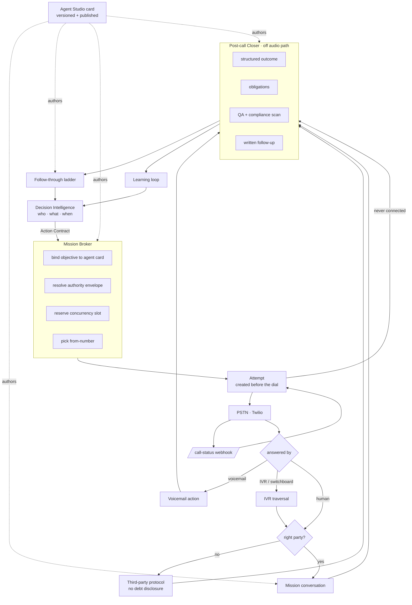

# Outbound Agent Engine

**Status:** Implemented and **complete** — 2026-08-22. O0 through O6 are built, and the environment switches are on in `backend/.env`: `TREATMENT_MODE=live`, `CAMPAIGN_RUNTIME_ENABLED=true`, `OUTBOUND_EVAL_GATE_ENABLED=true`, `BOUNCE_VOICE_ENABLED=true`. The engine's plans become real dials, under the same guards as before: `contact_policy` at send time, the calling window, the daily cap, the attempt ledger and the card's `max_attempts`.

> **Superseded 2026-08-26 — nothing dials by default any more.** A master switch
> now sits above every flag in this document: `platform_switches.outbound.enabled`,
> a Postgres row read by all four processes and enforced inside
> `voice.twilio_ops.start_outbound_call`, the one function that reaches the
> carrier. **Absence is off**, so a fresh install, a restored backup and an
> unreadable database all decline to dial. The four `.env` flags above still
> apply — they are now necessary rather than sufficient. An operator turns the
> master switch on from **Roles & access**, which is also where the one-click
> demo dial lives. This exists because the env flags need a `.env` edit and four
> restarts to change, which is not a control anyone can reach during an incident. §21 closes the five items §20 left open and the four further dead fields found while closing them.

**§20 records the seven things that were configured but had no effect**, and are now wired. They are worth reading before the next feature: each one was validated, versioned and publishable while doing nothing, which is a worse failure than an unbuilt feature — the operator sees a diff in the change log and the behaviour does not move. **§21 closes the remainder** — and found four more of the same species, including one that had been shipping non-compliant SMS behind a docstring claiming otherwise.
**Relationship to other docs:** consumes the Action Contract defined in `decision-intelligence-engine.md` §12. That document decides *whether, what and when*. This one is everything downstream of the decision: authoring the agent that carries it out, placing the call, running the conversation, closing the loop, and feeding the result back.
**Audience:** engineering, collections operations, risk & compliance
**Authoring surface:** Agent Studio. Every behaviour described here is a versioned, publishable property of an agent card — not an environment variable, not a cron, not a script in `voice/flows.py`.

---

## 1. The thesis

> An outbound agent is not a script that dials. It is a **mission executor**: it is handed an authorised intervention, it works the objective against a live human, and it returns a structured account of what happened that is good enough to decide the next one.

Three consequences follow, and each is a section of this document:

1. **The mission has to be an object.** Today a dial carries a phone number and a `customer_id`. It must carry an objective, an authority envelope, a success definition, a time budget and a decision id.
2. **The attempt has to be an object.** Today an unanswered call leaves no trace anywhere in the database. Every metric an outbound operation runs on — answer rate, right-party-contact rate, best time to call, cost per connect — is currently uncomputable from what we keep.
3. **The outcome has to be an object.** Today the post-call summary is `"voice session | primary=hardship | customer_turns=7 | ptp=no | upsell=no"`, produced by string concatenation in `capture.build_template_summary()`, and the disposition is one of four values derived from three booleans. That is not a record of a conversation. It is a receipt.

Everything else — pacing, retries, voicemail, IVR traversal, negotiation, upsell, follow-up — is detail hanging off those three.

---

## 2. Honest current state

**Updated 2026-08-22.** The table below describes the state this document was
written against. O0 and O1 have since landed — `call_attempts`, `call_outcomes`,
`agent_obligations`, a real `/twilio/voice/call-status`, the Closer, the
`capture_nonpayment_reason` taxonomy and the hardship→upsell interlock. Rows
that are no longer true are marked **[fixed]**. The rest still stand.

Measured against the working tree and `backend/.env`, not inferred.

| Fact | Value |
| --- | --- |
| Functions that place an outbound call | **1** — `voice/twilio_ops.py:268` |
| Callers of it | 3 — manual endpoint, bounce autodial, treatment executor |
| ...of those, enabled today | **1** (the manual endpoint) |
| `TREATMENT_MODE` | `shadow` → `enact.process_one()` returns on line 1 |
| `BOUNCE_VOICE_ENABLED` | unset → the bounce autodial is off |
| Rows written when a dial is not answered | **0** → one `call_attempts` row per dial **[fixed]** |
| `/twilio/voice/call-status` behaviour | ~~logs, returns 204~~ → drives the attempt state machine **[fixed]** |
| Outbound dials drained per worker iteration | **1** (`claim_due(limit=1)`) |
| Tables representing a call list / campaign | **0** |
| Frontend references to `/treatment/*` or `/twilio/voice/outbound` | **0** |
| Agent Studio tabs | 12 — none of them about being on the phone first |
| `AgentCard` fields describing direction, objective or cadence | **0** |
| Post-call dispositions in the taxonomy | ~~4~~ → 10 connection × 15 business **[fixed]** |
| Structured reason-for-non-payment field | ~~none~~ → 9-code taxonomy + tool **[fixed]** |
| `treatment_decision_id` passed into Twilio custom params | yes |
| ...code that reads it back | ~~none~~ → read in `voice/bot.py`, carried to the attempt **[fixed]** |
| `customer_id` passed to `bind_session_start` on an outbound leg | ~~no~~ → resolved from the stream params **[fixed]** |

### What is genuinely good and must be preserved

This is not a greenfield. The parts that exist are, in several cases, better than what a vendor would ship:

- **`contact_policy.admit()` is fail-closed, atomic and shared.** Daily budget is a `contact_day_counters` row locked `FOR UPDATE`, so two concurrent dials cannot both take slot 3. Eleven distinct denial reasons, all logged. One definition consumed by the dialler, the WhatsApp drain and the document desk.
- **The gate runs again at send time.** A plan made at 09:00 for 19:30 is checked against the budget as it stands at 19:30, not as it stood at 09:00 (`treatment/enact.py` module docstring).
- **Timing precedes veto.** `treatment/timing.py` plans each candidate to an instant and *then* asks whether that instant is permitted — which is why "WhatsApp now" can beat "agent call at 08:00 tomorrow" without a special case.
- **Concurrency admission already exists.** `voice/admission.py` is a counted gate with a documented, conservative default (25 per process) chosen against the connection pool budget, not picked for roundness. A campaign runner must respect it, not route around it.
- **Voicemail and third-party-IVR traversal are already built.** `voice/amd.py` wires Pipecat's `VoicemailDetector` for outbound legs only; `voice/ivr.py` drives DTMF through a workplace switchboard to reach a human, with a default goal that explicitly forbids keying the borrower's account number into a third party's menu.
- **The authority matrix is real.** `agent_core/authority` returns a verdict, an approved rupee amount and **the only sentence anyone may speak**. The model does not choose the number.
- **The flow graph is authored data, not Python.** `voice/flows_dynamic.py` compiles `prompt_versions.flow` into Pipecat nodes, and the business tools inside them are the real ones — an authored node calling `create_promise_to_pay` writes a real PTP.
- **Off-audio-path persistence.** `voice/crm_sink.py` drains transcript, sentiment, tool calls and analysis through a queue so nothing in the CRM can delay a spoken turn.

### The honest summary

We have an excellent **conversation runtime** and an excellent **compliance gate**, joined by a `calls.create()` call with no state machine around it, and terminated by a summary built with `" | ".join()`.

---

## 3. Five objects that do not exist

Everything in this document reduces to adding these and wiring them.

| Object | What it is | Why its absence hurts |
| --- | --- | --- |
| **Mission** | The authorised intervention, carried end to end | The agent does not know why it is calling; every outbound call runs the inbound script |
| **Attempt** | One dial, from before `calls.create` to final status | No answer rate, no RPC rate, no best-time-to-call, no retry state, no cost attribution |
| **Outcome** | Structured account of what the conversation produced | No reason taxonomy, no commitment record beyond a PTP row, no objection log |
| **Obligation** | Something *we* promised on the call | "I'll call you Tuesday at six" is currently spoken and forgotten |
| **Cadence** | The authored retry/escalation policy for a mission | Retry logic is nowhere; a no-answer is a dead end |

---

## 4. Architecture



The dotted lines are the point of the design. **Mission binding, conversation, post-call actions and cadence are all authored in one place and published atomically as one version**, the same way `prompt`, `persona`, `voice`, `guardrails` and `flow` already publish atomically as one `prompt_versions` row.

---

## 5. Agent Studio — the Outbound tab

### 5.1 Why the card is the right home

`prompt_versions` already carries `prompt`, `persona`, `voice`, `guardrails`, `flow`, `agent_card` and `tuning`, and `bot_deployments` publishes exactly one active row per bot per environment with a unique partial index enforcing it. That is a working versioned-config spine with rollback, canary (`traffic_pct`, `shadow`), and an eval gate (`eval_report_id`) already on it.

An outbound campaign configured in a separate admin screen would be config that can change **without a version bump** — which means the sentence the agent said and the cadence that produced the call would have different audit trails. For a regulated collections call that is not acceptable. A regulator asking "why did this borrower get four calls in three days in March" must get one answer with one version number.

So: **outbound is a section of the agent card**, and changing the cadence is a publish.

### 5.2 New card section

Added to `agent_core/cards/schema.py` alongside `identity`, `mouth`, `tools`, `policy_bindings`:

```python
Direction = Literal["inbound", "outbound", "both"]
Objective = Literal[
    "pre_due_reminder", "bounce_cure", "dpd_reminder", "broken_ptp_chase",
    "hardship_intake", "mandate_reregistration", "document_chase",
    "callback_honour", "welcome_onboarding", "retention_save", "cross_sell",
]

class CardObjective(BaseModel):
    key: Objective
    entry_node: str                      # node key in prompt_versions.flow
    success: list[str]                   # outcome codes that close the mission
    partial: list[str] = []              # outcomes worth logging as progress
    max_duration_sec: int = 240
    allowed_offers: list[str] = []       # narrows reco's candidate set
    authority_profile: str | None = None # named cap set in agent_core.authority
    voicemail: VoicemailPolicy
    cadence_ref: str                     # -> CardCadence.name

class CardCadence(BaseModel):
    name: str
    max_attempts: int = 3                # per case, not per day
    per_day: int = 1                     # never exceeds contact_policy caps
    backoff_hours: list[int] = [4, 24, 72]
    retry_on: list[str] = ["no_answer", "busy", "voicemail_left"]
    stop_on: list[str] = ["ptp", "paid", "dispute", "opt_out", "wrong_number"]
    escalate_to: str | None = None       # bot_id or "human"
    time_of_day_strategy: Literal["engine", "fixed", "spread"] = "engine"

class CardPostCall(BaseModel):
    """What happens after the audio stops. Authored, not hardcoded."""
    outcome_model: Literal["structured_v1"] = "structured_v1"
    on_outcome: list[PostCallRule] = []  # outcome code -> tool invocations
    written_followup: WrittenFollowupPolicy
    obligations: bool = True             # honour promises the agent made
    qa: Literal["always", "sampled", "never"] = "always"

class CardOutbound(BaseModel):
    direction: Direction = "inbound"
    objectives: list[CardObjective] = []
    cadences: list[CardCadence] = []
    post_call: CardPostCall = CardPostCall()
    number_pool: str | None = None       # tenant number pool id (see §12.2)
    concurrency_share: int = 0           # slots reserved from voice/admission
    amd: AmdPolicy = AmdPolicy()
    ivr_traversal: bool = False
    third_party_protocol: Literal["strict"] = "strict"
```

### 5.3 The thirteenth tab

Studio today: System Prompt · Flow · Agent graph · Persona · Voice · Guardrails · Tools · Skills · Connectors · Policy · Evals · Ship.

Add **Outbound**, placed between Policy and Evals — after the constraints that bound it, before the gate that proves it.

Four panes:

| Pane | What the author does | What it validates against |
| --- | --- | --- |
| **Missions** | Define objectives; pick the flow node each enters at; declare what counts as success | Entry node must exist in the flow graph; success codes must be in the outcome taxonomy |
| **Cadence** | Attempts, backoff curve, retry-on/stop-on, escalation target | `per_day` must not exceed `CONTACT_DAILY_CAP`; escalation target must be on the handoff allowlist |
| **Post-call** | Outcome → action rules, written follow-up template, obligations on/off | Every tool named must be in `effective_include()`; templates lint for PII and unquoted numbers |
| **Simulation** | Run the mission against a borrower twin before publishing | `agent_core/twin.py` — fake ledger, no dialer |

**Compile gates.** `agent_core/cards/compile.py` already produces a `CompileReport` that can block publish. Outbound adds gates:

- **G-OB1** — `direction` includes outbound but no objective is defined → error.
- **G-OB2** — an objective's `entry_node` is absent from the flow graph → error.
- **G-OB3** — cadence `per_day` × objectives exceeds the borrower daily cap → error. *An agent cannot be published that is arithmetically guaranteed to be vetoed.*
- **G-OB4** — an objective grants `allowed_offers` while `number_pool` is a service-only pool → error (see §12.2).
- **G-OB5** — outbound with no voicemail policy → error. Silence on an answering machine is a decision; it must be an explicit one.
- **G-OB6** — a post-call rule names a tool the card does not include → error.
- **G-OB7** — a cadence escalating to a bot that is not on the card's handoff allowlist → error. A ladder with a missing top rung.
- **G-OB8** — an objective naming a cadence the card does not define → error. It would silently become the default, which is a different retry policy than the author wrote down.
- **G-OB9** — outbound published without a passing outbound eval suite → error. The existing `CardEval.require` gains an `outbound` member.

**As built, G-OB3 checks per cadence rather than summing across missions.** The formula above — *cadence `per_day` × objectives* — assumes every borrower is on every mission at once, which is never true: a bounce cure and a broken-promise chase are different reasons and the same person is rarely both. It blocked a perfectly sane four-mission card on its first run. What *is* arithmetically guaranteed to be vetoed is one cadence planning more contacts in a day than the borrower's cap allows, and that is what ships.

### 5.4 What this buys

One published version of one agent card fully answers: *who may we call, why, what may we say, what may we concede, how often may we try again, what happens when we hang up, and who proved it works.* That is currently spread across four Python modules, three environment variables and nobody's screen.

---

## 6. The Mission — replacing the script with an objective

### 6.1 The problem today

`voice/flows.py` builds one collections conversation: `greet_disclose → discover_intent → verify_identity → state_position/collections_hub → {negotiate_ptp | handle_dispute | gated_upsell} → wrap_up → pre_close → call_ended`.

It is a good conversation. But `discover_intent` exists because the agent genuinely does not know why the call is happening — which is correct on an inbound call and absurd on an outbound one. **We chose this borrower, this moment and this reason, and then we ask them what they want.**

Worse: `bind_session_start` accepts `customer_id` and `voice/bot.py:1600` does not pass it. So an engine-placed dial to a known borrower on a number we selected opens as an unknown caller and re-verifies identity from scratch.

### 6.2 The Mission object

The Action Contract from the decision engine, resolved against the card, becomes:

```json
{
  "mission_id": "MSN-01K3...",
  "decision_id": "TD-01J8X...",
  "propensity": 0.62,
  "policy_version": 7,
  "objective": "broken_ptp_chase",
  "customer_id": "vikram-rao",
  "account_id": "ACC-9021",
  "bot_id": "kaia-v2-4",
  "deployment_id": "DEP-...",
  "entry_node": "ptp_recommit",
  "context": {
    "promise_id": "PRM-441",
    "promised_amount_inr": 4200,
    "promised_date": "2026-08-14",
    "days_broken": 6,
    "last_contact": {"channel": "whatsapp", "at": "...", "read": true}
  },
  "authority": {"profile": "collections_tier2", "max_waiver_inr": 500},
  "allowed_offers": [],
  "prohibited": ["third_party_disclosure", "pressure_language", "cross_sell"],
  "success": ["ptp_recommitted", "paid_in_call"],
  "max_duration_sec": 210,
  "expected_value_inr": 68.40,
  "variant": "treatment"
}
```

`decision_id` and `propensity` are carried verbatim from the contract for the reason `decision-intelligence-engine.md` §12 gives: without the first the outcome cannot be attributed, without the second no off-policy estimate is valid. Today `treatment_decision_id` is already put into the Twilio custom params by `enact._dial_bot` and read by nothing — this closes that arc.

### 6.3 What changes in the conversation

| Today | With a mission |
| --- | --- |
| `discover_intent` asks the borrower why they think we called | Skipped. The agent states the reason and asks a closing question |
| Identity verified from zero | We know who we dialled; verification becomes *confirmation* — a much shorter, less irritating exchange, and the fallback to full verification is the wrong-party path |
| `state_position` reads the ledger live | Ledger position pre-fetched into the mission; the first spoken turn does not wait on a query |
| One flow for every reason | `entry_node` per objective; `pre_due_reminder` and `broken_ptp_chase` are different conversations sharing one card, one persona and one tool set |
| `gated_upsell` reachable from any call | Reachable only when the mission's `allowed_offers` is non-empty **and** the number pool permits it |
| No time budget | `max_duration_sec` — the wrap-up node is entered on a timer, not on the model's judgement |

### 6.4 Missions are not only collections

The same machinery, authored per card, covers:

- **Welcome / onboarding** — first EMI explainer, mandate confirmation. Highest-ROI call nobody makes.
- **Pre-due nudge** — 3 days before EMI, timed to salary credit. Cheapest cure in the system.
- **Mandate re-registration** — the *only* correct response to a `mandate cancelled` return code, and a call that has nothing to do with dunning.
- **Document chase** — KYC, income proof; already has `request_documents` and `ingest_customer_document` tools.
- **Callback honour** — the borrower asked us to call at a time; we currently record it in `callbacks` and have no automated way to place it.
- **Retention / save** — a foreclosure enquiry is a churn signal and a cross-sell moment.

The reason to build the abstraction rather than a second collections script is that **the fifth mission costs nothing once the first four exist**, and each one is a separate line item in a bank's RFP.

---

## 7. The Attempt — the object everything else is measured on

### 7.1 The gap, precisely

`interactions` rows are created by `persist.start_voice_call()`, which runs from `on_client_connected` — i.e. *only when media connects*. A ring-out, a busy tone, a rejected call, a disconnected number and a call we never placed because the gate said no all produce the same evidence: nothing.

`/twilio/voice/call-status` receives every one of those transitions today and returns 204 without a write. Meanwhile SMS has a complete receipt ledger in `contact_delivery_events`, resolved by provider SID rather than phone number — carefully built, and voice has no equivalent.

The consequence is not a missing dashboard. `treatment/features.py` computes `connect_rate` and `responsive_hours` from voice interactions with `duration_sec >= CONNECT_MIN_SECONDS` (20). Attempts that never connected are invisible to that calculation, so the reach estimator sees only the numerator. **The single most important input to "when should we call this borrower" is being computed from a filtered sample.**

### 7.2 `call_attempts`

```sql
CREATE TABLE call_attempts (
  id                TEXT PRIMARY KEY,
  tenant_id         TEXT NOT NULL REFERENCES tenants(id) ON DELETE CASCADE,
  customer_id       TEXT NOT NULL REFERENCES customers(id) ON DELETE CASCADE,
  account_id        TEXT REFERENCES accounts(id) ON DELETE SET NULL,
  mission_id        TEXT,
  decision_id       TEXT REFERENCES treatment_decisions(id) ON DELETE SET NULL,
  campaign_run_id   TEXT REFERENCES campaign_runs(id) ON DELETE SET NULL,
  bot_id            TEXT REFERENCES bots(id),
  deployment_id     TEXT,
  objective         TEXT NOT NULL,
  attempt_no        INTEGER NOT NULL DEFAULT 1,
  to_phone_hash     TEXT NOT NULL,          -- hashed; raw number stays on customers
  phone_slot        TEXT NOT NULL,          -- primary | alt | workplace
  from_number       TEXT NOT NULL,
  number_pool       TEXT,
  -- lifecycle
  state             TEXT NOT NULL,          -- see §7.3
  placed_at         timestamptz,
  answered_at       timestamptz,
  ended_at          timestamptz,
  ring_sec          INTEGER,
  talk_sec          INTEGER,
  provider          TEXT NOT NULL DEFAULT 'twilio',
  provider_call_id  TEXT,
  provider_status   TEXT,
  provider_error    TEXT,
  price_inr         numeric(10,4),
  -- classification
  answered_by       TEXT,                   -- human | machine | ivr | unknown
  right_party       boolean,
  interaction_id    TEXT REFERENCES interactions(id) ON DELETE SET NULL,
  outcome_id        TEXT REFERENCES call_outcomes(id) ON DELETE SET NULL,
  suppressed_reason TEXT,                   -- set when the gate refused
  created_at        timestamptz NOT NULL DEFAULT now(),
  updated_at        timestamptz NOT NULL DEFAULT now()
);
CREATE INDEX idx_call_attempts_customer_placed ON call_attempts (customer_id, placed_at DESC);
CREATE INDEX idx_call_attempts_state ON call_attempts (state) WHERE state IN ('reserved','dialing','ringing','live');
CREATE UNIQUE INDEX ux_call_attempts_provider_call ON call_attempts (provider, provider_call_id)
  WHERE provider_call_id IS NOT NULL;
```

Two design points worth defending:

**The row is written before `calls.create`, not after.** A crash between the gate and the carrier currently leaves a borrower's daily budget spent with no record of what spent it. Writing `reserved` first makes the attempt recoverable and makes an orphaned Twilio call detectable.

**A refused attempt is still a row.** `suppressed_reason` records the eleven `contact_policy` denial reasons against a real attempt object. That turns "our denial rate is 14%" from a log-grep into a query, and it is the single most useful number in a compliance review.

### 7.3 Attempt state machine

```
reserved ──gate denied──────────────────────► suppressed
   │
   └─slot acquired──► dialing ──► ringing ──┬─► answered ──► live ──► completed
                                             ├─► no_answer
                                             ├─► busy
                                             ├─► rejected
                                             ├─► failed        (carrier error)
                                             └─► invalid_number
answered ──AMD: machine──► voicemail ──┬─► voicemail_left
                                        └─► voicemail_skipped
live ──────────► transferred            (warm handoff to human)
live ──────────► abandoned              (our side dropped)
```

`no_answer`, `busy`, `rejected` and `voicemail_left` are retryable per the cadence. `invalid_number` and `rejected` × 3 mark the phone slot dead and promote the alternate number — which is skip-tracing's cheapest form and currently does not exist.

### 7.4 What the webhook must do

`/twilio/voice/call-status` becomes the attempt's state machine driver: signature-verified (already is), idempotent on `(provider, provider_call_id, status)`, and writing `ring_sec`, `talk_sec`, `provider_status`, `price_inr` and the terminal state. Twilio's `AnsweredBy` — if we enable carrier-side AMD as a *second* signal alongside Pipecat's in-band detector — lands here too.

**This endpoint is roughly forty lines of work and it unblocks every outbound metric in the product.** It is the first thing to build.

---

## 8. Placing the call — pacing, numbers and the things that answer instead of a person

### 8.1 Pacing: reserved-concurrency power dialing, never predictive

The industry default for outbound at volume is a predictive dialer: over-dial the available agents, and drop the calls that connect when nobody is free. That model is built on the assumption that agent time is the scarce resource and an abandoned call is an acceptable cost.

**Neither assumption holds here.** Bot capacity is elastic in a way human capacity is not, and an abandoned call to a delinquent borrower — their phone rings, they answer, silence, disconnect — is exactly the conduct the RBI amendment (§12.1) is written to stop. It also poisons the reach estimator: the borrower *was* reachable and we recorded a failure.

So the design is deliberately conservative:

> **A slot in `voice/admission.py` is acquired before `calls.create` and released when the attempt reaches a terminal state. If no slot is available the attempt is not placed.** Abandon rate is structurally zero, not managed down.

The knobs that follow:

- `CardOutbound.concurrency_share` reserves slots per agent card, so a cross-sell campaign cannot starve the bounce-cure queue.
- The fleet-wide limiter that `admission.py` deliberately does not attempt (its docstring: *"a distributed limiter that is subtly wrong is worse than a local one that is exactly right"*) becomes necessary at multi-worker scale. Redis is already a dependency for `voice/mesh_bus`. Do it with a Redis token bucket keyed on tenant, and keep the local counter as the backstop — if Redis is down, each worker still caps itself correctly.

**Capacity, derived from constants in this repo.** With `DEFAULT_MAX_CONCURRENT_CALLS = 25` per voice worker and the RBI 08:00–19:00 window (11 h):

| Parameter | Assumption | Source |
| --- | --- | --- |
| Connected call length | 3.0 min | to be measured; `max_duration_sec` bounds it |
| Ring-out length | 0.5 min | carrier default |
| Answer rate | 30% | **must be measured — this is exactly the number `call_attempts` exists to produce** |
| Mean occupancy per attempt | 0.3(3.0) + 0.7(0.5) + 0.15 setup ≈ **1.4 min** | derived |
| Attempts / slot / hour | ≈ 42 | derived |
| **Attempts / day / worker** | **≈ 11,500** | 42 × 25 × 11 |
| **Connects / day / worker** | **≈ 3,450** | at 30% |

One worker process covers a mid-sized book's daily dialling. This is a scale-out problem, not a scale-up one, and the constraint that binds first is the Azure/LLM concurrency the `admission.py` docstring warns about — not Twilio.

### 8.2 Number pools

`twilio_ops.twilio_phone()` reads one `TWILIO_PHONE_NUMBER` from the environment for the whole deployment. Three things break that:

1. **TRAI's 1600-series mandate** (§12.2) requires BFSI service and transactional calls to originate from a dedicated series, and **prohibits promotional content on it**.
2. **Multi-tenancy** — two banks on one deployment cannot share a caller ID.
3. **Answer-rate management** — a number that has been marked spam by enough handsets stops connecting, and there is currently no way to observe that, let alone rotate.

```sql
CREATE TABLE number_pools (
  id TEXT PRIMARY KEY, tenant_id TEXT NOT NULL, name TEXT NOT NULL,
  kind TEXT NOT NULL CHECK (kind IN ('service_1600','promotional','general')),
  ...
);
CREATE TABLE pool_numbers (
  id TEXT PRIMARY KEY, pool_id TEXT NOT NULL, e164 TEXT NOT NULL,
  state TEXT NOT NULL CHECK (state IN ('active','cooling','retired')),
  attempts_7d INTEGER, answer_rate_7d numeric(5,4), ...
);
```

Selection is per attempt: tenant → mission purpose → pool kind → least-recently-used active number. `kind = 'service_1600'` sets a hard flag on the mission that **suppresses the upsell node entirely** — which is compile gate G-OB4, and is why that gate is an error and not a warning.

### 8.3 Voicemail as a first-class action

`voice/amd.py` already detects the machine and leaves a tenant-rendered message. Two upgrades:

**Leaving a message is a decision with an expected value.** It consumes a contact touch, and it has a measurable callback lift that varies enormously by bucket and by borrower. Once `call_attempts` distinguishes `voicemail_left` from `voicemail_skipped`, the follow-through loop can label the outcome and the engine can *learn* whether it is worth doing, per segment. Until then the card carries a policy:

```python
class VoicemailPolicy(BaseModel):
    leave: Literal["always", "never", "first_attempt_only", "engine"] = "first_attempt_only"
    script_ref: str | None = None   # persona-rendered, never hardcoded
    max_sec: int = 25
    disclose_recording: bool = False  # we are the recorded party here, not them
    include_grievance_contact: bool = True   # RBI ¶100AA
```

**A voicemail is a recovery communication.** Under the amendment, recovery communications must carry the grievance officer's contact details. A message that says only "please call us back" is a communication we made without the disclosure. That is a compliance defect in an existing, shipped code path — `VOICEMAIL_SCRIPT` in `voice/amd.py` today is *"Hello, this is Priya calling from HDFC Bank collections regarding your account. Please call us back at your earliest convenience."*

It also discloses the existence of a debt to whoever plays the message. See §8.5.

### 8.4 IVR traversal

`voice/ivr.py` is a genuine differentiator and almost nobody ships it: when the number on file is a workplace switchboard, the navigator drives DTMF to reach a human rather than burning the attempt on a robot. Its default goal already forbids entering account numbers into a third party's menu — exactly right.

Additions for the mission model:

- Record `answered_by = 'ivr'` and the traversal path on the attempt. A number that is *always* an IVR is a data-quality finding, not a retry candidate.
- Budget the traversal (`ivr_max_sec`) so a call cannot spend its whole `max_duration_sec` in a menu tree.
- On reaching a human, enter the **third-party protocol** below, not the mission — a switchboard operator is by definition not the borrower.

### 8.5 Right-party contact and the third-party protocol

This is where an outbound collections agent is most likely to cause real harm, and it is currently unmodelled.

The rule, stated once: **until the person on the line is confirmed as the borrower, the agent may not disclose that a debt exists, its amount, its status, or the name of the product.** Paragraph 100O of the amendment restricts sharing borrower information with third parties; Indian conduct norms and the equivalent in every other jurisdiction converge on the same behaviour.

```
answered by human
  └─ "Am I speaking with <first name>?"
       ├─ yes  → verify (confirmation, since we dialled them) → mission
       ├─ no   → third-party protocol:
       │           - state only: calling from <issuer>, personal business
       │           - no debt, no amount, no product, no "collections"
       │           - ask for a good time / alternate number
       │           - offer the grievance and callback number
       │           - end; write outcome = wrong_party or third_party_reached
       └─ evasive/unclear → treat as third party (fail closed)
```

The detector already exists — `third-party-leak` is in `_LIVE_ALERT_FLAGS` and `_BARGE_ALERT_FLAGS` in `voice/persist.py`, meaning a leak can already barge the call. What is missing is the *node*: the protocol above must be an authored flow node with a narrow tool set, reachable from every objective, and it must be the default landing when identity is not positively confirmed.

`right_party` on the attempt then makes **RPC rate** — the metric every collections operation actually manages — computable for the first time.

---

## 9. Inside the conversation — what a mission changes

The conversation runtime is the strongest part of the current stack. Five upgrades, all of which are additions rather than rewrites.

### 9.1 Warm context, not cold discovery

The mission carries pre-fetched account position, the last contact and its read state, and the open promise. The first turn becomes:

> *"Hello, is that Vikram? …It's Priya calling from HDFC. I'm following up on the message we sent Tuesday about the instalment that was due on the fourteenth."*

That single change removes the `discover_intent` node from outbound calls, removes a ledger round-trip from the critical path, and removes the most common cause of an early hang-up — an agent that sounds like it does not know who it called.

### 9.2 Reason capture as a structured field

The largest analytical gap in the product. The agent can tell you an account is 45 DPD with two bounces; it cannot tell you the borrower lost their job in June.

Add a `capture_nonpayment_reason` tool and a fixed taxonomy — this is a **dictionary, not a free-text field**, because the value is in segmenting the book by it:

| Code | Meaning | The action it should trigger |
| --- | --- | --- |
| `salary_timing` | Money arrives after the EMI date | `emi_date_change`, mandate re-present |
| `income_loss` | Job loss, business downturn | hardship intake, restructure authority |
| `medical` | Illness, hospitalisation | hold, statutory-minimum contact only |
| `mandate_broken` | Debit failing, borrower willing | `mandate_reregistration` mission |
| `disputes_amount` | Believes the charge is wrong | `flag_dispute`, contact hold |
| `competing_obligation` | Paying another lender first | negotiation, part-payment |
| `forgot` | Genuine oversight | cheapest digital nudge; **not a call** |
| `unwilling` | Able, refusing | escalation ladder |
| `not_stated` | Would not say | — |

`forgot` deserves special mention. It is the code that tells the decision engine it just spent a ₹45 call on someone a ₹0.15 SMS would have cured — and it is the label the uplift model needs to learn *not* to call the next borrower like them. This taxonomy is a training-signal generator disguised as a CRM field.

### 9.3 Negotiation with a real envelope

`agent_core/authority` already returns `auto_approve | cap_inr | escalate`, an approved amount and the exact sentence. The mission adds:

- **A named `authority_profile` per objective.** A `broken_ptp_chase` may concede more than a `pre_due_reminder`, and that difference is authored in Studio, not hardcoded.
- **Structured commitment capture.** A PTP today is amount + date. Add `confidence` (the agent's read: firm / hedged / extracted), the borrower's verbatim commitment, and whether it was *their* number or ours. Broken-PTP rates differ sharply between a borrower who proposed an amount and one who agreed to ours; that is a feature the engine cannot currently see.
- **Part-payment and restructure as offers on the contract**, not as actions. `decision-intelligence-engine.md` §6 makes this argument and it is correct: a concession must be *said to somebody*, so it is a property of a contact, and it belongs on `allowed_offers` where the authority matrix decides it.

### 9.4 Upsell, gated properly

`gated_upsell` is well built — the node forbids naming any product the recommender did not return, and `return_to_position` exists because a caller once got trapped in a lead qualification nobody asked for. Two mission-level gates on top:

1. **The number pool** (§8.2). A promotional pitch on a service-only number is a regulatory problem, not a taste problem.
2. **The reason code.** Pitching a top-up to a borrower who just said `income_loss` or `medical` is the conduct failure that ends a bank pilot. `capture_nonpayment_reason` must veto the upsell node for the rest of the call — a hard interlock in the flow, not a prompt instruction.

### 9.5 Language

`agent_core/understanding.py` documents the real problem plainly: the keyword classifiers are English substring matchers, and a borrower saying *"paisa nahi hai bhai, naukri chali gayi"* scores `out_of_scope` with sentiment 0.00 — routing them to the wrong corpus, suppressing no upsell, triggering no escalation. The LLM merge layer fixes classification. For outbound, language must also be a **mission input**: `customers.language` selects the persona and the opening line before the first word is spoken, because an outbound call in the wrong language is an immediate hang-up and a wasted touch.

---

## 10. Post-call — the Closer

### 10.1 What happens today

`persist.complete_voice_call()` → `capture.rollup_interaction()` → `build_template_summary()` produces a pipe-joined string, and `disposition_from_flags()` picks one of four values from three booleans. Then `score_completed_interaction()` runs the live-QA scorecard. That is the entirety of post-call processing.

### 10.2 The Closer

A post-call agent — not the voice agent, not on the audio path, running in `bot_worker` off a queue — that reads the transcript, the tool calls, the attempt and the mission, and writes one `call_outcomes` row.

```sql
CREATE TABLE call_outcomes (
  id TEXT PRIMARY KEY,
  attempt_id TEXT NOT NULL REFERENCES call_attempts(id) ON DELETE CASCADE,
  interaction_id TEXT REFERENCES interactions(id) ON DELETE SET NULL,
  mission_id TEXT, decision_id TEXT,
  -- two independent axes, which is the whole fix
  connection TEXT NOT NULL,      -- no_answer|busy|voicemail|wrong_party|ivr_only|connected
  business TEXT,                 -- see taxonomy below
  objective_met boolean NOT NULL DEFAULT false,
  nonpayment_reason TEXT,
  commitment jsonb,              -- {amount, date, confidence, verbatim, whose_number}
  objections jsonb,              -- [{code, raised_at_turn, answered:boolean}]
  unanswered_questions jsonb,    -- feeds the KB gap gardener
  sentiment_start numeric(5,3), sentiment_end numeric(5,3),
  escalation TEXT,               -- none|requested|auto|transferred
  compliance_flags jsonb,
  next_action_hint TEXT,         -- advisory to the engine, never binding
  summary TEXT NOT NULL,         -- LLM, number-fenced (see below)
  summary_model TEXT, confidence numeric(4,3),
  created_at timestamptz NOT NULL DEFAULT now()
);
```

**Disposition as two axes, not one list.** The current four values conflate "did the phone connect" with "did the conversation work". Splitting them is what makes `no_answer` retryable and `refused_to_pay` not, and it is what makes the two metrics — reach and persuasion — separately improvable.

Business outcomes: `ptp_captured` · `ptp_recommitted` · `paid_in_call` · `part_payment_agreed` · `plan_agreed` · `dispute_raised` · `hardship_declared` · `refused` · `callback_requested` · `wrong_number` · `deceased` · `opt_out_requested` · `escalated` · `no_resolution` · `abandoned_by_customer`.

Three of those (`deceased`, `opt_out_requested`, `wrong_number`) are **terminal for the case and must write immediately**, not on a batch. An opt-out honoured an hour late is an opt-out ignored.

**The summary is written by an LLM and fenced the way `rerank.py` is fenced.** `decision-intelligence-engine.md` §13 gets the boundary right: language is a legitimate LLM job, ranking is not. The same discipline applies to numbers — a summary containing a rupee figure or a date absent from the structured payload is rejected and regenerated. The existing `customer_memory.summary` column already carries this rule in its schema comment (*"post-filtered to contain no numbers, dates…"*); the Closer inherits it.

### 10.3 Authored post-call actions

`CardPostCall.on_outcome` is a list of rules the author writes in Studio:

```yaml
- when: ptp_captured
  do: [confirm_written, schedule_due_reminder, close_case]
- when: hardship_declared
  do: [place_hold(30d), create_followup(specialist), suppress_upsell(90d)]
- when: dispute_raised
  do: [flag_dispute, place_hold(until_resolved), notify(disputes_queue)]
- when: callback_requested
  do: [schedule_mission(callback_honour, at=requested_time)]
- when: wrong_number
  do: [mark_phone_dead, promote_alternate, requeue(attempt_no=1)]
- when: opt_out_requested
  do: [record_optout(channel), stop_cadence, confirm_written]
- when: no_resolution
  do: [advance_ladder]
```

Every verb on the right is an existing tool or an existing module function. The value is not new capability — it is that **the rules are versioned with the agent that produced the outcome**, visible on one screen, and lintable at publish time.

### 10.4 Obligations

If the agent says *"I'll send you the statement"* or *"I'll call you Tuesday at six"*, that is a commitment the institution made. Today it is spoken and forgotten unless a tool happened to fire.

```sql
CREATE TABLE agent_obligations (
  id TEXT PRIMARY KEY, customer_id TEXT NOT NULL, interaction_id TEXT NOT NULL,
  kind TEXT NOT NULL,          -- callback|document|escalation|correction|waiver
  due_at timestamptz NOT NULL,
  detail jsonb NOT NULL, verbatim TEXT,
  state TEXT NOT NULL,         -- open|honoured|missed|cancelled
  ...
);
```

The Closer extracts them from the transcript; the worker honours them; a missed obligation is a QA finding with a named owner. **An agent that keeps its promises is the entire trust proposition of an automated collections line**, and it is currently unmodelled.

Note the contact-policy subtlety: a borrower-requested callback is not outreach fatigue. It goes through `admit()` with `purpose="in_session"` semantics — the borrower asked — and the cap must not silently eat it. That is a small, load-bearing decision.

### 10.5 Written follow-up

The pattern already exists and is good: `promise_fulfillment.fulfill()` creates a payment intent, picks a channel the borrower has not opted out of, enqueues a WhatsApp confirm with a real pay link, and schedules the due-date reminder — and it *never invents a URL for the LLM to read aloud*.

Generalise it beyond PTPs. Every mission outcome has a written counterpart: a hardship acknowledgement, a dispute reference number, a callback confirmation, a wrong-number apology. The template is authored on the card, rendered with real values, and enqueued through `whatsapp_outbound_jobs` — which already has the retry, locking and dead-letter shape the pattern needs.

---

## 11. Follow-up and the ladder

### 11.1 Cadence executes; the ladder decides

Two different loops, and conflating them is the classic mistake.

- **Cadence** is *"this attempt did not connect; try again in 4 hours from a different number at a different hour."* Mechanical, authored on the card, bounded by `max_attempts`.
- **The ladder** is *"three attempts on this case produced nothing; the next rung is a human, or a field visit, or silence."* That is a decision, and it belongs to `treatment/followthrough.py` and the engine — never to the dialer.

The boundary: **cadence may retry the same action; only the engine may change the action.**

### 11.2 The bug to fix on the way

`sweep.py`'s docstring states that `followthrough` treats a day's sweep as an ordinary case it can walk a ladder over. `followthrough.LOOPED_TRIGGERS` is `{bounce, broken_ptp, pre_due}` — `dpd_tick` is absent. So the sweep's decisions are attributed and never re-decided.

Since `dpd_tick` is the corpus generator and the only trigger that fires on the silent-roller — the account that never bounces again because the mandate was cancelled in March — this means the largest population in the book gets exactly one decision per day and no escalation. Resolve the docstring against the frozenset before the corpus is used for training.

### 11.3 The closed loop

```
mission → attempt(s) → outcome → obligations
                          │
                          ├─ resolving?  → close case
                          └─ not?        → followthrough re-decides
                                             └─ new Action Contract → new mission
```

`followthrough.py` already gets the subtle parts right — payment beats promise beats connection beats silence; an attempt is only called unanswered after a channel-sized grace period; shadow decisions are never labelled `no_answer`. The Closer's outcome codes map onto that vocabulary directly, which is why the taxonomy in §10.2 is worth getting right once.

---

## 12. Compliance — the layer that must not be optional

### 12.1 RBI, from January 2027

**DOR.MCS.REC.No.199/01-01-039/2026-27 (RBI/2026-27/230)**, dated 6 August 2026, effective **1 January 2027**, amending the RBI (NBFC – Responsible Business Conduct) Directions, 2025, with a parallel HFC circular (RBI/2026-27/231).

| Requirement | Where it lands in this design |
| --- | --- |
| Contact only 08:00–19:00, **unless the borrower has asked otherwise** (¶100Y) | `contact_policy` already enforces the window. The *"unless the borrower asked"* clause needs `customers.preferred_window` to be able to **narrow** as well as shift — a borrower who says "never before 10" is a rule, not a preference |
| No contact during bereavement, medical emergency, family events | A hold kind. `treatment_holds` exists; the Closer must be able to place one from a spoken cue |
| Calls recorded, times and numbers documented, **retained ≥ 6 months** (¶100P) | `call_attempts` is the "times and numbers" record. Retention is a storage-lifecycle policy that must be *stated*, not assumed |
| Advance notification that calls are recorded | `greet_disclose` / `disclose_recording` already does this on connect. **The voicemail path does not** — see §8.3 |
| Recovery agency details ≥ 1 day before a visit (¶100L) | Field visit is `DEFERRED` in `enact.py` today. When P8 lands, the notice is an obligation with a due time, not a courtesy |
| Grievance officer name, email, phone in **all recovery communications** (¶100AA) | Applies to the voicemail script, the written follow-up templates, and the SMS bodies in `enact._copy` |
| Borrower data shared with third parties only as needed (¶100O) | §8.5 third-party protocol; the `third-party-leak` detector already barges |
| No access to personal device data | Not applicable — we do not collect it. Worth stating explicitly in the compliance pack |

The architectural requirement `decision-intelligence-engine.md` §7 already identifies: **rules are versioned rows with an effective date**, and every decision records the `policy_version` that approved it. `policy_rule_sets` / `policy_rules` exist and `treatment_decisions.policy_version` exists. The attempt must carry it too — the question a regulator asks is about a *dial*, not about a decision.

### 12.2 TRAI's 1600 series

BFSI service and transactional calls are being migrated to a dedicated **1600** number series (1601 for non-BFSI sectors), phased through 2026, so that handsets and networks can identify genuine calls from regulated entities. The series is for **service and transactional calls only — promotional and marketing calls are not permitted on it**.

Two consequences, one of them uncomfortable:

1. **Number pools become mandatory infrastructure** (§8.2), not an optimisation.
2. **`gated_upsell` on a collections call is a live policy question.** A top-up-loan pitch is promotional content; a collections call rides a service number. Whether folding an offer into a servicing conversation makes that call promotional is a question for the client's compliance officer, and the honest engineering answer is to make it *configurable and default-off on a service pool*, which is compile gate G-OB4. Shipping it default-on and discovering the answer during a bank's audit is the failure mode.

### 12.3 DPDP

Purpose limitation is the one that bites: the borrower's phone number was collected to service a loan. Using the same number for cross-sell is a different purpose and needs its own consent basis. `channel_consents` is per channel; it needs to be per **channel × purpose**, which is a small schema change with large downstream consequences and should be made before the cross-sell mission ships.

---

## 13. Proving it works before it dials

Outbound has a property inbound does not: **the failures are invisible until they are at scale.** An inbound bug annoys one caller who called us. An outbound bug rings ten thousand phones.

The pieces already exist and need to be pointed at outbound:

- **`agent_core/twin.py`** — a borrower simulation twin with a fake ledger and fake queues that explicitly *never places a call*. Missions run against it in the Studio Simulation pane.
- **`eval_suites` / `eval_redteam_cases` / `eval_reports`** — the publish gate. Add an `outbound` suite kind whose cases are the outbound-specific failure modes: pitching to a voicemail, greeting the wrong party by name, disclosing a debt to a spouse, continuing after an opt-out, running past `max_duration_sec`, entering an account number into an IVR.
- **`voice/evals`** and `scripts/run_voice_evals.py` — already there.
- **Canary.** `bot_deployments.traffic_pct` and `shadow` already exist and `agent_core/canary.py` already sweeps rollbacks. An outbound canary means *a percentage of missions*, not a percentage of inbound calls — and its auto-rollback triggers should include the outbound-specific ones: abandon rate above zero, third-party-leak flags, opt-out rate spike.

**The rule to adopt:** an outbound agent card cannot be published without a passing outbound eval suite (G-OB7). Inbound may be more forgiving. Outbound may not.

---

## 14. What must never happen

A short list, because these are the ones that end a pilot rather than file a ticket.

| Never | Enforced by |
| --- | --- |
| A call outside the statutory window | `contact_policy.admit()` at send time; `policy_version` on the attempt |
| A call after an opt-out | Opt-out written synchronously by the Closer, not batched |
| An abandoned call (rings, connects, silence) | Reserved-concurrency dialing; no predictive over-dial |
| Debt disclosed to a third party | Third-party protocol node; fail closed on ambiguity; `third-party-leak` barge |
| More attempts than the cadence authorises | `max_attempts` on the cadence and `call_attempts.attempt_no`, both checked in the claim query |
| A promotional pitch on a service-only number | Compile gate G-OB4 + a runtime interlock on the mission |
| An upsell to a borrower who declared hardship | Reason-code interlock on the flow node |
| An agent promise nobody keeps | `agent_obligations`, and a missed obligation is a QA finding |
| A live dial from a shadow decision | `mode <> 'simulated'` and the live check at the top of `enact_one` — already correct, must survive the refactor |
| A campaign that outruns the voice fleet | The slot is acquired *before* `calls.create` |

---

## 15. Rollout

Each phase is shippable and independently valuable. The ordering is chosen so that every phase produces data the next one needs.

| Phase | Build | Exit criterion |
| --- | --- | --- |
| **O0 · Evidence** ✅ | `call_attempts` + a real `/twilio/voice/call-status` handler + pass `customer_id` into `bind_session_start` + read back `treatment_decision_id` | Answer rate, RPC rate and cost per connect are queries, not guesses. Two weeks of attempt data |
| **O1 · Outcome** ✅ | The Closer: `call_outcomes`, two-axis disposition, `nonpayment_reason`, LLM summary with the number fence, `agent_obligations` | Every completed call has a structured outcome; obligation honour rate measurable |
| **O2 · Mission** ✅ | Mission object end to end; `entry_node` per objective; warm context; third-party protocol node; the wrong-party path | An outbound call no longer runs `discover_intent`; leak flags at zero across the eval suite |
| **O3 · Studio** ✅ | `CardOutbound` schema, the Outbound tab, compile gates G-OB1…7, outbound eval suite kind | An operator changes cadence by publishing a version, and cannot publish an arithmetically impossible one |
| **O4 · Campaign runtime** ✅ | `campaign_runs`, reserved-concurrency dialer, cadence executor, number pools, retry/backoff, Redis fleet limiter | A book-scale run completes inside the window with abandon rate 0 and zero cap breaches |
| **O5 · Loop closed** ✅ | `dpd_tick` into `LOOPED_TRIGGERS`; outcome codes feeding `followthrough`; reach estimator rebuilt on attempts rather than connects | Reach model beats the channel prior on a holdout |
| **O6 · Missions beyond collections** ✅ | Welcome, pre-due, mandate re-registration, document chase, callback honour | Each is a card publish, not a code change |

**O0 is the whole unlock and it is small.** Everything in this document that involves learning, timing, or an uplift model is gated on knowing what happened when we dialled — and today we throw that away in a 204.

---

## 16. Metrics

Split deliberately along the two axes of §10.2, because a system that improves reach and a system that improves persuasion are improved by different work.

| Layer | Metric |
| --- | --- |
| **Reach** | Connect rate by hour × channel × bucket; RPC rate; voicemail rate; invalid-number rate; number-pool answer rate |
| **Conversation** | Objective-met rate per mission; mean turns to objective; escalation rate; abandonment by the borrower; sentiment delta start→end |
| **Commitment** | PTP capture rate; **PTP keep rate by commitment confidence** — the one that says whether the agent is negotiating or just extracting a "yes" |
| **Post-call** | Outcome completeness; obligation honour rate; time-to-written-followup |
| **Causal** | Incremental cure vs the control arm; **voice minutes per ₹ recovered** |
| **Compliance** | Window breaches (target 0); cap breaches (0); third-party leaks (0); abandon rate (0); opt-outs honoured within N minutes |
| **Economics** | Cost per connect; cost per resolution; attempts per resolution |

`PTP keep rate by commitment confidence` is the sharpest single metric in the list. A bot that captures many hedged promises that break looks excellent on capture rate and is worse than useless — it consumes touches, spends goodwill, and generates a broken-PTP trigger that costs another call.

---

## 17. Business impact

### 17.1 Where the money actually is

Ranked by expected value per unit of engineering effort, using this codebase's own reasoning:

1. **Re-presenting the mandate at the right moment.** `represent_mandate` is already in the action space with `channel=None`, `intrusiveness=0.0`. It costs approximately nothing, annoys nobody and is invisible to the contact cap. For the `insufficient funds` return code — a *timing* problem, not a willingness problem — it is strictly better than any call. The outbound engine's most valuable behaviour is often **not dialling**.
2. **Not calling the `forgot` segment.** A ₹0.15 SMS cures what a ₹45 call also cures. Today we cannot identify that segment because we do not capture the reason. §9.2 is a two-day change that reprices a large share of the book's contact strategy.
3. **Right-party contact.** Every attempt that reaches the wrong person is fully paid for and worth zero. Alternate-number promotion and dead-slot marking (§7.3) are cheap and compound.
4. **Best-time-to-call, learned per borrower.** `responsive_hours` already exists in the feature vector and is currently computed from connects only. Attempts fix the denominator.
5. **Missions beyond collections.** A welcome call that prevents the first bounce is worth more than any number of calls after it.

### 17.2 Unit economics, stated as a model rather than a claim

The honest version — every input is a parameter to be measured, not a number to quote:

```
cost_per_connect      = (attempts_per_connect × telco_cost_per_attempt)
                      + (talk_minutes × (stt + llm + tts + telco_per_min))
                      + amortised platform cost

value_per_connect     = P(objective_met | connect)
                      × τ(action, x)            ← incremental, not absolute
                      × exposure × recovery_fraction
```

Two properties of this formula matter more than any number placed in it:

- **`attempts_per_connect` is the dominant term and we cannot currently measure it.** At a 30% answer rate a connect costs 3.3 rings; at 15% it costs 6.7. That is a 2× swing in the cost base of the entire operation, and today it is unknown.
- **`τ` is incremental.** A system that books self-curers as its own success will show a magnificent collections rate and add nothing. This is `decision-intelligence-engine.md`'s central argument and the outbound engine is where it either holds or is quietly abandoned.

### 17.3 The commercial consequence, restated for outbound

The sibling document's §18 warns that a working decision engine's first observable effect is a **drop in call volume**. The outbound engine is the component that makes that drop visible, because it is the component that would otherwise be dialling.

- Priced **per voice minute**, this whole design cannibalises the revenue line.
- Priced on **recovered rupees** or **cost per resolution**, the same behaviour is the pitch.

Choose before the contract is shaped, not after. And note the corollary for positioning: the defensible product is **autonomous customer engagement for BFSI with voice as one channel**, because adding email, push, UPI/NACH, human agent or agency then requires no change to anything in §4 to the left of the Mission Broker.

### 17.4 What this looks like in a bank's language

- *"Every recovery call we made in March, with the rule set that authorised it, the number it came from, who answered, what was said, what we promised and whether we kept it."* — one query.
- *"We reduced contact attempts by a third and recovered the same amount."* — measurable against a control arm, not asserted.
- *"No call has ever been placed outside the window."* — enforced twice, logged both times.
- *"A new campaign is a config publish reviewed by your compliance team, not a code deployment."* — because it is a version of an agent card.

---

## 18. Open questions

1. **Does an offer inside a service-number collections call make it promotional?** Blocks the default value of G-OB4 and the cross-sell mission. Client compliance question, needed before O3.
2. **Recording retention storage.** Six months minimum under ¶100P; where, encrypted how, deleted by what, and who attests to it.
3. **Consent granularity.** `channel_consents` is per channel; DPDP purpose limitation argues for channel × purpose. Schema change, cheap now, expensive after the cross-sell mission ships.
4. **Fleet concurrency limiter.** Redis token bucket vs. a Postgres advisory-lock counter. Redis is already a dependency; the argument against is one more failure mode on the dial path.
5. **Carrier AMD in addition to in-band detection.** Twilio's `AnsweredBy` is cheaper and faster; Pipecat's `VoicemailDetector` is more accurate and already built. Running both and logging disagreement for a fortnight is the cheap way to decide.
6. **Who owns the number pool** — is 1600-series provisioning ours, the client's, or the telco aggregator's? It changes whether this is a product feature or an onboarding checklist.
7. **Callback honour and the contact cap.** A borrower-requested callback should not be eaten by the daily cap; confirm the purpose classification with compliance rather than assuming it.

---

## 19. Where to start, in one paragraph

Write `call_attempts`, make `/twilio/voice/call-status` fill it in, pass `customer_id` into `bind_session_start` so an engine-placed dial knows who it called, and read `treatment_decision_id` back off the Twilio custom params so the outcome attaches to the decision that caused it. That is a few hundred lines against code that already exists, it changes no behaviour a borrower can perceive, and at the end of a fortnight the product can answer — for the first time — how often we reach the people we call, at what hours, from which number, at what cost, and whether the conversation did anything. **Every model, every optimiser and every campaign feature in this document is downstream of that answer, and none of it can be backfilled.**


---

## 20. What was configured but did nothing — closed 2026-08-22

An audit of this document against the code found seven fields that were on the
card, validated by a compile gate, versioned and publishable — and read by
nothing. Recorded here rather than quietly fixed, because the shape of the
mistake is more useful than the fixes: **a gate that validates a field is not
the same as a runtime that honours it**, and G-OB6 validating every verb in
`on_outcome` made the dead rules look more alive, not less.

| Gap | Was | Now |
| --- | --- | --- |
| **The voicemail script** | *"…calling from HDFC Bank collections regarding your account"* — disclosed the debt to whoever plays the message, and carried no grievance contact | Identifies the caller, asks for a call back, names the grievance officer, says nothing about why. No grievance contact on the tenant → **no message is left at all**, recorded as `voicemail_skipped` |
| **`CardPostCall.on_outcome`** | Lint-only. G-OB6 checked every verb was real; the Closer ignored the list and ran a hardcoded set | `post_call_actions.py` — one registry, fifteen verbs, a result string per action in `actions_applied`. An unknown verb is recorded, never silent |
| **`authority_profile`** | Reached the mission and bounded nothing | Named ceilings in `authority/config.py`, applied in `evaluate_authority`. **Can only lower** the matrix cap — a card cannot author itself more discretion than policy grants |
| **`max_duration_sec`** | A sentence in the briefing | `voice/budget.py`: at the budget the agent is *asked* to converge; 60s later the call ends. A call that reaches the hard stop is a QA finding, not the mechanism |
| **`ivr_traversal` / `ivr_max_sec`** | Card fields nothing read | `should_enable_ivr` honours the card; the traversal is budgeted so a menu tree cannot eat the mission's whole time |
| **Commitment quality** | The Closer read `confidence` / `whose_number` / `verbatim` off the tool call; the tool never asked for them | On `create_promise_to_pay`. This is what separates *PTP capture rate* for an agent negotiating from one extracting a "yes" |
| **G-OB9** | Gated on `eval_suites.kind = 'outbound'`, which the CHECK constraint would not accept — the gate could never be satisfied | The kind exists, the suite is seeded per tenant with nine graders, and G-OB9 uses the same skip/fail convention as G7/G8 |

The nine outbound graders are the failure modes §13 names, and each has been
shipped by somebody: a collections script played into a voicemail inbox; a debt
confirmed to a spouse who answered; an opt-out honoured a tick late; a
borrower's account number keyed into their employer's phone menu; an outbound
call that opens by asking the borrower why they called.

**One new column, for a duty nothing was carrying.** RBI ¶100AA requires the
grievance officer's name, email and telephone number in *all* recovery
communications. Nothing in this system held those details, so every recovery
communication it had ever sent omitted them. `tenants.grievance_officer` is now
where they live — an institutional fact rather than an authored one, because the
same officer answers for every agent the bank runs.

### Still open, deliberately

*All five of these were closed on 2026-08-22. See §21 for what each turned out
to be — two of them were not what this list assumed.*


---

## 21. Closing the rest — 2026-08-22

§20 listed five things left open by choice. Closing them turned up four more of
the same species, and one of those was live: a compliance defect in the shipped
SMS and WhatsApp dunning path, sitting behind a docstring that said it had been
handled.

### 21.1 The four that were doing nothing

| Field | What it claimed | What it did |
| --- | --- | --- |
| **`treatment/enact._copy`** | Its docstring: *"RBI's Digital Lending Guidelines require the regulated entity, the loan reference and a grievance route to be identifiable on any collections communication. Composing that here rather than in a template means a channel added later cannot ship without it."* | Returned a body ending `"Queries: reply to this message."` A reply-to is not a grievance route. Every dunning SMS and WhatsApp this system ever sent omitted the ¶100AA disclosure — and the docstring is what made it invisible |
| **`tenants.grievance_officer`** | Added in §20 so the voicemail could carry the disclosure | Seeded by nothing. On a fresh install `written_footer()` returns `None` for every tenant, so the correct behaviour — leave no voicemail, send no dunning — would have looked like an outage with no cause |
| **`pool_numbers.attempts_7d` / `answer_rate_7d` / `cooling`** | §8.2 justifies the whole table on spam decay: *"a number that has been marked spam by enough handsets stops connecting, and there is currently no way to observe that, let alone rotate"* | `answer_rate_7d` was never computed. No number was ever cooled. `attempts_7d` was incremented per dial and never decayed — a lifetime counter with `_7d` in its name, which any dashboard would have rendered as a rate |
| **`campaign_runs.selector`** | A stored, validated jsonb description of the cohort | Read by nothing. A campaign's population could only be set by POSTing a list of customer ids, so the column described the campaign and the campaign was defined somewhere else |

Fixes, in order:

- **One renderer for one duty.** `compliance_copy.py` now owns the ¶100AA
  footer, and voicemail, dunning copy and written follow-ups all ask it for one.
  A sender that cannot get a footer does not send — the same call made for
  voicemail in §20, made once. The officer is seeded, so the compliant path is
  the default one rather than the one a fresh install cannot take.
- **Pool health is computed, not accumulated.** `outbound.refresh_pool_health()`
  recomputes both columns from `call_attempts` over a real rolling seven days and
  moves numbers between `active` and `cooling` on evidence. Two movements, and
  the second is the one that is easy to leave out: a cooling number takes no
  attempts, so its window empties and it can never clear the volume gate again —
  without a way back, the first movement is a one-way door and every caller ID
  eventually ends up behind it. `pick_number` no longer increments the counter.
- **The selector resolves.** A closed set of fields, an unknown key refused
  rather than skipped (skipping produces a run that looks like the one the
  operator wrote and calls a different population), a cap on the cohort, and a
  preview endpoint that creates nothing. The Studio tab has the builder.

### 21.2 The five §20 left open

Two of them were not what that list assumed.

**Written follow-up beyond PTPs** (§10.5) — built as `written_followup.py`,
generalising `promise_fulfillment.fulfill`'s channel-pick / gate / enqueue for
hardship, dispute and callback outcomes. Two candidates are **deliberately
refused**, and both look obvious until you ask who receives the message:

- *wrong number.* We have just established the handset is not the borrower's. A
  message to it — even an apology, even one carrying our grievance officer's
  details — tells a stranger a bank was trying to reach somebody at their
  number, which under ¶100O is the borrower's information going to a third
  party. The correct handling of a wrong number is to stop using it.
- *opt-out confirmation.* One more message to somebody who just said stop is
  still one more message, and the confirmation belongs on the call, where the
  agent says it while the borrower is on the line. There is a sharper reason
  too: `contact_policy` blocks on consent *before* it considers purpose, so the
  only way to send this would be to open a hole in a fail-closed gate — and a
  hole opened for the most sympathetic case is the hole everything else
  eventually goes through.

A fourth kind, `plan_ack`, was written and then deleted before it shipped. An
agreed plan reaches the Closer as a promise row and a promise routes to
`fulfill`, so a plan acknowledgement could only fire on an outcome that agreed a
plan *without* writing one — which is exactly the case with no amount and no
date to state. It would have been a fifth field that validates, versions and
never sends.

**`preferred_window` narrowing** (§12.1) — this was two separate gaps wearing
one name.

The *read* path was never the problem: `_veto` has always checked the statutory
window and then the consent window, so the effective window was already the
intersection. What was missing was, first, that `customers.preferred_window` —
populated across the seeded book — was read by exactly one thing: the
recommender's **talk track**, which used it to phrase a promise about when we
would call back while the dialler ignored it and rang at four in the afternoon.
It is now intersected in `contact_policy.preferred_hours`, exported so the
planner in `treatment/features.py` and the gate share one definition rather than
two parsers that agree until November.

Second, nothing could ever *write* a window. "Never before ten" was a sentence
the agent heard, agreed with, and forgot. `set_contact_preference` is now a tool
on every customer-facing card — skill-gated rather than idle, because G6 caps
idle tools for a real reason, and granted node-locally at `pre_close`, the one
node that asks an open question and then waits. `contact_policy.narrow_window()`
**refuses to widen**, and the asymmetry is deliberate: the value arrives from a
model reading a live conversation, and mishearing "don't call before ten"
tightens a window by two hours, while mishearing agreement as "call any time"
deletes a restriction the borrower actually stated. There is no log entry that
makes the second one all right.

**DPDP channel × purpose consent** (§12.3) — `channel_consents.purpose` is now
`servicing` or `promotional`, unique on `(consent_id, channel, purpose)`.
Existing rows backfill to `servicing`, which is the truthful reading: every
consent captured to date was captured in a servicing context, and marking any of
it promotional would be inventing a permission.

The enforcement is split along the line §18.1 draws, and does not resolve it:

- A contact placed **for** marketing — a `cross_sell` mission — fails closed.
  `contact_policy.admit(data_purpose="promotional")` requires an explicit
  promotional opt-in and there is no fallback to the servicing row, because a
  fallback grants exactly the permission the Act says must be granted
  separately.
- An **offer inside a servicing conversation** the borrower is already having
  reports `unknown` on the eligibility panel and does not block. §18.1 records
  this as an open question for the client's compliance officer. Failing closed
  would answer it by switching every offer in the product off; passing silently
  would answer it the other way. Reporting it puts the fact where a human can
  see it.

`retention_save` is not a promotional objective, and the omission is the
interesting part: it is a call about a product the borrower already holds, and
keeping an existing relationship is servicing it.

**Campaign creation UI** — built, and gated on a count. The button that creates
a run is disabled until the cohort has been previewed, and the run is created
paused. Creating a campaign and setting it going remain two deliberate acts.

**Redis fleet limiter** (§8.1, §18.4) — **not built, and should not be.**

The premise was wrong. `reserve()` commits on its own short transaction before
`place()` is ever called, so every concurrently in-flight dial already exists as
a committed `reserved` row and is already inside the count. Two workers arriving
together see each other; the classic count-then-act window is closed by the
ordering of the writes, not by mutual exclusion. An advisory lock was added
here, tested, found to change nothing, and removed — a lock that does nothing is
the same category of defect as a field that does nothing.

So §18.4 resolves as: **neither**. Redis would be a second store on the dial
path, with its own partition behaviour, guarding a number whose source of truth
is already these rows and already in this transaction. A token bucket earns its
keep when the *rate* is what needs bounding across tenants; what this bounds is
a live count of rows we own, and the cap is fleet-wide already because the count
is.

### 21.3 The canary now knows what an outbound failure looks like

§13 names three outbound-specific auto-rollback triggers and `sweep_rollbacks`
had none of them — only `eval_fail`, `slo_miss` and `live_qa_burn`, all three of
which describe a canary that is *slow* rather than one that is *harmful*.
`abandon_rate`, `third_party_leak` and `optout_spike` are now real triggers.

None of them is a ratio against a baseline. An abandoned call — rings, connects,
silence — is structurally impossible by design, so a single occurrence means
something in the chain broke rather than that a rate drifted; and there is no
acceptable rate of telling a stranger about somebody's debt. The opt-out trigger
is the one exception and is a threshold rather than zero: a borrower asking to
be left alone is a legitimate outcome, and an agent that never produced one
would be the more worrying artefact.

### 21.4 What the review of this round caught

Five defects in the work above, found reviewing it rather than writing it. Four
are the same shape as everything else in §20 and §21, which is the point of
recording them.

| Found | Why it mattered |
| --- | --- |
| **An advisory lock that did nothing.** Added to close the count-then-dial race in `outbound.place`, then found not to be closing anything — `reserve()` commits first, so concurrent dials already count each other | Removed. A lock that does nothing is the same category of defect as a field that does nothing, and it would have read as evidence the race had been handled |
| **The grievance officer resolved from the ambient tenant.** `written_followup` and `enact._copy` both called `current_tenant()`; the Closer and the treatment worker drain queues that span tenants and bind none | One bank's grievance officer in another bank's dunning message — a worse disclosure defect than omitting the officer entirely. Both now resolve from the borrower's own row |
| **`place_hold` published a date it had not written.** The INSERT is `ON CONFLICT DO NOTHING`, so where a hold was already open the date that stands is the older one's | The follow-up would have told the borrower a deadline no row in the database agreed with — precisely what `written_followup` refuses to do with a number. Now read back |
| **`sweep_pool_health` swept one tenant.** Same `current_tenant()` mistake as above | Exactly one bank's caller IDs kept healthy, every other bank's rotting — *with the columns populated*, which is the version that survives review |
| **A `session.extra` key nothing read.** `set_contact_preference` stashed the resolved window on the session | Dead configuration written while removing dead configuration. Deleted; the consent row and the activity line are the durable trace |

The `promises.status` bug is the one worth generalising from. `excludeOpenPromise`
was written as `status IN ('open','pending')` — plausible values that the CHECK
constraint does not contain, so the clause matched nothing while the checkbox on
the screen said borrowers with live promises were being excluded. It was a test
that caught it, and only because the test inserted a real row rather than
asserting on the SQL string.

### 21.5 What this round is really about

Every item above is the same mistake in a different room, and it is worth naming
precisely because it does not look like a bug in review:

> A field that is validated, versioned and publishable while nothing reads it
> passes every check a codebase has. The compile gate goes green. The change log
> shows a diff. The dashboard renders the column. Nothing moves.

The `enact._copy` docstring is the sharpest example in the repository. It stated
the requirement accurately, explained why composing the disclosure in code rather
than in a template was the safer design, and then returned a string without it —
so the one artefact most likely to be read by somebody checking whether the duty
was met was also the artefact asserting that it was.

**Still open, and genuinely so:** recording retention under ¶100P (§18.2) is a
storage-lifecycle policy rather than code, and the answer to §18.1 belongs to the
client. Everything else in §18 now has an answer recorded above.

---

### Sources

- [RBI (NBFC – Responsible Business Conduct) Amendment Directions — recovery conduct analysis](https://www.corporateprofessionals.com/articles/when-the-recovery-call-comes-rbi-rewrites-the-rules-of-engagement-for-nbfcs/)
- [RBI Directions on recovery agents — calling hours](https://www.business-standard.com/article/finance/rbi-directs-loan-recovery-agents-not-to-intimidate-borrowers-no-calling-before-8am-after-7pm-122081201144_1.html)
- [TRAI directs financial entities to use the 1600 number series](https://www.business-standard.com/industry/news/trai-directs-bfsi-use-1600-number-series-2026-125111900941_1.html)
- [TRAI's 1600-series mandate for BFSI — regulatory and data-protection risks](https://www.mondaq.com/india/telecoms-mobile-cable-communications/1764274/trais-1600-series-mandate-for-bfsi-regulatory-data-protection-and-customer-communication-risks)
- [1600 Series Numbers: BFSI compliance guide](https://www.c-zentrix.com/blog/practical-guide-1600-series-numbers-india)
- [Outbound Voice AI QA — testing outbound agents and campaigns](https://www.cekura.ai/blogs/outbound-voice-ai-qa)
- [Answering Machine Detection for AI voice agents](https://celloip.com/blog/answering-machine-detection-ai-voice-agents/)
- [Detecting voicemail and IVR systems in outbound voice AI](https://www.autointerviewai.com/blog/detecting-voicemail-ivr-systems-outbound-voice-ai-2026)
- [Champion–challenger strategies in collections](https://www.indebted.co/en-us/blog/guides/putting-your-collections-strategy-to-the-test-with-a-champion-challenger-model/)
- [Uplift modelling for customer touchpoints](https://www.steveklosterman.com/uplift-modeling/)
- [AI call summarisation and post-call automation](https://www.thunai.ai/blog/ai-call-summarization-post-call-automation)
- [Multi-layer guardrails for voice agents](https://www.uniphore.com/blog/multi-layer-guardrails-for-voice-agents/)
